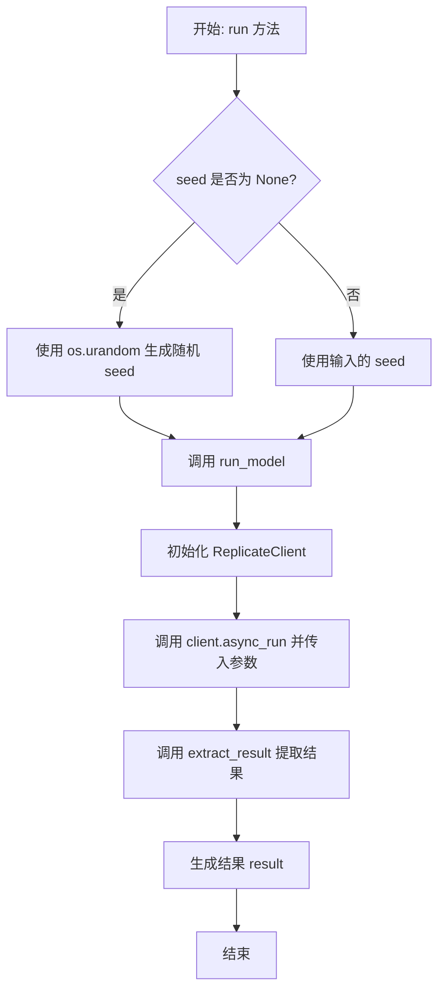
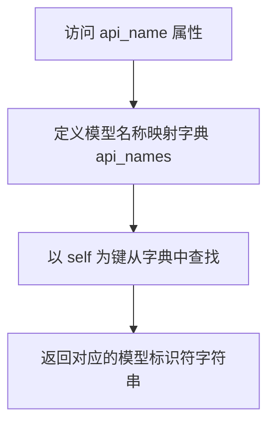
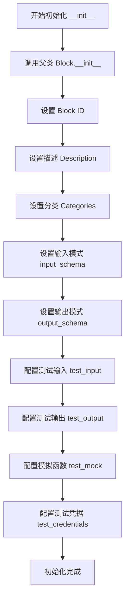
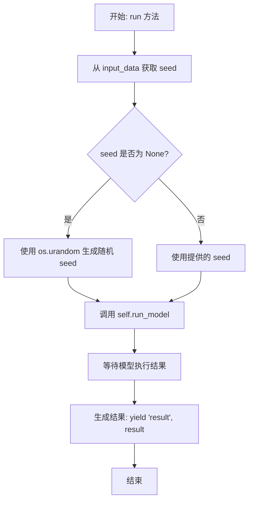
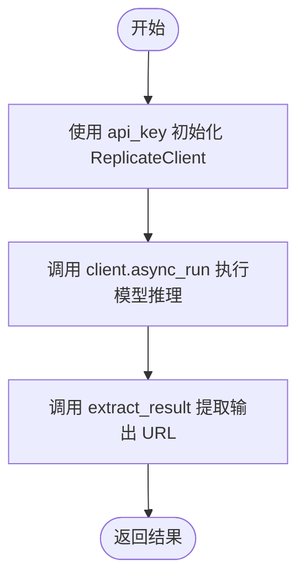

# `AutoGPT\autogpt_platform\backend\backend\blocks\replicate\flux_advanced.py` 详细设计文档

该代码实现了一个基于 Replicate 平台的 AI 图像生成块（ReplicateFluxAdvancedModelBlock），支持 Flux 系列模型。它定义了输入输出模型、枚举类型以及异步执行逻辑，允许用户通过配置提示词、随机种子、引导比例、长宽比等高级参数来生成图像，并处理 API 认证与结果提取。

## 整体流程



## 类结构

```
ReplicateFluxModelName (Enum)
ImageType (Enum)
ReplicateFluxAdvancedModelBlock (Block)
├── Input (BlockSchemaInput)
├── Output (BlockSchemaOutput)
├── __init__
├── run
└── run_model
```

## 全局变量及字段


### `ReplicateFluxModelName.FLUX_SCHNELL`
    
Enum member representing the Flux Schnell model.

类型：`ReplicateFluxModelName`
    


### `ReplicateFluxModelName.FLUX_PRO`
    
Enum member representing the Flux Pro model.

类型：`ReplicateFluxModelName`
    


### `ReplicateFluxModelName.FLUX_PRO1_1`
    
Enum member representing the Flux Pro 1.1 model.

类型：`ReplicateFluxModelName`
    


### `ImageType.WEBP`
    
Enum member representing the WebP image format.

类型：`ImageType`
    


### `ImageType.JPG`
    
Enum member representing the JPG image format.

类型：`ImageType`
    


### `ImageType.PNG`
    
Enum member representing the PNG image format.

类型：`ImageType`
    


### `ReplicateFluxAdvancedModelBlock.Input`
    
Nested class defining the input schema for the block, containing all configuration parameters.

类型：`BlockSchemaInput`
    


### `ReplicateFluxAdvancedModelBlock.Output`
    
Nested class defining the output schema for the block, containing the result.

类型：`BlockSchemaOutput`
    


### `ReplicateFluxAdvancedModelBlock.Input.credentials`
    
API key credentials for authenticating with the Replicate service.

类型：`ReplicateCredentialsInput`
    


### `ReplicateFluxAdvancedModelBlock.Input.prompt`
    
Text prompt for image generation.

类型：`str`
    


### `ReplicateFluxAdvancedModelBlock.Input.replicate_model_name`
    
The name of the Image Generation Model, e.g., Flux Schnell.

类型：`ReplicateFluxModelName`
    


### `ReplicateFluxAdvancedModelBlock.Input.seed`
    
Random seed used for reproducible generation.

类型：`int | None`
    


### `ReplicateFluxAdvancedModelBlock.Input.steps`
    
Number of diffusion steps for the generation process.

类型：`int`
    


### `ReplicateFluxAdvancedModelBlock.Input.guidance`
    
Controls the balance between adherence to the text prompt and image quality/diversity.

类型：`float`
    


### `ReplicateFluxAdvancedModelBlock.Input.interval`
    
Setting that increases the variance in possible outputs.

类型：`float`
    


### `ReplicateFluxAdvancedModelBlock.Input.aspect_ratio`
    
Aspect ratio for the generated image (e.g., 1:1, 16:9).

类型：`str`
    


### `ReplicateFluxAdvancedModelBlock.Input.output_format`
    
File format of the output image (e.g., webp, jpg, png).

类型：`ImageType`
    


### `ReplicateFluxAdvancedModelBlock.Input.output_quality`
    
Quality when saving the output images, ranging from 0 to 100.

类型：`int`
    


### `ReplicateFluxAdvancedModelBlock.Input.safety_tolerance`
    
Safety tolerance level, where 1 is most strict and 5 is most permissive.

类型：`int`
    


### `ReplicateFluxAdvancedModelBlock.Output.result`
    
The generated output, typically a URL to the image.

类型：`str`
    
    

## 全局函数及方法


### `ReplicateFluxModelName.api_name`

该属性方法用于将内部定义的模型枚举实例映射为 Replicate API 实际调用所需的模型标识符字符串。

参数：

-  `self`：`ReplicateFluxModelName`，枚举实例本身，作为字典查找的键。

返回值：`str`，对应模型在 Replicate API 上的名称路径（如 "black-forest-labs/flux-schnell"）。

#### 流程图



#### 带注释源码

```python
    @property
    def api_name(self):
        # 定义一个字典，将枚举成员映射到 Replicate API 使用的模型字符串标识符
        api_names = {
            ReplicateFluxModelName.FLUX_SCHNELL: "black-forest-labs/flux-schnell",
            ReplicateFluxModelName.FLUX_PRO: "black-forest-labs/flux-pro",
            ReplicateFluxModelName.FLUX_PRO1_1: "black-forest-labs/flux-1.1-pro",
        }
        # 使用当前枚举实例 (self) 作为键，返回对应的 API 模型名称
        return api_names[self]
```


### `ReplicateFluxAdvancedModelBlock.__init__`

初始化 ReplicateFluxAdvancedModelBlock 实例，配置其元数据、输入输出模式以及用于测试的模拟数据和凭据。

参数：

- `self`：`ReplicateFluxAdvancedModelBlock`，类的实例本身。

返回值：`None`，构造函数没有返回值。

#### 流程图



#### 带注释源码

```python
def __init__(self):
    # 调用父类 Block 的初始化方法，配置块的基本信息和测试环境
    super().__init__(
        # 块的唯一标识符
        id="90f8c45e-e983-4644-aa0b-b4ebe2f531bc",
        # 块的功能描述
        description="This block runs Flux models on Replicate with advanced settings.",
        # 块所属的分类：AI 和 多媒体
        categories={BlockCategory.AI, BlockCategory.MULTIMEDIA},
        # 定义块的输入数据结构模式，使用内部类 Input
        input_schema=ReplicateFluxAdvancedModelBlock.Input,
        # 定义块的输出数据结构模式，使用内部类 Output
        output_schema=ReplicateFluxAdvancedModelBlock.Output,
        # 预定义的测试输入数据，用于验证块的功能
        test_input={
            "credentials": TEST_CREDENTIALS_INPUT,
            "replicate_model_name": ReplicateFluxModelName.FLUX_SCHNELL,
            "prompt": "A beautiful landscape painting of a serene lake at sunrise",
            "seed": None,
            "steps": 25,
            "guidance": 3.0,
            "interval": 2.0,
            "aspect_ratio": "1:1",
            "output_format": ImageType.PNG,
            "output_quality": 80,
            "safety_tolerance": 2,
        },
        # 预期的测试输出结果，用于验证 run 方法的正确性
        test_output=[
            (
                "result",
                "https://replicate.com/output/generated-image-url.jpg",
            ),
        ],
        # 模拟函数对象，用于在测试环境中替代真实的 run_model 方法调用
        test_mock={
            "run_model": lambda api_key, model_name, prompt, seed, steps, guidance, interval, aspect_ratio, output_format, output_quality, safety_tolerance: "https://replicate.com/output/generated-image-url.jpg",
        },
        # 测试用的凭据对象
        test_credentials=TEST_CREDENTIALS,
    )
```


### `ReplicateFluxAdvancedModelBlock.run`

执行 Replicate Flux 模型的高级图像生成任务，处理输入数据并调用模型运行方法。

参数：

-  `input_data`：`Input`，包含提示词、模型名称及各种生成参数（如步长、引导系数等）的输入数据对象。
-  `credentials`：`APIKeyCredentials`，包含用于身份验证的 Replicate API 密钥。
-  `**kwargs`：`dict`，额外的上下文关键字参数。

返回值：`BlockOutput`，一个异步生成器，用于生成包含图像生成结果（通常是 URL）的键值对。

#### 流程图



#### 带注释源码

```python
    async def run(
        self, input_data: Input, *, credentials: APIKeyCredentials, **kwargs
    ) -> BlockOutput:
        # 如果未提供随机种子，则生成一个随机种子
        # 使用 os.urandom 生成 4 字节的随机数并转换为整数
        seed = input_data.seed
        if seed is None:
            seed = int.from_bytes(os.urandom(4), "big")

        # 使用提供的输入参数运行模型
        # 将配置和凭证传递给内部的 run_model 方法
        result = await self.run_model(
            api_key=credentials.api_key,
            model_name=input_data.replicate_model_name.api_name,
            prompt=input_data.prompt,
            seed=seed,
            steps=input_data.steps,
            guidance=input_data.guidance,
            interval=input_data.interval,
            aspect_ratio=input_data.aspect_ratio,
            output_format=input_data.output_format,
            output_quality=input_data.output_quality,
            safety_tolerance=input_data.safety_tolerance,
        )
        # 生成最终结果，键为 "result"，值为生成的图像 URL 或输出
        yield "result", result
```


### `ReplicateFluxAdvancedModelBlock.run_model`

该方法负责初始化 Replicate 客户端，使用提供的凭证和模型参数（如提示词、种子、步数等）在 Replicate 平台上异步运行 Flux 图像生成模型，并提取生成的图像结果 URL。

参数：

- `api_key`：`SecretStr`，Replicate API 的访问密钥，用于身份验证。
- `model_name`：`str`，要调用的 Replicate 模型标识符（例如 "black-forest-labs/flux-schnell"）。
- `prompt`：`str`，用于生成图像的文本提示词。
- `seed`：`int`，随机种子，用于确保生成结果的可复现性。
- `steps`：`int`，扩散步数，控制生成的迭代次数。
- `guidance`：`float`，引导系数，控制模型对文本提示词的依从程度。
- `interval`：`float`，间隔参数，用于增加输出结果的多样性。
- `aspect_ratio`：`str`，生成图像的宽高比（例如 "1:1"）。
- `output_format`：`ImageType`，输出图像的文件格式（如 webp, jpg, png）。
- `output_quality`：`int`，输出图像的质量（0-100）。
- `safety_tolerance`：`int`，安全容忍度（1为最严格，5为最宽松）。

返回值：`str`，生成的图像 URL 或结果路径。

#### 流程图



#### 带注释源码

```python
    async def run_model(
        self,
        api_key: SecretStr,
        model_name,
        prompt,
        seed,
        steps,
        guidance,
        interval,
        aspect_ratio,
        output_format,
        output_quality,
        safety_tolerance,
    ):
        # 使用提供的 API 密钥初始化 Replicate 客户端
        client = ReplicateClient(api_token=api_key.get_secret_value())

        # 使用指定的输入参数异步运行模型
        # wait=False 表示不自动等待流式数据完成，具体行为由 extract_result 处理
        output: ReplicateOutputs = await client.async_run(
            f"{model_name}",
            input={
                "prompt": prompt,
                "seed": seed,
                "steps": steps,
                "guidance": guidance,
                "interval": interval,
                "aspect_ratio": aspect_ratio,
                "output_format": output_format,
                "output_quality": output_quality,
                "safety_tolerance": safety_tolerance,
            },
            wait=False,
        )

        # 从原始输出中提取最终结果（通常是图片 URL）
        result = extract_result(output)

        return result
```


## 关键组件


### ReplicateFluxModelName 枚举

管理支持的 Flux 模型版本（如 Flux Schnell, Pro, Pro 1.1），并提供将内部枚举值映射到 Replicate API 特定模型标识符的机制。

### 块模式定义

定义了 ReplicateFluxAdvancedModelBlock 的输入和输出数据契约，封装了包括凭证、提示词、生成参数（步数、引导系数、宽高比等）及输出格式在内的所有配置字段。

### 异步执行编排

负责协调整个图像生成的工作流，包括处理随机种子的生成逻辑、聚合输入参数，并调用底层模型运行函数以异步方式输出结果。

### 外部 API 集成层

封装与 Replicate 服务的交互细节，负责初始化认证客户端、构建 API 请求参数、执行异步模型推理调用，并处理原始输出的提取。


## 问题及建议


### 已知问题

-   **类型覆盖不当**：在 `run_model` 方法中使用了 `# type: ignore` 注释来忽略 `async_run` 返回类型的检查。这表明代码的类型定义与 `replicate` 库的实际行为不匹配，掩盖了潜在的类型安全问题，可能导致运行时错误。
-   **API 行为处理不明确**：代码注释中表达了对 `wait=False` 参数返回值的不确定（`what is this api`），以及对返回值可能是 `data:octect/stream` 或 URL 的困惑。这显示了对第三方库行为的处理逻辑存在不确定性或黑盒依赖，可能导致某些边缘情况下的处理失败。
-   **缺乏异常处理机制**：整个运行流程中未包含 `try-except` 块。如果 Replicate API 调用失败（例如网络中断、API Key 无效、额度超限或模型内部错误），程序将直接抛出未处理的异常，导致流程中断且无法给用户提供友好的错误反馈。
-   **输入验证不够严格**：`aspect_ratio` 字段被定义为通用的 `str` 类型。尽管描述中列出了可选值，但 Schema 层面并未强制约束，用户极易输入无效的宽高比字符串，导致后续 API 调用失败。
-   **方法签名缺失类型注解**：`run_model` 方法的参数定义缺少类型提示，这与 `run` 方法形成了反差，降低了代码的一致性和可维护性。

### 优化建议

-   **引入显式异常处理**：在 `run_model` 方法中增加针对网络请求、认证及 API 响应错误的 `try-except` 处理逻辑，捕获特定异常并将其转换为结构化的错误输出或日志，提升系统的健壮性。
-   **加强类型安全**：移除 `# type: ignore` 注释，通过定义明确的类型接口（Interface）或使用 `typing.overload` 来处理 `ReplicateClient` 的多态返回类型，确保静态类型检查工具能正确发挥作用。
-   **严格化输入 Schema**：将 `aspect_ratio` 字段的类型从 `str` 修改为 `Enum` 或 Python 3.8+ 的 `Literal` 类型，在数据进入 Block 之前就进行合法校验，防止非法参数传递给下游 API。
-   **完善代码注解**：为 `run_model` 方法及其所有参数补充完整的类型注解，提升代码的可读性，并利用 IDE 的自动补全和静态检查功能。
-   **增加日志记录**：在初始化客户端、发起请求和获取结果的关键节点添加日志记录，便于在生产环境中排查问题及追踪请求状态。


## 其它


### 设计目标与约束

设计目标是将 Replicate 的 Flux 模型封装为一个标准化的、可复用的异步执行块，以便在自动化工作流中通过简单的参数配置生成图像。主要约束包括：
1.  **接口规范**：必须继承自 `Block` 基类并实现 `run` 方法，严格遵循框架定义的输入输出 Schema（`BlockSchemaInput`, `BlockSchemaOutput`）。
2.  **异步执行**：为了不阻塞事件循环，与外部 Replicate API 的交互必须使用异步调用（`async_run`）。
3.  **参数兼容性**：参数传递必须符合 Replicate API 的具体要求，例如模型版本标识符、特定的参数键名（如 `aspect_ratio`, `safety_tolerance`）。
4.  **随机性控制**：在用户未指定种子（Seed）的情况下，系统需保证每次生成的随机性，但在指定种子时需保证结果可复现。

### 错误处理与异常设计

1.  **输入验证**：利用 Pydantic 模型在 `run` 方法执行前自动验证输入数据的类型和格式（如 `guidance` 必须为浮点数，`steps` 必须为整数）。
2.  **运行时异常**：
    *   **网络/API 错误**：`run_model` 方法中调用 `client.async_run` 时，可能会抛出网络连接错误或 Replicate API 返回的业务错误（如 401 未授权，429 限流）。当前设计未捕获这些异常，允许其向上传播，由上层的任务调度器或工作流引擎进行统一的重试或记录处理。
    *   **结果提取错误**：`extract_result` 辅助函数如果无法从返回对象中解析出 URL，可能会抛出异常，同样交由上层处理。
3.  **密钥安全**：通过 `SecretStr` 封装 API Key，防止在日志或调试信息中意外泄露敏感凭证。

### 数据流与状态机

**数据流**：
1.  用户/上游系统提供配置参数（Prompt, Credentials, Model Name 等）。
2.  数据进入 `ReplicateFluxAdvancedModelBlock.Input` 进行 Schema 校验。
3.  校验后的数据流入 `run` 方法。
4.  若 `seed` 为空，通过系统熵源生成随机整数；否则保留原值。
5.  所有参数汇聚于 `run_model` 方法。
6.  `ReplicateClient` 将参数发送至 Replicate 远程服务。
7.  远程服务返回原始输出对象。
8.  `extract_result` 辅助函数解析对象，提取出图像 URL 字符串。
9.  URL 字符串通过生成器产出，作为 `BlockOutput`。

**状态机**：
该 Block 是无状态的计算单元，其微观执行生命周期状态流转如下：
*   **Idle (空闲)**：Block 实例化，等待调用。
*   **Validating (验证中)**：接收输入，Pydantic 进行结构验证。
*   **Processing (处理中)**：执行 `run_model`，等待 Replicate API 响应（异步挂起状态）。
*   **Completed (完成)**：成功产出结果 URL。
*   **Failed (失败)**：在验证、网络请求或结果解析过程中抛出异常。

### 外部依赖与接口契约

**外部依赖**：
*   `replicate` (ReplicateClient): 官方 Python SDK，用于与 Replicate API 进行通信。
*   `pydantic` (SecretStr, BaseModel): 用于数据校验和敏感信息处理。
*   `backend` 内部模块: 依赖框架提供的 `Block` 基类、数据模型和工具函数。

**接口契约**：
*   **与 Replicate API 的契约**：
    *   **输入**：必须包含 `prompt`、`aspect_ratio` 等特定键值的字典。`api_token` 必须有效。
    *   **行为**：调用 `client.async_run(model_version, input={...}, wait=False)`。
    *   **输出**：返回一个迭代器或对象，经过 `extract_result` 处理后预期包含图像 URL 字符串。
*   **与框架的契约**：
    *   `run` 方法必须是一个异步生成器（`AsyncGenerator`），产出 `(name, value)` 元组。

### 安全性设计

1.  **凭证保护**：API Key 通过 `ReplicateCredentialsInput` 传入，并在内存中以 `SecretStr` 类型存储。仅在调用 `ReplicateClient` 构造函数时，通过 `get_secret_value()` 明文解密一次，且不进行日志打印。
2.  **输入清洗**：虽然依赖 Pydantic 进行类型检查，但所有字符串输入（如 `prompt`）直接传递给第三方 API。假设 Replicate API 自身具备对抗注入攻击的机制。
3.  **随机数生成**：使用 `os.urandom` 结合 `int.from_bytes` 生成种子，相比伪随机数生成器具有更高的熵和不可预测性，适合安全敏感的生成任务。


    