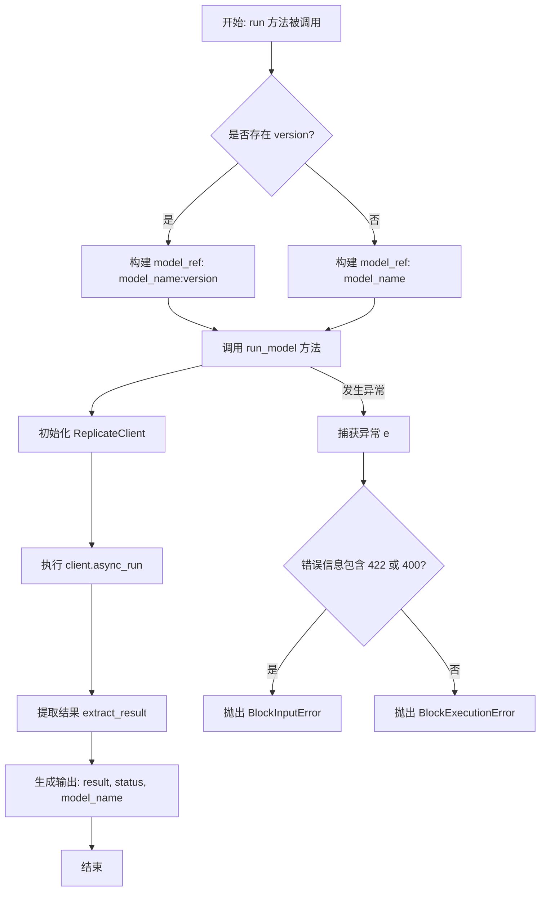
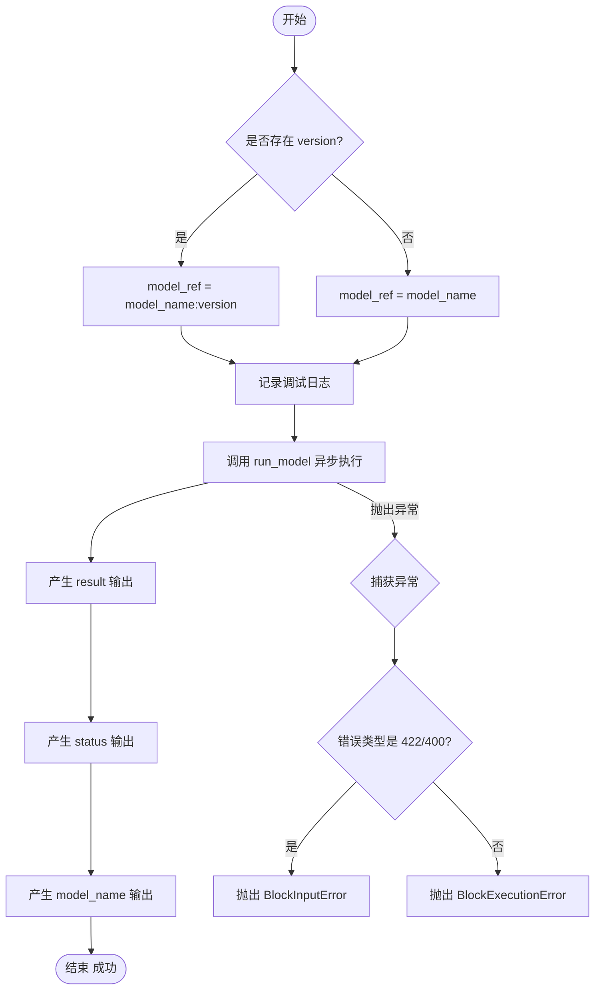
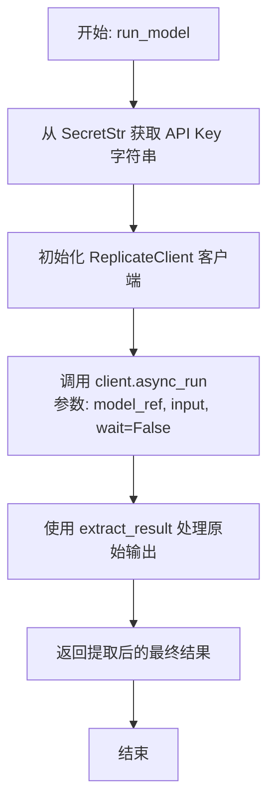

# `AutoGPT\autogpt_platform\backend\backend\blocks\replicate\replicate_block.py` 详细设计文档

该代码实现了一个名为 ReplicateModelBlock 的组件，用于通过自定义输入和凭证同步执行 Replicate 平台上的任意公共模型，包含输入验证、模型版本指定以及结构化输出处理和异常映射功能。

## 整体流程



## 类结构

```
Block (父类)
└── ReplicateModelBlock
    ├── Input (内部类/输入模式)
    └── Output (内部类/输出模式)
```

## 全局变量及字段


### `logger`
    
Logger instance for this module.

类型：`logging.Logger`
    


### `ReplicateModelBlock.Input`
    
Input schema definition for the Replicate model block.

类型：`BlockSchemaInput`
    


### `ReplicateModelBlock.Output`
    
Output schema definition for the Replicate model block.

类型：`BlockSchemaOutput`
    


### `ReplicateModelBlock.Input.credentials`
    
Enter your Replicate API key to access the model API. You can obtain an API key from https://replicate.com/account/api-tokens.

类型：`ReplicateCredentialsInput`
    


### `ReplicateModelBlock.Input.model_name`
    
The Replicate model name (format: 'owner/model-name')

类型：`str`
    


### `ReplicateModelBlock.Input.model_inputs`
    
Dictionary of inputs to pass to the model

类型：`dict[str, str | int]`
    


### `ReplicateModelBlock.Input.version`
    
Specific version hash of the model (optional)

类型：`Optional[str]`
    


### `ReplicateModelBlock.Output.result`
    
The output from the Replicate model

类型：`str`
    


### `ReplicateModelBlock.Output.status`
    
Status of the prediction

类型：`str`
    


### `ReplicateModelBlock.Output.model_name`
    
Name of the model used

类型：`str`
    
    

## 全局函数及方法


### `ReplicateModelBlock.__init__`

初始化 `ReplicateModelBlock` 类实例，通过调用父类构造函数配置块的唯一标识、描述、分类、输入输出模式以及测试参数。

参数：

- `self`：`ReplicateModelBlock`，表示类实例本身。

返回值：`None`，无返回值。

#### 流程图

```mermaid
flowchart TD
    A[开始: __init__] --> B[调用 super().__init__]
    B --> C[传递配置参数给父类 Block]
    C --> C1[id: 块唯一标识符]
    C --> C2[description: 描述文本]
    C --> C3[categories: 块分类]
    C --> C4[input_schema: 输入模式类]
    C --> C5[output_schema: 输出模式类]
    C --> C6[test_input: 测试输入数据]
    C --> C7[test_credentials: 测试凭据]
    C --> C8[test_output: 测试输出结构]
    C --> C9[test_mock: 测试模拟函数]
    C9 --> D[结束: 初始化完成]
```

#### 带注释源码

```python
def __init__(self):
    # 调用父类 Block 的构造函数，初始化块的基本配置和元数据
    super().__init__(
        # 块的唯一标识符
        id="c40d75a2-d0ea-44c9-a4f6-634bb3bdab1a",
        # 块的功能描述
        description="Run Replicate models synchronously",
        # 块所属的分类（AI类别）
        categories={BlockCategory.AI},
        # 定义输入数据的结构模式，使用内部类 Input
        input_schema=ReplicateModelBlock.Input,
        # 定义输出数据的结构模式，使用内部类 Output
        output_schema=ReplicateModelBlock.Output,
        # 定义用于测试的输入数据样本
        test_input={
            "credentials": TEST_CREDENTIALS_INPUT,
            "model_name": "meta/llama-2-7b-chat",
            "model_inputs": {"prompt": "Hello, world!", "max_new_tokens": 50},
        },
        # 定义用于测试的API凭据
        test_credentials=TEST_CREDENTIALS,
        # 定义预期的测试输出结构
        test_output=[
            ("result", str),
            ("status", str),
            ("model_name", str),
        ],
        # 定义测试时的模拟函数，用于模拟 run_model 方法的行为
        test_mock={
            "run_model": lambda model_ref, model_inputs, api_key: (
                "Mock response from Replicate model"
            )
        },
    )
```


### `ReplicateModelBlock.run`

Execute the Replicate model with the provided inputs.

参数：

- `input_data`: `Input`, The input data containing model name and inputs
- `credentials`: `APIKeyCredentials`, The API credentials

返回值：`BlockOutput`, BlockOutput containing the model results and metadata

#### 流程图



#### 带注释源码

```python
async def run(
    self, input_data: Input, *, credentials: APIKeyCredentials, **kwargs
) -> BlockOutput:
    """
    Execute the Replicate model with the provided inputs.

    Args:
        input_data: The input data containing model name and inputs
        credentials: The API credentials

    Yields:
        BlockOutput containing the model results and metadata
    """
    try:
        # 根据是否提供了特定版本号，构建模型引用字符串
        if input_data.version:
            model_ref = f"{input_data.model_name}:{input_data.version}"
        else:
            model_ref = input_data.model_name
        
        # 记录正在运行的模型信息，便于调试
        logger.debug(f"Running Replicate model: {model_ref}")
        
        # 调用 run_model 方法异步执行模型，传入模型引用、输入数据和 API Key
        result = await self.run_model(
            model_ref, input_data.model_inputs, credentials.api_key
        )
        
        # 输出模型运行结果
        yield "result", result
        # 输出运行状态为成功
        yield "status", "succeeded"
        # 输出所使用的模型名称
        yield "model_name", input_data.model_name
    except Exception as e:
        error_msg = str(e)
        # 记录错误日志
        logger.error(f"Error running Replicate model: {error_msg}")

        # 针对输入验证错误（HTTP 422 或 400），抛出 BlockInputError
        if (
            "422" in error_msg
            or "Input validation failed" in error_msg
            or "400" in error_msg
        ):
            raise BlockInputError(
                message=f"Invalid model inputs: {error_msg}",
                block_name=self.name,
                block_id=self.id,
            ) from e
        # 针对其他错误，抛出通用的 BlockExecutionError
        else:
            raise BlockExecutionError(
                message=f"Replicate model error: {error_msg}",
                block_name=self.name,
                block_id=self.id,
            ) from e
```


### `ReplicateModelBlock.run_model`

运行 Replicate 模型。此方法设计为可被 mock 以用于测试。

参数：

-  `model_ref`：`str`，模型引用（例如 "owner/model-name:version"）
-  `model_inputs`：`dict`，传递给模型的输入参数字典
-  `api_key`：`SecretStr`，Replicate API 密钥，以安全字符串形式存储

返回值：`Any`，从 Replicate 模型输出对象中提取的结果（通常为字符串或列表）

#### 流程图



#### 带注释源码

```python
    async def run_model(self, model_ref: str, model_inputs: dict, api_key: SecretStr):
        """
        Run the Replicate model. This method can be mocked for testing.

        Args:
            model_ref: The model reference (e.g., "owner/model-name:version")
            model_inputs: The inputs to pass to the model
            api_key: The Replicate API key as SecretStr

        Returns:
            Tuple of (result, prediction_id)
        """
        # 从 SecretStr 对象中提取明文的 API Key 字符串
        api_key_str = api_key.get_secret_value()
        # 使用提取的 API Key 初始化 Replicate 客户端实例
        client = ReplicateClient(api_token=api_key_str)
        # 异步运行模型，传入模型引用、输入参数，并设置 wait=False 表示不阻塞等待完成
        output: ReplicateOutputs = await client.async_run(
            model_ref, input=model_inputs, wait=False
        )  # type: ignore they suck at typing

        # 调用辅助函数从原始输出对象中提取实际结果数据
        result = extract_result(output)

        # 返回提取后的结果
        return result
```


## 关键组件


### ReplicateModelBlock
核心执行单元，封装了与 Replicate API 交互的逻辑，包括模型引用构建、异步执行调用和结果提取。

### Input Schema
定义了块运行所需的数据契约，包含凭证、模型名称、输入参数字典和版本哈希，用于验证用户输入。

### Output Schema
定义了块的标准化输出结构，包含模型运行的结果字符串、执行状态和使用的模型名称。

### Replicate Client
外部依赖组件，用于构建 API 客户端实例，处理与 Replicate 服务的底层异步通信。

### Exception Handling
错误处理逻辑，通过捕获运行时异常并分析错误码（如 422, 400），将 API 错误转换为具体的 `BlockInputError` 或 `BlockExecutionError`。


## 问题及建议


### 已知问题

-   **同步执行逻辑与异步 API 调用存在冲突**：代码描述为“同步运行”（`Run Replicate models synchronously`），但在 `run_model` 方法中调用 `client.async_run` 时使用了 `wait=False`。这会导致该方法立即返回一个尚未完成的 Prediction 对象，而不是模型的实际输出结果。除非 `extract_result` 函数内部实现了轮询等待逻辑，否则 `result` 将无法获取到预期的模型输出。
-   **异常处理机制脆弱**：在 `run` 方法中，通过字符串匹配（如检查错误信息中是否包含 "422" 或 "400"）来区分 `BlockInputError` 和 `BlockExecutionError`。这种方式非常不可靠，容易因为底层库错误消息格式的变更而导致异常分类错误。
-   **文档描述与代码实现不一致**：`run_model` 方法的文档字符串声称返回类型为 "Tuple of (result, prediction_id)"，但实际代码仅返回了 `result`，缺乏 `prediction_id` 的返回。
-   **输入类型定义过于严格**：`Input` 类中的 `model_inputs` 字段类型被定义为 `dict[str, str | int]`。实际上，许多 Replicate 模型的输入参数包含浮点数、布尔值、数组或嵌套字典，当前的类型定义限制了其通用性。

### 优化建议

-   **修正 API 调用等待逻辑**：将 `client.async_run` 的 `wait` 参数设置为 `True`（如果 SDK 默认支持），或者在调用后实现显式的轮询逻辑，以确保在 `extract_result` 执行前 Prediction 已完成，从而保证返回的是实际的模型结果而非空对象。
-   **引入结构化异常处理**：捕获 `replicate` 库抛出的特定异常类型（如 `replicate.exceptions.ModelError` 或 `replicate.exceptions.ValidationError`），而不是依赖字符串匹配来判断错误类型，以提高代码的健壮性。
-   **优化客户端实例管理**：`ReplicateClient` 当前在每次 `run_model` 调用时都重新初始化。建议将其作为类成员变量或通过依赖注入的方式管理，以提高连接复用率并减少开销。
-   **放宽输入类型限制**：将 `model_inputs` 的类型注解修改为 `dict[str, Any]` 或更通用的 JSON 类型，以支持浮点数、列表等复杂参数类型，确保 Block 能适配更多种类的模型。


## 其它


### 设计目标与约束

**设计目标**：
1.  **通用性与灵活性**：设计一个通用的执行块，能够支持 Replicate 平台上任意公开模型的调用，允许用户动态传入模型名称和自定义的输入参数字典。
2.  **版本控制**：支持通过版本哈希锁定特定模型版本，同时也支持使用默认最新版本，以满足不同稳定性和功能需求。
3.  **结构化输出**：标准化输出格式，除了核心的模型运行结果外，还强制包含执行状态（status）和模型名称（model_name），便于下游追踪和处理。
4.  **异步兼容性**：基于 `async/await` 异步编程模型设计，以适应高并发和非阻塞 I/O 的应用场景。

**约束**：
1.  **外部依赖**：强依赖 Replicate 官方 API 的可用性和响应速度，必须持有有效的 API Key 才能运行。
2.  **输入格式限制**：`model_inputs` 必须符合目标 Replicate 模型的具体接口定义，否则会导致 API 调用失败。
3.  **执行环境**：必须在支持 Python `asyncio` 的环境中运行，且需要安装 `replicate` 和 `pydantic` 第三方库。

### 错误处理与异常设计

**设计策略**：
代码采用集中式异常捕获与业务异常映射策略。在 `run` 方法的顶层捕获所有底层异常，解析错误信息，并将其转化为平台定义的标准业务异常类型。

**异常映射逻辑**：
1.  **输入验证错误**：当捕获到异常且错误消息中包含 `422`（Unprocessable Entity）、`400`（Bad Request）或特定文本 "Input validation failed" 时，判定为用户输入参数不合法。此时抛出 `BlockInputError`，提示用户检查输入配置。
2.  **执行错误**：对于其他类型的异常（如网络错误、500 服务器错误、认证失败等），统一抛出 `BlockExecutionError`，表示在模型执行过程中发生的系统级或运行时错误。

**日志记录**：
无论捕获何种异常，均会通过 `logger.error` 记录详细的错误堆栈信息，确保问题可追溯，同时将原始异常对象链接到新抛出的异常上（`raise ... from e`）。

### 数据流

1.  **初始化阶段**：
    *   实例化 `ReplicateModelBlock`，定义输入模式，包括凭证、模型名称、输入字典和版本号。
2.  **输入处理阶段**：
    *   `run` 方法接收 `input_data` 和 `credentials`。
    *   检查是否存在 `version` 字段，据此构建 `model_ref`（格式为 `owner/name:hash` 或 `owner/name`）。
3.  **执行阶段**：
    *   调用 `run_model` 方法，将 `SecretStr` 类型的 API Key 转换为明文字符串。
    *   初始化 `ReplicateClient`。
    *   调用 `client.async_run` 发起异步推理请求，`wait=False` 表示非阻塞调用（具体等待逻辑依赖于 `extract_result`）。
4.  **输出处理阶段**：
    *   通过 `extract_result` 辅助函数从 API 返回对象中提取核心结果。
    *   通过 Python 生成器依次产出 `result`（模型结果）、`status`（固定字符串 "succeeded"）和 `model_name`。
5.  **异常分支**：
    *   若在步骤 2-4 中发生异常，进入异常处理流程，记录日志并抛出对应的 `BlockInputError` 或 `BlockExecutionError`，中断数据流。

### 外部依赖与接口契约

**外部依赖**：
*   **Replicate Client (`replicate.client`)**：核心依赖，用于与 Replicate API 进行网络交互。
*   **Pydantic (`pydantic`)**：用于数据模型验证，特别是使用 `SecretStr` 来安全处理敏感的 API Key。
*   **内部基础库**：依赖 `backend.data.block` 中的 `Block` 基类、`BlockOutput` 等核心类型定义。

**接口契约**：
*   **`ReplicateClient.async_run(model_ref, input, wait)`**：
    *   **输入**：模型引用字符串、输入参数字典、布尔类型的等待标志。
    *   **输出**：返回一个对象（代码中标注为 `ReplicateOutputs`），该对象需能被 `extract_result` 函数解析。
*   **`extract_result(output: ReplicateOutputs)`**：
    *   **契约**：接收 `ReplicateClient` 返回的原始对象，处理异步等待逻辑（如果 API 未立即完成），并提取最终的文本或结构化结果。
*   **凭证接口**：
    *   必须实现 `APIKeyCredentials` 接口，提供 `api_key` 字段，且该字段必须支持 `.get_secret_value()` 方法（Pydantic `SecretStr` 特性）。

### 安全性与访问控制

1.  **敏感数据保护**：使用 `pydantic.SecretStr` 类型存储 API Key。在打印日志或对象序列化时，该类型会自动隐藏字符串内容，防止凭据泄露。
2.  **凭证注入**：通过依赖注入的方式将 `credentials` 对象传递给 `run` 方法，而不是硬编码或从全局不安全存储中读取。
3.  **错误信息脱敏**：虽然代码记录了详细的错误信息，但在抛出给用户的 `BlockInputError` 和 `BlockExecutionError` 消息中，仅包含错误描述和上下文，避免了原始异常堆栈直接暴露给前端用户，保护系统内部结构。


    