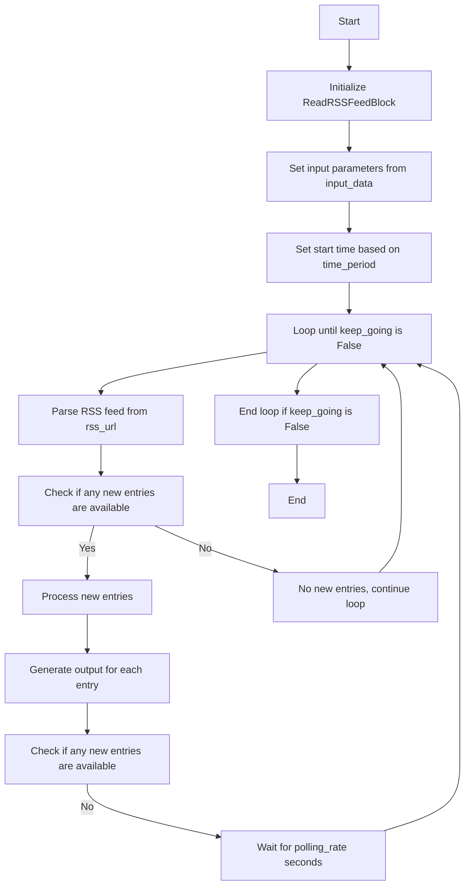
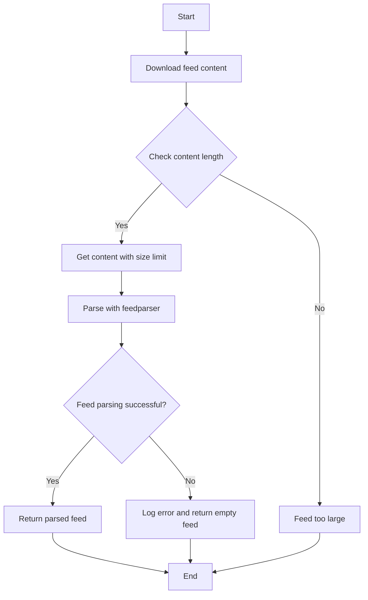
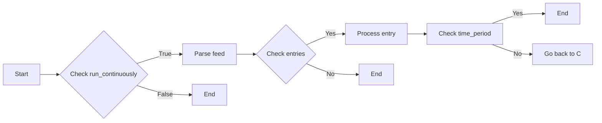
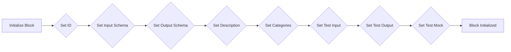
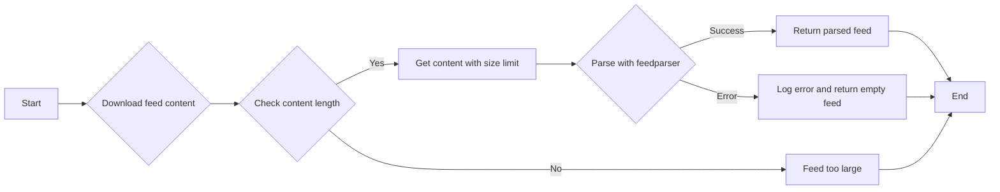
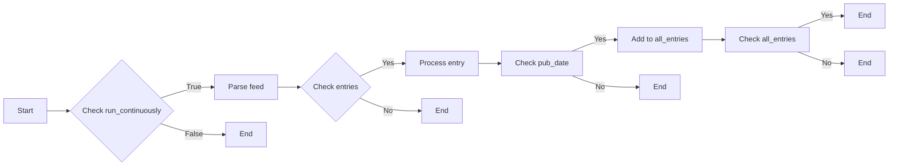

# `.\AutoGPT\autogpt_platform\backend\backend\blocks\rss.py` 详细设计文档

The code defines a class to read RSS feed entries from a given URL and process them based on specified parameters.

## 整体流程



## 类结构

```
ReadRSSFeedBlock (Concrete Block)
├── Input (BlockSchemaInput)
│   ├── rss_url (str)
│   ├── time_period (int)
│   ├── polling_rate (int)
│   └── run_continuously (bool)
└── Output (BlockSchemaOutput)
    ├── entry (RSSEntry)
    └── entries (list[RSSEntry])
```

## 全局变量及字段


### `MAX_FEED_SIZE`
    
Maximum allowed size of the RSS feed content in bytes to prevent memory exhaustion attacks.

类型：`int`
    


### `Requests`
    
Class used to make HTTP requests with error handling.

类型：`Requests`
    


### `Block`
    
Base class for blocks in the system, providing common functionality and metadata.

类型：`Block`
    


### `BlockCategory`
    
Enum defining categories for blocks.

类型：`BlockCategory`
    


### `BlockOutput`
    
Schema for the output of blocks.

类型：`BlockSchemaOutput`
    


### `BlockSchemaInput`
    
Schema for the input of blocks.

类型：`BlockSchemaInput`
    


### `BlockSchemaOutput`
    
Schema for the output of blocks.

类型：`BlockSchemaOutput`
    


### `SchemaField`
    
Class used to define fields in schemas with metadata.

类型：`SchemaField`
    


### `datetime`
    
Standard Python datetime module for handling date and time operations.

类型：`datetime`
    


### `timedelta`
    
Standard Python timedelta module for representing differences between datetime objects.

类型：`timedelta`
    


### `timezone`
    
Standard Python timezone module for handling time zones.

类型：`timezone`
    


### `feedparser`
    
Library for parsing RSS and Atom feeds.

类型：`feedparser`
    


### `logging`
    
Standard Python logging module for recording log messages.

类型：`logging`
    


### `asyncio`
    
Standard Python asyncio module for writing concurrent code using the async/await syntax.

类型：`asyncio`
    


### `RSSEntry.title`
    
Title of the RSS entry.

类型：`str`
    


### `RSSEntry.link`
    
Link to the RSS entry.

类型：`str`
    


### `RSSEntry.description`
    
Description of the RSS entry.

类型：`str`
    


### `RSSEntry.pub_date`
    
Publication date of the RSS entry.

类型：`datetime`
    


### `RSSEntry.author`
    
Author of the RSS entry.

类型：`str`
    


### `RSSEntry.categories`
    
Categories of the RSS entry.

类型：`list[str]`
    


### `ReadRSSFeedBlock.Input.rss_url`
    
The URL of the RSS feed to read.

类型：`str`
    


### `ReadRSSFeedBlock.Input.time_period`
    
The time period to check in minutes relative to the run block runtime.

类型：`int`
    


### `ReadRSSFeedBlock.Input.polling_rate`
    
The number of seconds to wait between polling attempts.

类型：`int`
    


### `ReadRSSFeedBlock.Input.run_continuously`
    
Whether to run the block continuously or just once.

类型：`bool`
    


### `ReadRSSFeedBlock.Output.entry`
    
The RSS item.

类型：`RSSEntry`
    


### `ReadRSSFeedBlock.Output.entries`
    
List of all RSS entries.

类型：`list[RSSEntry]`
    


### `ReadRSSFeedBlock.id`
    
Unique identifier for the block.

类型：`str`
    


### `ReadRSSFeedBlock.input_schema`
    
Schema for the input of the block.

类型：`BlockSchemaInput`
    


### `ReadRSSFeedBlock.output_schema`
    
Schema for the output of the block.

类型：`BlockSchemaOutput`
    


### `ReadRSSFeedBlock.description`
    
Description of the block.

类型：`str`
    


### `ReadRSSFeedBlock.categories`
    
Categories of the block.

类型：`set[BlockCategory]`
    


### `ReadRSSFeedBlock.test_input`
    
Test input data for the block.

类型：`dict`
    


### `ReadRSSFeedBlock.test_output`
    
Test output data for the block.

类型：`list`
    


### `ReadRSSFeedBlock.test_mock`
    
Test mock data for the block.

类型：`dict`
    
    

## 全局函数及方法


### `parse_feed`

This function parses an RSS feed from a given URL and returns a dictionary containing the parsed feed entries.

参数：

- `url`：`str`，The URL of the RSS feed to read. This is the location from which the RSS feed content will be fetched.

返回值：`dict[str, Any]`，A dictionary containing the parsed feed entries. If parsing fails, an empty dictionary with an empty list of entries is returned.

#### 流程图



#### 带注释源码

```python
@staticmethod
async def parse_feed(url: str) -> dict[str, Any]:
    # Security fix: Add protection against memory exhaustion attacks
    MAX_FEED_SIZE = 10 * 1024 * 1024  # 10MB limit for RSS feeds

    # Download feed content with size limit
    try:
        response = await Requests(raise_for_status=True).get(url)

        # Check content length if available
        content_length = response.headers.get("Content-Length")
        if content_length and int(content_length) > MAX_FEED_SIZE:
            raise ValueError(
                f"Feed too large: {content_length} bytes exceeds {MAX_FEED_SIZE} limit"
            )

        # Get content with size limit
        content = response.content
        if len(content) > MAX_FEED_SIZE:
            raise ValueError(f"Feed too large: exceeds {MAX_FEED_SIZE} byte limit")

        # Parse with feedparser using the validated content
        # feedparser has built-in protection against XML attacks
        return feedparser.parse(content)  # type: ignore
    except Exception as e:
        # Log error and return empty feed
        logging.warning(f"Failed to parse RSS feed from {url}: {e}")
        return {"entries": []}
```


### `ReadRSSFeedBlock.run`

This method runs the RSS feed reading process for the `ReadRSSFeedBlock` class, continuously polling for new entries based on the specified time period and polling rate.

参数：

- `input_data`：`Input`，The input data for the block, containing the RSS feed URL, time period, polling rate, and whether to run continuously.
- `**kwargs`：`Any`，Additional keyword arguments that may be passed to the method.

返回值：`BlockOutput`，The output of the block, containing the RSS entries.

#### 流程图



#### 带注释源码

```python
async def run(self, input_data: Input, **kwargs) -> BlockOutput:
    keep_going = True
    start_time = datetime.now(timezone.utc) - timedelta(minutes=input_data.time_period)
    while keep_going:
        keep_going = input_data.run_continuously

        feed = await self.parse_feed(input_data.rss_url)
        all_entries = []

        for entry in feed["entries"]:
            pub_date = datetime(*entry["published_parsed"][:6], tzinfo=timezone.utc)

            if pub_date > start_time:
                rss_entry = RSSEntry(
                    title=entry["title"],
                    link=entry["link"],
                    description=entry.get("summary", ""),
                    pub_date=pub_date,
                    author=entry.get("author", ""),
                    categories=[tag["term"] for tag in entry.get("tags", [])],
                )
                all_entries.append(rss_entry)
                yield "entry", rss_entry

        yield "entries", all_entries
        await asyncio.sleep(input_data.polling_rate)
```


### `ReadRSSFeedBlock.__init__`

This method initializes the `ReadRSSFeedBlock` class, setting up its configuration and schema for processing RSS feed entries.

参数：

- `id`: `str`，The unique identifier for the block.
- `input_schema`: `BlockSchemaInput`，The input schema for the block.
- `output_schema`: `BlockSchemaOutput`，The output schema for the block.
- `description`: `str`，A description of the block's functionality.
- `categories`: `set`，A set of categories that the block belongs to.
- `test_input`: `dict`，A sample input for testing the block.
- `test_output`: `list`，A sample output for testing the block.
- `test_mock`: `dict`，Mock data for testing the block.

返回值：无，This method does not return any value.

#### 流程图



#### 带注释源码

```python
def __init__(self):
    super().__init__(
        id="5ebe6768-8e5d-41e3-9134-1c7bd89a8d52",
        input_schema=ReadRSSFeedBlock.Input,
        output_schema=ReadRSSFeedBlock.Output,
        description="Reads RSS feed entries from a given URL.",
        categories={BlockCategory.INPUT},
        test_input={
            "rss_url": "https://example.com/rss",
            "time_period": 10_000_000,
            "polling_rate": 1,
            "run_continuously": False,
        },
        test_output=[
            (
                "entry",
                RSSEntry(
                    title="Example RSS Item",
                    link="https://example.com/article",
                    description="This is an example RSS item description.",
                    pub_date=datetime(2023, 6, 23, 12, 30, 0, tzinfo=timezone.utc),
                    author="John Doe",
                    categories=["Technology", "News"],
                ),
            ),
            (
                "entries",
                [
                    RSSEntry(
                        title="Example RSS Item",
                        link="https://example.com/article",
                        description="This is an example RSS item description.",
                        pub_date=datetime(
                            2023, 6, 23, 12, 30, 0, tzinfo=timezone.utc
                        ),
                        author="John Doe",
                        categories=["Technology", "News"],
                    ),
                ],
            ),
        ],
        test_mock={
            "parse_feed": lambda *args, **kwargs: {
                "entries": [
                    {
                        "title": "Example RSS Item",
                        "link": "https://example.com/article",
                        "summary": "This is an example RSS item description.",
                        "published_parsed": (2023, 6, 23, 12, 30, 0, 4, 174, 0),
                        "author": "John Doe",
                        "tags": [{"term": "Technology"}, {"term": "News"}],
                    }
                ]
            }
        },
    )
```


### ReadRSSFeedBlock.parse_feed

This function parses an RSS feed from a given URL and returns a dictionary containing the parsed feed entries.

参数：

- `url`：`str`，The URL of the RSS feed to read. This is the location from which the RSS feed content is fetched.

返回值：`dict[str, Any]`，A dictionary containing the parsed feed entries. If an error occurs, an empty dictionary is returned.

#### 流程图



#### 带注释源码

```python
@staticmethod
async def parse_feed(url: str) -> dict[str, Any]:
    # Security fix: Add protection against memory exhaustion attacks
    MAX_FEED_SIZE = 10 * 1024 * 1024  # 10MB limit for RSS feeds

    # Download feed content with size limit
    try:
        response = await Requests(raise_for_status=True).get(url)

        # Check content length if available
        content_length = response.headers.get("Content-Length")
        if content_length and int(content_length) > MAX_FEED_SIZE:
            raise ValueError(
                f"Feed too large: {content_length} bytes exceeds {MAX_FEED_SIZE} limit"
            )

        # Get content with size limit
        content = response.content
        if len(content) > MAX_FEED_SIZE:
            raise ValueError(f"Feed too large: exceeds {MAX_FEED_SIZE} byte limit")

        # Parse with feedparser using the validated content
        # feedparser has built-in protection against XML attacks
        return feedparser.parse(content)  # type: ignore
    except Exception as e:
        # Log error and return empty feed
        logging.warning(f"Failed to parse RSS feed from {url}: {e}")
        return {"entries": []}
```


### ReadRSSFeedBlock.run

This method reads RSS feed entries from a given URL and yields them based on the specified time period and polling rate.

参数：

- `input_data`：`Input`，The input data for the block, containing the RSS feed URL, time period, polling rate, and whether to run continuously.
- `**kwargs`：`Any`，Additional keyword arguments that may be passed to the method.

返回值：`BlockOutput`，The output of the block, containing the RSS entries.

#### 流程图



#### 带注释源码

```python
async def run(self, input_data: Input, **kwargs) -> BlockOutput:
    keep_going = True
    start_time = datetime.now(timezone.utc) - timedelta(minutes=input_data.time_period)
    while keep_going:
        keep_going = input_data.run_continuously

        feed = await self.parse_feed(input_data.rss_url)
        all_entries = []

        for entry in feed["entries"]:
            pub_date = datetime(*entry["published_parsed"][:6], tzinfo=timezone.utc)

            if pub_date > start_time:
                rss_entry = RSSEntry(
                    title=entry["title"],
                    link=entry["link"],
                    description=entry.get("summary", ""),
                    pub_date=pub_date,
                    author=entry.get("author", ""),
                    categories=[tag["term"] for tag in entry.get("tags", [])],
                )
                all_entries.append(rss_entry)
                yield "entry", rss_entry

        yield "entries", all_entries
        await asyncio.sleep(input_data.polling_rate)
```


## 关键组件


### 张量索引与惰性加载

张量索引与惰性加载是代码中处理数据的一种方式，它允许在需要时才加载和处理数据，从而提高效率并减少内存消耗。

### 反量化支持

反量化支持是代码中实现的一种功能，它允许对量化策略进行逆操作，以便在需要时恢复原始数据。

### 量化策略

量化策略是代码中用于优化数据表示和处理的策略，它通过减少数据精度来减少内存使用和计算时间。


## 问题及建议


### 已知问题

-   **内存限制**: 代码中设置了10MB的RSS内容大小限制，这可能会阻止解析大型或重要的RSS源。
-   **异常处理**: 异常处理主要集中在日志记录和返回空列表，但没有提供更详细的错误处理逻辑，例如重试机制或用户通知。
-   **时间处理**: `time_period`字段以分钟为单位，但在代码中转换为毫秒，这可能导致时间处理错误。
-   **代码风格**: 代码中存在一些不一致的缩进和命名约定，这可能会影响代码的可读性和可维护性。

### 优化建议

-   **动态内存限制**: 根据RSS源的大小动态调整内存限制，而不是使用固定的10MB限制。
-   **错误处理**: 实现更详细的错误处理逻辑，例如在解析失败时重试或通知用户。
-   **时间处理**: 确保时间处理逻辑正确，特别是在处理`time_period`字段时。
-   **代码风格**: 统一代码风格，包括缩进、命名约定和注释，以提高代码的可读性和可维护性。
-   **性能优化**: 考虑使用更高效的解析方法或缓存机制，以减少重复解析和数据库操作。
-   **安全性**: 检查`feedparser.parse`函数的安全性，确保没有潜在的XML或RSS注入攻击风险。


## 其它


### 设计目标与约束

- 设计目标：
  - 读取指定RSS源的新条目。
  - 支持按时间周期和轮询速率读取。
  - 支持持续运行或单次运行。
  - 提供清晰的输入和输出格式。
- 约束：
  - RSS源内容大小限制为10MB，以防止内存耗尽攻击。
  - 使用feedparser库解析RSS内容。
  - 异步执行以支持非阻塞操作。

### 错误处理与异常设计

- 错误处理：
  - 使用try-except块捕获解析RSS源时可能发生的异常。
  - 记录警告日志，并在无法解析RSS源时返回空列表。
  - 如果响应内容长度超过限制，则抛出ValueError异常。
- 异常设计：
  - 异常被捕获并记录，不会导致程序崩溃。

### 数据流与状态机

- 数据流：
  - 输入数据通过RSS URL、时间周期、轮询速率和运行模式参数提供。
  - 解析RSS源并提取条目。
  - 按时间周期过滤条目。
  - 生成输出并异步发送。
- 状态机：
  - 状态：运行、暂停。
  - 事件：新条目、超时。

### 外部依赖与接口契约

- 外部依赖：
  - feedparser：用于解析RSS内容。
  - pydantic：用于数据验证。
  - asyncio：用于异步操作。
  - logging：用于日志记录。
- 接口契约：
  - RSSEntry：定义RSS条目的数据结构。
  - ReadRSSFeedBlock：定义读取RSS源块的接口。
  - Block、BlockCategory、BlockOutput、BlockSchemaInput、BlockSchemaOutput：来自backend.data模块的基类和接口。

### 安全性与隐私

- 安全性：
  - 限制RSS源内容大小，防止内存耗尽攻击。
  - 使用feedparser库的内置保护措施，防止XML攻击。
- 隐私：
  - 不收集或存储用户数据。

### 性能与可伸缩性

- 性能：
  - 异步执行以支持高并发操作。
  - 限制RSS源内容大小以提高解析速度。
- 可伸缩性：
  - 支持持续运行，以处理大量数据。

### 可维护性与可测试性

- 可维护性：
  - 使用pydantic进行数据验证，提高代码可维护性。
  - 使用异步编程模式，提高代码可维护性。
- 可测试性：
  - 提供测试输入和输出，支持单元测试。
  - 使用异步测试框架进行测试。

### 代码风格与规范

- 代码风格：
  - 使用PEP 8编码风格指南。
  - 使用类型注解以提高代码可读性和可维护性。
- 规范：
  - 使用logging模块进行日志记录。
  - 使用asyncio库进行异步编程。

### 依赖管理

- 依赖管理：
  - 使用pip进行依赖管理。
  - 依赖项包括feedparser、pydantic、asyncio和logging。

### 版本控制

- 版本控制：
  - 使用Git进行版本控制。
  - 每次更改都应包含相应的提交消息。

### 部署与运维

- 部署：
  - 使用Docker容器化应用程序。
  - 部署到云服务或本地服务器。
- 运维：
  - 监控应用程序性能和日志。
  - 定期更新依赖项和修复漏洞。

### 用户文档与帮助

- 用户文档：
  - 提供用户手册，说明如何使用ReadRSSFeedBlock。
  - 包括配置参数、示例和常见问题解答。
- 帮助：
  - 提供在线帮助文档和命令行工具。

### 项目管理

- 项目管理：
  - 使用Jira或Trello进行任务跟踪。
  - 定期进行代码审查和团队会议。

### 法律与合规

- 法律：
  - 遵守所有适用的数据保护法规。
  - 确保代码不包含任何侵犯版权的内容。
- 合规：
  - 确保应用程序符合所有行业标准和最佳实践。


    