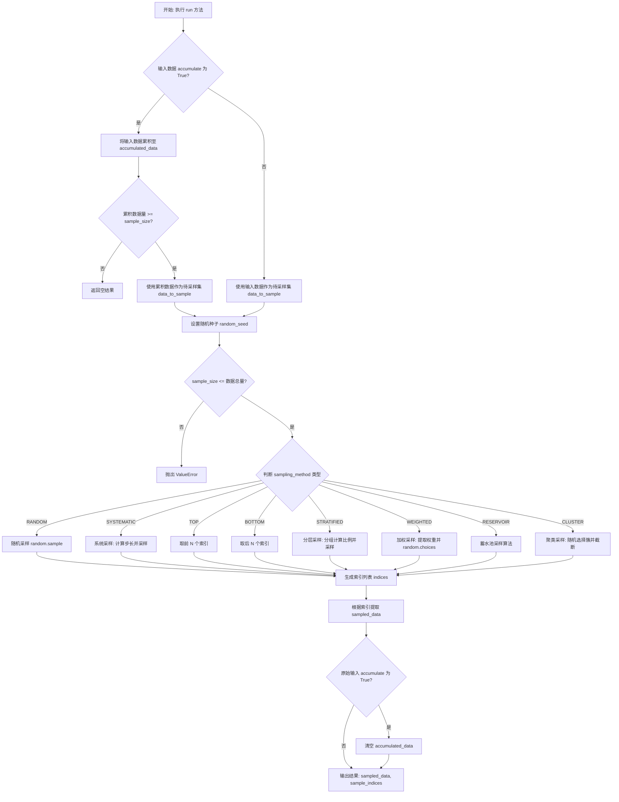
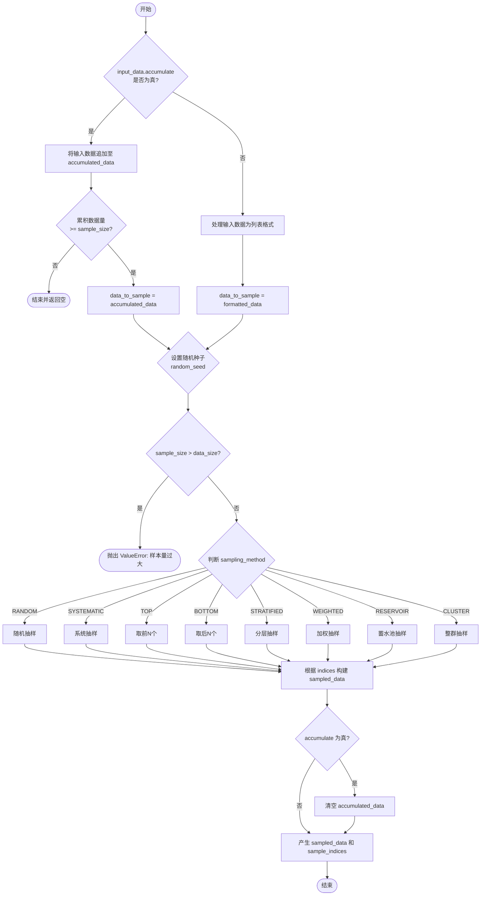

# `AutoGPT\autogpt_platform\backend\backend\blocks\sampling.py` 详细设计文档

该代码定义了一个数据处理块，用于根据随机、系统、分层、加权、聚类等多种采样策略从输入数据集中提取样本。它支持数据累积模式，允许分批收集数据直到满足样本量要求，并返回采样后的数据子集及其在原始数据集中的索引。

## 整体流程



## 类结构

```
SamplingMethod (Enum)
DataSamplingBlock (Block)
├── Input (BlockSchemaInput)
└── Output (BlockSchemaOutput)
```

## 全局变量及字段


### `SamplingMethod.RANDOM`
    
Random sampling strategy.

类型：`SamplingMethod`
    


### `SamplingMethod.SYSTEMATIC`
    
Systematic sampling strategy.

类型：`SamplingMethod`
    


### `SamplingMethod.TOP`
    
Top sampling strategy (selects the first N items).

类型：`SamplingMethod`
    


### `SamplingMethod.BOTTOM`
    
Bottom sampling strategy (selects the last N items).

类型：`SamplingMethod`
    


### `SamplingMethod.STRATIFIED`
    
Stratified sampling strategy.

类型：`SamplingMethod`
    


### `SamplingMethod.WEIGHTED`
    
Weighted sampling strategy.

类型：`SamplingMethod`
    


### `SamplingMethod.RESERVOIR`
    
Reservoir sampling strategy.

类型：`SamplingMethod`
    


### `SamplingMethod.CLUSTER`
    
Cluster sampling strategy.

类型：`SamplingMethod`
    


### `DataSamplingBlock.Input.data`
    
The dataset to sample from. Can be a single dictionary, a list of dictionaries, or a list of lists.

类型：`Union[Dict[str, Any], List[Union[dict, List[Any]]]]`
    


### `DataSamplingBlock.Input.sample_size`
    
The number of samples to take from the dataset.

类型：`int`
    


### `DataSamplingBlock.Input.sampling_method`
    
The method to use for sampling.

类型：`SamplingMethod`
    


### `DataSamplingBlock.Input.accumulate`
    
Whether to accumulate data before sampling.

类型：`bool`
    


### `DataSamplingBlock.Input.random_seed`
    
Seed for random number generator (optional).

类型：`Optional[int]`
    


### `DataSamplingBlock.Input.stratify_key`
    
Key to use for stratified sampling (required for stratified sampling).

类型：`Optional[str]`
    


### `DataSamplingBlock.Input.weight_key`
    
Key to use for weighted sampling (required for weighted sampling).

类型：`Optional[str]`
    


### `DataSamplingBlock.Input.cluster_key`
    
Key to use for cluster sampling (required for cluster sampling).

类型：`Optional[str]`
    


### `DataSamplingBlock.Output.sampled_data`
    
The sampled subset of the input data.

类型：`List[Union[dict, List[Any]]]`
    


### `DataSamplingBlock.Output.sample_indices`
    
The indices of the sampled data in the original dataset.

类型：`List[int]`
    


### `DataSamplingBlock.accumulated_data`
    
Stores accumulated data samples when the accumulate option is enabled.

类型：`List[Any]`
    
    

## 全局函数及方法


### `DataSamplingBlock.__init__`

该方法是 `DataSamplingBlock` 类的构造函数，负责初始化数据采样块的实例。它通过调用父类 `Block` 的初始化方法来定义该块的元数据（包括唯一标识符、描述、分类、输入输出模式以及用于验证的测试用例），同时初始化一个实例变量用于在需要时累积数据。

参数：

-  `self`：`DataSamplingBlock`，类的实例本身。

返回值：`None`，无返回值。

#### 流程图

```mermaid
graph TD
    Start(开始初始化) --> InitSuper[调用父类 Block.__init__]
    InitSuper --> SetID[设置 ID: 4a448883-71fa-49cf-91cf-70d793bd7d87]
    InitSuper --> SetDesc[设置描述: 样本数据块]
    InitSuper --> SetCategory[设置分类: LOGIC]
    InitSuper --> SetSchemas[设置输入输出模式]
    InitSuper --> SetTestIO[设置测试输入与预期输出]
    SetID --> InitVar[初始化实例变量 accumulated_data = []]
    SetDesc --> InitVar
    SetCategory --> InitVar
    SetSchemas --> InitVar
    SetTestIO --> InitVar
    InitVar --> End(结束)
```

#### 带注释源码

```python
def __init__(self):
    # 调用父类 Block 的构造函数，配置块的基本元数据和运行时行为定义
    super().__init__(
        id="4a448883-71fa-49cf-91cf-70d793bd7d87",  # 块的唯一标识符
        description="This block samples data from a given dataset using various sampling methods.",  # 块功能的文本描述
        categories={BlockCategory.LOGIC},  # 将块归类为逻辑处理类
        input_schema=DataSamplingBlock.Input,  # 定义输入数据的结构模式
        output_schema=DataSamplingBlock.Output,  # 定义输出数据的结构模式
        # 定义测试输入数据，用于验证或文档示例
        test_input={
            "data": [
                {"id": i, "value": chr(97 + i), "group": i % 3} for i in range(10)
            ],
            "sample_size": 3,
            "sampling_method": SamplingMethod.STRATIFIED,
            "accumulate": False,
            "random_seed": 42,
            "stratify_key": "group",
        },
        # 定义与测试输入对应的预期输出数据
        test_output=[
            (
                "sampled_data",
                [
                    {"id": 0, "value": "a", "group": 0},
                    {"id": 1, "value": "b", "group": 1},
                    {"id": 8, "value": "i", "group": 2},
                ],
            ),
            ("sample_indices", [0, 1, 8]),
        ],
    )
    # 初始化实例变量，用于存储在 accumulate 模式下累积的数据
    self.accumulated_data = []
```


### `DataSamplingBlock.run`

该方法负责执行数据采样逻辑。它支持多种采样策略（如随机、分层、加权等），可以选择在采样前累积多个批次的数据，并根据输入参数从数据集中提取指定数量的样本，最终返回采样后的数据及其在原始数据集中的索引。

参数：

-   `input_data`：`Input`，包含输入配置的数据对象，具体字段包括待采样的数据集 (`data`)、采样数量 (`sample_size`)、采样方法 (`sampling_method`)、是否累积 (`accumulate`)、随机种子 (`random_seed`) 以及特定采样方法所需的键值（如 `stratify_key`, `weight_key`, `cluster_key`）。
-   `**kwargs`：`Any`，扩展用的关键字参数，当前未使用。

返回值：`BlockOutput`，一个异步生成器，产生两个元组：第一个包含键 `"sampled_data"` 和采样后的数据列表，第二个包含键 `"sample_indices"` 和采样数据的原始索引列表。

#### 流程图



#### 带注释源码

```python
    async def run(self, input_data: Input, **kwargs) -> BlockOutput:
        # 处理数据累积逻辑
        if input_data.accumulate:
            # 根据输入数据的类型（字典或列表）将其追加到累积存储中
            if isinstance(input_data.data, dict):
                self.accumulated_data.append(input_data.data)
            elif isinstance(input_data.data, list):
                self.accumulated_data.extend(input_data.data)
            else:
                raise ValueError(f"Unsupported data type: {type(input_data.data)}")

            # 如果累积的数据量仍小于请求的样本量，则本次不执行采样，直接返回
            if len(self.accumulated_data) < input_data.sample_size:
                return

            # 使用累积的数据作为采样源
            data_to_sample = self.accumulated_data
        else:
            # 如果不累积，直接使用输入数据进行采样
            # 确保数据是列表格式，如果是单个字典则转为单元素列表
            data_to_sample = (
                input_data.data
                if isinstance(input_data.data, list)
                else [input_data.data]
            )

        # 如果提供了随机种子，则设置随机数生成器的种子以保证结果可复现
        if input_data.random_seed is not None:
            random.seed(input_data.random_seed)

        data_size = len(data_to_sample)

        # 校验：请求的样本量不能超过数据集大小
        if input_data.sample_size > data_size:
            raise ValueError(
                f"Sample size ({input_data.sample_size}) cannot be larger than the dataset size ({data_size})."
            )

        indices = []

        # 根据指定的采样方法计算采样索引
        if input_data.sampling_method == SamplingMethod.RANDOM:
            # 随机采样：无放回地随机抽取 k 个索引
            indices = random.sample(range(data_size), input_data.sample_size)
        elif input_data.sampling_method == SamplingMethod.SYSTEMATIC:
            # 系统采样：计算步长，随机起点，等距抽取
            step = data_size // input_data.sample_size
            start = random.randint(0, step - 1)
            indices = list(range(start, data_size, step))[: input_data.sample_size]
        elif input_data.sampling_method == SamplingMethod.TOP:
            # 顶部采样：取前 k 个索引
            indices = list(range(input_data.sample_size))
        elif input_data.sampling_method == SamplingMethod.BOTTOM:
            # 底部采样：取后 k 个索引
            indices = list(range(data_size - input_data.sample_size, data_size))
        elif input_data.sampling_method == SamplingMethod.STRATIFIED:
            # 分层采样：根据指定的键将数据分层，按比例从每层中抽取样本
            if not input_data.stratify_key:
                raise ValueError(
                    "Stratify key must be provided for stratified sampling."
                )
            strata = defaultdict(list)
            for i, item in enumerate(data_to_sample):
                # 获取分层键的值
                if isinstance(item, dict):
                    strata_value = item.get(input_data.stratify_key)
                elif hasattr(item, input_data.stratify_key):
                    strata_value = getattr(item, input_data.stratify_key)
                else:
                    raise ValueError(
                        f"Stratify key '{input_data.stratify_key}' not found in item {item}"
                    )

                if strata_value is None:
                    raise ValueError(
                        f"Stratify value for key '{input_data.stratify_key}' is None"
                    )

                strata[str(strata_value)].append(i)

            # 计算每层应该抽取的样本数量
            stratum_sizes = {
                k: max(1, int(len(v) / data_size * input_data.sample_size))
                for k, v in strata.items()
            }

            # 调整各层样本量，确保总样本量精确等于 sample_size
            while sum(stratum_sizes.values()) != input_data.sample_size:
                if sum(stratum_sizes.values()) < input_data.sample_size:
                    stratum_sizes[
                        max(stratum_sizes, key=lambda k: stratum_sizes[k])
                    ] += 1
                else:
                    stratum_sizes[
                        max(stratum_sizes, key=lambda k: stratum_sizes[k])
                    ] -= 1

            # 从每层中随机抽取指定数量的索引
            for stratum, size in stratum_sizes.items():
                indices.extend(random.sample(strata[stratum], size))
        elif input_data.sampling_method == SamplingMethod.WEIGHTED:
            # 加权采样：根据指定的键值作为权重进行随机抽取（有放回）
            if not input_data.weight_key:
                raise ValueError("Weight key must be provided for weighted sampling.")
            weights = []
            for item in data_to_sample:
                if isinstance(item, dict):
                    weight = item.get(input_data.weight_key)
                elif hasattr(item, input_data.weight_key):
                    weight = getattr(item, input_data.weight_key)
                else:
                    raise ValueError(
                        f"Weight key '{input_data.weight_key}' not found in item {item}"
                    )

                if weight is None:
                    raise ValueError(
                        f"Weight value for key '{input_data.weight_key}' is None"
                    )
                try:
                    weights.append(float(weight))
                except ValueError:
                    raise ValueError(
                        f"Weight value '{weight}' cannot be converted to a number"
                    )

            if not weights:
                raise ValueError(
                    f"No valid weights found using key '{input_data.weight_key}'"
                )

            # 使用 weights 参数进行随机选择
            indices = random.choices(
                range(data_size), weights=weights, k=input_data.sample_size
            )
        elif input_data.sampling_method == SamplingMethod.RESERVOIR:
            # 蓄水池采样：适用于数据流或不知道总量的高效随机采样算法
            indices = list(range(input_data.sample_size))
            for i in range(input_data.sample_size, data_size):
                j = random.randint(0, i)
                if j < input_data.sample_size:
                    indices[j] = i
        elif input_data.sampling_method == SamplingMethod.CLUSTER:
            # 整群采样：根据指定的键聚类，随机选择整个聚类直到满足样本量
            if not input_data.cluster_key:
                raise ValueError("Cluster key must be provided for cluster sampling.")
            clusters = defaultdict(list)
            for i, item in enumerate(data_to_sample):
                if isinstance(item, dict):
                    cluster_value = item.get(input_data.cluster_key)
                elif hasattr(item, input_data.cluster_key):
                    cluster_value = getattr(item, input_data.cluster_key)
                else:
                    raise TypeError(
                        f"Item {item} does not have the cluster key '{input_data.cluster_key}'"
                    )

                clusters[str(cluster_value)].append(i)

            # 随机选择聚类直到样本数足够
            selected_clusters = []
            while (
                sum(len(clusters[c]) for c in selected_clusters)
                < input_data.sample_size
            ):
                available_clusters = [c for c in clusters if c not in selected_clusters]
                if not available_clusters:
                    break
                selected_clusters.append(random.choice(available_clusters))

            # 收集选中聚类的所有索引
            for cluster in selected_clusters:
                indices.extend(clusters[cluster])

            # 如果收集的样本数超过需求，再进行一次随机截断
            if len(indices) > input_data.sample_size:
                indices = random.sample(indices, input_data.sample_size)
        else:
            raise ValueError(f"Unknown sampling method: {input_data.sampling_method}")

        # 根据索引提取实际数据
        sampled_data = [data_to_sample[i] for i in indices]

        # 如果启用了累积模式，采样完成后清空累积缓冲区
        if input_data.accumulate:
            self.accumulated_data = []

        # 产生输出结果
        yield "sampled_data", sampled_data
        yield "sample_indices", indices
```


## 关键组件


### SamplingMethod
An enumeration defining the standard sampling strategies supported by the block, including random, systematic, stratified, weighted, reservoir, and cluster methods.

### DataSamplingBlock
The core asynchronous block class that orchestrates data ingestion, optional accumulation, and dispatches data to the appropriate sampling algorithm.

### Input and Output Schemas
Nested classes defining the structure and validation rules for block inputs (data parameters, method selection) and outputs (sampled data and indices).

### Data Accumulator
A stateful buffering mechanism using `self.accumulated_data` to aggregate incoming data across multiple executions until the specified sample size threshold is met.

### Stratified Sampling Implementation
A logic segment that partitions the dataset into homogeneous subgroups (strata) based on a key and performs proportional random sampling from each.

### Weighted Sampling Implementation
A logic segment that selects data points with probabilities proportional to their associated weights derived from a specified dataset field.

### Reservoir Sampling Implementation
A logic segment implementing Algorithm R to maintain a uniform random sample from a stream of data of unknown or large size in a single pass.

### Cluster Sampling Implementation
A logic segment that aggregates data into clusters based on a key, randomly selects whole clusters, and trims the result to fit the requested sample size.


## 问题及建议


### 已知问题

-   **并发状态污染风险**：`self.accumulated_data` 作为实例变量用于存储累积数据。如果该 Block 实例在异步环境中被多个并发执行流共享，不同请求的数据会相互覆盖或混淆，导致严重的数据一致性问题。
-   **全局随机状态干扰**：代码直接调用 `random.seed(input_data.random_seed)` 修改了 Python 解释器的全局随机数生成器状态。在多租户或共享运行时环境中，这会破坏其他依赖随机性的组件的可复现性。
-   **分层采样的潜在崩溃**：在分层采样逻辑中，计算出的每层样本数量 `stratum_sizes` 可能超过该层实际包含的元素数量。当 `size > len(strata[stratum])` 时，`random.sample` 会抛出 `ValueError` 导致执行失败。
-   **聚类采样的逻辑混淆**：聚类采样实现在选择了聚类后，如果总数超过了 `sample_size`，会再次调用 `random.sample` 进行截断。这种“聚类+随机截断”的混合模式不符合标准的聚类采样定义（通常要求取整聚类），可能无法满足用户“保持聚类完整性”的预期。

### 优化建议

-   **使用局部随机生成器**：引入 `random.Random(input_data.random_seed)` 创建独立的随机数生成器实例，替换所有对 `random` 模块全局函数的调用，以隔离状态。
-   **重构状态管理机制**：将 `accumulated_data` 从实例属性中移除。建议使用持久化存储（如 Redis、数据库）或通过执行上下文传递的状态对象来保存累积数据，确保数据隔离和并发安全。
-   **增强分层采样鲁棒性**：在执行 `random.sample` 前增加校验，确保每层请求的样本数不超过该层实际大小。若某层数据不足，应按策略（如按比例缩减或取全部）动态调整配额，而非直接报错。
-   **明确或修正聚类采样逻辑**：根据业务需求调整实现。如果目标是严格聚类，应移除截断逻辑，允许样本数略微超出并更新文档说明；如果目标是精确控制样本数，建议重命名方法或在文档中明确说明其“包含截断”的行为。


## 其它


### 设计目标与约束

1.  **多算法支持与灵活性**：设计目标旨在提供一个统一的数据采样接口，支持至少8种常见的采样策略（随机、系统、顶部、底部、分层、加权、蓄水池、聚类），以适应不同场景的数据处理需求。
2.  **内存约束与流式处理**：当 `accumulate` 为 `True` 时，模块具备数据缓存能力，能够接收分批次的小数据包并在内存中累积，直到达到样本量阈值才进行处理。这要求数据总量必须受限于执行节点的可用内存。
3.  **可复现性**：通过 `random_seed` 参数设计，确保在相同种子和数据输入下，采样结果的一致性，满足调试和实验验证的需求。
4.  **通用性约束**：输入数据被设计为通用的 `Dict` 或 `List` 结构，但在特定算法（如分层、加权、聚类）中，要求数据项必须包含特定的键（Key），这构成了隐式的数据结构约束。

### 错误处理与异常设计

本模块采用“快速失败”原则，在数据验证和算法执行的关键节点抛出异常，阻断流程并暴露错误信息：

1.  **输入数据类型异常**：
    *   当 `accumulate` 为 `True` 且输入数据既不是字典也不是列表时，抛出 `ValueError`。
    *   当特定键（如分层键、权重键）在数据项中不存在或值为 `None` 时，抛出 `ValueError`。
    *   当权重值无法转换为浮点数时，抛出 `ValueError`。
2.  **参数合法性异常**：
    *   当 `sample_size` 大于实际可采样的数据集大小时，抛出 `ValueError`。
    *   当选择了需要额外参数的采样方法（如 `STRATIFIED`、`WEIGHTED`、`CLUSTER`）但未提供对应 Key 时，抛出 `ValueError`。
    *   当使用了未知的采样方法时，抛出 `ValueError`。
3.  **数据完整性异常**：
    *   在加权采样中，如果未能提取到任何有效的权重值，抛出 `ValueError`。
    *   在聚类采样中，如果数据项不包含聚类 Key，抛出 `TypeError`。

### 数据流与状态机

由于 `DataSamplingBlock` 支持数据累积 (`accumulate`)，其实例内部维护了状态，数据流和状态转换如下：

1.  **状态定义**：
    *   **Idle (空闲)**：初始化状态，`accumulated_data` 为空。
    *   **Accumulating (累积中)**：`accumulate=True` 且当前累积的数据量 `len(accumulated_data) < sample_size`。此时 `run` 方法接收数据但不产生输出。
    *   **Ready to Sample (就绪)**：`accumulate=True` 且 `len(accumulated_data) >= sample_size`，或者 `accumulate=False`（直接就绪）。
    *   **Post-Sample (采样后)**：完成采样并清空缓存后回到 Idle 状态。

2.  **数据流转逻辑**：
    *   **输入阶段**：数据流入 `run` 方法。
    *   **分支判断**：
        *   若 `accumulate=True`：数据追加至 `self.accumulated_data` -> 检查是否达到阈值 -> 若未达到，结束流程（无输出）；若达到，进入采样阶段。
        *   若 `accumulate=False`：直接使用输入数据作为待采样集。
    *   **处理阶段**：根据 `SamplingMethod` 执行对应算法，生成索引列表。
    *   **输出阶段**：根据索引提取数据，Yield 两个输出流（`sampled_data` 和 `sample_indices`）。若处于累积模式，随即清空内部状态。

### 外部依赖与接口契约

1.  **框架依赖**：
    *   继承自 `backend.data.block.Block` 基类，必须遵守该框架的生命周期契约（即实现 `async def run`）。
    *   依赖 `backend.data.model.SchemaField` 进行输入输出的 Schema 定义，以供前端或上游解析。
2.  **库依赖**：
    *   Python 标准库 `random`：负责所有随机数的生成和随机采样操作。
    *   `collections.defaultdict`：用于高效构建分层和聚类的桶结构。
3.  **接口契约**：
    *   **输入契约 (`Input` Schema)**：调用方必须提供符合 `BlockSchemaInput` 的 JSON 或 Python 对象，`data` 字段必须可迭代，`sample_size` 必须为正整数。
    *   **输出契约 (`BlockOutput`)**：`run` 方法被设计为异步生成器，必须按顺序产生两个 Tuple：`("sampled_data", List)` 和 `("sample_indices", List[int])`。
    *   **隐式契约**：若使用 `accumulate` 模式，调用方需理解这是一个有状态的操作，多次调用之间数据会互相影响，直到采样发生。

### 并发策略与线程安全

1.  **状态风险**：当前设计中，`self.accumulated_data` 是实例级别的成员变量。
2.  **非线程安全**：如果在多线程环境或异步并发环境中，同一个 `DataSamplingBlock` 实例的 `run` 方法被多个任务同时调用，且开启了 `accumulate` 模式，会导致 `self.accumulated_data.append` 和 `extend` 操作产生竞态条件，可能导致数据丢失或索引越界。
3.  **架构建议**：在当前实现下，若需并发使用，必须保证每个并发任务使用的是 `DataSamplingBlock` 的独立实例；或者引入线程锁（如 `asyncio.Lock`）来保护累积数据的读写操作，但这会降低吞吐量。

    