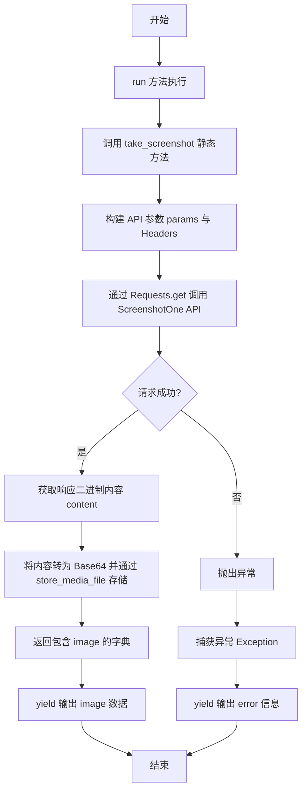
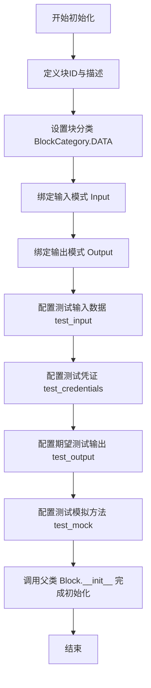
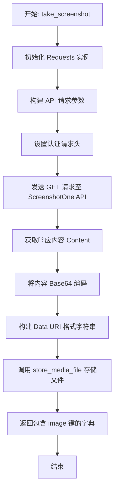
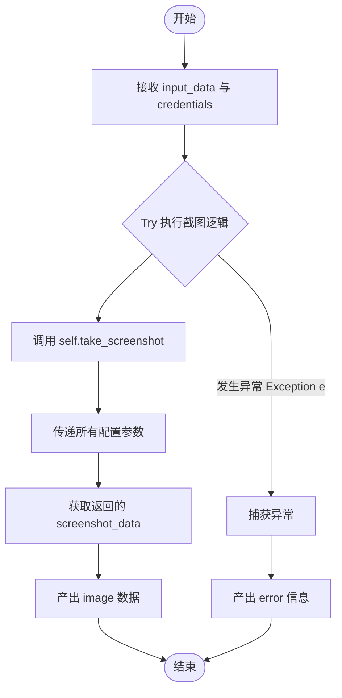

# `AutoGPT\autogpt_platform\backend\backend\blocks\screenshotone.py` 详细设计文档

该代码定义了一个名为 `ScreenshotWebPageBlock` 的集成块，用于通过 ScreenshotOne API 根据指定的 URL、视口尺寸、图片格式及拦截选项等参数抓取网页截图，并将生成的图片数据存储后输出。

## 整体流程



## 类结构

```
Format (Enum)
├── PNG
├── JPEG
└── WEBP
ScreenshotWebPageBlock (Block)
├── Input (BlockSchemaInput)
│   ├── credentials
│   ├── url
│   ├── viewport_width
│   ├── viewport_height
│   ├── full_page
│   ├── format
│   ├── block_ads
│   ├── block_cookie_banners
│   ├── block_chats
│   └── cache
├── Output (BlockSchemaOutput)
│   └── image
├── __init__
├── take_screenshot (静态方法)
└── run
```

## 全局变量及字段


### `Format.PNG`
    
枚举值，代表 PNG 图片格式。

类型：`Format`
    


### `Format.JPEG`
    
枚举值，代表 JPEG 图片格式。

类型：`Format`
    


### `Format.WEBP`
    
枚举值，代表 WEBP 图片格式。

类型：`Format`
    


### `ScreenshotWebPageBlock.Input`
    
输入模式类，定义了截图块所需的参数结构。

类型：`BlockSchemaInput`
    


### `ScreenshotWebPageBlock.Output`
    
输出模式类，定义了截图块返回的数据结构。

类型：`BlockSchemaOutput`
    


### `ScreenshotWebPageBlock.Input.credentials`
    
ScreenshotOne API 密钥。

类型：`CredentialsMetaInput`
    


### `ScreenshotWebPageBlock.Input.url`
    
需要截图的网站 URL。

类型：`str`
    


### `ScreenshotWebPageBlock.Input.viewport_width`
    
视口宽度（像素）。

类型：`int`
    


### `ScreenshotWebPageBlock.Input.viewport_height`
    
视口高度（像素）。

类型：`int`
    


### `ScreenshotWebPageBlock.Input.full_page`
    
是否捕获完整的页面长度。

类型：`bool`
    


### `ScreenshotWebPageBlock.Input.format`
    
输出格式。

类型：`Format`
    


### `ScreenshotWebPageBlock.Input.block_ads`
    
是否拦截广告。

类型：`bool`
    


### `ScreenshotWebPageBlock.Input.block_cookie_banners`
    
是否拦截 Cookie 横幅。

类型：`bool`
    


### `ScreenshotWebPageBlock.Input.block_chats`
    
是否拦截聊天小部件。

类型：`bool`
    


### `ScreenshotWebPageBlock.Input.cache`
    
是否启用缓存。

类型：`bool`
    


### `ScreenshotWebPageBlock.Output.image`
    
截图图像数据。

类型：`MediaFileType`
    
    

## 全局函数及方法


### `ScreenshotWebPageBlock.__init__`

该方法用于初始化 `ScreenshotWebPageBlock` 实例，配置块的元数据（如 ID、描述、分类）、输入输出模式以及用于测试目的的模拟数据、测试输入和期望输出。

参数：

- `self`：`ScreenshotWebPageBlock`，类的实例本身。

返回值：`None`，初始化方法无返回值。

#### 流程图



#### 带注释源码

```python
def __init__(self):
    # 调用父类 Block 的初始化方法，配置块的基本属性和测试环境
    super().__init__(
        # 生成并设置唯一的块标识符
        id="3a7c4b8d-6e2f-4a5d-b9c1-f8d23c5a9b0e",  # Generated UUID
        # 设置块的文本描述，说明其功能
        description="Takes a screenshot of a specified website using ScreenshotOne API",
        # 指定块所属的分类为数据类
        categories={BlockCategory.DATA},
        # 指定输入数据的结构模式为内部定义的 Input 类
        input_schema=ScreenshotWebPageBlock.Input,
        # 指定输出数据的结构模式为内部定义的 Output 类
        output_schema=ScreenshotWebPageBlock.Output,
        # 定义用于测试的输入参数样本
        test_input={
            "url": "https://example.com",
            "viewport_width": 1920,
            "viewport_height": 1080,
            "full_page": False,
            "format": "png",
            "block_ads": True,
            "block_cookie_banners": True,
            "block_chats": True,
            "cache": False,
            "credentials": {
                "provider": "screenshotone",
                "type": "api_key",
                "id": "test-id",
                "title": "Test API Key",
            },
        },
        # 定义用于测试的 API 凭证对象
        test_credentials=APIKeyCredentials(
            id="test-id",
            provider="screenshotone",
            api_key=SecretStr("test-key"),
            title="Test API Key",
            expires_at=None,
        ),
        # 定义执行测试时期望的输出结果列表
        test_output=[
            (
                "image",
                "data:image/png;base64,iVBORw0KGgoAAAANSUhEUgAAABAAAAAQCAYAAAAf8/9hAAAAAXNSR0IArs4c6QAAAB5JREFUOE9jZPjP8J+BAsA4agDDaBgwjIYBw7AIAwCV5B/xAsMbygAAAABJRU5ErkJggg==",
            ),
        ],
        # 定义测试时的模拟行为，跳过真实的 API 调用并返回预设数据
        test_mock={
            "take_screenshot": lambda *args, **kwargs: {
                "image": "data:image/png;base64,iVBORw0KGgoAAAANSUhEUgAAABAAAAAQCAYAAAAf8/9hAAAAAXNSR0IArs4c6QAAAB5JREFUOE9jZPjP8J+BAsA4agDDaBgwjIYBw7AIAwCV5B/xAsMbygAAAABJRU5ErkJggg==",
            }
        },
    )
```


### `ScreenshotWebPageBlock.take_screenshot`

利用 ScreenshotOne API 截取指定网页的截图，支持自定义视口大小、图片格式及拦截广告等选项，并将结果存储为媒体文件。

参数：

- `credentials`：`APIKeyCredentials`，用于访问 ScreenshotOne API 的认证凭据。
- `execution_context`：`ExecutionContext`，执行上下文，用于存储和管理文件等操作。
- `url`：`str`，需要截图的网站 URL。
- `viewport_width`：`int`，视口的宽度（像素）。
- `viewport_height`：`int`，视口的高度（像素）。
- `full_page`：`bool`，是否截取整个网页的完整长度。
- `format`：`Format`，输出图片的格式（枚举：PNG, JPEG, WEBP）。
- `block_ads`：`bool`，是否拦截广告。
- `block_cookie_banners`：`bool`，是否拦截 Cookie 横幅。
- `block_chats`：`bool`，是否拦截聊天挂件。
- `cache`：`bool`，是否启用缓存。

返回值：`dict`，包含存储后的图片数据引用的字典。

#### 流程图



#### 带注释源码

```python
    @staticmethod
    async def take_screenshot(
        credentials: APIKeyCredentials,
        execution_context: ExecutionContext,
        url: str,
        viewport_width: int,
        viewport_height: int,
        full_page: bool,
        format: Format,
        block_ads: bool,
        block_cookie_banners: bool,
        block_chats: bool,
        cache: bool,
    ) -> dict:
        """
        Takes a screenshot using the ScreenshotOne API
        """
        # 初始化 HTTP 请求工具
        api = Requests()

        # 构建 API 请求参数字典
        # 注意布尔值需要转换为小写字符串 'true' 或 'false' 以符合 API 要求
        params = {
            "url": url,
            "viewport_width": viewport_width,
            "viewport_height": viewport_height,
            "full_page": str(full_page).lower(),
            "format": format.value,
            "block_ads": str(block_ads).lower(),
            "block_cookie_banners": str(block_cookie_banners).lower(),
            "block_chats": str(block_chats).lower(),
            "cache": str(cache).lower(),
        }

        # 设置请求头，使用 X-Access-Key 进行基于 Header 的认证
        headers = {
            "X-Access-Key": credentials.api_key.get_secret_value(),
        }

        # 发送异步 GET 请求获取截图二进制数据
        response = await api.get(
            "https://api.screenshotone.com/take", params=params, headers=headers
        )
        # 提取响应体的二进制内容
        content = response.content

        # 处理并存储截图文件
        # 1. 将二进制内容进行 Base64 编码
        # 2. 构建 Data URI (data:image/{format};base64,{encoded_string})
        # 3. 调用 store_media_file 将文件存储，并返回适用于 Block 输出的格式
        return {
            "image": await store_media_file(
                file=MediaFileType(
                    f"data:image/{format.value};base64,{b64encode(content).decode('utf-8')}"
                ),
                execution_context=execution_context,
                return_format="for_block_output",
            )
        }
```


### `ScreenshotWebPageBlock.run`

该方法是 `ScreenshotWebPageBlock` 的核心执行入口，负责协调整个网页截图的流程。它接收用户输入的 URL 和截图配置，通过调用静态方法 `take_screenshot` 与 ScreenshotOne API 进行交互，获取截图数据并将其存储为媒体文件，最后产出图片数据供后续使用。若过程中发生错误，则捕获异常并产出错误信息。

参数：

- `self`: `ScreenshotWebPageBlock`, 类实例本身。
- `input_data`: `Input`, 包含截图目标 URL、视口大小、图片格式及各种拦截选项的输入数据模型。
- `credentials`: `APIKeyCredentials`, 用于身份验证的 ScreenshotOne API 密钥凭证。
- `execution_context`: `ExecutionContext`, 执行上下文对象，用于追踪执行状态和存储媒体文件。
- `**kwargs`: `dict`, 额外的关键字参数。

返回值：`BlockOutput`, 生成器类型，产出包含结果键（如 `"image"` 或 `"error"`）和对应数据的元组。

#### 流程图



#### 带注释源码

```python
async def run(
    self,
    input_data: Input,
    *,
    credentials: APIKeyCredentials,
    execution_context: ExecutionContext,
    **kwargs,
) -> BlockOutput:
    try:
        # 调用静态方法 take_screenshot 执行实际的截图操作
        # 将 input_data 中的配置字段解包并传递给该方法
        screenshot_data = await self.take_screenshot(
            credentials=credentials,
            execution_context=execution_context,
            url=input_data.url,
            viewport_width=input_data.viewport_width,
            viewport_height=input_data.viewport_height,
            full_page=input_data.full_page,
            format=input_data.format,
            block_ads=input_data.block_ads,
            block_cookie_banners=input_data.block_cookie_banners,
            block_chats=input_data.block_chats,
            cache=input_data.cache,
        )
        # 产出 "image" 键及对应的图片数据，供后续 Block 使用
        yield "image", screenshot_data["image"]
    except Exception as e:
        # 如果在截图过程中发生任何异常，产出 "error" 键及异常信息
        yield "error", str(e)
```


## 关键组件


### ScreenshotWebPageBlock
封装网页截图工作流的主要类，定义输入/输出模式并协调执行。

### take_screenshot Method
负责构建请求参数、通过头部进行认证以及从 ScreenshotOne API 检索二进制图像数据的静态方法。

### Input/Output Schema Classes
定义数据契约的嵌套类，使用 Pydantic 和自定义模式字段来确保类型安全并验证凭证、URL、视口设置和图像格式。

### Media Storage Integration
通过将 API 响应转换为 Base64 编码的 Data URI 并存储文件引用来管理原始图像数据的逻辑。

### Format Enum
限制截图输出格式的枚举，支持 PNG、JPEG 和 WEBP 选项。


## 问题及建议


### 已知问题

-   Output Schema 定义不完整：`run` 方法在异常时产生 `error` 输出，但在 `Output` 类中仅定义了 `image` 字段。这导致在发生异常时产生的输出与预定义的 Schema 契约不符，可能会阻塞后续处理流程或导致类型错误。
-   缺少 HTTP 状态码校验：`take_screenshot` 方法直接使用 `response.content` 而未检查响应状态码（如 200 OK）。如果 API 请求失败（例如 401 未授权或 400 参数错误），代码会将错误的 HTML 或 JSON 文本当作图片数据进行 Base64 编码并存储，生成无效的图片文件且难以排查错误原因。
-   异常捕获过于宽泛：`run` 方法中使用 `except Exception as e` 捕获所有异常。这种做法可能掩盖非预期的系统级错误（如 `KeyboardInterrupt` 或内存错误），并且仅返回字符串 `str(e)` 导致丢失了详细的错误堆栈和原始异常类型信息。

### 优化建议

-   优化内存使用：当前代码先获取二进制内容，再转换为 Base64 Data URI 字符串（`data:image/...`）传递给 `store_media_file`。对于大尺寸或长截图，这种转换会显著增加内存占用（字符串体积通常比二进制大约 33%）。建议检查 `store_media_file` 是否支持直接传入二进制流或临时文件路径，以避免不必要的数据转换和内存峰值。
-   提取配置常量：API 端点 `https://api.screenshotone.com/take` 硬编码在静态方法中。建议将其提取为模块级常量或类常量，便于统一管理、修改 API 版本或在测试环境中进行 Mock。
-   改进代码结构与硬编码值：Block 的 UUID 硬编码在 `__init__` 方法调用中。建议将其定义为类属性（如 `BLOCK_ID = "..."`），以提高代码的可读性和可维护性。


## 其它


### 设计目标与约束

**设计目标：**
1.  **功能集成**：提供一个标准化的模块，用于将第三方 ScreenshotOne API 的截图能力集成到自动化工作流中。
2.  **参数灵活性**：支持通过配置视口大小、截图格式、页面清洗选项（如屏蔽广告、Cookie横幅）等，满足不同场景的截图需求。
3.  **异步执行**：采用异步 I/O 模式执行网络请求和文件存储操作，避免阻塞主线程或事件循环。

**约束条件：**
1.  **外部依赖**：功能完全依赖于 ScreenshotOne 服务的可用性和网络连接质量。服务端必须能够访问目标 URL。
2.  **认证安全**：API Key 必须通过 HTTP Header (`X-Access-Key`) 安全传递，而不是暴露在 URL 查询参数中。
3.  **存储限制**：生成的截图媒体文件必须通过内部的 `store_media_file` 工具进行持久化存储，受限于底层存储系统的性能和容量。
4.  **数据格式**：最终输出的图片数据必须转换为 Base64 编码的 Data URI 格式，以便于在系统中传输和展示。

### 错误处理与异常设计

**当前机制：**
1.  **通用捕获**：在 `run` 方法中使用 `try-except Exception` 块包裹核心逻辑。
2.  **错误输出**：捕获到任何异常后，通过 `yield "error", str(e)` 将错误信息作为输出流的一部分返回，而不是直接抛出异常导致程序崩溃。这符合 Block 执行引擎的预期，允许工作流处理失败节点。

**潜在缺陷与改进建议：**
1.  **缺乏细粒度处理**：当前代码未区分网络错误（超时、连接失败）、认证错误（401/403）、参数错误（400）或内部存储错误。
2.  **改进方向**：建议捕获具体的异常类型（如 `requests.RequestException`），并根据不同的 HTTP 状态码返回特定的错误码或消息，以便上游逻辑进行重试或熔断处理。

### 数据流与状态机

**数据流：**
1.  **输入阶段**：接收用户定义的 URL、截图参数及凭证元数据。
2.  **凭证解析**：系统从凭证元数据中提取具体的 API Key。
3.  **请求构建**：将输入参数映射为 ScreenshotOne API 所需的查询参数字典，并构建包含认证信息的请求头。
4.  **API 调用**：通过 `Requests` 工具发起异步 HTTP GET 请求，获取二进制图片数据流。
5.  **数据处理与存储**：
    *   将二进制数据编码为 Base64 字符串。
    *   构造 `MediaFileType` 对象。
    *   调用 `store_media_file` 将文件写入存储系统并获取访问路径。
6.  **输出阶段**：将最终的文件路径/Data URI 通过 `yield` 机制输出。

**状态机：**
该 Block 是无状态的，其执行过程是一个线性的单向流程，不维护持久化的内部状态。每次执行都是独立的。

### 外部依赖与接口契约

**外部依赖：**
1.  **ScreenshotOne API**
    *   **接口端点**：`https://api.screenshotone.com/take`
    *   **协议**：HTTPS
    *   **认证方式**：Header Auth (`X-Access-Key`)
    *   **契约**：接收一系列查询参数（如 `url`, `viewport_width`, `format` 等），成功时返回图片的二进制流。
2.  **内部工具 `backend.util.request.Requests`**
    *   **职责**：封装底层的 HTTP 客户端，提供异步请求能力。
3.  **内部工具 `backend.util.file.store_media_file`**
    *   **职责**：处理媒体文件的持久化存储。
    *   **输入**：`MediaFileType` 对象和 `ExecutionContext`。
    *   **输出**：可供 Block 使用的格式化文件路径或 Data URI。

    