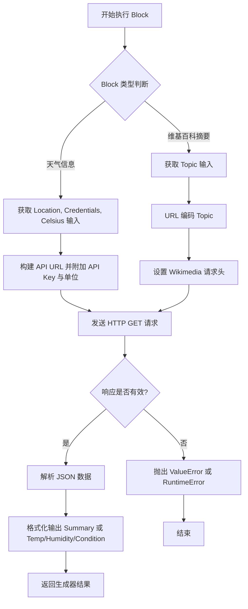
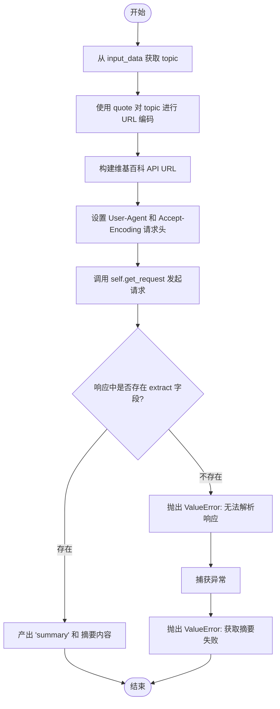

# `AutoGPT\autogpt_platform\backend\backend\blocks\search.py` 详细设计文档

该代码文件定义了两个继承自 Block 的类，用于在工作流系统中分别从维基百科 API 获取主题摘要和从 OpenWeatherMap API 获取指定地点的天气信息，包含了输入输出模型定义、HTTP 请求逻辑及错误处理机制。

## 整体流程



## 类结构

```
GetWikipediaSummaryBlock (Block, GetRequest)
├── Input (BlockSchemaInput)
│   └── topic: str
├── Output (BlockSchemaOutput)
│   ├── summary: str
│   └── error: str
└── Methods: __init__, run

GetWeatherInformationBlock (Block, GetRequest)
├── Input (BlockSchemaInput)
│   ├── location: str
│   ├── credentials: CredentialsMetaInput
│   └── use_celsius: bool
├── Output (BlockSchemaOutput)
│   ├── temperature: str
│   ├── humidity: str
│   ├── condition: str
│   └── error: str
└── Methods: __init__, run

Global Variables
├── TEST_CREDENTIALS
└── TEST_CREDENTIALS_INPUT
```

## 全局变量及字段


### `TEST_CREDENTIALS`
    
Mock OpenWeatherMap API key credentials for testing purposes.

类型：`APIKeyCredentials`
    


### `TEST_CREDENTIALS_INPUT`
    
Dictionary representation of mock credentials used for test input validation.

类型：`dict`
    


### `GetWikipediaSummaryBlock.Input.topic`
    
The topic to fetch the summary for

类型：`str`
    


### `GetWikipediaSummaryBlock.Output.summary`
    
The summary of the given topic

类型：`str`
    


### `GetWikipediaSummaryBlock.Output.error`
    
Error message if the summary cannot be retrieved

类型：`str`
    


### `GetWeatherInformationBlock.Input.location`
    
Location to get weather information for

类型：`str`
    


### `GetWeatherInformationBlock.Input.credentials`
    
The OpenWeatherMap integration can be used with any API key with sufficient permissions for the blocks it is used on.

类型：`CredentialsMetaInput`
    


### `GetWeatherInformationBlock.Input.use_celsius`
    
Whether to use Celsius or Fahrenheit for temperature

类型：`bool`
    


### `GetWeatherInformationBlock.Output.temperature`
    
Temperature in the specified location

类型：`str`
    


### `GetWeatherInformationBlock.Output.humidity`
    
Humidity in the specified location

类型：`str`
    


### `GetWeatherInformationBlock.Output.condition`
    
Weather condition in the specified location

类型：`str`
    


### `GetWeatherInformationBlock.Output.error`
    
Error message if the weather information cannot be retrieved

类型：`str`
    
    

## 全局函数及方法


### `GetWikipediaSummaryBlock.__init__`

该构造函数用于初始化 `GetWikipediaSummaryBlock` 实例，通过调用父类的初始化方法，设置块的唯一标识符、描述、分类、输入输出模式以及用于测试的模拟数据。

参数：

- `self`：`GetWikipediaSummaryBlock`，类实例自身

返回值：`None`，无返回值

#### 流程图

```mermaid
flowchart TD
    Start[开始初始化] --> CallSuper[调用 super().__init__]
    CallSuper --> SetID[设置 ID: f5b0f5d0-1862-4d61-94be-3ad0fa772760]
    CallSuper --> SetDesc[设置 Description: 从Wikipedia获取摘要]
    CallSuper --> SetCat[设置 Categories: SEARCH]
    CallSuper --> SetSchema[设置 Input/Output Schema]
    CallSuper --> SetTest[设置 Test Input/Output/Mock]
    SetTest --> End[初始化完成]
```

#### 带注释源码

```python
def __init__(self):
    super().__init__(
        # 块的唯一标识符
        id="f5b0f5d0-1862-4d61-94be-3ad0fa772760",
        # 块的功能描述
        description="This block fetches the summary of a given topic from Wikipedia.",
        # 块所属的分类，这里归类为搜索类
        categories={BlockCategory.SEARCH},
        # 定义输入数据的结构Schema
        input_schema=GetWikipediaSummaryBlock.Input,
        # 定义输出数据的结构Schema
        output_schema=GetWikipediaSummaryBlock.Output,
        # 定义测试用的输入数据
        test_input={"topic": "Artificial Intelligence"},
        # 定义测试期望的输出数据
        test_output=("summary", "summary content"),
        # 定义测试时的Mock函数，模拟get_request行为
        test_mock={
            "get_request": lambda url, headers, json: {"extract": "summary content"}
        },
    )
```


### `GetWikipediaSummaryBlock.run`

该方法负责异步执行从维基百科获取指定主题摘要的核心逻辑。它接收包含主题的输入数据，构建符合维基百科 API 规范的请求 URL，设置必要的请求头，发起 HTTP GET 请求，解析响应内容并返回摘要文本，同时对过程中可能出现的错误进行捕获和处理。

参数：

- `input_data`：`GetWikipediaSummaryBlock.Input`，包含输入数据的对象，其中必须包含 `topic` 字段用于指定要查询的主题。
- `**kwargs`：`Any`，扩展关键字参数，用于接收未显式声明的额外参数。

返回值：`BlockOutput`，一个异步生成器，产生包含结果键值对的元组，成功时产生键 "summary" 对应摘要内容，失败时抛出异常。

#### 流程图



#### 带注释源码

```python
    async def run(self, input_data: Input, **kwargs) -> BlockOutput:
        # 1. 从输入数据对象中提取 'topic' 字段
        topic = input_data.topic
        # 2. 对主题进行 URL 编码，以处理空格和特殊字符
        encoded_topic = quote(topic, safe="")
        # 3. 构造完整的 Wikipedia API 请求 URL
        url = f"https://en.wikipedia.org/api/rest_v1/page/summary/{encoded_topic}"

        # 4. 设置请求头，遵循 Wikimedia 机器人策略
        # - User-Agent: 必须标识机器人身份
        # - Accept-Encoding: 建议使用 gzip 以减少带宽
        headers = {
            "User-Agent": DEFAULT_USER_AGENT,
            "Accept-Encoding": "gzip, deflate",
        }

        try:
            # 5. 异步发起 GET 请求，并期望返回 JSON 格式数据
            response = await self.get_request(url, headers=headers, json=True)
            
            # 6. 检查响应数据中是否包含预期的 'extract' 字段
            if "extract" not in response:
                raise ValueError(f"Unable to parse Wikipedia response: {response}")
            
            # 7. 成功获取摘要，产出键为 "summary" 的结果
            yield "summary", response["extract"]
        except Exception as e:
            # 8. 捕获任何异常，并将其转换为 ValueError 抛出，包含具体的错误信息
            raise ValueError(f"Failed to fetch Wikipedia summary: {e}") from e
```


### `GetWeatherInformationBlock.__init__`

该构造函数用于初始化 `GetWeatherInformationBlock` 实例，通过调用父类构造函数并传入特定配置，定义了块的唯一标识符、输入输出Schema、功能描述以及用于自动化测试的模拟数据、输入输出样本和测试凭据。

参数：

- 无

返回值：`None`，构造函数不返回任何值，仅用于初始化对象实例的状态。

#### 流程图

```mermaid
flowchart TD
    A[开始: __init__] --> B[调用 super().__init__]
    B --> C[设置 Block ID]
    C --> D[设置 input_schema]
    D --> E[设置 output_schema]
    E --> F[设置 description]
    F --> G[设置 test_input]
    G --> H[设置 test_output]
    H --> I[设置 test_mock]
    I --> J[设置 test_credentials]
    J --> K[结束]
```

#### 带注释源码

```python
def __init__(self):
    # 调用父类 Block 的构造函数，传入配置参数以完成块的注册和初始化
    super().__init__(
        # 定义该块的全局唯一标识符 (UUID)
        id="f7a8b2c3-6d4e-5f8b-9e7f-6d4e5f8b9e7f",
        # 定义输入数据的模式，引用了类中定义的 Input 内部类
        input_schema=GetWeatherInformationBlock.Input,
        # 定义输出数据的模式，引用了类中定义的 Output 内部类
        output_schema=GetWeatherInformationBlock.Output,
        # 提供该块的文本描述，说明其主要功能是使用 OpenWeatherMap API 获取天气信息
        description="Retrieves weather information for a specified location using OpenWeatherMap API.",
        # 定义测试用的输入数据，包含位置、单位偏好和模拟凭据
        test_input={
            "location": "New York",
            "use_celsius": True,
            "credentials": TEST_CREDENTIALS_INPUT,
        },
        # 定义预期的测试输出结果，包含温度、湿度和天气状况
        test_output=[
            ("temperature", "21.66"),
            ("humidity", "32"),
            ("condition", "overcast clouds"),
        ],
        # 定义测试模拟行为，拦截 get_request 方法并返回预设的 JSON 数据，避免真实网络请求
        test_mock={
            "get_request": lambda url, json: {
                "main": {"temp": 21.66, "humidity": 32},
                "weather": [{"description": "overcast clouds"}],
            }
        },
        # 提供给测试环境使用的 API 凭据对象
        test_credentials=TEST_CREDENTIALS,
    )
```


### `GetWeatherInformationBlock.run`

该异步方法通过OpenWeatherMap API获取指定位置的天气信息，根据输入参数确定温度单位（摄氏或华氏），并对位置进行URL编码后发起请求，最终解析并返回温度、湿度和天气状况数据。

参数：

-  `input_data`：`Input`，包含位置信息、温度单位偏好（`use_celsius`）以及凭证元数据的输入数据对象。
-  `credentials`：`APIKeyCredentials`，包含用于认证的OpenWeatherMap API密钥。
-  `**kwargs`：`Any`，接收其他可能的关键字参数。

返回值：`BlockOutput`，一个异步生成器，产出包含温度（`temperature`）、湿度（`humidity`）和天气状况（`condition`）的键值对；如果解析失败则抛出异常。

#### 流程图

```mermaid
flowchart TD
    A[开始] --> B[根据 use_celsius 确定 units<br>metric/imperial]
    B --> C[从 credentials 获取 api_key]
    C --> D[从 input_data 获取 location]
    D --> E[构建请求 URL<br>包含 quote编码的location, appid, units]
    E --> F[执行 await self.get_request]
    F --> G{检查响应是否包含<br>'main' 和 'weather' 键}
    G -- 是 --> H[提取并转换 main.temp 为字符串]
    H --> I[提取并转换 main.humidity 为字符串]
    I --> J[提取 weather[0].description]
    J --> K[依次 yield temperature, humidity, condition]
    K --> L[结束]
    G -- 否 --> M[抛出 RuntimeError 异常]
```

#### 带注释源码

```python
    async def run(
        self, input_data: Input, *, credentials: APIKeyCredentials, **kwargs
    ) -> BlockOutput:
        # 根据用户输入决定温度单位：True对应公制(摄氏)，False对应英制(华氏)
        units = "metric" if input_data.use_celsius else "imperial"
        # 从凭证对象中提取API密钥
        api_key = credentials.api_key
        # 从输入数据中获取位置字符串
        location = input_data.location
        # 构建完整的API请求URL，对位置进行URL编码以处理特殊字符和空格
        url = f"http://api.openweathermap.org/data/2.5/weather?q={quote(location)}&appid={api_key}&units={units}"
        
        # 发起异步GET请求，并期望返回JSON格式数据
        weather_data = await self.get_request(url, json=True)

        # 验证返回数据中是否包含关键的天气信息字段
        if "main" in weather_data and "weather" in weather_data:
            # 产出温度数据，转为字符串类型
            yield "temperature", str(weather_data["main"]["temp"])
            # 产出湿度数据，转为字符串类型
            yield "humidity", str(weather_data["main"]["humidity"])
            # 产出天气状况描述（如多云、晴等）
            yield "condition", weather_data["weather"][0]["description"]
        else:
            # 如果响应数据格式不符合预期，抛出运行时错误
            raise RuntimeError(f"Expected keys not found in response: {weather_data}")
```


## 关键组件


### GetWikipediaSummaryBlock
封装了从 Wikipedia REST API 获取特定主题摘要的逻辑，包含 URL 构造、请求头配置及响应解析。

### GetWeatherInformationBlock
封装了通过 OpenWeatherMap API 获取指定位置天气信息的逻辑，包含身份验证、单位选择及数据提取。


## 问题及建议


### 已知问题

-   **硬编码的语言与区域设置限制**：`GetWikipediaSummaryBlock` 硬编码了 `en.wikipedia.org`，仅支持英文摘要；`GetWeatherInformationBlock` 直接返回 API 的原始英文描述（如 "overcast clouds"），缺乏国际化支持，限制了非英语用户的使用。
-   **数据类型不一致导致下游处理困难**：`GetWeatherInformationBlock` 将数值型数据（温度、湿度）通过 `str()` 强制转换为字符串返回。这种做法破坏了数据的语义，导致下游节点若需要进行数值比较或运算时必须进行额外的类型转换，增加了系统的耦合度和处理复杂度。
-   **异常处理策略不统一**：`GetWikipediaSummaryBlock` 实现了 `try-except` 块并转换为 `ValueError`，而 `GetWeatherInformationBlock` 依赖 `get_request` 内部处理或仅通过键值检查抛出 `RuntimeError`。这种不一致性使得调用者难以建立统一的错误捕获机制。
-   **敏感信息通过 URL 传递可能造成泄漏**：`GetWeatherInformationBlock` 将 API Key (`appid`) 直接拼接在 GET 请求的 URL 中。虽然这是 OpenWeatherMap 的标准用法，但这会导致 API Key 可能出现在代理服务器日志或浏览器历史记录中，存在潜在的安全泄露风险。
-   **缺乏输入有效性验证**：两个 Block 均未对输入参数（如 `topic`, `location`）进行非空或有效性校验。传入空字符串可能导致无效的 API 请求，浪费配额并增加不必要的响应延迟。

### 优化建议

-   **引入多语言支持参数**：建议在输入 Schema 中增加 `language` 或 `locale` 参数（如 "en", "zh"），并根据该参数动态构建 Wikipedia 的域名（如 `zh.wikipedia.org`）或向 Weather API 传递语言查询参数。
-   **修正数据输出类型**：建议将 `GetWeatherInformationBlock` 输出 Schema 中的 `temperature` 和 `humidity` 类型改为 `float` 或 `int`，直接返回数值而非字符串，以保持数据的原始语义和精度。
-   **实施统一的异常处理与重试机制**：建议封装通用的 HTTP 错误处理逻辑，针对特定的 HTTP 状态码（如 404, 429, 500）返回明确的错误信息。同时，对于网络抖动等瞬时故障，引入指数退避重试机制以提高系统的健壮性。
-   **增加输入预校验**：在 `run` 方法执行 API 请求前，增加对 `input_data.topic` 和 `input_data.location` 的校验逻辑（如去除首尾空格、检查长度），过滤无效请求，提升用户体验。
-   **引入缓存策略**：维基百科摘要和天气信息均具有时效性但非实时变更。建议引入缓存层（如 TTL 缓存），对相同请求的响应进行短期缓存，以减少对外部 API 的调用频率，降低延迟并节省配额。


## 其它


### 设计目标与约束

*   **异步非阻塞 I/O**：两个模块的 `run` 方法均设计为 `async` 异步函数，旨在高并发环境下运行，避免因网络请求阻塞主线程。
*   **数据契约与校验**：利用 Pydantic 模型严格定义输入和输出模式，确保数据在进入逻辑处理前符合类型和结构要求。
*   **外部策略合规**：Wikipedia 模块强制遵循 Wikimedia 机器人政策，通过设置 `User-Agent` 请求头来标识客户端身份，防止被服务端拒绝访问。
*   **依赖倒置与模拟**：通过继承 `GetRequest` 和依赖注入（如测试中的 `test_mock`），将网络通信逻辑抽象化，便于单元测试和底层实现的替换。

### 外部依赖与接口契约

*   **Wikipedia REST API**
    *   **端点**：`GET https://en.wikipedia.org/api/rest_v1/page/summary/{encoded_topic}`
    *   **请求头**：必须包含 `User-Agent`（用于识别调用方）和 `Accept-Encoding`（建议使用 gzip）。
    *   **响应契约**：返回 JSON 格式数据。成功时必须包含 `extract` 字段，存储摘要文本。
*   **OpenWeatherMap API**
    *   **端点**：`GET http://api.openweathermap.org/data/2.5/weather`
    *   **参数**：`q`（城市名称）、`appid`（API 密钥）、`units`（计量单位：metric/imperial）。
    *   **响应契约**：返回 JSON 格式数据。成功时必须包含 `main` 对象（内含 `temp` 和 `humidity`）以及 `weather` 数组（对象内含 `description`）。
*   **内部依赖**
    *   `backend.blocks.helpers.http.GetRequest`：提供底层的 HTTP GET 请求能力。
    *   `pydantic`：提供数据模型的验证和序列化。
    *   `backend.data.model.CredentialsField`：处理敏感凭证的输入和元数据。

### 错误处理与异常设计

*   **GetWikipediaSummaryBlock**：
    *   **解析校验**：检查响应字典中是否存在 `extract` 键。若不存在，抛出 `ValueError` 并附带原始响应信息。
    *   **异常捕获**：使用 `try-except` 块捕获请求过程中的通用异常，并将其转换为带有上下文信息的 `ValueError` 重新抛出，向上层调用者传递明确的失败原因。
*   **GetWeatherInformationBlock**：
    *   **结构校验**：检查响应中是否同时包含 `main` 和 `weather` 键。若缺失，抛出 `RuntimeError`。
*   **通用策略**：模块倾向于“快速失败”原则，遇到解析错误或网络异常时立即抛出异常，而不是返回默认值，确保数据的准确性。

### 数据流与状态机

*   **输入校验阶段**：原始输入数据通过 Pydantic 模型验证，确保字段类型正确（如 `topic` 为字符串，`use_celsius` 为布尔值）。
*   **数据转换阶段**：
    *   Wikipedia 模块：对 `topic` 执行 URL 编码 (`quote`) 处理，构建符合规范的 URL。
    *   Weather 模块：根据 `use_celsius` 布尔值将单位映射为 `metric` 或 `imperial` 字符串，并从凭证对象中提取 API Key。
*   **网络交互阶段**：通过 `await self.get_request()` 发起异步 HTTP 请求，等待响应。
*   **数据提取阶段**：从返回的 JSON 字典中提取特定路径的值（如 `extract`, `main.temp` 等）。
*   **输出生成阶段**：通过生成器 (`yield`) 按键值对格式输出结果（例如 `("summary", content)`）。
*   **状态管理**：类本身是无状态的，不维护会话信息，每次 `run` 调用均独立处理。

### 安全设计

*   **敏感信息保护**：OpenWeatherMap 的 API Key 使用 `SecretStr` 类型封装，并在输入定义中使用 `CredentialsMetaInput`。这确保了在日志打印、序列化或调试视图等场景下，密钥不会被明文泄露。
*   **URL 编码安全**：使用 `urllib.parse.quote` 对用户输入的 `topic` 和 `location` 进行严格编码，防止因特殊字符导致的 URL 注入或解析错误。
*   **请求头合规**：针对 Wikipedia API 显式设置 `DEFAULT_USER_AGENT`，不仅符合 API 使用规范，也有助于服务器端识别和审计流量，降低被视为恶意爬虫的风险。

    