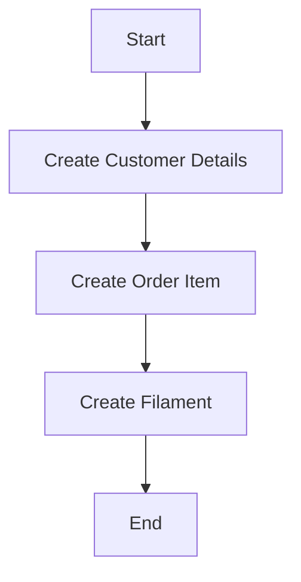
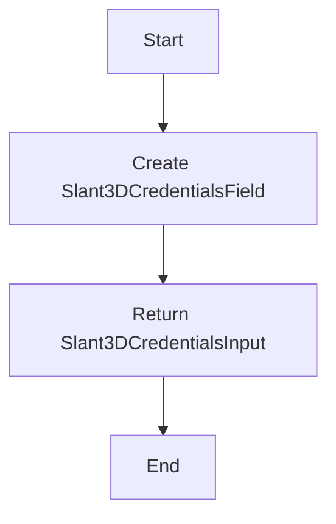

# `.\AutoGPT\autogpt_platform\backend\backend\blocks\slant3d\_api.py` 详细设计文档

This code defines a set of data models and enums for managing customer details, order items, and filament information for a 3D printing service.

## 整体流程



## 类结构

```
CustomerDetails (数据模型)
├── Color (枚举)
│   ├── WHITE
│   └── BLACK
├── Profile (枚举)
│   ├── PLA
│   └── PETG
└── OrderItem (数据模型)
    └── Filament (数据模型)
```

## 全局变量及字段


### `Slant3DCredentialsInput`
    
A type alias for CredentialsMetaInput with specific provider and field types.

类型：`type`
    


### `CredentialsField`
    
A function that returns a Slant3DCredentialsInput.

类型：`function`
    


### `CredentialsMetaInput`
    
A type alias for a generic model input with provider and field types.

类型：`type`
    


### `ProviderName`
    
An enum representing different provider names.

类型：`enum`
    


### `Literal`
    
A type that represents a literal type.

类型：`type`
    


### `BaseModel`
    
A base class for data models with Pydantic.

类型：`class`
    


### `SecretStr`
    
A class for secret strings that are not intended to be logged or printed.

类型：`class`
    


### `APIKeyCredentials`
    
A class representing API key credentials for a provider.

类型：`class`
    


### `TEST_CREDENTIALS`
    
A test instance of APIKeyCredentials with mock data.

类型：`APIKeyCredentials`
    


### `TEST_CREDENTIALS_INPUT`
    
A dictionary containing the input data for TEST_CREDENTIALS.

类型：`dict`
    


### `CustomerDetails`
    
A Pydantic model for customer details.

类型：`class`
    


### `Color`
    
An enum representing different colors.

类型：`enum`
    


### `Profile`
    
An enum representing different profiles.

类型：`enum`
    


### `OrderItem`
    
A Pydantic model for an order item.

类型：`class`
    


### `Filament`
    
A Pydantic model for filament details.

类型：`class`
    


### `CustomerDetails.name`
    
The name of the customer.

类型：`str`
    


### `CustomerDetails.email`
    
The email address of the customer.

类型：`str`
    


### `CustomerDetails.phone`
    
The phone number of the customer.

类型：`str`
    


### `CustomerDetails.address`
    
The address of the customer.

类型：`str`
    


### `CustomerDetails.city`
    
The city of the customer.

类型：`str`
    


### `CustomerDetails.state`
    
The state of the customer.

类型：`str`
    


### `CustomerDetails.zip`
    
The zip code of the customer.

类型：`str`
    


### `CustomerDetails.country_iso`
    
The ISO code of the country of the customer. Default is 'US'.

类型：`str`
    


### `CustomerDetails.is_residential`
    
A boolean indicating if the address is residential. Default is True.

类型：`bool`
    


### `OrderItem.file_url`
    
The URL of the file associated with the order item.

类型：`str`
    


### `OrderItem.quantity`
    
The quantity of the order item. Represented as a string as per API spec.

类型：`str`
    


### `OrderItem.color`
    
The color of the order item. Default is Color.WHITE.

类型：`Color`
    


### `OrderItem.profile`
    
The profile of the order item. Default is Profile.PLA.

类型：`Profile`
    


### `Filament.filament`
    
The type of filament.

类型：`str`
    


### `Filament.hexColor`
    
The hexadecimal color code of the filament.

类型：`str`
    


### `Filament.colorTag`
    
The color tag of the filament.

类型：`str`
    


### `Filament.profile`
    
The profile of the filament.

类型：`str`
    
    

## 全局函数及方法


### Slant3DCredentialsField()

该函数用于创建一个Slant3D API密钥的元数据输入对象。

参数：

- 无

返回值：`Slant3DCredentialsInput`，Slant3D API密钥的元数据输入对象

#### 流程图



#### 带注释源码

```python
from typing import Literal

from pydantic import BaseModel, SecretStr

from backend.data.model import APIKeyCredentials, CredentialsField, CredentialsMetaInput
from backend.integrations.providers import ProviderName

Slant3DCredentialsInput = CredentialsMetaInput[
    Literal[ProviderName.SLANT3D], Literal["api_key"]
]

def Slant3DCredentialsField() -> Slant3DCredentialsInput:
    return CredentialsField(description="Slant3D API key for authentication")
```


### Slant3DCredentialsField()

获取Slant3D API密钥字段的元数据。

参数：

- 无

返回值：`Slant3DCredentialsInput`，表示Slant3D API密钥字段的元数据。

#### 流程图

```mermaid
graph TD
    A[Start] --> B[Slant3DCredentialsField()]
    B --> C[Return Slant3DCredentialsInput]
    C --> D[End]
```

#### 带注释源码

```python
def Slant3DCredentialsField() -> Slant3DCredentialsInput:
    # 返回Slant3D API密钥字段的元数据
    return CredentialsField(description="Slant3D API key for authentication")
```


## 关键组件


### 张量索引与惰性加载

张量索引与惰性加载是深度学习框架中用于高效处理大型数据集的关键技术，它允许在需要时才加载数据，从而减少内存消耗和提高计算效率。

### 反量化支持

反量化支持是针对量化模型进行优化的一种技术，它允许模型在量化过程中保持较高的精度，从而在降低模型复杂度的同时保持性能。

### 量化策略

量化策略是模型压缩技术的一部分，它通过将模型中的浮点数参数转换为低精度整数来减少模型大小和计算需求，同时保持可接受的性能。常见的量化策略包括全精度量化、定点量化等。


## 问题及建议


### 已知问题

-   **数据类型不一致性**：`OrderItem` 类中的 `quantity` 字段被定义为字符串类型，而其他字段如 `filename`、`image_url` 和 `sku` 在注释中提到应为字符串类型，但没有在类定义中体现，这可能导致数据类型不一致性。
-   **全局变量使用**：`TEST_CREDENTIALS` 和 `TEST_CREDENTIALS_INPUT` 作为全局变量使用，这可能会在大型项目中导致难以追踪和维护。
-   **注释缺失**：代码中存在一些字段和方法的注释缺失，这可能会影响其他开发者对代码的理解。

### 优化建议

-   **统一数据类型**：确保所有字段都使用一致的数据类型，并在类定义中明确注释或文档说明。
-   **避免全局变量**：考虑将 `TEST_CREDENTIALS` 和 `TEST_CREDENTIALS_INPUT` 作为函数参数或类属性传递，以避免全局变量的使用。
-   **添加注释**：为所有字段和方法添加适当的注释，以提高代码的可读性和可维护性。
-   **使用更具体的模型**：对于 `Filament` 类，可以考虑使用更具体的模型来描述其属性，例如添加 `material` 字段来描述使用的材料类型。
-   **异常处理**：在处理外部依赖和接口契约时，应添加异常处理逻辑，以确保系统的健壮性。
-   **数据流与状态机**：考虑使用状态机来管理订单的状态转换，例如从创建到完成的过程。


## 其它


### 设计目标与约束

- 设计目标：
  - 提供一个用于管理用户订单和材料信息的系统。
  - 确保数据的一致性和安全性。
  - 提供灵活的配置选项以满足不同用户需求。

- 约束：
  - 必须使用Pydantic库进行数据验证。
  - API密钥必须使用SecretStr进行加密存储。
  - 颜色和材料配置必须符合预定义的枚举类型。

### 错误处理与异常设计

- 错误处理：
  - 使用Pydantic的验证错误来处理数据验证失败的情况。
  - 对于外部API调用失败，应捕获异常并返回适当的错误信息。

- 异常设计：
  - 定义自定义异常类以处理特定于应用程序的错误情况。
  - 异常应提供足够的信息以便于调试和用户理解。

### 数据流与状态机

- 数据流：
  - 用户输入订单信息，包括文件URL、数量、颜色和材料配置。
  - 系统验证输入数据并存储订单信息。
  - 系统根据订单信息生成材料需求。

- 状态机：
  - 订单可能处于“待处理”、“正在处理”和“已完成”状态。
  - 状态转换基于订单处理流程。

### 外部依赖与接口契约

- 外部依赖：
  - Pydantic库用于数据验证。
  - SecretStr用于加密存储敏感信息。

- 接口契约：
  - API密钥验证接口。
  - 订单处理接口。
  - 材料配置接口。


    