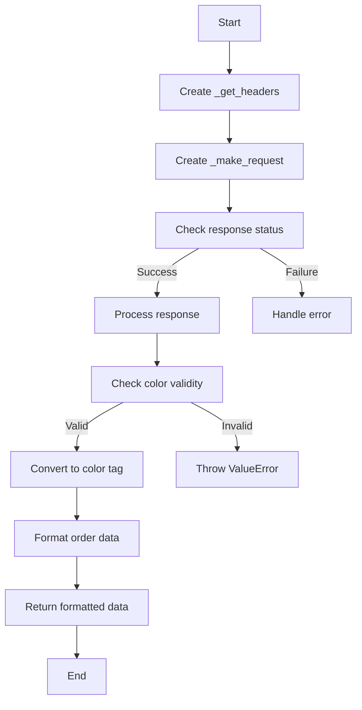
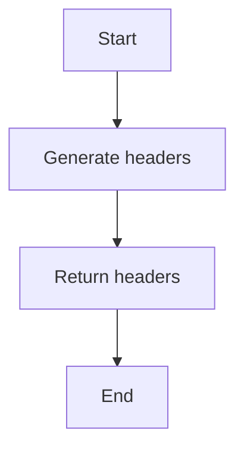
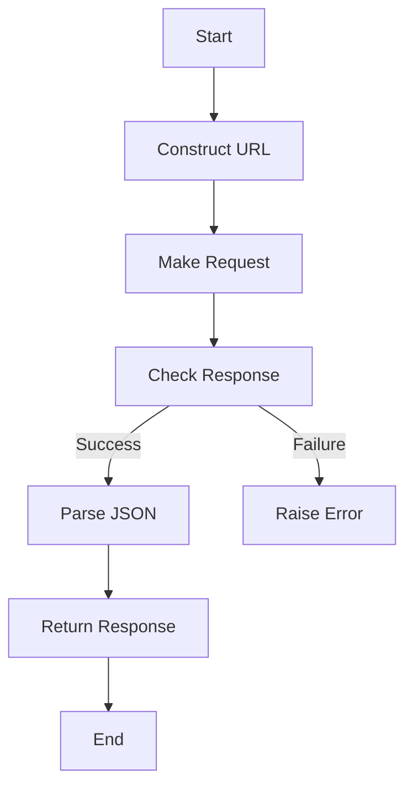
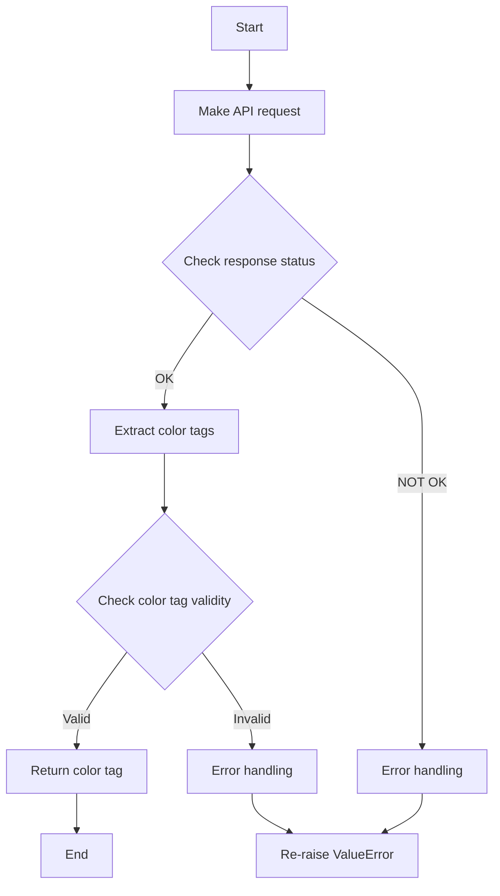
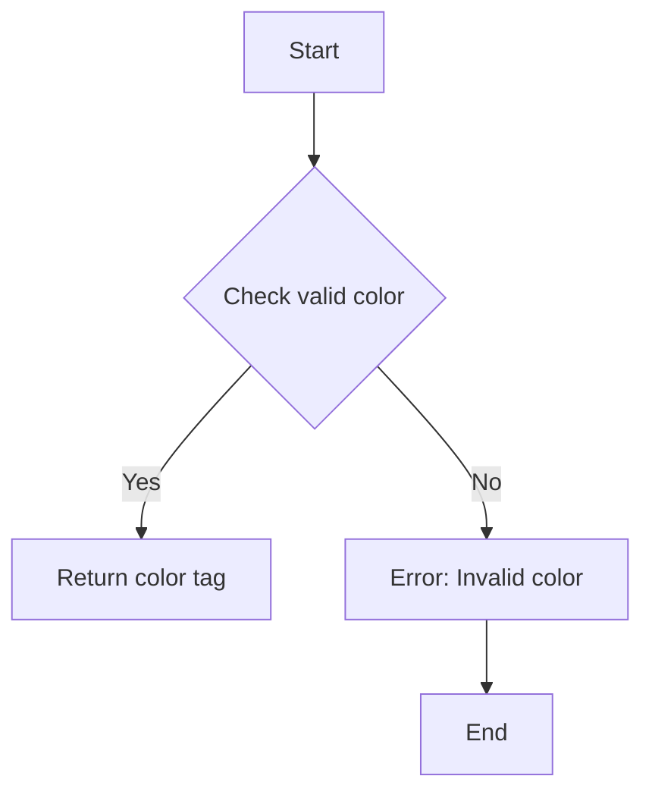
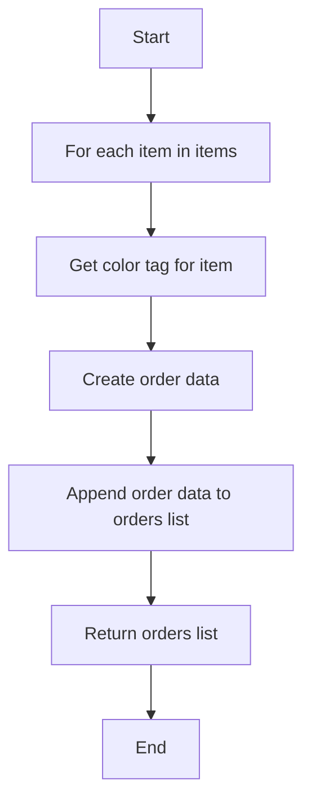
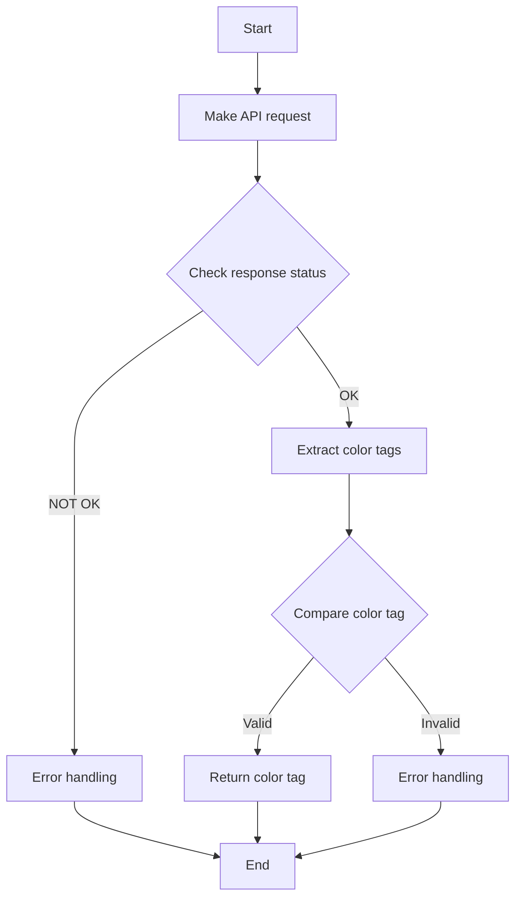
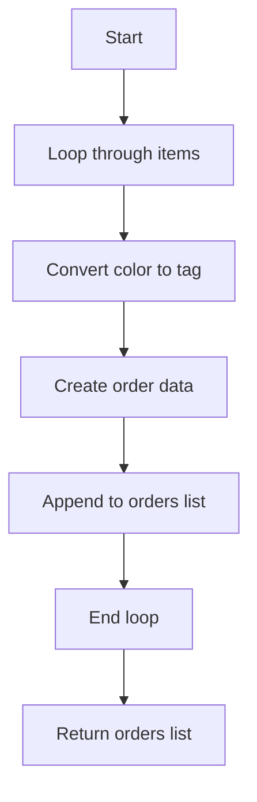

# `.\AutoGPT\autogpt_platform\backend\backend\blocks\slant3d\base.py` 详细设计文档

The code provides a base class for interacting with the Slant3D API, handling requests, validating colors, and formatting order data.

## 整体流程



## 类结构

```
Slant3DBlockBase (Block)
├── _get_headers (method)
│   ├── api_key (str)
│   └── Returns (Dict[str, str])
├── _make_request (async method)
│   ├── method (str)
│   ├── endpoint (str)
│   ├── api_key (str)
│   └── kwargs (Dict)
│   └── Returns (Dict)
├── _check_valid_color (async method)
│   ├── profile (Profile)
│   ├── color (Color)
│   ├── api_key (str)
│   └── Returns (str)
├── _convert_to_color (async method)
│   ├── profile (Profile)
│   ├── color (Color)
│   ├── api_key (str)
│   └── Returns (str)
├── _format_order_data (async method)
│   ├── customer (CustomerDetails)
│   ├── order_number (str)
│   ├── items (list[OrderItem])
│   ├── api_key (str)
│   └── Returns (list[dict[str, Any]])
└── Methods and fields of Block
```

## 全局变量及字段


### `BASE_URL`
    
The base URL for the Slant3D API endpoint requests.

类型：`str`
    


### `Slant3DBlockBase.BASE_URL`
    
The base URL for the Slant3D API endpoint requests.

类型：`str`
    
    

## 全局函数及方法


### `_get_headers`

This method generates the headers required for making API requests to the Slant3D API.

参数：

- `api_key`：`str`，The API key used for authentication with the Slant3D API.

返回值：`Dict[str, str]`，A dictionary containing the headers for the API request.

#### 流程图



#### 带注释源码

```python
def _get_headers(self, api_key: str) -> Dict[str, str]:
    # Return a dictionary with the required headers for the API request
    return {"api-key": api_key, "Content-Type": "application/json"}
```


### `_make_request`

This method is responsible for making an API request to the Slant3D API using the specified HTTP method, endpoint, and API key. It handles the request, parses the response, and raises an error if the response is not successful.

参数：

- `method`：`str`，The HTTP method to use for the request (e.g., "GET", "POST", "PUT", "DELETE").
- `endpoint`：`str`，The API endpoint to which the request is sent.
- `api_key`：`str`，The API key required for authentication.
- `**kwargs`：`Any`，Additional keyword arguments that are passed to the `Requests().request` method.

返回值：`Dict`，The JSON response from the API.

#### 流程图



#### 带注释源码

```python
async def _make_request(
    self, method: str, endpoint: str, api_key: str, **kwargs
) -> Dict:
    url = f"{self.BASE_URL}/{endpoint}"
    response = await Requests().request(
        method=method, url=url, headers=self._get_headers(api_key), **kwargs
    )
    resp = response.json()

    if not response.ok:
        error_msg = resp.get("error", "Unknown error")
        raise RuntimeError(f"API request failed: {error_msg}")

    return resp
```


### `_check_valid_color`

This method checks if the color profile combination is valid for a given profile and color.

参数：

- `profile`：`Profile`，The profile of the filament material.
- `color`：`Color`，The color of the filament material.
- `api_key`：`str`，The API key for authentication.

返回值：`str`，The valid color tag for the profile and color.

#### 流程图



#### 带注释源码

```python
async def _check_valid_color(
    self, profile: Profile, color: Color, api_key: str
) -> str:
    response = await self._make_request(
        "GET",
        "filament",
        api_key,
        params={"profile": profile.value, "color": color.value},
    )
    # Check if the response is successful
    if not response.ok:
        error_msg = response.get("error", "Unknown error")
        raise RuntimeError(f"API request failed: {error_msg}")

    # Extract the color tags from the response
    valid_tags = [filament["colorTag"] for filament in response["filaments"]]

    # Check if the color tag is valid
    color_tag = color.value if profile == Profile.PLA else f"{profile.value.lower()}{color.value.capitalize()}"
    if color_tag not in valid_tags:
        raise ValueError(
            f"""Invalid color profile combination {color_tag}.
Valid colors for {profile.value} are:
{','.join([filament['colorTag'].replace(profile.value.lower(), '') for filament in response['filaments'] if filament['profile'] == profile.value])}
"""
        )

    # Return the valid color tag
    return color_tag
```


### `_convert_to_color`

Converts a color profile and color to a valid color tag for API requests.

参数：

- `profile`：`Profile`，The color profile to use.
- `color`：`Color`，The color to convert.
- `api_key`：`str`，The API key for making requests.

返回值：`str`，The valid color tag for the given profile and color.

#### 流程图



#### 带注释源码

```python
async def _convert_to_color(
    self, profile: Profile, color: Color, api_key: str
) -> str:
    return await self._check_valid_color(profile, color, api_key)
```


### `_format_order_data`

Helper function to format order data for API requests

参数：

- `customer`：`CustomerDetails`，Customer details including email, phone, name, address, city, state, zip, country_iso, and is_residential.
- `order_number`：`str`，The order number for the customer's order.
- `items`：`list[OrderItem]`，A list of order items, each containing file_url, profile, and color.
- `api_key`：`str`，The API key for making requests to the Slant3D API.

返回值：`list[dict[str, Any]]`，A list of dictionaries containing formatted order data for API requests.

#### 流程图



#### 带注释源码

```
async def _format_order_data(
    self,
    customer: CustomerDetails,
    order_number: str,
    items: list[OrderItem],
    api_key: str,
) -> list[dict[str, Any]]:
    """Helper function to format order data for API requests"""
    orders = []
    for item in items:
        color_tag = await self._convert_to_color(item.profile, item.color, api_key)
        order_data = {
            "email": customer.email,
            "phone": customer.phone,
            "name": customer.name,
            "orderNumber": order_number,
            "filename": item.file_url,
            "fileURL": item.file_url,
            "bill_to_street_1": customer.address,
            "bill_to_city": customer.city,
            "bill_to_state": customer.state,
            "bill_to_zip": customer.zip,
            "bill_to_country_as_iso": customer.country_iso,
            "bill_to_is_US_residential": str(customer.is_residential).lower(),
            "ship_to_name": customer.name,
            "ship_to_street_1": customer.address,
            "ship_to_city": customer.city,
            "ship_to_state": customer.state,
            "ship_to_zip": customer.zip,
            "ship_to_country_as_iso": customer.country_iso,
            "ship_to_is_US_residential": str(customer.is_residential).lower(),
            "order_item_name": item.file_url,
            "order_quantity": item.quantity,
            "order_image_url": "",
            "order_sku": "NOT_USED",
            "order_item_color": color_tag,
            "profile": item.profile.value,
        }
        orders.append(order_data)
    return orders
```


### `_get_headers`

This method generates the headers required for making API requests to the Slant3D API.

参数：

- `api_key`：`str`，The API key used for authentication with the Slant3D API.

返回值：`Dict[str, str]`，A dictionary containing the headers for the API request.

#### 流程图


#### 带注释源码

```python
def _get_headers(self, api_key: str) -> Dict[str, str]:
    # Return a dictionary with the required headers for the API request
    return {"api-key": api_key, "Content-Type": "application/json"}
```


### `_make_request`

This method is responsible for making an API request to the Slant3D API using the specified HTTP method, endpoint, and API key. It handles the request, parses the response, and raises an error if the response is not successful.

参数：

- `method`：`str`，The HTTP method to use for the request (e.g., "GET", "POST", "PUT", "DELETE").
- `endpoint`：`str`，The API endpoint to which the request is sent.
- `api_key`：`str`，The API key required for authentication.
- `**kwargs`：`Any`，Additional keyword arguments that are passed to the `Requests().request` method.

返回值：`Dict`，The JSON response from the API.

#### 流程图


#### 带注释源码

```
async def _make_request(
    self, method: str, endpoint: str, api_key: str, **kwargs
) -> Dict:
    url = f"{self.BASE_URL}/{endpoint}"
    response = await Requests().request(
        method=method, url=url, headers=self._get_headers(api_key), **kwargs
    )
    resp = response.json()

    if not response.ok:
        error_msg = resp.get("error", "Unknown error")
        raise RuntimeError(f"API request failed: {error_msg}")

    return resp
``` 


### `_check_valid_color`

This method checks if the color profile combination is valid for a given filament profile.

参数：

- `profile`：`Profile`，The filament profile for which the color is being checked.
- `color`：`Color`，The color to be checked against the filament profile.
- `api_key`：`str`，The API key used for authentication with the Slant3D API.

返回值：`str`，The valid color tag for the given profile and color.

#### 流程图



#### 带注释源码

```python
async def _check_valid_color(
    self, profile: Profile, color: Color, api_key: str
) -> str:
    response = await self._make_request(
        "GET",
        "filament",
        api_key,
        params={"profile": profile.value, "color": color.value},
    )
    # Check if the profile is PLA
    if profile == Profile.PLA:
        color_tag = color.value
    else:
        color_tag = f"{profile.value.lower()}{color.value.capitalize()}"

    # Extract valid color tags from the response
    valid_tags = [filament["colorTag"] for filament in response["filaments"]]

    # Check if the color tag is valid
    if color_tag not in valid_tags:
        raise ValueError(
            f"""Invalid color profile combination {color_tag}.
Valid colors for {profile.value} are:
{','.join([filament['colorTag'].replace(profile.value.lower(), '') for filament in response['filaments'] if filament['profile'] == profile.value])}
"""
        )

    # Return the valid color tag
    return color_tag
```


### `_convert_to_color`

This method checks the validity of a color profile combination for a given profile and color, ensuring that the combination is valid according to the Slant3D API.

参数：

- `profile`：`Profile`，The profile of the filament to be checked.
- `color`：`Color`，The color of the filament to be checked.
- `api_key`：`str`，The API key used for authentication with the Slant3D API.

返回值：`str`，The valid color tag for the given profile and color.

#### 流程图


#### 带注释源码

```
async def _convert_to_color(
    self, profile: Profile, color: Color, api_key: str
) -> str:
    return await self._check_valid_color(profile, color, api_key)
``` 


### `_format_order_data`

Helper function to format order data for API requests

参数：

- `customer`：`CustomerDetails`，Customer details for the order
- `order_number`：`str`，The order number for the order
- `items`：`list[OrderItem]`，A list of items in the order
- `api_key`：`str`，API key for authentication

返回值：`list[dict[str, Any]]`，A list of formatted order data dictionaries

#### 流程图



#### 带注释源码

```
async def _format_order_data(
    self,
    customer: CustomerDetails,
    order_number: str,
    items: list[OrderItem],
    api_key: str,
) -> list[dict[str, Any]]:
    orders = []
    for item in items:
        color_tag = await self._convert_to_color(item.profile, item.color, api_key)
        order_data = {
            "email": customer.email,
            "phone": customer.phone,
            "name": customer.name,
            "orderNumber": order_number,
            "filename": item.file_url,
            "fileURL": item.file_url,
            "bill_to_street_1": customer.address,
            "bill_to_city": customer.city,
            "bill_to_state": customer.state,
            "bill_to_zip": customer.zip,
            "bill_to_country_as_iso": customer.country_iso,
            "bill_to_is_US_residential": str(customer.is_residential).lower(),
            "ship_to_name": customer.name,
            "ship_to_street_1": customer.address,
            "ship_to_city": customer.city,
            "ship_to_state": customer.state,
            "ship_to_zip": customer.zip,
            "ship_to_country_as_iso": customer.country_iso,
            "ship_to_is_US_residential": str(customer.is_residential).lower(),
            "order_item_name": item.file_url,
            "order_quantity": item.quantity,
            "order_image_url": "",
            "order_sku": "NOT_USED",
            "order_item_color": color_tag,
            "profile": item.profile.value,
        }
        orders.append(order_data)
    return orders
```


## 关键组件


### 张量索引与惰性加载

用于延迟加载和索引张量数据，以优化内存使用和性能。

### 反量化支持

提供对反量化操作的支持，允许在量化过程中进行逆量化。

### 量化策略

定义了量化策略，用于在模型训练和推理过程中对模型参数进行量化。


## 问题及建议


### 已知问题

-   **异步请求处理**: 代码中使用了异步请求，但没有处理可能的异常，如网络问题或API限制。
-   **错误消息**: 错误消息可能不够具体，难以追踪问题源头。
-   **代码重复**: `_convert_to_color` 和 `_format_order_data` 方法中存在重复代码，可以考虑提取公共逻辑。
-   **全局变量**: `BASE_URL` 作为全局变量，如果API地址变更，需要修改多个地方。
-   **参数验证**: 代码中没有对输入参数进行验证，如 `api_key` 是否有效。

### 优化建议

-   **异常处理**: 增加对异步请求的异常处理，如捕获 `requests.exceptions.RequestException`。
-   **错误消息**: 提供更具体的错误消息，包括请求的详细信息，如URL、方法、参数等。
-   **代码重构**: 将重复的代码提取到单独的方法中，减少代码冗余。
-   **全局变量管理**: 将 `BASE_URL` 等全局变量移至配置文件或环境变量中，便于管理。
-   **参数验证**: 在调用方法之前验证输入参数的有效性，确保数据正确性。
-   **单元测试**: 编写单元测试，确保代码的稳定性和可维护性。
-   **文档**: 增加代码注释和文档，提高代码的可读性和可维护性。


## 其它


### 设计目标与约束

- 设计目标：
  - 提供一个基础类 `Slant3DBlockBase` 用于与 Slant3D API 进行交互。
  - 支持异步请求以优化性能。
  - 提供错误处理机制以确保稳健性。
  - 确保数据格式正确以避免API错误。

- 约束：
  - 必须使用 Slant3D API 的特定端点和参数。
  - API密钥必须保密且安全存储。
  - 请求和响应必须遵循 JSON 格式。

### 错误处理与异常设计

- 错误处理：
  - 使用 `RuntimeError` 抛出 API 请求失败。
  - 使用 `ValueError` 抛出颜色配置错误。

- 异常设计：
  - 异常类应提供足够的信息以帮助调试和修复问题。
  - 异常应遵循 Python 的标准异常命名约定。

### 数据流与状态机

- 数据流：
  - 用户数据通过 `CustomerDetails` 类传递。
  - 订单数据通过 `OrderItem` 类列表传递。
  - 颜色验证和转换通过 `_convert_to_color` 方法进行。

- 状态机：
  - 无需状态机，因为操作是线性的。

### 外部依赖与接口契约

- 外部依赖：
  - `backend.data.block.Block` 类。
  - `backend.util.request.Requests` 类。

- 接口契约：
  - `Slant3DBlockBase` 类应遵循 Slant3D API 的接口规范。
  - 所有方法应返回预期的数据类型或抛出异常。


    