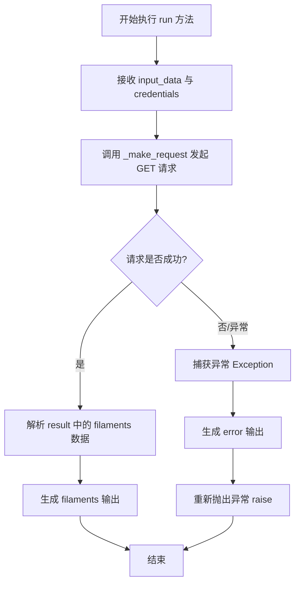

# `AutoGPT\autogpt_platform\backend\backend\blocks\slant3d\filament.py` 详细设计文档

该代码定义了一个名为 Slant3DFilamentBlock 的类，继承自 Slant3DBlockBase，用于封装通过 API 获取 Slant3D 服务可用 3D 打印耗材列表的逻辑，包括输入输出定义、初始化配置以及异步执行请求并返回结果或错误的核心流程。

## 整体流程



## 类结构

```
Slant3DBlockBase
└── Slant3DFilamentBlock
    ├── Input (BlockSchemaInput)
    │   └── credentials: Slant3DCredentialsInput
    └── Output (BlockSchemaOutput)
        └── filaments: List[Filament]
```

## 全局变量及字段


### `Slant3DFilamentBlock.Input`
    
定义块的输入数据结构，包含用于API认证的凭据字段

类型：`BlockSchemaInput`
    


### `Slant3DFilamentBlock.Output`
    
定义块的输出数据结构，包含获取到的可用线材列表

类型：`BlockSchemaOutput`
    


### `Slant3DFilamentBlock.Input.credentials`
    
用于进行Slant3D API认证的凭据输入

类型：`Slant3DCredentialsInput`
    


### `Slant3DFilamentBlock.Output.filaments`
    
包含颜色、材质等信息的可用线材对象列表

类型：`List[Filament]`
    
    

## 全局函数及方法


### `Slant3DFilamentBlock.__init__`

该方法用于初始化`Slant3DFilamentBlock`类的实例。它通过配置块的唯一标识符、描述、输入输出Schema以及测试相关参数（如测试输入、凭证、输出和模拟请求），并将这些配置传递给父类`Slant3DBlockBase`的构造函数来完成初始化。

参数：

-  `self`：`Slant3DFilamentBlock`，类的实例本身。

返回值：`None`，无返回值。

#### 流程图

```mermaid
graph TD
    A[开始] --> B[调用父类 super().__init__]
    B --> C1[传入 id: 唯一标识符]
    B --> C2[传入 description: 描述信息]
    B --> C3[传入 input_schema: 输入模式]
    B --> C4[传入 output_schema: 输出模式]
    B --> C5[传入 test_input: 测试输入]
    B --> C6[传入 test_credentials: 测试凭证]
    B --> C7[传入 test_output: 测试输出]
    B --> C8[传入 test_mock: 模拟请求函数]
    C1 --> D[父类初始化完成]
    C2 --> D
    C3 --> D
    C4 --> D
    C5 --> D
    C6 --> D
    C7 --> D
    C8 --> D
    D --> E[结束]
```

#### 带注释源码

```python
    def __init__(self):
        # 调用父类的初始化方法，配置块的基本元数据和测试环境
        super().__init__(
            # 定义该块在系统中的唯一 ID
            id="7cc416f4-f305-4606-9b3b-452b8a81031c",
            # 定义该块的功能描述
            description="Get list of available filaments",
            # 指定输入数据的结构验证模型（使用内部类 Input）
            input_schema=self.Input,
            # 指定输出数据的结构验证模型（使用内部类 Output）
            output_schema=self.Output,
            # 定义用于单元测试的输入数据，包含模拟凭证
            test_input={"credentials": TEST_CREDENTIALS_INPUT},
            # 定义用于单元测试的凭证对象
            test_credentials=TEST_CREDENTIALS,
            # 定义预期的单元测试输出结果，包含两种丝材数据
            test_output=[
                (
                    "filaments",
                    [
                        {
                            "filament": "PLA BLACK",
                            "hexColor": "000000",
                            "colorTag": "black",
                            "profile": "PLA",
                        },
                        {
                            "filament": "PLA WHITE",
                            "hexColor": "ffffff",
                            "colorTag": "white",
                            "profile": "PLA",
                        },
                    ],
                )
            ],
            # 定义测试时的模拟行为，拦截 _make_request 方法并返回预设的 Mock 数据
            test_mock={
                "_make_request": lambda *args, **kwargs: {
                    "filaments": [
                        {
                            "filament": "PLA BLACK",
                            "hexColor": "000000",
                            "colorTag": "black",
                            "profile": "PLA",
                        },
                        {
                            "filament": "PLA WHITE",
                            "hexColor": "ffffff",
                            "colorTag": "white",
                            "profile": "PLA",
                        },
                    ]
                }
            },
        )
```


### `Slant3DFilamentBlock.run`

该方法是 `Slant3DFilamentBlock` 的核心执行逻辑，负责通过异步请求获取 Slant3D 服务上可用的灯丝列表，并处理请求过程中的成功响应与异常情况。

参数：

- `input_data`：`Input`，包含运行所需输入数据的对象，在本方法中主要作为接口签名的一部分，实际逻辑中未直接使用其字段（凭证通过单独参数传递）。
- `credentials`：`APIKeyCredentials`，用于 API 认证的凭证对象，包含访问 Slant3D API 所需的密钥。
- `**kwargs`：`dict`，其他额外的关键字参数，用于扩展或传递上下文信息。

返回值：`BlockOutput`，一个异步生成器，产出包含键值对的元组。成功时产出 `("filaments", data)`，失败时产出 `("error", message)`。

#### 流程图

```mermaid
flowchart TD
    Start([开始]) --> TryBlock{尝试执行}
    
    TryBlock --> MakeRequest[调用 self._make_request<br/>方法: 'GET', 'filament', api_key]
    
    MakeRequest --> ParseResult[解析结果 result<br/>获取 result['filaments']]
    
    ParseResult --> YieldSuccess[产出 'filaments' 和 灯丝列表]
    
    YieldSuccess --> End([结束])
    
    TryBlock -->|捕获异常 Exception e| CatchBlock
    CatchBlock --> YieldError[产出 'error' 和 异常信息]
    YieldError --> Raise[重新抛出异常 raise]
    Raise --> End
```

#### 带注释源码

```python
    async def run(
        self, input_data: Input, *, credentials: APIKeyCredentials, **kwargs
    ) -> BlockOutput:
        try:
            # 调用内部方法 _make_request 发起 GET 请求到 'filament' 端点
            # 使用凭证中的 API 密钥进行认证
            result = await self._make_request(
                "GET", "filament", credentials.api_key.get_secret_value()
            )
            # 请求成功后，从响应结果中提取 'filaments' 数据并产出
            yield "filaments", result["filaments"]
        except Exception as e:
            # 如果发生任何异常，产出 'error' 键和具体的错误信息
            yield "error", str(e)
            # 重新抛出异常，确保上层调用者也能感知到错误
            raise
```


## 关键组件


### Slant3DFilamentBlock

核心功能组件，继承自 Slant3DBlockBase，负责定义获取 Slant3D 灯丝列表的元数据、输入输出契约以及具体的执行逻辑。

### Input

输入契约组件，定义了该模块所需的输入参数结构，包含用于身份验证的 API 凭证字段。

### Output

输出契约组件，定义了模块执行成功后的返回数据结构，封装了可用的灯丝列表字段。

### run

异步执行引擎，负责协调 API 请求的发送、凭据的注入、响应数据的解析以及异常的处理与传递。


## 问题及建议


### 已知问题

-   **异常处理逻辑冗余且存在潜在风险**：在 `run` 方法中捕获了通用的 `Exception`，并在通过 `yield "error", str(e)` 输出错误信息后立即执行 `raise`。这种“双重错误报告”机制可能导致上层框架重复处理错误，或者在期望优雅处理错误的场景下意外中断流程。
-   **缺少响应数据的结构与类型校验**：代码直接通过字典键 `result["filaments"]` 获取数据。如果 API 返回的 JSON 结构发生变化（例如字段名错误或返回 null），虽然有通用异常捕获，但缺乏对返回数据是否符合 `Filament` 模型的显式验证，可能导致后续处理出现类型不匹配。
-   **测试数据与业务逻辑耦合**：在 `__init__` 方法中硬编码了大量详细的 `test_mock`、`test_input` 和 `test_output` 数据。这不仅使得类定义冗长，还违反了单一职责原则，将测试 fixture 数据与生产运行逻辑紧密耦合在一起。

### 优化建议

-   **引入响应模型进行数据验证**：建议定义明确的 Pydantic 模型（或项目使用的等价 Schema）来映射 API 的响应结构。在获取 `result` 后，使用该模型进行解析和验证，以确保数据的完整性和类型安全，避免直接操作原始字典。
-   **优化异常处理策略**：重新评估错误处理逻辑。如果该 Block 的设计意图是通过输出流传递错误，则应移除 `raise` 语句，仅 yield 错误；如果需要由上层捕获异常来终止流程，则应移除 yield。通常对于工作流 Block，推荐仅 yield 错误并正常结束，或者根据框架约定处理。
-   **增加日志记录**：在 `run` 方法中添加结构化日志记录。记录 API 请求的发起、成功返回的数据摘要以及捕获到的异常详情，以便于在生产环境中进行问题排查和监控。
-   **剥离测试配置**：将 `test_mock`、`test_credentials` 等测试相关的硬编码数据从类定义中移出，放置在单独的测试配置文件、YAML 文件或 Pytest fixtures 中，以保持业务代码的整洁和可维护性。


## 其它


### 设计目标与约束

该代码块旨在封装从 Slant3D API 获取 3D 打印材料列表的逻辑。设计约束要求该块必须在异步环境中运行，以保证非阻塞 I/O 操作；必须继承自 `Slant3DBlockBase` 并遵循其定义的规范；仅使用 API 密钥进行认证，且不维护类级别的可变状态，以确保线程安全和可重用性。

### 错误处理与异常设计

采用“捕获-通知-抛出”的异常处理策略。在 `run` 方法中捕获所有异常，通过 `yield` 将错误信息输出到 "error" 端口，随后重新抛出该异常。这确保了调用方可以通过输出流感知错误，同时通过异常机制中断后续执行流程，防止错误状态扩散。

### 数据流与状态机

数据流单向流动：接收输入凭据 -> 发起异步 HTTP GET 请求 -> 解析响应体中的 "filaments" 字段 -> 输出材料列表。该组件是无状态的，不维护持久化状态机，每次执行仅依赖于当前的输入和外部 API 的实时响应。

### 外部依赖与接口契约

内部依赖 `Slant3DBaseBlock` 提供网络请求能力（`_make_request`），依赖 `backend.data` 模块定义的数据结构。外部依赖 Slant3D API，接口契约要求调用 GET 类型的 "filament" 接口时，返回的 JSON 数据必须包含 "filaments" 键，且其值为包含特定字段（如 `filament`, `hexColor`）的字典列表。

### 测试与验证策略

利用依赖注入和 Mock 数据进行隔离测试。通过 `__init__` 中定义的 `test_mock` 字段，使用 lambda 函数模拟 `_make_request` 的返回值，从而在不发起真实网络请求的情况下验证逻辑。配合 `test_input` 和 `test_output`，为自动化测试框架提供了输入样本和预期的输出基准，确保代码重构或 API 变更时的功能一致性。

    