# `.\AutoGPT\autogpt_platform\backend\backend\blocks\slant3d\order.py` 详细设计文档

The code provides a set of blocks for managing orders and tracking shipping with the Slant3D API, including creating orders, estimating costs, retrieving orders, tracking shipping, and canceling orders.

## 整体流程

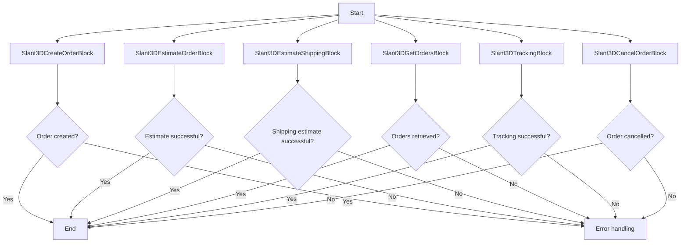

## 类结构

```
Slant3DBlockBase (抽象基类)
├── Slant3DCreateOrderBlock
│   ├── Input
│   ├── Output
│   └── __init__
│       ├── id
│       ├── description
│       ├── input_schema
│       ├── output_schema
│       ├── test_input
│       ├── test_credentials
│       └── test_output
├── Slant3DEstimateOrderBlock
│   ├── Input
│   ├── Output
│   └── __init__
│       ├── id
│       ├── description
│       ├── input_schema
│       ├── output_schema
│       ├── test_input
│       ├── test_credentials
│       └── test_output
├── Slant3DEstimateShippingBlock
│   ├── Input
│   ├── Output
│   └── __init__
│       ├── id
│       ├── description
│       ├── input_schema
│       ├── output_schema
│       ├── test_input
│       ├── test_credentials
│       └── test_output
├── Slant3DGetOrdersBlock
│   ├── Input
│   ├── Output
│   └── __init__
│       ├── id
│       ├── description
│       ├── input_schema
│       ├── output_schema
│       ├── test_input
│       ├── test_credentials
│       └── test_output
├── Slant3DTrackingBlock
│   ├── Input
│   ├── Output
│   └── __init__
│       ├── id
│       ├── description
│       ├── input_schema
│       ├── output_schema
│       ├── test_input
│       ├── test_credentials
│       └── test_output
└── Slant3DCancelOrderBlock
   ├── Input
   ├── Output
   └── __init__
       ├── id
       ├── description
       ├── input_schema
       ├── output_schema
       ├── test_input
       ├── test_credentials
       └── test_output
```

## 全局变量及字段


### `settings`
    
Global settings object containing configuration for the application.

类型：`Settings`
    


### `Slant3DBlockBase.id`
    
Unique identifier for the block.

类型：`str`
    


### `Slant3DBlockBase.description`
    
Description of the block's functionality.

类型：`str`
    


### `Slant3DBlockBase.input_schema`
    
Schema for the input data of the block.

类型：`BlockSchemaInput`
    


### `Slant3DBlockBase.output_schema`
    
Schema for the output data of the block.

类型：`BlockSchemaOutput`
    


### `Slant3DBlockBase.test_input`
    
Test input data for the block.

类型：`dict`
    


### `Slant3DBlockBase.test_credentials`
    
Test credentials for the block.

类型：`APIKeyCredentials`
    


### `Slant3DBlockBase.test_output`
    
Test output data for the block.

类型：`list`
    


### `Slant3DCreateOrderBlock.credentials`
    
Credentials for the Slant3D service.

类型：`Slant3DCredentialsInput`
    


### `Slant3DCreateOrderBlock.order_number`
    
Custom order number or a randomly generated one.

类型：`str`
    


### `Slant3DCreateOrderBlock.customer`
    
Customer details for shipping the item.

类型：`CustomerDetails`
    


### `Slant3DCreateOrderBlock.items`
    
List of items to be printed.

类型：`list`
    


### `Slant3DEstimateOrderBlock.credentials`
    
Credentials for the Slant3D service.

类型：`Slant3DCredentialsInput`
    


### `Slant3DEstimateOrderBlock.order_number`
    
Custom order number or a randomly generated one.

类型：`str`
    


### `Slant3DEstimateOrderBlock.customer`
    
Customer details for shipping the item.

类型：`CustomerDetails`
    


### `Slant3DEstimateOrderBlock.items`
    
List of items to be printed.

类型：`list`
    


### `Slant3DEstimateShippingBlock.credentials`
    
Credentials for the Slant3D service.

类型：`Slant3DCredentialsInput`
    


### `Slant3DEstimateShippingBlock.order_number`
    
Custom order number or a randomly generated one.

类型：`str`
    


### `Slant3DEstimateShippingBlock.customer`
    
Customer details for shipping the item.

类型：`CustomerDetails`
    


### `Slant3DEstimateShippingBlock.items`
    
List of items to be printed.

类型：`list`
    


### `Slant3DGetOrdersBlock.credentials`
    
Credentials for the Slant3D service.

类型：`Slant3DCredentialsInput`
    


### `Slant3DTrackingBlock.credentials`
    
Credentials for the Slant3D service.

类型：`Slant3DCredentialsInput`
    


### `Slant3DTrackingBlock.order_id`
    
Slant3D order ID to track.

类型：`str`
    


### `Slant3DCancelOrderBlock.credentials`
    
Credentials for the Slant3D service.

类型：`Slant3DCredentialsInput`
    


### `Slant3DCancelOrderBlock.order_id`
    
Slant3D order ID to cancel.

类型：`str`
    
    

## 全局函数及方法


### `uuid.uuid4`

生成一个随机的UUID。

参数：

- 无

返回值：`str`，一个由32个十六进制数字组成的字符串，表示UUID。

#### 流程图

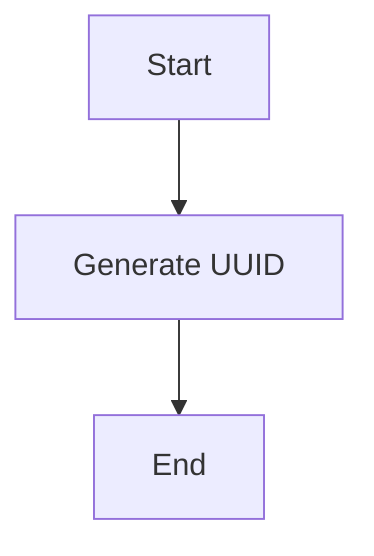

#### 带注释源码

```python
import uuid

def uuid_uuid4():
    # 生成一个随机的UUID
    return str(uuid.uuid4())
```


### `Slant3DCreateOrderBlock.run`

Create a new print order.

参数：

- `input_data`：`Input`，Order input data.
- `credentials`：`APIKeyCredentials`，API key credentials for authentication.

返回值：`BlockOutput`，Output data containing the order ID.

#### 流程图

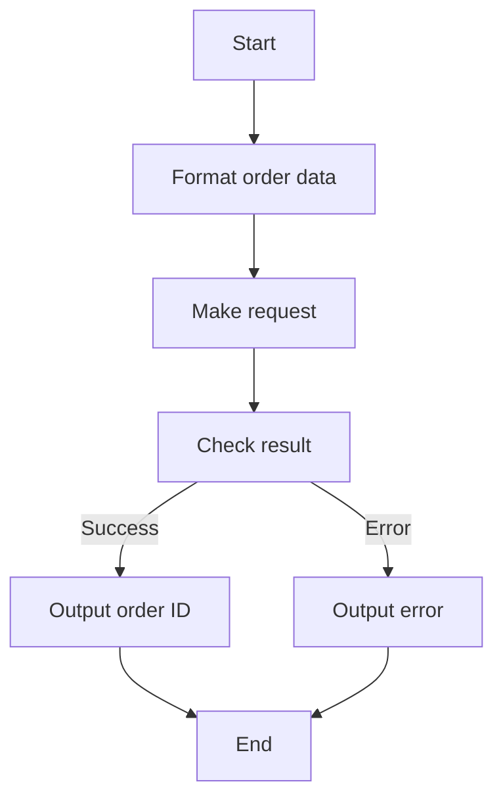

#### 带注释源码

```python
async def run(self, input_data: Input, *, credentials: APIKeyCredentials, **kwargs) -> BlockOutput:
    try:
        order_data = await self._format_order_data(
            input_data.customer,
            input_data.order_number,
            input_data.items,
            credentials.api_key.get_secret_value(),
        )
        result = await self._make_request(
            "POST", "order", credentials.api_key.get_secret_value(), json=order_data
        )
        yield "order_id", result["orderId"]
    except Exception as e:
        yield "error", str(e)
        raise
```


### `Slant3DCreateOrderBlock.run`

Create a new print order

参数：

- `input_data`：`Input`，Order input data
- `credentials`：`APIKeyCredentials`，API key credentials for Slant3D
- `**kwargs`：`Any`，Additional keyword arguments

返回值：`BlockOutput`，Output data containing the order ID

#### 流程图

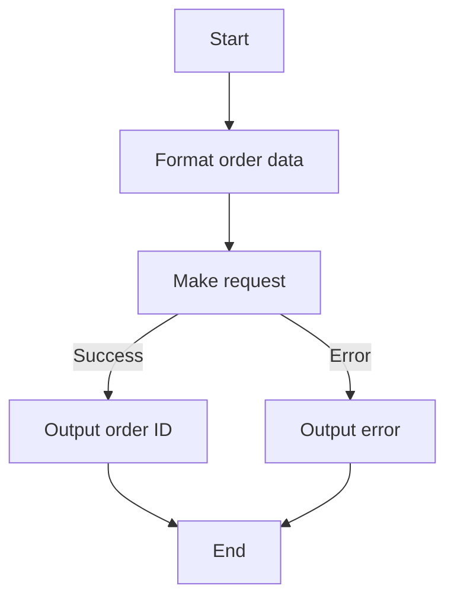

#### 带注释源码

```python
async def run(self, input_data: Input, *, credentials: APIKeyCredentials, **kwargs) -> BlockOutput:
    try:
        order_data = await self._format_order_data(
            input_data.customer,
            input_data.order_number,
            input_data.items,
            credentials.api_key.get_secret_value(),
        )
        result = await self._make_request(
            "POST", "order", credentials.api_key.get_secret_value(), json=order_data
        )
        yield "order_id", result["orderId"]
    except Exception as e:
        yield "error", str(e)
        raise
```


### `super().__init__`

初始化父类 `Slant3DBlockBase`。

描述：

该函数用于初始化 `Slant3DBlockBase` 类，设置一些基本属性，如 ID、描述、输入和输出模式、测试输入、测试凭证、测试输出和测试模拟。

参数：

- `id`：`str`，块的唯一标识符。
- `description`：`str`，块的描述信息。
- `input_schema`：`BlockSchemaInput`，输入模式。
- `output_schema`：`BlockSchemaOutput`，输出模式。
- `test_input`：`dict`，测试输入数据。
- `test_credentials`：`APIKeyCredentials`，测试凭证。
- `test_output`：`list`，测试输出数据。
- `test_mock`：`dict`，测试模拟数据。

返回值：无

#### 流程图

```mermaid
graph LR
A[super().__init__] --> B{初始化父类}
B --> C{设置属性}
```

#### 带注释源码

```python
def __init__(self):
    super().__init__(
        id="f73007d6-f48f-4aaf-9e6b-6883998a09b4",
        description="Create a new print order",
        input_schema=self.Input,
        output_schema=self.Output,
        test_input={
            "credentials": TEST_CREDENTIALS_INPUT,
            "order_number": "TEST-001",
            "customer": {
                "name": "John Doe",
                "email": "john@example.com",
                "phone": "123-456-7890",
                "address": "123 Test St",
                "city": "Test City",
                "state": "TS",
                "zip": "12345",
            },
            "items": [
                {
                    "file_url": "https://example.com/model.stl",
                    "quantity": "1",
                    "color": "black",
                    "profile": "PLA",
                }
            ],
        },
        test_credentials=TEST_CREDENTIALS,
        test_output=[("order_id", "314144241")],
        test_mock={
            "_make_request": lambda *args, **kwargs: {"orderId": "314144241"},
            "_convert_to_color": lambda *args, **kwargs: "black",
        },
    )
```


### `Slant3DCreateOrderBlock.run`

Create a new print order

参数：

- `input_data`：`Input`，Order input data
- `credentials`：`APIKeyCredentials`，API key credentials for Slant3D
- `**kwargs`：`Any`，Additional keyword arguments

返回值：`BlockOutput`，Block output data

#### 流程图

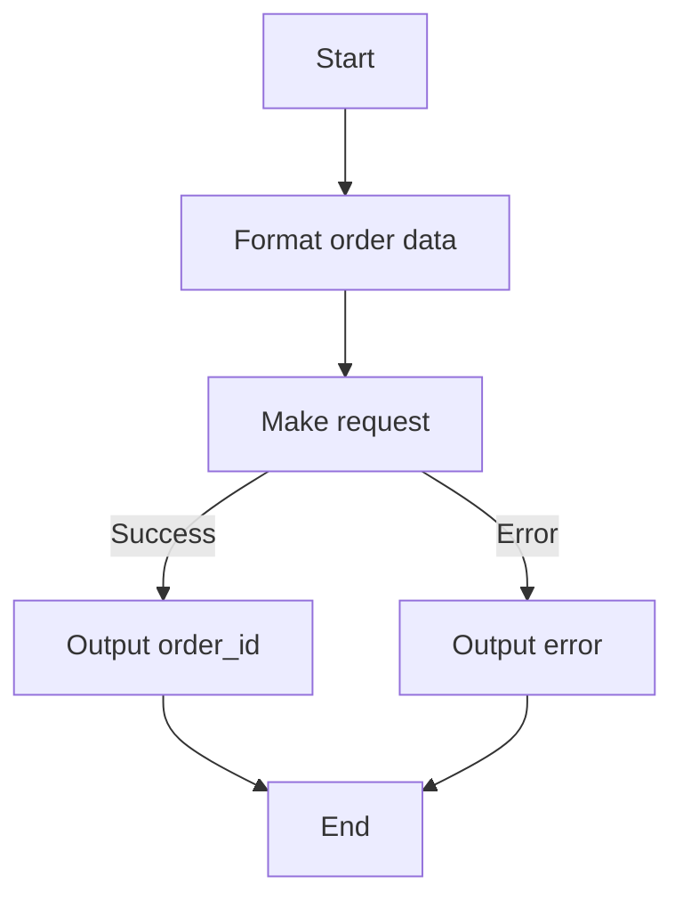

#### 带注释源码

```python
async def run(self, input_data: Input, *, credentials: APIKeyCredentials, **kwargs) -> BlockOutput:
    try:
        order_data = await self._format_order_data(
            input_data.customer,
            input_data.order_number,
            input_data.items,
            credentials.api_key.get_secret_value(),
        )
        result = await self._make_request(
            "POST", "order", credentials.api_key.get_secret_value(), json=order_data
        )
        yield "order_id", result["orderId"]
    except Exception as e:
        yield "error", str(e)
        raise
```


### `Slant3DCreateOrderBlock.run`

Create a new print order

参数：

- `input_data`：`Input`，Order input data
- `credentials`：`APIKeyCredentials`，API key credentials for authentication

返回值：`BlockOutput`，Order output data

#### 流程图

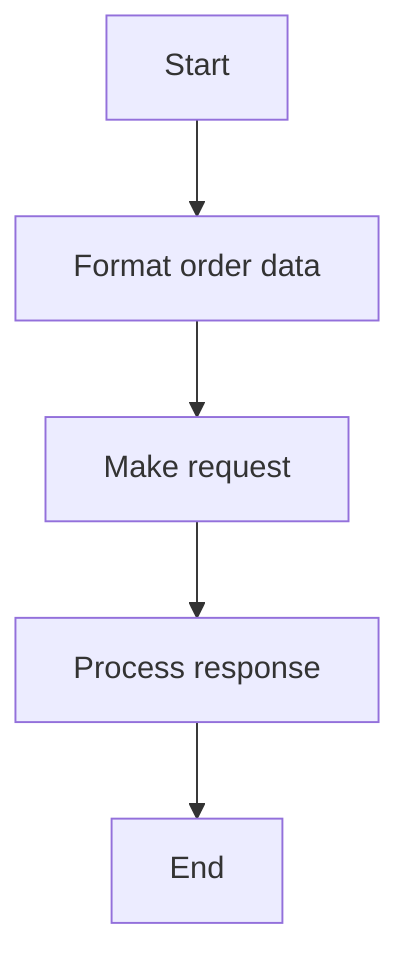

#### 带注释源码

```python
async def run(self, input_data: Input, *, credentials: APIKeyCredentials, **kwargs) -> BlockOutput:
    try:
        order_data = await self._format_order_data(
            input_data.customer,
            input_data.order_number,
            input_data.items,
            credentials.api_key.get_secret_value(),
        )
        result = await self._make_request(
            "POST", "order", credentials.api_key.get_secret_value(), json=order_data
        )
        yield "order_id", result["orderId"]
    except Exception as e:
        yield "error", str(e)
        raise
```


### _format_order_data

This function formats the order data to be sent to the Slant3D API.

参数：

- `customer`：`CustomerDetails`，Customer details for where to ship the item
- `order_number`：`str`，Your custom order number (or leave blank for a random one)
- `items`：`List[OrderItem]`，List of items to print
- `api_key`：`str`，API key for authentication

返回值：`dict`，Formatted order data

#### 流程图

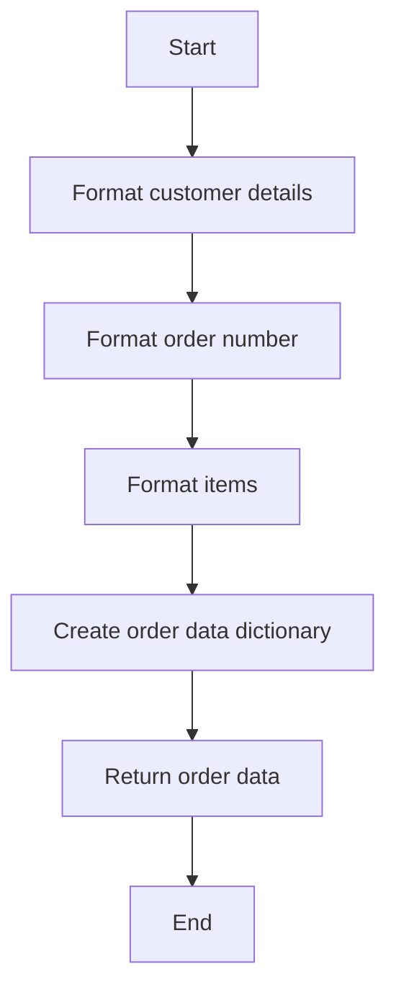

#### 带注释源码

```python
async def _format_order_data(self, customer, order_number, items, api_key):
    order_data = {
        "customer": {
            "name": customer.name,
            "email": customer.email,
            "phone": customer.phone,
            "address": customer.address,
            "city": customer.city,
            "state": customer.state,
            "zip": customer.zip,
        },
        "orderNumber": order_number,
        "items": [
            {
                "fileUrl": item.file_url,
                "quantity": item.quantity,
                "color": item.color,
                "profile": item.profile,
            }
            for item in items
        ],
        "apiKey": api_key,
    }
    return order_data
```


### `_make_request`

This method is a private method used to make HTTP requests to the Slant3D API.

参数：

- `method`：`str`，The HTTP method to use (e.g., "GET", "POST", "DELETE").
- `endpoint`：`str`，The API endpoint to call.
- `api_key`：`str`，The API key to use for authentication.
- `json`：`dict`，The JSON payload to send with the request (optional).

返回值：`dict`，The JSON response from the API.

#### 流程图

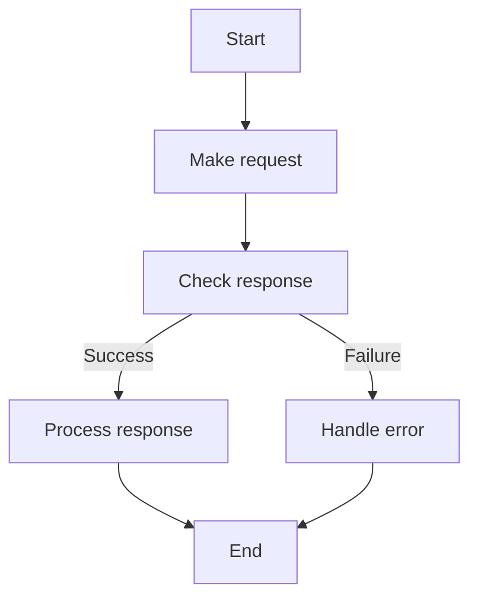

#### 带注释源码

```python
async def _make_request(self, method: str, endpoint: str, api_key: str, json: dict = None):
    headers = {
        "Authorization": f"Bearer {api_key}",
        "Content-Type": "application/json",
    }
    url = f"https://api.slant3d.com/{endpoint}"
    async with aiohttp.ClientSession() as session:
        async with session.request(method, url, headers=headers, json=json) as response:
            return await response.json()
```


### `Slant3DCreateOrderBlock.__init__`

初始化 `Slant3DCreateOrderBlock` 类，设置其属性以创建新的打印订单。

参数：

- `id`：`str`，订单块的唯一标识符。
- `description`：`str`，订单块的描述。
- `input_schema`：`Input`，订单块的输入模式。
- `output_schema`：`Output`，订单块的输出模式。
- `test_input`：`dict`，测试输入数据。
- `test_credentials`：`dict`，测试认证数据。
- `test_output`：`list`，测试输出数据。
- `test_mock`：`dict`，测试模拟数据。

返回值：无

#### 流程图

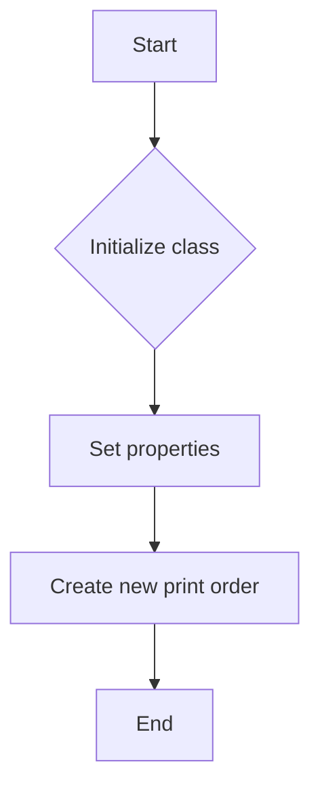

#### 带注释源码

```python
def __init__(self):
    super().__init__(
        id="f73007d6-f48f-4aaf-9e6b-6883998a09b4",
        description="Create a new print order",
        input_schema=self.Input,
        output_schema=self.Output,
        test_input={
            "credentials": TEST_CREDENTIALS_INPUT,
            "order_number": "TEST-001",
            "customer": {
                "name": "John Doe",
                "email": "john@example.com",
                "phone": "123-456-7890",
                "address": "123 Test St",
                "city": "Test City",
                "state": "TS",
                "zip": "12345",
            },
            "items": [
                {
                    "file_url": "https://example.com/model.stl",
                    "quantity": "1",
                    "color": "black",
                    "profile": "PLA",
                }
            ],
        },
        test_credentials=TEST_CREDENTIALS,
        test_output=[("order_id", "314144241")],
        test_mock={
            "_make_request": lambda *args, **kwargs: {"orderId": "314144241"},
            "_convert_to_color": lambda *args, **kwargs: "black",
        },
    )
```


### `Slant3DBlockBase.run`

This method is a coroutine that runs the block's operation, which can be creating a new order, estimating order costs, getting shipping cost estimates, retrieving all orders, tracking order status and shipping, or canceling orders.

参数：

- `input_data`：`Input`，The input data for the block operation.
- `credentials`：`APIKeyCredentials`，The API key credentials for the Slant3D service.
- `**kwargs`：Additional keyword arguments that may be required by specific block implementations.

返回值：`BlockOutput`，The output data from the block operation.

#### 流程图

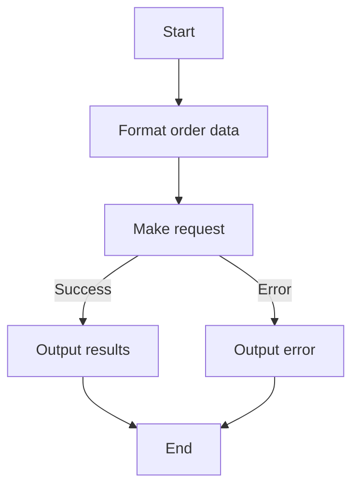

#### 带注释源码

```python
async def run(self, input_data: Input, *, credentials: APIKeyCredentials, **kwargs) -> BlockOutput:
    try:
        order_data = await self._format_order_data(
            input_data.customer,
            input_data.order_number,
            input_data.items,
            credentials.api_key.get_secret_value(),
        )
        result = await self._make_request(
            "POST", "order", credentials.api_key.get_secret_value(), json=order_data
        )
        yield "order_id", result["orderId"]
    except Exception as e:
        yield "error", str(e)
        raise
```


### `Slant3DCreateOrderBlock.run`

This method is responsible for creating a new print order by sending a POST request to the Slant3D API with the necessary order data.

参数：

- `input_data`：`Input`，The input data for the order creation, including customer details, order number, and items to print.
- `credentials`：`APIKeyCredentials`，The API key credentials for authentication with the Slant3D API.
- `**kwargs`：Additional keyword arguments that may be used for future extensions.

返回值：`BlockOutput`，The output data for the order creation, including the order ID.

#### 流程图


#### 带注释源码

```python
async def run(self, input_data: Input, *, credentials: APIKeyCredentials, **kwargs) -> BlockOutput:
    try:
        order_data = await self._format_order_data(
            input_data.customer,
            input_data.order_number,
            input_data.items,
            credentials.api_key.get_secret_value(),
        )
        result = await self._make_request(
            "POST", "order", credentials.api_key.get_secret_value(), json=order_data
        )
        yield "order_id", result["orderId"]
    except Exception as e:
        yield "error", str(e)
        raise
```


### Slant3DEstimateOrderBlock.run

This method runs the Slant3DEstimateOrderBlock, which is responsible for getting order cost estimates.

参数：

- `input_data`：`Input`，The input data for the block, including customer details, order number, and items to print.
- `credentials`：`APIKeyCredentials`，The API key credentials for the Slant3D service.

返回值：`BlockOutput`，The output of the block, including total price, shipping cost, and printing cost.

#### 流程图

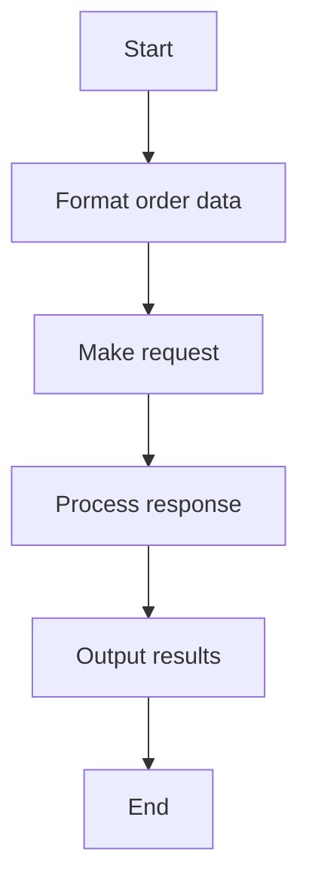

#### 带注释源码

```python
async def run(self, input_data: Input, *, credentials: APIKeyCredentials, **kwargs) -> BlockOutput:
    try:
        order_data = await self._format_order_data(
            input_data.customer,
            input_data.order_number,
            input_data.items,
            credentials.api_key.get_secret_value(),
        )
        result = await self._make_request(
            "POST",
            "order/estimate",
            credentials.api_key.get_secret_value(),
            json=order_data,
        )
        yield "total_price", result["totalPrice"]
        yield "shipping_cost", result["shippingCost"]
        yield "printing_cost", result["printingCost"]
    except Exception as e:
        yield "error", str(e)
        raise
```


### Slant3DEstimateShippingBlock.run

This method estimates the shipping cost for an order.

参数：

- `input_data`：`Input`，The input data for the block.
- `credentials`：`APIKeyCredentials`，The API key credentials for the Slant3D service.

返回值：`BlockOutput`，The output data containing the estimated shipping cost and currency code.

#### 流程图

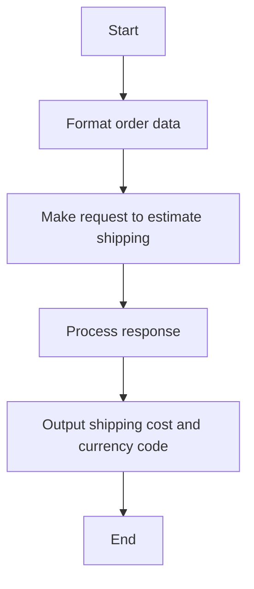

#### 带注释源码

```python
async def run(self, input_data: Input, *, credentials: APIKeyCredentials, **kwargs) -> BlockOutput:
    try:
        order_data = await self._format_order_data(
            input_data.customer,
            input_data.order_number,
            input_data.items,
            credentials.api_key.get_secret_value(),
        )
        result = await self._make_request(
            "POST",
            "order/estimateShipping",
            credentials.api_key.get_secret_value(),
            json=order_data,
        )
        yield "shipping_cost", result["shippingCost"]
        yield "currency_code", result["currencyCode"]
    except Exception as e:
        yield "error", str(e)
        raise
```


### Slant3DGetOrdersBlock.run

Retrieves all orders for the account.

参数：

- `input_data`：`Input`，The input data for the block.
- `credentials`：`APIKeyCredentials`，API key credentials for authentication.

返回值：`BlockOutput`，The output of the block containing the list of orders.

#### 流程图

```mermaid
graph TD
    A[Start] --> B[Run Slant3DGetOrdersBlock.run]
    B --> C[Make GET request to "order" endpoint]
    C --> D[Process response]
    D --> E[Generate output]
    E --> F[End]
```

#### 带注释源码

```python
async def run(self, input_data: Input, *, credentials: APIKeyCredentials, **kwargs) -> BlockOutput:
    try:
        result = await self._make_request(
            "GET", "order", credentials.api_key.get_secret_value()
        )
        yield "orders", [str(order["orderId"]) for order in result["ordersData"]]
    except Exception as e:
        yield "error", str(e)
        raise
```


### Slant3DTrackingBlock.run

This method tracks the status and shipping details of an order using the Slant3D API.

参数：

- `input_data`：`Input`，The input data for the block, which includes the Slant3D order ID to track.
- `credentials`：`APIKeyCredentials`，The API key credentials for the Slant3D API.

返回值：`BlockOutput`，The output of the block, which includes the order status and tracking numbers.

#### 流程图

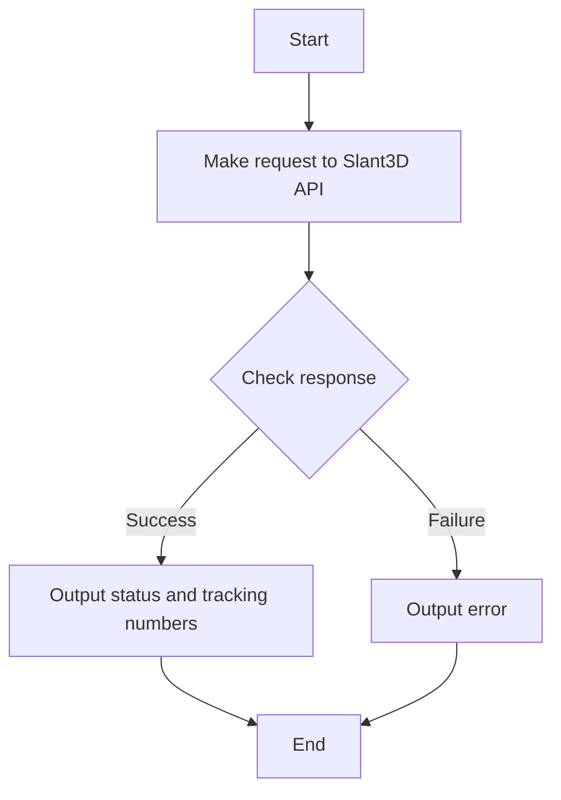

#### 带注释源码

```python
async def run(self, input_data: Input, *, credentials: APIKeyCredentials, **kwargs) -> BlockOutput:
    try:
        result = await self._make_request(
            "GET",
            f"order/{input_data.order_id}/get-tracking",
            credentials.api_key.get_secret_value(),
        )
        yield "status", result["status"]
        yield "tracking_numbers", result["trackingNumbers"]
    except Exception as e:
        yield "error", str(e)
        raise
```


### Slant3DCancelOrderBlock.run

This method is responsible for canceling an existing order by sending a DELETE request to the Slant3D API.

参数：

- `input_data`：`Input`，The input data for the block, which includes the credentials and order ID to cancel.
- `credentials`：`APIKeyCredentials`，The API key credentials required to authenticate with the Slant3D API.
- `**kwargs`：Additional keyword arguments that may be used by subclasses.

返回值：`BlockOutput`，The output of the block, which includes the cancellation status message.

#### 流程图

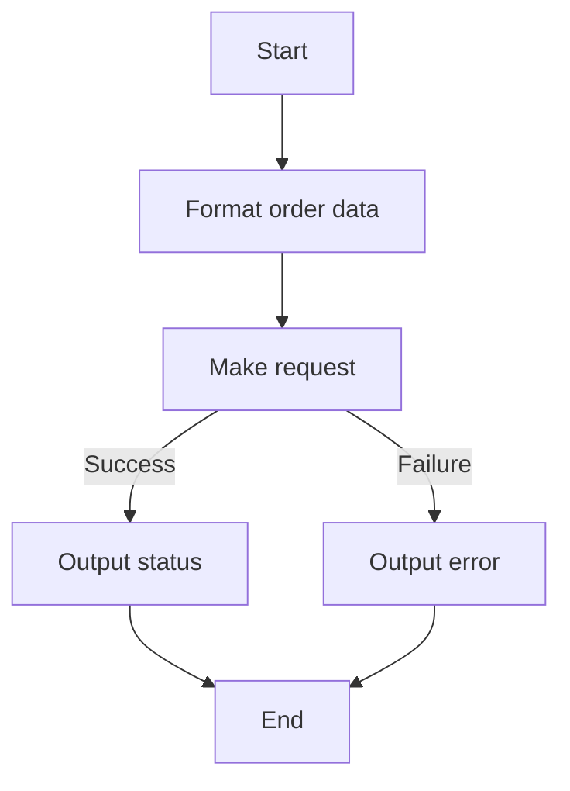

#### 带注释源码

```python
async def run(self, input_data: Input, *, credentials: APIKeyCredentials, **kwargs) -> BlockOutput:
    try:
        result = await self._make_request(
            "DELETE",
            f"order/{input_data.order_id}",
            credentials.api_key.get_secret_value(),
        )
        yield "status", result["status"]
    except Exception as e:
        yield "error", str(e)
        raise
```


## 关键组件


### 张量索引与惰性加载

张量索引与惰性加载是代码中处理数据结构的关键组件，用于高效地访问和操作大型数据集，同时减少内存消耗。

### 反量化支持

反量化支持是代码中用于处理数值类型转换的关键组件，确保数值类型在处理过程中的准确性和一致性。

### 量化策略

量化策略是代码中用于优化计算性能的关键组件，通过调整数据类型和计算方法来减少计算资源消耗。


## 问题及建议


### 已知问题

-   **代码重复性**：多个类（如 `Slant3DCreateOrderBlock`, `Slant3DEstimateOrderBlock`, `Slant3DEstimateShippingBlock`）具有相似的初始化和运行逻辑，这可能导致维护成本增加和代码重复。
-   **异常处理**：异常处理较为简单，仅捕获异常并返回错误信息。可以考虑更详细的异常处理逻辑，以提供更具体的错误信息。
-   **测试数据**：测试数据硬编码在代码中，这可能导致代码难以维护和更新。建议使用配置文件或环境变量来管理测试数据。
-   **全局变量**：`settings` 对象作为全局变量使用，这可能导致代码难以测试和重用。建议将 `settings` 对象作为参数传递给需要它的函数或类。

### 优化建议

-   **提取公共逻辑**：将重复的初始化和运行逻辑提取到单独的函数或类中，以减少代码重复并提高可维护性。
-   **改进异常处理**：实现更详细的异常处理逻辑，例如，根据不同的异常类型返回不同的错误信息。
-   **使用配置文件**：使用配置文件或环境变量来管理测试数据，以便于维护和更新。
-   **重构全局变量**：将 `settings` 对象作为参数传递给需要它的函数或类，以提高代码的可测试性和重用性。
-   **代码注释**：增加代码注释，以解释代码的功能和逻辑，提高代码的可读性。
-   **单元测试**：编写单元测试来验证代码的功能，确保代码的正确性和稳定性。
-   **文档化**：编写详细的文档，包括代码的功能、使用方法和维护指南，以便于其他开发者理解和维护代码。


## 其它


### 设计目标与约束

- 设计目标：
  - 提供一个模块化的订单处理系统，支持创建、估计、取消和跟踪订单。
  - 确保所有操作都通过安全的API密钥进行认证。
  - 提供清晰的错误处理和异常设计，以便于调试和用户反馈。
  - 确保数据流清晰，易于理解和维护。
- 约束：
  - 所有操作必须通过Slant3D API进行。
  - 系统必须能够处理并发请求。
  - 系统必须遵守Slant3D API的使用条款。

### 错误处理与异常设计

- 错误处理：
  - 所有API请求失败时，将捕获异常并返回错误信息。
  - 错误信息将包括错误代码和描述。
- 异常设计：
  - 使用自定义异常类来处理特定类型的错误。
  - 异常类将提供详细的错误信息和堆栈跟踪。

### 数据流与状态机

- 数据流：
  - 用户输入通过输入字段传递到相应的处理函数。
  - 处理函数将数据格式化并发送到Slant3D API。
  - API响应将被解析并返回给用户。
- 状态机：
  - 每个订单处理块都包含一个内部状态机，用于跟踪订单的状态（例如，创建、估计、取消、跟踪）。

### 外部依赖与接口契约

- 外部依赖：
  - Slant3D API
  - UUID库
  - 类型注解库
- 接口契约：
  - 所有API请求都遵循RESTful架构。
  - 所有API响应都包含状态码和JSON数据。
  - 所有数据类型都使用类型注解进行定义。


    