# `AutoGPT\autogpt_platform\backend\backend\blocks\smart_decision_maker.py` 详细设计文档

该代码实现了一个基于大型语言模型（LLM）的智能决策块，它能够根据用户输入和上下文动态决定调用何种工具。该模块支持OpenAI和Anthropic等多种LLM格式的工具调用，具备单次调用和循环代理两种执行模式，并能处理对话历史管理、工具参数验证、并发执行以及与图执行管理器的集成。

## 整体流程

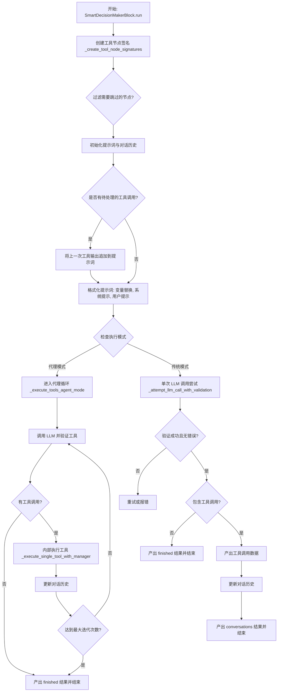

## 类结构

```
Pydantic BaseModel
├── ToolInfo
└── ExecutionParams

Block
└── SmartDecisionMakerBlock
    ├── Input (继承自 BlockSchemaInput)
    └── Output (继承自 BlockSchemaOutput)
```

## 全局变量及字段


### `logger`
    
用于记录模块日志的Logger实例。

类型：`logging.Logger`
    


### `ToolInfo.tool_call`
    
来自LLM响应的原始工具调用对象。

类型：`Any`
    


### `ToolInfo.tool_name`
    
函数调用的名称。

类型：`str`
    


### `ToolInfo.tool_def`
    
来自tool_functions的工具定义。

类型：`dict[str, Any]`
    


### `ToolInfo.input_data`
    
准备好用于工具执行的已处理输入数据。

类型：`dict[str, Any]`
    


### `ToolInfo.field_mapping`
    
工具的字段名称映射。

类型：`dict[str, str]`
    


### `ExecutionParams.user_id`
    
执行该操作的用户ID。

类型：`str`
    


### `ExecutionParams.graph_id`
    
当前图ID。

类型：`str`
    


### `ExecutionParams.node_id`
    
当前节点ID。

类型：`str`
    


### `ExecutionParams.graph_version`
    
图的版本。

类型：`int`
    


### `ExecutionParams.graph_exec_id`
    
图执行ID。

类型：`str`
    


### `ExecutionParams.node_exec_id`
    
节点执行ID。

类型：`str`
    


### `ExecutionParams.execution_context`
    
执行上下文对象。

类型：`ExecutionContext`
    


### `SmartDecisionMakerBlock.Input.prompt`
    
发送给语言模型的提示词。

类型：`str`
    


### `SmartDecisionMakerBlock.Input.model`
    
用于回答提示词的语言模型。

类型：`llm.LlmModel`
    


### `SmartDecisionMakerBlock.Input.credentials`
    
用于LLM调用的AI凭证。

类型：`llm.AICredentials`
    


### `SmartDecisionMakerBlock.Input.multiple_tool_calls`
    
是否允许在单个响应中进行多次工具调用。

类型：`bool`
    


### `SmartDecisionMakerBlock.Input.sys_prompt`
    
为模型提供额外上下文的系统提示词。

类型：`str`
    


### `SmartDecisionMakerBlock.Input.conversation_history`
    
为提示词提供上下文的对话历史。

类型：`list[dict] | None`
    


### `SmartDecisionMakerBlock.Input.last_tool_output`
    
最后调用的工具的输出。

类型：`Any`
    


### `SmartDecisionMakerBlock.Input.retry`
    
如果响应不符合预期格式，重试LLM调用的次数。

类型：`int`
    


### `SmartDecisionMakerBlock.Input.prompt_values`
    
用于填充提示词的值，支持{{variable_name}}语法。

类型：`dict[str, str]`
    


### `SmartDecisionMakerBlock.Input.max_tokens`
    
在聊天补全中生成的最大token数。

类型：`int | None`
    


### `SmartDecisionMakerBlock.Input.ollama_host`
    
本地Ollama模型的主机地址。

类型：`str`
    


### `SmartDecisionMakerBlock.Input.agent_mode_max_iterations`
    
Agent模式的最大迭代次数（0=传统模式，-1=无限）。

类型：`int`
    


### `SmartDecisionMakerBlock.Input.conversation_compaction`
    
达到限制时是否自动压缩上下文窗口。

类型：`bool`
    


### `SmartDecisionMakerBlock.Output.tools`
    
可用工具的列表或定义。

类型：`Any`
    


### `SmartDecisionMakerBlock.Output.finished`
    
显示给用户的完成消息。

类型：`str`
    


### `SmartDecisionMakerBlock.Output.conversations`
    
为上下文提供信息的对话历史。

类型：`list[Any]`
    
    

## 全局函数及方法


### `_get_tool_requests`

从给定的对话历史条目中识别并提取工具请求的 ID。该函数兼容 OpenAI 和 Anthropic 两种不同的消息格式，如果条目不是 assistant 角色或不包含工具调用，则返回空列表。

参数：

-  `entry`：`dict[str, Any]`，代表单条对话消息的字典，通常包含 role、content 或 tool_calls 等字段。

返回值：`list[str]`，从该条目中提取出的工具调用 ID 列表。

#### 流程图

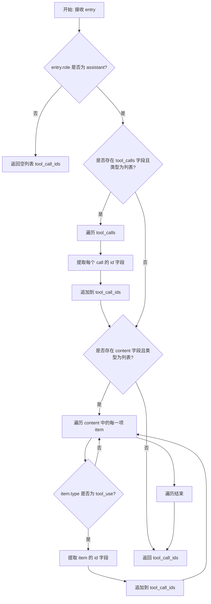

#### 带注释源码

```python
def _get_tool_requests(entry: dict[str, Any]) -> list[str]:
    """
    Return a list of tool_call_ids if the entry is a tool request.
    Supports both OpenAI and Anthropics formats.
    """
    tool_call_ids = []
    # 只有 assistant 角色的消息才可能包含工具请求
    if entry.get("role") != "assistant":
        return tool_call_ids

    # OpenAI 格式: 检查 entry 中是否有 tool_calls 字段
    calls = entry.get("tool_calls")
    if isinstance(calls, list):
        for call in calls:
            # 提取每个工具调用的 id
            if tool_id := call.get("id"):
                tool_call_ids.append(tool_id)

    # Anthropic 格式: 检查 content 列表中是否有 tool_use 类型的项
    content = entry.get("content")
    if isinstance(content, list):
        for item in content:
            if item.get("type") != "tool_use":
                continue
            # 如果是 tool_use 类型，提取其 id
            if tool_id := item.get("id"):
                tool_call_ids.append(tool_id)

    return tool_call_ids
```


### `_get_tool_responses`

如果条目是工具响应，则返回 tool_call_ids 列表。支持 OpenAI 和 Anthropics 两种格式。

参数：

-  `entry`：`dict[str, Any]`，表示对话历史中的一个条目，包含角色和内容等信息。

返回值：`list[str]`，提取到的工具调用 ID 列表。

#### 流程图

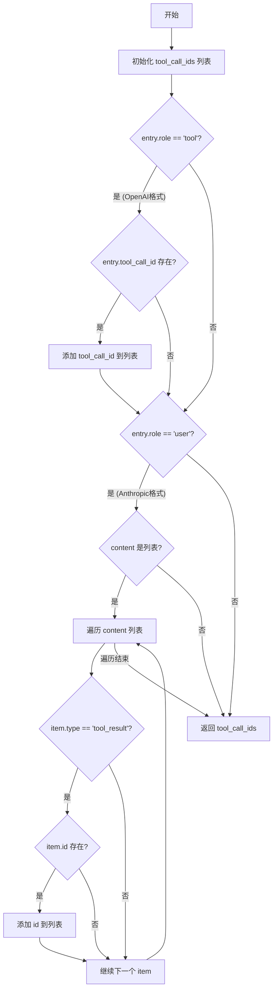

#### 带注释源码

```python
def _get_tool_responses(entry: dict[str, Any]) -> list[str]:
    """
    Return a list of tool_call_ids if the entry is a tool response.
    Supports both OpenAI and Anthropics formats.
    """
    tool_call_ids: list[str] = []

    # OpenAI: a tool response message with role "tool" and key "tool_call_id".
    # 检查是否为 OpenAI 格式的工具响应消息
    if entry.get("role") == "tool":
        if tool_call_id := entry.get("tool_call_id"):
            tool_call_ids.append(str(tool_call_id))

    # Anthropics: check content items for tool_result type.
    # 检查是否为 Anthropic 格式的用户消息（Anthropic 使用 user 角色承载工具结果）
    if entry.get("role") == "user":
        content = entry.get("content")
        if isinstance(content, list):
            for item in content:
                if item.get("type") != "tool_result":
                    continue
                if tool_id := item.get("id"):
                    tool_call_ids.append(tool_id)

    return tool_call_ids
```


### `_create_tool_response`

根据工具调用ID的前缀格式，为OpenAI或Anthropic生成标准化的工具响应消息。

参数：

-   `call_id`：`str`，工具调用的唯一标识符，用于判断目标模型提供商格式（OpenAI或Anthropic）。
-   `output`：`Any`，工具执行后的输出数据，可以是字符串或可序列化为JSON的对象。

返回值：`dict[str, Any]`，符合特定LLM提供商（OpenAI或Anthropic）API要求的工具响应消息字典。

#### 流程图

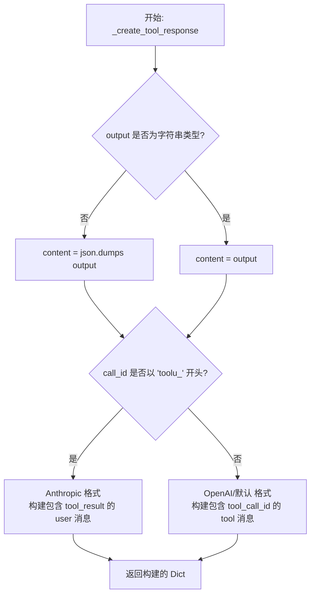

#### 带注释源码

```python
def _create_tool_response(call_id: str, output: Any) -> dict[str, Any]:
    """
    Create a tool response message for either OpenAI or Anthropics,
    based on the tool_id format.
    """
    # 处理输出内容：如果是字符串则直接使用，否则序列化为JSON字符串
    content = output if isinstance(output, str) else json.dumps(output)

    # 判断模型提供商格式：Anthropic 的 tool ID 通常以 "toolu_" 开头
    if call_id.startswith("toolu_"):
        return {
            "role": "user",
            "type": "message",
            "content": [
                {"tool_use_id": call_id, "type": "tool_result", "content": content}
            ],
        }

    # OpenAI 格式或其他默认格式：tool ID 通常以 "call_" 开头或无特定前缀
    # 返回标准的 tool role 消息
    return {"role": "tool", "tool_call_id": call_id, "content": content}
```


### `_combine_tool_responses`

将多个 Anthropic 工具响应合并为单个用户消息。对于非 Anthropic 格式，返回原始列表不变。

参数：

-   `tool_outputs`：`list[dict[str, Any]]`，待合并的工具响应列表。

返回值：`list[dict[str, Any]]`，如果输入包含多个 Anthropic 格式的响应，则返回合并后的列表；否则返回原始列表。

#### 流程图

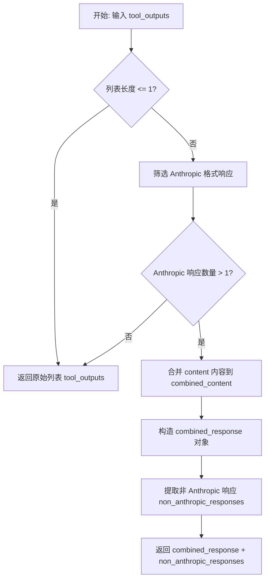

#### 带注释源码

```python
def _combine_tool_responses(tool_outputs: list[dict[str, Any]]) -> list[dict[str, Any]]:
    """
    Combine multiple Anthropic tool responses into a single user message.
    For non-Anthropic formats, returns the original list unchanged.
    """
    # 如果输出列表少于或等于1个，无需合并，直接返回
    if len(tool_outputs) <= 1:
        return tool_outputs

    # Anthropic responses have role="user", type="message", and content is a list with tool_result items
    # 筛选出符合 Anthropic 格式的工具响应
    anthropic_responses = [
        output
        for output in tool_outputs
        if (
            output.get("role") == "user"
            and output.get("type") == "message"
            and isinstance(output.get("content"), list)
            and any(
                item.get("type") == "tool_result"
                for item in output.get("content", [])
                if isinstance(item, dict)
            )
        )
    ]

    # 如果找到超过一个 Anthropic 响应，则进行合并
    if len(anthropic_responses) > 1:
        # 将所有 Anthropic 响应的内容列表扁平化合并
        combined_content = [
            item for response in anthropic_responses for item in response["content"]
        ]

        # 构造合并后的响应对象
        combined_response = {
            "role": "user",
            "type": "message",
            "content": combined_content,
        }

        # 提取非 Anthropic 格式的响应
        non_anthropic_responses = [
            output for output in tool_outputs if output not in anthropic_responses
        ]

        # 返回合并后的 Anthropic 响应和剩余的非 Anthropic 响应
        return [combined_response] + non_anthropic_responses

    # 如果没有多个 Anthropic 响应，返回原始列表
    return tool_outputs
```


### `_convert_raw_response_to_dict`

该函数负责将来自不同大语言模型（LLM）提供商的原始响应对象统一转换为标准化的字典格式，以便在对话历史记录中进行处理。它能够处理字符串（如 Ollama）、字典（如测试数据或特定提供商）以及复杂对象（如 OpenAI 或 Anthropic 返回的对象），确保后续逻辑能以统一方式访问响应内容。

参数：

-  `raw_response`：`Any`，来自 LLM 提供商的原始响应，可能是字符串、字典或其他对象类型。

返回值：`dict[str, Any]`，转换后的标准化消息字典，包含 `role` 和 `content` 等字段。

#### 流程图

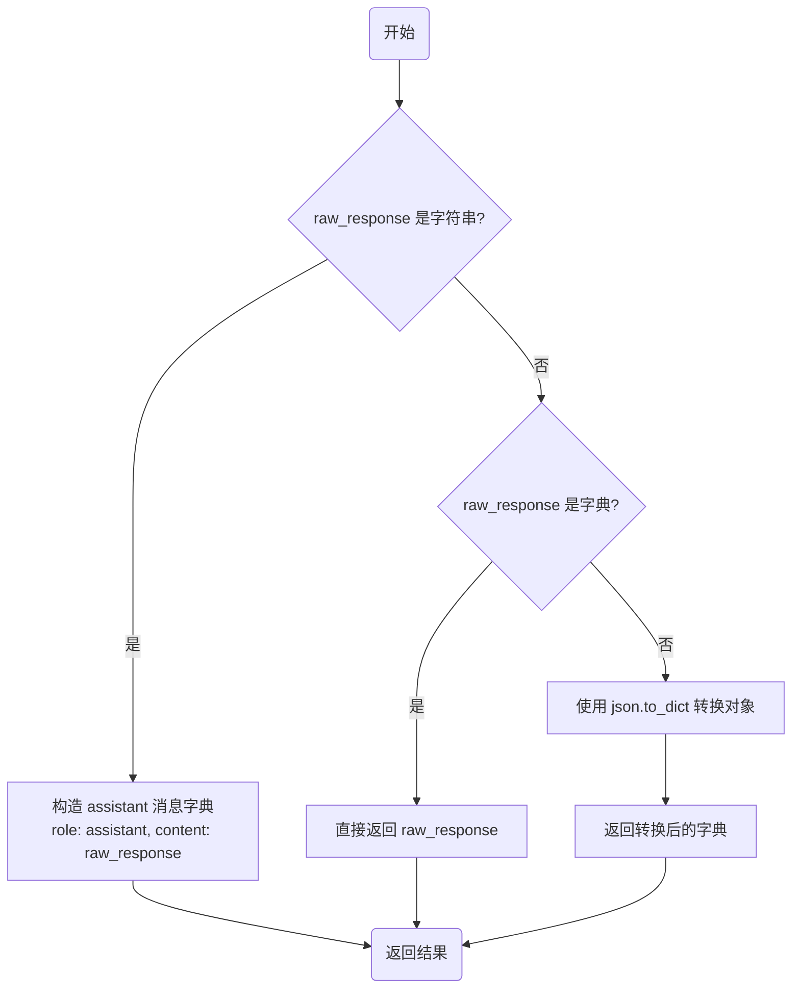

#### 带注释源码

```python
def _convert_raw_response_to_dict(raw_response: Any) -> dict[str, Any]:
    """
    安全地将 raw_response 转换为对话历史的字典格式。
    处理来自不同 LLM 提供商的不同响应类型。
    """
    if isinstance(raw_response, str):
        # Ollama 通常返回纯字符串，需要包装成标准的消息字典格式
        return {"role": "assistant", "content": raw_response}
    elif isinstance(raw_response, dict):
        # 已经是字典（例如来自测试用例或某些已经格式化的提供商），直接返回
        return raw_response
    else:
        # OpenAI/Anthropic 等提供商通常返回对象，通过 json.to_dict 方法进行序列化转换
        return json.to_dict(raw_response)
```


### `get_pending_tool_calls`

该函数用于分析对话历史记录，通过统计工具调用请求和工具响应的数量，计算出尚未收到对应输出的待处理工具调用（Pending Tool Calls）。它支持同时处理 OpenAI 和 Anthropics 格式的对话数据。

参数：

-   `conversation_history`：`list[Any] | None`，包含对话消息条目的列表，通常包括 assistant 发起的 tool_calls 和 user 返回的 tool 响应。

返回值：`dict[str, int]`，一个字典，键为待处理的工具调用 ID（call_id），值为该 ID 待处理的数量（通常为正整数，表示尚有未响应的调用）。

#### 流程图

```mermaid
flowchart TD
    A([开始]) --> B{检查 conversation_history<br/>是否为空?}
    B -- 是 --> C([返回空字典 {}])
    B -- 否 --> D[初始化 pending_calls Counter]
    D --> E[遍历 conversation_history]
    E --> F[调用 _get_tool_requests 获取请求ID]
    F --> G[遍历请求ID列表]
    G --> H[pending_calls[call_id] 自增]
    H --> I[调用 _get_tool_responses 获取响应ID]
    I --> J[遍历响应ID列表]
    J --> K[pending_calls[call_id] 自减]
    K --> L{是否还有下一条历史记录?}
    L -- 是 --> E
    L -- 否 --> M[筛选 pending_calls 中值 > 0 的项]
    M --> N([返回待处理调用字典])
```

#### 带注释源码

```python
def get_pending_tool_calls(conversation_history: list[Any] | None) -> dict[str, int]:
    """
    All the tool calls entry in the conversation history requires a response.
    This function returns the pending tool calls that has not generated an output yet.

    Return: dict[str, int] - A dictionary of pending tool call IDs with their count.
    """
    # 如果对话历史为空，直接返回空字典
    if not conversation_history:
        return {}

    # 使用 Counter 来统计每个工具调用 ID 的净计数
    pending_calls = Counter()
    
    # 遍历历史记录中的每一条消息
    for history in conversation_history:
        # 获取当前消息中所有的工具请求 ID (Assistant 发起的调用)
        for call_id in _get_tool_requests(history):
            pending_calls[call_id] += 1  # 发现请求，计数加 1

        # 获取当前消息中所有的工具响应 ID (User 返回的结果)
        for call_id in _get_tool_responses(history):
            pending_calls[call_id] -= 1  # 发现响应，计数减 1

    # 返回计数大于 0 的工具调用 ID，表示这些调用尚未收到响应
    return {call_id: count for call_id, count in pending_calls.items() if count > 0}
```


### `SmartDecisionMakerBlock.Input.get_missing_links`

该方法用于验证智能决策块输入连接的完整性。它首先过滤掉特定的输入字段（conversation_history 和 last_tool_output），然后调用父类方法检查其他必填字段的依赖关系。接着，它执行特定的业务逻辑验证：确保 `last_tool_output` 未连接到静态链接（如 `StoreValue`），并确保 `conversation_history` 和 `last_tool_output` 这两个字段要么同时连接，要么都不连接，以维护对话状态的逻辑一致性。最后返回缺失的链接集合。

参数：

- `data`：`BlockInput`，包含当前输入数据的字典，用于检查数据层面的完整性。
- `links`：`list["Link"]`，当前节点所有输入链接的列表，用于检查连接层面的完整性。

返回值：`set[str]`，表示缺失输入字段的名称集合。

#### 流程图

```mermaid
graph TD
    A[开始: get_missing_links] --> B[过滤 links 列表: 移除 'conversation_history' 和 'last_tool_output']
    B --> C[调用 super().get_missing_links 获取基础缺失链接]
    C --> D{是否存在 conversation_history 链接 且 存在 last_tool_output 链接?}
    D -- 是 --> E{last_tool_output 是否为静态链接 is_static?}
    E -- 是 --> F[抛出 ValueError: 禁止连接静态链接]
    E -- 否 --> G{是否仅连接了其中一个字段?]
    G -- 是 (异或结果为真) --> H[抛出 ValueError: 必须同时连接这两个字段]
    G -- 否 (连接状态一致) --> I[返回基础缺失链接集合 missing_links]
    D -- 否 (均未连接) --> I
    F --> J[结束]
    H --> J
    I --> J
```

#### 带注释源码

```python
@classmethod
def get_missing_links(cls, data: BlockInput, links: list["Link"]) -> set[str]:
    # conversation_history & last_tool_output 的验证逻辑处理方式不同，首先将它们从常规检查中排除
    missing_links = super().get_missing_links(
        data,
        [
            link
            for link in links
            if link.sink_name
            not in ["conversation_history", "last_tool_output"]
        ],
    )

    # 验证：避免在 conversation_history 连接时，last_tool_output 连接到静态链接
    # 静态链接如 StoreValueBlock 或 AgentInputBlock，意味着数据是一次性的而非流式的
    if any(link.sink_name == "conversation_history" for link in links) and any(
        link.sink_name == "last_tool_output" and link.is_static
        for link in links
    ):
        raise ValueError(
            "Last Tool Output can't be connected to a static (dashed line) "
            "link like the output of `StoreValue` or `AgentInput` block"
        )

    # 验证：检查 conversation_history 和 last_tool_output 是否成对出现
    # 这两个字段必须同时连接或同时断开，否则无法维护对话上下文的正确流转
    if any(link.sink_name == "conversation_history" for link in links) != any(
        link.sink_name == "last_tool_output" for link in links
    ):
        raise ValueError(
            "Last Tool Output is needed when Conversation History is used, "
            "and vice versa. Please connect both inputs together."
        )

    # 返回父类计算出的其他缺失链接
    return missing_links
```


### `SmartDecisionMakerBlock.Input.get_missing_input`

该方法用于确定在特定的执行上下文中，SmartDecisionMakerBlock 块当前缺失哪些必需的输入字段。它不仅检查标准的必需字段，还实现了针对对话历史和工具输出之间动态交互的特定逻辑，以协调代理模式下的多步骤执行流程。

参数：

- `data`：`BlockInput`，包含当前块输入数据的字典，其中可能包括对话历史、工具输出以及其他字段。

返回值：`set[str]`，包含当前缺失的字段名称的集合。如果没有任何输入缺失，则返回空集合。

#### 流程图

```mermaid
flowchart TD
    Start([开始]) --> CheckSuper[调用父类方法 get_missing_input]
    CheckSuper --> SuperMissing{父类检查是否有缺失?}
    SuperMissing -- 是 --> ReturnSuper[返回父类发现的缺失字段]
    SuperMissing -- 否 --> ExtractData[提取 conversation_history 与 last_tool_output]
    ExtractData --> GetPending[调用 get_pending_tool_calls 获取待处理工具调用]
    GetPending --> CheckToolPending{是否有待处理工具调用 且 暂无工具输出?}
    CheckToolPending -- 是 --> NeedOutput[返回 {'last_tool_output'}]
    CheckToolPending -- 否 --> CheckHistoryUpdate{是否有工具输出 且 无待处理工具调用?}
    CheckHistoryUpdate -- 是 --> NeedHistory[返回 {'conversation_history'}]
    CheckHistoryUpdate -- 否 --> ReturnEmpty[返回空集合 set]
```

#### 带注释源码

```python
@classmethod
def get_missing_input(cls, data: BlockInput) -> set[str]:
    # 1. 首先调用父类方法检查是否有标准的缺失输入
    if missing_input := super().get_missing_input(data):
        return missing_input

    # 2. 从输入数据中获取对话历史和上一个工具的输出
    conversation_history = data.get("conversation_history", [])
    pending_tool_calls = get_pending_tool_calls(conversation_history)
    last_tool_output = data.get("last_tool_output")

    # 3. 状态检查：如果存在待处理的工具调用，但尚未提供工具输出
    # 则当前缺失的是 'last_tool_output'，等待外部执行工具后提供结果
    if last_tool_output is None and pending_tool_calls:
        return {"last_tool_output"}

    # 4. 状态检查：如果已提供了工具输出，且没有待处理的工具调用
    # 这通常意味着工具已执行完毕，等待更新对话历史以继续下一步
    # 则当前缺失的是 'conversation_history'
    if last_tool_output is not None and not pending_tool_calls:
        return {"conversation_history"}

    # 5. 如果上述条件均不满足，说明所有必需输入均已就绪，返回空集合
    return set()
```


### `SmartDecisionMakerBlock.__init__`

初始化智能决策制定器块，配置其元数据、输入输出模式以及测试数据。该方法负责设置该块在系统中的唯一标识、描述、类别、类型以及与 LLM 交互所需的接口定义。

参数：

-  `self`：`SmartDecisionMakerBlock`，类的实例对象。

返回值：`None`，无返回值。

#### 流程图

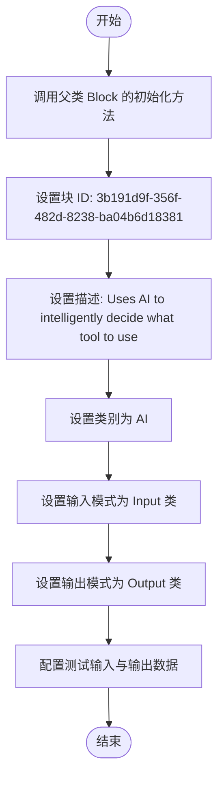

#### 带注释源码

```python
def __init__(self):
    # 调用父类 Block 的初始化方法，配置该智能块的基本属性和行为
    super().__init__(
        # 定义该块在系统中的全局唯一标识符
        id="3b191d9f-356f-482d-8238-ba04b6d18381",
        # 描述该块的核心功能：使用 AI 智能决定使用哪个工具
        description="Uses AI to intelligently decide what tool to use.",
        # 指定该块所属的分类为 AI 类
        categories={BlockCategory.AI},
        # 指定该块的类型为 AI 类型
        block_type=BlockType.AI,
        # 定义该块的输入数据结构模式，使用内部类 Input
        input_schema=SmartDecisionMakerBlock.Input,
        # 定义该块的输出数据结构模式，使用内部类 Output
        output_schema=SmartDecisionMakerBlock.Output,
        # 定义用于测试的输入样例数据
        test_input={
            "prompt": "Hello, World!",
            "credentials": llm.TEST_CREDENTIALS_INPUT,
        },
        # 定义用于测试的预期输出样例（此处为空列表）
        test_output=[],
        # 定义用于测试的凭证信息
        test_credentials=llm.TEST_CREDENTIALS,
    )
```


### `SmartDecisionMakerBlock.cleanup`

清理块名称字符串，将其转换为符合工具函数命名规范的格式（仅包含字母、数字、下划线和连字符，且全小写）。

参数：

-  `s`：`str`，需要清理的原始字符串（通常是块的名称）。

返回值：`str`，清理后的、适合用作工具函数名的字符串。

#### 流程图

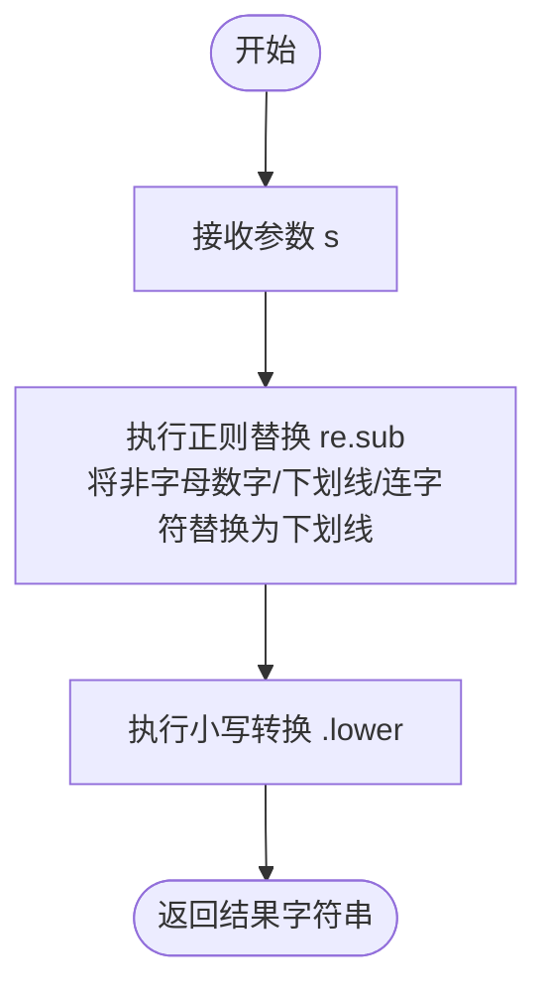

#### 带注释源码

```python
    @staticmethod
    def cleanup(s: str):
        """Clean up block names for use as tool function names."""
        # 使用正则表达式将所有非字母数字、非下划线、非连字符的字符替换为下划线
        # 这确保了函数名中不包含可能破坏代码语法的特殊字符
        sanitized = re.sub(r"[^a-zA-Z0-9_-]", "_", s)
        # 将处理后的字符串转换为小写，以保证函数名的一致性和规范性
        return sanitized.lower()
```


### `SmartDecisionMakerBlock._create_block_function_signature`

为给定的块节点创建符合 LLM 工具调用格式的函数签名字典。该过程包括解析节点元数据获取名称，遍历连接的链接生成参数属性 Schema，并根据块定义确定必填字段，同时处理字段名称的清理以兼容 API。

参数：

-   `sink_node`：`Node`，目标节点的对象，用于获取块定义和元数据。
-   `links`：`list[Link]`，连接到目标节点的链接列表，代表该节点的输入数据流。

返回值：`dict[str, Any]`，表示 LLM 工具函数签名的字典，包含类型、名称、描述、参数及内部映射信息。

#### 流程图

```mermaid
flowchart TD
    A[开始: _create_block_function_signature] --> B[获取 sink_node.block 实例]
    B --> C{检查元数据 customized_name}
    C -- 存在 --> D[使用自定义名称]
    C -- 不存在 --> E[使用 block.name]
    D --> F[调用 cleanup 清理工具名称]
    E --> F
    F --> G[初始化 tool_function 基础结构]
    G --> H[初始化 properties 和 field_mapping]
    H --> I[遍历 links]
    I --> J{判断是否为动态字段}
    J -- 是 --> K[使用 get_dynamic_field_description]
    J -- 否 --> L[获取 block.input_schema 字段定义]
    L --> M[获取失败则使用通用 string 定义]
    K --> N[清理字段名称]
    M --> N
    N --> O[将属性添加到 properties]
    O --> P{links 是否遍历完?}
    P -- 否 --> I
    P -- 是 --> Q[获取 block input_schema 的 jsonschema]
    Q --> R[获取基础必填字段列表 base_required]
    R --> S[再次遍历 links 计算必填字段]
    S --> T{字段是否必填?}
    T -- 是 --> U[将清理后的字段名加入 required_fields]
    T -- 否 --> V[跳过]
    U --> W{links 是否遍历完?}
    V --> W
    W -- 否 --> S
    W -- 是 --> X[构建 parameters 对象<br/>包含 properties, required, additionalProperties]
    X --> Y[添加内部元数据<br/>_field_mapping 和 _sink_node_id]
    Y --> Z[返回 {'type': 'function', 'function': tool_function}]
    Z --> AA[结束]
```

#### 带注释源码

```python
    @staticmethod
    async def _create_block_function_signature(
        sink_node: "Node", links: list["Link"]
    ) -> dict[str, Any]:
        """
        Creates a function signature for a block node.

        Args:
            sink_node: The node for which to create a function signature.
            links: The list of links connected to the sink node.

        Returns:
            A dictionary representing the function signature in the format expected by LLM tools.

        Raises:
            ValueError: If the block specified by sink_node.block_id is not found.
        """
        # 获取节点对应的 Block 实例
        block = sink_node.block

        # 确定工具名称：优先使用节点元数据中的自定义名称，否则使用 Block 的默认名称
        custom_name = sink_node.metadata.get("customized_name")
        tool_name = custom_name if custom_name else block.name

        # 初始化工具函数的基础结构
        tool_function: dict[str, Any] = {
            "name": SmartDecisionMakerBlock.cleanup(tool_name),
            "description": block.description,
        }
        sink_block_input_schema = block.input_schema
        properties = {}
        field_mapping = {}  # 用于存储清理后的名称到原始名称的映射

        # 遍历所有链接以构建参数属性
        for link in links:
            field_name = link.sink_name
            is_dynamic = is_dynamic_field(field_name)
            # 清理属性键名以确保与 Anthropic API 兼容（去除特殊字符等）
            clean_field_name = SmartDecisionMakerBlock.cleanup(field_name)
            field_mapping[clean_field_name] = field_name

            if is_dynamic:
                # 动态字段：使用清理后的名称，并在描述中保留原始信息
                properties[clean_field_name] = {
                    "type": "string",
                    "description": get_dynamic_field_description(field_name),
                }
            else:
                # 常规字段：直接从 Block 的 Schema 中获取定义
                try:
                    properties[clean_field_name] = (
                        sink_block_input_schema.get_field_schema(field_name)
                    )
                except (KeyError, AttributeError):
                    # 如果 Schema 中不存在该字段，则提供一个通用的字符串定义
                    properties[clean_field_name] = {
                        "type": "string",
                        "description": f"Value for {field_name}",
                    }

        # 使用统一的路径构建参数 Schema
        base_schema = block.input_schema.jsonschema()
        base_required = set(base_schema.get("required", []))

        # 计算必填字段（叶子级别）
        required_fields: set[str] = set()
        for link in links:
            field_name = link.sink_name
            is_dynamic = is_dynamic_field(field_name)
            # 始终使用清理后的字段名作为属性键（符合 Anthropic API 要求）
            clean_field_name = SmartDecisionMakerBlock.cleanup(field_name)

            if is_dynamic:
                # 动态字段：检查其基础名称是否在基础必填列表中
                base_name = extract_base_field_name(field_name)
                if base_name in base_required:
                    required_fields.add(clean_field_name)
            else:
                # 常规字段：直接检查是否在基础必填列表中
                if field_name in base_required:
                    required_fields.add(clean_field_name)

        # 组装最终的 parameters 对象
        tool_function["parameters"] = {
            "type": "object",
            "properties": properties,
            "additionalProperties": False,
            "required": sorted(required_fields),
        }

        # 存储字段映射和节点信息供后续输出处理使用
        tool_function["_field_mapping"] = field_mapping
        tool_function["_sink_node_id"] = sink_node.id

        # 返回符合 LLM 工具调用格式的字典
        return {"type": "function", "function": tool_function}
```


### `SmartDecisionMakerBlock._create_agent_function_signature`

Creates a function signature for an agent node.

参数：

- `sink_node`：`Node`，The agent node for which to create a function signature.
- `links`：`list[Link]`，The list of links connected to the sink node.

返回值：`dict[str, Any]`，A dictionary representing the function signature in the format expected by LLM tools.

#### 流程图

```mermaid
flowchart TD
    A[开始: _create_agent_function_signature] --> B[从 sink_node.input_default 获取 graph_id 和 graph_version]
    B --> C{检查 graph_id 和 version 是否存在?}
    C -- 否 --> D[抛出 ValueError: Graph ID or Version not found]
    C -- 是 --> E[获取数据库异步客户端 get_database_manager_async_client]
    E --> F[调用 get_graph_metadata 获取图元数据]
    F --> G{图元数据是否存在?}
    G -- 否 --> H[抛出 ValueError: Sink graph metadata not found]
    G -- 是 --> I[确定 tool_name: 优先使用自定义名称, 否则使用 graph name]
    I --> J[使用 cleanup 方法处理 tool_name]
    J --> K[初始化 properties 和 field_mapping 字典]
    K --> L[遍历 links 列表]
    L --> M[调用 cleanup 处理 field_name 得到 clean_field_name]
    M --> N[更新 field_mapping: clean_name -> original_name]
    N --> O[从 input_default 获取属性描述和默认值]
    O --> P[构建 properties 字典条目]
    P --> Q{还有更多 links?}
    Q -- 是 --> L
    Q -- 否 --> R[构建 tool_function 字典<br/>包含 parameters, strict, _field_mapping, _sink_node_id]
    R --> S[返回 {'type': 'function', 'function': tool_function}]
    S --> T[结束]
```

#### 带注释源码

```python
    @staticmethod
    async def _create_agent_function_signature(
        sink_node: "Node", links: list["Link"]
    ) -> dict[str, Any]:
        """
        Creates a function signature for an agent node.

        Args:
            sink_node: The agent node for which to create a function signature.
            links: The list of links connected to the sink node.

        Returns:
            A dictionary representing the function signature in the format expected by LLM tools.

        Raises:
            ValueError: If the graph metadata for the specified graph_id and graph_version is not found.
        """
        # 从节点的默认输入中获取图ID和版本信息
        graph_id = sink_node.input_default.get("graph_id")
        graph_version = sink_node.input_default.get("graph_version")
        # 验证必要的ID和版本是否存在
        if not graph_id or not graph_version:
            raise ValueError("Graph ID or Graph Version not found in sink node.")

        # 获取数据库客户端以查询图元数据
        db_client = get_database_manager_async_client()
        sink_graph_meta = await db_client.get_graph_metadata(graph_id, graph_version)
        # 验证图元数据是否存在
        if not sink_graph_meta:
            raise ValueError(
                f"Sink graph metadata not found: {graph_id} {graph_version}"
            )

        # 确定工具名称：优先使用节点元数据中的自定义名称，否则使用图的名称
        custom_name = sink_node.metadata.get("customized_name")
        tool_name = custom_name if custom_name else sink_graph_meta.name

        # 初始化工具函数字典，包含名称和描述
        tool_function: dict[str, Any] = {
            "name": SmartDecisionMakerBlock.cleanup(tool_name),
            "description": sink_graph_meta.description,
        }

        properties = {}
        field_mapping = {}

        # 遍历所有连接的链接以构建参数属性
        for link in links:
            field_name = link.sink_name

            # 清理字段名称以符合API要求，并记录原始名称与清理后名称的映射
            clean_field_name = SmartDecisionMakerBlock.cleanup(field_name)
            field_mapping[clean_field_name] = field_name

            # 获取输入schema中该字段的属性定义
            sink_block_input_schema = sink_node.input_default["input_schema"]
            sink_block_properties = sink_block_input_schema.get("properties", {}).get(
                link.sink_name, {}
            )
            # 提取描述，如果没有则使用默认描述
            description = (
                sink_block_properties["description"]
                if "description" in sink_block_properties
                else f"The {link.sink_name} of the tool"
            )
            # 构建属性字典，包含类型、描述和JSON格式的默认值
            properties[clean_field_name] = {
                "type": "string",
                "description": description,
                "default": json.dumps(sink_block_properties.get("default", None)),
            }

        # 设置工具函数的参数结构
        tool_function["parameters"] = {
            "type": "object",
            "properties": properties,
            "additionalProperties": False,
            "strict": True,
        }

        # 存储字段映射和节点ID，以便后续处理工具调用时使用
        tool_function["_field_mapping"] = field_mapping
        tool_function["_sink_node_id"] = sink_node.id

        # 返回符合LLM工具调用格式的字典
        return {"type": "function", "function": tool_function}
```


### `SmartDecisionMakerBlock._create_tool_node_signatures`

该方法用于为给定的节点查找并创建所有已连接工具（下游节点）的函数签名。它会根据连接关系，按照目标节点（sink_node）进行分组，并根据节点类型（普通块或Agent块）调用不同的签名生成逻辑，最终返回适用于LLM工具调用的函数定义列表。

参数：

- `node_id`：`str`，当前节点的ID，用于查找其下游连接的工具节点。

返回值：`list[dict[str, Any]]`，生成的工具函数签名列表，每个签名字典包含工具的名称、描述、参数定义等元数据。

#### 流程图

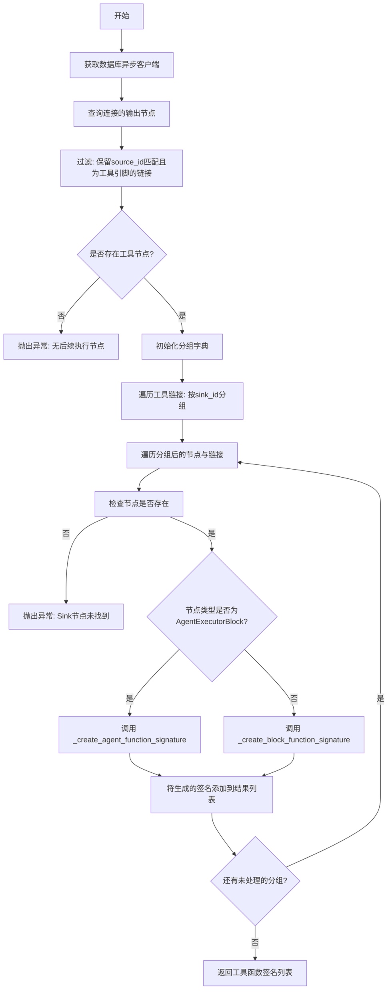

#### 带注释源码

```python
    @staticmethod
    async def _create_tool_node_signatures(
        node_id: str,
    ) -> list[dict[str, Any]]:
        """
        Creates function signatures for connected tools.

        Args:
            node_id: The node_id for which to create function signatures.

        Returns:
            List of function signatures for tools
        """
        # 获取数据库客户端，用于查询图结构和节点信息
        db_client = get_database_manager_async_client()
        
        # 获取当前节点连接的下游节点，并过滤出属于工具调用引脚的连接
        # 条件：链接来源必须是当前节点，且来源名称必须是一个工具引脚
        tools = [
            (link, node)
            for link, node in await db_client.get_connected_output_nodes(node_id)
            if is_tool_pin(link.source_name) and link.source_id == node_id
        ]
        
        # 如果没有找到任何工具连接，抛出错误，因为没有工具可以调用
        if not tools:
            raise ValueError("There is no next node to execute.")

        return_tool_functions: list[dict[str, Any]] = []

        # 将连接按目标节点ID（sink_id）进行分组
        # 因为一个目标节点可能通过多个输入字段与当前节点相连，我们需要将它们聚合为一个工具定义
        grouped_tool_links: dict[str, tuple["Node", list["Link"]]] = {}
        for link, node in tools:
            if link.sink_id not in grouped_tool_links:
                grouped_tool_links[link.sink_id] = (node, [link])
            else:
                grouped_tool_links[link.sink_id][1].append(link)

        # 遍历每个目标节点及其对应的连接列表
        for sink_node, links in grouped_tool_links.values():
            # 防御性检查：确保目标节点存在
            if not sink_node:
                raise ValueError(f"Sink node not found: {links[0].sink_id}")

            # 根据目标节点的块类型（Block ID）决定如何生成函数签名
            if sink_node.block_id == AgentExecutorBlock().id:
                # 如果是Agent执行器节点，调用专门的Agent签名生成方法
                tool_func = (
                    await SmartDecisionMakerBlock._create_agent_function_signature(
                        sink_node, links
                    )
                )
                return_tool_functions.append(tool_func)
            else:
                # 如果是普通块，调用标准块的签名生成方法
                tool_func = (
                    await SmartDecisionMakerBlock._create_block_function_signature(
                        sink_node, links
                    )
                )
                return_tool_functions.append(tool_func)

        # 返回收集到的所有工具函数签名
        return return_tool_functions
```


### `SmartDecisionMakerBlock._attempt_llm_call_with_validation`

尝试执行一次 LLM 调用，并对返回的工具调用参数进行严格验证。如果验证失败（如 JSON 格式错误、参数缺失或不匹配），则抛出 ValueError；否则返回 LLM 响应对象并更新执行统计信息。

参数：

-  `credentials`：`llm.APIKeyCredentials`，用于访问 LLM 服务的 API 凭证。
-  `input_data`：`Input`，块的输入数据，包含模型配置、提示词、重试次数等信息。
-  `current_prompt`：`list[dict]`，当前发送给 LLM 的对话上下文或提示列表。
-  `tool_functions`：`list[dict[str, Any]]`，当前可用的工具定义列表，用于验证 LLM 返回的工具调用。

返回值：`Any` (通常为 `backend.blocks.llm.LLMResponse`)，经过验证的 LLM 响应对象。

#### 流程图

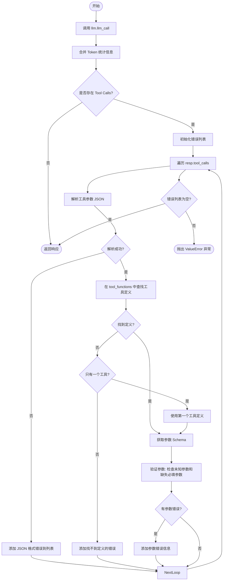

#### 带注释源码

```python
    async def _attempt_llm_call_with_validation(
        self,
        credentials: llm.APIKeyCredentials,
        input_data: Input,
        current_prompt: list[dict],
        tool_functions: list[dict[str, Any]],
    ):
        """
        Attempt a single LLM call with tool validation.

        Returns the response if successful, raises ValueError if validation fails.
        """
        # 调用 LLM 接口，传入当前提示词、模型、凭证和工具定义
        resp = await llm.llm_call(
            compress_prompt_to_fit=input_data.conversation_compaction,
            credentials=credentials,
            llm_model=input_data.model,
            prompt=current_prompt,
            max_tokens=input_data.max_tokens,
            tools=tool_functions,
            ollama_host=input_data.ollama_host,
            parallel_tool_calls=input_data.multiple_tool_calls,
        )

        # 记录本次调用的 Token 使用量到统计信息中
        self.merge_stats(
            NodeExecutionStats(
                input_token_count=resp.prompt_tokens,
                output_token_count=resp.completion_tokens,
                llm_call_count=1,
            )
        )

        # 如果响应中不包含工具调用，直接返回响应
        if not resp.tool_calls:
            return resp
        
        # 初始化验证错误列表
        validation_errors_list: list[str] = []
        for tool_call in resp.tool_calls:
            tool_name = tool_call.function.name
            try:
                # 尝试解析工具调用的参数 JSON 字符串
                tool_args = json.loads(tool_call.function.arguments)
            except Exception as e:
                # 如果 JSON 解析失败，记录错误并继续处理下一个工具调用
                validation_errors_list.append(
                    f"Tool call '{tool_name}' has invalid JSON arguments: {e}"
                )
                continue

            # 在已知的工具定义列表中查找当前工具调用的定义
            tool_def = next(
                (
                    tool
                    for tool in tool_functions
                    if tool["function"]["name"] == tool_name
                ),
                None,
            )
            # 如果找不到匹配的定义，尝试回退逻辑：如果只有一个工具定义，则假定使用它
            if tool_def is None:
                if len(tool_functions) == 1:
                    tool_def = tool_functions[0]
                else:
                    validation_errors_list.append(
                        f"Tool call for '{tool_name}' does not match any known "
                        "tool definition."
                    )

            # 获取工具定义中的参数 Schema（properties 和 required）
            if (
                tool_def
                and "function" in tool_def
                and "parameters" in tool_def["function"]
            ):
                parameters = tool_def["function"]["parameters"]
                expected_args = parameters.get("properties", {})
                required_params = set(parameters.get("required", []))
            else:
                # 如果没有 Schema，则根据实际提供的参数构建一个宽松的预期集合
                expected_args = {arg: {} for arg in tool_args.keys()}
                required_params = set()

            # 验证工具调用参数
            provided_args = set(tool_args.keys())
            expected_args_set = set(expected_args.keys())

            # 检查是否有未定义的参数（可能是拼写错误）
            unexpected_args = provided_args - expected_args_set
            # 检查是否缺少必填参数
            missing_required_args = required_params - provided_args

            # 如果存在参数验证错误，构建详细的错误信息
            if unexpected_args or missing_required_args:
                error_msg = f"Tool call '{tool_name}' has parameter errors:"
                if unexpected_args:
                    error_msg += f" Unknown parameters: {sorted(unexpected_args)}."
                if missing_required_args:
                    error_msg += f" Missing required parameters: {sorted(missing_required_args)}."
                error_msg += f" Expected parameters: {sorted(expected_args_set)}."
                if required_params:
                    error_msg += f" Required parameters: {sorted(required_params)}."
                validation_errors_list.append(error_msg)

        # 如果存在任何验证错误，抛出 ValueError，中断流程
        if validation_errors_list:
            raise ValueError("; ".join(validation_errors_list))

        # 验证通过，返回响应对象
        return resp
```


### `SmartDecisionMakerBlock._process_tool_calls`

该方法负责解析大语言模型（LLM）返回的原始工具调用数据，将其与预定义的工具定义进行匹配，并对参数进行字段映射和清洗，生成可用于后续执行的标准化工具信息列表。

参数：

-   `response`：`Any`，LLM 的响应对象，包含 `tool_calls` 属性，其中存储了模型生成的原始工具调用数据（如函数名和参数字符串）。
-   `tool_functions`：`list[dict[str, Any]]`，当前上下文中可用的工具定义列表，包含工具的元数据（如 `_field_mapping` 和 `_sink_node_id`）以及参数的 JSON Schema。

返回值：`list[ToolInfo]`，处理后的工具信息对象列表。每个对象包含了原始调用、工具名称、定义、处理后的输入数据以及字段映射关系。

#### 流程图

```mermaid
flowchart TD
    A[开始: _process_tool_calls] --> B{response.tool_calls 是否为空?}
    B -- 是 --> C[返回空列表 []]
    B -- 否 --> D[初始化 processed_tools 列表]
    D --> E[遍历 response.tool_calls]
    
    E --> F[提取 tool_name 和 tool_args<br>解析 JSON 参数]
    F --> G[在 tool_functions 中查找匹配的 tool_def]
    
    G --> H{是否找到 tool_def?}
    H -- 否 --> I{tool_functions 长度是否为 1?}
    I -- 是 --> J[使用唯一的 tool_functions[0] 作为 tool_def]
    I -- 否 --> K[跳过该工具调用 continue]
    
    H -- 是 --> L[获取 tool_def]
    J --> L
    L --> M[初始化 input_data 和 field_mapping]
    
    M --> N[遍历 tool_def 中的 expected_args]
    N --> O[通过 field_mapping 将清理后的参数名<br>映射回原始字段名]
    O --> P[从 tool_args 获取参数值<br>即使为 None 也包含]
    P --> Q[将 原始字段名:参数值 存入 input_data]
    
    Q --> R[构建 ToolInfo 对象]
    R --> S[追加到 processed_tools]
    S --> E
    
    E -- 遍历结束 --> T[返回 processed_tools]
```

#### 带注释源码

```python
    def _process_tool_calls(
        self, response, tool_functions: list[dict[str, Any]]
    ) -> list[ToolInfo]:
        """Process tool calls and extract tool definitions, arguments, and input data.

        Returns a list of tool info dicts with:
        - tool_call: The original tool call object
        - tool_name: The function name
        - tool_def: The tool definition from tool_functions
        - input_data: Processed input data dict (includes None values)
        - field_mapping: Field name mapping for the tool
        """
        # 如果响应中没有工具调用，直接返回空列表
        if not response.tool_calls:
            return []

        processed_tools = []
        # 遍历每一个工具调用
        for tool_call in response.tool_calls:
            tool_name = tool_call.function.name
            # 将 LLM 返回的 JSON 字符串参数解析为字典
            tool_args = json.loads(tool_call.function.arguments)

            # 在可用的工具定义列表中查找与当前调用名称匹配的工具定义
            tool_def = next(
                (
                    tool
                    for tool in tool_functions
                    if tool["function"]["name"] == tool_name
                ),
                None,
            )
            # 如果找不到完全匹配的工具定义
            if not tool_def:
                # 容错处理：如果只有一个工具函数，则假定它就是要调用的工具
                if len(tool_functions) == 1:
                    tool_def = tool_functions[0]
                else:
                    # 否则跳过该次调用
                    continue

            # 构建用于执行的输入数据字典
            input_data = {}
            # 获取字段映射表（用于将符合 API 规范的清理后名称映射回原始的系统字段名）
            field_mapping = tool_def["function"].get("_field_mapping", {})
            
            # 检查 tool_def 结构是否有效
            if "function" in tool_def and "parameters" in tool_def["function"]:
                # 获取工具定义中声明的所有参数
                expected_args = tool_def["function"]["parameters"].get("properties", {})
                for clean_arg_name in expected_args:
                    # 将清洗过的参数名（如 arg_name_1）还原为原始字段名（如 argName）
                    original_field_name = field_mapping.get(
                        clean_arg_name, clean_arg_name
                    )
                    # 从 LLM 返回的参数中获取值
                    arg_value = tool_args.get(clean_arg_name)
                    # 填充输入数据，保留所有期望的参数，即使值为 None（为了向后兼容性）
                    input_data[original_field_name] = arg_value

            # 将处理好的信息封装成 ToolInfo 对象并加入结果列表
            processed_tools.append(
                ToolInfo(
                    tool_call=tool_call,
                    tool_name=tool_name,
                    tool_def=tool_def,
                    input_data=input_data,
                    field_mapping=field_mapping,
                )
            )

        return processed_tools
```


### `SmartDecisionMakerBlock._update_conversation`

通过处理大语言模型（LLM）的原始响应，包含推理过程（如果有）以及工具调用产生的输出，来更新现有的对话历史记录。该方法确保对话历史格式兼容不同的LLM提供商（如Anthropic和OpenAI），并维护消息的正确顺序。

参数：

-  `prompt`：`list[dict]`，需要被就地更新的对话历史记录列表。
-  `response`：`Any`，LLM返回的响应对象，包含原始回复内容（raw_response）和可能的推理内容（reasoning）。
-  `tool_outputs`：`list | None`，工具执行结果的列表，如果存在则追加到对话记录中。

返回值：`None`，该方法直接修改传入的 `prompt` 列表，不返回任何值。

#### 流程图

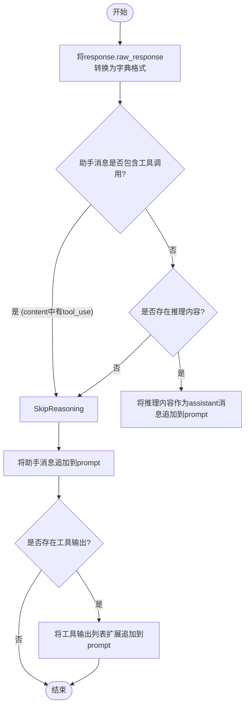

#### 带注释源码

```python
    def _update_conversation(
        self, prompt: list[dict], response, tool_outputs: list | None = None
    ):
        """Update conversation history with response and tool outputs."""
        # 将LLM的原始响应转换为标准字典格式，以便统一处理
        # Don't add separate reasoning message with tool calls (breaks Anthropic's tool_use->tool_result pairing)
        assistant_message = _convert_raw_response_to_dict(response.raw_response)
        
        # 检查助手消息中是否包含工具调用请求
        # 主要是为了兼容Anthropic格式，检查content列表中是否存在type为'tool_use'的项
        has_tool_calls = isinstance(assistant_message.get("content"), list) and any(
            item.get("type") == "tool_use"
            for item in assistant_message.get("content", [])
        )

        # 如果响应包含推理内容，且当前没有工具调用，
        # 则将推理内容作为一个独立的assistant消息添加到历史记录中。
        # 注意：如果有工具调用，不单独添加推理消息，以免破坏Anthropic的 tool_use -> tool_result 配对逻辑。
        if response.reasoning and not has_tool_calls:
            prompt.append(
                {"role": "assistant", "content": f"[Reasoning]: {response.reasoning}"}
            )

        # 将主要的助手消息（包含实际回复或工具调用请求）追加到对话历史中
        prompt.append(assistant_message)

        # 如果提供了工具执行的结果输出，将其全部追加到对话历史中
        # 这通常用于User角色回复Assistant的Tool调用请求
        if tool_outputs:
            prompt.extend(tool_outputs)
```


### `SmartDecisionMakerBlock._execute_single_tool_with_manager`

使用执行管理器执行单个工具节点，负责通过数据库管理器持久化执行输入，协调节点在执行处理器中的运行，并获取执行结果以生成标准化的工具响应消息。

参数：

-  `tool_info`：`ToolInfo`，包含待执行工具的详细信息，如原始调用对象、工具定义、输入数据和字段映射。
-  `execution_params`：`ExecutionParams`，包含执行所需的上下文参数，如用户ID、图ID、节点ID、执行ID及版本等。
-  `execution_processor`：`"ExecutionProcessor"`，执行处理器实例，用于管理和触发具体的节点执行逻辑。

返回值：`dict`，返回一个符合 OpenAI 或 Anthropic 格式的工具响应字典，包含执行结果或错误信息。

#### 流程图

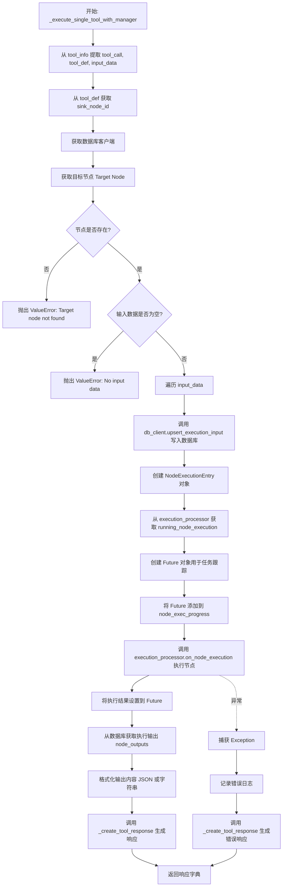

#### 带注释源码

```python
    async def _execute_single_tool_with_manager(
        self,
        tool_info: ToolInfo,
        execution_params: ExecutionParams,
        execution_processor: "ExecutionProcessor",
    ) -> dict:
        """Execute a single tool using the execution manager for proper integration."""
        # 延迟导入以避免循环依赖
        from backend.data.execution import NodeExecutionEntry

        tool_call = tool_info.tool_call
        tool_def = tool_info.tool_def
        raw_input_data = tool_info.input_data

        # 获取目标节点的 ID 和字段映射
        sink_node_id = tool_def["function"]["_sink_node_id"]

        # 使用数据库操作客户端进行工具执行
        db_client = get_database_manager_async_client()

        # 获取目标节点实体
        target_node = await db_client.get_node(sink_node_id)
        if not target_node:
            raise ValueError(f"Target node {sink_node_id} not found")

        # 使用 upsert_execution_input 创建适当的节点执行
        node_exec_result = None
        final_input_data = None

        # 将所有输入添加到执行上下文中
        if not raw_input_data:
            raise ValueError(f"Tool call has no input data: {tool_call}")

        # 遍历输入数据并持久化到数据库
        for input_name, input_value in raw_input_data.items():
            node_exec_result, final_input_data = await db_client.upsert_execution_input(
                node_id=sink_node_id,
                graph_exec_id=execution_params.graph_exec_id,
                input_name=input_name,
                input_data=input_value,
            )

        assert node_exec_result is not None, "node_exec_result should not be None"

        # 创建 NodeExecutionEntry 以供执行管理器使用
        node_exec_entry = NodeExecutionEntry(
            user_id=execution_params.user_id,
            graph_exec_id=execution_params.graph_exec_id,
            graph_id=execution_params.graph_id,
            graph_version=execution_params.graph_version,
            node_exec_id=node_exec_result.node_exec_id,
            node_id=sink_node_id,
            block_id=target_node.block_id,
            inputs=final_input_data or {},
            execution_context=execution_params.execution_context,
        )

        # 使用执行管理器执行工具节点
        try:
            # 从执行管理器的运行节点中获取 NodeExecutionProgress
            node_exec_progress = execution_processor.running_node_execution[
                sink_node_id
            ]

            # 使用执行管理器自己的图统计信息
            graph_stats_pair = (
                execution_processor.execution_stats,
                execution_processor.execution_stats_lock,
            )

            # 为任务跟踪系统创建一个已完成的 Future
            node_exec_future = Future()
            node_exec_progress.add_task(
                node_exec_id=node_exec_result.node_exec_id,
                task=node_exec_future,
            )

            # 直接执行节点，因为我们在 SmartDecisionMaker 上下文中
            # 调用 on_node_execution 并将结果设置到 future 中
            node_exec_future.set_result(
                await execution_processor.on_node_execution(
                    node_exec=node_exec_entry,
                    node_exec_progress=node_exec_progress,
                    nodes_input_masks=None,
                    graph_stats_pair=graph_stats_pair,
                )
            )

            # 执行完成后，使用数据库管理器客户端从数据库获取输出
            node_outputs = await db_client.get_execution_outputs_by_node_exec_id(
                node_exec_result.node_exec_id
            )

            # 创建工具响应内容
            tool_response_content = (
                json.dumps(node_outputs)
                if node_outputs
                else "Tool executed successfully"
            )
            # 生成标准格式的工具响应（兼容 OpenAI/Anthropic）
            return _create_tool_response(tool_call.id, tool_response_content)

        except Exception as e:
            logger.error(f"Tool execution with manager failed: {e}")
            # 返回错误响应
            return _create_tool_response(
                tool_call.id, f"Tool execution failed: {str(e)}"
            )
```


### `SmartDecisionMakerBlock._execute_tools_agent_mode`

在智能体模式下执行工具，通过循环机制持续调用大语言模型（LLM）并执行工具，直到任务完成或达到最大迭代次数。该方法负责管理对话历史、处理LLM响应、执行具体工具操作以及错误处理。

参数：

-  `self`：`SmartDecisionMakerBlock`，类的实例。
-  `input_data`：`Input`，包含块配置数据的输入对象，包括提示词、模型设置、最大迭代次数等。
-  `credentials`：`llm.APIKeyCredentials`，用于调用 LLM 的 API 凭证。
-  `tool_functions`：`list[dict[str, Any]]`，可用工具函数的定义列表。
-  `prompt`：`list[dict]`，初始的对话历史或提示列表。
-  `graph_exec_id`：`str`，图执行的唯一标识符。
-  `node_id`：`str`，当前节点的唯一标识符。
-  `node_exec_id`：`str`，当前节点执行的唯一标识符。
-  `user_id`：`str`，执行操作的用户 ID。
-  `graph_id`：`str`，当前图的 ID。
-  `graph_version`：`int`，图的版本号。
-  `execution_context`：`ExecutionContext`，执行上下文对象，包含执行时的环境信息。
-  `execution_processor`：`ExecutionProcessor`，执行处理器，用于调度和管理子节点的执行。

返回值：`AsyncGenerator[tuple[str, Any], None]`，异步生成器，按顺序生成执行过程中的状态更新。生成的键值对包括：
-  `"error"`：执行过程中发生的错误信息。
-  `"finished"`：任务完成时的最终消息或摘要。
-  `"conversations"`：更新后的对话历史记录。

#### 流程图

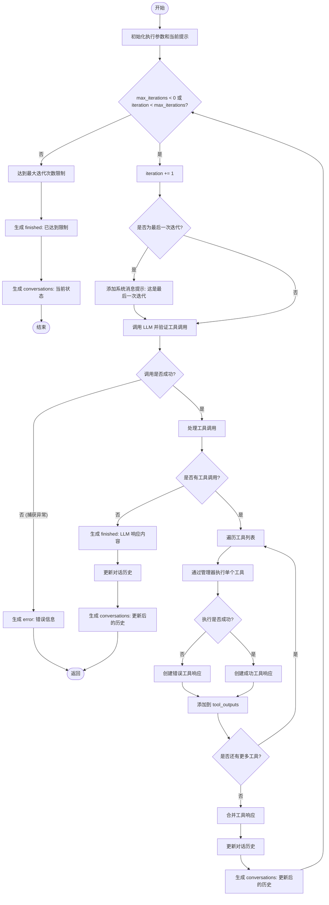

#### 带注释源码

```python
    async def _execute_tools_agent_mode(
        self,
        input_data,
        credentials,
        tool_functions: list[dict[str, Any]],
        prompt: list[dict],
        graph_exec_id: str,
        node_id: str,
        node_exec_id: str,
        user_id: str,
        graph_id: str,
        graph_version: int,
        execution_context: ExecutionContext,
        execution_processor: "ExecutionProcessor",
    ):
        """Execute tools in agent mode with a loop until finished."""
        # 获取最大迭代次数配置，0表示传统模式，-1表示无限循环，正数表示最大次数
        max_iterations = input_data.agent_mode_max_iterations
        iteration = 0

        # 封装执行所需的参数对象
        execution_params = ExecutionParams(
            user_id=user_id,
            graph_id=graph_id,
            node_id=node_id,
            graph_version=graph_version,
            graph_exec_id=graph_exec_id,
            node_exec_id=node_exec_id,
            execution_context=execution_context,
        )

        # 复制初始提示，用于在循环中维护当前对话上下文
        current_prompt = list(prompt)

        # 主循环：条件为迭代次数未达上限（或者设置为无限循环）
        while max_iterations < 0 or iteration < max_iterations:
            iteration += 1
            logger.debug(f"Agent mode iteration {iteration}")

            # 准备当前迭代的提示副本
            iteration_prompt = list(current_prompt)

            # 如果是有限次数且是最后一次迭代，添加系统消息强制 LLM 尝试结束
            if max_iterations > 0 and iteration == max_iterations:
                last_iteration_message = {
                    "role": "system",
                    "content": f"{MAIN_OBJECTIVE_PREFIX}This is your last iteration ({iteration}/{max_iterations}). "
                    "Try to complete the task with the information you have. If you cannot fully complete it, "
                    "provide a summary of what you've accomplished and what remains to be done. "
                    "Prefer finishing with a clear response rather than making additional tool calls.",
                }
                iteration_prompt.append(last_iteration_message)

            # 调用 LLM 并进行验证
            try:
                response = await self._attempt_llm_call_with_validation(
                    credentials, input_data, iteration_prompt, tool_functions
                )
            except Exception as e:
                # 如果调用失败，生成错误并退出
                yield "error", f"LLM call failed in agent mode iteration {iteration}: {str(e)}"
                return

            # 解析 LLM 返回的工具调用信息
            processed_tools = self._process_tool_calls(response, tool_functions)

            # 如果没有工具调用，说明任务已完成
            if not processed_tools:
                yield "finished", response.response
                self._update_conversation(current_prompt, response)
                yield "conversations", current_prompt
                return

            # 执行工具并收集输出
            tool_outputs = []
            for tool_info in processed_tools:
                try:
                    # 通过执行管理器执行单个工具节点
                    tool_response = await self._execute_single_tool_with_manager(
                        tool_info, execution_params, execution_processor
                    )
                    tool_outputs.append(tool_response)
                except Exception as e:
                    logger.error(f"Tool execution failed: {e}")
                    # 如果工具执行出错，生成错误响应信息
                    error_response = _create_tool_response(
                        tool_info.tool_call.id, f"Error: {str(e)}"
                    )
                    tool_outputs.append(error_response)

            # 合并工具响应（针对 Anthropic 格式）
            tool_outputs = _combine_tool_responses(tool_outputs)

            # 将 LLM 响应和工具输出更新到对话历史中
            self._update_conversation(current_prompt, response, tool_outputs)

            # 产出中间状态的对话历史
            yield "conversations", current_prompt

        # 如果循环结束（达到最大迭代次数），产出最终状态
        if max_iterations < 0:
            yield "finished", f"Agent mode completed after {iteration} iterations"
        else:
            yield "finished", f"Agent mode completed after {max_iterations} iterations (limit reached)"
        yield "conversations", current_prompt
```


### `SmartDecisionMakerBlock.run`

该方法是 `SmartDecisionMakerBlock` 类的核心执行入口。它负责根据连接的下游节点动态生成工具定义，管理对话历史和待处理的工具调用状态，并根据配置决定是执行“一次性模式”（单次 LLM 调用并返回工具调用参数供外部执行）还是“Agent 模式”（内部循环执行工具直到任务完成）。此外，它还处理 LLM 调用的重试机制、参数验证以及格式化输出。

参数：

-   `input_data`：`Input`，包含用户提示、模型配置、凭据、对话历史及任务控制参数（如重试次数、Agent 模式迭代限制等）的输入数据对象。
-   `credentials`：`llm.APIKeyCredentials`，用于调用大语言模型的 API 密钥或凭据对象。
-   `graph_id`：`str`，当前执行流程所属的图 ID。
-   `node_id`：`str`，当前节点（SmartDecisionMakerBlock）的 ID。
-   `graph_exec_id`：`str`，当前图执行实例的唯一 ID。
-   `node_exec_id`：`str`，当前节点执行实例的唯一 ID。
-   `user_id`：`str`，发起执行的用户 ID。
-   `graph_version`：`int`，当前图的版本号。
-   `execution_context`：`ExecutionContext`，执行上下文对象，包含执行过程中的共享状态。
-   `execution_processor`：`"ExecutionProcessor"`，执行处理器引用，用于在 Agent 模式下调度和管理子节点（工具）的执行。
-   `nodes_to_skip`：`set[str] | None`，需要跳过执行的工具节点 ID 集合（通常是因为缺少必要的凭据）。
-   `**kwargs`：`Any`，其他额外的关键字参数。

返回值：`BlockOutput`，一个异步生成器，产出键值对。可能的键包括 `tool_functions`（工具定义）、`conversations`（更新后的对话历史）、`finished`（任务完成文本）以及动态生成的工具输入键（格式如 `tools_^_{node_id}_~_{field_name}`）。

#### 流程图

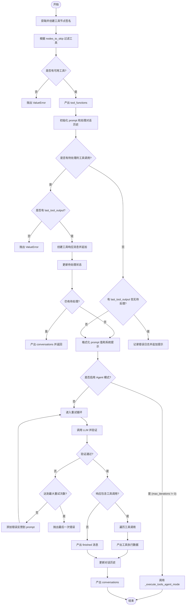

#### 带注释源码

```python
    async def run(
        self,
        input_data: Input,
        *,
        credentials: llm.APIKeyCredentials,
        graph_id: str,
        node_id: str,
        graph_exec_id: str,
        node_exec_id: str,
        user_id: str,
        graph_version: int,
        execution_context: ExecutionContext,
        execution_processor: "ExecutionProcessor",
        nodes_to_skip: set[str] | None = None,
        **kwargs,
    ) -> BlockOutput:
        # 1. 创建工具签名：根据连接的节点生成工具函数定义
        tool_functions = await self._create_tool_node_signatures(node_id)
        original_tool_count = len(tool_functions)

        # 2. 过滤工具：排除因缺少凭据等原因不可用的节点
        if nodes_to_skip:
            tool_functions = [
                tf
                for tf in tool_functions
                if tf.get("function", {}).get("_sink_node_id") not in nodes_to_skip
            ]

            # 如果原本有工具但全被过滤了，抛出错误
            if original_tool_count > 0 and not tool_functions:
                raise ValueError(
                    "No available tools to execute - all downstream nodes are unavailable "
                    "(possibly due to missing optional credentials)"
                )

        # 产出可用的工具函数定义，供前端或其他组件使用
        yield "tool_functions", json.dumps(tool_functions)

        # 3. 准备对话上下文
        conversation_history = input_data.conversation_history or []
        prompt = [json.to_dict(p) for p in conversation_history if p]

        # 4. 处理待处理的工具调用（状态恢复）
        pending_tool_calls = get_pending_tool_calls(conversation_history)
        if pending_tool_calls and input_data.last_tool_output is None:
            # 如果有待处理调用但没有提供输出，说明数据流缺失
            raise ValueError(f"Tool call requires an output for {pending_tool_calls}")

        tool_output = []
        if pending_tool_calls and input_data.last_tool_output is not None:
            # 处理上一步工具的输出，构建 Tool Response 消息
            first_call_id = next(iter(pending_tool_calls.keys()))
            tool_output.append(
                _create_tool_response(first_call_id, input_data.last_tool_output)
            )

            prompt.extend(tool_output)
            remaining_pending_calls = get_pending_tool_calls(prompt)

            # 如果仍有未解决的调用，等待下一次输入，暂不进行 LLM 推理
            if remaining_pending_calls:
                yield "conversations", prompt
                return
        elif input_data.last_tool_output:
            # 边缘情况：没有待处理调用却有工具输出，可能是不一致的状态
            logger.error(
                f"[SmartDecisionMakerBlock-node_exec_id={node_exec_id}] "
                f"No pending tool calls found. This may indicate an issue with the "
                f"conversation history, or the tool giving response more than once."
                f"This should not happen! Please check the conversation history for any inconsistencies."
            )
            tool_output.append(
                {
                    "role": "user",
                    "content": f"Last tool output: {json.dumps(input_data.last_tool_output)}",
                }
            )
            prompt.extend(tool_output)

        # 5. 格式化提示词：应用变量替换和系统/用户提示
        values = input_data.prompt_values
        if values:
            input_data.prompt = llm.fmt.format_string(input_data.prompt, values)
            input_data.sys_prompt = llm.fmt.format_string(input_data.sys_prompt, values)

        # 添加系统提示（如果尚未存在）
        if input_data.sys_prompt and not any(
            p["role"] == "system" and p["content"].startswith(MAIN_OBJECTIVE_PREFIX)
            for p in prompt
        ):
            prompt.append(
                {
                    "role": "system",
                    "content": MAIN_OBJECTIVE_PREFIX + input_data.sys_prompt,
                }
            )

        # 添加用户提示（如果尚未存在）
        if input_data.prompt and not any(
            p["role"] == "user" and p["content"].startswith(MAIN_OBJECTIVE_PREFIX)
            for p in prompt
        ):
            prompt.append(
                {"role": "user", "content": MAIN_OBJECTIVE_PREFIX + input_data.prompt}
            )

        # 6. 执行分支：Agent 模式 vs 一次性模式
        # Agent 模式：在块内部循环调用 LLM 并执行工具直到完成
        if input_data.agent_mode_max_iterations != 0:
            async for result in self._execute_tools_agent_mode(
                input_data=input_data,
                credentials=credentials,
                tool_functions=tool_functions,
                prompt=prompt,
                graph_exec_id=graph_exec_id,
                node_id=node_id,
                node_exec_id=node_exec_id,
                user_id=user_id,
                graph_id=graph_id,
                graph_version=graph_version,
                execution_context=execution_context,
                execution_processor=execution_processor,
            ):
                yield result
            return

        # 一次性模式：单次 LLM 调用，产出工具调用供外部执行器处理
        current_prompt = list(prompt)
        max_attempts = max(1, int(input_data.retry))
        response = None

        last_error = None
        # 重试逻辑：处理 LLM 返回参数格式错误的情况
        for _ in range(max_attempts):
            try:
                response = await self._attempt_llm_call_with_validation(
                    credentials, input_data, current_prompt, tool_functions
                )
                break

            except ValueError as e:
                last_error = e
                # 构建错误反馈信息，要求 LLM 修正
                error_feedback = (
                    "Your tool call had errors. Please fix the following issues and try again:\n"
                    + f"- {str(e)}\n"
                    + "\nPlease make sure to use the exact tool and parameter names as specified in the function schema."
                )
                current_prompt = list(current_prompt) + [
                    {"role": "user", "content": error_feedback}
                ]

        # 如果重试耗尽仍未成功，抛出异常
        if response is None:
            raise last_error or ValueError(
                "Failed to get valid response after all retry attempts"
            )

        # 7. 处理 LLM 响应
        # 如果没有工具调用，说明任务已完成，产出结果
        if not response.tool_calls:
            yield "finished", response.response
            return

        # 如果有工具调用，解析并产出数据给连接的节点
        for tool_call in response.tool_calls:
            tool_name = tool_call.function.name
            tool_args = json.loads(tool_call.function.arguments)

            # 查找对应的工具定义
            tool_def = next(
                (
                    tool
                    for tool in tool_functions
                    if tool["function"]["name"] == tool_name
                ),
                None,
            )
            # 如果找不到定义但只有一个工具，则默认使用它（兼容性逻辑）
            if not tool_def:
                if len(tool_functions) == 1:
                    tool_def = tool_functions[0]
                else:
                    continue

            # 获取参数定义和字段映射（用于将清洗后的参数名映射回原始字段名）
            if "function" in tool_def and "parameters" in tool_def["function"]:
                expected_args = tool_def["function"]["parameters"].get("properties", {})
            else:
                expected_args = {arg: {} for arg in tool_args.keys()}

            field_mapping = tool_def["function"].get("_field_mapping", {})
            sink_node_id = tool_def["function"]["_sink_node_id"]

            # 遍历所有预期参数，产出数据
            for clean_arg_name in expected_args:
                original_field_name = field_mapping.get(clean_arg_name, clean_arg_name)
                arg_value = tool_args.get(clean_arg_name)

                # 构造特定的输出键，格式为 tools_^_{node_id}_~_{field_name}
                # 解析器会识别这个键并将数据路由到对应的节点输入
                emit_key = f"tools_^_{sink_node_id}_~_{original_field_name}"

                logger.debug(
                    "[SmartDecisionMakerBlock|geid:%s|neid:%s] emit %s",
                    graph_exec_id,
                    node_exec_id,
                    emit_key,
                )
                yield emit_key, arg_value

        # 8. 更新对话历史并产出
        if response.reasoning:
            prompt.append(
                {"role": "assistant", "content": f"[Reasoning]: {response.reasoning}"}
            )

        prompt.append(_convert_raw_response_to_dict(response.raw_response))

        yield "conversations", prompt
```

## 关键组件


### Tool Schema Generator
Dynamically generates JSON schema-compliant function definitions for LLM tools by inspecting graph node connections and block input schemas.

### Multi-Format Message Adapter
Abstracts and normalizes differences between OpenAI and Anthropic API message formats for tool requests, responses, and results.

### Agent Execution Engine
Implements an iterative execution loop where the block internally invokes tools via the ExecutionProcessor until a task is finished or limits are reached.

### Conversation Context Manager
Handles the construction and compaction of conversation history, including injecting system prompts and tool outputs into the LLM context.

### Tool Argument Validator
Performs strict validation on LLM-generated tool arguments against function schemas to catch missing required fields or type mismatches before execution.

### Dynamic Field Sanitization
Cleans special characters from input field names to ensure API compliance while maintaining mappings to original field names for data routing.

### Database Metadata Resolver
Asynchronously fetches graph and node details from the database to construct accurate tool signatures and locate target execution nodes.

### Execution Statistics Aggregator
Tracks and accumulates token usage and execution metrics from LLM calls and tool executions for performance monitoring.

### Pending Call State Tracker
Analyzes conversation history to determine the state of pending tool calls, ensuring correct synchronization between requests and responses.


## 问题及建议


### 已知问题

-   **LLM 提供商格式耦合**: `_get_tool_requests`, `_get_tool_responses`, `_create_tool_response` 等函数中硬编码了对 OpenAI 和 Anthropic 格式的判断逻辑（如检查 `toolu_` 前缀或特定字段）。添加新的 LLM 提供商需要修改多处代码，违反了开闭原则。
-   **工具定义查找效率低**: 在 `_attempt_llm_call_with_validation`、`_process_tool_calls` 和 `run` 方法中，均使用 `next((tool for tool in tool_functions if ...), None)` 这种线性搜索方式来根据名称查找工具定义。当可用工具数量较多时，这会影响性能。
-   **代码重复**: 查找工具定义 (`tool_def`) 的逻辑在多个方法中重复出现，且逻辑基本一致，缺乏封装。
-   **魔法字符串**: 在 `run` 方法中，输出键的生成使用了 `tools_^_` 和 `_~_` 等硬编码的分隔符和前缀。这种字符串拼接方式缺乏语义化，容易因拼写错误导致系统故障，且难以维护。
-   **工具执行的复杂耦合**: `_execute_single_tool_with_manager` 方法内部直接操作数据库 (`upsert_execution_input`)，并手动创建和管理 `Future` 对象与 `ExecutionProcessor` 交互。这种逻辑使得 Block 与底层数据库和执行管理器强耦合，违反了单一职责原则，增加了测试难度。
-   **顺序执行限制**: 虽然 `input_data.multiple_tool_calls` 允许 LLM 并行生成工具调用，但在 `_execute_tools_agent_mode` 中，工具是按顺序串行执行的（`for tool_info in processed_tools`），无法利用并行能力加速执行。

### 优化建议

-   **使用策略模式处理 LLM 格式**: 建议抽象出一个 `LLMResponseAdapter` 接口，针对 OpenAI、Anthropic、Ollama 等不同提供商实现具体的解析类，将格式判断和转换逻辑从主流程中剥离。
-   **优化工具定义查找结构**: 将 `tool_functions` 列表转换为以 `tool_name` 为键的字典，将查找时间复杂度从 $O(N)$ 降低到 $O(1)$。
-   **抽取公共工具查找逻辑**: 将查找工具定义、获取字段映射等重复逻辑封装为私有辅助方法（如 `_find_tool_def`），消除代码重复。
-   **引入常量管理魔法字符串**: 将 `tools_^_` 等分隔符和前缀定义为类级别的常量，或者封装为专门的 Key 生成器方法，提高代码可读性和安全性。
-   **解耦工具执行逻辑**: 建议将 `_execute_single_tool_with_manager` 中的数据库操作和执行器调用逻辑下沉到 `ExecutionProcessor` 或专门的服务层，Block 仅负责传递指令和接收结果，简化 Block 的职责。
-   **支持并行工具执行**: 在 Agent 模式下，如果 LLM 返回了多个独立的工具调用，可以使用 `asyncio.gather` 并行执行这些工具，以减少总耗时。
-   **缓存工具签名**: 如果图结构在单次执行期间不发生变化，可以考虑缓存 `_create_tool_node_signatures` 的结果，避免重复的数据库查询和计算。


## 其它


### 设计目标与约束

设计目标：
1.  **通用代理编排能力**：提供核心逻辑，使大语言模型（LLM）能够基于对话上下文和工具定义智能决策并调用下游工具（Block或Agent），实现复杂的自动化工作流。
2.  **多模型与多协议兼容**：屏蔽不同LLM提供商（如OpenAI、Anthropic、Ollama）之间的协议差异，统一处理工具调用请求与响应的格式（例如区分 `tool_calls` 与 `tool_use`）。
3.  **上下文管理**：支持对话历史的累积与维护，并自动处理上下文窗口限制（通过 `conversation_compaction` 参数）。
4.  **执行模式灵活性**：支持“传统模式”（单次LLM调用，生成工具调用后由外部执行）和“代理模式”（内部循环执行工具直到任务完成或达到迭代上限）。

设计约束：
1.  **命名规范**：所有作为工具使用的块名称必须经过清洗（仅允许字母、数字、下划线和连字符），以符合LLM Function Calling的API规范。
2.  **拓扑连接约束**：`last_tool_output` 不能连接到静态数据源（如 `StoreValue`），且必须与 `conversation_history` 成对出现或成对缺失，以保证数据流的逻辑一致性。
3.  **输入输出格式严格性**：在调用工具时，必须严格匹配工具定义的JSON Schema。Anthropic模式下启用 `strict` 模式，禁止未定义的参数。
4.  **状态依赖**：代理模式下的执行依赖于 `ExecutionProcessor` 和数据库连接，必须在异步环境中运行。

### 错误处理与异常设计

1.  **拓扑校验错误**：
    *   在 `get_missing_links` 阶段，如果检测到非法连接（如静态连接到 `last_tool_output`），或 `conversation_history` 与 `last_tool_output` 连接状态不一致，抛出 `ValueError` 阻止执行。

2.  **LLM 响应校验与重试**：
    *   **机制**：`_attempt_llm_call_with_validation` 方法会对 LLM 返回的工具调用参数进行校验，检查是否存在未知的参数或缺失必填参数。
    *   **处理流程**：如果校验失败，抛出 `ValueError`。在 `run` 方法的“传统模式”循环中，捕获此异常，将错误信息格式化为反馈消息（`error_feedback`）追加到 `prompt` 中，并提示 LLM 修正。重试次数受限于 `input_data.retry` 参数。如果重试耗尽仍未成功，抛出最后一次捕获的异常。

3.  **工具执行错误（代理模式）**：
    *   **机制**：在 `_execute_tools_agent_mode` 中调用 `_execute_single_tool_with_manager` 执行子节点。
    *   **处理流程**：如果执行过程中发生异常，捕获异常并通过 `_create_tool_response` 将错误信息包装为工具的返回结果发送回 LLM。这使得 Agent 能够根据错误信息自我修正或尝试其他操作，而不是直接导致整个流程崩溃。

4.  **数据缺失处理**：
    *   如果检查到 `conversation_history` 中存在待处理的工具调用，但 `last_tool_output` 为空，抛出 `ValueError`，提示必须提供工具输出。
    *   如果提供了 `last_tool_output` 但没有待处理的工具调用，记录 Error 级别日志（防止数据流不一致），但继续执行，将该输出作为普通用户消息处理。

### 数据流与状态机

**核心数据流：**
输入数据 -> 拓扑校验 -> 历史记录合并 -> 工具签名生成 -> [分支：代理模式/传统模式] -> LLM 调用与校验 -> [循环：工具执行 -> 结果回填] -> 输出。

**状态机逻辑：**
1.  **初始状态**：
    *   接收输入，检查 `pending_tool_calls`。
    *   若有挂起调用且无输出，进入错误状态。
    *   若有挂起调用且有输出，将输出回填历史，进入 LLM 决策状态。
    *   若无挂起调用，构建初始 Prompt，进入 LLM 决策状态。

2.  **LLM 决策状态**：
    *   调用 LLM API。
    *   **校验失败**：生成错误反馈 Prompt，重试（仅在传统模式下显式循环，代理模式由外部循环控制）。
    *   **生成文本（无工具调用）**：进入 **完成状态**。
    *   **生成工具调用**：根据 `agent_mode_max_iterations` 分支。

3.  **代理模式循环状态** (Agent Mode Loop, `agent_mode_max_iterations != 0`)：
    *   进入循环。
    *   **工具执行**：遍历工具调用，通过 `ExecutionProcessor` 异步执行下游节点。
    *   **结果整合**：将工具输出格式化为 LLM 可读格式。
    *   **历史更新**：将 LLM 响应和工具输出追加到对话历史。
    *   **条件判断**：
        *   若无工具调用或达到最大迭代次数：跳出循环，进入 **完成状态**。
        *   否则：携带更新后的历史回到 **LLM 决策状态**。

4.  **传统模式状态** (One-off Mode, `agent_mode_max_iterations == 0`)：
    *   LLM 生成工具调用后，不执行工具。
    *   将工具调用参数解析并通过 `yield` 发送到输出流。
    *   更新对话历史（包含 LLM 的思考过程和原始响应）。
    *   进入 **等待状态**（等待外部系统执行工具后再次触发该 Block）。

5.  **完成状态**：
    *   输出 `finished` 信号或最终文本。
    *   输出完整的 `conversations`。

### 外部依赖与接口契约

1.  **LLM 服务适配器 (`backend.blocks.llm`)**
    *   **依赖**：`llm_call` 函数。
    *   **接口契约**：接收模型配置、凭据、Prompt 列表及工具定义列表。返回包含原始响应、文本内容、Token 统计及工具调用列表的对象。该适配器需负责处理不同提供商的底层 API 差异（如流式与非流式、认证方式）。

2.  **执行管理器 (`backend.executor.manager.ExecutionProcessor`)**
    *   **依赖**：用于代理模式下的子节点执行。
    *   **接口契约**：需提供 `running_node_execution` 字典（用于获取进度对象）和 `on_node_execution` 方法（用于实际触发节点执行）。SmartDecisionMakerBlock 需手动构造 `NodeExecutionEntry` 并调用该方法，要求管理器能正确处理并发和状态跟踪。

3.  **数据库管理器 (`backend.util.clients.get_database_manager_async_client`)**
    *   **依赖**：用于获取图谱元数据、节点定义及存储执行输入/输出。
    *   **接口契约**：
        *   `get_connected_output_nodes(node_id)`: 返回连接到指定节点的下游 Link 和 Node 列表。
        *   `get_graph_metadata(graph_id, version)`: 返回图谱的元数据（名称、描述等）。
        *   `get_node(node_id)`: 返回节点的详细配置。
        *   `upsert_execution_input(...)`: 插入或更新执行输入数据，并返回执行记录 ID。
        *   `get_execution_outputs_by_node_exec_id(...)`: 获取节点执行后的输出数据。

4.  **基础模型与动态字段 (`backend.data.block`, `backend.data.dynamic_fields`)**
    *   **依赖**：`Block` 基类，`SchemaField`，动态字段判断函数。
    *   **接口契约**：
        *   `BlockInput`/`BlockOutput`：必须继承自 Pydantic `BaseModel`，用于定义严格的输入输出 Schema。
        *   动态字段逻辑：需配合 `is_dynamic_field` 等函数正确识别并处理非静态定义的字段描述。


    