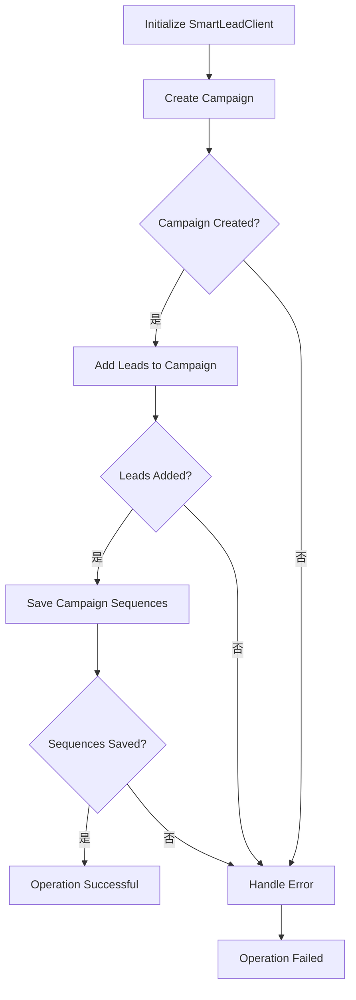
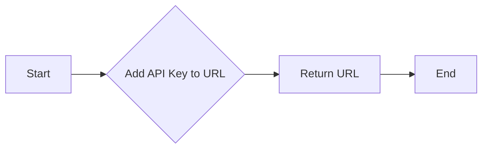
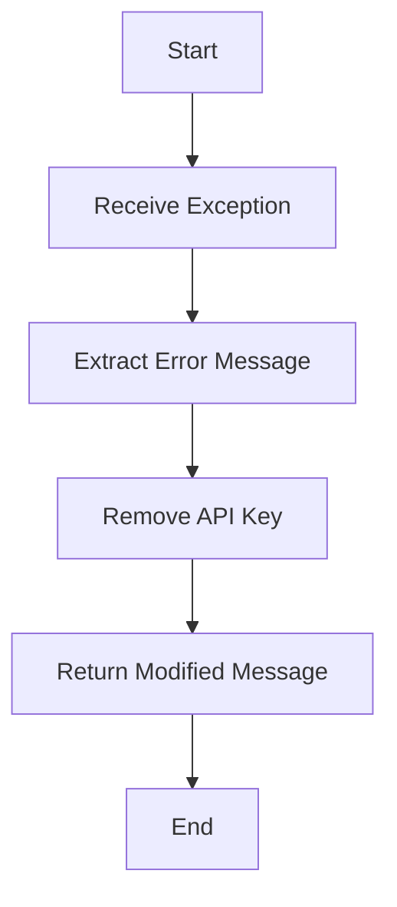
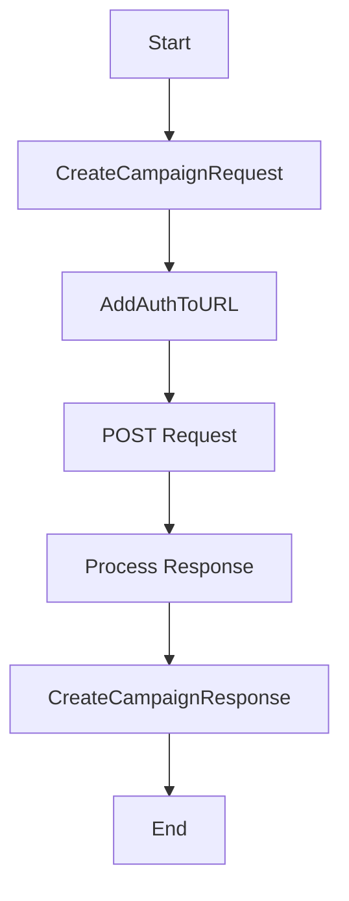
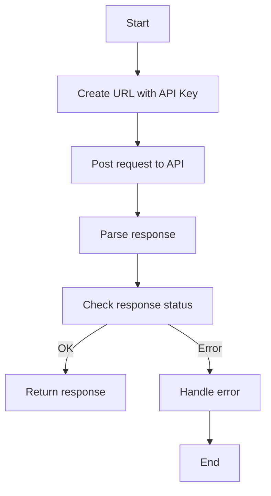
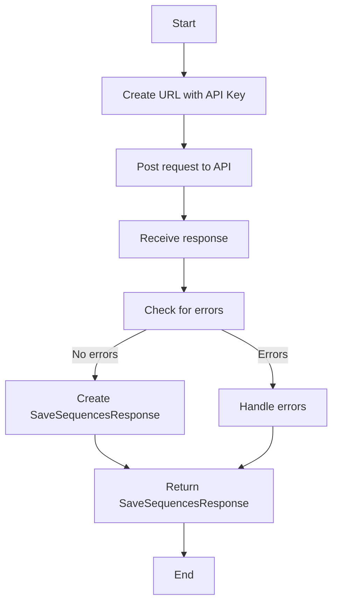

# `.\AutoGPT\autogpt_platform\backend\backend\blocks\smartlead\_api.py` 详细设计文档

The SmartLeadClient class provides an interface to interact with the SmartLead API, allowing for the creation of campaigns, adding leads to campaigns, and saving campaign sequences.

## 整体流程



## 类结构

```
SmartLeadClient (Client for SmartLead API)
```

## 全局变量及字段


### `API_URL`
    
The base URL for the SmartLead API.

类型：`str`
    


### `api_key`
    
The API key for authentication.

类型：`str`
    


### `requests`
    
An instance of Requests to handle HTTP requests.

类型：`Requests`
    


### `SmartLeadClient.api_key`
    
The API key for authentication.

类型：`str`
    


### `SmartLeadClient.requests`
    
An instance of Requests to handle HTTP requests.

类型：`Requests`
    
    

## 全局函数及方法


### SmartLeadClient.__init__

Initializes the SmartLeadClient with an API key.

参数：

- `api_key`：`str`，The API key used to authenticate requests to the SmartLead API.

返回值：无

#### 流程图

```mermaid
classDiagram
    SmartLeadClient <|-- Requests
    SmartLeadClient {
        api_key : str
        requests : Requests
        API_URL : str
    }
    SmartLeadClient {
        +__init__(api_key: str)
    }
```

#### 带注释源码

```python
from backend.blocks.smartlead.models import (
    AddLeadsRequest,
    AddLeadsToCampaignResponse,
    CreateCampaignRequest,
    CreateCampaignResponse,
    SaveSequencesRequest,
    SaveSequencesResponse,
)
from backend.util.request import Requests

class SmartLeadClient:
    """Client for the SmartLead API"""

    API_URL = "https://server.smartlead.ai/api/v1"

    def __init__(self, api_key: str):
        self.api_key = api_key
        self.requests = Requests()
```


### SmartLeadClient._add_auth_to_url

This method appends the API key to the given URL for authentication purposes.

参数：

- `url`：`str`，The URL to which the API key will be appended.

返回值：`str`，The URL with the API key appended.

#### 流程图



#### 带注释源码

```python
def _add_auth_to_url(self, url: str) -> str:
    return f"{url}?api_key={self.api_key}"
```


### `_handle_error(e: Exception)`

Handles and modifies error messages by removing the API key from the error message.

参数：

- `e`：`Exception`，The exception object that contains the error message to be handled.

返回值：`str`，The modified error message without the API key.

#### 流程图



#### 带注释源码

```python
def _handle_error(self, e: Exception) -> str:
    # Extract the error message from the exception
    error_message = e.__str__()
    # Replace the API key with "API KEY" in the error message
    modified_message = error_message.replace(self.api_key, "API KEY")
    # Return the modified error message
    return modified_message
```


### SmartLeadClient.create_campaign

This function creates a new campaign using the SmartLead API.

参数：

- `request`：`CreateCampaignRequest`，A request object containing the details needed to create a new campaign.

返回值：`CreateCampaignResponse`，A response object containing the result of the campaign creation.

#### 流程图



#### 带注释源码

```python
async def create_campaign(
    self, request: CreateCampaignRequest
) -> CreateCampaignResponse:
    try:
        response = await self.requests.post(
            self._add_auth_to_url(f"{self.API_URL}/campaigns/create"),
            json=request.model_dump(),
        )
        response_data = response.json()
        return CreateCampaignResponse(**response_data)
    except ValueError as e:
        raise ValueError(f"Invalid response format: {str(e)}")
    except Exception as e:
        raise ValueError(f"Failed to create campaign: {self._handle_error(e)}")
```


### `SmartLeadClient.add_leads_to_campaign`

Adds leads to a specific campaign.

参数：

- `request`：`AddLeadsRequest`，A request object containing the leads to be added to the campaign.

返回值：`AddLeadsToCampaignResponse`，A response object containing the result of adding the leads to the campaign.

#### 流程图



#### 带注释源码

```python
async def add_leads_to_campaign(
    self, request: AddLeadsRequest
) -> AddLeadsToCampaignResponse:
    try:
        response = await self.requests.post(
            self._add_auth_to_url(
                f"{self.API_URL}/campaigns/{request.campaign_id}/leads"
            ),
            json=request.model_dump(exclude={"campaign_id"}),
        )
        response_data = response.json()
        response_parsed = AddLeadsToCampaignResponse(**response_data)
        if not response_parsed.ok:
            raise ValueError(
                f"Failed to add leads to campaign: {response_parsed.error}"
            )
        return response_parsed
    except ValueError as e:
        raise ValueError(f"Invalid response format: {str(e)}")
    except Exception as e:
        raise ValueError(
            f"Failed to add leads to campaign: {self._handle_error(e)}"
        )
```


### SmartLeadClient.save_campaign_sequences

This method saves sequences within a specific campaign.

参数：

- `campaign_id`：`int`，The ID of the campaign to save sequences for
- `request`：`SaveSequencesRequest`，A SaveSequencesRequest containing the sequences configuration

返回值：`SaveSequencesResponse`，A SaveSequencesResponse with the result of the operation

#### 流程图



#### 带注释源码

```python
async def save_campaign_sequences(
    self, campaign_id: int, request: SaveSequencesRequest
) -> SaveSequencesResponse:
    """
    Save sequences within a campaign.

    Args:
        campaign_id: ID of the campaign to save sequences for
        request: SaveSequencesRequest containing the sequences configuration

    Returns:
        SaveSequencesResponse with the result of the operation

    Note:
        For variant_distribution_type:
        - MANUAL_EQUAL: Equally distributes variants across leads
        - AI_EQUAL: Requires winning_metric_property and lead_distribution_percentage
        - MANUAL_PERCENTAGE: Requires variant_distribution_percentage in seq_variants
    """
    try:
        response = await self.requests.post(
            self._add_auth_to_url(
                f"{self.API_URL}/campaigns/{campaign_id}/sequences"
            ),
            json=request.model_dump(exclude_none=True),
        )
        return SaveSequencesResponse(**(response.json()))
    except Exception as e:
        raise ValueError(
            f"Failed to save campaign sequences: {e.__str__().replace(self.api_key, 'API KEY')}"
        )
```


## 关键组件


### 张量索引与惰性加载

用于高效地索引和访问大型张量数据，同时延迟实际数据加载，以优化内存使用和性能。

### 反量化支持

提供对反量化操作的支持，允许在量化过程中进行逆量化，以恢复原始数据精度。

### 量化策略

定义了不同的量化策略，用于在模型训练和推理过程中调整数据精度，以减少模型大小和提高效率。


## 问题及建议


### 已知问题

-   **API Key 安全性**：API密钥直接嵌入在URL中，这可能导致密钥泄露的风险。建议使用HTTP基本认证或OAuth等更安全的认证方式。
-   **错误处理**：错误处理主要集中在捕获异常并返回自定义错误消息，但没有提供详细的错误日志记录，这可能会影响问题的调试和追踪。
-   **异常处理**：异常处理较为简单，仅捕获了ValueError和Exception，可能需要根据不同的异常类型进行更细致的处理。
-   **代码重复**：`_add_auth_to_url`方法在多个地方被调用，这可能导致维护成本增加。可以考虑将其作为类方法或全局函数来减少重复代码。
-   **异步调用**：代码使用了异步调用，但没有提供同步调用的选项，这可能会限制代码的适用性。

### 优化建议

-   **使用安全的认证方式**：将API密钥从URL中移除，并使用HTTP基本认证或OAuth进行安全认证。
-   **增强错误处理**：增加详细的错误日志记录，并考虑根据不同的异常类型提供更具体的错误处理逻辑。
-   **异常处理细化**：根据不同的异常类型进行更细致的异常处理，例如区分网络异常、服务器异常等。
-   **减少代码重复**：将`_add_auth_to_url`方法作为类方法或全局函数，减少代码重复。
-   **提供同步调用选项**：为异步方法提供同步调用版本，以增加代码的适用性。
-   **代码注释**：增加必要的代码注释，以提高代码的可读性和可维护性。
-   **单元测试**：编写单元测试以确保代码的正确性和稳定性。
-   **性能优化**：考虑对异步调用进行性能优化，例如使用连接池等技术。


## 其它


### 设计目标与约束

- 设计目标：
  - 提供一个易于使用的客户端，用于与SmartLead API交互。
  - 确保所有API请求都包含有效的API密钥。
  - 异步处理API请求以提高性能。
  - 提供清晰的错误消息，便于问题诊断。

- 约束：
  - API密钥必须包含在URL中，不能通过HTTP头或其他方式传递。
  - 不允许对错误的API请求抛出异常，而是应从错误消息中过滤掉API密钥。
  - API响应格式必须是有效的JSON。

### 错误处理与异常设计

- 错误处理：
  - 对于无效的JSON响应，抛出`ValueError`异常，包含“Invalid response format”信息。
  - 对于所有其他异常，抛出`ValueError`异常，包含处理后的错误消息。

### 数据流与状态机

- 数据流：
  - 客户端通过`create_campaign`、`add_leads_to_campaign`和`save_campaign_sequences`方法与SmartLead API交互。
  - 请求被发送到API，并返回响应。
  - 响应被解析并返回给调用者。

- 状态机：
  - 无状态机，因为客户端仅处理API请求和响应。

### 外部依赖与接口契约

- 外部依赖：
  - `backend.blocks.smartlead.models`模块，包含API请求和响应模型。
  - `backend.util.request.Requests`类，用于发送HTTP请求。

- 接口契约：
  - `CreateCampaignRequest`、`CreateCampaignResponse`、`AddLeadsRequest`、`AddLeadsToCampaignResponse`和`SaveSequencesRequest`、`SaveSequencesResponse`模型必须符合SmartLead API的预期格式。
  - `Requests`类必须支持异步HTTP请求。
  - API响应必须遵循JSON格式规范。


    