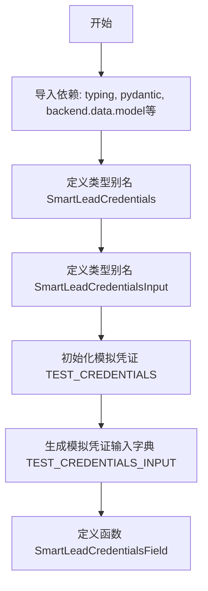
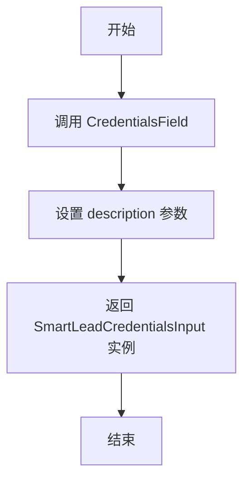

# `AutoGPT\autogpt_platform\backend\backend\blocks\smartlead\_auth.py` 详细设计文档

该代码定义了 SmartLead 提供程序集成所需的凭证类型别名、用于测试的模拟凭证对象，以及一个用于创建凭证输入字段的工厂函数。

## 整体流程



## 类结构

```
APIKeyCredentials (外部导入)
├── SmartLeadCredentials (类型别名)
CredentialsMetaInput (外部导入)
├── SmartLeadCredentialsInput (类型别名)
```

## 全局变量及字段


### `TEST_CREDENTIALS`
    
用于测试目的的 SmartLead API 凭据实例，包含模拟的 ID、提供商、API Key 和标题。

类型：`APIKeyCredentials`
    


### `TEST_CREDENTIALS_INPUT`
    
基于测试凭据实例生成的字典数据，包含提供商、ID、类型和标题，用于模拟输入结构。

类型：`dict`
    


    

## 全局函数及方法


### `SmartLeadCredentialsField`

用于创建 SmartLead 凭证输入字段的工厂函数。它封装了 `CredentialsField`，提供特定的描述文本以指导用户如何为 SmartLead 集成进行身份验证。

参数：

*   无

返回值：`SmartLeadCredentialsInput`，表示 SmartLead 提供商凭证配置的数据结构。

#### 流程图



#### 带注释源码

```python
def SmartLeadCredentialsField() -> SmartLeadCredentialsInput:
    """
    在一个区块上创建 SmartLead 凭证输入。
    """
    # 调用 CredentialsField 辅助函数并传入特定描述
    # 返回类型 SmartLeadCredentialsInput 定义为:
    # CredentialsMetaInput[Literal[ProviderName.SMARTLEAD], Literal["api_key"]]
    return CredentialsField(
        description="The SmartLead integration can be used with an API Key.",
    )
```


## 关键组件


### SmartLeadCredentials

SmartLead API Key 凭证的数据结构，继承自通用的 APIKeyCredentials，用于存储认证信息。

### SmartLeadCredentialsInput

SmartLead 凭证的输入模式，将凭证类型严格限定为 SmartLead 提供商和 api_key 类型。

### SmartLeadCredentialsField

工厂函数，用于生成 SmartLead 凭证的配置字段，包含相应的描述信息，供集成块使用。

### TEST_CREDENTIALS

用于单元测试的 SmartLead 凭证模拟数据，包含预设的模拟 API Key。

### TEST_CREDENTIALS_INPUT

用于单元测试的 SmartLead 凭证输入模拟数据，以字典形式呈现。


## 问题及建议


### 已知问题

-   **命名规范违规**：函数 `SmartLeadCredentialsField` 采用了大驼峰命名法（PascalCase），这通常用于类名。根据 Python PEP 8 编码规范，函数和变量应使用小写加下划线的命名方式（snake_case）。
-   **业务逻辑与测试数据耦合**：代码中直接定义了 `TEST_CREDENTIALS` 和 `TEST_CREDENTIALS_INPUT` 全局变量，将模拟测试数据混入业务逻辑模块中，增加了模块的复杂度和内存占用，且职责划分不清。
-   **硬编码的测试凭证**：测试凭证使用了硬编码的 UUID (`01234567-...`) 和 Key。如果在并发测试场景或需要唯一性校验的场景下，硬编码数据可能导致测试冲突或不可靠。

### 优化建议

-   **重命名函数以符合规范**：将函数名 `SmartLeadCredentialsField` 修改为 `smart_lead_credentials_field`，以符合 Python 社区的通用编码标准。
-   **分离测试固件**：将 `TEST_CREDENTIALS` 及相关的测试常量移动到专门的测试目录（如 `tests/fixtures/`）或 `conftest.py` 中，保持业务代码的纯粹性。
-   **使用动态生成的测试数据**：建议在测试文件中使用 `pytest` 的 fixture 功能或 `faker` / `uuid` 库动态生成凭证 ID 和 Key，以提高测试的隔离性和鲁棒性。
-   **引入显式返回类型注解**：虽然函数体只有一行，但在函数定义中显式添加 `-> SmartLeadCredentialsInput` 类型注解，可以增强代码的可读性和 IDE 的静态检查支持。
-   **集成模式抽象**：鉴于不同 Provider（如 SmartLead）的集成代码结构高度相似，建议考虑使用配置驱动的代码生成器或宏来自动化生成此类 Provider 适配器文件，减少重复代码的编写和维护成本。


## 其它


### 设计目标与约束

**设计目标：**
1.  **标准化配置**：为 SmartLead 服务提供商创建一个标准化的凭证定义，确保集成到系统中时具有统一的接口。
2.  **安全性**：确保敏感信息（API Key）在定义和使用过程中得到封装，防止意外泄露。
3.  **类型安全**：利用 Python 的类型提示（特别是 `Literal`）确保编译时和静态检查时的类型准确性。

**约束：**
1.  **认证方式**：SmartLead 仅支持 API Key 认证模式，不允许使用其他认证方式。
2.  **字段限制**：凭证输入必须包含 `provider`、`api_key` 等特定字段，且字段值必须符合预设的 `Literal` 类型约束。
3.  **依赖框架**：必须依赖 `pydantic` 进行数据模型定义和验证，遵循 `backend.data.model` 中定义的基类结构。

### 外部依赖与接口契约

**外部依赖：**
1.  **pydantic**：用于数据模型验证和敏感字符串处理（`SecretStr`）。
2.  **backend.data.model**：依赖 `APIKeyCredentials` 作为基类，依赖 `CredentialsField` 和 `CredentialsMetaInput` 作为构建块。
3.  **backend.integrations.providers**：依赖 `ProviderName` 枚举来指定服务提供商名称。

**接口契约：**
1.  **`SmartLeadCredentialsInput` 类型**：契约规定该类型必须是 `CredentialsMetaInput` 的子集，严格限制 `provider` 为 "smartlead"，`type` 为 "api_key"。
2.  **`SmartLeadCredentialsField()` 函数**：契约规定该函数不接受参数，且必须返回一个符合 `SmartLeadCredentialsInput` 类型的对象，该对象需包含对 API Key 认证的描述。
3.  **凭证对象结构**：生成的凭证对象必须包含 `id`、`provider`、`api_key` (SecretStr)、`title` 和 `expires_at` 字段。

### 数据流

1.  **初始化阶段**：
    *   系统加载该模块，定义 `SmartLeadCredentials` 和 `SmartLeadCredentialsInput` 类型别名。
    *   初始化 `TEST_CREDENTIALS` 用于单元测试或开发环境模拟。
2.  **配置请求阶段**：
    *   外部系统（如 Block 配置界面）调用 `SmartLeadCredentialsField()`。
    *   函数实例化一个 `CredentialsField`，预设 Provider 为 SmartLead，并指定需要 API Key。
3.  **凭证输入与验证阶段**：
    *   用户输入 API Key。
    *   数据根据 `SmartLeadCredentialsInput` 结构进行封装。
    *   Pydantic 验证器检查数据的格式和必填字段。如果验证通过，API Key 被封装为 `SecretStr` 对象。
4.  **凭证实例化阶段**：
    *   验证通过的数据被转换为 `SmartLeadCredentials` 对象（即 `APIKeyCredentials` 实例），供后续集成逻辑使用。

### 错误处理与异常设计

**隐式错误处理：**
1.  **验证错误**：本模块依赖 Pydantic 进行数据验证。如果用户提供的凭证数据不符合 `SmartLeadCredentialsInput` 的结构（例如缺少 `api_key` 或 `provider` 名称错误），Pydantic 将抛出 `ValidationError`。
2.  **类型安全**：使用 `Literal` 类型在编码阶段防止了无效的 Provider 名称或凭证类型的传递。

**设计考量：**
*   模块本身不包含显式的 `try-except` 块，遵循“显式优于隐式”的原则，将验证逻辑委托给底层的 Pydantic 模型。
*   `SecretStr` 的使用防止了日志打印时的敏感信息泄露，这是一种预防性的安全设计，而非运行时错误处理。

### 安全性设计

1.  **敏感数据保护**：使用 `pydantic.SecretStr` 存储 `api_key`。这意味着在打印对象或转换为字典（未显式获取明文时）时，API Key 会被掩码显示（如 `**********`），从而降低在日志或调试信息中泄露的风险。
2.  **硬编码测试数据隔离**：`TEST_CREDENTIALS` 明确标记为 Mock 数据，仅用于测试环境，且在生产代码中应确保此类模拟数据不会被误用。

    