# `.\AutoGPT\autogpt_platform\backend\backend\blocks\smartlead\campaign.py` 详细设计文档

This code defines a set of blocks for managing campaigns, leads, and sequences in the SmartLead CRM system. It includes functionality to create campaigns, add leads to campaigns, and save sequences within a campaign.

## 整体流程

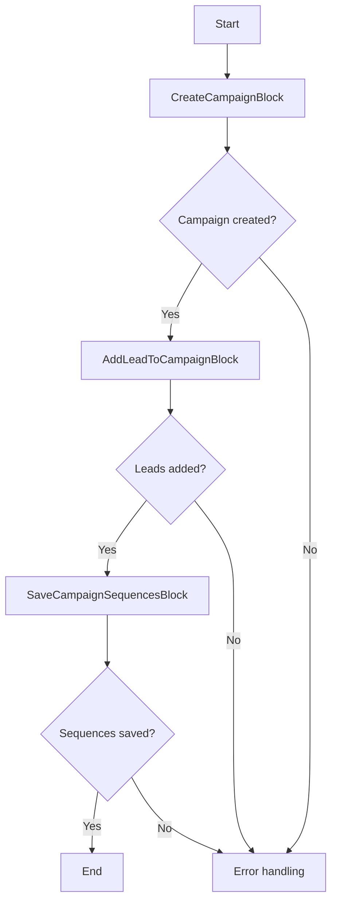

## 类结构

```
CreateCampaignBlock
├── Input
│   ├── name
│   └── credentials
└── Output
    ├── id
    ├── name
    ├── created_at
    └── error
AddLeadToCampaignBlock
├── Input
│   ├── campaign_id
│   ├── lead_list
│   ├── settings
│   └── credentials
└── Output
    ├── campaign_id
    ├── upload_count
    ├── already_added_to_campaign
    ├── duplicate_count
    ├── invalid_email_count
    ├── is_lead_limit_exhausted
    ├── lead_import_stopped_count
    └── error
SaveCampaignSequencesBlock
├── Input
│   ├── campaign_id
│   ├── sequences
│   └── credentials
└── Output
    ├── data
    ├── message
    └── error
```

## 全局变量及字段


### `TEST_CREDENTIALS`
    
Test credentials for SmartLead

类型：`SmartLeadCredentialsInput`
    


### `TEST_CREDENTIALS_INPUT`
    
Test input credentials for SmartLead

类型：`SmartLeadCredentialsInput`
    


### `Block`
    
Base class for all blocks

类型：`class`
    


### `BlockCategory`
    
Enum for block categories

类型：`class`
    


### `BlockOutput`
    
Base class for block outputs

类型：`class`
    


### `BlockSchemaInput`
    
Base class for block schema inputs

类型：`class`
    


### `BlockSchemaOutput`
    
Base class for block schema outputs

类型：`class`
    


### `CredentialsField`
    
Field for credentials in block schema inputs

类型：`class`
    


### `SchemaField`
    
Field for schema in block schema inputs

类型：`class`
    


### `SmartLeadClient`
    
Client for interacting with SmartLead API

类型：`class`
    


### `SmartLeadCredentials`
    
Credentials for SmartLead

类型：`class`
    


### `SmartLeadCredentialsInput`
    
Input for SmartLead credentials

类型：`class`
    


### `AddLeadsRequest`
    
Request for adding leads to a campaign

类型：`class`
    


### `AddLeadsToCampaignResponse`
    
Response from adding leads to a campaign

类型：`class`
    


### `CreateCampaignRequest`
    
Request for creating a campaign

类型：`class`
    


### `CreateCampaignResponse`
    
Response from creating a campaign

类型：`class`
    


### `LeadInput`
    
Input for lead details

类型：`class`
    


### `LeadUploadSettings`
    
Settings for lead upload

类型：`class`
    


### `SaveSequencesRequest`
    
Request for saving sequences in a campaign

类型：`class`
    


### `SaveSequencesResponse`
    
Response from saving sequences in a campaign

类型：`class`
    


### `Sequence`
    
Sequence within a campaign

类型：`class`
    


### `CreateCampaignBlock.id`
    
Unique identifier for the block

类型：`str`
    


### `CreateCampaignBlock.description`
    
Description of the block

类型：`str`
    


### `CreateCampaignBlock.categories`
    
Categories the block belongs to

类型：`set`
    


### `CreateCampaignBlock.input_schema`
    
Input schema for the block

类型：`BlockSchemaInput`
    


### `CreateCampaignBlock.output_schema`
    
Output schema for the block

类型：`BlockSchemaOutput`
    


### `CreateCampaignBlock.test_credentials`
    
Test credentials for the block

类型：`SmartLeadCredentialsInput`
    


### `CreateCampaignBlock.test_input`
    
Test input data for the block

类型：`dict`
    


### `CreateCampaignBlock.test_output`
    
Test output data for the block

类型：`list`
    


### `CreateCampaignBlock.test_mock`
    
Test mock data for the block

类型：`dict`
    


### `AddLeadToCampaignBlock.id`
    
Unique identifier for the block

类型：`str`
    


### `AddLeadToCampaignBlock.description`
    
Description of the block

类型：`str`
    


### `AddLeadToCampaignBlock.categories`
    
Categories the block belongs to

类型：`set`
    


### `AddLeadToCampaignBlock.input_schema`
    
Input schema for the block

类型：`BlockSchemaInput`
    


### `AddLeadToCampaignBlock.output_schema`
    
Output schema for the block

类型：`BlockSchemaOutput`
    


### `AddLeadToCampaignBlock.test_credentials`
    
Test credentials for the block

类型：`SmartLeadCredentialsInput`
    


### `AddLeadToCampaignBlock.test_input`
    
Test input data for the block

类型：`dict`
    


### `AddLeadToCampaignBlock.test_output`
    
Test output data for the block

类型：`list`
    


### `AddLeadToCampaignBlock.test_mock`
    
Test mock data for the block

类型：`dict`
    


### `SaveCampaignSequencesBlock.id`
    
Unique identifier for the block

类型：`str`
    


### `SaveCampaignSequencesBlock.description`
    
Description of the block

类型：`str`
    


### `SaveCampaignSequencesBlock.categories`
    
Categories the block belongs to

类型：`set`
    


### `SaveCampaignSequencesBlock.input_schema`
    
Input schema for the block

类型：`BlockSchemaInput`
    


### `SaveCampaignSequencesBlock.output_schema`
    
Output schema for the block

类型：`BlockSchemaOutput`
    


### `SaveCampaignSequencesBlock.test_credentials`
    
Test credentials for the block

类型：`SmartLeadCredentialsInput`
    


### `SaveCampaignSequencesBlock.test_input`
    
Test input data for the block

类型：`dict`
    


### `SaveCampaignSequencesBlock.test_output`
    
Test output data for the block

类型：`list`
    


### `SaveCampaignSequencesBlock.test_mock`
    
Test mock data for the block

类型：`dict`
    
    

## 全局函数及方法


### `CreateCampaignBlock.create_campaign`

Create a campaign in SmartLead.

参数：

- `name`：`str`，The name of the campaign.
- `credentials`：`SmartLeadCredentials`，SmartLead credentials.

返回值：`CreateCampaignResponse`，Response from SmartLead API.

#### 流程图

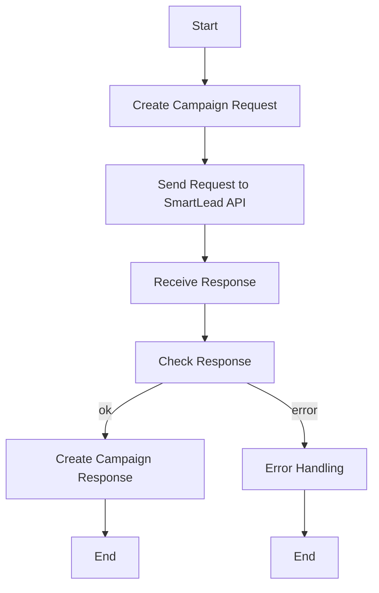

#### 带注释源码

```python
@staticmethod
async def create_campaign(
    name: str, credentials: SmartLeadCredentials
) -> CreateCampaignResponse:
    client = SmartLeadClient(credentials.api_key.get_secret_value())
    return await client.create_campaign(CreateCampaignRequest(name=name))
```


### `AddLeadToCampaignBlock.add_leads_to_campaign`

Add leads to a campaign in SmartLead.

参数：

- `campaign_id`：`int`，The ID of the campaign to add the lead to.
- `lead_list`：`list[LeadInput]`，An array of JSON objects, each representing a lead's details. Can hold max 100 leads.
- `credentials`：`SmartLeadCredentials`，SmartLead credentials.

返回值：`AddLeadsToCampaignResponse`，Response from the SmartLead API indicating the result of adding leads to a campaign.

#### 流程图

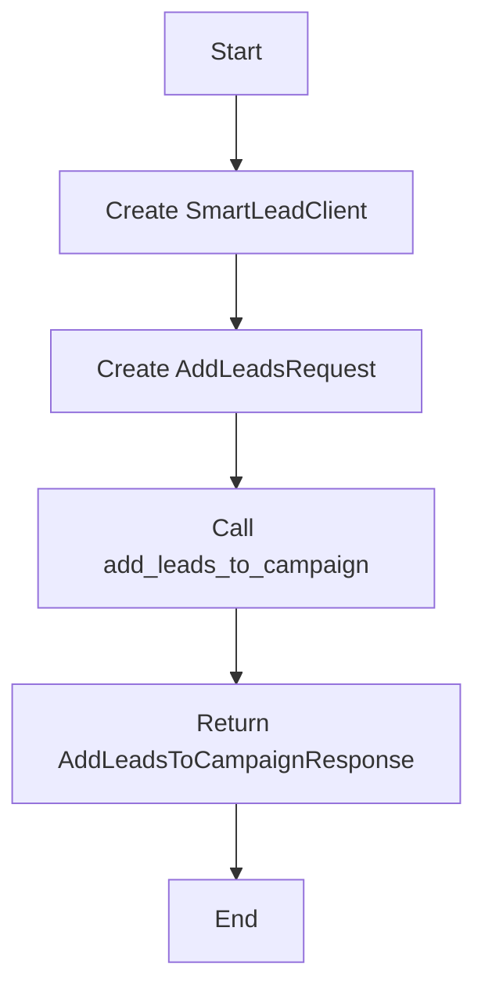

#### 带注释源码

```python
@staticmethod
async def add_leads_to_campaign(
    campaign_id: int, lead_list: list[LeadInput], credentials: SmartLeadCredentials
) -> AddLeadsToCampaignResponse:
    client = SmartLeadClient(credentials.api_key.get_secret_value())
    return await client.add_leads_to_campaign(
        AddLeadsRequest(
            campaign_id=campaign_id,
            lead_list=lead_list,
            settings=LeadUploadSettings(
                ignore_global_block_list=False,
                ignore_unsubscribe_list=False,
                ignore_community_bounce_list=False,
                ignore_duplicate_leads_in_other_campaign=False,
            ),
        ),
    )
```


### save_campaign_sequences

This function saves sequences within a campaign in SmartLead.

参数：

- `campaign_id`：`int`，The ID of the campaign to save sequences for
- `sequences`：`list[Sequence]`，The sequences to save
- `credentials`：`SmartLeadCredentials`，SmartLead credentials

返回值：`SaveSequencesResponse`，Response from the API indicating the success or failure of the operation

#### 流程图

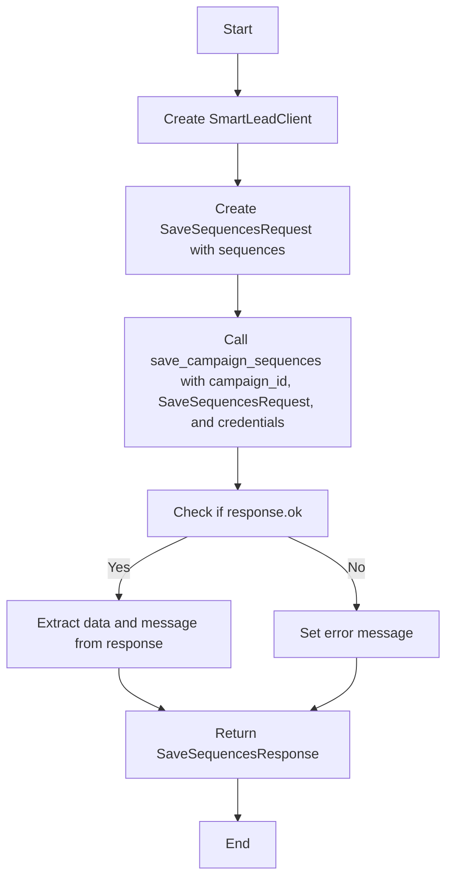

#### 带注释源码

```python
@staticmethod
async def save_campaign_sequences(
    campaign_id: int, sequences: list[Sequence], credentials: SmartLeadCredentials
) -> SaveSequencesResponse:
    client = SmartLeadClient(credentials.api_key.get_secret_value())
    return await client.save_campaign_sequences(
        campaign_id=campaign_id, request=SaveSequencesRequest(sequences=sequences)
    )
```


### `CreateCampaignBlock.__init__`

初始化 `CreateCampaignBlock` 类实例。

参数：

- `id`：`str`，块的唯一标识符。
- `description`：`str`，块的描述信息。
- `categories`：`set`，块的类别集合。
- `input_schema`：`BlockSchemaInput`，块的输入模式。
- `output_schema`：`BlockSchemaOutput`，块的输出模式。
- `test_credentials`：`SmartLeadCredentialsInput`，测试时使用的凭证。
- `test_input`：`dict`，测试时使用的输入数据。
- `test_output`：`list`，测试时预期的输出数据。
- `test_mock`：`dict`，测试时模拟的函数和返回值。

返回值：无

#### 流程图

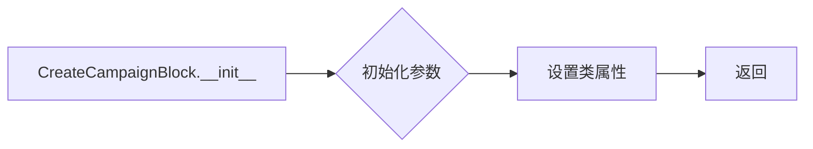

#### 带注释源码

```python
def __init__(self):
    super().__init__(
        id="8865699f-9188-43c4-89b0-79c84cfaa03e",
        description="Create a campaign in SmartLead",
        categories={BlockCategory.CRM},
        input_schema=CreateCampaignBlock.Input,
        output_schema=CreateCampaignBlock.Output,
        test_credentials=TEST_CREDENTIALS,
        test_input={"name": "Test Campaign", "credentials": TEST_CREDENTIALS_INPUT},
        test_output=[
            (
                "id",
                1,
            ),
            (
                "name",
                "Test Campaign",
            ),
            (
                "created_at",
                "2024-01-01T00:00:00Z",
            ),
        ],
        test_mock={
            "create_campaign": lambda name, credentials: CreateCampaignResponse(
                ok=True,
                id=1,
                name=name,
                created_at="2024-01-01T00:00:00Z",
            )
        },
    )
```


### CreateCampaignBlock.create_campaign

Create a campaign in SmartLead.

参数：

- `name`：`str`，The name of the campaign.
- `credentials`：`SmartLeadCredentials`，SmartLead credentials.

返回值：`CreateCampaignResponse`，Response from SmartLead API.

#### 流程图

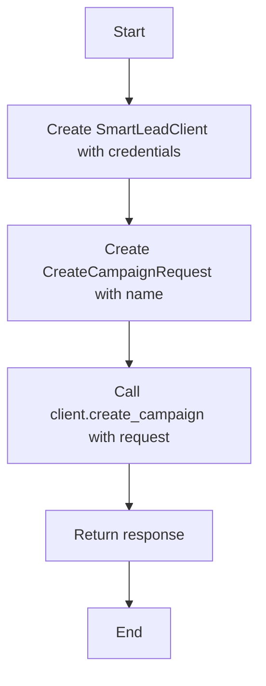

#### 带注释源码

```python
@staticmethod
async def create_campaign(
    name: str, credentials: SmartLeadCredentials
) -> CreateCampaignResponse:
    client = SmartLeadClient(credentials.api_key.get_secret_value())
    return await client.create_campaign(CreateCampaignRequest(name=name))
```


### CreateCampaignBlock.run

This method runs the campaign creation process in SmartLead.

参数：

- `input_data`：`Input`，The input data for the block, containing the campaign name and credentials.
- `credentials`：`SmartLeadCredentials`，The SmartLead credentials used to authenticate the request.

返回值：`BlockOutput`，The output data from the block, including the campaign ID, name, creation date, and any error messages.

#### 流程图

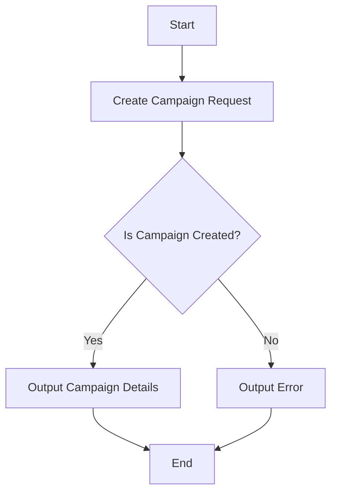

#### 带注释源码

```python
async def run(self, input_data: Input, *, credentials: SmartLeadCredentials, **kwargs) -> BlockOutput:
    response = await self.create_campaign(input_data.name, credentials)

    yield "id", response.id
    yield "name", response.name
    yield "created_at", response.created_at
    if not response.ok:
        yield "error", "Failed to create campaign"
```


### `AddLeadToCampaignBlock.__init__`

This method initializes the `AddLeadToCampaignBlock` class, setting up its configuration and schema for the SmartLead integration.

参数：

- `self`：`None`，The instance of the class being initialized.
- `id`：`str`，The unique identifier for the block.
- `description`：`str`，A brief description of the block's functionality.
- `categories`：`set`，A set of categories that the block belongs to.
- `input_schema`：`BlockSchemaInput`，The schema for the input data of the block.
- `output_schema`：`BlockSchemaOutput`，The schema for the output data of the block.
- `test_credentials`：`SmartLeadCredentialsInput`，The test credentials for the SmartLead API.
- `test_input`：`dict`，The test input data for the block.
- `test_output`：`list`，The test output data for the block.
- `test_mock`：`dict`，The test mock data for the block's methods.

返回值：`None`，No return value is specified.

#### 流程图

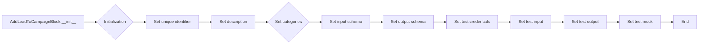

#### 带注释源码

```python
def __init__(self):
    super().__init__(
        id="fb8106a4-1a8f-42f9-a502-f6d07e6fe0ec",
        description="Add a lead to a campaign in SmartLead",
        categories={BlockCategory.CRM},
        input_schema=AddLeadToCampaignBlock.Input,
        output_schema=AddLeadToCampaignBlock.Output,
        test_credentials=TEST_CREDENTIALS,
        test_input={
            "campaign_id": 1,
            "lead_list": [],
            "credentials": TEST_CREDENTIALS_INPUT,
        },
        test_output=[
            (
                "campaign_id",
                1,
            ),
            (
                "upload_count",
                1,
            ),
        ],
        test_mock={
            "add_leads_to_campaign": lambda campaign_id, lead_list, credentials: AddLeadsToCampaignResponse(
                ok=True,
                upload_count=1,
                already_added_to_campaign=0,
                duplicate_count=0,
                invalid_email_count=0,
                is_lead_limit_exhausted=False,
                lead_import_stopped_count=0,
                error="",
                total_leads=1,
                block_count=0,
                invalid_emails=[],
                unsubscribed_leads=[],
                bounce_count=0,
            )
        },
    )
```


### AddLeadToCampaignBlock.add_leads_to_campaign

This function adds a list of leads to a specified campaign in SmartLead.

参数：

- `campaign_id`：`int`，The ID of the campaign to add the lead to.
- `lead_list`：`list[LeadInput]`，An array of JSON objects, each representing a lead's details. Can hold max 100 leads.
- `credentials`：`SmartLeadCredentials`，SmartLead credentials.

返回值：`AddLeadsToCampaignResponse`，A response object containing information about the lead addition process.

#### 流程图

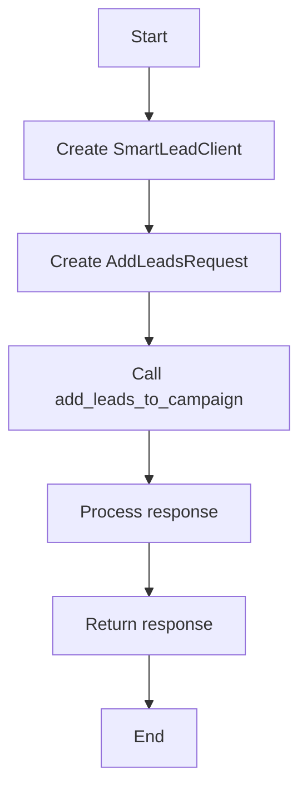

#### 带注释源码

```python
@staticmethod
async def add_leads_to_campaign(
    campaign_id: int, lead_list: list[LeadInput], credentials: SmartLeadCredentials
) -> AddLeadsToCampaignResponse:
    client = SmartLeadClient(credentials.api_key.get_secret_value())
    return await client.add_leads_to_campaign(
        AddLeadsRequest(
            campaign_id=campaign_id,
            lead_list=lead_list,
            settings=LeadUploadSettings(
                ignore_global_block_list=False,
                ignore_unsubscribe_list=False,
                ignore_community_bounce_list=False,
                ignore_duplicate_leads_in_other_campaign=False,
            ),
        ),
    )
```


### AddLeadToCampaignBlock.run

This method adds a lead to a specified campaign in SmartLead.

参数：

- `input_data`：`Input`，The input data for the block, containing the campaign ID, lead list, settings, and credentials.
- `credentials`：`SmartLeadCredentials`，The SmartLead credentials used to authenticate the request.

返回值：`BlockOutput`，The output data from the block, including the campaign ID, upload count, and any errors.

#### 流程图

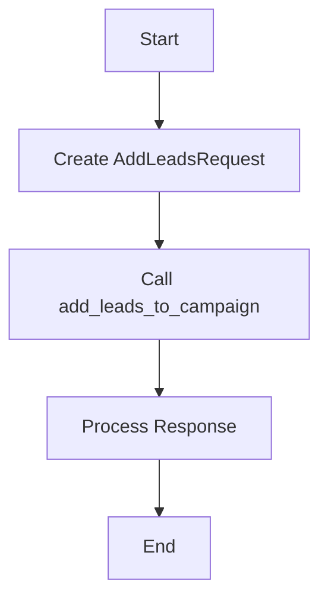

#### 带注释源码

```python
async def run(
    self,
    input_data: Input,
    *,
    credentials: SmartLeadCredentials,
    **kwargs,
) -> BlockOutput:
    response = await self.add_leads_to_campaign(
        input_data.campaign_id, input_data.lead_list, credentials
    )

    yield "campaign_id", input_data.campaign_id
    yield "upload_count", response.upload_count
    if response.already_added_to_campaign:
        yield "already_added_to_campaign", response.already_added_to_campaign
    if response.duplicate_count:
        yield "duplicate_count", response.duplicate_count
    if response.invalid_email_count:
        yield "invalid_email_count", response.invalid_email_count
    if response.is_lead_limit_exhausted:
        yield "is_lead_limit_exhausted", response.is_lead_limit_exhausted
    if response.lead_import_stopped_count:
        yield "lead_import_stopped_count", response.lead_import_stopped_count
    if response.error:
        yield "error", response.error
    if not response.ok:
        yield "error", "Failed to add leads to campaign"
```


### `SaveCampaignSequencesBlock.__init__`

初始化 `SaveCampaignSequencesBlock` 类实例。

参数：

- `self`：`SaveCampaignSequencesBlock` 类的实例
- `id`：`str`，块的唯一标识符
- `description`：`str`，块的描述信息
- `categories`：`set`，块的类别集合
- `input_schema`：`BlockSchemaInput`，块的输入模式
- `output_schema`：`BlockSchemaOutput`，块的输出模式
- `test_credentials`：`SmartLeadCredentialsInput`，测试时使用的凭证
- `test_input`：`dict`，测试输入数据
- `test_output`：`list`，测试输出数据
- `test_mock`：`dict`，测试模拟数据

返回值：无

#### 流程图

```mermaid
classDiagram
    SaveCampaignSequencesBlock <|-- Block
    SaveCampaignSequencesBlock {
        id
        description
        categories
        input_schema
        output_schema
        test_credentials
        test_input
        test_output
        test_mock
    }
```

#### 带注释源码

```python
def __init__(self):
    super().__init__(
        id="e7d9f41c-dc10-4f39-98ba-a432abd128c0",
        description="Save sequences within a campaign",
        categories={BlockCategory.CRM},
        input_schema=SaveCampaignSequencesBlock.Input,
        output_schema=SaveCampaignSequencesBlock.Output,
        test_credentials=TEST_CREDENTIALS,
        test_input={
            "campaign_id": 1,
            "sequences": [],
            "credentials": TEST_CREDENTIALS_INPUT,
        },
        test_output=[
            (
                "message",
                "Sequences saved successfully",
            ),
        ],
        test_mock={
            "save_campaign_sequences": lambda campaign_id, sequences, credentials: SaveSequencesResponse(
                ok=True,
                message="Sequences saved successfully",
            )
        },
    )
```


### SaveCampaignSequencesBlock.save_campaign_sequences

This function saves sequences within a campaign in SmartLead.

参数：

- `campaign_id`：`int`，The ID of the campaign to save sequences for
- `sequences`：`list[Sequence]`，The sequences to save
- `credentials`：`SmartLeadCredentials`，SmartLead credentials

返回值：`SaveSequencesResponse`，Data from the API

#### 流程图

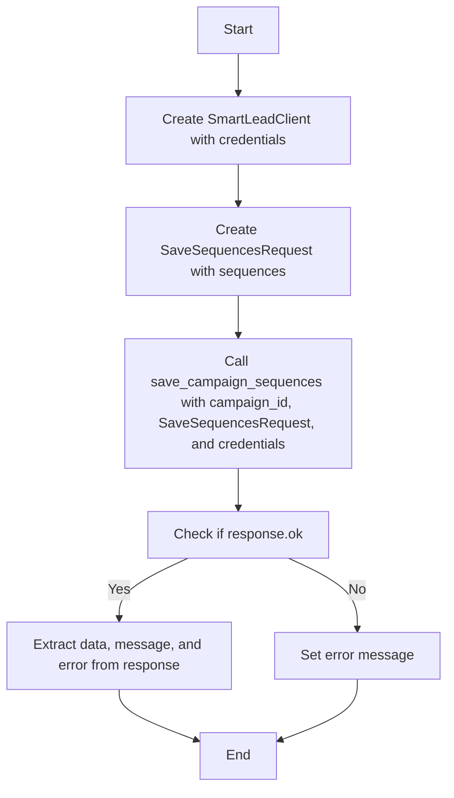

#### 带注释源码

```python
@staticmethod
async def save_campaign_sequences(
    campaign_id: int, sequences: list[Sequence], credentials: SmartLeadCredentials
) -> SaveSequencesResponse:
    client = SmartLeadClient(credentials.api_key.get_secret_value())
    return await client.save_campaign_sequences(
        campaign_id=campaign_id, request=SaveSequencesRequest(sequences=sequences)
    )
```


### SaveCampaignSequencesBlock.run

This method saves sequences within a campaign using the SmartLead API.

参数：

- `input_data`：`Input`，The input data for the block, containing the campaign ID, sequences, and credentials.
- `credentials`：`SmartLeadCredentials`，The SmartLead credentials used to authenticate the API request.

返回值：`BlockOutput`，The output data from the block, containing the API response data, message, and error message if applicable.

#### 流程图

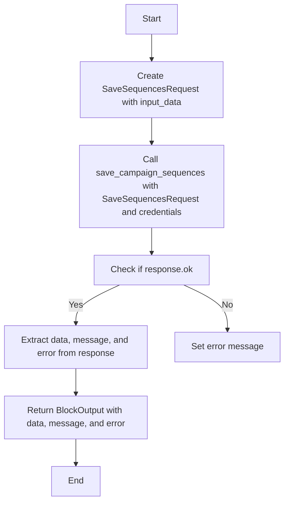

#### 带注释源码

```python
async def run(
    self,
    input_data: Input,
    *,
    credentials: SmartLeadCredentials,
    **kwargs,
) -> BlockOutput:
    response = await self.save_campaign_sequences(
        input_data.campaign_id, input_data.sequences, credentials
    )

    if response.data:
        yield "data", response.data
    if response.message:
        yield "message", response.message
    if response.error:
        yield "error", response.error
    if not response.ok:
        yield "error", "Failed to save sequences"
```


## 关键组件


### 张量索引与惰性加载

张量索引与惰性加载是代码中用于高效处理大型数据集的关键组件。它允许在需要时才加载数据，从而减少内存消耗并提高性能。

### 反量化支持

反量化支持是代码中用于处理量化数据的关键组件。它允许在量化过程中进行反向操作，以便在需要时恢复原始数据。

### 量化策略

量化策略是代码中用于优化数据表示和存储的关键组件。它通过减少数据精度来减少内存和计算需求，同时保持足够的准确性。


## 问题及建议


### 已知问题

-   **全局变量和函数的复用性低**：代码中存在多个全局变量和函数，如 `SmartLeadClient`、`SmartLeadCredentials`、`SmartLeadCredentialsInput` 等，这些在多个类中被重复引用，导致代码冗余和维护困难。
-   **异常处理不足**：代码中在异步函数中使用了 `await`，但没有对可能出现的异常进行处理，这可能导致程序在遇到错误时无法正确响应。
-   **代码注释缺失**：代码中缺少必要的注释，使得代码的可读性和可维护性降低。

### 优化建议

-   **提取公共函数和变量**：将重复使用的全局变量和函数提取到单独的模块或类中，提高代码的复用性和可维护性。
-   **增加异常处理**：在异步函数中添加异常处理逻辑，确保程序在遇到错误时能够给出明确的错误信息，并采取相应的措施。
-   **添加代码注释**：在代码中添加必要的注释，解释代码的功能和实现细节，提高代码的可读性和可维护性。
-   **使用更清晰的命名规范**：对类、方法和变量使用更清晰、更具描述性的命名，提高代码的可读性。
-   **考虑使用异步编程的最佳实践**：例如，使用 `asyncio` 库提供的 `run_until_complete` 方法来运行异步任务，确保异步任务能够正确执行。
-   **优化数据结构**：例如，对于 `lead_list` 和 `sequences` 这样的列表，可以考虑使用更高效的数据结构，如 `set` 或 `dict`，以提高代码的执行效率。
-   **进行单元测试**：为代码编写单元测试，确保代码的正确性和稳定性。


## 其它


### 设计目标与约束

- 设计目标：
  - 实现与SmartLead平台的集成，允许用户创建、添加线索和保存序列。
  - 提供一个模块化的架构，便于扩展和维护。
  - 确保代码的可读性和可维护性。
- 约束：
  - 必须使用SmartLead提供的API进行操作。
  - 输入数据必须符合SmartLead的格式要求。
  - 代码必须处理API调用失败的情况。

### 错误处理与异常设计

- 错误处理：
  - 在API调用失败时，捕获异常并返回错误信息。
  - 在数据验证失败时，返回相应的错误信息。
- 异常设计：
  - 定义自定义异常类，用于处理特定错误情况。
  - 使用try-except块捕获和处理异常。

### 数据流与状态机

- 数据流：
  - 用户输入数据通过输入接口传递到相应的处理函数。
  - 处理函数将数据发送到SmartLead API。
  - API响应返回到处理函数，然后传递回用户。
- 状态机：
  - 每个处理函数根据输入数据和API响应执行特定的操作。
  - 状态机用于跟踪处理函数的状态，例如“正在执行”、“完成”或“失败”。

### 外部依赖与接口契约

- 外部依赖：
  - SmartLead API。
  - 数据库（如果需要存储数据）。
- 接口契约：
  - 定义SmartLead API的接口和参数。
  - 定义内部API的接口和参数，以便其他模块可以与这些模块交互。


    