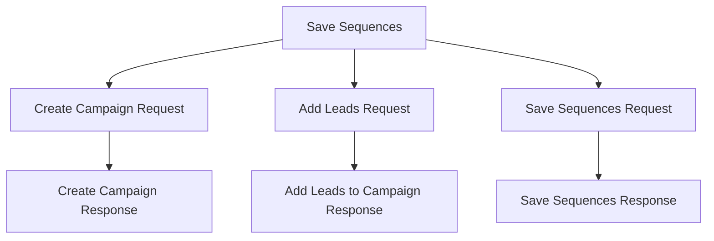

# `.\AutoGPT\autogpt_platform\backend\backend\blocks\smartlead\models.py` 详细设计文档

This code defines a set of data models for managing campaigns, leads, and sequences in a marketing context. It includes request and response models for creating campaigns, adding leads, and managing sequences.

## 整体流程



## 类结构

```
CreateCampaignResponse
CreateCampaignRequest
AddLeadsToCampaignResponse
LeadCustomFields
LeadInput
LeadUploadSettings
AddLeadsRequest
VariantDistributionType
WinningMetricProperty
SequenceDelayDetails
SequenceVariant
Sequence
SaveSequencesRequest
SaveSequencesResponse
```

## 全局变量及字段


### `CreateCampaignResponse.ok`
    
Indicates whether the campaign creation was successful.

类型：`bool`
    


### `CreateCampaignResponse.id`
    
The unique identifier of the created campaign.

类型：`int`
    


### `CreateCampaignResponse.name`
    
The name of the created campaign.

类型：`str`
    


### `CreateCampaignResponse.created_at`
    
The timestamp when the campaign was created.

类型：`str`
    


### `CreateCampaignRequest.name`
    
The name of the campaign to be created.

类型：`str`
    


### `CreateCampaignRequest.client_id`
    
The client ID associated with the campaign, if any.

类型：`str | None`
    


### `AddLeadsToCampaignResponse.ok`
    
Indicates whether the lead addition to the campaign was successful.

类型：`bool`
    


### `AddLeadsToCampaignResponse.upload_count`
    
The number of leads successfully uploaded to the campaign.

类型：`int`
    


### `AddLeadsToCampaignResponse.total_leads`
    
The total number of leads in the upload.

类型：`int`
    


### `AddLeadsToCampaignResponse.block_count`
    
The number of leads blocked due to the global block list.

类型：`int`
    


### `AddLeadsToCampaignResponse.duplicate_count`
    
The number of duplicate leads detected.

类型：`int`
    


### `AddLeadsToCampaignResponse.invalid_email_count`
    
The number of leads with invalid email addresses.

类型：`int`
    


### `AddLeadsToCampaignResponse.invalid_emails`
    
The list of invalid email addresses detected.

类型：`list[str]`
    


### `AddLeadsToCampaignResponse.already_added_to_campaign`
    
The number of leads already added to the campaign.

类型：`int`
    


### `AddLeadsToCampaignResponse.unsubscribed_leads`
    
The list of leads who have unsubscribed.

类型：`list[str]`
    


### `AddLeadsToCampaignResponse.is_lead_limit_exhausted`
    
Indicates whether the lead limit for the campaign has been exhausted.

类型：`bool`
    


### `AddLeadsToCampaignResponse.lead_import_stopped_count`
    
The number of times the lead import was stopped.

类型：`int`
    


### `AddLeadsToCampaignResponse.bounce_count`
    
The number of leads that bounced.

类型：`int`
    


### `AddLeadsToCampaignResponse.error`
    
The error message, if any.

类型：`str | None`
    


### `LeadCustomFields.fields`
    
Custom fields for a lead (max 20 fields).

类型：`dict[str, str]`
    


### `LeadInput.first_name`
    
The first name of the lead.

类型：`str`
    


### `LeadInput.last_name`
    
The last name of the lead.

类型：`str`
    


### `LeadInput.email`
    
The email address of the lead.

类型：`str`
    


### `LeadInput.phone_number`
    
The phone number of the lead, if any.

类型：`str | None`
    


### `LeadInput.company_name`
    
The company name of the lead, if any.

类型：`str | None`
    


### `LeadInput.website`
    
The website of the lead, if any.

类型：`str | None`
    


### `LeadInput.location`
    
The location of the lead, if any.

类型：`str | None`
    


### `LeadInput.custom_fields`
    
Custom fields for the lead, if any.

类型：`LeadCustomFields | None`
    


### `LeadInput.linkedin_profile`
    
The LinkedIn profile of the lead, if any.

类型：`str | None`
    


### `LeadInput.company_url`
    
The company URL of the lead, if any.

类型：`str | None`
    


### `LeadUploadSettings.ignore_global_block_list`
    
Indicates whether to ignore the global block list.

类型：`bool`
    


### `LeadUploadSettings.ignore_unsubscribe_list`
    
Indicates whether to ignore the unsubscribe list.

类型：`bool`
    


### `LeadUploadSettings.ignore_community_bounce_list`
    
Indicates whether to ignore the community bounce list.

类型：`bool`
    


### `LeadUploadSettings.ignore_duplicate_leads_in_other_campaign`
    
Indicates whether to ignore duplicate leads in other campaigns.

类型：`bool`
    


### `AddLeadsRequest.lead_list`
    
The list of leads to add to the campaign.

类型：`list[LeadInput]`
    


### `AddLeadsRequest.settings`
    
The settings for lead upload.

类型：`LeadUploadSettings`
    


### `AddLeadsRequest.campaign_id`
    
The ID of the campaign to which the leads are to be added.

类型：`int`
    


### `SequenceDelayDetails.delay_in_days`
    
The number of days to delay the sequence.

类型：`int`
    


### `SequenceVariant.subject`
    
The subject of the email variant.

类型：`str`
    


### `SequenceVariant.email_body`
    
The email body of the variant.

类型：`str`
    


### `SequenceVariant.variant_label`
    
The label for the variant.

类型：`str`
    


### `SequenceVariant.id`
    
The unique identifier of the variant, if any.

类型：`int | None`
    


### `SequenceVariant.variant_distribution_percentage`
    
The percentage distribution of the variant, if any.

类型：`int | None`
    


### `Sequence.seq_number`
    
The sequence number of the email sequence.

类型：`int`
    


### `Sequence.seq_delay_details`
    
The delay details for the sequence.

类型：`SequenceDelayDetails`
    


### `Sequence.id`
    
The unique identifier of the sequence, if any.

类型：`int | None`
    


### `Sequence.variant_distribution_type`
    
The type of variant distribution for the sequence, if any.

类型：`VariantDistributionType | None`
    


### `Sequence.lead_distribution_percentage`
    
The percentage distribution of leads in the sequence.

类型：`int`
    


### `Sequence.winning_metric_property`
    
The winning metric property for the sequence, if any.

类型：`WinningMetricProperty | None`
    


### `Sequence.seq_variants`
    
The list of variants for the sequence, if any.

类型：`list[SequenceVariant] | None`
    


### `Sequence.subject`
    
The subject of the sequence, if not blank.

类型：`str`
    


### `Sequence.email_body`
    
The email body of the sequence, if any.

类型：`str | None`
    


### `SaveSequencesRequest.sequences`
    
The list of sequences to save.

类型：`list[Sequence]`
    


### `SaveSequencesResponse.ok`
    
Indicates whether the sequence saving was successful.

类型：`bool`
    


### `SaveSequencesResponse.message`
    
The message from the API.

类型：`str`
    


### `SaveSequencesResponse.data`
    
The data from the API, if any.

类型：`dict | str | None`
    


### `SaveSequencesResponse.error`
    
The error message, if any.

类型：`str | None`
    
    

## 全局函数及方法


## 关键组件


### 张量索引与惰性加载

张量索引与惰性加载是用于高效处理大规模数据集的关键组件，它允许在数据被实际需要时才进行加载和处理，从而减少内存消耗和提高性能。

### 反量化支持

反量化支持是用于优化模型性能的关键组件，它允许模型在量化过程中保持精度，从而提高模型的运行速度和降低资源消耗。

### 量化策略

量化策略是用于优化模型性能的关键组件，它通过将模型的权重和激活值从浮点数转换为低精度整数来减少模型的存储和计算需求，从而提高模型的运行速度和降低资源消耗。


## 问题及建议


### 已知问题

-   **数据验证**: 代码中使用了 `pydantic` 进行数据验证，但未明确说明如何处理不符合验证规则的数据。例如，如果 `LeadInput` 中的 `email` 字段不符合电子邮件格式，应该如何处理？
-   **错误处理**: 代码中未明确说明错误处理机制。例如，如果数据库操作失败，应该如何通知调用者？
-   **性能**: 对于大型数据集，例如 `lead_list`，可能需要考虑性能优化，例如分批处理或使用更高效的数据结构。
-   **代码重复**: `LeadCustomFields` 和 `LeadUploadSettings` 类中使用了重复的 `SchemaField`，可以考虑提取为单独的类或函数以减少代码重复。

### 优化建议

-   **数据验证**: 实现一个统一的错误处理机制，当数据验证失败时，返回具体的错误信息。
-   **错误处理**: 添加全局异常处理，确保在发生错误时能够捕获并处理异常，同时向调用者返回清晰的错误信息。
-   **性能**: 对于大型数据集，考虑使用异步处理或数据库分页技术来提高性能。
-   **代码重复**: 将 `SchemaField` 提取为单独的类或函数，并在 `LeadCustomFields` 和 `LeadUploadSettings` 中使用它，以减少代码重复并提高可维护性。
-   **文档**: 为每个类和方法添加详细的文档注释，包括参数描述、返回值描述和异常情况。
-   **单元测试**: 编写单元测试以确保代码的稳定性和可维护性。


## 其它


### 设计目标与约束

- 设计目标：
  - 提供一个模块化且可扩展的营销活动管理平台。
  - 支持创建、管理、编辑和删除营销活动。
  - 支持添加和编辑营销活动的参与者（潜在客户）。
  - 支持自定义营销活动的序列和变体。
  - 确保数据的一致性和完整性。

- 约束：
  - 营销活动参与者数据需符合特定格式和验证规则。
  - 营销活动序列和变体需符合特定的业务逻辑和性能要求。
  - 系统需具备良好的可扩展性和可维护性。

### 错误处理与异常设计

- 错误处理：
  - 使用统一的错误处理机制，确保所有错误都能被捕获并返回给用户。
  - 定义清晰的错误代码和错误信息，方便用户理解错误原因。

- 异常设计：
  - 对于可能出现的异常情况，如数据格式错误、网络问题等，应设计相应的异常处理机制。
  - 异常处理应包括错误日志记录和用户通知。

### 数据流与状态机

- 数据流：
  - 用户请求创建营销活动，系统接收请求并处理。
  - 系统根据请求生成营销活动，并返回响应。
  - 用户可以添加参与者、编辑序列和变体等。

- 状态机：
  - 营销活动可能处于不同的状态，如创建中、激活、暂停等。
  - 系统根据业务逻辑和用户操作，在状态之间进行转换。

### 外部依赖与接口契约

- 外部依赖：
  - 系统可能依赖于数据库、缓存、第三方服务等。
  - 需要确保外部依赖的稳定性和可靠性。

- 接口契约：
  - 定义清晰的接口规范，包括输入参数、输出参数和错误代码。
  - 确保接口的一致性和兼容性。


    