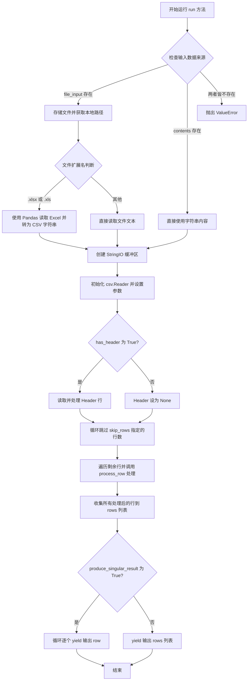
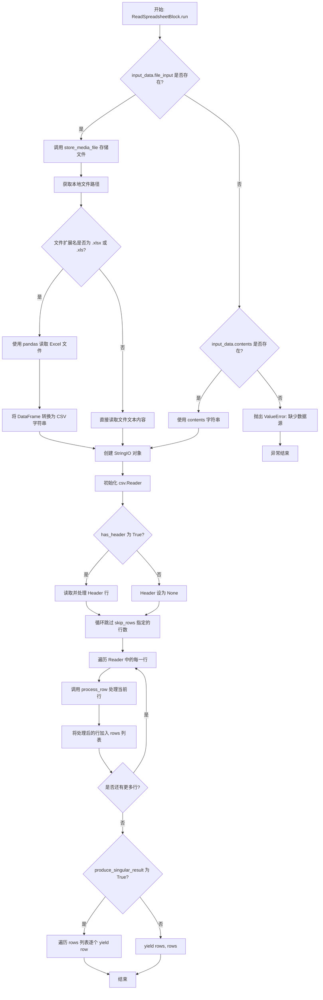

# `AutoGPT\autogpt_platform\backend\backend\blocks\spreadsheet.py` 详细设计文档

该代码实现了一个名为 ReadSpreadsheetBlock 的数据处理组件，旨在读取 CSV 或 Excel 文件（或原始文本内容），允许用户配置分隔符、引号字符及跳过逻辑，并将解析后的数据作为字典列表或单独的行字典输出。

## 整体流程



## 类结构

```
ReadSpreadsheetBlock
├── Input
└── Output
```

## 全局变量及字段


### `ReadSpreadsheetBlock.Input.contents`
    
The contents of the CSV/spreadsheet data to read

类型：`str | None`
    


### `ReadSpreadsheetBlock.Input.file_input`
    
CSV or Excel file to read from (URL, data URI, or local path). Excel files are automatically converted to CSV

类型：`MediaFileType | None`
    


### `ReadSpreadsheetBlock.Input.delimiter`
    
The delimiter used in the CSV/spreadsheet data

类型：`str`
    


### `ReadSpreadsheetBlock.Input.quotechar`
    
The character used to quote fields

类型：`str`
    


### `ReadSpreadsheetBlock.Input.escapechar`
    
The character used to escape the delimiter

类型：`str`
    


### `ReadSpreadsheetBlock.Input.has_header`
    
Whether the CSV file has a header row

类型：`bool`
    


### `ReadSpreadsheetBlock.Input.skip_rows`
    
The number of rows to skip from the start of the file

类型：`int`
    


### `ReadSpreadsheetBlock.Input.strip`
    
Whether to strip whitespace from the values

类型：`bool`
    


### `ReadSpreadsheetBlock.Input.skip_columns`
    
The columns to skip from the start of the row

类型：`list[str]`
    


### `ReadSpreadsheetBlock.Input.produce_singular_result`
    
If True, yield individual 'row' outputs only (can be slow). If False, yield both 'rows' (all data)

类型：`bool`
    


### `ReadSpreadsheetBlock.Output.row`
    
The data produced from each row in the spreadsheet

类型：`dict[str, str]`
    


### `ReadSpreadsheetBlock.Output.rows`
    
All the data in the spreadsheet as a list of rows

类型：`list[dict[str, str]]`
    
    

## 全局函数及方法


### `ReadSpreadsheetBlock.__init__`

该方法用于初始化 `ReadSpreadsheetBlock` 类的实例。它主要负责定义块的基本元数据（如唯一ID、描述、贡献者和分类），并指定其输入输出模式结构，同时配置用于验证功能的测试输入和预期输出，最后通过调用父类 `Block` 的构造函数完成注册。

参数：

-  `self`：`ReadSpreadsheetBlock`，类的实例本身

返回值：`None`，无返回值

#### 流程图

```mermaid
flowchart TD
    A[开始: ReadSpreadsheetBlock.__init__] --> B[定义块元数据与配置]
    B --> C[设置唯一标识符 ID]
    B --> D[关联输入模式 Input]
    B --> E[关联输出模式 Output]
    B --> F[设置描述与贡献者信息]
    B --> G[设置功能分类 TEXT 与 DATA]
    B --> H[配置测试输入与输出用例]
    C & D & E & F & G & H --> I[调用 super().__init__ 初始化父类]
    I --> J[结束: 返回 None]
```

#### 带注释源码

```python
def __init__(self):
    # 调用父类 Block 的初始化方法，注册当前块的配置信息
    super().__init__(
        # 块的唯一标识符
        id="acf7625e-d2cb-4941-bfeb-2819fc6fc015",
        # 指定输入数据模式，使用内部类 Input 定义
        input_schema=ReadSpreadsheetBlock.Input,
        # 指定输出数据模式，使用内部类 Output 定义
        output_schema=ReadSpreadsheetBlock.Output,
        # 块的功能描述，说明其读取 CSV/Excel 文件并输出的能力
        description="Reads CSV and Excel files and outputs the data as a list of dictionaries and individual rows. Excel files are automatically converted to CSV format.",
        # 贡献者列表
        contributors=[ContributorDetails(name="Nicholas Tindle")],
        # 块所属的业务分类，包含文本和数据
        categories={BlockCategory.TEXT, BlockCategory.DATA},
        # 定义测试用例输入，用于验证块的功能
        test_input=[
            {
                "contents": "a, b, c\n1,2,3\n4,5,6",
                "produce_singular_result": False,
            },
            {
                "contents": "a, b, c\n1,2,3\n4,5,6",
                "produce_singular_result": True,
            },
        ],
        # 定义对应的预期测试输出
        test_output=[
            (
                "rows",
                [
                    {"a": "1", "b": "2", "c": "3"},
                    {"a": "4", "b": "5", "c": "6"},
                ],
            ),
            ("row", {"a": "1", "b": "2", "c": "3"}),
            ("row", {"a": "4", "b": "5", "c": "6"}),
        ],
    )
```


### `ReadSpreadsheetBlock.run`

执行读取 CSV 或 Excel 文件的核心逻辑。该方法优先处理文件输入（支持 Excel 自动转 CSV），若无文件则处理直接字符串内容，并根据配置解析 CSV 数据，最终将数据以行列表或单行流的形式输出。

参数：

-   `input_data`：`Input`，包含数据源（contents 或 file_input）及解析配置（如分隔符、引号符、是否跳过行等）的输入数据对象。
-   `execution_context`：`ExecutionContext`，执行上下文，用于处理文件存储路径和获取执行环境信息。
-   `_kwargs`：`dict`，额外的关键字参数（当前未使用）。

返回值：`BlockOutput`，一个异步生成器，用于产出命名输出。根据配置产出单个行数据（key 为 "row"）或整个行列表（key 为 "rows"）。

#### 流程图



#### 带注释源码

```python
    async def run(
        self, input_data: Input, *, execution_context: ExecutionContext, **_kwargs
    ) -> BlockOutput:
        import csv
        from io import StringIO

        # --- 数据源确定阶段 ---
        # 优先级：file_input > contents
        if input_data.file_input:
            # 1. 将上传的文件存储到本地可处理的路径
            stored_file_path = await store_media_file(
                file=input_data.file_input,
                execution_context=execution_context,
                return_format="for_local_processing",
            )

            # 2. 获取完整的物理文件路径
            assert execution_context.graph_exec_id  # Validated by store_media_file
            file_path = get_exec_file_path(
                execution_context.graph_exec_id, stored_file_path
            )
            if not Path(file_path).exists():
                raise ValueError(f"File does not exist: {file_path}")

            # 3. 检查文件类型并进行格式转换
            file_extension = Path(file_path).suffix.lower()

            if file_extension in [".xlsx", ".xls"]:
                # 处理 Excel 文件：转换为 CSV 字符串
                try:
                    from io import StringIO

                    import pandas as pd

                    # 读取 Excel
                    df = pd.read_excel(file_path)

                    # 转换为 CSV 格式并存储在内存缓冲区
                    csv_buffer = StringIO()
                    df.to_csv(csv_buffer, index=False)
                    csv_content = csv_buffer.getvalue()

                except ImportError:
                    raise ValueError(
                        "pandas library is required to read Excel files. Please install it."
                    )
                except Exception as e:
                    raise ValueError(f"Unable to read Excel file: {e}")
            else:
                # 处理普通 CSV/文本文件：直接读取文本
                csv_content = Path(file_path).read_text(encoding="utf-8")
        elif input_data.contents:
            # 如果没有文件输入，直接使用提供的字符串内容
            csv_content = input_data.contents
        else:
            raise ValueError("Either 'contents' or 'file_input' must be provided")

        # --- CSV 解析阶段 ---
        # 使用 StringIO 将字符串包装成文件对象供 csv 模块读取
        csv_file = StringIO(csv_content)
        reader = csv.reader(
            csv_file,
            delimiter=input_data.delimiter,
            quotechar=input_data.quotechar,
            escapechar=input_data.escapechar,
        )

        # --- Header 处理 ---
        header = None
        if input_data.has_header:
            # 读取第一行作为 Header
            header = next(reader)
            if input_data.strip:
                # 如果配置了去除空格，处理 Header 字段
                header = [h.strip() for h in header]

        # --- 跳过行 ---
        # 循环跳过配置中指定的行数
        for _ in range(input_data.skip_rows):
            next(reader)

        # --- 行数据处理辅助函数 ---
        def process_row(row):
            data = {}
            for i, value in enumerate(row):
                # 检查当前列索引是否在跳过列表中
                if i not in input_data.skip_columns:
                    # 处理值：根据是否有 Header 决定 Key 的来源，并根据 strip 配置决定是否去除空格
                    if input_data.has_header and header:
                        data[header[i]] = value.strip() if input_data.strip else value
                    else:
                        data[str(i)] = value.strip() if input_data.strip else value
            return data

        # 批量处理所有行
        rows = [process_row(row) for row in reader]

        # --- 结果输出阶段 ---
        if input_data.produce_singular_result:
            # 模式 A：逐行输出 (流式)
            for processed_row in rows:
                yield "row", processed_row
        else:
            # 模式 B：输出整个列表 (批量)
            yield "rows", rows
```


## 关键组件


### 多源数据读取器

支持从原始字符串内容或多种文件路径（包括 URL、Data URI 和本地路径）读取数据，并将其统一处理为可解析的文本流。

### Excel 自动转换器

识别 Excel 文件格式（如 .xlsx, .xls），利用 pandas 库将其自动转换为 CSV 格式的字符串流，以实现格式的标准化处理。

### 可配置 CSV 解析器

基于用户自定义的分隔符、引号符和转义符等参数，使用 Python 标准库 csv 模块将文本数据流解析为结构化的行数据。

### 数据清洗与过滤管道

处理表头解析、跳过指定行数、排除特定列以及去除字段两端空格等逻辑，将原始行数据转换为结构化的字典列表。

### 动态输出生成器

根据配置标志决定输出模式，既支持流式输出单行数据，也支持一次性输出完整的行数据列表。


## 问题及建议


### 已知问题

-   **`skip_columns` 逻辑错误**：输入字段 `skip_columns` 定义为 `list[str]`（通常指列名），但在代码逻辑中 `if i not in input_data.skip_columns` 里 `i` 是整数索引。将整数与字符串列表进行比较会导致永远无法匹配，使得该功能失效，无法按预期跳过列。
-   **内存占用过高风险**：代码使用列表推导式 `rows = [process_row(row) for row in reader]` 一次性将所有行加载到内存中。当处理大型 CSV 或 Excel 文件时，这极易导致内存溢出（OOM），尤其是在用户只需要流式处理（`produce_singular_result=True`）的情况下，依然先全量加载了数据。
-   **Excel 处理效率低下**：在处理 Excel 文件时，代码使用 `pandas` 将整个文件读取为 DataFrame，再转换为 CSV 字符串，最后再次解析 CSV 字符串。这种"Excel -> 内存对象 -> CSV 字符串 -> CSV Reader"的流程不仅增加了 CPU 消耗，还双倍浪费了内存（DataFrame 和 CSV 字符串同时存在）。
-   **硬编码的文件编码**：代码在读取文件时硬编码了 `encoding="utf-8"`。如果用户上传的是 GBK、ISO-8859-1 等其他编码的文件，程序将抛出解码错误。
-   **缺少空文件处理**：当 `has_header` 为 `True` 但文件内容为空时，调用 `next(reader)` 会抛出 `StopIteration` 异常，未被捕获，导致程序崩溃。

### 优化建议

-   **实现流式处理**：当 `produce_singular_result` 为 `True` 时，应直接在读取 CSV 的循环中逐行 `yield` 结果，而不是先构建完整的 `rows` 列表。这样可以显著降低大文件处理时的内存消耗。
-   **修正 `skip_columns` 逻辑**：明确设计意图。如果支持按列名跳过，应在处理 Header 后建立列名到索引的映射；如果支持按索引跳过，应将 Input Schema 中的类型改为 `list[int]`。推荐实现按列名跳过，因为这对用户更友好。
-   **优化 Excel 读取路径**：如果必须使用 `pandas`，可以直接遍历 DataFrame (`df.iterrows()` 或 `df.to_dict('records')`) 生成数据，避免转换为 CSV 字符串再重新解析的开销。或者考虑使用 `openpyxl` 等库进行更轻量级的流式读取。
-   **增加编码参数支持**：在 `Input` 类中添加 `encoding: str` 字段，允许用户指定文件编码（默认为 "utf-8"），并在 `Path.read_text()` 和 `pd.read_excel()` 中应用该参数。
-   **增强异常处理**：在读取 Header 前，检查迭代器是否为空，或者捕获 `StopIteration` 异常，返回更友好的空数据提示或错误日志，而不是直接导致运行失败。
-   **移除重复导入**：`run` 方法中 `from io import StringIO` 出现了两次（开头和 Excel 处理块内），应清理冗余导入。


## 其它


### 设计目标与约束

**设计目标：**
1.  **多格式支持**：旨在提供统一的接口来读取 CSV 和 Excel (.xlsx, .xls) 文件，自动处理格式转换，将 Excel 视为 CSV 数据源。
2.  **灵活的数据清洗**：允许用户配置分隔符、引号字符、转义字符、是否去除空白、跳过行和列等，以适应不同格式的 CSV 文件。
3.  **双模输出**：提供两种输出模式，既可以一次性输出完整的数据列表（适合后续聚合处理），也可以逐行输出（适合流式处理）。

**设计约束：**
1.  **内存占用**：当前实现会将所有解析后的行加载到内存中的 `rows` 列表中。即使设置了 `produce_singular_result` 为 True，也是在完全读取并处理完所有数据后才进行迭代。因此，处理超大文件时可能会消耗大量内存。
2.  **Excel 处理依赖**：处理 Excel 文件依赖于运行时环境中安装了 `pandas` 库。如果未安装，模块会抛出 ValueError 而非优雅降级。
3.  **数据类型保留**：解析后的所有值均被视为字符串（`dict[str, str]`），不会自动推断数字、日期等类型，需由后续节点处理。
4.  **文件存在性**：依赖 `ExecutionContext` 提供的 `graph_exec_id` 来定位文件路径，且必须确保文件已成功存储在本地。

### 错误处理与异常设计

**异常处理策略：**
代码采用“快速失败”策略，在遇到输入验证失败或依赖缺失时立即抛出异常，终止执行。

**主要异常场景：**
1.  **输入缺失**：当 `contents` 和 `file_input` 均为 None 时，抛出 `ValueError("Either 'contents' or 'file_input' must be provided")`。
2.  **文件不存在**：当通过 `get_exec_file_path` 获取的路径在文件系统中不存在时，抛出 `ValueError(f"File does not exist: {file_path}")`。
3.  **依赖库缺失**：当文件类型为 Excel 但环境未安装 `pandas` 时，捕获 `ImportError` 并抛出 `ValueError("pandas library is required...")`。
4.  **文件读取失败**：当 `pandas` 无法读取 Excel 文件（如文件损坏）时，捕获通用异常并抛出 `ValueError(f"Unable to read Excel file: {e}")`。

**异常传播：**
所有异常均通过 `async def run` 方法向上传播至执行引擎，由上层框架负责记录日志和处理任务失败状态。

### 数据流与状态机

**数据流：**
1.  **输入阶段**：接收原始输入数据（字符串内容或文件标识）。
2.  **获取与转换阶段**：
    *   如果是文件：通过 `store_media_file` 存储并获取本地路径 -> 判断扩展名 -> 若为 Excel，调用 Pandas 转换为 CSV 字符串；若为 CSV，直接读取文本。
    *   如果是字符串：直接使用。
3.  **解析阶段**：将 CSV 字符串封装到 `StringIO` -> 使用 `csv.reader` 读取流 -> 应用头部处理、跳过行逻辑。
4.  **处理阶段**：遍历 CSV 行 -> 应用 `process_row` 函数（去空格、跳过列、映射键名） -> 生成内存中的 `rows` 列表。
5.  **输出阶段**：根据 `produce_singular_result` 标志，决定是 Yield 单个 `row` 字典还是 Yield 一个完整的 `rows` 列表。

**状态机：**
该 Block 是无状态的，每次执行 (`run` 方法调用) 都是从头到尾的独立过程，不保存执行之间的上下文信息。

### 外部依赖与接口契约

**外部库依赖：**
*   **pathlib**: 用于文件路径操作（检查扩展名、读取文本）。
*   **csv & io**: Python 标准库，用于解析 CSV 格式数据和内存缓冲。
*   **pandas**: 可选依赖。用于读取 `.xlsx` 和 `.xls` 文件。如果未安装，Excel 功能不可用。

**内部模块依赖与契约：**
1.  **`backend.util.file`**:
    *   `store_media_file(file, execution_context, return_format)`: 契约为接收媒体文件输入和执行上下文，返回可用于本地处理的文件路径（相对路径）。
    *   `get_exec_file_path(graph_exec_id, stored_file_path)`: 契约为结合执行 ID 和存储路径，返回操作系统可用的绝对文件路径。
2.  **`backend.data.block`**:
    *   `Block`, `BlockOutput`: 基类和类型定义，规定了 `run` 方法必须是异步生成器 (`AsyncGenerator`)。
3.  **`backend.data.execution`**:
    *   `ExecutionContext`: 必须包含有效的 `graph_exec_id`，用于文件寻址。

**接口契约：**
*   **Input**: 必须符合 `ReadSpreadsheetBlock.Input` schema，提供 `contents` 或 `file_input` 中的至少一个。
*   **Output**: 产出符合 `ReadSpreadsheetBlock.Output` schema 的数据，key 为 `"row"` 或 `"rows"`，value 为 `dict[str, str]` 或 `list[dict[str, str]]`。

    