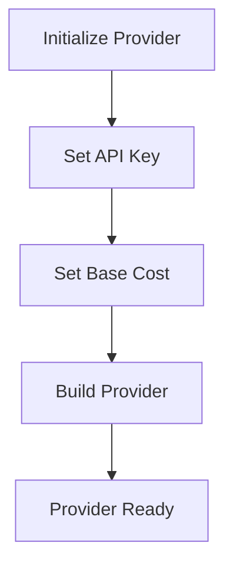
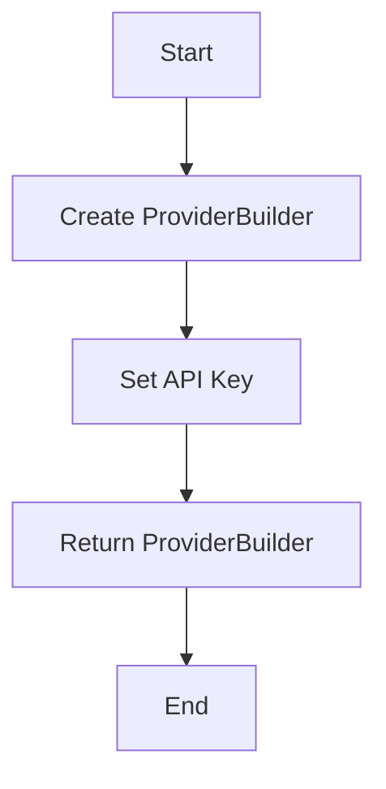
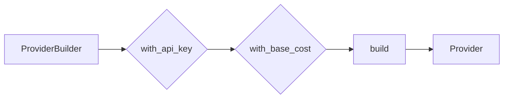

# `.\AutoGPT\autogpt_platform\backend\backend\blocks\stagehand\_config.py` 详细设计文档

The code defines a configuration and building system for a payment provider using a fluent interface pattern.

## 整体流程



## 类结构

```
ProviderBuilder (Builder Class)
```

## 全局变量及字段


### `stagehand`
    
An instance of ProviderBuilder configured with specific parameters for the Stagehand provider.

类型：`ProviderBuilder`
    


### `ProviderBuilder.provider_name`
    
The name of the provider being configured.

类型：`str`
    


### `ProviderBuilder.api_key`
    
The API key for the provider.

类型：`str`
    


### `ProviderBuilder.base_cost`
    
The base cost associated with the provider.

类型：`int`
    


### `ProviderBuilder.cost_type`
    
The type of cost associated with the provider.

类型：`BlockCostType`
    
    

## 全局函数及方法


### ProviderBuilder.with_api_key

该函数用于设置ProviderBuilder实例的API密钥。

参数：

- `api_key`：`str`，API密钥的名称
- `value`：`str`，API密钥的实际值

返回值：`ProviderBuilder`，返回修改后的ProviderBuilder实例

#### 流程图



#### 带注释源码

```python
from backend.sdk import BlockCostType, ProviderBuilder

# 创建ProviderBuilder实例
stagehand = ProviderBuilder("stagehand")

# 设置API密钥
stagehand = stagehand.with_api_key("STAGEHAND_API_KEY", "Stagehand API Key")

# 构建ProviderBuilder实例
stagehand = stagehand.build()
```


### ProviderBuilder.with_api_key

该函数用于设置ProviderBuilder实例的API密钥。

参数：

- `api_key`：`str`，API密钥的名称
- `value`：`str`，API密钥的实际值

返回值：`ProviderBuilder`，返回修改后的ProviderBuilder实例

#### 流程图

```mermaid
graph TD
    A[Start] --> B[ProviderBuilder("stagehand")]
    B --> C[with_api_key("STAGEHAND_API_KEY", "Stagehand API Key")]
    C --> D[with_base_cost(1, BlockCostType.RUN)]
    D --> E[build()]
    E --> F[End]
```

#### 带注释源码

```
from backend.sdk import BlockCostType, ProviderBuilder

# 创建ProviderBuilder实例
stagehand = ProviderBuilder("stagehand")

# 设置API密钥
stagehand = stagehand.with_api_key("STAGEHAND_API_KEY", "Stagehand API Key")

# 设置基础成本
stagehand = stagehand.with_base_cost(1, BlockCostType.RUN)

# 构建Provider实例
stagehand = stagehand.build()
```


### ProviderBuilder.with_base_cost

该函数用于设置基础成本，它是ProviderBuilder类的一个方法，用于在构建Provider实例时指定基础成本。

参数：

- `cost`：`int`，基础成本值，表示执行一个操作的成本。
- `cost_type`：`BlockCostType`，`BlockCostType`枚举类型，表示成本类型，例如RUN、WRITE等。

返回值：`ProviderBuilder`，返回ProviderBuilder实例，以便进行链式调用。

#### 流程图

```mermaid
graph LR
A[ProviderBuilder] --> B{with_base_cost(cost: int, cost_type: BlockCostType)}
B --> C[build()]
```

#### 带注释源码

```
from backend.sdk import BlockCostType, ProviderBuilder

# 定义ProviderBuilder类
class ProviderBuilder:
    def __init__(self, name):
        self.name = name

    def with_api_key(self, key_name, key_value):
        # 设置API密钥
        pass

    def with_base_cost(self, cost, cost_type):
        # 设置基础成本
        self.base_cost = cost
        self.base_cost_type = cost_type
        return self

    def build(self):
        # 构建Provider实例
        pass

# 使用ProviderBuilder
stagehand = (
    ProviderBuilder("stagehand")
    .with_api_key("STAGEHAND_API_KEY", "Stagehand API Key")
    .with_base_cost(1, BlockCostType.RUN)
    .build()
)
```


### ProviderBuilder.build

该函数用于构建一个ProviderBuilder实例，并返回一个配置好的Provider对象。

参数：

- `self`：`ProviderBuilder`，当前ProviderBuilder实例
- ...

返回值：`Provider`，构建好的Provider对象

#### 流程图



#### 带注释源码

```python
from backend.sdk import BlockCostType, ProviderBuilder

class ProviderBuilder:
    def __init__(self, name):
        self.name = name
        self.api_key = None
        self.base_cost = None
        self.block_cost_type = None

    def with_api_key(self, key, description):
        self.api_key = (key, description)
        return self

    def with_base_cost(self, cost, cost_type):
        self.base_cost = (cost, cost_type)
        return self

    def build(self):
        # 构建Provider对象
        provider = Provider(name=self.name, api_key=self.api_key, base_cost=self.base_cost, block_cost_type=self.block_cost_type)
        return provider

# 使用ProviderBuilder构建Provider
stagehand = (
    ProviderBuilder("stagehand")
    .with_api_key("STAGEHAND_API_KEY", "Stagehand API Key")
    .with_base_cost(1, BlockCostType.RUN)
    .build()
)
```


## 关键组件


### 张量索引与惰性加载

张量索引与惰性加载机制，用于高效地处理大规模数据集，通过延迟计算和按需加载数据来优化内存使用和计算效率。

### 反量化支持

反量化支持功能，允许代码在运行时动态调整量化参数，以适应不同的量化需求和优化计算性能。

### 量化策略

量化策略组件，负责将浮点数数据转换为低精度表示（如整数），以减少模型大小和加速推理过程。


## 问题及建议


### 已知问题

-   {问题1}：代码中硬编码了API密钥"STAGEHAND_API_KEY"，这可能导致密钥泄露的风险。如果密钥被泄露，攻击者可能会滥用API。
-   {问题2}：代码没有实现错误处理机制，如果API调用失败或出现异常，程序可能会崩溃或产生不可预测的行为。

### 优化建议

-   {建议1}：将API密钥存储在环境变量或配置文件中，而不是硬编码在代码中。这样可以提高安全性，并允许在不同的环境中使用不同的密钥。
-   {建议2}：添加异常处理逻辑，以捕获和处理可能发生的错误。这可以通过使用try-except块来实现，并记录错误信息以便于调试和监控。
-   {建议3}：考虑使用日志记录API调用的详细信息，包括请求和响应，这有助于追踪问题并优化性能。
-   {建议4}：如果API支持，可以考虑实现重试逻辑，以处理暂时性的网络问题或服务不可用情况。
-   {建议5}：如果API密钥或基础费用需要根据不同的环境或配置进行调整，可以考虑将这些值作为参数传递给ProviderBuilder，而不是在构建时硬编码。


## 其它


### 设计目标与约束

- 设计目标：确保代码能够高效、稳定地与Stagehand服务进行交互，同时保持代码的可维护性和可扩展性。
- 约束条件：遵循API规范，确保API密钥的安全存储和使用，以及处理可能的API调用错误。

### 错误处理与异常设计

- 错误处理：在API调用过程中，应捕获并处理可能的异常，如网络错误、API限制错误等。
- 异常设计：定义自定义异常类，以提供更具体的错误信息，并确保异常能够被正确地捕获和处理。

### 数据流与状态机

- 数据流：从配置API密钥到构建Provider对象，数据流是线性的，没有中间状态。
- 状态机：该代码段没有涉及状态变化，因此没有状态机的设计。

### 外部依赖与接口契约

- 外部依赖：依赖于`backend.sdk`模块中的`BlockCostType`和`ProviderBuilder`类。
- 接口契约：遵循`ProviderBuilder`类的接口契约，确保正确使用其方法。

### 安全性与隐私

- 安全性：确保API密钥等敏感信息的安全存储和使用。
- 隐私：遵守相关隐私法规，不泄露用户数据。

### 测试与验证

- 测试策略：编写单元测试和集成测试，确保代码在各种情况下都能正常工作。
- 验证方法：通过模拟API响应和错误情况来验证错误处理机制。

### 性能优化

- 性能指标：监控API调用响应时间和资源消耗。
- 优化策略：根据性能指标调整代码，如减少不必要的API调用。

### 维护与更新

- 维护策略：定期更新依赖库，修复已知问题，并添加新功能。
- 更新流程：遵循版本控制流程，确保代码变更的可追溯性和可回滚性。


    