# `.\AutoGPT\autogpt_platform\backend\backend\blocks\stagehand\blocks.py` 详细设计文档

This code defines a set of Stagehand blocks for interacting with web pages using an AI model. It includes functionality for observing, acting, and extracting data from web pages.

## 整体流程

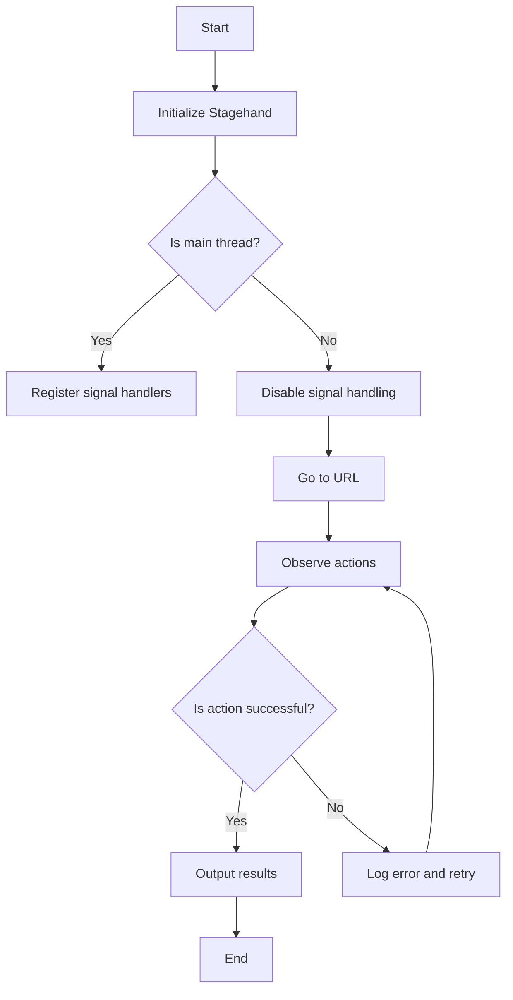

## 类结构

```
StagehandRecommendedLlmModel (Enum)
├── StagehandObserveBlock (Class)
│   ├── Input (Class)
│   ├── Output (Class)
│   └── __init__ (Method)
│       └── run (Async Method)
├── StagehandActBlock (Class)
│   ├── Input (Class)
│   ├── Output (Class)
│   └── __init__ (Method)
│       └── run (Async Method)
└── StagehandExtractBlock (Class)
    ├── Input (Class)
    ├── Output (Class)
    └── __init__ (Method)
        └── run (Async Method)
```

## 全局变量及字段


### `logger`
    
Logger instance for the module.

类型：`logging.getLogger`
    


### `original_register_signal_handlers`
    
Original signal handler registration method from Stagehand.

类型：`function`
    


### `noop_signal`
    
No-op signal handler function.

类型：`function`
    


### `original_signal`
    
Original signal handler function.

类型：`function`
    


### `stagehand`
    
Stagehand instance for interacting with the browser.

类型：`Stagehand`
    


### `page`
    
Page object from Puppeteer for interacting with the web page.

类型：`Page`
    


### `observe_results`
    
List of observation results from Stagehand.

类型：`list`
    


### `action_results`
    
List of action results from Stagehand.

类型：`list`
    


### `extraction`
    
Dictionary containing extracted data from the webpage.

类型：`dict`
    


### `StagehandRecommendedLlmModel.StagehandRecommendedLlmModel`
    
Enum containing recommended LLM models for Stagehand.

类型：`str, Enum`
    


### `StagehandObserveBlock.StagehandObserveBlock`
    
Block class for observing actions on a webpage.

类型：`Block`
    


### `StagehandActBlock.StagehandActBlock`
    
Block class for performing actions on a webpage.

类型：`Block`
    


### `StagehandExtractBlock.StagehandExtractBlock`
    
Block class for extracting structured data from a webpage.

类型：`Block`
    
    

## 全局函数及方法


### `safe_register_signal_handlers`

This function is a wrapper around the original `_register_signal_handlers` method of the `Stagehand` class. It ensures that signal handlers are only registered in the main thread, preventing issues that may arise from registering signal handlers in worker threads.

参数：

- `self`：`Stagehand`，The instance of the `Stagehand` class.

返回值：无

#### 流程图

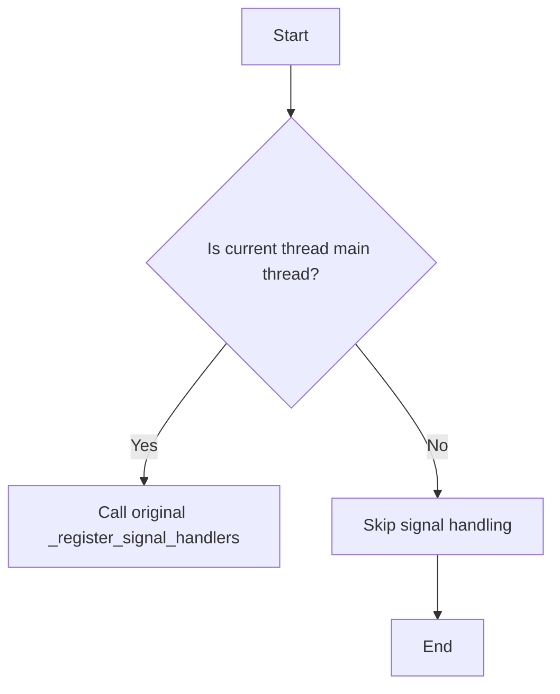

#### 带注释源码

```python
def safe_register_signal_handlers(self):
    """Only register signal handlers in the main thread"""
    if threading.current_thread() is threading.main_thread():
        original_register_signal_handlers(self)
    else:
        # Skip signal handling in worker threads
        pass
```


### disable_signal_handling()

This function is a context manager that temporarily disables signal handling in worker threads.

参数：

- 无

返回值：无

#### 流程图

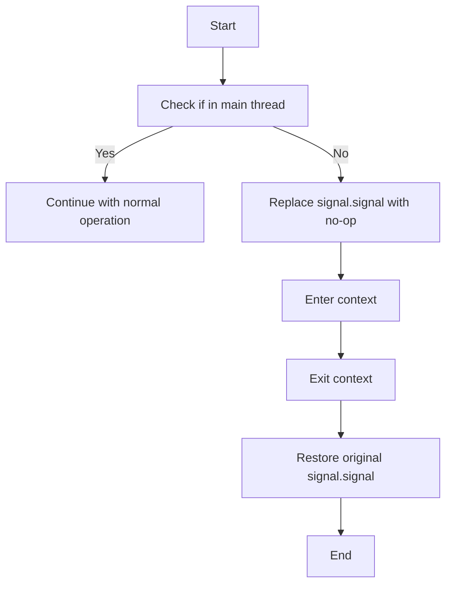

#### 带注释源码

```python
@contextmanager
def disable_signal_handling():
    """Context manager to temporarily disable signal handling"""
    if threading.current_thread() is not threading.main_thread():
        # In worker threads, temporarily replace signal.signal with a no-op
        original_signal = signal.signal

        def noop_signal(*args, **kwargs):
            pass

        signal.signal = noop_signal
        try:
            yield
        finally:
            signal.signal = original_signal
    else:
        # In main thread, don't modify anything
        yield
```


### StagehandObserveBlock.run

This method runs the StagehandObserveBlock, which is designed to find suggested actions for workflows by observing a web page.

参数：

- `input_data`：`Input`，The input data for the block, containing information such as the URL to navigate to, the instruction for discovery, and whether to search within iframes.
- `stagehand_credentials`：`APIKeyCredentials`，The credentials for Stagehand, including the API key.
- `model_credentials`：`APIKeyCredentials`，The credentials for the LLM model to use with Stagehand.

返回值：`BlockOutput`，The output of the block, containing the selector, description, method, and arguments for the suggested actions.

#### 流程图

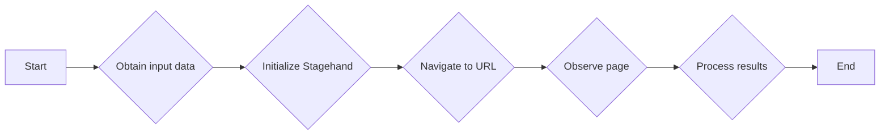

#### 带注释源码

```python
async def run(
    self,
    input_data: Input,
    *,
    stagehand_credentials: APIKeyCredentials,
    model_credentials: APIKeyCredentials,
    **kwargs,
) -> BlockOutput:

    logger.debug(f"OBSERVE: Using model provider {model_credentials.provider}")

    with disable_signal_handling():
        stagehand = Stagehand(
            api_key=stagehand_credentials.api_key.get_secret_value(),
            project_id=input_data.browserbase_project_id,
            model_name=input_data.model.provider_name,
            model_api_key=model_credentials.api_key.get_secret_value(),
        )

        await stagehand.init()

    page = stagehand.page

    assert page is not None, "Stagehand page is not initialized"

    await page.goto(input_data.url)

    observe_results = await page.observe(
        input_data.instruction,
        iframes=input_data.iframes,
        domSettleTimeoutMs=input_data.domSettleTimeoutMs,
    )
    for result in observe_results:
        yield "selector", result.selector
        yield "description", result.description
        yield "method", result.method
        yield "arguments", result.arguments
```


### StagehandRecommendedLlmModel.provider_name

This method returns the provider name for the model in the required format for Stagehand, which is `provider/model_name`.

参数：

- `self`：`StagehandRecommendedLlmModel`，The instance of the StagehandRecommendedLlmModel class.

返回值：`str`，The provider name for the model in the format `provider/model_name`.

#### 流程图

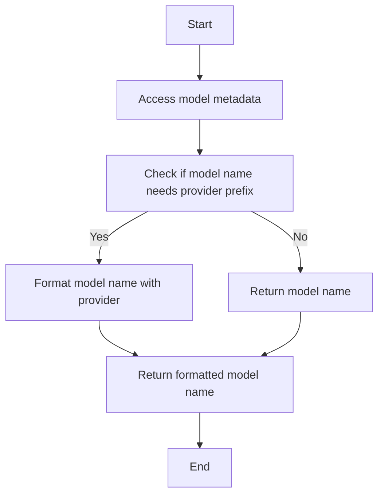

#### 带注释源码

```python
@property
def provider_name(self) -> str:
    """
    Returns the provider name for the model in the required format for Stagehand:
    provider/model_name
    """
    model_metadata = MODEL_METADATA[LlmModel(self.value)]
    model_name = self.value

    if len(model_name.split("/")) == 1 and not self.value.startswith(
        model_metadata.provider
    ):
        assert (
            model_metadata.provider != "open_router"
        ), "Logic failed and open_router provider attempted to be prepended to model name! in stagehand/_config.py"
        model_name = f"{model_metadata.provider}/{model_name}"

    logger.error(f"Model name: {model_name}")
    return model_name
```


### StagehandRecommendedLlmModel.provider

This method returns the provider name for the model in the required format for Stagehand, which is `provider/model_name`.

参数：

- `self`：`StagehandRecommendedLlmModel`，The instance of the StagehandRecommendedLlmModel class.

返回值：`str`，The provider name for the model in the format `provider/model_name`.

#### 流程图

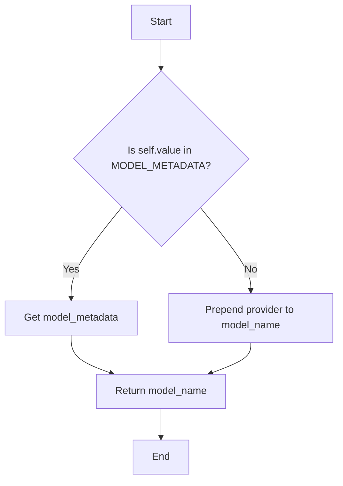

#### 带注释源码

```python
class StagehandRecommendedLlmModel(str, Enum):
    # ... (other enum members)

    @property
    def provider_name(self) -> str:
        """
        Returns the provider name for the model in the required format for Stagehand:
        provider/model_name
        """
        model_metadata = MODEL_METADATA[LlmModel(self.value)]
        model_name = self.value

        if len(model_name.split("/")) == 1 and not self.value.startswith(
            model_metadata.provider
        ):
            assert (
                model_metadata.provider != "open_router"
            ), "Logic failed and open_router provider attempted to be prepended to model name! in stagehand/_config.py"
            model_name = f"{model_metadata.provider}/{model_name}"

        logger.error(f"Model name: {model_name}")
        return model_name
```


### StagehandRecommendedLlmModel.metadata

This method returns the metadata for the StagehandRecommendedLlmModel enum value.

参数：

- 无

返回值：`ModelMetadata`，返回与指定LLM模型相关的元数据。

#### 流程图

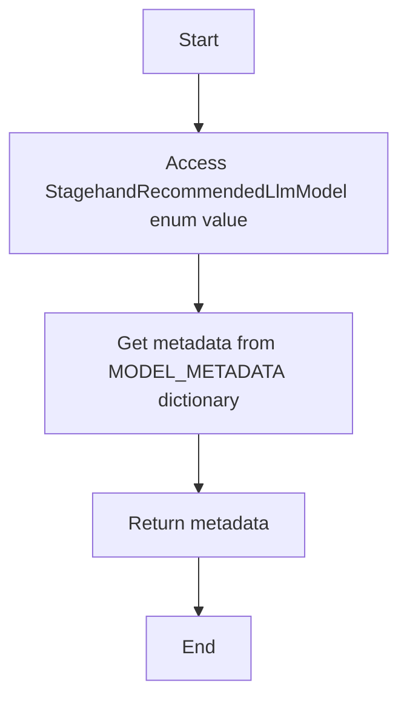

#### 带注释源码

```python
class StagehandRecommendedLlmModel(str, Enum):
    # ... (other enum values)

    @property
    def metadata(self) -> ModelMetadata:
        return MODEL_METADATA[LlmModel(self.value)]
```


### StagehandRecommendedLlmModel.context_window

This method returns the context window size for the specified LLM model.

参数：

- 无

返回值：`int`，The context window size of the LLM model.

#### 流程图

```mermaid
graph TD
    A[Start] --> B[Access MODEL_METADATA]
    B --> C[Get context_window for LlmModel(self.value)]
    C --> D[Return context_window]
    D --> E[End]
```

#### 带注释源码

```python
    @property
    def context_window(self) -> int:
        return MODEL_METADATA[LlmModel(self.value)].context_window
```


### StagehandRecommendedLlmModel.max_output_tokens

This method returns the maximum number of output tokens for a given StagehandRecommendedLlmModel.

参数：

- 无

返回值：`int | None`，The maximum number of output tokens for the model, or `None` if not specified.

#### 流程图

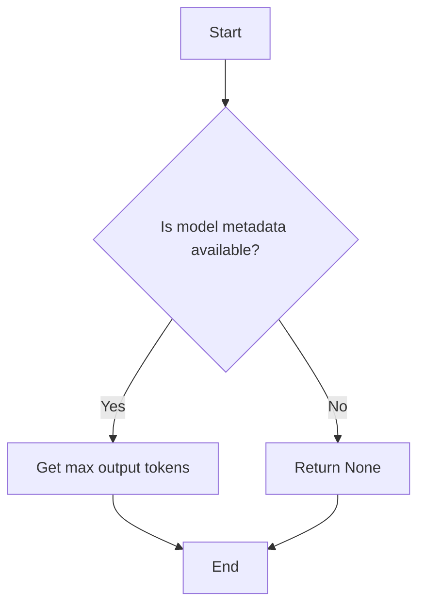

#### 带注释源码

```python
    @property
    def max_output_tokens(self) -> int | None:
        return MODEL_METADATA[LlmModel(self.value)].max_output_tokens
```


### StagehandObserveBlock.__init__

This method initializes the `StagehandObserveBlock` class, setting up the block's metadata and schema inputs and outputs.

参数：

- `id`: `str`，The unique identifier for the block.
- `description`: `str`，A description of the block's functionality.
- `categories`: `set`，A set of categories that the block belongs to.
- `input_schema`: `StagehandObserveBlock.Input`，The schema for the block's input data.
- `output_schema`: `StagehandObserveBlock.Output`，The schema for the block's output data.

返回值：无

#### 流程图

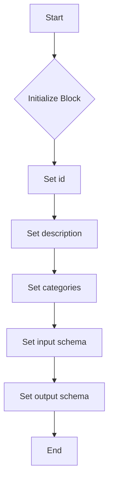

#### 带注释源码

```python
def __init__(self):
    super().__init__(
        id="d3863944-0eaf-45c4-a0c9-63e0fe1ee8b9",
        description="Find suggested actions for your workflows",
        categories={BlockCategory.AI, BlockCategory.DEVELOPER_TOOLS},
        input_schema=StagehandObserveBlock.Input,
        output_schema=StagehandObserveBlock.Output,
    )
```


### StagehandObserveBlock.run

This method runs the StagehandObserveBlock, which is designed to find suggested actions for workflows by observing a web page.

参数：

- `input_data`：`Input`，The input data for the block, containing information such as the URL to navigate to, the instruction for observation, and whether to search within iframes.
- `stagehand_credentials`：`APIKeyCredentials`，The credentials for the Stagehand API.
- `model_credentials`：`APIKeyCredentials`，The credentials for the LLM model to use.

返回值：`BlockOutput`，The output of the block, containing the selector, description, method, and arguments for the suggested actions.

#### 流程图

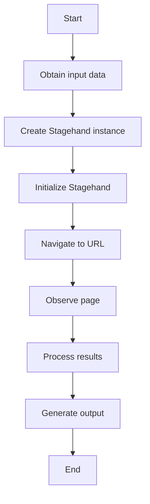

#### 带注释源码

```python
async def run(
    self,
    input_data: Input,
    *,
    stagehand_credentials: APIKeyCredentials,
    model_credentials: APIKeyCredentials,
    **kwargs,
) -> BlockOutput:

    logger.debug(f"OBSERVE: Using model provider {model_credentials.provider}")

    with disable_signal_handling():
        stagehand = Stagehand(
            api_key=stagehand_credentials.api_key.get_secret_value(),
            project_id=input_data.browserbase_project_id,
            model_name=input_data.model.provider_name,
            model_api_key=model_credentials.api_key.get_secret_value(),
        )

        await stagehand.init()

    page = stagehand.page

    assert page is not None, "Stagehand page is not initialized"

    await page.goto(input_data.url)

    observe_results = await page.observe(
        input_data.instruction,
        iframes=input_data.iframes,
        domSettleTimeoutMs=input_data.domSettleTimeoutMs,
    )
    for result in observe_results:
        yield "selector", result.selector
        yield "description", result.description
        yield "method", result.method
        yield "arguments", result.arguments
``` 


### StagehandActBlock.__init__

This method initializes the `StagehandActBlock` class, setting up the block's metadata and schema inputs and outputs.

参数：

- `id`：`str`，The unique identifier for the block.
- `description`：`str`，A description of the block's functionality.
- `categories`：`set`，A set of categories that the block belongs to.
- `input_schema`：`BlockSchemaInput`，The schema for the block's input data.
- `output_schema`：`BlockSchemaOutput`，The schema for the block's output data.

返回值：无

#### 流程图

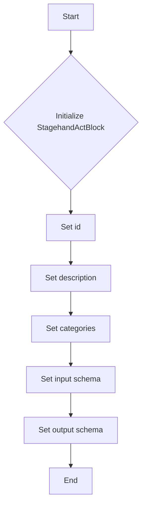

#### 带注释源码

```python
class StagehandActBlock(Block):
    def __init__(self):
        super().__init__(
            id="86eba68b-9549-4c0b-a0db-47d85a56cc27",
            description="Interact with a web page by performing actions on a web page. Use it to build self-healing and deterministic automations that adapt to website chang.",
            categories={BlockCategory.AI, BlockCategory.DEVELOPER_TOOLS},
            input_schema=StagehandActBlock.Input,
            output_schema=StagehandActBlock.Output,
        )
```


### StagehandActBlock.run

This method is responsible for interacting with a web page by performing actions on it. It uses the Stagehand library to navigate to a URL, perform a series of actions, and yield the results of these actions.

参数：

- `input_data`：`Input`，The input data for the block, containing the URL, actions to perform, and other parameters.
- `stagehand_credentials`：`APIKeyCredentials`，The credentials for the Stagehand service.
- `model_credentials`：`APIKeyCredentials`，The credentials for the LLM model to be used.

返回值：`BlockOutput`，The output of the block, containing the success status, message, and action performed.

#### 流程图

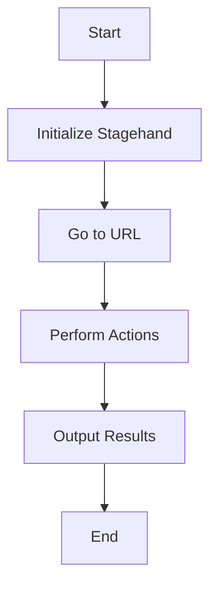

#### 带注释源码

```python
async def run(
    self,
    input_data: Input,
    *,
    stagehand_credentials: APIKeyCredentials,
    model_credentials: APIKeyCredentials,
    **kwargs,
) -> BlockOutput:

    logger.debug(f"ACT: Using model provider {model_credentials.provider}")

    with disable_signal_handling():
        stagehand = Stagehand(
            api_key=stagehand_credentials.api_key.get_secret_value(),
            project_id=input_data.browserbase_project_id,
            model_name=input_data.model.provider_name,
            model_api_key=model_credentials.api_key.get_secret_value(),
        )

        await stagehand.init()

    page = stagehand.page

    assert page is not None, "Stagehand page is not initialized"

    await page.goto(input_data.url)
    for action in input_data.action:
        action_results = await page.act(
            action,
            variables=input_data.variables,
            iframes=input_data.iframes,
            domSettleTimeoutMs=input_data.domSettleTimeoutMs,
            timeoutMs=input_data.timeoutMs,
        )
        yield "success", action_results.success
        yield "message", action_results.message
        yield "action", action_results.action
```


### StagehandExtractBlock.__init__

This method initializes the `StagehandExtractBlock` class, setting up the block's metadata and schema inputs and outputs.

参数：

- `id`: `str`，The unique identifier for the block.
- `description`: `str`，A description of the block's functionality.
- `categories`: `set`，A set of categories that the block belongs to.
- `input_schema`: `StagehandExtractBlock.Input`，The schema for the block's input data.
- `output_schema`: `StagehandExtractBlock.Output`，The schema for the block's output data.

返回值：无

#### 流程图

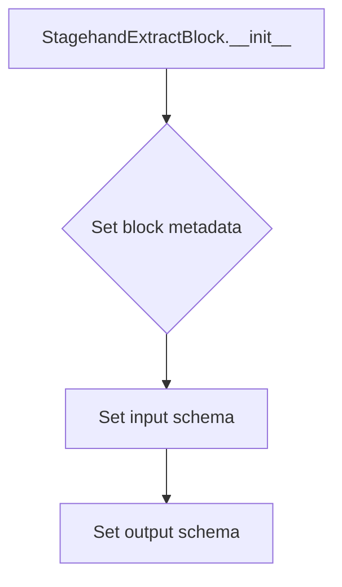

#### 带注释源码

```python
def __init__(self):
    super().__init__(
        id="fd3c0b18-2ba6-46ae-9339-fcb40537ad98",
        description="Extract structured data from a webpage.",
        categories={BlockCategory.AI, BlockCategory.DEVELOPER_TOOLS},
        input_schema=StagehandExtractBlock.Input,
        output_schema=StagehandExtractBlock.Output,
    )
```


### StagehandExtractBlock.run

This method extracts structured data from a webpage using the Stagehand library.

参数：

- `input_data`：`Input`，The input data for the block, containing the necessary information to perform the extraction.
- `stagehand_credentials`：`APIKeyCredentials`，The credentials for the Stagehand service.
- `model_credentials`：`APIKeyCredentials`，The credentials for the LLM model to be used for the extraction.

返回值：`BlockOutput`，The output of the block, containing the extracted data.

#### 流程图

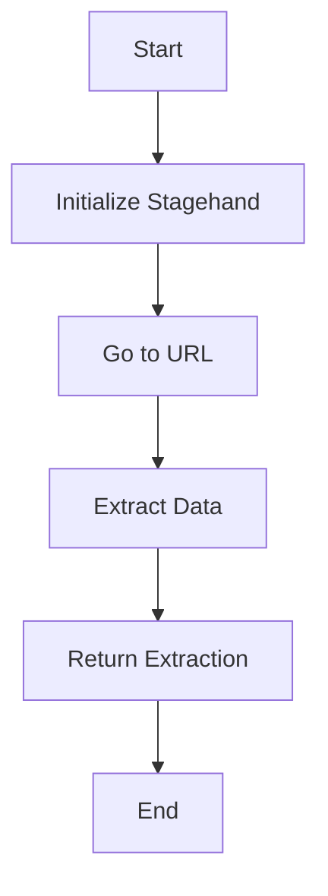

#### 带注释源码

```python
async def run(
    self,
    input_data: Input,
    *,
    stagehand_credentials: APIKeyCredentials,
    model_credentials: APIKeyCredentials,
    **kwargs,
) -> BlockOutput:

    logger.debug(f"EXTRACT: Using model provider {model_credentials.provider}")

    with disable_signal_handling():
        stagehand = Stagehand(
            api_key=stagehand_credentials.api_key.get_secret_value(),
            project_id=input_data.browserbase_project_id,
            model_name=input_data.model.provider_name,
            model_api_key=model_credentials.api_key.get_secret_value(),
        )

        await stagehand.init()

    page = stagehand.page

    assert page is not None, "Stagehand page is not initialized"

    await page.goto(input_data.url)
    extraction = await page.extract(
        input_data.instruction,
        iframes=input_data.iframes,
        domSettleTimeoutMs=input_data.domSettleTimeoutMs,
    )
    yield "extraction", str(extraction.model_dump()["extraction"])
```


## 关键组件


### 张量索引与惰性加载

张量索引与惰性加载是代码中用于高效处理大规模数据集的关键组件。它允许在需要时才加载数据，从而减少内存消耗并提高性能。

### 反量化支持

反量化支持是代码中用于处理量化数据的关键组件。它能够将量化数据转换回原始数据，以便进行进一步处理和分析。

### 量化策略

量化策略是代码中用于优化模型性能的关键组件。它通过减少模型中使用的精度来减少模型大小和计算需求，从而提高模型在资源受限环境中的效率。


## 问题及建议


### 已知问题

-   **信号处理问题**：代码中通过`disable_signal_handling`上下文管理器在非主线程中禁用了信号处理，这可能导致在子线程中发生未处理的信号，从而引发程序崩溃。
-   **代码重复**：`StagehandObserveBlock`、`StagehandActBlock`和`StagehandExtractBlock`类具有相似的代码结构，这可能导致维护困难。可以考虑将这些功能抽象到一个基类中。
-   **异常处理**：代码中没有明确的异常处理机制，如果`Stagehand`初始化失败或页面无法加载，程序可能会崩溃。
-   **日志记录**：日志记录不够详细，难以追踪问题。建议增加更详细的日志记录，包括错误信息和堆栈跟踪。

### 优化建议

-   **信号处理**：在非主线程中处理信号，或者确保所有子线程都注册了信号处理函数。
-   **代码重构**：将重复的代码抽象到一个基类中，减少代码冗余，提高可维护性。
-   **异常处理**：增加异常处理机制，捕获和处理可能发生的错误，确保程序的健壮性。
-   **日志记录**：增加详细的日志记录，包括错误信息和堆栈跟踪，以便于问题追踪和调试。
-   **性能优化**：考虑使用异步编程模型来提高代码的执行效率，特别是在处理大量数据时。
-   **安全性**：对敏感信息，如API密钥，进行加密存储和传输，以防止数据泄露。


## 其它


### 设计目标与约束

- 设计目标：
  - 提供一个模块化的框架，用于与Stagehand集成，以执行自动化任务。
  - 支持多种Stagehand模型和API密钥，以适应不同的使用场景。
  - 确保线程安全，避免在子线程中处理信号。
  - 提供清晰的接口和文档，方便用户使用。

- 约束：
  - 必须使用Stagehand API进行操作。
  - 需要处理API密钥的安全存储和访问。
  - 代码应遵循Python最佳实践和编码标准。

### 错误处理与异常设计

- 错误处理：
  - 使用try-except块捕获和处理可能发生的异常。
  - 记录异常信息，以便于调试和问题追踪。
  - 提供用户友好的错误消息。

- 异常设计：
  - 定义自定义异常类，以处理特定于Stagehand的操作错误。
  - 使用Python内置的异常类，如`ValueError`和`TypeError`，以处理数据类型错误。

### 数据流与状态机

- 数据流：
  - 用户输入通过API传递到相应的Stagehand块。
  - Stagehand块处理输入，执行操作，并返回结果。
  - 结果通过API返回给用户。

- 状态机：
  - 每个Stagehand块都包含一个状态机，用于管理其生命周期和操作流程。
  - 状态机定义了块的初始状态、中间状态和最终状态。

### 外部依赖与接口契约

- 外部依赖：
  - Stagehand API
  - Python标准库（如logging、signal、threading等）
  - 第三方库（如stagehand、litellm等）

- 接口契约：
  - Stagehand块定义了输入和输出契约，包括数据类型和结构。
  - API定义了与Stagehand块交互的接口，包括请求和响应格式。


    