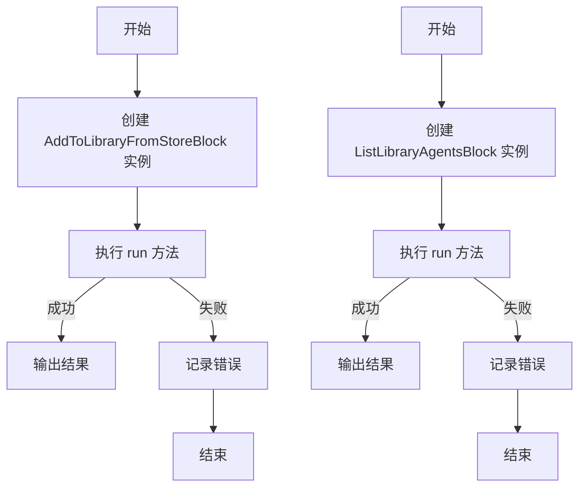
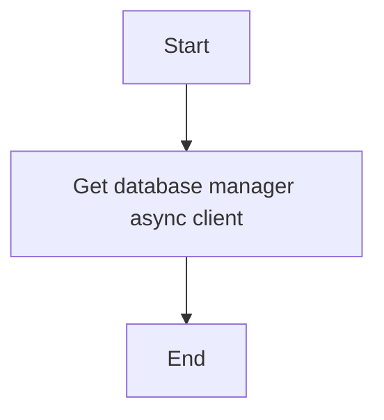
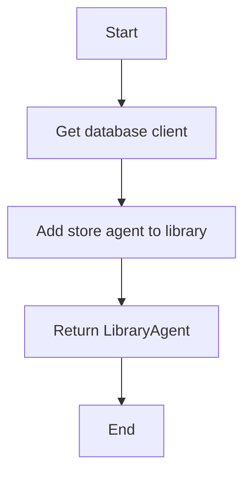
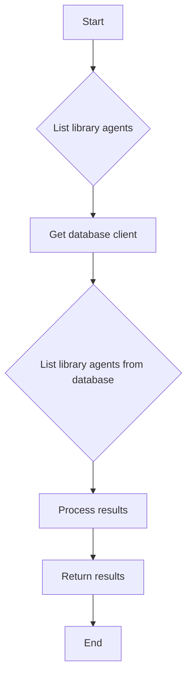
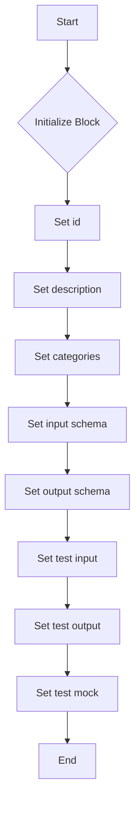
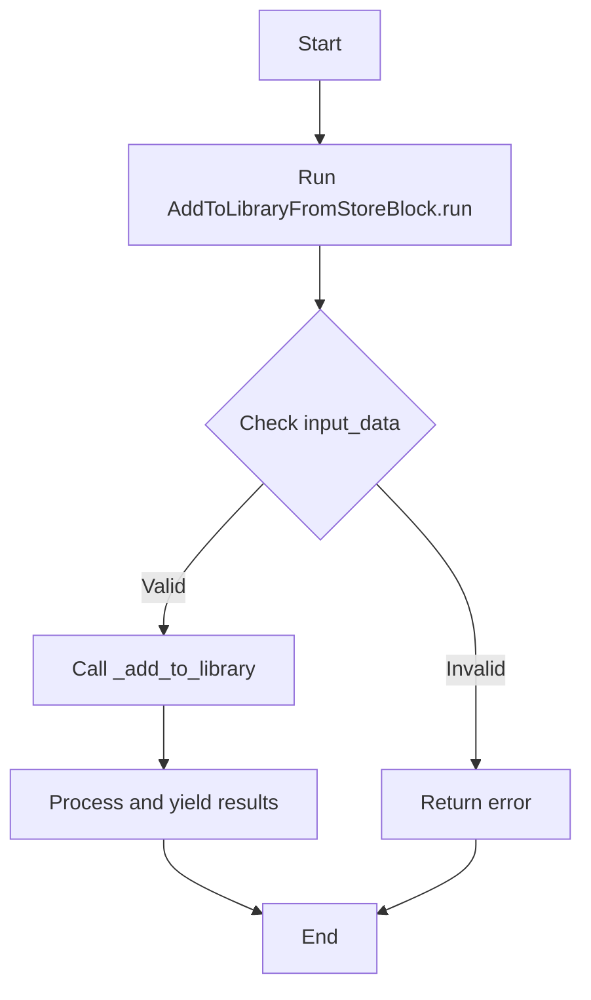
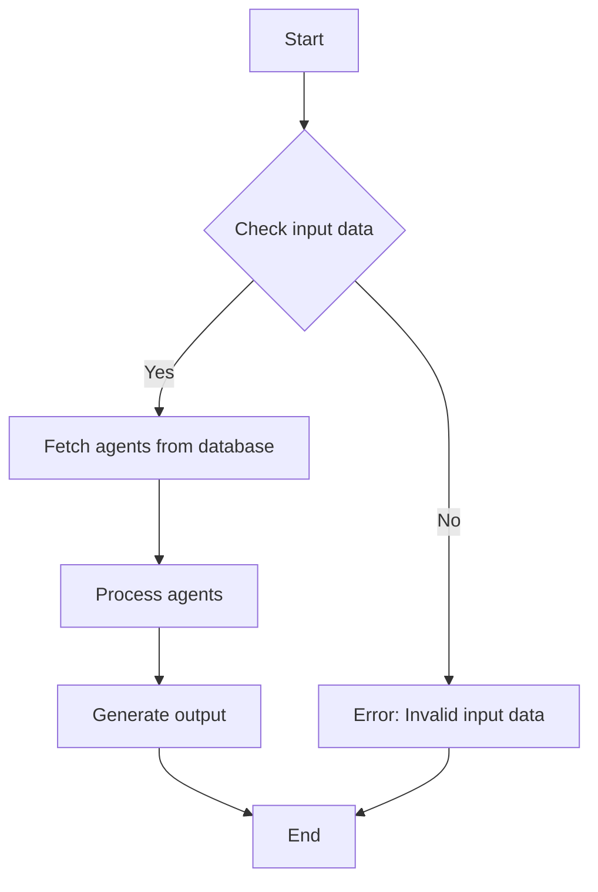
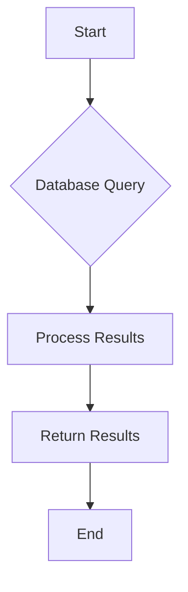

# `.\AutoGPT\autogpt_platform\backend\backend\blocks\system\library_operations.py` 详细设计文档

This code defines two classes, `LibraryAgent` and `AddToLibraryFromStoreBlock`, which are used to manage agents in a user's library. The `LibraryAgent` class represents an agent in the library, while `AddToLibraryFromStoreBlock` is a block that adds an agent from the store to the user's library. Another class, `ListLibraryAgentsBlock`, is used to list all agents in the user's library.

## 整体流程



## 类结构

```
LibraryAgent
├── AddToLibraryFromStoreBlock
│   ├── Input
│   ├── Output
│   └── _add_to_library
└── ListLibraryAgentsBlock
   ├── Input
   ├── Output
   └── _list_library_agents
```

## 全局变量及字段


### `logger`
    
Logger instance for logging messages

类型：`logging.Logger`
    


### `LibraryAgent.library_agent_id`
    
Unique identifier for the library agent

类型：`str`
    


### `LibraryAgent.agent_id`
    
Unique identifier for the agent graph

类型：`str`
    


### `LibraryAgent.agent_version`
    
Version number of the agent graph

类型：`int`
    


### `LibraryAgent.agent_name`
    
Name of the agent

类型：`str`
    


### `LibraryAgent.description`
    
Description of the agent

类型：`str`
    


### `LibraryAgent.creator`
    
Creator of the agent

类型：`str`
    


### `LibraryAgent.is_archived`
    
Indicates whether the agent is archived

类型：`bool`
    


### `LibraryAgent.categories`
    
List of categories the agent belongs to

类型：`list[str]`
    
    

## 全局函数及方法


### `get_database_manager_async_client()`

获取异步数据库管理器客户端。

参数：

- 无

返回值：`Any`，返回一个异步数据库管理器客户端实例。

#### 流程图



#### 带注释源码

```python
from backend.util.clients import get_database_manager_async_client

# Get the asynchronous database manager client
async def get_database_manager_async_client():
    # Implementation to get the database manager client
    pass
```


### `AddToLibraryFromStoreBlock._add_to_library`

Add a store agent to the user's library using the existing library database function.

参数：

- `user_id`：`str`，The ID of the user to whom the agent is being added.
- `store_listing_version_id`：`str`，The ID of the store listing version to add to library.
- `custom_name`：`str | None`，Optional custom name for the agent in your library.

返回值：`LibraryAgent`，The LibraryAgent object representing the added agent.

#### 流程图



#### 带注释源码

```python
async def _add_to_library(
    self,
    user_id: str,
    store_listing_version_id: str,
    custom_name: str | None = None,
) -> LibraryAgent:
    """
    Add a store agent to the user's library using the existing library database function.
    """
    library_agent = (
        await get_database_manager_async_client().add_store_agent_to_library(
            store_listing_version_id=store_listing_version_id, user_id=user_id
        )
    )

    # If custom name is provided, we could update the library agent name here
    # For now, we'll just return the agent info
    agent_name = custom_name if custom_name else library_agent.name

    return LibraryAgent(
        library_agent_id=library_agent.id,
        agent_id=library_agent.graph_id,
        agent_version=library_agent.graph_version,
        agent_name=agent_name,
    )
```


### list_library_agents

This function lists all agents in the user's library based on the provided search query, limit, and page number.

参数：

- `user_id`：`str`，The ID of the user whose library agents are to be listed.
- `search_query`：`str | None`，Optional search query to filter agents. Defaults to None.
- `limit`：`int`，Maximum number of agents to return. Defaults to 50.
- `page`：`int`，Page number for pagination. Defaults to 1.

返回值：`dict[str, Any]`，A dictionary containing the list of agents, total count, current page, and total pages.

#### 流程图



#### 带注释源码

```python
async def _list_library_agents(
    self,
    user_id: str,
    search_query: str | None = None,
    limit: int = 50,
    page: int = 1,
) -> dict[str, Any]:
    """
    List agents in the user's library using the database client.
    """
    result = await get_database_manager_async_client().list_library_agents(
        user_id=user_id,
        search_term=search_query,
        page=page,
        page_size=limit,
    )

    agents = [
        LibraryAgent(
            library_agent_id=agent.id,
            agent_id=agent.graph_id,
            agent_version=agent.graph_version,
            agent_name=agent.name,
            description=getattr(agent, "description", ""),
            creator=getattr(agent, "creator", ""),
            is_archived=getattr(agent, "is_archived", False),
            categories=getattr(agent, "categories", []),
        )
        for agent in result.agents
    ]

    return {
        "agents": agents,
        "total": result.pagination.total_items,
        "page": result.pagination.current_page,
        "total_pages": result.pagination.total_pages,
    }
``` 


### `AddToLibraryFromStoreBlock.__init__`

This method initializes the `AddToLibraryFromStoreBlock` class, setting up its properties and configurations.

参数：

- `id`: `str`，The unique identifier for the block.
- `description`: `str`，A description of the block's purpose.
- `categories`: `set` of `BlockCategory`，The categories to which the block belongs.
- `input_schema`: `BlockSchemaInput`，The input schema for the block.
- `output_schema`: `BlockSchemaOutput`，The output schema for the block.
- `test_input`: `dict`，Sample input data for testing the block.
- `test_output`: `list` of tuples，Sample output data for testing the block.
- `test_mock`: `dict`，Mock functions for testing the block.

返回值：无

#### 流程图



#### 带注释源码

```python
def __init__(self):
    super().__init__(
        id="2602a7b1-3f4d-4e5f-9c8b-1a2b3c4d5e6f",
        description="Add an agent from the store to your personal library",
        categories={BlockCategory.BASIC},
        input_schema=AddToLibraryFromStoreBlock.Input,
        output_schema=AddToLibraryFromStoreBlock.Output,
        test_input={
            "store_listing_version_id": "test-listing-id",
            "agent_name": "My Custom Agent",
        },
        test_output=[
            ("success", True),
            ("library_agent_id", "test-library-id"),
            ("agent_id", "test-agent-id"),
            ("agent_version", 1),
            ("agent_name", "Test Agent"),
            ("message", "Agent successfully added to library"),
        ],
        test_mock={
            "_add_to_library": lambda *_, **__: LibraryAgent(
                library_agent_id="test-library-id",
                agent_id="test-agent-id",
                agent_version=1,
                agent_name="Test Agent",
            )
        },
    )
```


### AddToLibraryFromStoreBlock.run

This method adds an agent from the store to the user's library.

参数：

- `input_data`：`Input`，The input data for the block, containing the store listing version ID and optional custom name for the agent.
- `user_id`：`str`，The ID of the user to whom the agent is being added.

返回值：`BlockOutput`，The output data for the block, indicating the success of the operation and providing details about the added agent.

#### 流程图



#### 带注释源码

```python
async def run(
    self,
    input_data: Input,
    *,
    user_id: str,
    **kwargs,
) -> BlockOutput:
    library_agent = await self._add_to_library(
        user_id=user_id,
        store_listing_version_id=input_data.store_listing_version_id,
        custom_name=input_data.agent_name,
    )

    yield "success", True
    yield "library_agent_id", library_agent.library_agent_id
    yield "agent_id", library_agent.agent_id
    yield "agent_version", library_agent.agent_version
    yield "agent_name", library_agent.agent_name
    yield "message", "Agent successfully added to library"
```


### `_add_to_library`

Add a store agent to the user's library.

参数：

- `user_id`：`str`，The ID of the user to whom the agent is being added.
- `store_listing_version_id`：`str`，The ID of the store listing version to add to the library.
- `custom_name`：`str | None`，Optional custom name for the agent in the library. If not provided, the default name from the store listing is used.

返回值：`LibraryAgent`，The LibraryAgent object representing the added agent.

#### 流程图


#### 带注释源码

```python
async def _add_to_library(
    self,
    user_id: str,
    store_listing_version_id: str,
    custom_name: str | None = None,
) -> LibraryAgent:
    """
    Add a store agent to the user's library using the existing library database function.
    """
    library_agent = (
        await get_database_manager_async_client().add_store_agent_to_library(
            store_listing_version_id=store_listing_version_id, user_id=user_id
        )
    )

    # If custom name is provided, we could update the library agent name here
    # For now, we'll just return the agent info
    agent_name = custom_name if custom_name else library_agent.name

    return LibraryAgent(
        library_agent_id=library_agent.id,
        agent_id=library_agent.graph_id,
        agent_version=library_agent.graph_version,
        agent_name=agent_name,
    )
```


### ListLibraryAgentsBlock.__init__

This method initializes the `ListLibraryAgentsBlock` class, setting up its schema, test data, and mock data.

参数：

- `id`: `str`，The unique identifier for the block.
- `description`: `str`，A brief description of the block's functionality.
- `categories`: `set` of `BlockCategory`，The categories to which the block belongs.
- `input_schema`: `BlockSchemaInput`，The input schema for the block.
- `output_schema`: `BlockSchemaOutput`，The output schema for the block.
- `test_input`: `dict`，The test input data for the block.
- `test_output`: `list` of tuples，The test output data for the block.
- `test_mock`: `dict`，The test mock data for the block.

返回值：None

#### 流程图


#### 带注释源码

```python
def __init__(self):
    super().__init__(
        id="082602d3-a74d-4600-9e9c-15b3af7eae98",
        description="List all agents in your personal library",
        categories={BlockCategory.BASIC, BlockCategory.DATA},
        input_schema=ListLibraryAgentsBlock.Input,
        output_schema=ListLibraryAgentsBlock.Output,
        test_input={
            "search_query": None,
            "limit": 10,
            "page": 1,
        },
        test_output=[
            (
                "agents",
                [
                    LibraryAgent(
                        library_agent_id="test-lib-id",
                        agent_id="test-agent-id",
                        agent_version=1,
                        agent_name="Test Library Agent",
                        description="A test agent in library",
                        creator="Test User",
                    ),
                ],
            ),
            ("total_count", 1),
            ("page", 1),
            ("total_pages", 1),
            (
                "agent",
                LibraryAgent(
                    library_agent_id="test-lib-id",
                    agent_id="test-agent-id",
                    agent_version=1,
                    agent_name="Test Library Agent",
                    description="A test agent in library",
                    creator="Test User",
                ),
            ),
        ],
        test_mock={
            "_list_library_agents": lambda *_, **__: {
                "agents": [
                    LibraryAgent(
                        library_agent_id="test-lib-id",
                        agent_id="test-agent-id",
                        agent_version=1,
                        agent_name="Test Library Agent",
                        description="A test agent in library",
                        creator="Test User",
                    )
                ],
                "total": 1,
                "page": 1,
                "total_pages": 1,
            }
        },
    )
```


### ListLibraryAgentsBlock.run

This method lists all agents in the user's library based on the provided search query, limit, and page number.

参数：

- `input_data`：`Input`，The input data for the block, containing the search query, limit, and page number.
- `user_id`：`str`，The ID of the user whose library agents are to be listed.

返回值：`BlockOutput`，The output data containing the list of agents, total count, current page, and total pages.

#### 流程图



#### 带注释源码

```python
async def run(self, input_data: Input, *, user_id: str, **kwargs) -> BlockOutput:
    result = await self._list_library_agents(
        user_id=user_id,
        search_query=input_data.search_query,
        limit=input_data.limit,
        page=input_data.page,
    )

    agents = result["agents"]

    yield "agents", agents
    yield "total_count", result["total"]
    yield "page", result["page"]
    yield "total_pages", result["total_pages"]

    # Yield each agent individually for better graph connectivity
    for agent in agents:
        yield "agent", agent
``` 


### `_list_library_agents`

This method lists agents in the user's library based on the provided search query, limit, and page number.

参数：

- `user_id`：`str`，The ID of the user whose library agents are to be listed.
- `search_query`：`str | None`，Optional search query to filter agents. Defaults to `None`.
- `limit`：`int`，Maximum number of agents to return. Defaults to 50.
- `page`：`int`，Page number for pagination. Defaults to 1.

返回值：`dict[str, Any]`，A dictionary containing the list of agents, total count, current page, and total pages.

#### 流程图



#### 带注释源码

```python
async def _list_library_agents(
    self,
    user_id: str,
    search_query: str | None = None,
    limit: int = 50,
    page: int = 1,
) -> dict[str, Any]:
    """
    List agents in the user's library using the database client.
    """
    result = await get_database_manager_async_client().list_library_agents(
        user_id=user_id,
        search_term=search_query,
        page=page,
        page_size=limit,
    )

    agents = [
        LibraryAgent(
            library_agent_id=agent.id,
            agent_id=agent.graph_id,
            agent_version=agent.graph_version,
            agent_name=agent.name,
            description=getattr(agent, "description", ""),
            creator=getattr(agent, "creator", ""),
            is_archived=getattr(agent, "is_archived", False),
            categories=getattr(agent, "categories", []),
        )
        for agent in result.agents
    ]

    return {
        "agents": agents,
        "total": result.pagination.total_items,
        "page": result.pagination.current_page,
        "total_pages": result.pagination.total_pages,
    }
```


## 关键组件


### 张量索引与惰性加载

张量索引与惰性加载是用于高效处理大型数据集的关键组件，它允许在需要时才加载数据，从而减少内存消耗和提高性能。

### 反量化支持

反量化支持是用于处理量化数据的关键组件，它允许在量化过程中将数据转换回原始精度，以便进行进一步处理。

### 量化策略

量化策略是用于优化模型性能的关键组件，它通过减少模型中使用的精度来减少模型大小和计算需求，从而提高模型在资源受限设备上的运行效率。


## 问题及建议


### 已知问题

-   **重复的 Pydantic 模型**: `LibraryAgent` 类被重复定义了两次，一次在 `AddToLibraryFromStoreBlock` 类中，另一次在 `_add_to_library` 方法中。这可能导致维护困难，因为任何对模型结构的更改都需要在两个地方进行。
-   **全局变量**: `logger` 被定义为全局变量，这可能导致在多线程环境中出现竞争条件或状态不一致的问题。
-   **异步函数调用**: `_add_to_library` 和 `_list_library_agents` 方法被定义为异步函数，但它们调用的 `get_database_manager_async_client()` 方法没有明确指出是否为异步方法。如果它不是异步的，那么在异步上下文中调用它可能会导致阻塞。
-   **代码复用**: `AddToLibraryFromStoreBlock` 和 `ListLibraryAgentsBlock` 类都使用了 `_add_to_library` 和 `_list_library_agents` 方法，这表明存在代码复用，可以考虑将这些方法提取到单独的模块或服务中。

### 优化建议

-   **合并 Pydantic 模型**: 将 `LibraryAgent` 类的定义合并到单个地方，并在需要的地方导入它。
-   **避免全局变量**: 尝试将 `logger` 作为参数传递给需要它的函数，而不是将其定义为全局变量。
-   **确保异步兼容性**: 确保所有数据库操作都是异步的，以避免在异步上下文中出现阻塞。
-   **提取代码复用**: 将 `_add_to_library` 和 `_list_library_agents` 方法提取到单独的模块或服务中，以提高代码的可维护性和可测试性。
-   **错误处理**: 在数据库操作中添加错误处理逻辑，以处理可能出现的异常情况。
-   **日志记录**: 在关键操作和数据库调用中添加日志记录，以帮助调试和监控应用程序。
-   **单元测试**: 为每个类和方法编写单元测试，以确保代码的正确性和稳定性。


## 其它


### 设计目标与约束

- 设计目标：
  - 提供一个模块化的方式来管理用户库中的代理。
  - 允许用户从存储中添加代理到他们的个人库。
  - 提供一个接口来列出用户库中的所有代理。
  - 确保数据的一致性和完整性。
- 约束：
  - 代理数据结构不应在编辑后端时意外更改。
  - 所有操作都应异步执行以避免阻塞。
  - 应遵循RESTful API设计原则。

### 错误处理与异常设计

- 错误处理：
  - 在数据库操作中捕获异常，并返回适当的错误消息。
  - 使用日志记录错误信息，以便于问题追踪和调试。
- 异常设计：
  - 定义自定义异常类以处理特定错误情况。
  - 异常应提供足够的信息，以便调用者可以采取适当的行动。

### 数据流与状态机

- 数据流：
  - 用户请求添加代理到库，触发`AddToLibraryFromStoreBlock`。
  - 用户请求列出库中的代理，触发`ListLibraryAgentsBlock`。
- 状态机：
  - 每个块在其生命周期中可能处于不同的状态，如“正在运行”、“成功”、“失败”等。

### 外部依赖与接口契约

- 外部依赖：
  - `pydantic`用于数据验证。
  - `logging`用于日志记录。
  - `asyncio`用于异步编程。
- 接口契约：
  - `Block`类定义了块的接口，包括输入、输出和运行方法。
  - `LibraryAgent`类定义了代理的数据结构。
  - `get_database_manager_async_client`函数用于获取数据库客户端实例。


    