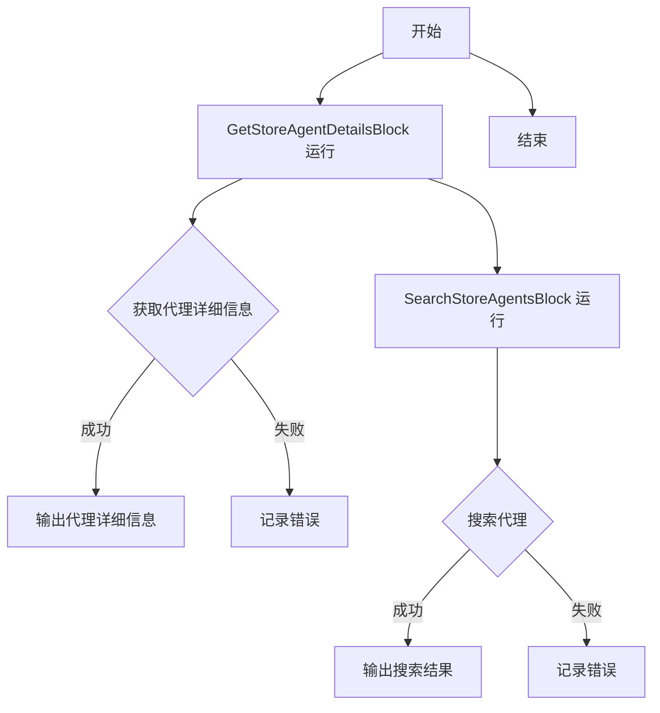
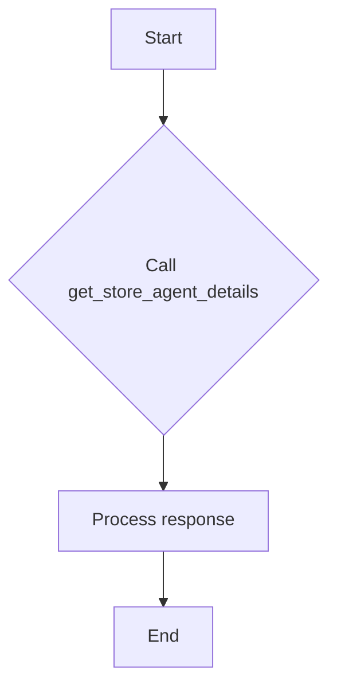
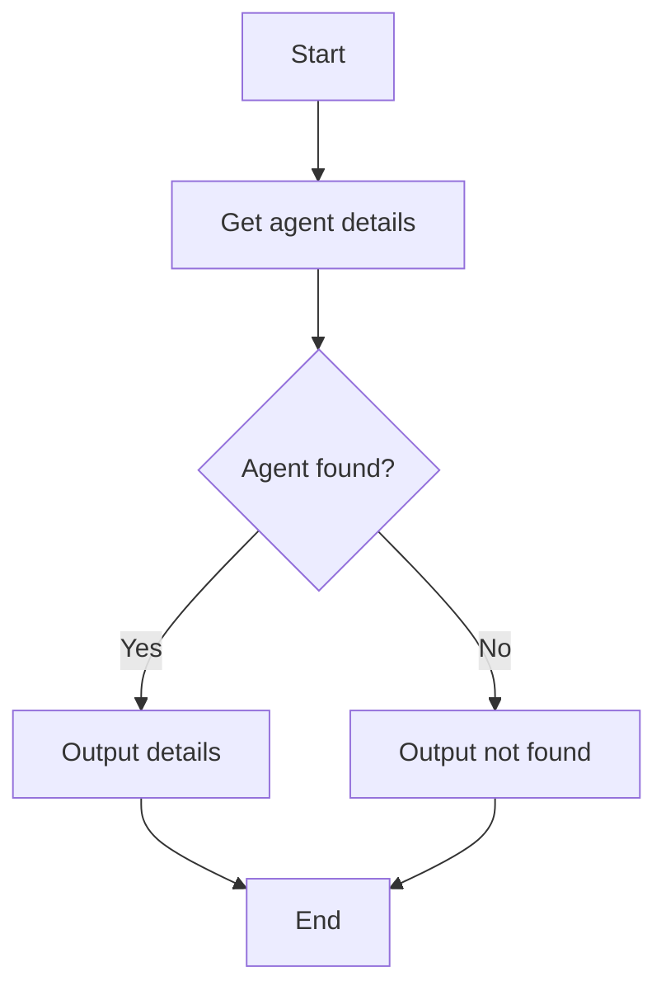
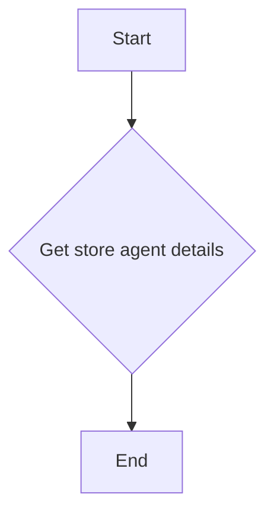
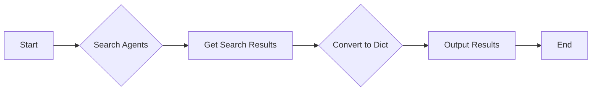
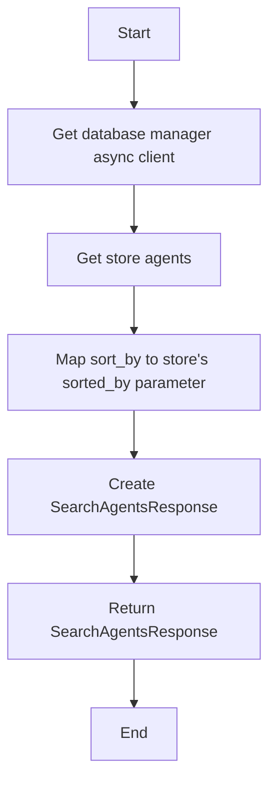

# `.\AutoGPT\autogpt_platform\backend\backend\blocks\system\store_operations.py` 详细设计文档

This code defines a set of classes and functions to interact with a store agent system, including retrieving detailed information about an agent and searching for agents based on various criteria.

## 整体流程



## 类结构

```
GetStoreAgentDetailsBlock (获取代理详细信息)
├── Input (输入)
│   ├── creator (字符串)
│   └── slug (字符串)
└── Output (输出)
    ├── found (布尔值)
    ├── store_listing_version_id (字符串)
    ├── agent_name (字符串)
    ├── description (字符串)
    ├── creator (字符串)
    ├── categories (字符串列表)
    └── runs (整数)
SearchStoreAgentsBlock (搜索代理)
├── Input (输入)
│   ├── query (字符串或None)
│   ├── category (字符串或None)
│   ├── sort_by (枚举值)
│   └── limit (整数)
└── Output (输出)
    ├── agents (代理列表)
    ├── agent (代理)
    └── total_count (整数)
```

## 全局变量及字段


### `logger`
    
Logger instance for logging messages

类型：`logging.Logger`
    


### `get_database_manager_async_client`
    
Function to get an asynchronous database manager client

类型：`Callable[[], AsyncContextManager[DatabaseManager]]`
    


### `StoreAgent.slug`
    
Unique identifier for the store agent

类型：`str`
    


### `StoreAgent.name`
    
Name of the store agent

类型：`str`
    


### `StoreAgent.description`
    
Description of the store agent

类型：`str`
    


### `StoreAgent.creator`
    
Creator of the store agent

类型：`str`
    


### `StoreAgent.rating`
    
Rating of the store agent

类型：`float`
    


### `StoreAgent.runs`
    
Number of times the store agent has been run

类型：`int`
    


### `StoreAgent.categories`
    
Categories the store agent belongs to

类型：`list[str]`
    


### `StoreAgentDict.slug`
    
Unique identifier for the store agent

类型：`str`
    


### `StoreAgentDict.name`
    
Name of the store agent

类型：`str`
    


### `StoreAgentDict.description`
    
Description of the store agent

类型：`str`
    


### `StoreAgentDict.creator`
    
Creator of the store agent

类型：`str`
    


### `StoreAgentDict.rating`
    
Rating of the store agent

类型：`float`
    


### `StoreAgentDict.runs`
    
Number of times the store agent has been run

类型：`int`
    


### `SearchAgentsResponse.agents`
    
List of store agents matching the search criteria

类型：`list[StoreAgentDict]`
    


### `SearchAgentsResponse.total_count`
    
Total number of agents found

类型：`int`
    


### `StoreAgentDetails.found`
    
Whether the agent was found in the store

类型：`bool`
    


### `StoreAgentDetails.store_listing_version_id`
    
The store listing version ID

类型：`str`
    


### `StoreAgentDetails.agent_name`
    
Name of the agent

类型：`str`
    


### `StoreAgentDetails.description`
    
Description of the agent

类型：`str`
    


### `StoreAgentDetails.creator`
    
Creator of the agent

类型：`str`
    


### `StoreAgentDetails.categories`
    
Categories the agent belongs to

类型：`list[str]`
    


### `StoreAgentDetails.runs`
    
Number of times the agent has been run

类型：`int`
    


### `StoreAgentDetails.rating`
    
Average rating of the agent

类型：`float`
    
    

## 全局函数及方法


### `get_database_manager_async_client().get_store_agent_details(username, agent_name)`

Retrieve detailed information about a store agent.

参数：

- `username`：`str`，The username of the agent creator
- `agent_name`：`str`，The name of the agent

返回值：`StoreAgentDetails`，Detailed information about a store agent

#### 流程图



#### 带注释源码

```python
# Retrieve detailed information about a store agent.
async def _get_agent_details(self, creator: str, slug: str) -> StoreAgentDetails:
    """
    Retrieve detailed information about a store agent.
    """
    # Get by specific version ID
    agent_details = (
        await get_database_manager_async_client().get_store_agent_details(
            username=creator, agent_name=slug
        )
    )

    return StoreAgentDetails(
        found=True,
        store_listing_version_id=agent_details.store_listing_version_id,
        agent_name=agent_details.agent_name,
        description=agent_details.description,
        creator=agent_details.creator,
        categories=(
            agent_details.categories if hasattr(agent_details, "categories") else []
        ),
        runs=agent_details.runs,
        rating=agent_details.rating,
    )
```


### GetStoreAgentDetailsBlock.run

Retrieve detailed information about a store agent.

参数：

- `input_data`：`Input`，The input data for the block, containing the creator and slug of the agent.

返回值：`BlockOutput`，The output data of the block, containing the detailed information about the agent.

#### 流程图



#### 带注释源码

```python
async def run(self, input_data: Input, **kwargs) -> BlockOutput:
    details = await self._get_agent_details(
        creator=input_data.creator, slug=input_data.slug
    )
    yield "found", details.found
    yield "store_listing_version_id", details.store_listing_version_id
    yield "agent_name", details.agent_name
    yield "description", details.description
    yield "creator", details.creator
    yield "categories", details.categories
    yield "runs", details.runs
    yield "rating", details.rating
```


### `_get_agent_details`

Retrieve detailed information about a store agent.

参数：

- `creator`：`str`，The username of the agent creator
- `slug`：`str`，The name of the agent

返回值：`StoreAgentDetails`，Detailed information about a store agent

#### 流程图



#### 带注释源码

```python
async def _get_agent_details(self, creator: str, slug: str) -> StoreAgentDetails:
    """
    Retrieve detailed information about a store agent.
    """
    # Get by specific version ID
    agent_details = (
        await get_database_manager_async_client().get_store_agent_details(
            username=creator, agent_name=slug
        )
    )

    return StoreAgentDetails(
        found=True,
        store_listing_version_id=agent_details.store_listing_version_id,
        agent_name=agent_details.agent_name,
        description=agent_details.description,
        creator=agent_details.creator,
        categories=(
            agent_details.categories if hasattr(agent_details, "categories") else []
        ),
        runs=agent_details.runs,
        rating=agent_details.rating,
    )
```


### SearchStoreAgentsBlock.run

Search for agents in the store based on various criteria.

参数：

- `input_data`：`Input`，The input data for the search operation.
- `**kwargs`：`Any`，Additional keyword arguments.

返回值：`BlockOutput`，The output of the search operation.

#### 流程图



#### 带注释源码

```python
async def run(self, input_data: Input, **kwargs) -> BlockOutput:
    result = await self._search_agents(
        query=input_data.query,
        category=input_data.category,
        sort_by=input_data.sort_by,
        limit=input_data.limit,
    )

    agents = result.agents
    total_count = result.total_count

    # Convert to dict for output
    agents_as_dicts = [agent.model_dump() for agent in agents]

    yield "agents", agents_as_dicts
    yield "total_count", total_count

    for agent_dict in agents_as_dicts:
        yield "agent", agent_dict
``` 


### `_search_agents`

Search for agents in the store using the existing store database function.

参数：

- `query`：`str | None`，The search query to find agents.
- `category`：`str | None`，Filter by category.
- `sort_by`：`Literal["rating", "runs", "name", "updated_at"]`，How to sort the results.
- `limit`：`int`，Maximum number of results to return.

返回值：`SearchAgentsResponse`，Response from searching store agents.

#### 流程图



#### 带注释源码

```python
async def _search_agents(
    self,
    query: str | None = None,
    category: str | None = None,
    sort_by: Literal["rating", "runs", "name", "updated_at"] = "rating",
    limit: int = 10,
) -> SearchAgentsResponse:
    """
    Search for agents in the store using the existing store database function.
    """
    # Map our sort_by to the store's sorted_by parameter
    result = await get_database_manager_async_client().get_store_agents(
        featured=False,
        creators=None,
        sorted_by=sort_by,
        search_query=query,
        category=category,
        page=1,
        page_size=limit,
    )

    agents = [
        StoreAgentDict(
            slug=agent.slug,
            name=agent.agent_name,
            description=agent.description,
            creator=agent.creator,
            rating=agent.rating,
            runs=agent.runs,
        )
        for agent in result.agents
    ]

    return SearchAgentsResponse(agents=agents, total_count=len(agents))
```


## 关键组件


### 张量索引与惰性加载

张量索引与惰性加载是代码中用于高效处理大型数据集的关键组件，通过延迟计算和按需加载数据，减少内存消耗并提高性能。

### 反量化支持

反量化支持是代码中用于处理量化数据的关键组件，它允许模型在量化过程中保持精度，从而提高模型在资源受限环境下的性能。

### 量化策略

量化策略是代码中用于优化模型性能的关键组件，它通过减少模型中权重和激活的精度来减少模型大小和计算量，同时保持模型性能。


## 问题及建议


### 已知问题

-   **重复的 Pydantic 模型**：`StoreAgent` 和 `StoreAgentDict` 类似，但 `StoreAgentDict` 缺少 `slug` 字段，这可能导致数据不一致。
-   **全局函数依赖**：`get_database_manager_async_client()` 函数在多个地方被调用，但它的实现细节没有在代码中给出，这可能导致维护困难。
-   **测试数据依赖**：测试数据（如 `test_input` 和 `test_output`）硬编码在类定义中，这降低了代码的可移植性和可重用性。

### 优化建议

-   **合并 Pydantic 模型**：将 `StoreAgent` 和 `StoreAgentDict` 合并为一个模型，确保数据结构的一致性。
-   **封装全局函数**：将 `get_database_manager_async_client()` 函数封装在一个类或模块中，并提供适当的接口，以便于管理和维护。
-   **使用工厂模式**：使用工厂模式来创建测试数据，这样可以在不同的环境中重用测试代码，并减少硬编码。
-   **异常处理**：在异步函数中添加异常处理逻辑，确保在出现错误时能够优雅地处理异常，并提供有用的错误信息。
-   **代码注释**：增加代码注释，特别是对于复杂的逻辑和算法，以提高代码的可读性和可维护性。
-   **性能优化**：考虑对数据库查询进行优化，例如使用索引来提高查询效率。


## 其它


### 设计目标与约束

- 设计目标：
  - 提供一个模块化的架构，允许灵活地添加和修改存储代理。
  - 确保数据的一致性和完整性。
  - 提供高效的搜索和检索机制。
  - 确保系统的可扩展性和可维护性。

- 约束：
  - 必须使用现有的数据库管理器客户端。
  - 输入数据必须符合预定义的模型。
  - 输出数据必须符合预定义的模型。

### 错误处理与异常设计

- 错误处理：
  - 在数据库操作中捕获异常，并返回适当的错误信息。
  - 在方法调用中检查返回值，确保没有错误发生。

- 异常设计：
  - 定义自定义异常类，用于处理特定错误情况。
  - 使用try-except块来捕获和处理异常。

### 数据流与状态机

- 数据流：
  - 输入数据通过输入模型进行验证和解析。
  - 处理数据，执行数据库查询。
  - 输出数据通过输出模型进行验证和序列化。

- 状态机：
  - 没有明确的状态机，但方法执行遵循一系列步骤，如验证、查询和响应。

### 外部依赖与接口契约

- 外部依赖：
  - `pydantic`：用于数据验证和序列化。
  - `logging`：用于记录日志。
  - `typing`：用于类型注解。

- 接口契约：
  - `Block`：定义了块的接口，包括输入和输出模型。
  - `BlockSchemaInput` 和 `BlockSchemaOutput`：定义了输入和输出模型的接口。
  - `StoreAgent` 和 `StoreAgentDict`：定义了存储代理的数据模型。
  - `SearchAgentsResponse` 和 `StoreAgentDetails`：定义了搜索响应和详细信息的模型。
  - `get_database_manager_async_client`：用于与数据库交互的客户端接口。

    