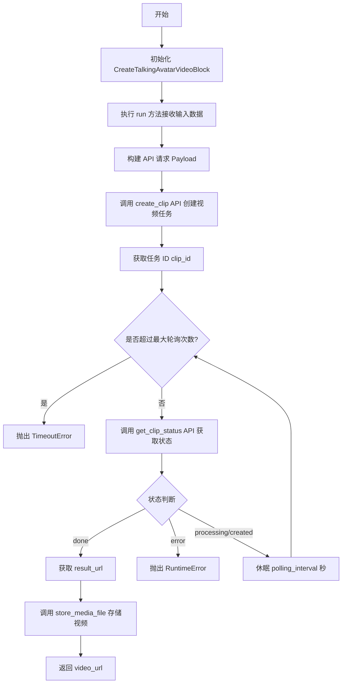
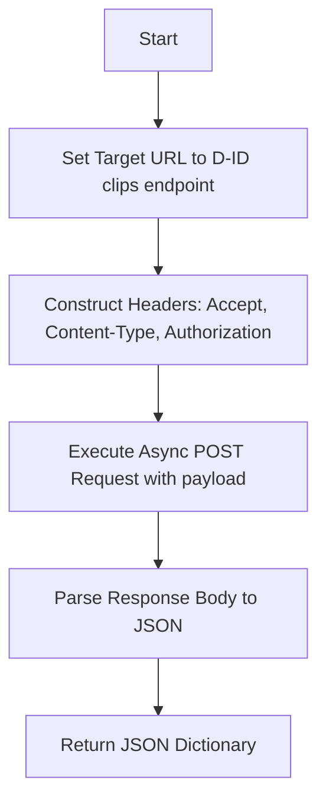
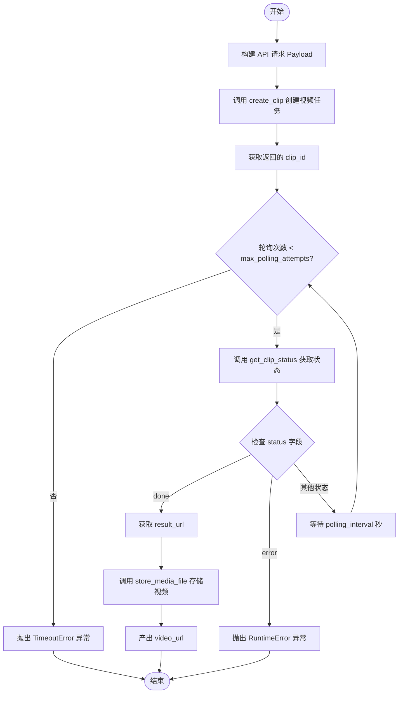

# `AutoGPT\autogpt_platform\backend\backend\blocks\talking_head.py` 详细设计文档

该代码定义了一个集成 D-ID API 的异步 Block 组件，负责根据脚本、语音和呈现者配置创建会说话头像视频，并通过轮询机制监控生成状态，最终将生成的视频存储到工作空间并返回访问 URL。

## 整体流程



## 类结构

```
Block (基类)
└── CreateTalkingAvatarVideoBlock
    ├── Input (内部类)
    └── Output (内部类)
```

## 全局变量及字段


### `TEST_CREDENTIALS`
    
Mock D-ID API key object for testing purposes.

类型：`APIKeyCredentials`
    


### `TEST_CREDENTIALS_INPUT`
    
Dictionary representation of mock credentials used for block input testing.

类型：`dict`
    


### `CreateTalkingAvatarVideoBlock.Input.credentials`
    
The D-ID integration can be used with any API key with sufficient permissions for the blocks it is used on.

类型：`CredentialsMetaInput[Literal[ProviderName.D_ID], Literal["api_key"]]`
    


### `CreateTalkingAvatarVideoBlock.Input.script_input`
    
The text input for the script.

类型：`str`
    


### `CreateTalkingAvatarVideoBlock.Input.provider`
    
The voice provider to use.

类型：`Literal["microsoft", "elevenlabs", "amazon"]`
    


### `CreateTalkingAvatarVideoBlock.Input.voice_id`
    
The voice ID to use, see [available voice IDs](https://agpt.co/docs/platform/using-ai-services/d_id).

类型：`str`
    


### `CreateTalkingAvatarVideoBlock.Input.presenter_id`
    
The presenter ID to use.

类型：`str`
    


### `CreateTalkingAvatarVideoBlock.Input.driver_id`
    
The driver ID to use.

类型：`str`
    


### `CreateTalkingAvatarVideoBlock.Input.result_format`
    
The desired result format.

类型：`Literal["mp4", "gif", "wav"]`
    


### `CreateTalkingAvatarVideoBlock.Input.crop_type`
    
The crop type for the presenter.

类型：`Literal["wide", "square", "vertical"]`
    


### `CreateTalkingAvatarVideoBlock.Input.subtitles`
    
Whether to include subtitles.

类型：`bool`
    


### `CreateTalkingAvatarVideoBlock.Input.ssml`
    
Whether the input is SSML.

类型：`bool`
    


### `CreateTalkingAvatarVideoBlock.Input.max_polling_attempts`
    
Maximum number of polling attempts.

类型：`int`
    


### `CreateTalkingAvatarVideoBlock.Input.polling_interval`
    
Interval between polling attempts in seconds.

类型：`int`
    


### `CreateTalkingAvatarVideoBlock.Output.video_url`
    
The URL of the created video.

类型：`str`
    
    

## 全局函数及方法


### `CreateTalkingAvatarVideoBlock.__init__`

该方法用于初始化 `CreateTalkingAvatarVideoBlock` 实例，通过调用父类 `Block` 的构造函数，配置块的唯一标识、描述、分类、输入输出 Schema 以及用于单元测试的模拟数据和凭证。

参数：

-  `self`：`CreateTalkingAvatarVideoBlock`，类的实例引用。

返回值：`None`，该方法为构造函数，不返回任何值。

#### 流程图

```mermaid
graph TD
    A[Start] --> B[Define Block ID]
    A --> C[Define Description]
    A --> D[Define Categories]
    A --> E[Define Input/Output Schemas]
    A --> F[Define Test Input]
    A --> G[Define Test Output]
    A --> H[Define Test Mocks]
    A --> I[Define Test Credentials]
    
    B & C & D & E & F & G & H & I --> J[Call super().__init__]
    
    J --> K[Initialization Complete]
    K --> L[End]
```

#### 带注释源码

```python
def __init__(self):
    # 调用父类 Block 的初始化方法，配置该块的核心元数据和测试环境
    super().__init__(
        # 定义块的唯一标识符
        id="98c6f503-8c47-4b1c-a96d-351fc7c87dab",
        # 定义块的描述文本，说明其功能（集成 D-ID 创建视频）
        description="This block integrates with D-ID to create video clips and retrieve their URLs.",
        # 定义块的分类，归属于 AI 和多媒体类别
        categories={BlockCategory.AI, BlockCategory.MULTIMEDIA},
        # 指定输入数据的 Schema 定义，绑定内部类 Input
        input_schema=CreateTalkingAvatarVideoBlock.Input,
        # 指定输出数据的 Schema 定义，绑定内部类 Output
        output_schema=CreateTalkingAvatarVideoBlock.Output,
        # 定义单元测试时使用的模拟输入数据
        test_input={
            "credentials": TEST_CREDENTIALS_INPUT,
            "script_input": "Welcome to AutoGPT",
            "voice_id": "en-US-JennyNeural",
            "presenter_id": "amy-Aq6OmGZnMt",
            "driver_id": "Vcq0R4a8F0",
            "result_format": "mp4",
            "crop_type": "wide",
            "subtitles": False,
            "ssml": False,
            "max_polling_attempts": 5,
            "polling_interval": 5,
        },
        # 定义单元测试时预期的输出格式校验逻辑
        test_output=[
            (
                "video_url",
                lambda x: x.startswith(("workspace://", "data:")),
            ),
        ],
        # 定义单元测试时对外部 API 调用的模拟行为，避免实际网络请求
        test_mock={
            "create_clip": lambda *args, **kwargs: {
                "id": "abcd1234-5678-efgh-ijkl-mnopqrstuvwx",
                "status": "created",
            },
            # 使用 data URI 避免在测试期间进行 HTTP 请求
            "get_clip_status": lambda *args, **kwargs: {
                "status": "done",
                "result_url": "data:video/mp4;base64,AAAA",
            },
        },
        # 定义单元测试时使用的模拟凭证对象
        test_credentials=TEST_CREDENTIALS,
    )
```


### `CreateTalkingAvatarVideoBlock.create_clip`

该方法负责调用 D-ID 的外部 API，通过发送 POST 请求来创建一个新的数字人视频片段。

参数：

-  `api_key`：`SecretStr`，用于 D-ID API 认证的密钥
-  `payload`：`dict`，包含脚本、配置、演示者信息等用于生成视频的数据载荷

返回值：`dict`，D-ID API 返回的 JSON 响应数据，通常包含创建的片段 ID 和初始状态

#### 流程图



#### 带注释源码

```python
    async def create_clip(self, api_key: SecretStr, payload: dict) -> dict:
        # 定义 D-ID API 创建视频片段的端点 URL
        url = "https://api.d-id.com/clips"
        # 构造请求头，包含认证信息和内容类型
        headers = {
            "accept": "application/json",
            "content-type": "application/json",
            "authorization": f"Basic {api_key.get_secret_value()}", # 使用 Basic Auth 方式
        }
        # 使用封装好的 Requests 工具发起异步 POST 请求
        response = await Requests().post(url, json=payload, headers=headers)
        # 返回解析后的 JSON 响应数据
        return response.json()
```


### `CreateTalkingAvatarVideoBlock.get_clip_status`

查询 D-ID API 以获取特定视频片段的生成状态和结果信息。

参数：

- `api_key`：`SecretStr`，用于认证 D-ID API 请求的密钥
- `clip_id`：`str`，要查询的视频片段的唯一标识符

返回值：`dict`，包含片段状态（如 'done', 'error'）及结果 URL 的 JSON 响应对象

#### 流程图

```mermaid
flowchart TD
    A[开始] --> B[构建 API URL<br>https://api.d-id.com/clips/{clip_id}]
    B --> C[设置请求头<br>Accept 和 Authorization]
    C --> D[发送异步 GET 请求]
    D --> E[解析响应体为 JSON]
    E --> F[返回 JSON 数据]
```

#### 带注释源码

```python
    async def get_clip_status(self, api_key: SecretStr, clip_id: str) -> dict:
        # 构建 D-ID API 的 clips 端点 URL，附带具体的 clip_id
        url = f"https://api.d-id.com/clips/{clip_id}"
        # 设置请求头，包含接受的内容类型和用于身份验证的 Basic Auth 信息
        headers = {
            "accept": "application/json",
            "authorization": f"Basic {api_key.get_secret_value()}",
        }
        # 使用 Requests 工具发送异步 GET 请求，并返回解析后的 JSON 数据
        response = await Requests().get(url, headers=headers)
        return response.json()
```


### `CreateTalkingAvatarVideoBlock.run`

该方法是 `CreateTalkingAvatarVideoBlock` 的核心执行逻辑，负责与 D-ID API 交互以生成会说话的数字人视频。它首先构建请求载荷，异步调用 API 创建视频片段，随后通过轮询机制检查任务状态，直到任务完成或出错。最后，将生成的视频文件下载并持久化存储到工作区，产出视频的访问 URL。

参数：

-  `input_data`：`CreateTalkingAvatarVideoBlock.Input`，包含生成视频所需的所有配置信息，如脚本内容、语音提供商、演示者ID、轮询间隔和重试次数等。
-  `credentials`：`APIKeyCredentials`，用于 D-ID API 认证的凭据对象，包含 API Key。
-  `execution_context`：`ExecutionContext`，执行上下文对象，用于在执行过程中存储生成的媒体文件。
-  `**kwargs`：`typing.Any`，其他扩展的关键字参数。

返回值：`BlockOutput`，异步生成器，产出包含键 `"video_url"` 和对应存储后视频 URL 的元组。

#### 流程图



#### 带注释源码

```python
async def run(
    self,
    input_data: Input,
    *,
    credentials: APIKeyCredentials,
    execution_context: ExecutionContext,
    **kwargs,
) -> BlockOutput:
    # 1. 构建 D-ID API 所需的请求 Payload
    # 包含脚本配置、语音提供商信息、演示者配置等
    payload = {
        "script": {
            "type": "text",
            "subtitles": str(input_data.subtitles).lower(),  # 布尔值转小写字符串
            "provider": {
                "type": input_data.provider,
                "voice_id": input_data.voice_id,
            },
            "ssml": str(input_data.ssml).lower(),  # 是否为 SSML 格式输入
            "input": input_data.script_input,
        },
        "config": {"result_format": input_data.result_format},
        "presenter_config": {"crop": {"type": input_data.crop_type}},
        "presenter_id": input_data.presenter_id,
        "driver_id": input_data.driver_id,
    }

    # 2. 调用 API 创建视频片段任务
    response = await self.create_clip(credentials.api_key, payload)
    clip_id = response["id"]  # 获取任务 ID 用于后续轮询

    # 3. 轮询检查视频生成状态
    for _ in range(input_data.max_polling_attempts):
        status_response = await self.get_clip_status(credentials.api_key, clip_id)
        
        if status_response["status"] == "done":
            # 4. 如果任务完成，获取视频 URL 并存储到工作区
            video_url = status_response["result_url"]
            stored_url = await store_media_file(
                file=MediaFileType(video_url),
                execution_context=execution_context,
                return_format="for_block_output",
            )
            # 产出视频 URL 并结束执行
            yield "video_url", stored_url
            return
        elif status_response["status"] == "error":
            # 5. 如果任务失败，抛出运行时错误
            raise RuntimeError(
                f"Clip creation failed: {status_response.get('error', 'Unknown error')}"
            )

        # 6. 如果任务仍在进行，等待指定时间后继续轮询
        await asyncio.sleep(input_data.polling_interval)

    # 7. 达到最大轮询次数仍未完成，抛出超时错误
    raise TimeoutError("Clip creation timed out")
```


## 关键组件


### D-ID API 交互层
负责封装与 D-ID 外部服务的所有 HTTP 通信，包括处理认证、发送视频创建请求以及获取异步任务状态。

### 异步轮询机制
实现了非阻塞的状态监控逻辑，通过循环轮询 API 检查视频生成进度，处理重试间隔、最大尝试次数以及超时或错误的异常情况。

### 媒体资源持久化处理器
在视频生成完成后，将远程视频 URL 下载并保存至本地工作区存储，确保输出数据的持久性并将其转换为系统标准的块输出格式。


## 问题及建议


### 已知问题

-   **缺乏 HTTP 状态码检查**：`create_clip` 和 `get_clip_status` 方法中直接调用 `response.json()` 而未先检查 `response.status_code`。若 D-ID API 返回 4xx 或 5xx 错误（例如认证失败或限流），代码将抛出 `JSONDecodeError` 或错误的解析结果，掩盖真实的业务错误。
-   **可能的数据类型转换错误**：在构建 `payload` 时，`subtitles` 和 `ssml` 字段通过 `str(...).lower()` 被转换为字符串（如 `"true"`）。根据 D-ID API 的常见规范，这些字段通常要求布尔值类型。发送字符串可能导致 API 忽略参数或请求失败。
-   **直接字典访问的健壮性不足**：代码使用 `response["id"]` 和 `status_response["result_url"]` 直接访问字典键。如果 API 响应结构发生变化、或者在非预期状态（如某种中间错误状态）下缺少这些字段，将导致 `KeyError`。
-   **硬编码的配置信息**：API 端点 URL（`https://api.d-id.com/clips`）被硬编码在方法内部，这使得代码难以维护，且无法灵活适配不同的运行环境（如测试环境、生产环境或不同区域的服务器）。
-   **同步轮询阻塞资源**：在 `run` 方法中使用固定的 `for` 循环配合 `await asyncio.sleep` 进行轮询。由于视频生成可能耗时较长（默认配置最长 300 秒），这会长时间占用异步执行器的资源，降低系统的并发吞吐量。

### 优化建议

-   **增强 HTTP 错误处理**：在解析 JSON 前，调用 `response.raise_for_status()` 或手动检查状态码。对于 429（限流）等特定错误，可以实现自动重试机制；对于 4xx/5xx 错误，应抛出包含具体错误信息的业务异常。
-   **修正载荷数据类型**：查阅 D-ID API 文档，确认 `script` 对象下的 `subtitles` 和 `ssml` 字段类型。如果要求布尔值，应移除 `str().lower()` 转换，直接传递布尔值，以确保符合接口契约。
-   **引入安全访问与默认值**：使用字典的 `.get()` 方法或 `pydantic` 模型解析响应数据，为关键字段提供默认值或抛出明确的、包含上下文信息的错误，避免因缺少字段导致的程序崩溃。
-   **外部化配置常量**：将 API Base URL、默认超时时间等配置项提取为类常量或通过配置文件注入，提高代码的可维护性和灵活性。
-   **实现指数退避轮询策略**：将固定的 `polling_interval` 改为指数退避算法（例如：首次等待 5s，之后每次翻倍），在保证响应速度的同时减少对 API 的无效高频轮询压力。
-   **添加网络请求超时设置**：在 `Requests().post` 和 `Requests().get` 调用中显式添加 `timeout` 参数，防止因 D-ID 服务无响应而导致当前执行任务永久挂起。
-   **优化长耗时任务架构**：考虑到视频生成是长耗时任务，建议采用“异步任务 + 回调/状态查询”的模式解耦。即 Block 仅负责提交任务并立即返回一个任务 ID，后续由后台服务独立完成轮询和文件存储，前端或下游 Block 通过任务 ID 查询结果，从而大幅提升执行引擎的并发能力。


## 其它


### 设计目标与约束

**设计目标**：
该代码旨在提供一个可重用的异步代码块，用于集成 D-ID API 生成会说话的化身视频。核心目标包括自动处理视频生成的异步轮询机制，将生成的媒体文件持久化存储到用户工作区，并返回内部可访问的 URL，同时隐藏底层 API 调用的复杂性。

**设计约束**：
1. **异步非阻塞**：所有的 I/O 操作（网络请求、文件存储、延时等待）必须基于 Python 的 `asyncio` 实现，以确保在事件循环中运行时不阻塞主线程。
2. **超时控制**：为防止长时间挂起，必须通过 `max_polling_attempts` 和 `polling_interval` 严格限制轮询 D-ID API 的最大等待时长。
3. **输入合规性**：输入参数必须符合 D-ID API 的 payload 结构要求，且必须提供有效的 API Key 凭证。
4. **资源持久化**：不能直接返回外部生成的临时 URL，必须调用 `store_media_file` 将文件下载并存储在系统内部，确保数据的长期可访问性和安全性。

### 错误处理与异常设计

该模块采用了显式状态检查与异常抛出相结合的错误处理策略：

1. **业务逻辑异常**：
   - **API 处理失败**：在轮询过程中，如果 D-ID API 返回的状态为 `"error"`，代码将提取错误详情并抛出 `RuntimeError`，中断执行流程。
   - **任务超时**：如果在达到 `max_polling_attempts` 次轮询后，任务状态仍未变为 `"done"`，代码将抛出 `TimeoutError`，表明视频生成耗时超过预期。

2. **系统级异常**：
   - **网络通信**：依赖底层的 `Requests` 类处理 HTTP 连接错误、DNS 解析失败或 SSL 证书问题，这些异常会直接向上传播。
   - **认证授权**：如果 API Key 无效或过期，D-ID API 可能返回 401 或 403 状态码，由 HTTP 客户端处理并抛出相应的 HTTP 异常。
   - **数据存储**：`store_media_file` 过程中可能出现的磁盘空间不足或写入权限问题将作为异常向上抛出。

### 数据流与状态机

**数据流**：
1. **输入阶段**：接收包含凭证、脚本、配置参数（presenter, voice, format 等）的 `Input` 数据对象。
2. **构建阶段**：将输入对象转换为符合 D-ID API 规范的 JSON `payload` 字典。
3. **提交阶段**：通过 `create_clip` 方法发送 POST 请求，获取任务唯一标识 `clip_id`。
4. **轮询阶段**：
   - 循环调用 `get_clip_status` 方法获取当前状态。
   - 若状态为 `processing`，则通过 `asyncio.sleep` 暂停指定时间间隔。
   - 若状态为 `done`，提取 `result_url`；若为 `error`，提取错误信息。
5. **持久化阶段**：将 `result_url` 指向的文件通过 `store_media_file` 下载并转换为内部存储 URL。
6. **输出阶段**：通过生成器 `yield` 返回键值对 `("video_url", stored_url)`。

**状态机**：
系统在运行过程中主要经历以下状态转换：
*   **Initial (初始化)**: 接收输入参数，构建 Payload。
*   **Submitted (已提交)**: 成功调用创建接口，获得 Clip ID，进入等待期。
*   **Polling (轮询中)**: 
    *   状态循环：`processing` -> 继续轮询。
    *   结束分支 1：`done` -> 进入 **Success** 状态。
    *   结束分支 2：`error` -> 进入 **Failed** 状态。
    *   结束分支 3：达到重试上限 -> 进入 **Timeout** 状态。
*   **Success (成功)**: 文件已存储，结果已产出。
*   **Failed/Timeout (失败/超时)**: 抛出异常，流程终止。

### 外部依赖与接口契约

**外部依赖**：
1. **D-ID API (https://api.d-id.com)**
   - **Create Clip 接口**：`POST /clips`
     - **契约**：需要 `Authorization: Basic <api_key>` 请求头。Body 为 JSON 格式，包含 `script`, `config`, `presenter_id` 等字段。
     - **响应**：返回 JSON，必须包含 `id` (字符串) 和 `status` (字符串) 字段。
   - **Get Clip Status 接口**：`GET /clips/{clip_id}`
     - **契约**：需要 `Authorization` 请求头。
     - **响应**：返回 JSON，包含 `status` (枚举值: created, processing, done, error)。当状态为 `done` 时，必须包含 `result_url` 字段；当状态为 `error` 时，通常包含 `error` 字段描述原因。

2. **内部工具库**
   - `backend.util.request.Requests`: 提供异步 HTTP 请求能力。
   - `backend.util.file.store_media_file`: 负责将远程媒体文件下载并保存至用户工作区。

**接口契约**：
- **输入契约 (`CreateTalkingAvatarVideoBlock.Input`)**：必须包含 `credentials` (MetaInput 类型), `script_input` (字符串), 以及配置参数（如 `provider`, `result_format` 等）。
- **输出契约 (`BlockOutput`)**：生成器产出格式为 `(name: str, value: any)`。本模块保证产出元组的 name 为 `"video_url"`，value 为以 `"workspace://"` 或 `"data:"` 开头的字符串。

### 安全设计

1. **敏感数据保护**：
   - 使用 `pydantic.SecretStr` 类型存储 `api_key`。在打印日志或常规字符串转换时，该类型会自动隐藏密钥值，仅在必须发送 HTTP 请求时通过 `.get_secret_value()` 方法临时解密。
   - API 凭证通过专门的 `CredentialsMetaInput` 结构传递，确保元数据（如 ID、Provider）与实际密钥分离管理。

2. **数据隔离与存储**：
   - 生成的视频文件不直接使用 D-ID 返回的公网 URL（可能过期），而是通过 `store_media_file` 下载并存储在系统内部。利用 `execution_context` 确保文件存储在当前用户的隔离工作空间内，防止跨用户的数据访问。
   - 通过 `test_mock` 机制，在测试环境中使用假数据（如 `data:video/mp4;base64,...`）和模拟函数，避免在自动化测试流程中泄露真实的 API Key或产生不必要的网络费用。

3. **配置验证**：
   - 使用 Pydantic 模型 (`BlockSchemaInput`) 自动验证输入数据的类型和格式（如 `Literal` 限制枚举值，`ge` 限制数值最小值），防止恶意输入导致的后端异常。

    