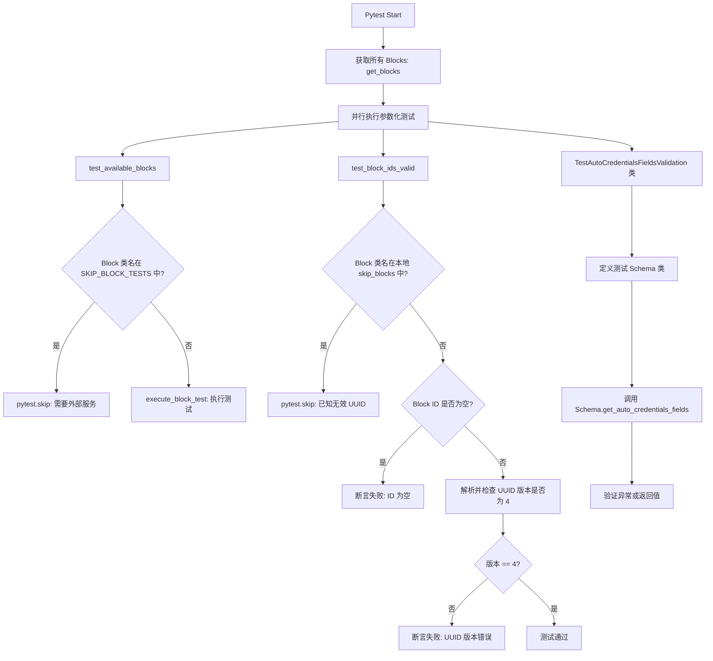
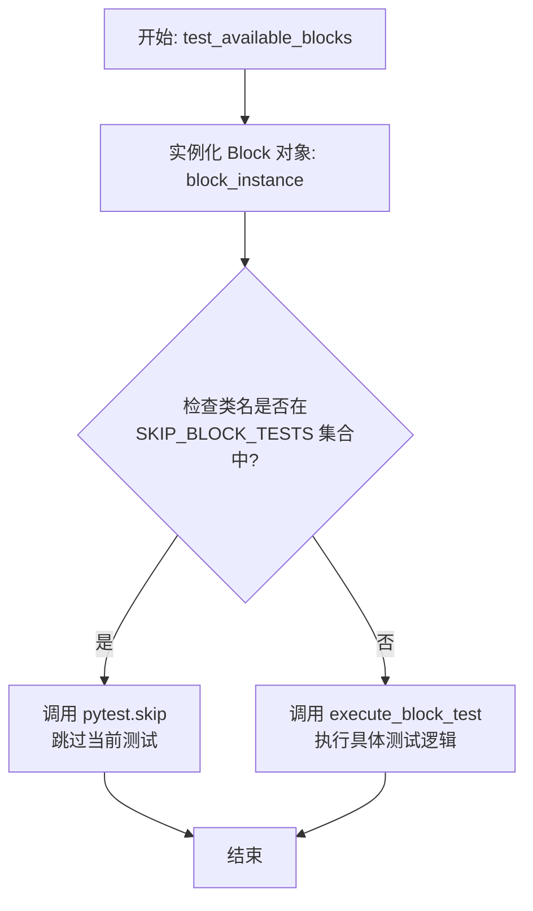
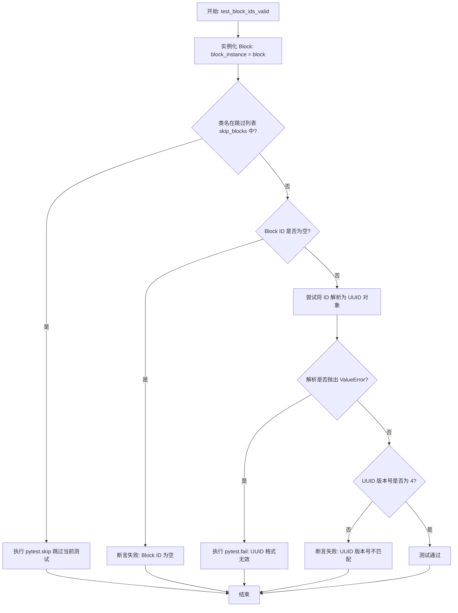
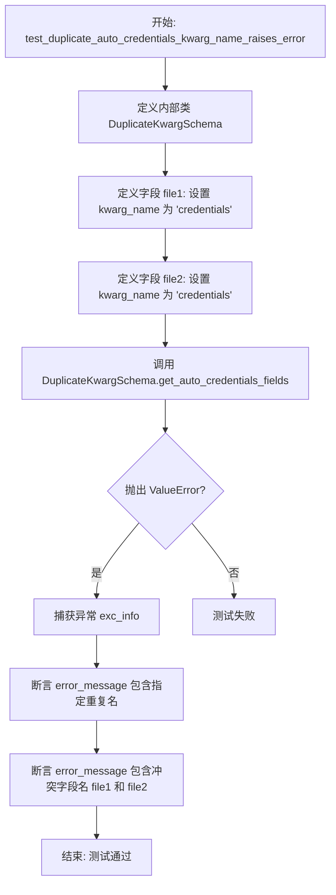
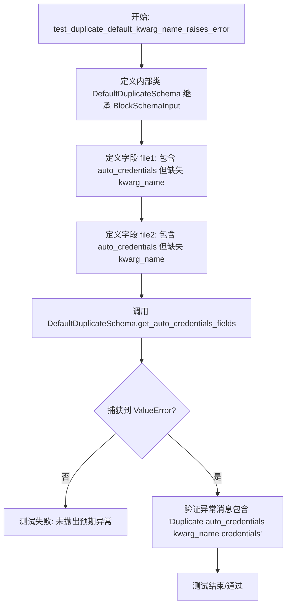

# `AutoGPT\autogpt_platform\backend\backend\blocks\test\test_block.py` 详细设计文档

该文件是基于 pytest 的测试套件，用于验证系统后端中 Block 组件的核心功能与规范。它主要执行三项任务：通过参数化测试所有可用 Block 的基本可用性；验证 Block ID 是否符合 UUID v4 标准；以及针对 BlockSchemaInput 中的自动凭据字段进行严格的逻辑测试，包括检测重复参数名和验证默认值处理机制。

## 整体流程



## 类结构

```
test_blocks.py
├── Global Variables (全局变量)
│   └── SKIP_BLOCK_TESTS
├── Global Functions (全局函数)
│   ├── test_available_blocks
│   └── test_block_ids_valid
└── Classes (类)
    └── TestAutoCredentialsFieldsValidation
        ├── test_duplicate_auto_credentials_kwarg_name_raises_error
        ├── test_unique_auto_credentials_kwarg_names_succeed
        ├── test_default_kwarg_name_is_credentials
        └── test_duplicate_default_kwarg_name_raises_error
```

## 全局变量及字段


### `SKIP_BLOCK_TESTS`
    
A set of Block class names that should be skipped during test execution, typically because they require external services.

类型：`set[str]`
    


    

## 全局函数及方法


### `test_available_blocks`

该函数是一个异步的参数化测试函数，用于遍历系统中所有可用的 Block（功能模块）类，并对每个 Block 实例进行测试执行验证，同时跳过那些明确标记为需要外部服务（如人工介入）的 Block。

参数：

-  `block`：`Type[Block]`，通过 pytest 参数化机制传入的 Block 类类型，用于实例化和测试。

返回值：`None`，测试函数本身不返回数值，通过 pytest 的断言、跳过或异常机制反馈测试结果。

#### 流程图



#### 带注释源码

```python
# 通过 pytest.mark.parametrize 装饰器，对 get_blocks() 返回的所有 Block 类进行参数化测试
# ids=lambda b: b().name 用于在测试报告中使用 Block 的名称作为 ID
@pytest.mark.parametrize("block", get_blocks().values(), ids=lambda b: b().name)
async def test_available_blocks(block: Type[Block]):
    # 实例化当前参数对应的 Block 类
    block_instance = block()
    
    # 检查当前 Block 的类名是否存在于全局跳过集合 SKIP_BLOCK_TESTS 中
    if block_instance.__class__.__name__ in SKIP_BLOCK_TESTS:
        # 如果在跳过列表中（例如需要外部服务或人工介入），则跳过该测试
        pytest.skip(
            f"Skipping {block_instance.__class__.__name__} - requires external service"
        )
    
    # 如果未被跳过，调用辅助函数 execute_block_test 执行该 Block 的具体测试逻辑
    await execute_block_test(block_instance)
```


### `test_block_ids_valid`

这是一个异步测试函数，用于验证系统中所有已注册的 Block（块）的 ID 是否为有效的 UUID 版本 4。该函数通过参数化遍历所有可用的 Block，跳过已知存在无效 UUID 的特定 Block 类，并对剩余 Block 的 ID 进行非空检查、格式有效性检查以及版本号检查。

参数：

- `block`：`Type[Block]`，待测试的 Block 类，由 pytest 参数化装饰器从所有已注册的 Block 中传入。

返回值：`None`，该函数为测试函数，不返回具体值，通过断言来验证逻辑的正确性。

#### 流程图



#### 带注释源码

```python
@pytest.mark.parametrize("block", get_blocks().values(), ids=lambda b: b().name)
async def test_block_ids_valid(block: Type[Block]):
    # 导入 uuid 模块用于验证 UUID 格式
    import uuid

    # 定义跳过列表：包含已知 ID 不符合 UUID4 标准的 Block 类名
    skip_blocks = {
        "GetWeatherInformationBlock",
        "ExecuteCodeBlock",
        # ... (此处省略了大量已知有问题的 Twitter 和 Todoist 相关 Block 类名)
        "Slant3DSlicerBlock",
    }

    # 实例化 Block 类以获取其实例属性
    block_instance = block()

    # 检查当前 Block 是否在跳过列表中
    if block_instance.__class__.__name__ in skip_blocks:
        pytest.skip(
            f"Skipping UUID check for {block_instance.__class__.__name__} - known invalid UUID"
        )

    # 断言 1: 检查 ID 是否非空
    assert block_instance.id, f"Block {block.name} has empty ID"

    # 尝试解析 ID 并验证其格式和版本
    try:
        parsed_uuid = uuid.UUID(block_instance.id)
        # 断言 2: 验证解析后的 UUID 版本是否为 4
        assert (
            parsed_uuid.version == 4
        ), f"Block {block.name} ID is UUID version {parsed_uuid.version}, expected version 4"
    except ValueError:
        # 如果 ID 格式完全无法解析为 UUID，则标记测试失败
        pytest.fail(f"Block {block.name} has invalid UUID format: {block_instance.id}")
```


### `TestAutoCredentialsFieldsValidation.test_duplicate_auto_credentials_kwarg_name_raises_error`

测试当 `BlockSchemaInput` 中存在重复的 `auto_credentials` `kwarg_name` 时，系统能否正确检测并抛出 `ValueError`。

参数：

-   `self`：`TestAutoCredentialsFieldsValidation`，测试类的实例，用于访问测试上下文。

返回值：`None`，该方法为单元测试，通过断言验证行为，无直接返回值。

#### 流程图



#### 带注释源码

```python
    def test_duplicate_auto_credentials_kwarg_name_raises_error(self):
        """Test that duplicate kwarg_name in auto_credentials raises ValueError."""

        # 定义一个内部类 DuplicateKwargSchema，继承自 BlockSchemaInput，用于模拟包含重复配置的场景
        class DuplicateKwargSchema(BlockSchemaInput):
            """Schema with duplicate auto_credentials kwarg_name."""

            # 第一个字段 file1，配置 auto_credentials 并指定 kwarg_name 为 "credentials"
            file1: dict[str, Any] | None = SchemaField(
                description="First file input",
                default=None,
                json_schema_extra={
                    "auto_credentials": {
                        "provider": "google",
                        "type": "oauth2",
                        "scopes": ["https://www.googleapis.com/auth/drive.file"],
                        "kwarg_name": "credentials",
                    }
                },
            )
            # 第二个字段 file2，配置 auto_credentials 并同样指定 kwarg_name 为 "credentials"
            # 这造成了 kwarg_name 的冲突（重复）
            file2: dict[str, Any] | None = SchemaField(
                description="Second file input",
                default=None,
                json_schema_extra={
                    "auto_credentials": {
                        "provider": "google",
                        "type": "oauth2",
                        "scopes": ["https://www.googleapis.com/auth/drive.file"],
                        "kwarg_name": "credentials",  # Duplicate kwarg_name!
                    }
                },
            )

        # 使用 pytest.raises 上下文管理器，预期调用 get_auto_credentials_fields 会抛出 ValueError
        with pytest.raises(ValueError) as exc_info:
            DuplicateKwargSchema.get_auto_credentials_fields()

        # 获取捕获到的异常信息
        error_message = str(exc_info.value)
        # 验证错误消息中明确指出了重复的 kwarg_name 是 'credentials'
        assert "Duplicate auto_credentials kwarg_name 'credentials'" in error_message
        # 验证错误消息中包含了发生冲突的字段名 'file1'
        assert "file1" in error_message
        # 验证错误消息中包含了发生冲突的字段名 'file2'
        assert "file2" in error_message
```


### `TestAutoCredentialsFieldsValidation.test_unique_auto_credentials_kwarg_names_succeed`

该测试方法用于验证在 `BlockSchemaInput` 中定义多个字段时，如果它们的 `auto_credentials` 配置使用了唯一的 `kwarg_name`（关键字参数名），系统能够正确解析这些配置且不会抛出错误。它确保了当凭证参数名称不重复时，字段到凭证参数的映射逻辑能够按预期工作。

参数：

- `self`：`TestAutoCredentialsFieldsValidation`，测试类的实例，用于访问测试上下文和断言方法。

返回值：`None`，该函数为测试方法，不返回具体值，通过内部断言验证逻辑正确性。

#### 流程图

```mermaid
flowchart TD
    A[开始测试: test_unique_auto_credentials_kwarg_names_succeed] --> B[定义内部类 UniqueKwargSchema]
    B --> C[定义字段 file1<br/>设置 auto_credentials.kwarg_name = 'file1_credentials']
    C --> D[定义字段 file2<br/>设置 auto_credentials.kwarg_name = 'file2_credentials']
    D --> E[调用 UniqueKwargSchema.get_auto_credentials_fields]
    E --> F{获取结果 result}
    F --> G[断言 'file1_credentials' 存在于 result]
    G --> H[断言 'file2_credentials' 存在于 result]
    H --> I[断言 result['file1_credentials']['field_name'] == 'file1']
    I --> J[断言 result['file2_credentials']['field_name'] == 'file2']
    J --> K[测试通过]
```

#### 带注释源码

```python
    def test_unique_auto_credentials_kwarg_names_succeed(self):
        """Test that unique kwarg_name values work correctly."""

        # 定义一个继承自 BlockSchemaInput 的内部类，用于模拟包含唯一凭证参数名的 Schema
        class UniqueKwargSchema(BlockSchemaInput):
            """Schema with unique auto_credentials kwarg_name values."""

            # 定义第一个字段 file1，并在 json_schema_extra 中配置 auto_credentials
            # 显式指定 kwarg_name 为 "file1_credentials"
            file1: dict[str, Any] | None = SchemaField(
                description="First file input",
                default=None,
                json_schema_extra={
                    "auto_credentials": {
                        "provider": "google",
                        "type": "oauth2",
                        "scopes": ["https://www.googleapis.com/auth/drive.file"],
                        "kwarg_name": "file1_credentials",
                    }
                },
            )
            # 定义第二个字段 file2，并在 json_schema_extra 中配置 auto_credentials
            # 显式指定 kwarg_name 为 "file2_credentials"，与 file1 不同，确保唯一性
            file2: dict[str, Any] | None = SchemaField(
                description="Second file input",
                default=None,
                json_schema_extra={
                    "auto_credentials": {
                        "provider": "google",
                        "type": "oauth2",
                        "scopes": ["https://www.googleapis.com/auth/drive.file"],
                        "kwarg_name": "file2_credentials",  # Different kwarg_name
                    }
                },
            )

        # 调用 get_auto_credentials_fields 方法，预期不会引发 ValueError
        result = UniqueKwargSchema.get_auto_credentials_fields()

        # 验证返回的结果字典中包含了自定义的 kwarg_name 键
        assert "file1_credentials" in result
        assert "file2_credentials" in result
        # 验证返回的结构中，kwarg_name 正确映射到了对应的字段名
        assert result["file1_credentials"]["field_name"] == "file1"
        assert result["file2_credentials"]["field_name"] == "file2"
```


### `TestAutoCredentialsFieldsValidation.test_default_kwarg_name_is_credentials`

该方法用于验证在 `BlockSchemaInput` 中配置 `auto_credentials` 时，如果未显式指定 `kwarg_name`，系统是否能将其正确默认设置为 'credentials'，并将该配置关联到正确的字段。

参数：

- `self`：`TestAutoCredentialsFieldsValidation`，测试类实例自身

返回值：`None`，无返回值

#### 流程图

```mermaid
flowchart TD
    Start([开始]) --> DefineClass[定义内部类 DefaultKwargSchema]
    DefineClass --> DefineField[定义字段 file 并配置 auto_credentials\n但不指定 kwarg_name]
    DefineField --> CallMethod[调用 DefaultKwargSchema.get_auto_credentials_fields]
    CallMethod --> CheckKey[断言结果字典中包含键 'credentials']
    CheckKey --> CheckValue[断言 result['credentials']['field_name'] 等于 'file']
    CheckValue --> End([结束])
```

#### 带注释源码

```python
def test_default_kwarg_name_is_credentials(self):
    """Test that missing kwarg_name defaults to 'credentials'."""

    # 定义一个内部测试 Schema 类，用于测试默认行为
    class DefaultKwargSchema(BlockSchemaInput):
        """Schema with auto_credentials missing kwarg_name."""

        # 定义字段 file
        file: dict[str, Any] | None = SchemaField(
            description="File input",
            default=None,
            json_schema_extra={
                "auto_credentials": {
                    "provider": "google",
                    "type": "oauth2",
                    "scopes": ["https://www.googleapis.com/auth/drive.file"],
                    # 故意不指定 kwarg_name，预期应默认为 "credentials"
                }
            },
        )

    # 调用方法获取自动凭证字段的处理结果
    result = DefaultKwargSchema.get_auto_credentials_fields()

    # 验证：返回的结果字典中包含默认的键名 "credentials"
    assert "credentials" in result
    # 验证：该键对应的 field_name 属性正确指向了定义的字段 "file"
    assert result["credentials"]["field_name"] == "file"
```


### `TestAutoCredentialsFieldsValidation.test_duplicate_default_kwarg_name_raises_error`

验证当 `BlockSchemaInput` 中的多个字段定义了 `auto_credentials` 但都省略了 `kwarg_name`（导致都使用默认值 "credentials"）时，调用 `get_auto_credentials_fields` 方法会抛出包含特定错误信息的 `ValueError`。

参数：

-  `self`：`TestAutoCredentialsFieldsValidation`，测试类实例，用于访问测试上下文和断言方法。

返回值：`None`，该方法为测试函数，不返回具体值，通过抛出异常或断言来验证逻辑。

#### 流程图



#### 带注释源码

```python
def test_duplicate_default_kwarg_name_raises_error(self):
    """Test that two fields with default kwarg_name raises ValueError."""

    # 定义一个测试用的 Schema 类，继承自 BlockSchemaInput
    class DefaultDuplicateSchema(BlockSchemaInput):
        """Schema where both fields omit kwarg_name, defaulting to 'credentials'."""

        # 定义第一个字段 file1，配置了 auto_credentials 但未指定 kwarg_name
        # 根据 default_kwarg_name_is_credentials 测试的逻辑，这将默认为 "credentials"
        file1: dict[str, Any] | None = SchemaField(
            description="First file input",
            default=None,
            json_schema_extra={
                "auto_credentials": {
                    "provider": "google",
                    "type": "oauth2",
                    "scopes": ["https://www.googleapis.com/auth/drive.file"],
                    # No kwarg_name - defaults to "credentials"
                }
            },
        )
        # 定义第二个字段 file2，同样配置了 auto_credentials 但未指定 kwarg_name
        file2: dict[str, Any] | None = SchemaField(
            description="Second file input",
            default=None,
            json_schema_extra={
                "auto_credentials": {
                    "provider": "google",
                    "type": "oauth2",
                    "scopes": ["https://www.googleapis.com/auth/drive.file"],
                    # No kwarg_name - also defaults to "credentials"
                }
            },
        )

    # 使用 pytest.raises 上下文管理器验证调用 get_auto_credentials_fields 时抛出 ValueError
    with pytest.raises(ValueError) as exc_info:
        DefaultDuplicateSchema.get_auto_credentials_fields()

    # 断言异常消息中包含特定的错误提示，表明是因为重复的默认 kwarg_name 导致的错误
    assert "Duplicate auto_credentials kwarg_name 'credentials'" in str(
        exc_info.value
    )
```


## 关键组件


### Block通用测试执行器

基于pytest参数化机制，自动发现并执行所有注册Block的功能测试，同时集成针对特定Block（如需外部服务的Block）的跳过逻辑。

### Block身份标识(UUID)验证

检查Block实例的ID字段是否为有效的UUID version 4格式，并提供白名单机制以豁免已知存在ID问题的Block。

### 自动凭证参数校验

验证BlockSchema中定义的自动凭证字段配置，确保用于OAuth凭证注入的关键字参数名（kwarg_name）具有唯一性，或正确应用默认值，避免运行时参数冲突。


## 问题及建议


### 已知问题

-   **大量硬编码的跳过列表**：在 `test_block_ids_valid` 函数中，存在一个包含大量 Block 类名的硬编码集合 `skip_blocks`（包括 Twitter、Todoist、Github 等模块的众多 Block）。这表明系统中存在严重的命名规范违背或数据迁移遗留问题，导致测试被迫绕过这些核心组件的 ID 校验。
-   **测试覆盖盲区**：由于上述跳过列表的存在，大量 Block 的 ID 合规性未被测试覆盖，这意味着在生产环境中这些 Block 可能会因为 ID 格式错误（非 UUID4）而导致路由、存储或引用失败。
-   **维护负担**：硬编码的跳过列表分散在代码中（全局 `SKIP_BLOCK_TESTS` 和函数内 `skip_blocks`），每增加一个新的不规范 Block 都需要手动修改测试代码，增加了维护成本。
-   **潜在的 Block 定义缺陷**：`test_available_blocks` 依赖 `get_blocks()` 动态获取所有 Block，如果 `get_blocks()` 的实现发生变化（例如加载顺序、筛选逻辑），测试结果可能变得不稳定。

### 优化建议

-   **修复数据源**：最根本的优化方案是修复 Block 生成逻辑或编写数据迁移脚本，将所有现有 Block（特别是跳过列表中的 Twitter、Todoist 等）的 ID 统一修正为符合 UUID4 标准的格式，从而彻底移除 `test_block_ids_valid` 中的跳过逻辑。
-   **配置化跳过规则**：对于暂时无法修复的 Block，建议将跳过列表从代码中剥离，移至外部配置文件（如 `pytest.ini`、JSON 或 YAML 文件）或数据库标记中。这样可以保持测试代码的整洁，并方便在不同环境（如开发、测试、生产）中灵活配置。
-   **引入 ID 生成基类或装饰器**：在 `Block` 基类或定义阶段引入强制性的 ID 生成机制（例如使用 `uuid4()` 自动赋值），从源头防止非标准 ID 的产生。
-   **统一测试工具函数**：封装通用的 Block 获取和过滤逻辑，避免在多个测试用例中重复实现 `get_blocks()` 和跳过判断逻辑。
-   **增强 `TestAutoCredentialsFieldsValidation`**：虽然当前测试覆盖了重复关键字的情况，但建议进一步增加边界条件测试，例如 `kwarg_name` 为空字符串、非字符串类型或包含特殊字符时的处理逻辑，以提高代码健壮性。


## 其它


### 设计目标与约束

该模块的主要设计目标是确保后端系统中所有已注册的 Block（功能块）满足核心规范：能够正确实例化并执行，拥有符合 UUID4 标准的唯一标识符，以及其输入 Schema（BlockSchemaInput）能够正确处理自动凭证配置，避免关键字参数冲突。约束条件包括：必须基于 `pytest` 异步框架运行，使用参数化测试覆盖所有 Block；特定 Block（如涉及外部服务 Twitter 或遗留 UUID 问题的 Block）被明确排除在特定验证之外，以维持测试套件的稳定性和通过率。

### 错误处理与异常设计

在错误处理方面，该模块采取了预期验证与容错并存的策略。对于 Schema 验证逻辑，设计要求在检测到重复的 `auto_credentials` 关键字参数名称（`kwarg_name`）时抛出 `ValueError`，测试用例使用 `pytest.raises` 捕获并验证此异常。对于 Block ID 验证，若遇到非 UUID4 格式或空 ID，测试通过 `pytest.fail` 显式失败并输出详细错误信息。此外，针对已知的不可用 Block（如需要人工交互）或已知缺陷（如 UUID 格式错误），设计利用 `pytest.skip` 机制优雅地跳过测试，防止测试流程因预期外的外部依赖或遗留问题而中断。

### 数据流与状态机

由于这是一个测试模块，数据流主要表现为参数化驱动的验证流程。首先，通过 `get_blocks()` 工厂获取所有 Block 类的集合。接着，测试框架对集合进行迭代，为每个 Block 实例生成独立的测试上下文。流程进入状态判断阶段：检查 Block 类名是否在跳过列表（`SKIP_BLOCK_TESTS` 或 `skip_blocks`）中，若在列表中则状态转为“跳过”，流程终止；否则进入“验证”状态，执行实例化、ID 格式校验或 Schema 方法调用。最后，根据断言结果判定测试通过或失败。此过程不具备复杂的状态机，但包含严格的条件分支（跳过/执行）和前置条件检查。

### 外部依赖与接口契约

该模块依赖于 `pytest` 提供测试基础设施和参数化功能，以及 Python 标准库 `uuid` 进行格式校验。业务逻辑上，它依赖于 `backend.data.block`、`backend.data.model` 和 `backend.util.test` 模块。接口契约规定：所有的 Block 类必须实现 `Block` 接口，即实例化后必须具备 `id`（字符串类型）、`name`（字符串类型）和 `__class__.__name__` 属性。同时，`BlockSchemaInput` 必须提供 `get_auto_credentials_fields()` 方法，该方法返回包含凭证字段映射的字典，且在配置冲突时需抛出 `ValueError`。

### 测试策略

测试策略采用全量覆盖与针对性隔离相结合的方式。利用 `@pytest.mark.parametrize` 实现对动态获取的 Block 列表的全量自动化测试，确保新注册的 Block 自动纳入测试范围。对于 Schema 验证，采用单元测试策略，通过构造内部类（如 `DuplicateKwargSchema`）模拟边界条件和异常场景。隔离策略体现为显式定义的 `SKIP_BLOCK_TESTS` 和局部 `skip_blocks` 集合，将不稳定的依赖（外部服务调用）和已知的技术债务（无效 UUID）从主测试流程中剥离，保证 CI/CD 流水线的核心稳定性。

    