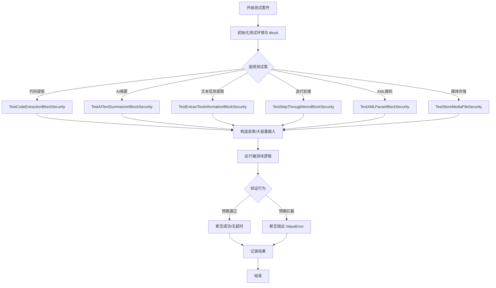
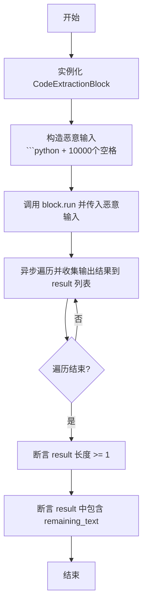
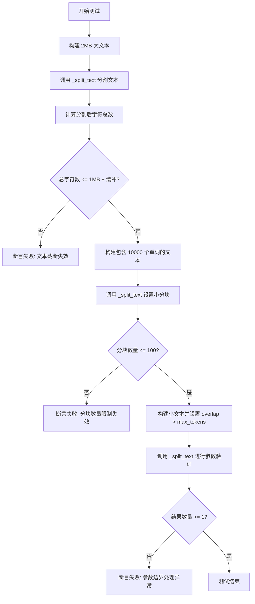
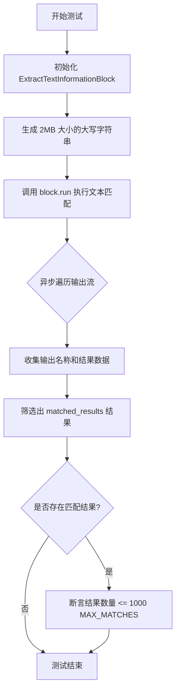
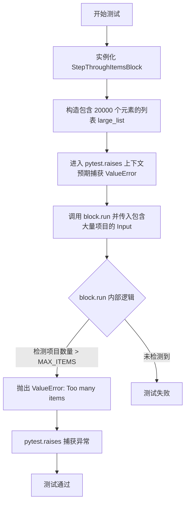
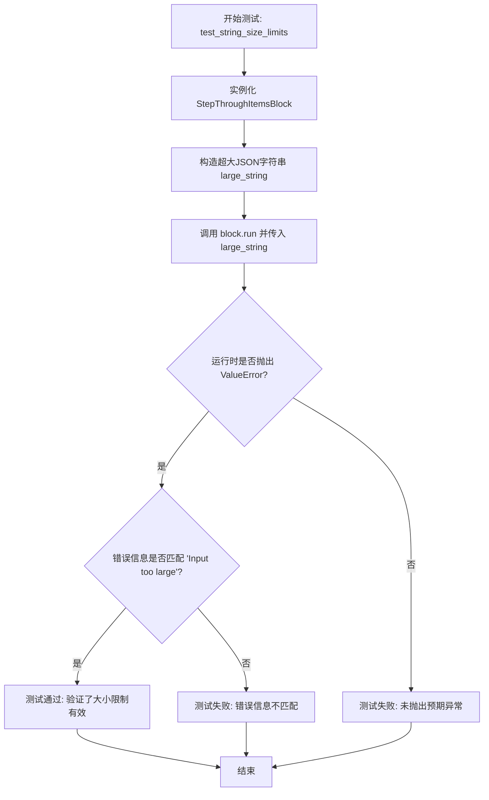
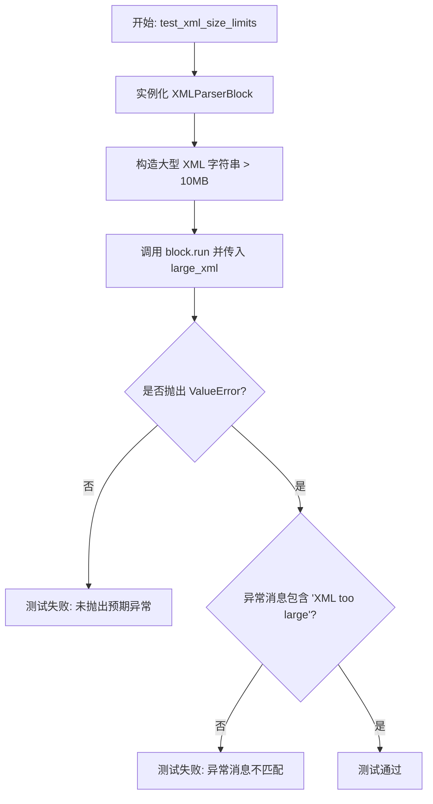
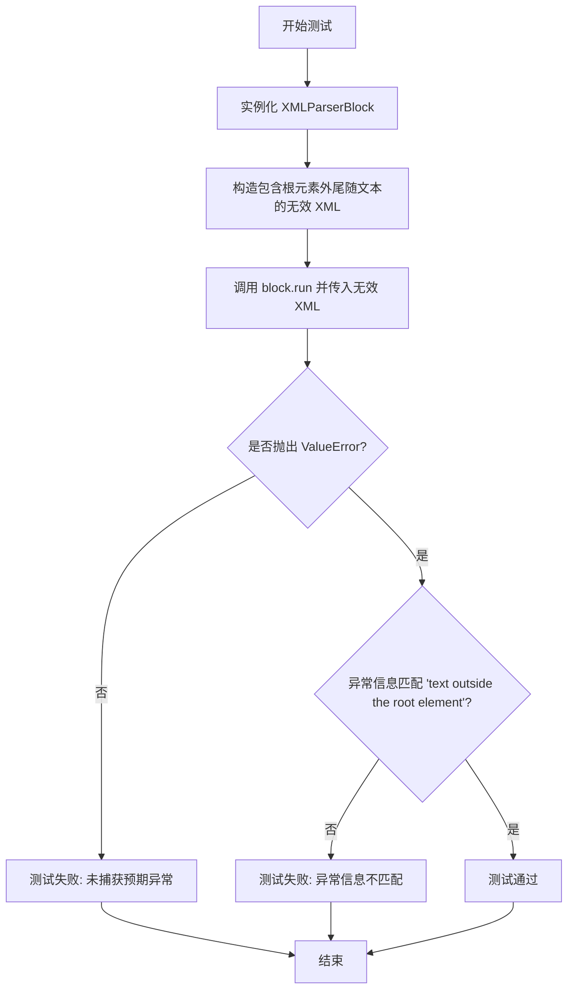
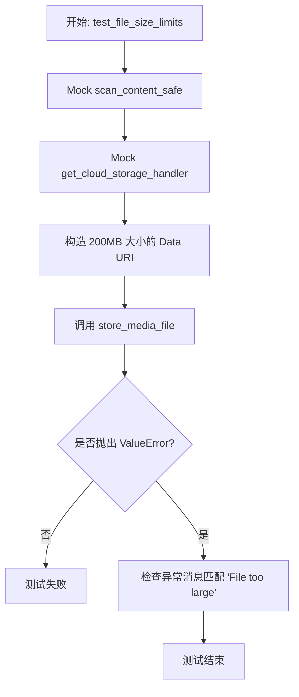
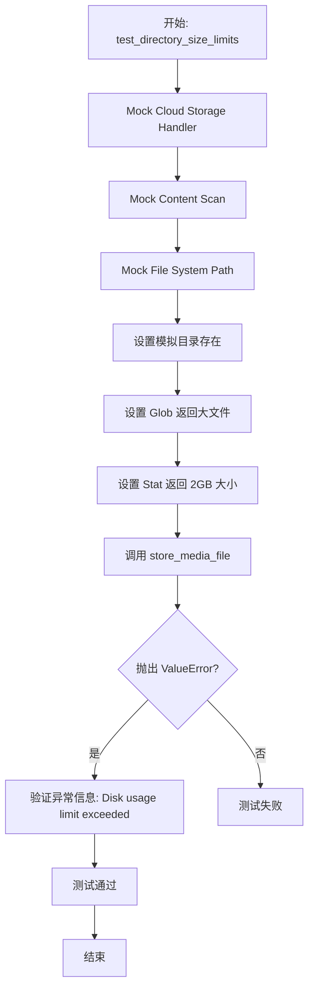

# `AutoGPT\autogpt_platform\backend\backend\blocks\test\test_blocks_dos_vulnerability.py` 详细设计文档

该文件包含针对不同数据处理模块的安全测试用例，旨在验证针对拒绝服务（DoS）漏洞的防护措施，包括正则表达式拒绝服务、内存耗尽限制、大输入限制以及文件存储约束。

## 整体流程



## 类结构

```
TestCodeExtractionBlockSecurity
TestAITextSummarizerBlockSecurity
TestExtractTextInformationBlockSecurity
TestStepThroughItemsBlockSecurity
TestXMLParserBlockSecurity
TestStoreMediaFileSecurity
```

## 全局变量及字段


    

## 全局函数及方法


### `TestCodeExtractionBlockSecurity.test_redos_protection`

该测试方法旨在验证 `CodeExtractionBlock` 中的正则表达式模式能够有效防止正则表达式拒绝服务攻击。它通过构造一个包含大量空格的恶意输入来模拟可能导致 ReDoS 的场景，并断言代码块能够正常执行完毕而不发生挂起，同时输出预期的结果。

参数：

- `self`：`TestCodeExtractionBlockSecurity`，测试类实例，用于访问测试上下文。

返回值：`None`，无显式返回值，主要执行断言逻辑。

#### 流程图



#### 带注释源码

```python
"""Test that the regex patterns don't cause ReDoS."""
# 实例化被测的代码提取块
block = CodeExtractionBlock()

# Test with input that would previously cause ReDoS
# 构造恶意输入：以代码块标记开头，后跟10000个空格
# 这种输入可能会触发某些正则表达式的灾难性回溯
malicious_input = "```python" + " " * 10000  # Large spaces

result = []
# 调用块的 run 方法，传入构造的恶意输入
# 这是一个异步生成器，用于获取执行过程中的输出
async for output_name, output_data in block.run(
    CodeExtractionBlock.Input(text=malicious_input)
):
    # 将输出名称和数据收集到列表中
    result.append((output_name, output_data))

# Should complete without hanging
# 断言程序执行完成并产生了至少一个输出
assert len(result) >= 1
# 断言输出中包含 "remaining_text"，确保处理逻辑正确
assert any(name == "remaining_text" for name, _ in result)
```


### `TestAITextSummarizerBlockSecurity.test_split_text_limits`

该方法用于验证 `AITextTextSummarizerBlock` 中文本分割逻辑的安全性，旨在确保在处理超大文本或产生大量分块时，能够正确应用大小限制和分块数量限制，从而防止内存耗尽攻击。

参数：

- `self`：`TestAITextSummarizerBlockSecurity`，测试类实例，用于访问测试上下文。

返回值：`None`，该方法主要通过断言验证逻辑，不返回具体数值。

#### 流程图



#### 带注释源码

```python
def test_split_text_limits(self):
    """Test that _split_text has proper limits."""
    # 测试文本大小限制
    # 构造一个 2MB 的字符串，模拟潜在的内存耗尽攻击载荷
    large_text = "a" * 2_000_000  # 2MB text
    result = AITextSummarizerBlock._split_text(large_text, 1000, 100)

    # 验证分割后的结果是否被截断到 1MB 左右
    # 允许 1000 个字符的误差，因为分块边界可能会稍微超出限制
    total_chars = sum(len(chunk) for chunk in result)
    assert total_chars <= 1_000_000 + 1000  # Allow for chunk boundary

    # 测试分块数量限制
    # 构造一个能够生成大量分块的文本，每个分块较小
    result = AITextSummarizerBlock._split_text("word " * 10000, 10, 9)
    assert len(result) <= 100  # MAX_CHUNKS limit

    # 测试参数验证
    # 测试当 overlap 参数大于 max_tokens 时的边界情况
    result = AITextSummarizerBlock._split_text(
        "test", 10, 15
    )  # overlap > max_tokens
    assert len(result) >= 1  # Should still work
```


### `TestExtractTextInformationBlockSecurity.test_text_size_limits`

该测试方法用于验证 `ExtractTextInformationBlock` 在处理大文本输入（2MB）时，能够正确应用文本大小限制和最大匹配数量限制（MAX_MATCHES），确保在潜在的资源耗尽攻击下仍能安全运行并返回受控的结果。

参数：

- `self`：`TestExtractTextInformationBlockSecurity`，测试类的实例引用。

返回值：`None`，该方法为异步测试函数，无返回值，通过断言验证行为。

#### 流程图



#### 带注释源码

```python
    async def test_text_size_limits(self):
        """Test text size limits."""
        # 初始化文本提取块实例
        block = ExtractTextInformationBlock()

        # 准备测试数据：生成一个由200万个字符 'a' 组成的字符串（约2MB），模拟大文本输入
        large_text = "a" * 2_000_000  # 2MB

        results = []
        # 运行文本提取块，输入大文本并使用简单的正则模式 "a+" 进行全局匹配
        async for output_name, output_data in block.run(
            ExtractTextInformationBlock.Input(
                text=large_text, pattern=r"a+", find_all=True, group=0
            )
        ):
            # 收集所有的输出结果
            results.append((output_name, output_data))

        # 从结果中筛选出名为 "matched_results" 的数据
        matched_results = [r for name, r in results if name == "matched_results"]
        
        # 如果存在匹配结果，验证其数量是否受到限制
        if matched_results:
            # 断言匹配结果数量不超过 1000，验证 MAX_MATCHES 限制生效
            assert len(matched_results[0]) <= 1000  # MAX_MATCHES limit
```


### `TestExtractTextInformationBlockSecurity.test_dangerous_pattern_timeout`

该方法用于测试 `ExtractTextInformationBlock` 在处理具有潜在危险的复杂正则表达式模式时，是否能够通过超时保护机制防止程序无限期挂起（DoS 攻击）。它构造了一个可能触发性能问题的正向预查模式，并验证该操作是否能在规定的时间（10秒）内完成。

参数：

- `self`: `TestExtractTextInformationBlockSecurity`，测试类的实例，用于访问测试上下文和断言方法。

返回值：`None`，该方法不返回任何值，主要用于通过断言验证行为。

#### 流程图

```mermaid
flowchart TD
    A[开始] --> B[实例化 ExtractTextInformationBlock]
    B --> C[构造测试输入: 'a' * 1000]
    C --> D[获取当前时间作为开始时间 start_time]
    D --> E[执行 block.run<br/>模式: (?=.+)<br/>find_all: True]
    E --> F[遍历并收集执行结果 results]
    F --> G[获取当前时间作为结束时间 end_time]
    G --> H[计算耗时 end_time - start_time]
    H --> I{耗时 < 10秒?}
    I -- 是 --> J[断言通过]
    I -- 否 --> K[断言失败/超时机制失效]
    J --> L[结束]
    K --> L
```

#### 带注释源码

```python
    async def test_dangerous_pattern_timeout(self):
        """Test timeout protection for dangerous patterns."""
        # 实例化被测试的代码块
        block = ExtractTextInformationBlock()

        # Test with potentially dangerous lookahead pattern
        # 构造测试输入字符串，包含1000个字符 'a'
        test_input = "a" * 1000

        # This should complete quickly due to timeout protection
        # 获取事件循环的当前时间作为开始时间
        start_time = asyncio.get_event_loop().time()
        results = []
        # 运行代码块，使用正则表达式模式 r"(?=.+)"
        # 这是一个正向预查模式，可能在某些情况下导致性能问题或 ReDoS
        async for output_name, output_data in block.run(
            ExtractTextInformationBlock.Input(
                text=test_input, pattern=r"(?=.+)", find_all=True, group=0
            )
        ):
            results.append((output_name, output_data))

        # 获取事件循环的当前时间作为结束时间
        end_time = asyncio.get_event_loop().time()
        # Should complete within reasonable time (much less than 5s timeout)
        # 断言执行过程必须在 10 秒内完成，验证超时保护机制有效，防止无限期阻塞
        assert (end_time - start_time) < 10
```


### `TestExtractTextInformationBlockSecurity.test_redos_catastrophic_backtracking`

测试 `ExtractTextInformationBlock` 在处理引发灾难性回溯的正则表达式模式时，是否具有超时保护机制以防止 ReDoS（正则表达式拒绝服务）攻击。

参数：

-  `self`：`TestExtractTextInformationBlockSecurity`，测试类实例本身。

返回值：`None`，该方法主要用于执行断言，无返回值。

#### 流程图

```mermaid
flowchart TD
    A[开始] --> B[实例化 ExtractTextInformationBlock]
    B --> C[定义恶意模式 r\"a+a+b\" 和输入 30个a]
    C --> D[获取事件循环并记录开始时间]
    D --> E[异步执行 block.run]
    E --> F[遍历并收集输出结果到列表]
    F --> G[记录结束时间并计算耗时]
    G --> H{耗时是否小于 6秒?}
    H -- 否 --> I[抛出断言错误: 超时机制失效]
    H -- 是 --> J[提取匹配结果 matched_results]
    J --> K{匹配结果是否为空?}
    K -- 否 --> L[抛出断言错误]
    K -- 是 --> M[测试结束]
```

#### 带注释源码

```python
    async def test_redos_catastrophic_backtracking(self):
        """Test that ReDoS patterns with catastrophic backtracking are handled."""
        # 初始化待测试的 Block
        block = ExtractTextInformationBlock()

        # 定义会导致灾难性回溯的正则表达式模式: (a+)+b
        # 输入 "aaaaaaaaaaaaaaaaaaaaaaaaaaaa" (没有 'b') 会导致指数级的时间复杂度
        dangerous_pattern = r"(a+)+b"
        test_input = "a" * 30  # 30 'a's without a 'b' at the end

        # 预期通过超时保护或模式检测来处理这种情况
        start_time = asyncio.get_event_loop().time() # 记录开始时间
        results = []

        # 异步运行 block，传入恶意输入和模式
        async for output_name, output_data in block.run(
            ExtractTextInformationBlock.Input(
                text=test_input, pattern=dangerous_pattern, find_all=True, group=0
            )
        ):
            results.append((output_name, output_data))

        end_time = asyncio.get_event_loop().time() # 记录结束时间
        elapsed = end_time - start_time # 计算耗时

        # 断言：应该在超时时间内完成（设定6秒为安全阈值）
        # 当前的 threading.Timer 方法不起作用，所以这可能会失败，从而证明需要修复
        assert elapsed < 6, f"Regex took {elapsed}s, timeout mechanism failed"

        # 断言：超时或无匹配时应返回空结果
        matched_results = [r for name, r in results if name == "matched_results"]
        assert matched_results[0] == []  # No matches expected
```


### `TestStepThroughItemsBlockSecurity.test_item_count_limits`

该方法用于验证 `StepThroughItemsBlock` 组件在面对包含大量项目的输入时，能够正确执行输入验证并强制执行最大项目数量限制，从而防止潜在的资源耗尽型拒绝服务攻击。

参数：

- `self`：`TestStepThroughItemsBlockSecurity`，测试类的实例，用于访问测试上下文和断言方法。

返回值：`None`，该方法为异步测试函数，不返回显式值，通过抛出异常或断言来验证行为。

#### 流程图



#### 带注释源码

```python
    async def test_item_count_limits(self):
        """Test maximum item count limits."""
        # 1. 初始化被测试的 Block 实例
        block = StepThroughItemsBlock()

        # 2. 准备测试数据：创建一个包含 20000 个整数的列表
        # 注：根据代码注释，这超过了内部定义的 MAX_ITEMS (10000) 限制
        large_list = list(range(20000))  # Exceeds MAX_ITEMS (10000)

        # 3. 验证异常处理：使用 pytest.raises 确保代码在输入过大时抛出 ValueError
        # 并验证错误消息包含 "Too many items"
        with pytest.raises(ValueError, match="Too many items"):
            # 4. 尝试执行 block.run
            # 预期行为：run 方法在处理输入前会检查列表长度，
            # 一旦发现超限，立即抛出异常，防止后续的迭代操作消耗过多资源
            async for _ in block.run(StepThroughItemsBlock.Input(items=large_list)):
                pass
```


### `TestStepThroughItemsBlockSecurity.test_string_size_limits`

该方法用于测试 `StepThroughItemsBlock` 组件对字符串输入大小的安全限制机制。它通过构造一个超大体积的 JSON 字符串作为输入，验证系统在处理此类输入时能够正确触发校验逻辑，抛出带有匹配错误信息的 `ValueError` 异常，从而防止因处理过大输入数据而导致的拒绝服务或资源耗尽问题。

参数：

- `self`：`TestStepThroughItemsBlockSecurity`，测试类的实例，用于访问测试上下文和断言方法。

返回值：`None`，该函数为异步测试方法，不返回具体数值，主要通过断言验证行为是否符合预期。

#### 流程图



#### 带注释源码

```python
    async def test_string_size_limits(self):
        """Test string input size limits."""
        # 初始化待测试的 Block 实例
        block = StepThroughItemsBlock()

        # 构造一个超大的 JSON 字符串输入，模拟潜在的恶意或异常大数据
        # 这里重复 200,000 次以生成大体积数据
        large_string = '["item"]' * 200000  # Large JSON string

        # 验证 Block 的 run 方法在处理过大字符串时的行为
        # 期望抛出 ValueError，且异常信息包含 "Input too large"
        with pytest.raises(ValueError, match="Input too large"):
            # 尝试执行迭代逻辑，如果安全校验生效，此处应被中断并抛出异常
            async for _ in block.run(StepThroughItemsBlock.Input(items_str=large_string)):
                pass
```


### `TestStepThroughItemsBlockSecurity.test_normal_iteration_works`

该测试方法用于验证 `StepThroughItemsBlock` 在常规操作场景下的迭代逻辑功能是否正常。它确保在实施安全限制（如最大项目数）的情况下，合法的输入列表（如 `[1, 2, 3]`）仍能被正确遍历和处理，且输出数据符合预期的数量和内容。

参数：

- `self`：`TestStepThroughItemsBlockSecurity`，测试类实例，用于访问测试上下文及执行测试逻辑。

返回值：`None`，该方法为异步测试函数，主要执行断言逻辑，无实际返回值。

#### 流程图

```mermaid
flowchart TD
    A[开始: test_normal_iteration_works] --> B[实例化 StepThroughItemsBlock]
    B --> C[准备输入数据 items=[1, 2, 3]]
    C --> D[调用 block.run 并异步遍历输出]
    D --> E{是否有新输出?}
    E -- 是 --> F[收集 output_name 和 output_data]
    F --> G[添加到 results 列表]
    G --> E
    E -- 否 --> H[断言 results 长度为 6]
    H --> I[筛选名称为 item 的数据]
    I --> J[断言项目内容为 [1, 2, 3]]
    J --> K[测试结束]
```

#### 带注释源码

```python
    async def test_normal_iteration_works(self):
        """Test that normal iteration still works."""
        # 1. 初始化被测试的 Block 实例
        block = StepThroughItemsBlock()

        # 2. 初始化结果列表，用于存储运行过程中的输出
        results = []
        
        # 3. 异步执行 block.run，传入包含三个整数的列表作为输入
        #    遍历生成器，收集所有的输出名称和对应的数据
        async for output_name, output_data in block.run(
            StepThroughItemsBlock.Input(items=[1, 2, 3])
        ):
            results.append((output_name, output_data))

        # 4. 验证结果总数是否符合预期
        #    3个项目，每个项目产生 "item" 和 "key" 两个输出，共 6 个
        assert len(results) == 6
        
        # 5. 筛选出名称为 "item" 的输出数据
        items = [data for name, data in results if name == "item"]
        
        # 6. 验证迭代输出的项目内容是否与输入一致
        assert items == [1, 2, 3]
```


### `TestXMLParserBlockSecurity.test_xml_size_limits`

该方法用于测试 `XMLParserBlock` 是否正确实施了 XML 输入大小的安全限制，确保在尝试解析超过特定大小限制（此处为 10MB）的 XML 数据时能够抛出 `ValueError`，从而防止潜在的拒绝服务攻击。

参数：

- `self`：`TestXMLParserBlockSecurity`，测试类的实例，用于访问测试上下文。

返回值：`None`，该方法不返回值，用于断言验证预期行为。

#### 流程图



#### 带注释源码

```python
    async def test_xml_size_limits(self):
        """Test XML input size limits."""
        block = XMLParserBlock()  # 初始化 XML 解析器块实例

        # Test with large XML - need to exceed 10MB limit
        # Each "<item>data</item>" is 17 chars, need ~620K items for >10MB
        # 构造一个超大的 XML 字符串，预计超过 10MB 的大小限制
        large_xml = "<root>" + "<item>data</item>" * 620000 + "</root>"

        # 使用 pytest.raises 检查代码块是否按预期抛出 ValueError
        # 预期异常消息为 "XML too large"
        with pytest.raises(ValueError, match="XML too large"):
            # 运行代码块，传入超大的 XML 数据
            async for _ in block.run(XMLParserBlock.Input(input_xml=large_xml)):
                pass
```


### `TestXMLParserBlockSecurity.test_rejects_text_outside_root`

确保解析器能够为根元素外的无效文本抛出可读的错误信息。

参数：

-  `self`：`TestXMLParserBlockSecurity`，测试类实例本身。

返回值：`None`，无返回值（作为测试方法，主要执行断言逻辑）。

#### 流程图



#### 带注释源码

```python
    async def test_rejects_text_outside_root(self):
        """Ensure parser surfaces readable errors for invalid root text."""
        # 初始化 XML 解析块实例
        block = XMLParserBlock()
        
        # 构造一个格式错误的 XML 字符串，在根元素闭合标签后包含尾随文本 (" trailing")
        invalid_xml = "<root><child>value</child></root> trailing"

        # 使用 pytest.raises 验证执行 run 方法时会抛出 ValueError 异常
        # 并且异常的消息中包含 "text outside the root element"
        with pytest.raises(ValueError, match="text outside the root element"):
            # 运行块逻辑，传入无效 XML
            # 这里预期会直接抛出异常，因此循环体内的 pass 不会被执行
            async for _ in block.run(XMLParserBlock.Input(input_xml=invalid_xml)):
                pass
```


### `TestStoreMediaFileSecurity.test_file_size_limits`

测试 `store_media_file` 函数在处理超大文件时是否能够正确触发文件大小限制错误。

参数：

-  `mock_cloud_storage`：`MagicMock`，模拟的云存储处理器对象，用于模拟文件路径检查等行为。
-  `mock_scan`：`MagicMock`，模拟的内容安全扫描函数，用于模拟安全检查通过的行为。

返回值：`None`，无返回值，主要作用是验证是否抛出预期的异常。

#### 流程图



#### 带注释源码

```python
    @patch("backend.util.file.scan_content_safe")
    @patch("backend.util.file.get_cloud_storage_handler")
    async def test_file_size_limits(self, mock_cloud_storage, mock_scan):
        """Test file size limits."""
        # Mock cloud storage handler - get_cloud_storage_handler is async
        # but is_cloud_path and parse_cloud_path are sync methods
        from unittest.mock import MagicMock

        # 创建模拟的云存储处理器
        mock_handler = MagicMock()
        mock_handler.is_cloud_path.return_value = False

        # 将 get_cloud_storage_handler 设置为返回模拟处理程序的异步函数
        async def async_get_handler():
            return mock_handler

        mock_cloud_storage.side_effect = async_get_handler
        # 模拟安全扫描通过
        mock_scan.return_value = None

        # Test with large base64 content
        # 创建一个 200MB 的大文件内容字符串
        large_content = "a" * (200 * 1024 * 1024)  # 200MB
        large_data_uri = f"data:text/plain;base64,{large_content}"

        # 验证调用 store_media_file 时会抛出 ValueError
        with pytest.raises(ValueError, match="File too large"):
            await store_media_file(
                file=MediaFileType(large_data_uri),
                execution_context=ExecutionContext(
                    user_id="test_user",
                    graph_exec_id="test",
                ),
                return_format="for_local_processing",
            )
```


### `TestStoreMediaFileSecurity.test_directory_size_limits`

该测试方法通过模拟文件系统和云存储环境，验证 `store_media_file` 函数在存储文件前是否正确检查执行目录的磁盘使用限制。它模拟了一个已超过磁盘大小限制（2GB）的目录场景，并断言系统在尝试存储新文件时会抛出 `ValueError` 异常，防止磁盘空间耗尽。

参数：

-  `self`：`TestStoreMediaFileSecurity`，测试类实例。
-  `mock_cloud_storage`：`MagicMock`，`backend.util.file.get_cloud_storage_handler` 的模拟对象，用于伪造云存储处理程序返回非云路径。
-  `mock_scan`：`MagicMock`，`backend.util.file.scan_content_safe` 的模拟对象，用于伪造安全扫描结果。
-  `MockPath`：`MagicMock`，`backend.util.file.Path` 类的模拟对象，用于伪造文件系统行为（如目录存在性检查和文件大小统计）。

返回值：`None`，无返回值。

#### 流程图



#### 带注释源码

```python
    @patch("backend.util.file.Path")
    @patch("backend.util.file.scan_content_safe")
    @patch("backend.util.file.get_cloud_storage_handler")
    async def test_directory_size_limits(self, mock_cloud_storage, mock_scan, MockPath):
        """Test directory size limits."""
        from unittest.mock import MagicMock

        # 1. 设置云存储处理程序模拟，禁用云路径检测
        mock_handler = MagicMock()
        mock_handler.is_cloud_path.return_value = False

        async def async_get_handler():
            return mock_handler

        mock_cloud_storage.side_effect = async_get_handler
        # 2. 设置安全扫描模拟，返回 None 表示无安全威胁
        mock_scan.return_value = None

        # 3. 创建模拟的文件系统路径实例，代表执行目录
        mock_path_instance = MagicMock()
        mock_path_instance.exists.return_value = True

        # 4. 模拟 glob 返回文件列表，并设置单个文件大小为 2GB (超过限制)
        mock_file = MagicMock()
        mock_file.is_file.return_value = True
        mock_file.stat.return_value.st_size = 2 * 1024 * 1024 * 1024  # 2GB
        mock_path_instance.glob.return_value = [mock_file]

        # 5. 使 Path() 调用返回上述模拟实例
        MockPath.return_value = mock_path_instance

        # 6. 断言：当目录大小超限时，调用 store_media_file 应抛出 ValueError
        with pytest.raises(ValueError, match="Disk usage limit exceeded"):
            await store_media_file(
                file=MediaFileType(
                    "data:text/plain;base64,dGVzdA=="
                ),  # 小型测试文件内容
                execution_context=ExecutionContext(
                    user_id="test_user",
                    graph_exec_id="test",
                ),
                return_format="for_local_processing",
            )
```


## 关键组件


### ReDoS Protection Mechanism
针对正则表达式操作实现的超时保护和灾难性回溯检测机制，用于防止正则表达式拒绝服务攻击。

### Memory Exhaustion Controls
通过限制文本总大小、分块数量及匹配结果数量，防止处理大文本时导致的内存耗尽问题。

### File and Storage Security
对媒体文件和目录存储实施的大小限制检查，确保上传和存储内容不超过预设的磁盘或内存配额。

### Input Boundary Constraints
对 XML 解析、列表迭代及字符串输入实施的严格大小和数量验证，确保系统不接收超负荷的输入数据。


## 问题及建议


### 已知问题

-   **Regex 超时机制失效**：在 `TestExtractTextInformationBlockSecurity` 类的测试代码注释中明确指出，当前使用的 `threading.Timer` 方法无法有效中断正在执行的正则表达式匹配操作。这导致对于如 `(a+)+b` 这类引发灾难性回溯的恶意模式，系统无法在超时后强制停止线程，存在严重的 ReDoS（正则表达式拒绝服务）风险。
-   **时间断言的不稳定性**：测试用例中（如 `test_dangerous_pattern_timeout` 和 `test_redos_catastrophic_backtracking`）依赖具体的执行时间（如 `assert (end_time - start_time) < 6`）来验证安全性。这种基于时间的断言在 CI/CD 环境或高负载服务器上容易因系统调度波动而导致测试通过或失败的不确定性，影响对真实安全效果的判断。

### 优化建议

-   **引入支持超时的正则引擎**：建议替换标准 `re` 模块，改用 `regex` 第三方库（或 Python 3.11+ 的增强 `re` 功能），该类库提供了原生的超时参数接口，能够在 C 层面强制中断匹配操作。这是解决 `threading.Timer` 无法中断阻塞式正则匹配问题的最有效方案。
-   **实施静态模式分析与预检**：在执行正则匹配前，增加一层静态分析逻辑，检测模式中是否包含嵌套量词（如 `(a+)+`）、复杂回溯或原子分组缺失等高风险特征。对于检测出的危险模式，直接拒绝执行或提示用户修改，从源头阻断 ReDoS 攻击，而非仅依赖运行时超时。
-   **配置化安全阈值**：代码中散布着硬编码的安全限制（例如 `AITextTextSummarizerBlock` 的 1MB 文本限制、`XMLParserBlock` 的 10MB XML 限制、`StepThroughItemsBlock` 的 10000 项目限制）。建议将这些常量提取到全局配置文件或环境变量中，以便在不同环境（开发、测试、生产）中灵活调整资源配额。
-   **优化大文件处理的内存模型**：针对 `TestStoreMediaFileSecurity` 涉及的文件存储逻辑，虽然测试中使用 Mock，但在实际实现中应确保对大文件（如 200MB 以上）的处理采用流式读写，而非全量加载到内存。同时，`scan_content_safe` 等安全扫描函数也应支持流式扫描，防止在扫描阶段触发内存耗尽。


## 其它


### 设计目标与约束

该模块的主要设计目标是验证后端核心处理组件在面临拒绝服务攻击时的鲁棒性和安全性，确保系统在处理恶意或超大输入时能够维持稳定性。具体约束包括：

1.  **资源限制约束**：
    *   **文本处理**：`AITextSummarizerBlock` 的文本分割限制在 1MB 以内，最大分块数量限制为 100。
    *   **正则匹配**：`ExtractTextInformationBlock` 的匹配结果数量限制在 1000 以内，且单个匹配操作必须在极短时间（如 6 秒）内完成，防止 ReDoS。
    *   **迭代处理**：`StepThroughItemsBlock` 处理的项目数量上限为 10,000 个，输入字符串大小有明确限制。
    *   **XML解析**：`XMLParserBlock` 接受的 XML 输入大小上限为 10MB。
    *   **文件存储**：单个文件大小限制为 200MB（示例测试值），目录总磁盘使用量限制为 1GB。
2.  **执行环境约束**：所有测试代码必须在 Python 异步环境中运行，依赖 `asyncio` 事件循环进行协程调度。
3.  **行为约束**：当输入超过限制时，系统不应崩溃或无限期挂起，而应抛出特定的 `ValueError` 或返回截断/安全的空结果。

### 外部依赖与接口契约

该测试套件依赖于多个外部库和内部模块，通过严格的接口契约进行交互：

1.  **外部库依赖**：
    *   `pytest`：测试框架，用于断言验证和异常捕获（`pytest.raises`）。
    *   `unittest.mock`：用于模拟外部服务（如云存储处理器 `get_cloud_storage_handler` 和病毒扫描 `scan_content_safe`），隔离测试环境。
    *   `asyncio`：提供异步运行时支持，用于精确测量代码执行时间。
2.  **内部模块接口契约**：
    *   `CodeExtractionBlock`：`run` 方法接收包含 `text` 的 `Input` 对象，异步生成 `(output_name, output_data)` 元组。必须保证对于恶意正则输入能快速返回。
    *   `AITextSummarizerBlock`：`_split_text` 静态方法接收文本、最大 token 数和重叠数，返回字符串列表。契约保证输出列表的总长度和元素数量受到严格限制。
    *   `ExtractTextInformationBlock`：`run` 方法接收文本、正则模式等参数。接口契约承诺在处理危险模式时具有超时保护机制。
    *   `XMLParserBlock`：`run` 方法接收 XML 字符串。契约规定在 XML 过大或格式错误（如根节点外有文本）时抛出 `ValueError`。
    *   `store_media_file`：异步函数，接收 `MediaFileType` 和 `ExecutionContext`。契约规定在文件大小或目录配额超限时抛出 `ValueError`。

### 错误处理与异常设计

该设计文档定义了一套明确的异常处理机制，用于在资源耗尽或输入非法时快速失败：

1.  **显式异常抛出**：测试代码期望在以下场景中抛出 `ValueError`，以确保系统在边界条件下的可控性：
    *   **数据量超限**：当迭代项过多、XML过大、文件过大或目录占用空间超限时，抛出包含特定错误信息（如 "Too many items", "XML too large", "Disk usage limit exceeded"）的 `ValueError`。
    *   **数据格式非法**：当 XML 根节点外存在多余文本时，抛出 `ValueError`。
2.  **超时与中断机制**：对于计算密集型任务（如正则匹配），设计要求具备超时中断能力。如果在预定时间内未完成，系统应中止计算并返回结果（通常为空列表），而不是等待操作完成。
3.  **安全兜底策略**：在非致命错误场景下（如文本截断），系统采用“尽力而为”的策略，返回处理后的部分结果（如截断后的文本块），而不是报错，以保证核心流程的连续性。

### 并发与异步模型

代码采用 Python 的 `async/await` 协程模型来模拟和验证高并发下的资源消耗情况：

1.  **异步 I/O 模拟**：所有被测组件的 `run` 方法均为异步生成器，测试代码使用 `async for` 循环来消费输出。这确保了测试环境与生产环境的异步 I/O 特性一致。
2.  **精确时间控制**：利用 `asyncio.get_event_loop().time()` 获取高精度时间戳，用于测量异步操作的耗时。这对于检测 ReDoS（正则表达式拒绝服务）攻击至关重要，因为同步的时间测量可能无法准确反映异步上下文的阻塞情况。
3.  **协程并发安全性**：测试假设被测组件在异步上下文中是线程安全的（或至少是协程安全的），能够处理并发的请求而不会破坏内部状态。Mock 对象（如 `mock_cloud_storage`）被设计为异步函数，以适配异步调用链。

    