# `AutoGPT\autogpt_platform\backend\backend\blocks\test\test_llm.py` 详细设计文档

This is a unit test suite that validates the token usage statistics tracking, retry logic, and response format validation mechanisms for various LLM-related blocks, including structured response generation, text generation, summarization, conversation, and list generation blocks.

## 整体流程

```mermaid
graph TD
    A[开始测试] --> B[初始化测试类与 Mock 对象]
    B --> C{测试类型?}
    C -- 统计追踪测试 --> D[Mock LLM 响应与 Token 数据]
    C -- 验证逻辑测试 --> E[Mock 异常或非预期格式响应]
    D --> F[实例化目标 Block (如 AIStructuredResponseGeneratorBlock)]
    E --> F
    F --> G[调用 Block.run 方法]
    G --> H[收集执行结果与 execution_stats]
    H --> I[执行断言]
    I --> J{断言通过?}
    J -- 是 --> K[测试通过]
    J -- 否 --> L[抛出异常/测试失败]
    K --> M[结束]
```

## 类结构

```
TestLLMStatsTracking (LLM 统计追踪测试类)
├── test_llm_call_returns_token_counts
├── test_ai_structured_response_block_tracks_stats
├── test_ai_text_generator_block_tracks_stats
├── test_stats_accumulation_with_retries
├── test_ai_text_summarizer_multiple_chunks
├── test_ai_text_summarizer_real_llm_call_stats
├── test_ai_conversation_block_tracks_stats
├── test_ai_list_generator_basic_functionality
├── test_merge_llm_stats
└── test_stats_initialization
TestAITextSummarizerValidation (文本摘要验证测试类)
├── test_summarize_chunk_rejects_list_response
├── test_combine_summaries_rejects_list_response
├── test_summarize_chunk_accepts_valid_string_response
├── test_combine_summaries_accepts_valid_string_response
└── test_summarize_chunk_rejects_dict_response
```

## 全局变量及字段


    

## 全局函数及方法


### `TestLLMStatsTracking.test_llm_call_returns_token_counts`

该测试方法用于验证 `llm_call` 函数是否能够正确解析模拟的 OpenAI API 响应，并返回包含准确输入（Prompt）和输出（Completion）Token 计数的 `LLMResponse` 对象。

参数：

- `self`：`TestLLMStatsTracking`，测试类的实例引用。

返回值：`None`，无返回值，主要通过断言来验证代码行为的正确性。

#### 流程图

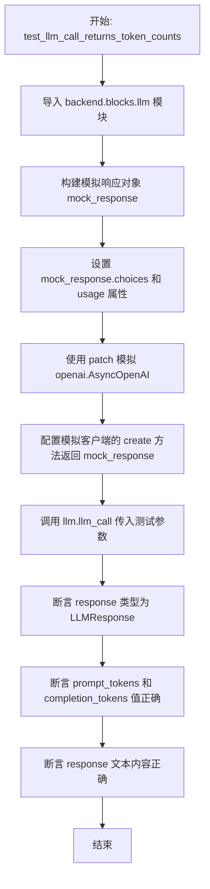

#### 带注释源码

```python
    @pytest.mark.asyncio
    async def test_llm_call_returns_token_counts(self):
        """Test that llm_call returns proper token counts in LLMResponse."""
        # 导入待测试的 llm 模块
        import backend.blocks.llm as llm

        # 模拟 OpenAI 的响应对象
        mock_response = MagicMock()
        # 设置模拟响应中的消息内容 (choices)
        mock_response.choices = [
            MagicMock(message=MagicMock(content="Test response", tool_calls=None))
        ]
        # 设置模拟响应中的 Token 使用统计 (usage)，设定 prompt_tokens 为 10，completion_tokens 为 20
        mock_response.usage = MagicMock(prompt_tokens=10, completion_tokens=20)

        # 使用 patch 上下文管理器替换真实的 openai.AsyncOpenAI 客户端
        with patch("openai.AsyncOpenAI") as mock_openai:
            # 创建一个异步 Mock 客户端实例
            mock_client = AsyncMock()
            mock_openai.return_value = mock_client
            # 设置客户端的 create 方法返回我们预设的 mock_response
            mock_client.chat.completions.create = AsyncMock(return_value=mock_response)

            # 调用实际的 llm_call 函数进行测试
            response = await llm.llm_call(
                credentials=llm.TEST_CREDENTIALS,
                llm_model=llm.DEFAULT_LLM_MODEL,
                prompt=[{"role": "user", "content": "Hello"}],
                max_tokens=100,
            )

            # 验证返回的 response 对象类型是否正确
            assert isinstance(response, llm.LLMResponse)
            # 验证解析出的 prompt_tokens 是否正确
            assert response.prompt_tokens == 10
            # 验证解析出的 completion_tokens 是否正确
            assert response.completion_tokens == 20
            # 验证响应内容是否正确
            assert response.response == "Test response"
```


### `TestLLMStatsTracking.test_ai_structured_response_block_tracks_stats`

该测试函数用于验证 `AIStructuredResponseGeneratorBlock` 类是否能够正确追踪和记录 LLM 调用的统计数据，包括输入 Token 数量、输出 Token 数量、调用次数和重试次数，同时确保能正确解析并输出结构化的 JSON 响应。

参数：

- `self`：`TestLLMStatsTracking`，测试类实例。

返回值：`None`，该函数为异步测试方法，无显式返回值。

#### 流程图

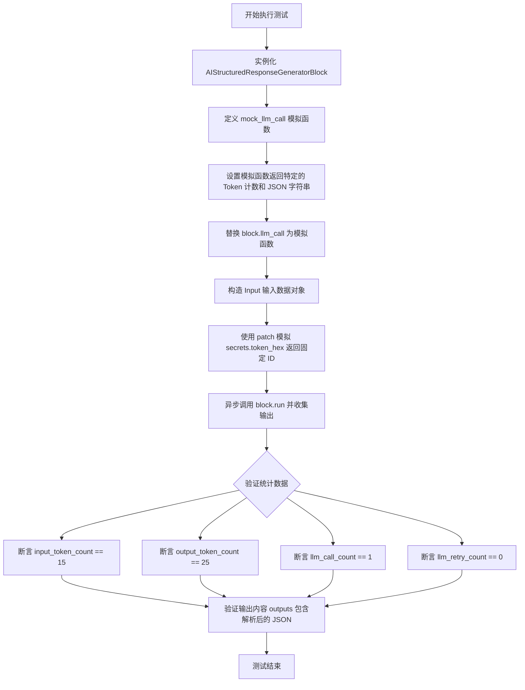

#### 带注释源码

```python
@pytest.mark.asyncio
async def test_ai_structured_response_block_tracks_stats(self):
    """Test that AIStructuredResponseGeneratorBlock correctly tracks stats."""
    from unittest.mock import patch

    import backend.blocks.llm as llm

    # 1. 实例化 AIStructuredResponseGeneratorBlock
    block = llm.AIStructuredResponseGeneratorBlock()

    # 2. 定义一个模拟的 llm_call 方法，用于模拟 LLM 调用并返回预设数据
    async def mock_llm_call(*args, **kwargs):
        return llm.LLMResponse(
            raw_response="",
            prompt=[],
            # 模拟包含特定 ID 的 JSON 输出字符串
            response='<json_output id="test123456">{"key1": "value1", "key2": "value2"}</json_output>',
            tool_calls=None,
            prompt_tokens=15,       # 预设输入 token 数量
            completion_tokens=25,   # 预设输出 token 数量
            reasoning=None,
        )

    # 3. 将 block 的 llm_call 方法替换为上述模拟函数，绕过真实的 LLM 调用
    block.llm_call = mock_llm_call  # type: ignore

    # 4. 准备输入数据，包含提示词、预期格式、模型和凭据
    input_data = llm.AIStructuredResponseGeneratorBlock.Input(
        prompt="Test prompt",
        expected_format={"key1": "desc1", "key2": "desc2"},
        model=llm.DEFAULT_LLM_MODEL,
        credentials=llm.TEST_CREDENTIALS_INPUT,  # type: ignore  # type: ignore
    )

    outputs = {}
    # 5. 使用 patch 上下文管理器固定 secrets.token_hex 的返回值，确保生成的 ID 一致
    # 并异步执行 block.run 方法，收集输出结果
    with patch("secrets.token_hex", return_value="test123456"):
        async for output_name, output_data in block.run(
            input_data, credentials=llm.TEST_CREDENTIALS
        ):
            outputs[output_name] = output_data

    # 6. 校验 block 的 execution_stats 属性是否正确记录了统计数据
    assert block.execution_stats.input_token_count == 15
    assert block.execution_stats.output_token_count == 25
    assert block.execution_stats.llm_call_count == 1
    assert block.execution_stats.llm_retry_count == 0

    # 7. 校验输出结果是否正确解析了 JSON 字符串
    assert "response" in outputs
    assert outputs["response"] == {"key1": "value1", "key2": "value2"}
```


### `TestLLMStatsTracking.test_ai_text_generator_block_tracks_stats`

该测试方法旨在验证 `AITextGeneratorBlock` 能够通过委托机制正确追踪执行统计信息（包括输入 Token 数、输出 Token 数和 LLM 调用次数），通过模拟内部 LLM 调用过程并断言最终的执行状态。

参数：

-  `self`：`TestLLMStatsTracking`，测试类的实例，用于访问测试上下文和断言方法。

返回值：`None`，该函数为异步测试方法，无显式返回值，通过断言结果判断测试是否通过。

#### 流程图

```mermaid
graph TD
    A[Start test] --> B[Instantiate AITextGeneratorBlock]
    B --> C[Define mock_llm_call async function]
    C --> D[In mock: Set block.execution_stats]
    D --> E[In mock: Return 'Generated text']
    E --> F[Patch block.llm_call with mock]
    F --> G[Create Input Data with prompt and credentials]
    G --> H[Call block.run asynchronously]
    H --> I[Iterate and collect outputs]
    I --> J[Assert execution_stats.input_token_count == 30]
    J --> K[Assert execution_stats.output_token_count == 40]
    K --> L[Assert execution_stats.llm_call_count == 1]
    L --> M[Assert outputs['response' == 'Generated text']
    M --> N[End test]
```

#### 带注释源码

```python
    @pytest.mark.asyncio
    async def test_ai_text_generator_block_tracks_stats(self):
        """Test that AITextGeneratorBlock correctly tracks stats through delegation."""
        import backend.blocks.llm as llm

        # 初始化被测试的 Block 实例
        block = llm.AITextGeneratorBlock()

        # Mock the underlying structured response block
        # 定义一个异步函数来模拟 block 内部的 llm_call 方法
        async def mock_llm_call(input_data, credentials):
            # Simulate the structured block setting stats
            # 模拟底层块在执行过程中设置统计数据的行为
            # 这里直接设置 block 的 execution_stats 属性，模拟真实调用后的状态
            block.execution_stats = NodeExecutionStats(
                input_token_count=30,
                output_token_count=40,
                llm_call_count=1,
            )
            # AITextGeneratorBlock.llm_call returns a string
            # 返回生成的文本字符串，模拟 LLM 的响应
            return "Generated text"

        # 将 block 的 llm_call 方法替换为上面的 mock 函数，绕过真实的 LLM API 调用
        block.llm_call = mock_llm_call  # type: ignore

        # Run the block
        # 准备输入数据，包含提示词、模型和凭据
        input_data = llm.AITextGeneratorBlock.Input(
            prompt="Generate text",
            model=llm.DEFAULT_LLM_MODEL,
            credentials=llm.TEST_CREDENTIALS_INPUT,  # type: ignore
        )

        outputs = {}
        # 异步执行 block 的 run 方法，并收集输出
        async for output_name, output_data in block.run(
            input_data, credentials=llm.TEST_CREDENTIALS
        ):
            outputs[output_name] = output_data

        # Check stats
        # 断言：验证 block 的 execution_stats 是否正确记录了输入 token 数量
        assert block.execution_stats.input_token_count == 30
        # 断言：验证 block 的 execution_stats 是否正确记录了输出 token 数量
        assert block.execution_stats.output_token_count == 40
        # 断言：验证 block 的 execution_stats 是否正确记录了 LLM 调用次数
        assert block.execution_stats.llm_call_count == 1

        # Check output - AITextGeneratorBlock returns the response directly, not in a dict
        # 断言：验证输出的内容是否与 mock 函数返回的字符串一致
        assert outputs["response"] == "Generated text"
```


### `TestLLMStatsTracking.test_stats_accumulation_with_retries`

该测试用例用于验证 LLM Block 在遇到错误并重试的场景下，能够正确累积多次 LLM 调用的统计信息（如输入 Token 数、输出 Token 数），并准确记录调用次数和重试次数。

参数：

-  `self`：`TestLLMStatsTracking`，测试类的实例，提供上下文访问。

返回值：`None`，该方法为异步测试函数，不返回具体值，通过断言验证结果。

#### 流程图

```mermaid
graph TD
    A[开始测试] --> B[初始化 AIStructuredResponseGeneratorBlock]
    B --> C[定义 mock_llm_call 及计数器]
    C --> D[设置 mock 逻辑: 第1次返回错误格式, 第2次返回正确格式]
    D --> E[将 mock 函数注入 block.llm_call]
    E --> F[准备输入数据, 设置 retry=2]
    F --> G[Mock secrets.token_hex 返回固定ID]
    G --> H[执行 block.run 运行 Block]
    H --> I{Block 内部执行}
    I -- 第1次调用 --> J[Mock 返回错误格式<br/>Stats: 10 in, 15 out]
    I -- 重试 --> K[第2次调用 Mock 返回正确格式<br/>Stats: 20 in, 25 out]
    J --> I
    K --> L[Block 执行完成]
    L --> M[断言 input_token_count == 30<br/>(10 + 20)]
    M --> N[断言 output_token_count == 40<br/>(15 + 25)]
    N --> O[断言 llm_call_count == 2]
    O --> P[断言 llm_retry_count == 1]
    P --> Q[测试结束]
```

#### 带注释源码

```python
    @pytest.mark.asyncio
    async def test_stats_accumulation_with_retries(self):
        """Test that stats correctly accumulate across retries."""
        import backend.blocks.llm as llm

        # 初始化要测试的 Block 实例
        block = llm.AIStructuredResponseGeneratorBlock()

        # 计数器用于跟踪模拟的 LLM 调用次数
        call_count = 0

        # 定义模拟的 LLM 调用函数
        async def mock_llm_call(*args, **kwargs):
            nonlocal call_count
            call_count += 1

            # 第一次调用返回无效的 JSON 格式，模拟失败情况
            if call_count == 1:
                return llm.LLMResponse(
                    raw_response="",
                    prompt=[],
                    response='<json_output id="test123456">{"wrong": "format"}</json_output>',
                    tool_calls=None,
                    prompt_tokens=10,   # 记录第一次调用的 token 使用量
                    completion_tokens=15,
                    reasoning=None,
                )
            # 第二次调用返回正确的格式，模拟成功情况
            else:
                return llm.LLMResponse(
                    raw_response="",
                    prompt=[],
                    response='<json_output id="test123456">{"key1": "value1", "key2": "value2"}</json_output>',
                    tool_calls=None,
                    prompt_tokens=20,   # 记录第二次调用的 token 使用量
                    completion_tokens=25,
                    reasoning=None,
                )

        # 用模拟函数替换 Block 的 llm_call 方法
        block.llm_call = mock_llm_call  # type: ignore

        # 准备输入数据，设置重试次数为 2
        input_data = llm.AIStructuredResponseGeneratorBlock.Input(
            prompt="Test prompt",
            expected_format={"key1": "desc1", "key2": "desc2"},
            model=llm.DEFAULT_LLM_MODEL,
            credentials=llm.TEST_CREDENTIALS_INPUT,  # type: ignore
            retry=2,
        )

        outputs = {}
        # Mock secrets.token_hex 以返回一致的 ID，避免随机性影响解析
        with patch("secrets.token_hex", return_value="test123456"):
            # 运行 Block
            async for output_name, output_data in block.run(
                input_data, credentials=llm.TEST_CREDENTIALS
            ):
                outputs[output_name] = output_data

        # 验证统计数据 - 应该累积两次调用的结果
        # 输入 Token 应为两次之和: 10 (第一次) + 20 (第二次) = 30
        assert block.execution_stats.input_token_count == 30
        # 输出 Token 应为两次之和: 15 (第一次) + 25 (第二次) = 40
        assert block.execution_stats.output_token_count == 40
        # LLM 调用总数应为 2 (初始调用 + 1 次重试)
        assert block.execution_stats.llm_call_count == 2  # retry_count + 1 = 1 + 1 = 2
        # 重试计数应为 1
        assert block.execution_stats.llm_retry_count == 1
```


### `TestLLMStatsTracking.test_ai_text_summarizer_multiple_chunks`

该测试方法旨在验证 `AITextSummarizerBlock` 在处理需要分块的长文本时，能否正确地累积和追踪多个 LLM 调用的执行统计信息（如输入 Token 数量、输出 Token 数量和调用次数）。通过模拟底层的 LLM 调用并手动注入统计信息，测试确保了分块处理逻辑中的统计合并机制正常工作。

参数：

- `self`：`TestLLMStatsTracking`，测试类的实例引用，用于访问测试上下文和 pytest 的异步功能。

返回值：`None`，该方法是一个单元测试，不返回任何值，通过断言来验证行为。

#### 流程图

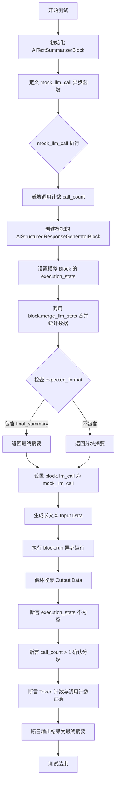

#### 带注释源码

```python
    @pytest.mark.asyncio
    async def test_ai_text_summarizer_multiple_chunks(self):
        """Test that AITextSummarizerBlock correctly accumulates stats across multiple chunks."""
        import backend.blocks.llm as llm

        # 初始化被测试的 Block 实例
        block = llm.AITextSummarizerBlock()

        # Track calls to simulate multiple chunks
        call_count = 0

        # 定义模拟的 LLM 调用函数，用于替换实际的 block.llm_call
        async def mock_llm_call(input_data, credentials):
            nonlocal call_count
            call_count += 1

            # 创建一个模拟的 Block 实例，并设置预设的统计数据
            # 这模拟了单次 LLM 调用后产生的原始统计
            mock_structured_block = llm.AIStructuredResponseGeneratorBlock()
            mock_structured_block.execution_stats = NodeExecutionStats(
                input_token_count=25,
                output_token_count=15,
                llm_call_count=1,
            )

            # 调用主 Block 的 merge_llm_stats 方法
            # 这是测试的核心，验证统计信息是否能正确累加
            block.merge_llm_stats(mock_structured_block)

            # 根据输入数据的 expected_format 判断返回分块摘要还是最终摘要
            if "final_summary" in input_data.expected_format:
                return {"final_summary": "Final combined summary"}
            else:
                return {"summary": f"Summary of chunk {call_count}"}

        # 将模拟函数注入到 Block 中
        block.llm_call = mock_llm_call  # type: ignore

        # Create long text that will be split into chunks
        # 生成长文本以强制 Block 进行分块处理
        long_text = " ".join(["word"] * 1000)  # Moderate size to force ~2-3 chunks

        # 构建输入数据，设置较小的 max_tokens 以触发分块
        input_data = llm.AITextSummarizerBlock.Input(
            text=long_text,
            model=llm.DEFAULT_LLM_MODEL,
            credentials=llm.TEST_CREDENTIALS_INPUT,  # type: ignore
            max_tokens=100,  # Small chunks
            chunk_overlap=10,
        )

        # Run the block
        # 运行 Block 并收集输出
        outputs = {}
        async for output_name, output_data in block.run(
            input_data, credentials=llm.TEST_CREDENTIALS
        ):
            outputs[output_name] = output_data

        # Block finished - now grab and assert stats
        # 验证统计对象已正确生成
        assert block.execution_stats is not None
        # 验证发生了多次调用（确认分块逻辑生效）
        assert call_count > 1  # Should have made multiple calls
        # 验证统计数据不为零
        assert block.execution_stats.llm_call_count > 0
        assert block.execution_stats.input_token_count > 0
        assert block.execution_stats.output_token_count > 0

        # Check output
        # 验证最终输出的内容是否正确
        assert "summary" in outputs
        assert outputs["summary"] == "Final combined summary"
```


### `TestLLMStatsTracking.test_ai_text_summarizer_real_llm_call_stats`

该方法用于测试 `AITextSummarizerBlock` 在模拟真实 LLM 调用场景下，是否能够正确跟踪和记录 token 使用量及调用次数等统计数据。通过模拟 OpenAI 客户端的响应，验证块在处理文本摘要（包括分块摘要和最终摘要）时，统计数据的累加逻辑是否符合预期。

参数：

- `self`：`TestLLMStatsTracking`，测试类的实例，提供对测试上下文的访问。

返回值：`None`，该测试方法不返回任何值，主要用于断言验证。

#### 流程图

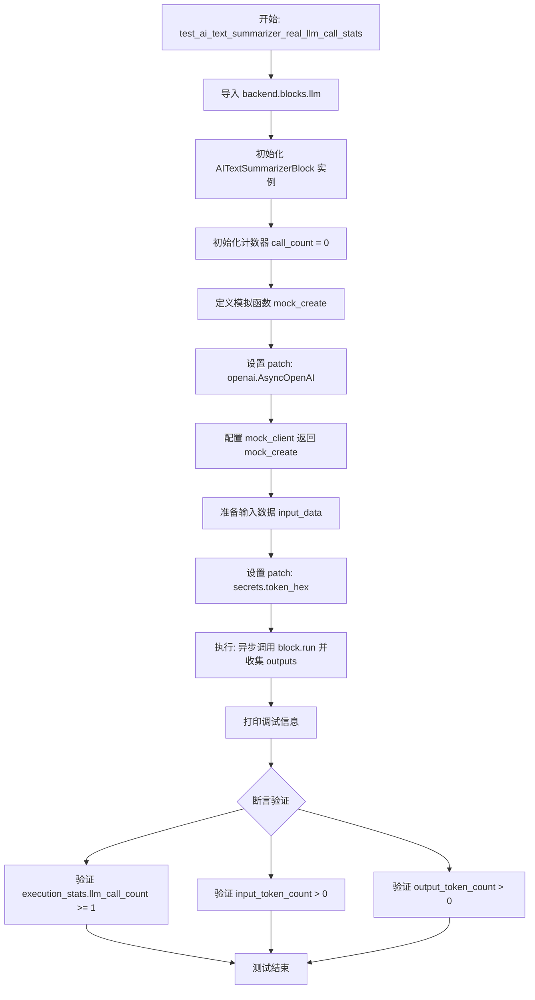

#### 带注释源码

```python
    @pytest.mark.asyncio
    async def test_ai_text_summarizer_real_llm_call_stats(self):
        """Test AITextSummarizer with real LLM call mocking to verify llm_call_count."""
        from unittest.mock import AsyncMock, MagicMock, patch

        import backend.blocks.llm as llm

        # 初始化被测试的 Block 实例
        block = llm.AITextSummarizerBlock()

        # 初始化调用计数器，用于追踪模拟的 LLM 调用次数
        call_count = 0

        # 定义模拟的 OpenAI create 函数
        async def mock_create(*args, **kwargs):
            nonlocal call_count
            call_count += 1

            # 创建模拟的响应对象
            mock_response = MagicMock()
            # 根据调用次数返回不同的响应内容
            # 第一次调用通常对应分块摘要
            if call_count == 1:
                mock_response.choices = [
                    MagicMock(
                        message=MagicMock(
                            content='<json_output id="test123456">{"summary": "Test chunk summary"}</json_output>',
                            tool_calls=None,
                        )
                    )
                ]
            # 后续调用对应最终摘要
            else:
                mock_response.choices = [
                    MagicMock(
                        message=MagicMock(
                            content='<json_output id="test123456">{"final_summary": "Test final summary"}</json_output>',
                            tool_calls=None,
                        )
                    )
                ]
            # 模拟返回的 token 使用情况
            mock_response.usage = MagicMock(prompt_tokens=50, completion_tokens=30)
            return mock_response

        # 使用 patch 替换 openai.AsyncOpenAI，避免真实的 API 调用
        with patch("openai.AsyncOpenAI") as mock_openai:
            mock_client = AsyncMock()
            mock_openai.return_value = mock_client
            # 设置模拟客户端的 create 方法为我们定义的 mock_create
            mock_client.chat.completions.create = mock_create

            # 准备测试输入数据
            # 使用非常短的文本以避免内部分块，主要测试总结阶段的统计
            input_data = llm.AITextSummarizerBlock.Input(
                text="This is a short text.",
                model=llm.DEFAULT_LLM_MODEL,
                credentials=llm.TEST_CREDENTIALS_INPUT,  # type: ignore
                max_tokens=1000,  # Large enough to avoid chunking
            )

            # Mock secrets.token_hex 以确保生成的 ID 一致，便于测试
            with patch("secrets.token_hex", return_value="test123456"):
                outputs = {}
                # 执行 block.run 方法并收集输出
                async for output_name, output_data in block.run(
                    input_data, credentials=llm.TEST_CREDENTIALS
                ):
                    outputs[output_name] = output_data

            # 打印调试信息，帮助定位问题
            print(f"Actual calls made: {call_count}")
            print(f"Block stats: {block.execution_stats}")
            print(f"LLM call count: {block.execution_stats.llm_call_count}")

            # 断言验证：
            # 1. LLM 调用次数应至少为 1 次 (包含 chunk summary 和 final summary)
            assert block.execution_stats.llm_call_count >= 1
            # 2. 输入 token 计数应大于 0
            assert block.execution_stats.input_token_count > 0
            # 3. 输出 token 计数应大于 0
            assert block.execution_stats.output_token_count > 0
```


### `TestLLMStatsTracking.test_ai_conversation_block_tracks_stats`

Test that AIConversationBlock correctly tracks stats.

参数：

-   `self`：`TestLLMStatsTracking`，测试类的实例，用于访问测试上下文。

返回值：`None`，该方法执行断言验证逻辑，不返回具体数值。

#### 流程图

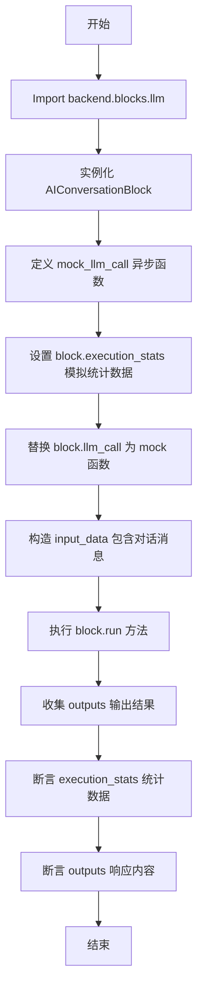

#### 带注释源码

```python
        @pytest.mark.asyncio
        async def test_ai_conversation_block_tracks_stats(self):
            """Test that AIConversationBlock correctly tracks stats."""
            import backend.blocks.llm as llm

            # 1. 实例化要测试的 AIConversationBlock
            block = llm.AIConversationBlock()

            # 2. 模拟 llm_call 方法，模拟 LLM 调用并手动设置统计数据
            async def mock_llm_call(input_data, credentials):
                # 在 block 实例上设置执行统计信息
                block.execution_stats = NodeExecutionStats(
                    input_token_count=100,
                    output_token_count=50,
                    llm_call_count=1,
                )
                return {"response": "AI response to conversation"}

            # 3. 将 block 的 llm_call 方法替换为模拟函数
            block.llm_call = mock_llm_call  # type: ignore

            # 4. 准备输入数据，包含一系列对话消息和模型配置
            input_data = llm.AIConversationBlock.Input(
                messages=[
                    {"role": "user", "content": "Hello"},
                    {"role": "assistant", "content": "Hi there!"},
                    {"role": "user", "content": "How are you?"},
                ],
                model=llm.DEFAULT_LLM_MODEL,
                credentials=llm.TEST_CREDENTIALS_INPUT,  # type: ignore
            )

            # 5. 异步运行 block，收集输出结果
            outputs = {}
            async for output_name, output_data in block.run(
                input_data, credentials=llm.TEST_CREDENTIALS
            ):
                outputs[output_name] = output_data

            # 6. 验证统计信息是否正确记录
            assert block.execution_stats.input_token_count == 100
            assert block.execution_stats.output_token_count == 50
            assert block.execution_stats.llm_call_count == 1

            # 7. 验证输出内容是否符合预期
            assert outputs["response"] == "AI response to conversation"
```


### `TestLLMStatsTracking.test_ai_list_generator_basic_functionality`

该函数是一个异步测试方法，旨在验证 `AIListGeneratorBlock` 是否能正确工作。它测试了该块在生成列表项目时，能够准确跟踪执行统计数据（如输入/输出 Token 数量和 LLM 调用次数），并能正确返回结构化的响应数据，包括生成的完整列表、逐个流式输出的列表项以及提示词。

参数：

-  `self`：`TestLLMStatsTracking`，测试类的实例，用于访问测试上下文和断言方法。

返回值：`None`，该函数为测试方法，不返回具体的业务数据，通过断言来验证逻辑正确性。

#### 流程图

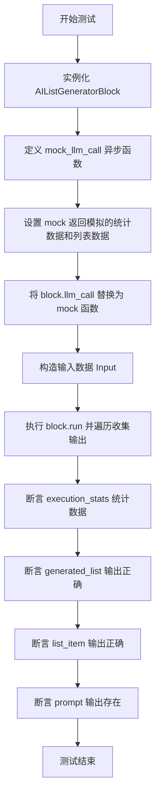

#### 带注释源码

```python
    @pytest.mark.asyncio
    async def test_ai_list_generator_basic_functionality(self):
        """Test that AIListGeneratorBlock correctly works with structured responses."""
        import backend.blocks.llm as llm

        # 1. 初始化被测试的 Block
        block = llm.AIListGeneratorBlock()

        # 2. 定义一个异步模拟函数来替代真实的 llm_call
        async def mock_llm_call(input_data, credentials):
            # 模拟 LLM 调用后更新的执行统计数据
            block.execution_stats = NodeExecutionStats(
                input_token_count=50,
                output_token_count=30,
                llm_call_count=1,
            )
            # 返回预期的结构化响应数据
            return {"list": ["item1", "item2", "item3"]}

        # 3. 将 Block 的 llm_call 方法替换为模拟函数
        block.llm_call = mock_llm_call  # type: ignore

        # 4. 准备输入数据
        input_data = llm.AIListGeneratorBlock.Input(
            focus="test items",
            model=llm.DEFAULT_LLM_MODEL,
            credentials=llm.TEST_CREDENTIALS_INPUT,  # type: ignore
            max_retries=3,
        )

        # 5. 运行 Block 并收集输出
        outputs = {}
        async for output_name, output_data in block.run(
            input_data, credentials=llm.TEST_CREDENTIALS
        ):
            outputs[output_name] = output_data

        # 6. 验证统计数据是否按预期记录
        assert block.execution_stats.input_token_count == 50
        assert block.execution_stats.output_token_count == 30
        assert block.execution_stats.llm_call_count == 1

        # 7. 验证输出内容
        # 检查生成的完整列表
        assert outputs["generated_list"] == ["item1", "item2", "item3"]
        # 检查是否包含流式输出的列表项（outputs 字典保留最后一次值）
        assert "list_item" in outputs
        # 验证列表项是否为最后一个元素
        assert outputs["list_item"] == "item3"
        # 验证是否包含 prompt
        assert "prompt" in outputs
```


### `TestLLMStatsTracking.test_merge_llm_stats`

该测试方法用于验证 `merge_llm_stats` 方法的正确性，确保执行统计数据（如输入/输出 token 数量、LLM 调用次数、重试次数）以及提示词历史能够正确地从源块（source block）合并到目标块（destination block）中。

参数：

-   `self`：`TestLLMStatsTracking`，测试类的实例，提供上下文访问权限。

返回值：`None`，该方法为异步测试函数，不返回任何值，主要用于执行断言验证。

#### 流程图

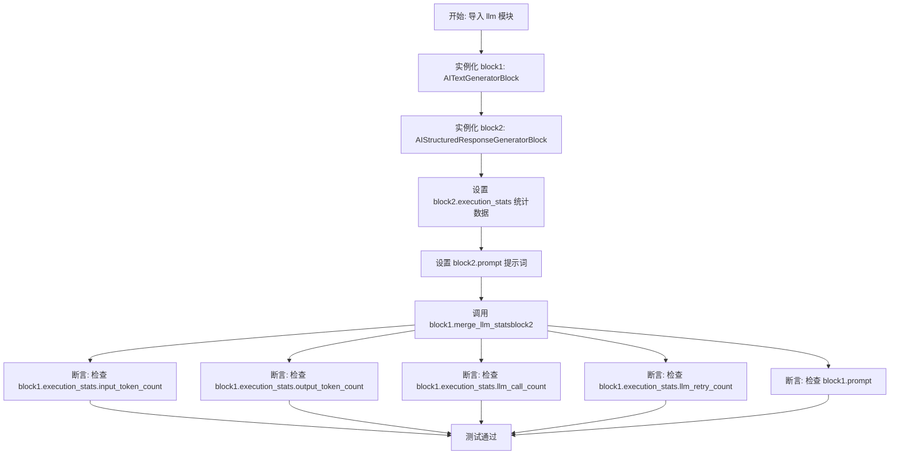

#### 带注释源码

```python
@pytest.mark.asyncio
async def test_merge_llm_stats(self):
    """Test the merge_llm_stats method correctly merges stats from another block."""
    # 导入需要测试的 LLM 模块
    import backend.blocks.llm as llm

    # 初始化两个不同类型的 Block 实例作为测试对象
    block1 = llm.AITextGeneratorBlock()
    block2 = llm.AIStructuredResponseGeneratorBlock()

    # 在 block2 上设置预设的执行统计数据
    block2.execution_stats = NodeExecutionStats(
        input_token_count=100,
        output_token_count=50,
        llm_call_count=2,
        llm_retry_count=1,
    )
    # 在 block2 上设置预设的提示词数据
    block2.prompt = [{"role": "user", "content": "Test"}]

    # 调用核心测试方法：将 block2 的状态合并到 block1
    block1.merge_llm_stats(block2)

    # 验证统计数据是否正确合并到 block1
    assert block1.execution_stats.input_token_count == 100
    assert block1.execution_stats.output_token_count == 50
    assert block1.execution_stats.llm_call_count == 2
    assert block1.execution_stats.llm_retry_count == 1
    
    # 验证提示词是否正确合并到 block1
    assert block1.prompt == [{"role": "user", "content": "Test"}]
```


### `TestLLMStatsTracking.test_stats_initialization`

该方法用于测试 `AIStructuredResponseGeneratorBlock` 在未预先存在统计数据时，能否正确初始化并更新执行统计信息（如输入/输出 Token 数量和调用次数）。

参数：

- `self`：`TestLLMStatsTracking`，测试类的实例，由 pytest 框架自动注入。

返回值：`None`，该方法为异步测试函数，无显式返回值，主要通过断言验证逻辑。

#### 流程图

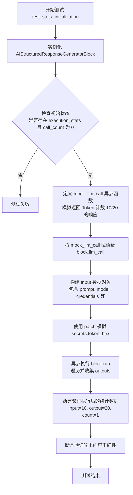

#### 带注释源码

```python
    @pytest.mark.asyncio
    async def test_stats_initialization(self):
        """Test that blocks properly initialize stats when not present."""
        import backend.blocks.llm as llm

        # 1. 初始化被测试的 Block 实例
        block = llm.AIStructuredResponseGeneratorBlock()

        # 2. 验证 Block 初始化时 stats 属性存在且初始计数为 0
        assert hasattr(block, "execution_stats")
        assert block.execution_stats.llm_call_count == 0

        # 3. 定义模拟的 LLM 调用函数
        async def mock_llm_call(*args, **kwargs):
            # 返回预设的 LLMResponse，包含特定的 Token 计数 (input=10, output=20)
            return llm.LLMResponse(
                raw_response="",
                prompt=[],
                response='<json_output id="test123456">{"result": "test"}</json_output>',
                tool_calls=None,
                prompt_tokens=10,
                completion_tokens=20,
                reasoning=None,
            )

        # 4. 将模拟函数赋值给 Block 的 llm_call 方法，以替换实际的外部调用
        block.llm_call = mock_llm_call  # type: ignore

        # 5. 准备 Block 运行所需的输入数据
        input_data = llm.AIStructuredResponseGeneratorBlock.Input(
            prompt="Test",
            expected_format={"result": "desc"},
            model=llm.DEFAULT_LLM_MODEL,
            credentials=llm.TEST_CREDENTIALS_INPUT,  # type: ignore
        )

        # 6. 执行 Block 运行逻辑
        outputs = {}
        # Mock secrets.token_hex 以确保生成固定的 ID，避免随机性影响测试
        with patch("secrets.token_hex", return_value="test123456"):
            async for output_name, output_data in block.run(
                input_data, credentials=llm.TEST_CREDENTIALS
            ):
                outputs[output_name] = output_data

        # 7. 验证 Block 运行结束后的统计数据是否正确累加
        assert block.execution_stats is not None
        assert block.execution_stats.input_token_count == 10
        assert block.execution_stats.output_token_count == 20
        assert block.execution_stats.llm_call_count == 1  # Should have exactly 1 call

        # 8. 验证输出结果的正确性
        assert "response" in outputs
        assert outputs["response"] == {"result": "test"}
```


### `TestAITextSummarizerValidation.test_summarize_chunk_rejects_list_response`

该测试方法验证了`AITextSummarizerBlock`在调用底层LLM进行文本摘要时，如果返回的摘要内容是列表类型而不是预期的字符串类型，能够正确地抛出带有描述性信息的`ValueError`异常。

参数：

- `self`：`TestAITextSummarizerValidation`，测试类的实例。

返回值：`None`，该函数主要用于执行断言验证，没有返回值。

#### 流程图

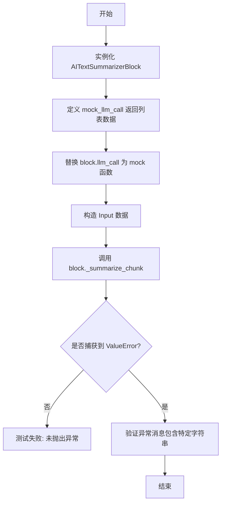

#### 带注释源码

```python
@pytest.mark.asyncio
async def test_summarize_chunk_rejects_list_response(self):
    """Test that _summarize_chunk raises ValueError when LLM returns a list instead of string."""
    import backend.blocks.llm as llm

    # 初始化被测试的 Block
    block = llm.AITextSummarizerBlock()

    # Mock llm_call to return a list instead of a string
    # 定义一个异步的 mock 函数，模拟 LLM 返回了错误的数据类型（列表）而非字符串
    async def mock_llm_call(input_data, credentials):
        # Simulate LLM returning a list when it should return a string
        return {"summary": ["bullet point 1", "bullet point 2", "bullet point 3"]}

    # 使用 mock 函数替换 block 的 llm_call 方法
    block.llm_call = mock_llm_call  # type: ignore

    # Create input data
    # 创建测试用的输入数据对象
    input_data = llm.AITextSummarizerBlock.Input(
        text="Some text to summarize",
        model=llm.DEFAULT_LLM_MODEL,
        credentials=llm.TEST_CREDENTIALS_INPUT,  # type: ignore
        style=llm.SummaryStyle.BULLET_POINTS,
    )

    # Should raise ValueError with descriptive message
    # 使用 pytest.raises 捕获预期的 ValueError
    with pytest.raises(ValueError) as exc_info:
        await block._summarize_chunk(
            "Some text to summarize",
            input_data,
            credentials=llm.TEST_CREDENTIALS,
        )

    # 验证捕获到的异常消息包含预期的错误描述
    error_message = str(exc_info.value)
    assert "Expected a string summary" in error_message
    assert "received list" in error_message
    assert "incorrectly formatted" in error_message
```


### `TestAITextSummarizerValidation.test_combine_summaries_rejects_list_response`

测试当大语言模型（LLM）在合并摘要步骤中返回列表而不是预期的字符串时，`_combine_summaries` 方法能够正确地引发带有描述性错误信息的 `ValueError`。

参数：

- `self`：`TestAITextSummarizerValidation`，测试类的实例。

返回值：`None`，该测试方法主要用于验证异常抛出，无显式返回值。

#### 流程图

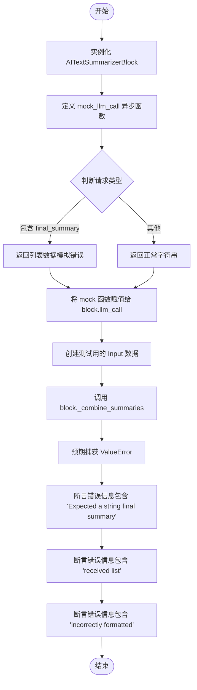

#### 带注释源码

```python
    @pytest.mark.asyncio
    async def test_combine_summaries_rejects_list_response(self):
        """Test that _combine_summaries raises ValueError when LLM returns a list instead of string."""
        import backend.blocks.llm as llm

        # 实例化待测试的文本摘要块
        block = llm.AITextSummarizerBlock()

        # Mock llm_call to return a list instead of a string
        async def mock_llm_call(input_data, credentials):
            # 检查当前是否是最终摘要的调用请求
            if "final_summary" in input_data.expected_format:
                # Simulate LLM returning a list when it should return a string
                # 模拟 LLM 错误地返回了一个列表，而不是字符串
                return {
                    "final_summary": [
                        "bullet point 1",
                        "bullet point 2",
                        "bullet point 3",
                    ]
                }
            else:
                # 对于非最终摘要请求，返回有效字符串
                return {"summary": "Valid summary"}

        # 将 mock 函数替换 block 的 llm_call 方法
        block.llm_call = mock_llm_call  # type: ignore

        # Create input data
        # 准备输入数据，指定模型和凭据
        input_data = llm.AITextSummarizerBlock.Input(
            text="Some text to summarize",
            model=llm.DEFAULT_LLM_MODEL,
            credentials=llm.TEST_CREDENTIALS_INPUT,  # type: ignore
            style=llm.SummaryStyle.BULLET_POINTS,
            max_tokens=1000,
        )

        # Should raise ValueError with descriptive message
        # 预期调用 _combine_summaries 时会抛出 ValueError
        with pytest.raises(ValueError) as exc_info:
            await block._combine_summaries(
                ["summary 1", "summary 2"],
                input_data,
                credentials=llm.TEST_CREDENTIALS,
            )

        # 获取并验证异常消息的具体内容
        error_message = str(exc_info.value)
        assert "Expected a string final summary" in error_message
        assert "received list" in error_message
        assert "incorrectly formatted" in error_message
```


### `TestAITextSummarizerValidation.test_summarize_chunk_accepts_valid_string_response`

测试 `AITextSummarizerBlock` 的 `_summarize_chunk` 方法是否能够正确处理并接受返回有效字符串的 LLM 响应。

参数：

-   `self`：`TestAITextSummarizerValidation`，测试类实例，由 pytest 框架自动传入。

返回值：`None`，该方法是测试用例，主要执行断言逻辑，不返回业务数据。

#### 流程图

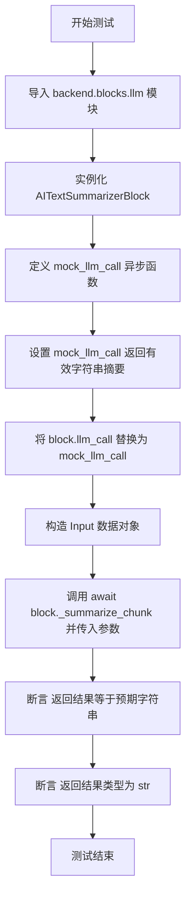

#### 带注释源码

```python
    @pytest.mark.asyncio
    async def test_summarize_chunk_accepts_valid_string_response(self):
        """Test that _summarize_chunk accepts valid string responses."""
        # 导入待测试的 LLM 模块
        import backend.blocks.llm as llm

        # 初始化文本摘要块实例
        block = llm.AITextSummarizerBlock()

        # Mock llm_call to return a valid string
        # 定义异步 Mock 函数，模拟 LLM 调用返回一个有效的字符串摘要
        async def mock_llm_call(input_data, credentials):
            return {"summary": "This is a valid string summary"}

        # 将 block 的 llm_call 方法替换为 Mock 函数，避免实际调用 LLM API
        block.llm_call = mock_llm_call  # type: ignore

        # Create input data
        # 构造输入数据对象，包含待摘要文本、模型和凭证
        input_data = llm.AITextSummarizerBlock.Input(
            text="Some text to summarize",
            model=llm.DEFAULT_LLM_MODEL,
            credentials=llm.TEST_CREDENTIALS_INPUT,  # type: ignore
        )

        # Should not raise any error
        # 调用待测试的 _summarize_chunk 方法，预期不应抛出异常
        result = await block._summarize_chunk(
            "Some text to summarize",
            input_data,
            credentials=llm.TEST_CREDENTIALS,
        )

        # 验证返回的内容是否符合预期
        assert result == "This is a valid string summary"
        # 验证返回值的类型是否为字符串
        assert isinstance(result, str)
```


### `TestAITextSummarizerValidation.test_combine_summaries_accepts_valid_string_response`

这是一个测试方法，用于验证 `AITextSummarizerBlock` 的 `_combine_summaries` 方法在接收到有效的字符串响应时能够正常工作。该方法通过模拟 `llm_call` 返回一个有效的字符串，确保摘要合并逻辑能正确处理并返回该字符串，而不会抛出异常。

参数：

- `self`：`TestAITextSummarizerValidation`，测试类的实例，用于访问测试上下文和 pytest 断言方法。

返回值：`None`，测试方法本身不返回值，通过内部的断言语句来判断测试是否通过。

#### 流程图

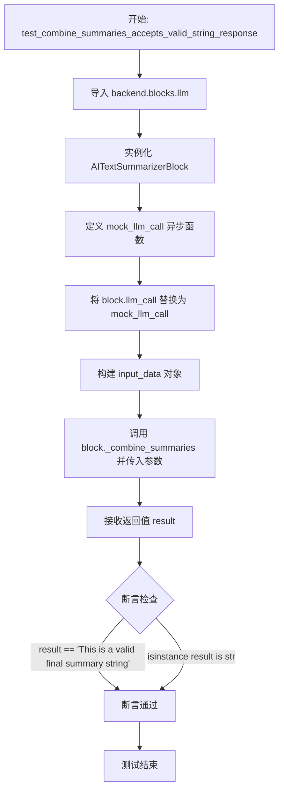

#### 带注释源码

```python
    @pytest.mark.asyncio
    async def test_combine_summaries_accepts_valid_string_response(self):
        """Test that _combine_summaries accepts valid string responses."""
        import backend.blocks.llm as llm

        # 实例化被测试的 Block
        block = llm.AITextSummarizerBlock()

        # 定义一个模拟的 llm_call 函数，用于替代真实的 LLM 调用
        # 这里模拟返回一个包含字符串 final_summary 的字典
        async def mock_llm_call(input_data, credentials):
            return {"final_summary": "This is a valid final summary string"}

        # 将 block 的 llm_call 方法替换为 mock 函数
        block.llm_call = mock_llm_call  # type: ignore

        # 创建输入数据对象
        input_data = llm.AITextSummarizerBlock.Input(
            text="Some text to summarize",
            model=llm.DEFAULT_LLM_MODEL,
            credentials=llm.TEST_CREDENTIALS_INPUT,  # type: ignore
            max_tokens=1000,
        )

        # 调用被测试的方法 _combine_summaries
        # 此时该方法内部会调用被 mock 掉的 llm_call
        # 预期不应抛出任何异常
        result = await block._combine_summaries(
            ["summary 1", "summary 2"],  # 待合并的摘要列表
            input_data,
            credentials=llm.TEST_CREDENTIALS,
        )

        # 验证返回值是否为预期的字符串
        assert result == "This is a valid final summary string"
        # 验证返回值类型是否为字符串
        assert isinstance(result, str)
```


### `TestAITextSummarizerValidation.test_summarize_chunk_rejects_dict_response`

该函数是一个测试用例，用于验证 `AITextSummarizerBlock` 的私有方法 `_summarize_chunk` 在 LLM 返回字典而非预期的字符串摘要时，能够正确抛出包含描述性信息的 `ValueError`。

参数：

- `self`：`TestAITextSummarizerValidation`，测试类的实例，用于访问测试上下文和断言方法。

返回值：`None`，测试函数通常不返回值，主要通过断言验证行为。

#### 流程图

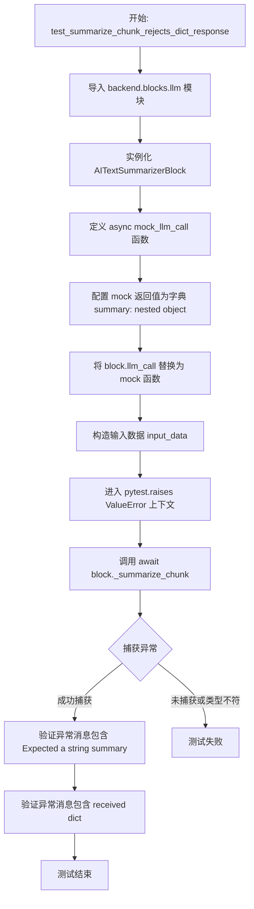

#### 带注释源码

```python
    @pytest.mark.asyncio
    async def test_summarize_chunk_rejects_dict_response(self):
        """Test that _summarize_chunk raises ValueError when LLM returns a dict instead of string."""
        import backend.blocks.llm as llm

        # 初始化待测试的 Block 实例
        block = llm.AITextSummarizerBlock()

        # Mock llm_call to return a dict instead of a string
        # 定义一个模拟函数，模拟 LLM 返回非预期的字典类型数据
        async def mock_llm_call(input_data, credentials):
            # 返回字典而不是字符串，模拟错误的响应格式
            return {"summary": {"nested": "object", "with": "data"}}

        # 将实例的 llm_call 方法替换为 mock 函数
        block.llm_call = mock_llm_call  # type: ignore

        # Create input data
        # 创建测试所需的输入数据对象
        input_data = llm.AITextSummarizerBlock.Input(
            text="Some text to summarize",
            model=llm.DEFAULT_LLM_MODEL,
            credentials=llm.TEST_CREDENTIALS_INPUT,  # type: ignore
        )

        # Should raise ValueError
        # 使用 pytest.raises 验证是否抛出了 ValueError 异常
        with pytest.raises(ValueError) as exc_info:
            # 调用待测试的私有方法，预期会抛出异常
            await block._summarize_chunk(
                "Some text to summarize",
                input_data,
                credentials=llm.TEST_CREDENTIALS,
            )

        # 获取异常信息
        error_message = str(exc_info.value)
        # 验证异常消息中包含预期的提示信息
        assert "Expected a string summary" in error_message
        assert "received dict" in error_message
```


## 关键组件


### LLM Stats Tracking
一种用于累积和跟踪 LLM 使用指标的机制，包括输入/输出 Token 数、总调用次数和重试次数，存储在 `NodeExecutionStats` 对象中。

### AIStructuredResponseGeneratorBlock
负责生成结构化 JSON 响应的核心 LLM 交互组件，在调用期间处理 API 请求、自动重试和统计跟踪。

### AITextSummarizerBlock
一种专门的 Block，通过将输入文本处理为分块、为每个分块生成总结并合并这些总结来创建最终摘要，同时聚合来自子任务的统计信息。

### Stats Merging
一种辅助逻辑，用于将 `NodeExecutionStats`（Token 计数和调用计数）从一个 Block 实例聚合计入另一个，以确保在复杂工作流中准确的资源跟踪。

### Response Validation
一种防御性编程机制，在 `AITextSummarizerBlock` 中实现，用于在进一步处理前验证 LLM 返回的数据符合预期的类型（例如字符串 vs 列表/字典）。

### Retry Mechanism
一种容错机制，允许 LLM Block 在遇到无效或错误响应时自动重新尝试调用，并确保统计信息在多次尝试中被正确累积。


## 问题及建议


### 已知问题

-   **脆弱的输入验证逻辑**：测试代码显示 `AITextSummarizerBlock` 严格检查返回值是否为 `str` 类型（`isinstance(result, str)`）。LLM 的输出具有不确定性，依赖强类型检查而非内容解析或 Schema 验证，容易因为模型输出的细微格式差异（如返回包装类或稍微不同的 JSON 结构）导致流程意外中断。
-   **统计数据合并的维护成本高**：`merge_llm_stats` 方法通过手动字段复制和累加来合并 `NodeExecutionStats`。如果未来统计对象增加新字段，所有调用合并逻辑的地方都需要同步修改，存在漏更新的风险，违反了开闭原则。
-   **解析逻辑与 ID 生成紧密耦合**：测试中通过 `patch("secrets.token_hex")` 强制固定 ID 以通过测试，这暗示生产代码依赖特定的 ID 格式（如 `<json_output id="...">`）来提取 JSON 内容。这种将随机 ID 生成与内容解析绑定的设计非常脆弱，限制了 ID 生成策略的灵活性，且增加了测试的复杂性。
-   **测试代码存在大量重复样板代码**：多个测试用例中重复构建 Mock 对象（如 `MagicMock` 配置、`AsyncMock` 设置），这导致测试代码冗长，当 Mock 接口变更时需要修改多处，增加了维护负担。

### 优化建议

-   **引入基于 Schema 的输出解析**：建议使用 Pydantic 或类似的数据验证库来解析 LLM 响应，替代简单的 `isinstance` 检查。这样不仅可以验证数据结构，还能自动处理类型转换，提高对 LLM 输出变化的容错率。
-   **重构统计追踪机制**：使用 Python 装饰器或上下文管理器来自动捕获和统计 LLM 调用信息，减少在业务代码中手动修改 `execution_stats` 的次数。同时，为 `NodeExecutionStats` 实现 `__iadd__` 或 `merge` 方法，封装合并逻辑，避免手动字段操作。
-   **解耦内容解析与 ID 生成**：重构 `AIStructuredResponseGeneratorBlock` 的响应提取逻辑，改用更鲁棒的标记（如特定的开始/结束 Token）或流式解析器，而不是依赖生成的随机 ID 进行匹配。这将消除对 `secrets.token_hex` 的依赖，简化测试逻辑。
-   **利用 Pytest Fixtures 提取公共 Mock 逻辑**：将通用的 Mock OpenAI 客户端、LLM 响应构建器以及测试常量提取到 `conftest.py` 的 Fixture 中。这能显著精简测试代码，提高测试用例的可读性和维护性。


## 其它


### 设计目标与约束

*   **设计目标**：
    *   **统计精确性**：确保所有 LLM 交互块（如 `AITextGeneratorBlock`, `AIStructuredResponseGeneratorBlock` 等）能够准确追踪和记录 Token 使用情况（`input_token_count`, `output_token_count`）以及调用次数（`llm_call_count`）和重试次数（`llm_retry_count`）。
    *   **容错与重试机制**：系统设计需支持在 LLM 返回格式不正确（如 JSON 格式错误）时的自动重试，并确保重试过程中的统计数据能正确累加，而非覆盖。
    *   **数据一致性验证**：对 LLM 返回的数据进行严格类型校验（例如摘要块必须返回字符串而非列表或字典），防止下游处理因类型错误而崩溃。
*   **设计约束**：
    *   **异步执行**：所有 LLM 调用和块执行必须基于异步 I/O (`async/await`)，以适应高并发场景。
    *   **依赖隔离**：核心业务逻辑需与具体的 LLM 提供商（如 OpenAI）解耦，通过依赖注入或 Mock 进行测试，确保在不调用真实 API 的情况下验证逻辑。
    *   **状态管理**：每个执行块实例必须维护独立的 `NodeExecutionStats` 状态，在执行生命周期内实时更新。

### 错误处理与异常设计

*   **异常抛出策略**：
    *   **类型验证错误**：当 LLM 返回的数据类型不符合预期（例如摘要块期望字符串但收到列表）时，系统抛出 `ValueError`。错误消息需明确指出期望类型、实际类型及上下文（如 "Expected a string summary, received list"），以便快速定位问题。
    *   **业务逻辑错误**：在重试耗尽后仍无法获得有效响应（如结构化响应块无法解析 JSON），应由业务层处理，测试代码通过模拟多次失败来验证这一边界条件。
*   **错误恢复**：
    *   **自动重试**：对于可重试的错误（如 LLM 返回格式错误但不影响网络连接），系统通过 `retry` 参数控制重试次数，并在重试过程中累加统计计数器（`llm_retry_count`），确保统计数据的完整性。

### 数据流与状态管理

*   **数据流**：
    1.  **输入阶段**：用户输入（Prompt, Credentials, Model Config）进入 Block。
    2.  **处理阶段**：Block 调用 LLM 服务（或 Mock 服务），获取原始响应。
    3.  **验证与解析**：系统验证响应格式（如检查是否为有效 JSON 或特定类型字符串）。
    4.  **统计更新**：将当前调用的 Token 数量和次数累加到 `Block.execution_stats` 中。
    5.  **输出阶段**：将处理后的数据（如提取的 JSON 字段或摘要文本）通过异步生成器 (`async for`) 产出。
*   **状态管理**：
    *   **NodeExecutionStats**：作为核心状态载体，包含 `input_token_count` (输入 Token 数), `output_token_count` (输出 Token 数), `llm_call_count` (总调用次数), `llm_retry_count` (重试次数)。
    *   **状态聚合**：对于复杂流程（如文本摘要包含分块处理和最终合并），通过 `merge_llm_stats` 方法将子块（如分块摘要块）的统计数据聚合到主块（如摘要总控块）中，形成完整的执行画像。

### 外部依赖与接口契约

*   **外部依赖**：
    *   **OpenAI SDK**：`openai.AsyncOpenAI`，用于实际的 LLM API 调用。在测试环境中，使用 `unittest.mock.patch` 替换为 Mock 对象以模拟 API 行为。
    *   **加密库**：`secrets.token_hex`，用于生成唯一的请求 ID，在测试中通过 Mock 固化返回值以确保可重复性。
*   **接口契约**：
    *   **LLMResponse**：定义了 LLM 调用的标准返回结构，包含 `raw_response` (原始响应), `prompt` (原始提示), `response` (解析后内容), `tool_calls` (工具调用), `prompt_tokens` (输入 Token), `completion_tokens` (输出 Token), `reasoning` (推理内容)。
    *   **Block Input/Output**：每个 Block (如 `AIStructuredResponseGeneratorBlock`) 定义了严格的 `Input` 数据类契约，包含必须的字段（如 `prompt`, `credentials`, `model`）。输出遵循异步流式协议，每次产出 `(output_name, output_data)` 元组。

### 测试策略与模拟机制

*   **模拟策略**：
    *   **API 模拟**：使用 `patch("openai.AsyncOpenAI")` 拦截网络请求，直接构造 `MagicMock` 对象模拟 OpenAI 的响应行为（包括 `choices` 和 `usage` 字段），避免产生实际 API 费用和网络延迟。
    *   **方法模拟**：通过 `block.llm_call = mock_llm_call` 直接替换实例方法，用于控制特定的业务逻辑分支（如模拟第一次调用失败、第二次调用成功）。
*   **覆盖范围**：
    *   **快乐路径**：验证正常情况下的数据返回和统计准确性。
    *   **边界情况**：验证重试机制、统计累加、长文本分块处理。
    *   **异常路径**：验证输入类型校验逻辑，确保错误的 LLM 响应能被正确捕获并抛出 `ValueError`。


    