# `AutoGPT\autogpt_platform\backend\backend\blocks\test\test_smart_decision_maker.py` 详细设计文档

This file serves as a comprehensive test suite for the SmartDecisionMakerBlock, validating its core capabilities including graph validation, tool function signature generation, LLM usage statistics tracking, parameter validation with retry logic, raw response conversion across different providers, agent-mode execution loops, and the use of customized names for tools and agents.

## 整体流程

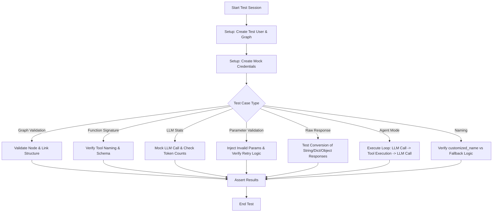

## 类结构

```
test_smart_decision_maker.py
├── Global Variable: logger
├── Helper Functions
│   ├── create_graph
│   ├── create_credentials
│   └── execute_graph
├── Test Functions
│   ├── test_graph_validation_with_tool_nodes_correct
│   ├── test_smart_decision_maker_function_signature
│   ├── test_smart_decision_maker_tracks_llm_stats
│   ├── test_smart_decision_maker_parameter_validation
│   ├── test_smart_decision_maker_raw_response_conversion
│   ├── test_smart_decision_maker_agent_mode
│   ├── test_smart_decision_maker_traditional_mode_default
│   ├── test_smart_decision_maker_uses_customized_name_for_blocks
│   ├── test_smart_decision_maker_falls_back_to_block_name
│   ├── test_smart_decision_maker_uses_customized_name_for_agents
│   └── test_smart_decision_maker_agent_falls_back_to_graph_name
└── Nested Classes
    └── MockChatCompletionMessage (within test_smart_decision_maker_raw_response_conversion)
```

## 全局变量及字段


### `logger`
    
用于记录测试执行过程中的日志信息的Logger实例

类型：`logging.Logger`
    


### `MockChatCompletionMessage.role`
    
代表消息发送者的角色，例如 'assistant'

类型：`str`
    


### `MockChatCompletionMessage.content`
    
消息的文本内容

类型：`str`
    


### `MockChatCompletionMessage.tool_calls`
    
模型发起的工具调用列表

类型：`list`
    
    

## 全局函数及方法


### `create_graph`

该函数用于在测试服务器环境中为指定用户创建一个图实例，封装了对代理服务器测试接口的调用。

参数：

- `s`: `SpinTestServer`，测试服务器实例，提供访问代理服务的接口。
- `g`: `graph.Graph`，待创建的图对象，包含图的节点、链接等定义。
- `u`: `User`，用户对象，用于标识图的所有者。

返回值：`Any`，代理服务器创建图操作的返回结果（通常为创建后的图对象或包含图元数据的响应）。

#### 流程图

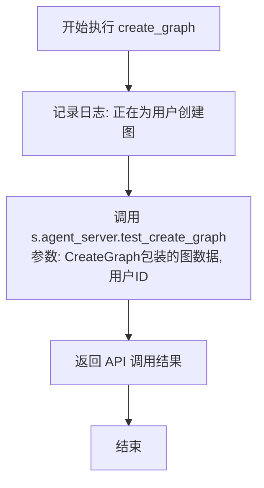

#### 带注释源码

```python
async def create_graph(s: SpinTestServer, g, u: User):
    # 记录信息日志，提示当前正在为特定用户ID创建图
    logger.info("Creating graph for user %s", u.id)
    
    # 调用测试代理服务器的 test_create_graph 方法
    # 将图对象 g 包装在 CreateGraph 模型中，并传入用户 ID u.id
    # await 等待异步操作完成并返回结果
    return await s.agent_server.test_create_graph(CreateGraph(graph=g), u.id)
```


### `create_credentials`

该函数用于在测试环境中为指定用户创建测试用的凭据，主要作用是封装获取测试提供商（OpenAI）的测试凭据并调用测试服务器接口进行创建的流程。

参数：

-  `s`：`SpinTestServer`，测试服务器实例，用于调用创建凭据的接口。
-  `u`：`User`，用户对象，用于关联凭据的所有者。

返回值：`Any`（通常为创建的凭据对象或ID），`test_create_credentials` 接口的返回结果，表示凭据创建后的实体信息。

#### 流程图

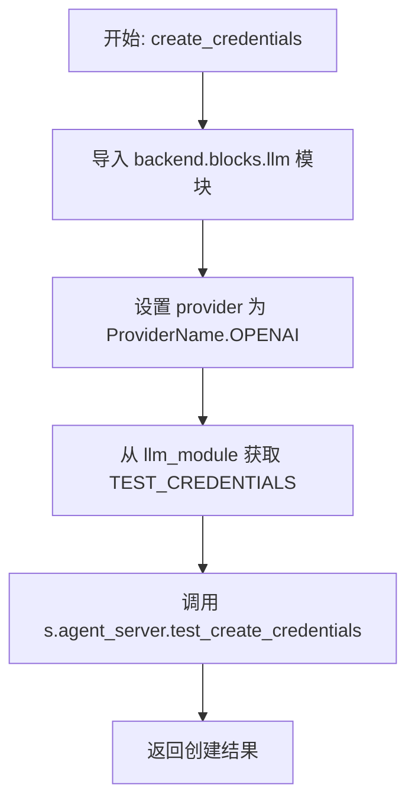

#### 带注释源码

```python
async def create_credentials(s: SpinTestServer, u: User):
    # 导入后端 LLM 模块以访问测试凭据常量
    import backend.blocks.llm as llm_module

    # 定义提供商为 OpenAI
    provider = ProviderName.OPENAI
    # 获取预定义的测试凭据数据
    credentials = llm_module.TEST_CREDENTIALS
    # 调用测试服务器的接口，为指定用户创建凭据
    return await s.agent_server.test_create_credentials(u.id, provider, credentials)
```


### `execute_graph`

该函数用于在测试环境中执行给定的图（Graph），通过Agent Server触发执行，并阻塞等待执行完成后返回执行ID。

参数：

- `agent_server`：`AgentServer`，提供测试执行能力的代理服务器实例。
- `test_graph`：`Any`（隐含为Graph对象），待执行的测试图对象，包含ID和版本信息。
- `test_user`：`User`，发起执行操作的用户对象。
- `input_data`：`dict`，输入给图节点的初始数据。
- `num_execs`：`int`，预期的执行次数（默认为4，当前函数体中未实际使用）。

返回值：`str`，创建的图执行实例的唯一标识符（ID）。

#### 流程图

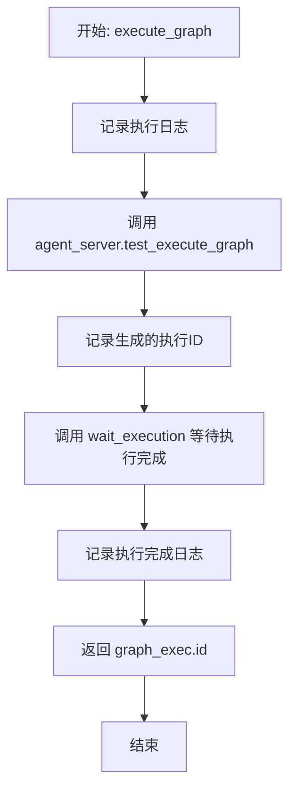

#### 带注释源码

```python
async def execute_graph(
    agent_server: AgentServer,
    test_graph,
    test_user: User,
    input_data: dict,
    num_execs: int = 4,
) -> str:
    # 记录开始执行的信息，包括图ID和用户ID
    logger.info("Executing graph %s for user %s", test_graph.id, test_user.id)
    logger.info("Input data: %s", input_data)

    # --- Test adding new executions --- #
    # 调用 agent_server 的测试接口执行图，并传入用户ID、图ID、版本和输入数据
    graph_exec = await agent_server.test_execute_graph(
        user_id=test_user.id,
        graph_id=test_graph.id,
        graph_version=test_graph.version,
        node_input=input_data,
    )
    logger.info("Created execution with ID: %s", graph_exec.id)

    # Execution queue should be empty
    # 等待执行完成，超时时间为30秒
    logger.info("Waiting for execution to complete...")
    result = await wait_execution(test_user.id, graph_exec.id, 30)
    logger.info("Execution completed with %d results", len(result))
    
    # 返回创建的执行ID
    return graph_exec.id
```


### `test_graph_validation_with_tool_nodes_correct`

该函数旨在验证包含工具节点的图结构是否能够被正确创建和保存。它通过构建一个连接了智能决策块（SmartDecisionMakerBlock）和代理执行块（AgentExecutorBlock）的复杂图，来测试节点链接、数据流向以及图元数据的有效性，确保系统能够处理这种包含工具调用逻辑的拓扑结构。

参数：

- `server`：`SpinTestServer`，用于测试的模拟服务器实例，提供代理服务和API访问能力。

返回值：`None`，该函数为测试用例，主要用于执行逻辑验证，不返回具体值。

#### 流程图

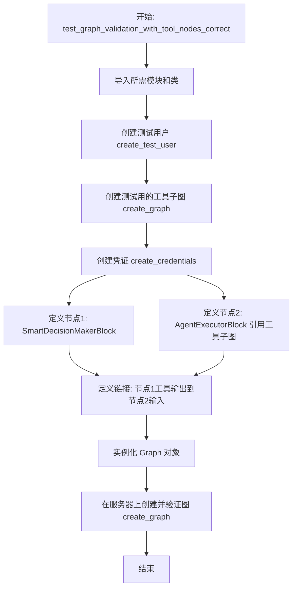

#### 带注释源码

```python
@pytest.mark.asyncio(loop_scope="session")
async def test_graph_validation_with_tool_nodes_correct(server: SpinTestServer):
    # 导入必要的块类和图数据模型
    from backend.blocks.agent import AgentExecutorBlock
    from backend.blocks.smart_decision_maker import SmartDecisionMakerBlock
    from backend.data import graph

    # 步骤 1: 创建测试用户
    test_user = await create_test_user()
    
    # 步骤 2: 创建一个被用作“工具”的测试图
    test_tool_graph = await create_graph(server, create_test_graph(), test_user)
    
    # 步骤 3: 为LLM调用创建凭证
    creds = await create_credentials(server, test_user)

    # 步骤 4: 定义图中的节点
    nodes = [
        # 节点 A: 智能决策块，作为LLM代理，负责决策
        graph.Node(
            block_id=SmartDecisionMakerBlock().id,
            input_default={
                "prompt": "Hello, World!",
                "credentials": creds,
            },
        ),
        # 节点 B: 代理执行块，这里作为工具使用，引用了上面的 test_tool_graph
        graph.Node(
            block_id=AgentExecutorBlock().id,
            input_default={
                "graph_id": test_tool_graph.id,
                "graph_version": test_tool_graph.version,
                "input_schema": test_tool_graph.input_schema,
                "output_schema": test_tool_graph.output_schema,
            },
        ),
    ]

    # 步骤 5: 定义节点之间的连接
    # 将 SmartDecisionMakerBlock 的工具输出连接到 AgentExecutorBlock 的输入
    links = [
        graph.Link(
            source_id=nodes[0].id,
            sink_id=nodes[1].id,
            source_name="tools_^_sample_tool_input_1",
            sink_name="input_1",
        ),
        graph.Link(
            source_id=nodes[0].id,
            sink_id=nodes[1].id,
            source_name="tools_^_sample_tool_input_2",
            sink_name="input_2",
        ),
    ]

    # 步骤 6: 构建最终的图对象
    test_graph = graph.Graph(
        name="TestGraph",
        description="Test graph",
        nodes=nodes,
        links=links,
    )
    
    # 步骤 7: 调用 create_graph 将图结构保存到服务器
    # 此步骤隐式验证了图结构、节点ID和链接配置的有效性
    test_graph = await create_graph(server, test_graph, test_user)
```


### `test_smart_decision_maker_function_signature`

该函数用于测试 `SmartDecisionMakerBlock` 在包含 Agent 节点和 Block 节点的图中生成工具函数签名的功能，验证生成的工具名称、描述及参数是否符合预期。

参数：

-  `server`：`SpinTestServer`，用于提供测试环境的服务器实例，协助创建用户和图数据。

返回值：`None`，该函数不返回任何值，主要通过断言（assert）来验证测试结果。

#### 流程图

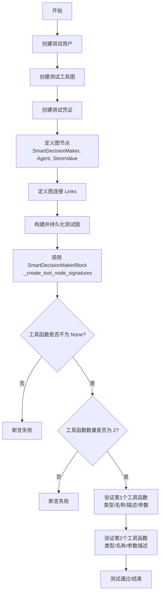

#### 带注释源码

```python
@pytest.mark.asyncio(loop_scope="session")
async def test_smart_decision_maker_function_signature(server: SpinTestServer):
    # 导入测试所需的 Block 类和图模型
    from backend.blocks.agent import AgentExecutorBlock
    from backend.blocks.basic import StoreValueBlock
    from backend.blocks.smart_decision_maker import SmartDecisionMakerBlock
    from backend.data import graph

    # 1. 环境准备：创建测试用户、测试工具图和凭证
    test_user = await create_test_user()
    test_tool_graph = await create_graph(server, create_test_graph(), test_user)
    creds = await create_credentials(server, test_user)

    # 2. 构造节点：包含 SmartDecisionMakerBlock、AgentExecutorBlock 和 StoreValueBlock
    nodes = [
        graph.Node(
            block_id=SmartDecisionMakerBlock().id,
            input_default={
                "prompt": "Hello, World!",
                "credentials": creds,
            },
        ),
        graph.Node(
            block_id=AgentExecutorBlock().id,
            input_default={
                "graph_id": test_tool_graph.id,
                "graph_version": test_tool_graph.version,
                "input_schema": test_tool_graph.input_schema,
                "output_schema": test_tool_graph.output_schema,
            },
        ),
        graph.Node(
            block_id=StoreValueBlock().id,
        ),
    ]

    # 3. 构造链接：将 SmartDecisionMaker 的输出连接到 Agent 和 StoreValue
    links = [
        graph.Link(
            source_id=nodes[0].id,
            sink_id=nodes[1].id,
            source_name="tools_^_sample_tool_input_1",
            sink_name="input_1",
        ),
        graph.Link(
            source_id=nodes[0].id,
            sink_id=nodes[1].id,
            source_name="tools_^_sample_tool_input_2",
            sink_name="input_2",
        ),
        graph.Link(
            source_id=nodes[0].id,
            sink_id=nodes[2].id,
            source_name="tools_^_store_value_input",
            sink_name="input",
        ),
    ]

    # 4. 创建图对象并在服务器上注册
    test_graph = graph.Graph(
        name="TestGraph",
        description="Test graph",
        nodes=nodes,
        links=links,
    )
    test_graph = await create_graph(server, test_graph, test_user)

    # 5. 调用被测方法：为 SmartDecisionMakerBlock 节点创建工具签名
    tool_functions = await SmartDecisionMakerBlock._create_tool_node_signatures(
        test_graph.nodes[0].id
    )
    # 断言：确保工具函数列表不为空
    assert tool_functions is not None, "Tool functions should not be None"

    # 断言：确保生成了预期的 2 个工具函数 (Agent 和 StoreValue)
    assert (
        len(tool_functions) == 2
    ), f"Expected 2 tool functions, got {len(tool_functions)}"

    # 6. 验证第 1 个工具函数 (testgraph - AgentExecutorBlock)
    assert tool_functions[0]["type"] == "function"
    assert tool_functions[0]["function"]["name"] == "testgraph"
    assert tool_functions[0]["function"]["description"] == "Test graph description"
    assert "input_1" in tool_functions[0]["function"]["parameters"]["properties"]
    assert "input_2" in tool_functions[0]["function"]["parameters"]["properties"]

    # 7. 验证第 2 个工具函数 (storevalueblock - StoreValueBlock)
    assert tool_functions[1]["type"] == "function"
    assert tool_functions[1]["function"]["name"] == "storevalueblock"
    assert "input" in tool_functions[1]["function"]["parameters"]["properties"]
    # 验证参数描述的准确性
    assert (
        tool_functions[1]["function"]["parameters"]["properties"]["input"][
            "description"
        ]
        == "Trigger the block to produce the output. The value is only used when `data` is None."
    )
```


### `test_smart_decision_maker_tracks_llm_stats`

验证 `SmartDecisionMakerBlock` 在执行过程中能够正确追踪和记录 LLM 的使用统计信息（包括输入令牌数、输出令牌数和调用次数），确保即使在模拟环境下，统计模块也能准确反映资源消耗。

参数：

-  无

返回值：`None`，该函数为测试用例，无返回值，若断言失败则抛出异常。

#### 流程图

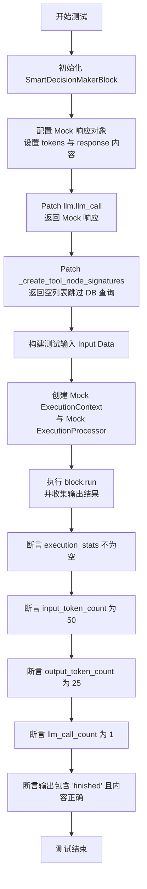

#### 带注释源码

```python
@pytest.mark.asyncio
async def test_smart_decision_maker_tracks_llm_stats():
    """Test that SmartDecisionMakerBlock correctly tracks LLM usage stats."""
    import backend.blocks.llm as llm_module
    from backend.blocks.smart_decision_maker import SmartDecisionMakerBlock

    # 初始化被测试的 Block 实例
    block = SmartDecisionMakerBlock()

    # Mock the llm.llm_call function to return controlled data
    # 模拟 LLM 返回对象，预设 Token 计数和响应内容，以便验证统计逻辑
    mock_response = MagicMock()
    mock_response.response = "I need to think about this."
    mock_response.tool_calls = None  # No tool calls for simplicity
    mock_response.prompt_tokens = 50
    mock_response.completion_tokens = 25
    mock_response.reasoning = None
    mock_response.raw_response = {
        "role": "assistant",
        "content": "I need to think about this.",
    }

    # Mock the _create_tool_node_signatures method to avoid database calls
    # 使用 patch 替换实际的 LLM 调用和工具签名创建，隔离外部依赖
    with patch(
        "backend.blocks.llm.llm_call",
        new_callable=AsyncMock,
        return_value=mock_response,
    ), patch.object(
        SmartDecisionMakerBlock,
        "_create_tool_node_signatures",
        new_callable=AsyncMock,
        return_value=[],
    ):

        # Create test input
        # 构造 Block 运行所需的输入数据结构
        input_data = SmartDecisionMakerBlock.Input(
            prompt="Should I continue with this task?",
            model=llm_module.DEFAULT_LLM_MODEL,
            credentials=llm_module.TEST_CREDENTIALS_INPUT,  # type: ignore
            agent_mode_max_iterations=0,
        )

        # Execute the block
        outputs = {}
        # Create execution context
        # 创建模拟的执行上下文和处理器，确保不需要真实的运行环境
        mock_execution_context = ExecutionContext(human_in_the_loop_safe_mode=False)

        # Create a mock execution processor for tests
        mock_execution_processor = MagicMock()

        # 调用 block.run 方法进行异步执行，并收集输出
        async for output_name, output_data in block.run(
            input_data,
            credentials=llm_module.TEST_CREDENTIALS,
            graph_id="test-graph-id",
            node_id="test-node-id",
            graph_exec_id="test-exec-id",
            node_exec_id="test-node-exec-id",
            user_id="test-user-id",
            graph_version=1,
            execution_context=mock_execution_context,
            execution_processor=mock_execution_processor,
        ):
            outputs[output_name] = output_data

        # Verify stats tracking
        # 验证 Block 的 execution_stats 属性是否正确记录了 Token 使用情况
        assert block.execution_stats is not None
        assert block.execution_stats.input_token_count == 50
        assert block.execution_stats.output_token_count == 25
        assert block.execution_stats.llm_call_count == 1

        # Verify outputs
        # 验证最终输出结果是否符合预期（无工具调用时直接 finished）
        assert "finished" in outputs  # Should have finished since no tool calls
        assert outputs["finished"] == "I need to think about this."
```


### `test_smart_decision_maker_parameter_validation`

该函数用于测试 `SmartDecisionMakerBlock` 对工具调用参数的验证逻辑。它验证了在参数名称拼写错误（触发重试机制）、缺少必需参数、缺少可选参数以及参数完整这四种场景下，系统是否能正确执行、抛出预期的错误或成功生成输出。

参数：

*   无

返回值：`None`，该函数为单元测试函数，不返回具体值，主要依靠断言验证行为。

#### 流程图

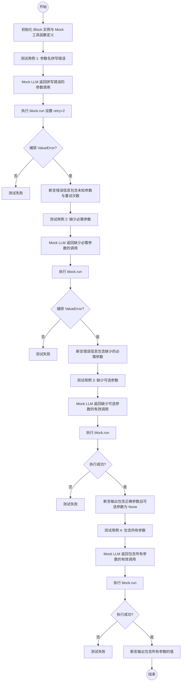

#### 带注释源码

```python
@pytest.mark.asyncio
async def test_smart_decision_maker_parameter_validation():
    """Test that SmartDecisionMakerBlock correctly validates tool call parameters."""
    import backend.blocks.llm as llm_module
    from backend.blocks.smart_decision_maker import SmartDecisionMakerBlock

    # 初始化被测试的 Block 实例
    block = SmartDecisionMakerBlock()

    # 定义 Mock 工具函数，包含一个必需参数、一个可选参数和一个字符串类型参数
    mock_tool_functions = [
        {
            "type": "function",
            "function": {
                "name": "search_keywords",
                "description": "Search for keywords with difficulty filtering",
                "parameters": {
                    "type": "object",
                    "properties": {
                        "query": {"type": "string", "description": "Search query"},
                        "max_keyword_difficulty": {
                            "type": "integer",
                            "description": "Maximum keyword difficulty (required)",
                        },
                        "optional_param": {
                            "type": "string",
                            "description": "Optional parameter with default",
                            "default": "default_value",
                        },
                    },
                    "required": ["query", "max_keyword_difficulty"],
                },
                "_sink_node_id": "test-sink-node-id",
            },
        }
    ]

    # --- 测试用例 1: 参数名拼写错误 ---
    # 模拟 LLM 返回了一个工具调用，其中参数名 "max_keyword_difficulty" 被错写为 "maximum_keyword_difficulty"
    mock_tool_call_with_typo = MagicMock()
    mock_tool_call_with_typo.function.name = "search_keywords"
    mock_tool_call_with_typo.function.arguments = '{"query": "test", "maximum_keyword_difficulty": 50}'  # TYPO

    # 构造包含错误工具调用的模拟 LLM 响应
    mock_response_with_typo = MagicMock()
    mock_response_with_typo.response = None
    mock_response_with_typo.tool_calls = [mock_tool_call_with_typo]
    mock_response_with_typo.prompt_tokens = 50
    mock_response_with_typo.completion_tokens = 25
    mock_response_with_typo.reasoning = None
    mock_response_with_typo.raw_response = {"role": "assistant", "content": None}

    # Patch LLM 调用和工具签名创建方法
    with patch(
        "backend.blocks.llm.llm_call",
        new_callable=AsyncMock,
        return_value=mock_response_with_typo,
    ) as mock_llm_call, patch.object(
        SmartDecisionMakerBlock,
        "_create_tool_node_signatures",
        new_callable=AsyncMock,
        return_value=mock_tool_functions,
    ):

        input_data = SmartDecisionMakerBlock.Input(
            prompt="Search for keywords",
            model=llm_module.DEFAULT_LLM_MODEL,
            credentials=llm_module.TEST_CREDENTIALS_INPUT,  # type: ignore
            retry=2,  # 设置重试次数为 2
            agent_mode_max_iterations=0,
        )

        mock_execution_context = ExecutionContext(human_in_the_loop_safe_mode=False)
        mock_execution_processor = MagicMock()

        # 预期抛出 ValueError，因为参数名错误导致验证失败
        with pytest.raises(ValueError) as exc_info:
            outputs = {}
            async for output_name, output_data in block.run(
                input_data,
                credentials=llm_module.TEST_CREDENTIALS,
                graph_id="test-graph-id",
                node_id="test-node-id",
                graph_exec_id="test-exec-id",
                node_exec_id="test-node-exec-id",
                user_id="test-user-id",
                graph_version=1,
                execution_context=mock_execution_context,
                execution_processor=mock_execution_processor,
            ):
                outputs[output_name] = output_data

        # 验证错误消息包含未知参数的信息
        error_msg = str(exc_info.value)
        assert "Tool call 'search_keywords' has parameter errors" in error_msg
        assert "Unknown parameters: ['maximum_keyword_difficulty']" in error_msg

        # 验证 LLM 被调用了两次（初始调用 + 1 次重试）
        assert mock_llm_call.call_count == 2

    # --- 测试用例 2: 缺少必需参数 ---
    # 模拟 LLM 返回的工具调用缺少 "max_keyword_difficulty"
    mock_tool_call_missing_required = MagicMock()
    mock_tool_call_missing_required.function.name = "search_keywords"
    mock_tool_call_missing_required.function.arguments = '{"query": "test"}'

    mock_response_missing_required = MagicMock()
    mock_response_missing_required.response = None
    mock_response_missing_required.tool_calls = [mock_tool_call_missing_required]
    mock_response_missing_required.prompt_tokens = 50
    mock_response_missing_required.completion_tokens = 25
    mock_response_missing_required.reasoning = None
    mock_response_missing_required.raw_response = {"role": "assistant", "content": None}

    with patch(
        "backend.blocks.llm.llm_call",
        new_callable=AsyncMock,
        return_value=mock_response_missing_required,
    ), patch.object(
        SmartDecisionMakerBlock,
        "_create_tool_node_signatures",
        new_callable=AsyncMock,
        return_value=mock_tool_functions,
    ):

        input_data = SmartDecisionMakerBlock.Input(
            prompt="Search for keywords",
            model=llm_module.DEFAULT_LLM_MODEL,
            credentials=llm_module.TEST_CREDENTIALS_INPUT,  # type: ignore
            agent_mode_max_iterations=0,
        )

        mock_execution_context = ExecutionContext(human_in_the_loop_safe_mode=False)
        mock_execution_processor = MagicMock()

        # 预期抛出 ValueError
        with pytest.raises(ValueError) as exc_info:
            outputs = {}
            async for output_name, output_data in block.run(
                input_data,
                credentials=llm_module.TEST_CREDENTIALS,
                graph_id="test-graph-id",
                node_id="test-node-id",
                graph_exec_id="test-exec-id",
                node_exec_id="test-node-exec-id",
                user_id="test-user-id",
                graph_version=1,
                execution_context=mock_execution_context,
                execution_processor=mock_execution_processor,
            ):
                outputs[output_name] = output_data

        error_msg = str(exc_info.value)
        assert "Tool call 'search_keywords' has parameter errors" in error_msg
        assert "Missing required parameters: ['max_keyword_difficulty']" in error_msg

    # --- 测试用例 3: 有效调用，缺少可选参数 ---
    # 模拟 LLM 返回正确的必需参数，但缺少可选参数 "optional_param"
    mock_tool_call_valid = MagicMock()
    mock_tool_call_valid.function.name = "search_keywords"
    mock_tool_call_valid.function.arguments = '{"query": "test", "max_keyword_difficulty": 50}'

    mock_response_valid = MagicMock()
    mock_response_valid.response = None
    mock_response_valid.tool_calls = [mock_tool_call_valid]
    mock_response_valid.prompt_tokens = 50
    mock_response_valid.completion_tokens = 25
    mock_response_valid.reasoning = None
    mock_response_valid.raw_response = {"role": "assistant", "content": None}

    with patch(
        "backend.blocks.llm.llm_call",
        new_callable=AsyncMock,
        return_value=mock_response_valid,
    ), patch.object(
        SmartDecisionMakerBlock,
        "_create_tool_node_signatures",
        new_callable=AsyncMock,
        return_value=mock_tool_functions,
    ):

        input_data = SmartDecisionMakerBlock.Input(
            prompt="Search for keywords",
            model=llm_module.DEFAULT_LLM_MODEL,
            credentials=llm_module.TEST_CREDENTIALS_INPUT,  # type: ignore
            agent_mode_max_iterations=0,
        )

        outputs = {}
        mock_execution_context = ExecutionContext(human_in_the_loop_safe_mode=False)
        mock_execution_processor = MagicMock()

        # 执行应该成功
        async for output_name, output_data in block.run(
            input_data,
            credentials=llm_module.TEST_CREDENTIALS,
            graph_id="test-graph-id",
            node_id="test-node-id",
            graph_exec_id="test-exec-id",
            node_exec_id="test-node-exec-id",
            user_id="test-user-id",
            graph_version=1,
            execution_context=mock_execution_context,
            execution_processor=mock_execution_processor,
        ):
            outputs[output_name] = output_data

        # 验证输出数据
        assert "tools_^_test-sink-node-id_~_query" in outputs
        assert outputs["tools_^_test-sink-node-id_~_query"] == "test"
        assert "tools_^_test-sink-node-id_~_max_keyword_difficulty" in outputs
        assert outputs["tools_^_test-sink-node-id_~_max_keyword_difficulty"] == 50
        # 可选参数未提供时应为 None
        assert "tools_^_test-sink-node-id_~_optional_param" in outputs
        assert outputs["tools_^_test-sink-node-id_~_optional_param"] is None

    # --- 测试用例 4: 有效调用，包含所有参数 ---
    # 模拟 LLM 返回所有参数，包括可选参数
    mock_tool_call_all_params = MagicMock()
    mock_tool_call_all_params.function.name = "search_keywords"
    mock_tool_call_all_params.function.arguments = '{"query": "test", "max_keyword_difficulty": 50, "optional_param": "custom_value"}'

    mock_response_all_params = MagicMock()
    mock_response_all_params.response = None
    mock_response_all_params.tool_calls = [mock_tool_call_all_params]
    mock_response_all_params.prompt_tokens = 50
    mock_response_all_params.completion_tokens = 25
    mock_response_all_params.reasoning = None
    mock_response_all_params.raw_response = {"role": "assistant", "content": None}

    with patch(
        "backend.blocks.llm.llm_call",
        new_callable=AsyncMock,
        return_value=mock_response_all_params,
    ), patch.object(
        SmartDecisionMakerBlock,
        "_create_tool_node_signatures",
        new_callable=AsyncMock,
        return_value=mock_tool_functions,
    ):

        input_data = SmartDecisionMakerBlock.Input(
            prompt="Search for keywords",
            model=llm_module.DEFAULT_LLM_MODEL,
            credentials=llm_module.TEST_CREDENTIALS_INPUT,  # type: ignore
            agent_mode_max_iterations=0,
        )

        outputs = {}
        mock_execution_context = ExecutionContext(human_in_the_loop_safe_mode=False)
        mock_execution_processor = MagicMock()

        async for output_name, output_data in block.run(
            input_data,
            credentials=llm_module.TEST_CREDENTIALS,
            graph_id="test-graph-id",
            node_id="test-node-id",
            graph_exec_id="test-exec-id",
            node_exec_id="test-node-exec-id",
            user_id="test-user-id",
            graph_version=1,
            execution_context=mock_execution_context,
            execution_processor=mock_execution_processor,
        ):
            outputs[output_name] = output_data

        # 验证所有参数输出正确
        assert outputs["tools_^_test-sink-node-id_~_query"] == "test"
        assert outputs["tools_^_test-sink-node-id_~_max_keyword_difficulty"] == 50
        assert outputs["tools_^_test-sink-node-id_~_optional_param"] == "custom_value"
```


### `test_smart_decision_maker_raw_response_conversion`

测试 SmartDecisionMaker 组件正确处理不同类型的 `raw_response`（如模拟的 ChatCompletionMessage 对象、Ollama 字符串响应、字典响应）以及重试机制的能力。重点验证对话历史记录能被正确转换为字典格式，且参数校验失败时能正确重试。

参数：

返回值：`None`，无返回值，通过断言验证测试结果

#### 流程图

```mermaid
flowchart TD
    A[开始: test_smart_decision_maker_raw_response_conversion] --> B[初始化 SmartDecisionMakerBlock]
    B --> C[定义 Mock 工具函数与 MockChatCompletionMessage 类]
    C --> D[测试用例 1: 模拟重试机制]
    D --> D1[构造初始响应: 参数错误且 raw_response 为 MockChatCompletionMessage]
    D --> D2[构造成功响应: 参数正确]
    D --> D3[Patch llm_call: 返回 [初始响应, 成功响应]]
    D3 --> D4[执行 block.run]
    D4 --> D5{断言验证}
    D5 -->|验证通过| E[测试用例 2: 模拟 Ollama 字符串响应]
    D5 -->|验证失败| Z[抛出异常]
    E --> E1[构造 raw_response 为字符串的 Mock 响应]
    E1 --> E2[Patch llm_call 并执行 block.run]
    E2 --> E3[断言输出为 finished]
    E3 --> F[测试用例 3: 模拟字典响应]
    F --> F1[构造 raw_response 为字典的 Mock 响应]
    F1 --> F2[Patch llm_call 并执行 block.run]
    F2 --> F3[断言输出为 finished]
    F3 --> G[结束]
```

#### 带注释源码

```python
@pytest.mark.asyncio
async def test_smart_decision_maker_raw_response_conversion():
    """Test that SmartDecisionMaker correctly handles different raw_response types with retry mechanism."""
    import backend.blocks.llm as llm_module
    from backend.blocks.smart_decision_maker import SmartDecisionMakerBlock

    block = SmartDecisionMakerBlock()

    # Mock tool functions
    mock_tool_functions = [
        {
            "type": "function",
            "function": {
                "name": "test_tool",
                "parameters": {
                    "type": "object",
                    "properties": {"param": {"type": "string"}},
                    "required": ["param"],
                },
                "_sink_node_id": "test-sink-node-id",
            },
        }
    ]

    # Test case 1: Simulate ChatCompletionMessage raw_response that caused the original error
    # 定义一个模拟类，模拟 OpenAI 的 ChatCompletionMessage 对象，故意不包含 .get() 方法
    # 用于测试代码是否能处理这种原始响应对象
    class MockChatCompletionMessage:
        """Simulate OpenAI's ChatCompletionMessage object that lacks .get() method"""

        def __init__(self, role, content, tool_calls=None):
            self.role = role
            self.content = content
            self.tool_calls = tool_calls or []

        # This is what caused the error - no .get() method
        # def get(self, key, default=None):  # Intentionally missing

    # First response: has invalid parameter name (triggers retry)
    mock_tool_call_invalid = MagicMock()
    mock_tool_call_invalid.function.name = "test_tool"
    mock_tool_call_invalid.function.arguments = (
        '{"wrong_param": "test_value"}'  # Invalid parameter name
    )

    mock_response_retry = MagicMock()
    mock_response_retry.response = None
    mock_response_retry.tool_calls = [mock_tool_call_invalid]
    mock_response_retry.prompt_tokens = 50
    mock_response_retry.completion_tokens = 25
    mock_response_retry.reasoning = None
    # This would cause the original error without our fix
    mock_response_retry.raw_response = MockChatCompletionMessage(
        role="assistant", content=None, tool_calls=[mock_tool_call_invalid]
    )

    # Second response: successful (correct parameter name)
    mock_tool_call_valid = MagicMock()
    mock_tool_call_valid.function.name = "test_tool"
    mock_tool_call_valid.function.arguments = (
        '{"param": "test_value"}'  # Correct parameter name
    )

    mock_response_success = MagicMock()
    mock_response_success.response = None
    mock_response_success.tool_calls = [mock_tool_call_valid]
    mock_response_success.prompt_tokens = 50
    mock_response_success.completion_tokens = 25
    mock_response_success.reasoning = None
    mock_response_success.raw_response = MockChatCompletionMessage(
        role="assistant", content=None, tool_calls=[mock_tool_call_valid]
    )

    # Mock llm_call to return different responses on different calls

    with patch(
        "backend.blocks.llm.llm_call", new_callable=AsyncMock
    ) as mock_llm_call, patch.object(
        SmartDecisionMakerBlock,
        "_create_tool_node_signatures",
        new_callable=AsyncMock,
        return_value=mock_tool_functions,
    ):
        # First call returns response that will trigger retry due to validation error
        # Second call returns successful response
        mock_llm_call.side_effect = [mock_response_retry, mock_response_success]

        input_data = SmartDecisionMakerBlock.Input(
            prompt="Test prompt",
            model=llm_module.DEFAULT_LLM_MODEL,
            credentials=llm_module.TEST_CREDENTIALS_INPUT,  # type: ignore
            retry=2,
            agent_mode_max_iterations=0,
        )

        # Should succeed after retry, demonstrating our helper function works
        outputs = {}
        # Create execution context

        mock_execution_context = ExecutionContext(human_in_the_loop_safe_mode=False)

        # Create a mock execution processor for tests

        mock_execution_processor = MagicMock()

        async for output_name, output_data in block.run(
            input_data,
            credentials=llm_module.TEST_CREDENTIALS,
            graph_id="test-graph-id",
            node_id="test-node-id",
            graph_exec_id="test-exec-id",
            node_exec_id="test-node-exec-id",
            user_id="test-user-id",
            graph_version=1,
            execution_context=mock_execution_context,
            execution_processor=mock_execution_processor,
        ):
            outputs[output_name] = output_data

        # Verify the tool output was generated successfully
        assert "tools_^_test-sink-node-id_~_param" in outputs
        assert outputs["tools_^_test-sink-node-id_~_param"] == "test_value"

        # Verify conversation history was properly maintained
        assert "conversations" in outputs
        conversations = outputs["conversations"]
        assert len(conversations) > 0

        # The conversations should contain properly converted raw_response objects as dicts
        # This would have failed with the original bug due to ChatCompletionMessage.get() error
        for msg in conversations:
            assert isinstance(msg, dict), f"Expected dict, got {type(msg)}"
            if msg.get("role") == "assistant":
                # Should have been converted from ChatCompletionMessage to dict
                assert "role" in msg

        # Verify LLM was called twice (initial + 1 retry)
        assert mock_llm_call.call_count == 2

    # Test case 2: Test with different raw_response types (Ollama string, dict)
    # Test Ollama string response
    mock_response_ollama = MagicMock()
    mock_response_ollama.response = "I'll help you with that."
    mock_response_ollama.tool_calls = None
    mock_response_ollama.prompt_tokens = 30
    mock_response_ollama.completion_tokens = 15
    mock_response_ollama.reasoning = None
    mock_response_ollama.raw_response = (
        "I'll help you with that."  # Ollama returns string
    )

    with patch(
        "backend.blocks.llm.llm_call",
        new_callable=AsyncMock,
        return_value=mock_response_ollama,
    ), patch.object(
        SmartDecisionMakerBlock,
        "_create_tool_node_signatures",
        new_callable=AsyncMock,
        return_value=[],  # No tools for this test
    ):
        input_data = SmartDecisionMakerBlock.Input(
            prompt="Simple prompt",
            model=llm_module.DEFAULT_LLM_MODEL,
            credentials=llm_module.TEST_CREDENTIALS_INPUT,  # type: ignore
            agent_mode_max_iterations=0,
        )

        outputs = {}
        # Create execution context

        mock_execution_context = ExecutionContext(human_in_the_loop_safe_mode=False)

        # Create a mock execution processor for tests

        mock_execution_processor = MagicMock()

        async for output_name, output_data in block.run(
            input_data,
            credentials=llm_module.TEST_CREDENTIALS,
            graph_id="test-graph-id",
            node_id="test-node-id",
            graph_exec_id="test-exec-id",
            node_exec_id="test-node-exec-id",
            user_id="test-user-id",
            graph_version=1,
            execution_context=mock_execution_context,
            execution_processor=mock_execution_processor,
        ):
            outputs[output_name] = output_data

        # Should finish since no tool calls
        assert "finished" in outputs
        assert outputs["finished"] == "I'll help you with that."

    # Test case 3: Test with dict raw_response (some providers/tests)
    mock_response_dict = MagicMock()
    mock_response_dict.response = "Test response"
    mock_response_dict.tool_calls = None
    mock_response_dict.prompt_tokens = 25
    mock_response_dict.completion_tokens = 10
    mock_response_dict.reasoning = None
    mock_response_dict.raw_response = {
        "role": "assistant",
        "content": "Test response",
    }  # Dict format

    with patch(
        "backend.blocks.llm.llm_call",
        new_callable=AsyncMock,
        return_value=mock_response_dict,
    ), patch.object(
        SmartDecisionMakerBlock,
        "_create_tool_node_signatures",
        new_callable=AsyncMock,
        return_value=[],
    ):
        input_data = SmartDecisionMakerBlock.Input(
            prompt="Another test",
            model=llm_module.DEFAULT_LLM_MODEL,
            credentials=llm_module.TEST_CREDENTIALS_INPUT,  # type: ignore
            agent_mode_max_iterations=0,
        )

        outputs = {}
        # Create execution context

        mock_execution_context = ExecutionContext(human_in_the_loop_safe_mode=False)

        # Create a mock execution processor for tests

        mock_execution_processor = MagicMock()

        async for output_name, output_data in block.run(
            input_data,
            credentials=llm_module.TEST_CREDENTIALS,
            graph_id="test-graph-id",
            node_id="test-node-id",
            graph_exec_id="test-exec-id",
            node_exec_id="test-node-exec-id",
            user_id="test-user-id",
            graph_version=1,
            execution_context=mock_execution_context,
            execution_processor=mock_execution_processor,
        ):
            outputs[output_name] = output_data

        assert "finished" in outputs
        assert outputs["finished"] == "Test response"
```


### `test_smart_decision_maker_agent_mode`

测试智能决策 maker 在代理模式下的行为，验证其是否直接执行工具并循环直到任务完成。

参数：

-  无

返回值：`None`，该函数为测试用例，无返回值。

#### 流程图

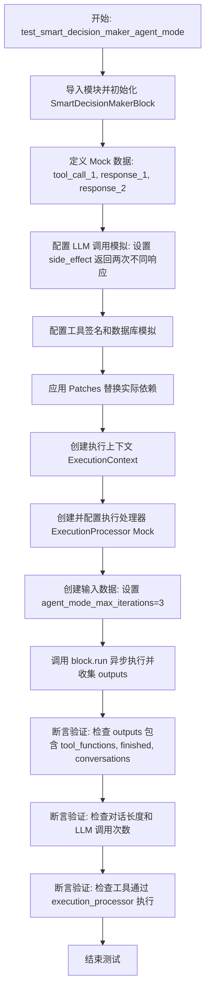

#### 带注释源码

```python
@pytest.mark.asyncio
async def test_smart_decision_maker_agent_mode():
    """Test that agent mode executes tools directly and loops until finished."""
    import backend.blocks.llm as llm_module
    from backend.blocks.smart_decision_maker import SmartDecisionMakerBlock

    # 1. 初始化测试块
    block = SmartDecisionMakerBlock()

    # 2. 模拟第一次 LLM 交互：返回工具调用请求
    mock_tool_call_1 = MagicMock()
    mock_tool_call_1.id = "call_1"
    mock_tool_call_1.function.name = "search_keywords"
    mock_tool_call_1.function.arguments = (
        '{"query": "test", "max_keyword_difficulty": 50}'
    )

    mock_response_1 = MagicMock()
    mock_response_1.response = None
    mock_response_1.tool_calls = [mock_tool_call_1] # 包含工具调用
    mock_response_1.prompt_tokens = 50
    mock_response_1.completion_tokens = 25
    mock_response_1.reasoning = "Using search tool"
    mock_response_1.raw_response = {
        "role": "assistant",
        "content": None,
        "tool_calls": [{"id": "call_1", "type": "function"}],
    }

    # 3. 模拟第二次 LLM 交互：返回最终完成结果
    mock_response_2 = MagicMock()
    mock_response_2.response = "Task completed successfully"
    mock_response_2.tool_calls = [] # 无工具调用，表示结束
    mock_response_2.prompt_tokens = 30
    mock_response_2.completion_tokens = 15
    mock_response_2.reasoning = None
    mock_response_2.raw_response = {
        "role": "assistant",
        "content": "Task completed successfully",
    }

    # 4. 设置 LLM 调用的模拟行为，模拟多次迭代
    llm_call_mock = AsyncMock()
    llm_call_mock.side_effect = [mock_response_1, mock_response_2]

    # 5. 设置工具节点签名 Mock
    mock_tool_signatures = [
        {
            "type": "function",
            "function": {
                "name": "search_keywords",
                "_sink_node_id": "test-sink-node-id",
                "_field_mapping": {},
                "parameters": {
                    "properties": {
                        "query": {"type": "string"},
                        "max_keyword_difficulty": {"type": "integer"},
                    },
                    "required": ["query", "max_keyword_difficulty"],
                },
            },
        }
    ]

    # 6. 设置数据库客户端 Mock，用于获取节点信息和执行记录
    mock_db_client = AsyncMock()
    mock_node = MagicMock()
    mock_node.block_id = "test-block-id"
    mock_db_client.get_node.return_value = mock_node

    mock_node_exec_result = MagicMock()
    mock_node_exec_result.node_exec_id = "test-tool-exec-id"
    mock_input_data = {"query": "test", "max_keyword_difficulty": 50}
    mock_db_client.upsert_execution_input.return_value = (
        mock_node_exec_result,
        mock_input_data,
    )

    # 7. 使用 patch 替换外部依赖
    with patch("backend.blocks.llm.llm_call", llm_call_mock), patch.object(
        block, "_create_tool_node_signatures", return_value=mock_tool_signatures
    ), patch(
        "backend.blocks.smart_decision_maker.get_database_manager_async_client",
        return_value=mock_db_client,
    ), patch(
        "backend.executor.manager.async_update_node_execution_status",
        new_callable=AsyncMock,
    ), patch(
        "backend.integrations.creds_manager.IntegrationCredentialsManager"
    ):

        # 创建执行上下文
        mock_execution_context = ExecutionContext(
            human_in_the_loop_safe_mode=False,
        )

        # 创建并配置执行处理器 Mock
        mock_execution_processor = AsyncMock()
        # 配置必要的属性以通过逻辑检查
        mock_execution_processor.running_node_execution = defaultdict(MagicMock)
        mock_execution_processor.execution_stats = MagicMock()
        mock_execution_processor.execution_stats_lock = threading.Lock()

        # 模拟工具执行成功
        mock_node_stats = MagicMock()
        mock_node_stats.error = None
        mock_execution_processor.on_node_execution = AsyncMock(
            return_value=mock_node_stats
        )

        # 模拟获取工具执行后的输出
        mock_db_client.get_execution_outputs_by_node_exec_id.return_value = {
            "result": {"status": "success", "data": "search completed"}
        }

        # 8. 准备输入数据，启用 Agent 模式，设置最大迭代次数为 3
        input_data = SmartDecisionMakerBlock.Input(
            prompt="Complete this task using tools",
            model=llm_module.DEFAULT_LLM_MODEL,
            credentials=llm_module.TEST_CREDENTIALS_INPUT,  # type: ignore
            agent_mode_max_iterations=3,  # 关键配置：启用代理模式循环
        )

        # 9. 执行块逻辑并收集输出
        outputs = {}
        async for output_name, output_data in block.run(
            input_data,
            credentials=llm_module.TEST_CREDENTIALS,
            graph_id="test-graph-id",
            node_id="test-node-id",
            graph_exec_id="test-exec-id",
            node_exec_id="test-node-exec-id",
            user_id="test-user-id",
            graph_version=1,
            execution_context=mock_execution_context,
            execution_processor=mock_execution_processor,
        ):
            outputs[output_name] = output_data

        # 10. 验证代理模式的行为和结果
        assert "tool_functions" in outputs  # 应该包含工具函数定义
        assert "finished" in outputs        # 应该有最终完成状态
        assert outputs["finished"] == "Task completed successfully"
        assert "conversations" in outputs   # 应该包含对话历史

        # 验证对话历史包含工具交互过程
        conversations = outputs["conversations"]
        assert len(conversations) > 2  # 应该有多个对话条目（用户 -> 智能体 -> 工具 -> 智能体）

        # 验证 LLM 被调用了两次（第一次请求工具，第二次给出最终结果）
        assert llm_call_mock.call_count == 2

        # 验证工具确实通过执行处理器被执行了一次
        assert mock_execution_processor.on_node_execution.call_count == 1
```


### `test_smart_decision_maker_traditional_mode_default`

测试 `SmartDecisionMakerBlock` 在默认行为下的功能，即当 `agent_mode_max_iterations` 设置为 0 时，它应作为传统模式运行。该测试验证模块是否能正确生成工具函数定义、输出具体的工具参数以及维护对话记录，而无需执行代理模式的循环逻辑。

参数：

- `server`：`SpinTestServer`，测试服务器实例夹具，用于提供测试环境上下文（尽管在此函数体内部未直接调用，但符合测试框架签名）。

返回值：`None`，该函数为单元测试，无显式返回值；若断言失败则抛出异常。

#### 流程图

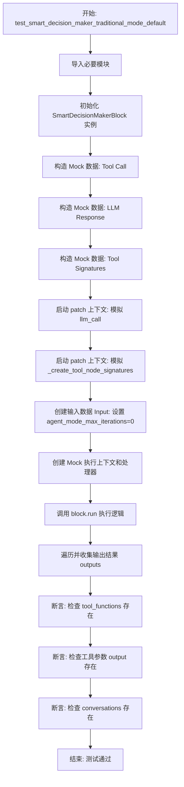

#### 带注释源码

```python
@pytest.mark.asyncio
async def test_smart_decision_maker_traditional_mode_default():
    """Test that default behavior (agent_mode_max_iterations=0) works as traditional mode."""
    # 导入测试所需的模块
    import backend.blocks.llm as llm_module
    from backend.blocks.smart_decision_maker import SmartDecisionMakerBlock

    # 实例化被测试的 Block
    block = SmartDecisionMakerBlock()

    # --- 准备 Mock 数据 ---
    
    # 模拟一个 LLM 返回的工具调用对象
    mock_tool_call = MagicMock()
    mock_tool_call.function.name = "search_keywords"
    mock_tool_call.function.arguments = (
        '{"query": "test", "max_keyword_difficulty": 50}'
    )

    # 模拟 LLM 的响应对象，包含工具调用、Token 计数等
    mock_response = MagicMock()
    mock_response.response = None
    mock_response.tool_calls = [mock_tool_call] # 包含上述工具调用
    mock_response.prompt_tokens = 50
    mock_response.completion_tokens = 25
    mock_response.reasoning = None
    mock_response.raw_response = {"role": "assistant", "content": None}

    # 模拟工具节点的签名数据，用于告诉 Block 有哪些工具可用
    mock_tool_signatures = [
        {
            "type": "function",
            "function": {
                "name": "search_keywords",
                "_sink_node_id": "test-sink-node-id", # 模拟的目标节点 ID
                "_field_mapping": {},
                "parameters": {
                    "properties": {
                        "query": {"type": "string"},
                        "max_keyword_difficulty": {"type": "integer"},
                    },
                    "required": ["query", "max_keyword_difficulty"],
                },
            },
        }
    ]

    # --- 使用 Patch 替换实际依赖 ---
    
    with patch(
        "backend.blocks.llm.llm_call",
        new_callable=AsyncMock,
        return_value=mock_response, # 让 LLM 调用返回我们构造的 Mock 响应
    ), patch.object(
        block, "_create_tool_node_signatures", return_value=mock_tool_signatures # 让获取签名的方法返回 Mock 数据
    ):

        # --- 准备输入数据 ---
        
        # 测试默认行为（传统模式）
        input_data = SmartDecisionMakerBlock.Input(
            prompt="Test prompt",
            model=llm_module.DEFAULT_LLM_MODEL,
            credentials=llm_module.TEST_CREDENTIALS_INPUT,  # type: ignore
            agent_mode_max_iterations=0,  # 关键点：设置为 0，启用传统模式（不循环执行工具）
        )

        # 创建 Mock 执行上下文
        mock_execution_context = ExecutionContext(human_in_the_loop_safe_mode=False)

        # 创建 Mock 执行处理器
        mock_execution_processor = MagicMock()

        # --- 执行测试 ---
        
        outputs = {}
        # 调用 block.run 方法并遍历生成器获取输出
        async for output_name, output_data in block.run(
            input_data,
            credentials=llm_module.TEST_CREDENTIALS,
            graph_id="test-graph-id",
            node_id="test-node-id",
            graph_exec_id="test-exec-id",
            node_exec_id="test-node-exec-id",
            user_id="test-user-id",
            graph_version=1,
            execution_context=mock_execution_context,
            execution_processor=mock_execution_processor,
        ):
            outputs[output_name] = output_data

        # --- 验证断言 ---
        
        # 验证传统模式行为：应该输出 tool_functions 元数据
        assert (
            "tool_functions" in outputs
        )  # Should yield tool_functions in traditional mode
        
        # 验证传统模式行为：应该输出具体的工具参数供后续节点使用
        assert (
            "tools_^_test-sink-node-id_~_query" in outputs
        )  # Should yield individual tool parameters
        assert "tools_^_test-sink-node-id_~_max_keyword_difficulty" in outputs
        
        # 验证对话历史被维护
        assert "conversations" in outputs
```


### `test_smart_decision_maker_uses_customized_name_for_blocks`

该测试函数验证了 `SmartDecisionMakerBlock` 在为工具节点生成函数签名时，是否能够优先使用节点元数据（metadata）中定义的 `customized_name` 作为工具名称，并确保该名称经过正确的清洗处理。

参数：

-   无

返回值：`None`，该函数为测试函数，不返回具体值，主要通过断言验证行为。

#### 流程图

```mermaid
graph TD
    A[开始测试] --> B[导入必要的模拟对象和类<br/>MagicMock, StoreValueBlock, etc.]
    B --> C[创建 mock_node 对象<br/>设置 customized_name 为 'My Custom Tool Name']
    C --> D[创建 mock_link 对象<br/>设置 sink_name 为 'input']
    D --> E[调用 SmartDecisionMakerBlock._create_block_function_signature]
    E --> F[获取执行结果 result]
    F --> G{断言检查<br/>result['type'] 是否为 'function'}
    G -- 否 --> H[测试失败]
    G -- 是 --> I{断言检查<br/>result['function']['name'] 是否为 'my_custom_tool_name'}
    I -- 否 --> H
    I -- 是 --> J{断言检查<br/>_sink_node_id 是否正确}
    J -- 否 --> H
    J -- 是 --> K[测试通过/结束]
```

#### 带注释源码

```python
@pytest.mark.asyncio
async def test_smart_decision_maker_uses_customized_name_for_blocks():
    """Test that SmartDecisionMakerBlock uses customized_name from node metadata for tool names."""
    # 导入 unittest.mock 中的 MagicMock 用于创建模拟对象
    from unittest.mock import MagicMock

    # 导入被测试的相关类
    from backend.blocks.basic import StoreValueBlock
    from backend.blocks.smart_decision_maker import SmartDecisionMakerBlock
    from backend.data.graph import Link, Node

    # --- 准备测试数据 ---
    # 创建一个模拟的节点对象 (mock_node)
    mock_node = MagicMock(spec=Node)
    mock_node.id = "test-node-id"
    mock_node.block_id = StoreValueBlock().id
    # 关键点：在元数据中设置了 customized_name
    mock_node.metadata = {"customized_name": "My Custom Tool Name"}
    mock_node.block = StoreValueBlock()

    # 创建一个模拟的链接对象 (mock_link)
    mock_link = MagicMock(spec=Link)
    mock_link.sink_name = "input"

    # --- 执行操作 ---
    # 直接调用 SmartDecisionMakerBlock 的类方法 _create_block_function_signature
    # 传入 mock_node 和 mock_link，生成工具函数的签名
    result = await SmartDecisionMakerBlock._create_block_function_signature(
        mock_node, [mock_link]
    )

    # --- 验证结果 ---
    # 验证返回结果的类型是 "function"
    assert result["type"] == "function"
    # 验证函数名称使用了清洗后的自定义名称 "my_custom_tool_name" (小写并替换空格为下划线)
    assert result["function"]["name"] == "my_custom_tool_name"  # Cleaned version
    # 验证内部节点 ID 正确
    assert result["function"]["_sink_node_id"] == "test-node-id"
```


### `test_smart_decision_maker_falls_back_to_block_name`

该测试用例验证了当节点元数据中未提供 `customized_name`（自定义名称）时，`SmartDecisionMakerBlock` 能够正确回退使用 Block 的默认名称（经过清洗和格式化后的名称）来生成工具函数签名。

参数：

返回值：`None`，该函数为异步测试函数，无返回值，主要通过断言验证逻辑。

#### 流程图

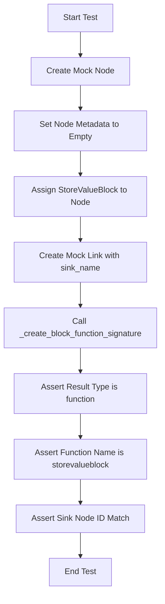

#### 带注释源码

```python
@pytest.mark.asyncio
async def test_smart_decision_maker_falls_back_to_block_name():
    """Test that SmartDecisionMakerBlock falls back to block.name when no customized_name."""
    # 导入必要的 mock 和类
    from unittest.mock import MagicMock

    from backend.blocks.basic import StoreValueBlock
    from backend.blocks.smart_decision_maker import SmartDecisionMakerBlock
    from backend.data.graph import Link, Node

    # 创建一个没有 customized_name 的模拟节点
    mock_node = MagicMock(spec=Node)
    mock_node.id = "test-node-id"
    mock_node.block_id = StoreValueBlock().id
    mock_node.block = StoreValueBlock()
    mock_node.metadata = {}  # 关键点：元数据为空，没有 customized_name

    # 创建一个模拟链接
    mock_link = MagicMock(spec=Link)
    mock_link.sink_name = "input"

    # 直接调用被测试的静态方法/方法
    result = await SmartDecisionMakerBlock._create_block_function_signature(
        mock_node, [mock_link]
    )

    # 验证工具名称使用了 Block 的默认名称
    assert result["type"] == "function"
    # StoreValueBlock 的默认名称清洗后通常为 "storevalueblock"
    assert result["function"]["name"] == "storevalueblock"  
    # 验证内部 sink 节点 ID 正确
    assert result["function"]["_sink_node_id"] == "test-node-id"
```


### `test_smart_decision_maker_uses_customized_name_for_agents`

该函数用于验证当代理节点的元数据中包含 `customized_name` 字段时，`SmartDecisionMakerBlock` 在为该代理节点创建函数签名时，是否能正确使用这个自定义名称（经过清洗处理后）作为工具名称，而不是使用默认的图名称。

参数：

返回值：`None`，无返回值。

#### 流程图

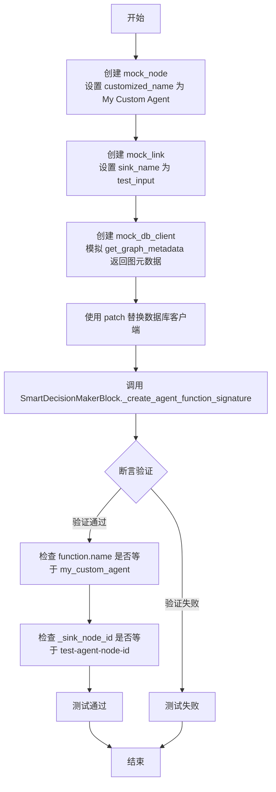

#### 带注释源码

```python
@pytest.mark.asyncio
async def test_smart_decision_maker_uses_customized_name_for_agents():
    """Test that SmartDecisionMakerBlock uses customized_name from metadata for agent nodes."""
    # 导入必要的 Mock 对象和类
    from unittest.mock import AsyncMock, MagicMock, patch

    from backend.blocks.smart_decision_maker import SmartDecisionMakerBlock
    from backend.data.graph import Link, Node

    # --- 准备测试数据：模拟 Agent 节点 ---
    # 创建一个模拟节点对象，模拟 AgentExecutorBlock 节点
    mock_node = MagicMock(spec=Node)
    mock_node.id = "test-agent-node-id"
    # 关键点：在元数据中设置了 customized_name
    mock_node.metadata = {"customized_name": "My Custom Agent"}
    # 模拟节点的默认输入数据
    mock_node.input_default = {
        "graph_id": "test-graph-id",
        "graph_version": 1,
        "input_schema": {"properties": {"test_input": {"description": "Test input"}}},
    }

    # --- 准备测试数据：模拟链接 ---
    # 创建一个模拟链接对象，用于连接到 Agent 节点
    mock_link = MagicMock(spec=Link)
    mock_link.sink_name = "test_input"

    # --- 准备 Mock 对象：模拟数据库客户端 ---
    # 因为 _create_agent_function_signature 内部需要查询数据库获取图信息，所以需要 Mock 数据库客户端
    mock_graph_meta = MagicMock()
    mock_graph_meta.name = "Original Agent Name"  # 数据库中存储的原始名称
    mock_graph_meta.description = "Agent description"

    mock_db_client = AsyncMock()
    mock_db_client.get_graph_metadata.return_value = mock_graph_meta

    # --- 执行测试 ---
    # 使用 patch 替换实际的数据库客户端获取函数，注入我们的 Mock 对象
    with patch(
        "backend.blocks.smart_decision_maker.get_database_manager_async_client",
        return_value=mock_db_client,
    ):
        # 调用静态方法生成 Agent 的函数签名
        result = await SmartDecisionMakerBlock._create_agent_function_signature(
            mock_node, [mock_link]
        )

    # --- 断言验证 ---
    # 验证返回的工具签名类型正确
    assert result["type"] == "function"
    # 验证工具名称使用了元数据中的 customized_name 并进行了小写和下划线处理
    # 预期 "My Custom Agent" -> "my_custom_agent"
    assert result["function"]["name"] == "my_custom_agent"  # Cleaned version
    # 验证内部节点 ID 被正确保存
    assert result["function"]["_sink_node_id"] == "test-agent-node-id"
```


### `test_smart_decision_maker_agent_falls_back_to_graph_name`

该函数是一个单元测试，用于验证 `SmartDecisionMakerBlock` 在生成代理节点的函数签名时，如果节点元数据（metadata）中未提供 `customized_name`，是否能正确回退使用图（Graph）的原始名称作为工具名称。

参数：

-  无

返回值：`None`，该函数为测试函数，执行断言验证但不返回任何值。

#### 流程图

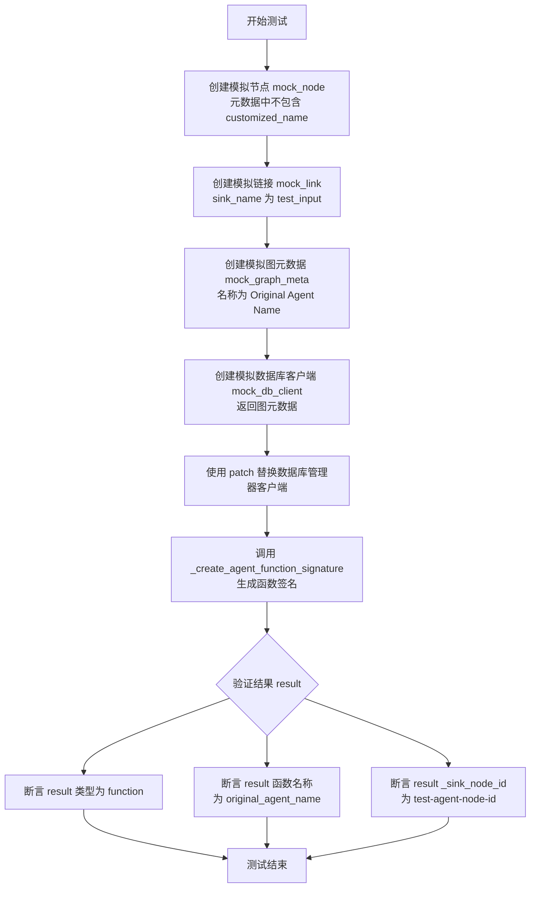

#### 带注释源码

```python
@pytest.mark.asyncio
async def test_smart_decision_maker_agent_falls_back_to_graph_name():
    """Test that agent node falls back to graph name when no customized_name."""
    from unittest.mock import AsyncMock, MagicMock, patch

    from backend.blocks.smart_decision_maker import SmartDecisionMakerBlock
    from backend.data.graph import Link, Node

    # --- 模拟节点设置 ---
    # 创建一个模拟节点，不包含 customized_name 在元数据中
    mock_node = MagicMock(spec=Node)
    mock_node.id = "test-agent-node-id"
    mock_node.metadata = {}  # No customized_name (无自定义名称)
    mock_node.input_default = {
        "graph_id": "test-graph-id",
        "graph_version": 1,
        "input_schema": {"properties": {"test_input": {"description": "Test input"}}},
    }

    # --- 模拟链接设置 ---
    # 创建一个模拟链接，连接到输入端
    mock_link = MagicMock(spec=Link)
    mock_link.sink_name = "test_input"

    # --- 模拟数据库和图元数据 ---
    # 模拟图的元数据，设置默认名称
    mock_graph_meta = MagicMock()
    mock_graph_meta.name = "Original Agent Name"
    mock_graph_meta.description = "Agent description"

    # 模拟数据库客户端，配置为返回上述图元数据
    mock_db_client = AsyncMock()
    mock_db_client.get_graph_metadata.return_value = mock_graph_meta

    # --- 执行测试 ---
    # Patch 数据库管理器的异步客户端，注入模拟对象
    with patch(
        "backend.blocks.smart_decision_maker.get_database_manager_async_client",
        return_value=mock_db_client,
    ):
        # 调用 SmartDecisionMakerBlock 的内部方法创建代理函数签名
        result = await SmartDecisionMakerBlock._create_agent_function_signature(
            mock_node, [mock_link]
        )

    # --- 断言验证 ---
    # 验证结果的类型为 "function"
    assert result["type"] == "function"
    
    # 验证函数名称使用了图的默认名称 "Original Agent Name" 并进行了清理 (变为小写+下划线)
    assert result["function"]["name"] == "original_agent_name"  # Graph name cleaned
    
    # 验证内部存储的 sink node ID 正确
    assert result["function"]["_sink_node_id"] == "test-agent-node-id"
```


## 关键组件


### SmartDecisionMakerBlock
The core decision-making component that utilizes LLMs to generate responses, determine tool usage, and manage execution statistics such as token counts.

### Tool Function Signature Generation
The mechanism responsible for dynamically generating OpenAI-compatible function definitions from graph nodes (Agents and Blocks), including handling customized naming conventions and parameter schemas.

### Parameter Validation Module
A validation layer that ensures tool call arguments generated by the LLM strictly adhere to the defined function schemas, checking for required fields and flagging unknown parameters.

### Agent Execution Engine
The logic controller that manages the "Agent Mode" workflow, iteratively executing tools, feeding results back to the LLM, and maintaining conversation history until a completion condition is met.

### Raw Response Normalization
The component that handles the conversion of heterogeneous raw response data from different LLM providers (e.g., Objects, Strings, Dicts) into a standardized dictionary format to ensure consistency in conversation history.

### LLM Interaction & Retry Logic
The component responsible for asynchronous communication with LLM providers, implementing retry mechanisms for parameter validation failures, and aggregating usage statistics.


## 问题及建议


### 已知问题

-   **代码冗余严重**：多个测试函数（如 `test_smart_decision_maker_parameter_validation` 和 `test_smart_decision_maker_raw_response_conversion`）之间存在大量重复的初始化代码，包括 `SmartDecisionMakerBlock` 实例化、`mock_execution_context` 创建、`mock_execution_processor` 配置以及 `input_data` 的构建，这增加了维护成本。
-   **测试范围混杂**：文件中同时包含了集成测试（依赖 `SpinTestServer`、数据库交互的 `test_graph_validation_with_tool_nodes_correct`）和单元测试（大量使用 `patch` 的测试）。这种混合导致测试执行环境不一致，且集成测试的失败可能掩盖单元测试的问题。
-   **过度依赖深层 Mock**：代码中大量使用了 `unittest.mock.patch` 对 `llm_call` 和内部方法进行深层打桩，这表明测试与 `SmartDecisionMakerBlock` 的内部实现细节耦合度较高，重构内部实现时容易导致测试大面积失败。
-   **硬编码的数据**：测试用例中充斥着硬编码的 ID（如 `"test-graph-id"`）、Token 数值和特定的 Prompt 字符串，缺乏统一的常量管理，当相关数据结构变更时修改繁琐。

### 优化建议

-   **引入 Pytest Fixtures**：将重复的测试前置条件（如 `SmartDecisionMakerBlock` 实例、默认的 `Input` 数据、模拟的 `ExecutionContext` 和 `ExecutionProcessor`）抽取为 `@pytest.fixture`，以实现Setup逻辑的复用。
-   **使用参数化测试**：对于 `test_smart_decision_maker_parameter_validation` 等包含多个相似测试用例（参数错误、缺失必填、可选缺失、全参数）的测试，建议使用 `@pytest.mark.parametrize` 将其合并为一个参数化测试函数，减少代码行数并提高可读性。
-   **构建 Mock 对象工厂**：创建辅助工厂函数（如 `create_mock_response` 或 `create_mock_tool_call`）来统一生成复杂的 `MagicMock` 对象，简化测试代码中的 Mock 配置逻辑。
-   **分离集成与单元测试**：将依赖 `SpinTestServer` 和数据库的集成测试移至单独的文件或目录，保持当前文件专注于 `SmartDecisionMakerBlock` 核心逻辑的单元测试，从而提高测试运行速度和隔离性。
-   **封装断言逻辑**：针对重复的输出断言（如检查 `tools_^_...` 格式的输出键），封装成专门的断言辅助函数（如 `assert_tool_output_exists`），提高测试意图的表达清晰度。


## 其它


### 设计目标与约束

**设计目标：**
本测试套件旨在全面验证 `SmartDecisionMakerBlock` 在不同场景下的逻辑正确性、鲁棒性和与外部系统的集成能力。
1.  **逻辑验证**：确保智能体能够正确解析 LLM 的工具调用请求，并准确映射到下游节点的输入参数。
2.  **模式验证**：验证“传统模式”（仅生成工具调用）与“代理模式”（循环执行工具直到任务完成）的行为差异。
3.  **数据一致性**：确保在不同 LLM 提供商（如 OpenAI, Ollama）返回不同格式的 `raw_response` 时，系统能够统一处理并维护对话历史。
4.  **统计准确性**：验证对 LLM Token 使用量和调用次数的统计功能是否精确。

**约束条件：**
1.  **隔离性**：测试环境必须与真实的数据库和 LLM 服务隔离，全程使用 Mock 对象，以确保测试的确定性和速度。
2.  **异步兼容**：由于 `SmartDecisionMakerBlock` 是基于 `asyncio` 实现的，所有测试用例必须支持异步执行。
3.  **响应格式兼容**：代码逻辑必须能够处理 `ChatCompletionMessage` 对象、字典以及字符串三种不同类型的 LLM 原始响应，不能因类型差异而崩溃。

### 错误处理与异常设计

本部分描述 `SmartDecisionMakerBlock` 在测试中体现的异常处理机制：

1.  **参数验证机制**：
    *   **场景**：当 LLM 返回的工具调用参数中包含未定义的字段（拼写错误）或缺少必填字段时。
    *   **处理逻辑**：系统会捕获参数验证错误，构建包含详细错误信息（如“Unknown parameters”或“Missing required parameters”）的提示词，并根据配置的重试次数（`retry` 参数）重新请求 LLM。
    *   **异常抛出**：如果重试次数耗尽仍无法修正参数错误，系统抛出 `ValueError` 并终止执行。

2.  **Raw Response 类型转换错误处理**：
    *   **场景**：不同 LLM 提供商返回的 `raw_response` 类型不一致（如 OpenAI 返回对象，Ollama 返回字符串）。
    *   **处理逻辑**：内部通过辅助函数检测并标准化 `raw_response`，确保在进行历史记录维护或 `.get()` 操作时不会因 `AttributeError` 失败。

3.  **执行中断**：
    *   **场景**：在代理模式下，如果工具执行返回错误或达到最大迭代次数（`agent_mode_max_iterations`），系统应停止循环并返回当前状态。

### 数据流与状态机

**数据流：**
1.  **输入阶段**：测试数据（Prompt, Credentials）注入 `SmartDecisionMakerBlock.Input`。
2.  **决策阶段**：Mock 的 `llm_call` 返回决策结果（文本响应或工具调用列表）。
3.  **验证与执行分支**：
    *   **如果是文本**：直接作为最终输出（`finished`）。
    *   **如果是工具调用**：
        *   **传统模式**：输出工具参数映射（`tools_^_...`），等待外部系统消费。
        *   **代理模式**：通过 `execution_processor.on_node_execution` 同步执行工具，获取工具输出，并将其添加到对话历史中，再次触发 LLM 调用。
4.  **统计阶段**：累加每次交互的 `prompt_tokens` 和 `completion_tokens` 到 `execution_stats`。

**状态机：**
主要定义了“代理模式”下的执行循环状态：
*   **初始态**：接收 Prompt，构建初始消息列表。
*   **循环态**：
    *   调用 LLM -> 获取 Tool Calls。
    *   验证参数 -> 若失败且未达重试上限，则回退到调用 LLM；若失败且达上限，则抛出异常。
    *   执行工具 -> 获取 Tool Outputs。
    *   更新历史 -> 将 Tool Outputs 写入 Messages。
    *   判断 -> 若无 Tool Calls 或达到 `max_iterations`，转入终止态；否则保持在循环态。
*   **终止态**：输出最终文本或结果，结束异步生成器。

### 外部依赖与接口契约

测试代码通过 Mock 定义了以下核心外部接口的契约：

1.  **LLM 服务接口 (`backend.blocks.llm.llm_call`)**
    *   **输入**：Prompt 列表、模型名称、凭据、工具函数定义、温度等参数。
    *   **输出**：包含以下字段的响应对象：
        *   `response`: 文本内容（字符串）。
        *   `tool_calls`: 工具调用列表（对象数组，包含 `id`, `function.name`, `function.arguments`）。
        *   `raw_response`: 原始响应数据，兼容 Object/Dict/String。
        *   `prompt_tokens`: 输入 Token 数（整数）。
        *   `completion_tokens`: 输出 Token 数（整数）。

2.  **执行处理器接口 (`execution_processor`)**
    *   **方法**：`async def on_node_execution(...)`
    *   **契约**：在代理模式下调用，接收节点执行请求，负责调度子图的运行，并返回包含 `error` 状态和输出数据的执行统计对象。

3.  **数据库客户端接口 (`get_database_manager_async_client`)**
    *   **方法**：`async def get_graph_metadata(graph_id, version)`
    *   **契约**：根据图 ID 和版本号返回图的元数据（包含 `name` 和 `description`），用于生成 Agent 节点的工具描述。

### 测试策略与范围

**测试范围：**
1.  **单元测试**：针对 `_create_tool_node_signatures`、`_create_block_function_signature` 等私有方法的参数校验和命名逻辑进行隔离测试。
2.  **集成测试**：针对 `block.run` 主流程，模拟完整的 LLM 交互循环，验证参数传递、输出格式化和状态更新。
3.  **边界测试**：测试参数缺失、类型错误、重试机制耗尽等异常边界情况。

**Mock 策略：**
*   **替换底层依赖**：使用 `unittest.mock.patch` 替换 `llm_call` 和数据库操作，消除了对网络和真实数据库的依赖。
*   **Side Effects**：利用 `side_effect` 模拟多次 LLM 调用的不同返回（例如第一次返回工具调用，第二次返回结束文本），以测试代理模式的循环逻辑。
*   **数据构造**：直接构造 `MagicMock` 对象来模拟复杂的 LLM 响应结构（如 `ChatCompletionMessage`），特别是为了测试对特定类型的兼容性修复。

    