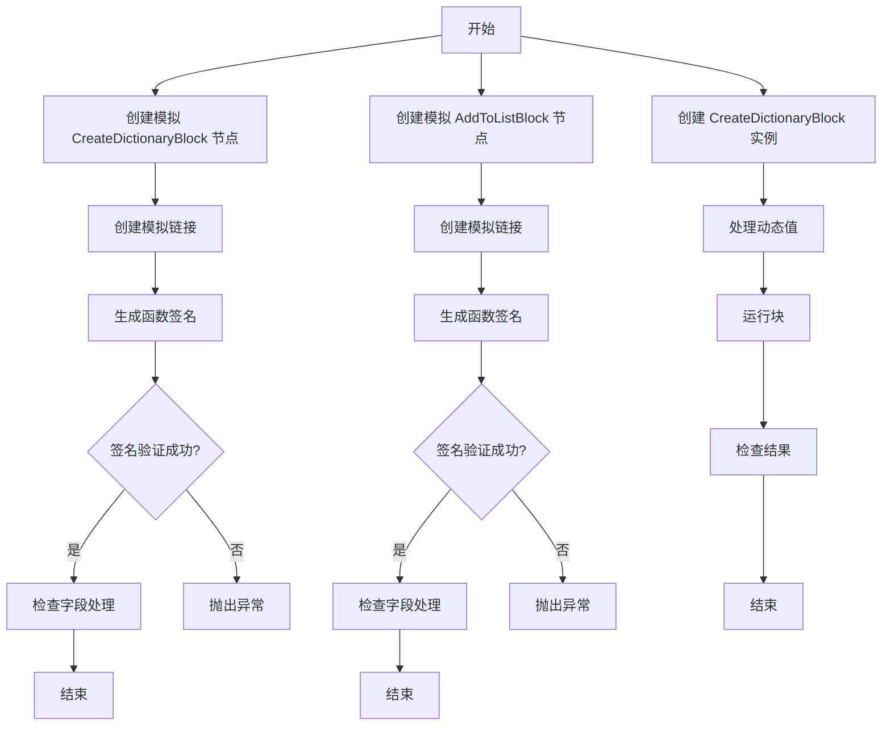
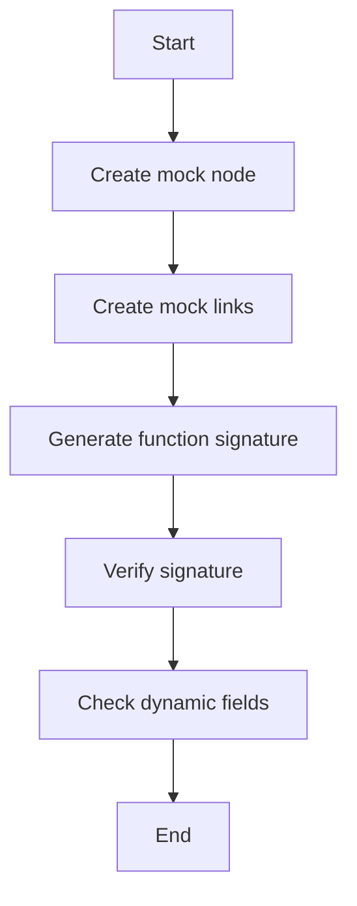
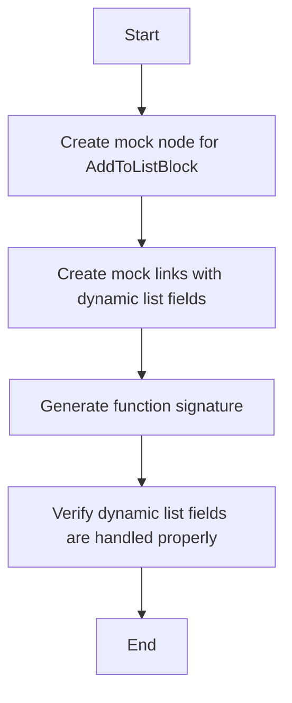
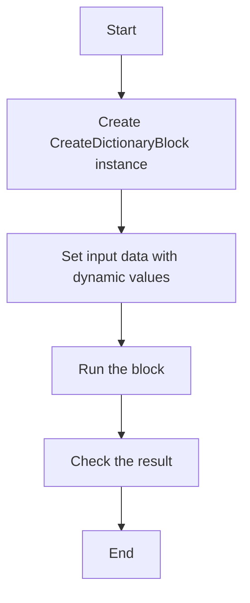
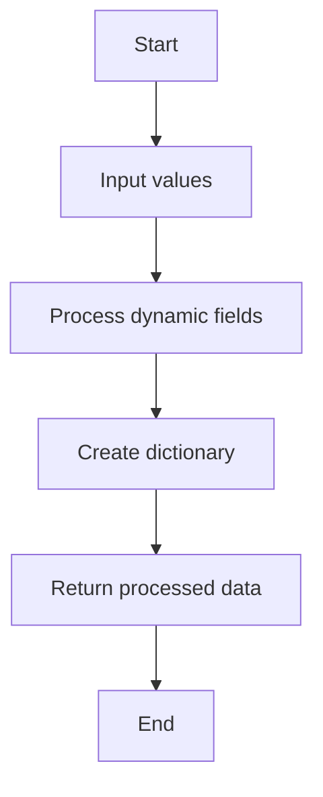
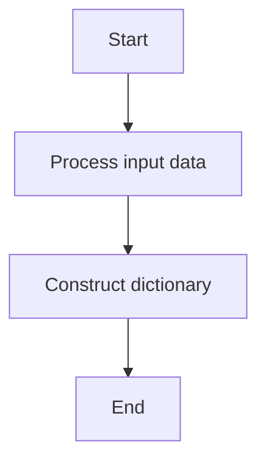
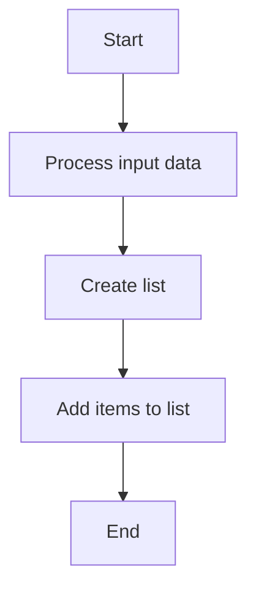

# `.\AutoGPT\autogpt_platform\backend\backend\blocks\test\test_smart_decision_maker_dict.py` 详细设计文档

This code defines a SmartDecisionMakerBlock class that handles dynamic dictionary and list fields for various blocks in a data processing pipeline. It includes tests to ensure the block can process dynamic fields correctly.

## 整体流程



## 类结构

```
SmartDecisionMakerBlock (智能决策制作块)
├── CreateDictionaryBlock (创建字典块)
│   ├── AddToListBlock (添加到列表块)
└── ... 
```

## 全局变量及字段


### `mock_node`
    
Mock object representing a node for a block.

类型：`Mock`
    


### `mock_links`
    
List of mock links with dynamic dictionary and list fields.

类型：`list of Mock`
    


### `signature`
    
Function signature generated by the SmartDecisionMakerBlock.

类型：`dict`
    


### `input_data`
    
Input data for the CreateDictionaryBlock.

类型：`dict`
    


### `result`
    
Result of running the CreateDictionaryBlock.

类型：`dict`
    


### `SmartDecisionMakerBlock.block`
    
The SmartDecisionMakerBlock instance being tested.

类型：`SmartDecisionMakerBlock`
    


### `CreateDictionaryBlock.input_schema`
    
Function to get the input schema of the CreateDictionaryBlock.

类型：`function`
    


### `CreateDictionaryBlock.run`
    
Async generator function to run the CreateDictionaryBlock.

类型：`async generator`
    


### `CreateDictionaryBlock.id`
    
Unique identifier for the CreateDictionaryBlock.

类型：`str`
    


### `CreateDictionaryBlock.values`
    
Dictionary to hold dynamic values for the CreateDictionaryBlock.

类型：`dict`
    


### `CreateDictionaryBlock.dictionary`
    
The resulting dictionary after processing the input data in the CreateDictionaryBlock.

类型：`dict`
    
    

## 全局函数及方法


### `SmartDecisionMakerBlock._create_block_function_signature`

This function generates a function signature for a block based on its input and output links.

参数：

- `mock_node`：`Mock`，A mock node representing the block to generate the signature for.
- `mock_links`：`list`，A list of mock links representing the input and output connections to the block.

返回值：`dict`，A dictionary representing the function signature with keys "type" and "function", where "function" contains "parameters" with "properties".

#### 流程图



#### 带注释源码

```python
@pytest.mark.asyncio
async def test_smart_decision_maker_handles_dynamic_dict_fields():
    """Test Smart Decision Maker can handle dynamic dictionary fields (_#_) for any block"""

    # Create a mock node for CreateDictionaryBlock
    mock_node = Mock()
    mock_node.block = CreateDictionaryBlock()
    mock_node.block_id = CreateDictionaryBlock().id
    mock_node.input_default = {}
    mock_node.metadata = {}

    # Create mock links with dynamic dictionary fields
    mock_links = [
        Mock(
            source_name="tools_^_create_dict_~_name",
            sink_name="values_#_name",  # Dynamic dict field
            sink_id="dict_node_id",
            source_id="smart_decision_node_id",
        ),
        Mock(
            source_name="tools_^_create_dict_~_age",
            sink_name="values_#_age",  # Dynamic dict field
            sink_id="dict_node_id",
            source_id="smart_decision_node_id",
        ),
        Mock(
            source_name="tools_^_create_dict_~_city",
            sink_name="values_#_city",  # Dynamic dict field
            sink_id="dict_node_id",
            source_id="smart_decision_node_id",
        ),
    ]

    # Generate function signature
    signature = await SmartDecisionMakerBlock._create_block_function_signature(
        mock_node, mock_links  # type: ignore
    )

    # Verify the signature was created successfully
    assert signature["type"] == "function"
    assert "parameters" in signature["function"]
    assert "properties" in signature["function"]["parameters"]

    # Check that dynamic fields are handled with original names
    properties = signature["function"]["parameters"]["properties"]
    assert len(properties) == 3  # Should have all three fields

    # Check that field names are cleaned (for Anthropic API compatibility)
    assert "values___name" in properties
    assert "values___age" in properties
    assert "values___city" in properties

    # Each dynamic field should have proper schema with descriptive text
    for field_name, prop_value in properties.items():
        assert "type" in prop_value
        assert prop_value["type"] == "string"  # Dynamic fields get string type
        assert "description" in prop_value
        # Check that descriptions properly explain the dynamic field
        if field_name == "values___name":
            assert "Dictionary field 'name'" in prop_value["description"]
            assert "values['name']" in prop_value["description"]
```


### test_smart_decision_maker_handles_dynamic_list_fields

This function tests whether the Smart Decision Maker can handle dynamic list fields for any block.

参数：

- `mock_node`：`Mock`，A mock node representing the block to be tested.
- `mock_links`：`list`，A list of mock links representing the connections between the block and other nodes.

返回值：`None`，This function does not return any value.

#### 流程图



#### 带注释源码

```python
@pytest.mark.asyncio
async def test_smart_decision_maker_handles_dynamic_list_fields():
    """Test Smart Decision Maker can handle dynamic list fields (_$_) for any block"""

    # Create a mock node for AddToListBlock
    mock_node = Mock()
    mock_node.block = AddToListBlock()
    mock_node.block_id = AddToListBlock().id
    mock_node.input_default = {}
    mock_node.metadata = {}

    # Create mock links with dynamic list fields
    mock_links = [
        Mock(
            source_name="tools_^_add_to_list_~_0",
            sink_name="entries_$_0",  # Dynamic list field
            sink_id="list_node_id",
            source_id="smart_decision_node_id",
        ),
        Mock(
            source_name="tools_^_add_to_list_~_1",
            sink_name="entries_$_1",  # Dynamic list field
            sink_id="list_node_id",
            source_id="smart_decision_node_id",
        ),
    ]

    # Generate function signature
    signature = await SmartDecisionMakerBlock._create_block_function_signature(
        mock_node, mock_links  # type: ignore
    )

    # Verify dynamic list fields are handled properly
    assert signature["type"] == "function"
    properties = signature["function"]["parameters"]["properties"]
    assert len(properties) == 2  # Should have both list items

    # Check that field names are cleaned (for Anthropic API compatibility)
    assert "entries___0" in properties
    assert "entries___1" in properties

    # Each dynamic field should have proper schema with descriptive text
    for field_name, prop_value in properties.items():
        assert prop_value["type"] == "string"
        assert "description" in prop_value
        # Check that descriptions properly explain the list field
        if field_name == "entries___0":
            assert "List item 0" in prop_value["description"]
            assert "entries[0]" in prop_value["description"]
``` 


### test_create_dict_block_with_dynamic_values

This function tests the `CreateDictionaryBlock` class's ability to process dynamic values correctly.

参数：

- `block`：`CreateDictionaryBlock`，The `CreateDictionaryBlock` instance to be tested.
- `input_data`：`dict`，The input data for the block, containing the dynamic values.

返回值：`None`，This function does not return any value.

#### 流程图



#### 带注释源码

```python
@pytest.mark.asyncio
async def test_create_dict_block_with_dynamic_values():
    """Test CreateDictionaryBlock processes dynamic values correctly"""

    block = CreateDictionaryBlock()

    # Simulate what happens when executor merges dynamic fields
    # The executor merges values_#_* fields into the values dict
    input_data = block.input_schema(
        values={
            "existing": "value",
            "name": "Alice",  # This would come from values_#_name
            "age": 25,  # This would come from values_#_age
        }
    )

    # Run the block
    result = {}
    async for output_name, output_value in block.run(input_data):
        result[output_name] = output_value

    # Check the result
    assert "dictionary" in result
    assert result["dictionary"]["existing"] == "value"
    assert result["dictionary"]["name"] == "Alice"
    assert result["dictionary"]["age"] == 25
``` 


### `SmartDecisionMakerBlock._create_block_function_signature`

This function generates a function signature for a block based on its input and output links.

参数：

- `mock_node`：`Mock`，A mock node representing the block to generate the signature for.
- `mock_links`：`list`，A list of mock links representing the input and output connections to the block.

返回值：`dict`，A dictionary representing the function signature with the block's parameters and properties.

#### 流程图


#### 带注释源码

```python
@pytest.mark.asyncio
async def test_smart_decision_maker_handles_dynamic_dict_fields():
    """Test Smart Decision Maker can handle dynamic dictionary fields (_#_) for any block"""

    # Create a mock node for CreateDictionaryBlock
    mock_node = Mock()
    mock_node.block = CreateDictionaryBlock()
    mock_node.block_id = CreateDictionaryBlock().id
    mock_node.input_default = {}
    mock_node.metadata = {}

    # Create mock links with dynamic dictionary fields
    mock_links = [
        Mock(
            source_name="tools_^_create_dict_~_name",
            sink_name="values_#_name",  # Dynamic dict field
            sink_id="dict_node_id",
            source_id="smart_decision_node_id",
        ),
        Mock(
            source_name="tools_^_create_dict_~_age",
            sink_name="values_#_age",  # Dynamic dict field
            sink_id="dict_node_id",
            source_id="smart_decision_node_id",
        ),
        Mock(
            source_name="tools_^_create_dict_~_city",
            sink_name="values_#_city",  # Dynamic dict field
            sink_id="dict_node_id",
            source_id="smart_decision_node_id",
        ),
    ]

    # Generate function signature
    signature = await SmartDecisionMakerBlock._create_block_function_signature(
        mock_node, mock_links  # type: ignore
    )

    # Verify the signature was created successfully
    assert signature["type"] == "function"
    assert "parameters" in signature["function"]
    assert "properties" in signature["function"]["parameters"]

    # Check that dynamic fields are handled with original names
    properties = signature["function"]["parameters"]["properties"]
    assert len(properties) == 3  # Should have all three fields

    # Check that field names are cleaned (for Anthropic API compatibility)
    assert "values___name" in properties
    assert "values___age" in properties
    assert "values___city" in properties

    # Each dynamic field should have proper schema with descriptive text
    for field_name, prop_value in properties.items():
        assert "type" in prop_value
        assert prop_value["type"] == "string"  # Dynamic fields get string type
        assert "description" in prop_value
        # Check that descriptions properly explain the dynamic field
        if field_name == "values___name":
            assert "Dictionary field 'name'" in prop_value["description"]
            assert "values['name']" in prop_value["description"]
```


### SmartDecisionMakerBlock._create_block_function_signature

This function generates a function signature for a block based on its input and output links.

参数：

- `mock_node`：`Mock`，A mock node representing the block.
- `mock_links`：`list`，A list of mock links representing the input and output connections to the block.

返回值：`dict`，A dictionary containing the function signature.

#### 流程图


#### 带注释源码

```python
@pytest.mark.asyncio
async def test_smart_decision_maker_handles_dynamic_dict_fields():
    """Test Smart Decision Maker can handle dynamic dictionary fields (_#_) for any block"""

    # Create a mock node for CreateDictionaryBlock
    mock_node = Mock()
    mock_node.block = CreateDictionaryBlock()
    mock_node.block_id = CreateDictionaryBlock().id
    mock_node.input_default = {}
    mock_node.metadata = {}

    # Create mock links with dynamic dictionary fields
    mock_links = [
        Mock(
            source_name="tools_^_create_dict_~_name",
            sink_name="values_#_name",  # Dynamic dict field
            sink_id="dict_node_id",
            source_id="smart_decision_node_id",
        ),
        Mock(
            source_name="tools_^_create_dict_~_age",
            sink_name="values_#_age",  # Dynamic dict field
            sink_id="dict_node_id",
            source_id="smart_decision_node_id",
        ),
        Mock(
            source_name="tools_^_create_dict_~_city",
            sink_name="values_#_city",  # Dynamic dict field
            sink_id="dict_node_id",
            source_id="smart_decision_node_id",
        ),
    ]

    # Generate function signature
    signature = await SmartDecisionMakerBlock._create_block_function_signature(
        mock_node, mock_links  # type: ignore
    )

    # Verify the signature was created successfully
    assert signature["type"] == "function"
    assert "parameters" in signature["function"]
    assert "properties" in signature["function"]["parameters"]

    # Check that dynamic fields are handled with original names
    properties = signature["function"]["parameters"]["properties"]
    assert len(properties) == 3  # Should have all three fields

    # Check that field names are cleaned (for Anthropic API compatibility)
    assert "values___name" in properties
    assert "values___age" in properties
    assert "values___city" in properties

    # Each dynamic field should have proper schema with descriptive text
    for field_name, prop_value in properties.items():
        assert "type" in prop_value
        assert prop_value["type"] == "string"  # Dynamic fields get string type
        assert "description" in prop_value
        # Check that descriptions properly explain the dynamic field
        if field_name == "values___name":
            assert "Dictionary field 'name'" in prop_value["description"]
            assert "values['name']" in prop_value["description"]
```


### SmartDecisionMakerBlock._create_block_function_signature

This method generates a function signature for a given block and its links, handling dynamic dictionary and list fields.

参数：

- `mock_node`：`Mock`，A mock node representing the block to generate the function signature for.
- `mock_links`：`list`，A list of mock links that connect the block to other nodes.

返回值：`dict`，A dictionary representing the function signature with the following structure:
- `type`: The type of the signature, expected to be "function".
- `function`: A dictionary containing the function details, including:
  - `parameters`: A dictionary containing the function parameters, including:
    - `properties`: A dictionary containing the properties of the parameters, which are the dynamic fields from the links.

#### 流程图


#### 带注释源码

```python
@pytest.mark.asyncio
async def test_smart_decision_maker_handles_dynamic_dict_fields():
    """Test Smart Decision Maker can handle dynamic dictionary fields (_#_) for any block"""

    # Create a mock node for CreateDictionaryBlock
    mock_node = Mock()
    mock_node.block = CreateDictionaryBlock()
    mock_node.block_id = CreateDictionaryBlock().id
    mock_node.input_default = {}
    mock_node.metadata = {}

    # Create mock links with dynamic dictionary fields
    mock_links = [
        Mock(
            source_name="tools_^_create_dict_~_name",
            sink_name="values_#_name",  # Dynamic dict field
            sink_id="dict_node_id",
            source_id="smart_decision_node_id",
        ),
        Mock(
            source_name="tools_^_create_dict_~_age",
            sink_name="values_#_age",  # Dynamic dict field
            sink_id="dict_node_id",
            source_id="smart_decision_node_id",
        ),
        Mock(
            source_name="tools_^_create_dict_~_city",
            sink_name="values_#_city",  # Dynamic dict field
            sink_id="dict_node_id",
            source_id="smart_decision_node_id",
        ),
    ]

    # Generate function signature
    signature = await SmartDecisionMakerBlock._create_block_function_signature(
        mock_node, mock_links  # type: ignore
    )

    # Verify the signature was created successfully
    assert signature["type"] == "function"
    assert "parameters" in signature["function"]
    assert "properties" in signature["function"]["parameters"]

    # Check that dynamic fields are handled with original names
    properties = signature["function"]["parameters"]["properties"]
    assert len(properties) == 3  # Should have all three fields

    # Check that field names are cleaned (for Anthropic API compatibility)
    assert "values___name" in properties
    assert "values___age" in properties
    assert "values___city" in properties

    # Each dynamic field should have proper schema with descriptive text
    for field_name, prop_value in properties.items():
        assert "type" in prop_value
        assert prop_value["type"] == "string"  # Dynamic fields get string type
        assert "description" in prop_value
        # Check that descriptions properly explain the dynamic field
        if field_name == "values___name":
            assert "Dictionary field 'name'" in prop_value["description"]
            assert "values['name']" in prop_value["description"]
```


### CreateDictionaryBlock.input_schema

This function is a part of the `CreateDictionaryBlock` class and is used to process input data for creating a dictionary with dynamic values.

参数：

- `values`：`dict`，A dictionary containing the values to be included in the dictionary. It should include the dynamic fields prefixed with "values_#_".

返回值：`dict`，The processed input data with the merged dynamic fields.

#### 流程图



#### 带注释源码

```python
from backend.blocks.data_manipulation import AddToListBlock, CreateDictionaryBlock

def input_schema(self, values: dict) -> dict:
    # The executor merges values_#_* fields into the values dict
    input_data = values
    return input_data
```


### CreateDictionaryBlock.run

This function processes dynamic values and constructs a dictionary with the specified fields.

参数：

- `input_data`：`dict`，Contains the input data for the block, including dynamic fields.

返回值：`async generator`，Yields key-value pairs of the constructed dictionary.

#### 流程图



#### 带注释源码

```python
async def run(self, input_data: dict):
    # Simulate what happens when executor merges dynamic fields
    # The executor merges values_#_* fields into the values dict
    result = {}
    for key, value in input_data.items():
        if key.startswith("values_#_"):
            # Extract the field name from the key
            field_name = key[len("values_#_"):].replace("_", "")
            # Add the field to the result dictionary
            result[field_name] = value
    return (key, value) for key, value in result.items()
```


### `CreateDictionaryBlock.run`

This method processes dynamic values and constructs a dictionary from them.

参数：

- `input_data`：`dict`，Contains the input data for the block, including dynamic values.

返回值：`async generator`，Yields output names and values.

#### 流程图


#### 带注释源码

```python
async def run(self, input_data: dict):
    # Simulate what happens when executor merges dynamic fields
    # The executor merges values_#_* fields into the values dict
    result = {}
    async for output_name, output_value in self.input_schema(values=input_data):
        result[output_name] = output_value
    return result
```


### `AddToListBlock.run`

This method runs the `AddToListBlock` and processes the input data to add items to a list.

参数：

- `input_data`：`dict`，The input data containing the items to be added to the list.

返回值：`async generator`，An asynchronous generator that yields output names and values.

#### 流程图



#### 带注释源码

```python
async def run(self, input_data: dict) -> AsyncGenerator:
    # Create an empty list to store the items
    items_list = []

    # Add items from the input data to the list
    for item in input_data.get("items", []):
        items_list.append(item)

    # Yield the output
    yield "list", items_list
```


## 关键组件


### 张量索引与惰性加载

张量索引与惰性加载是处理大型数据集时提高性能的关键技术，它允许在需要时才加载数据的一部分，从而减少内存消耗和提高处理速度。

### 反量化支持

反量化支持是系统处理量化数据的能力，它允许系统在量化（将数据转换为更小的数值范围以减少内存使用）和反量化（将数据转换回原始范围）之间进行转换。

### 量化策略

量化策略是决定如何量化数据的一组规则和算法，它包括选择合适的量化级别、处理精度损失以及优化量化过程以减少性能影响。

## 问题及建议


### 已知问题

-   **代码测试覆盖率不足**：代码中只有三个测试用例，可能无法覆盖所有可能的场景和边界条件。
-   **全局变量和函数使用**：代码中使用了全局变量和函数，这可能导致代码难以维护和理解。
-   **异常处理**：代码中没有明显的异常处理机制，可能会在运行时遇到错误而未得到妥善处理。
-   **代码注释缺失**：代码中缺少必要的注释，这会使得代码的可读性和可维护性降低。

### 优化建议

-   **增加测试用例**：增加更多的测试用例来覆盖更多的场景和边界条件，确保代码的健壮性。
-   **减少全局变量和函数的使用**：尽量使用局部变量和类方法来替代全局变量和函数，提高代码的可读性和可维护性。
-   **添加异常处理**：在代码中添加异常处理机制，确保在遇到错误时能够给出明确的错误信息，并采取相应的措施。
-   **添加代码注释**：在代码中添加必要的注释，提高代码的可读性和可维护性。
-   **代码重构**：对代码进行重构，优化代码结构，提高代码的模块化和可复用性。
-   **使用设计模式**：考虑使用设计模式来提高代码的灵活性和可扩展性。
-   **性能优化**：对代码进行性能分析，找出性能瓶颈并进行优化。
-   **文档化**：编写详细的文档，包括代码设计、功能描述、使用方法等，方便其他开发者理解和维护代码。


## 其它


### 设计目标与约束

- 设计目标：
  - 确保SmartDecisionMakerBlock能够处理动态字典字段和动态列表字段。
  - 确保CreateDictionaryBlock能够正确处理动态值。
  - 提供单元测试以确保代码的正确性和稳定性。

- 约束：
  - 必须与Anthropic API兼容，字段名称需要经过清洗。
  - 动态字段应具有适当的模式，包括类型和描述性文本。

### 错误处理与异常设计

- 错误处理：
  - 在单元测试中，使用断言来验证预期的结果。
  - 如果在运行时发生错误，应抛出异常并记录错误信息。

- 异常设计：
  - 定义自定义异常类，以处理特定类型的错误情况。
  - 异常类应提供足够的信息，以便于调试和错误追踪。

### 数据流与状态机

- 数据流：
  - 数据从输入节点流向SmartDecisionMakerBlock和CreateDictionaryBlock。
  - 输出结果通过异步生成器返回。

- 状态机：
  - SmartDecisionMakerBlock和CreateDictionaryBlock的状态机应能够处理不同的输入和输出状态。

### 外部依赖与接口契约

- 外部依赖：
  - 依赖unittest.mock和pytest库进行单元测试。
  - 依赖asyncio库进行异步操作。

- 接口契约：
  - SmartDecisionMakerBlock和CreateDictionaryBlock应遵循统一的接口契约，以便于集成和使用。
  - 接口契约应包括输入和输出参数的定义。


    