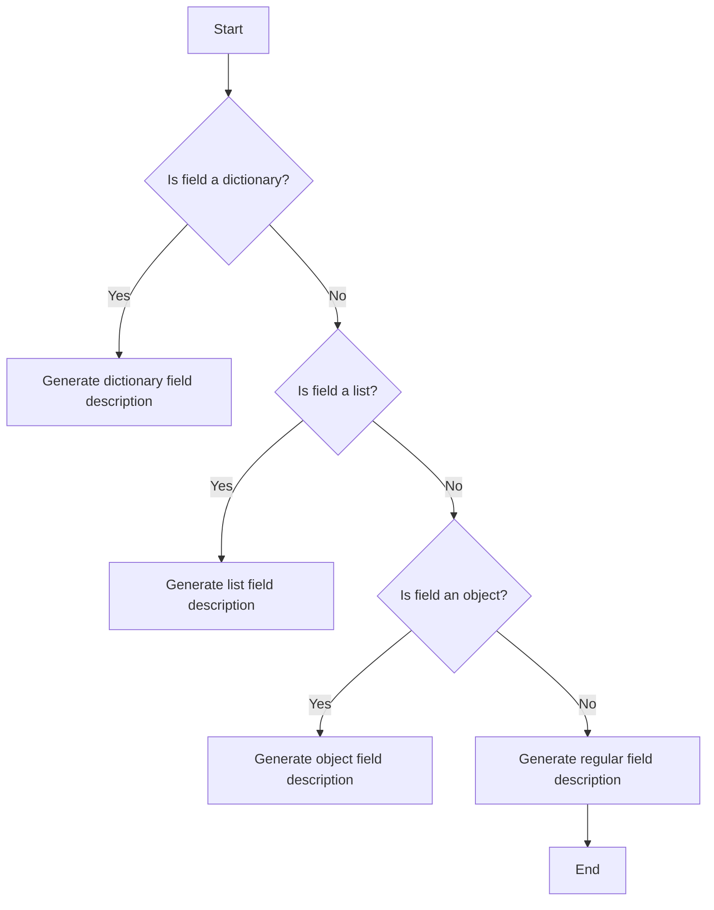
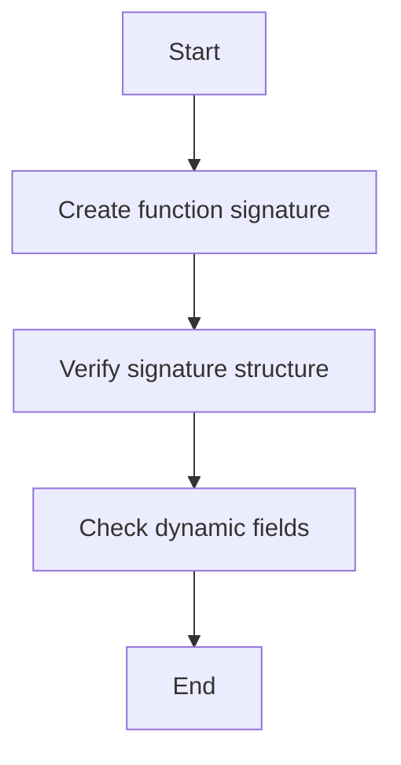
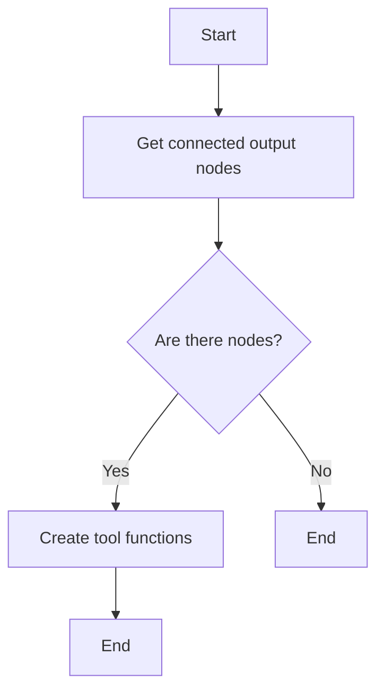
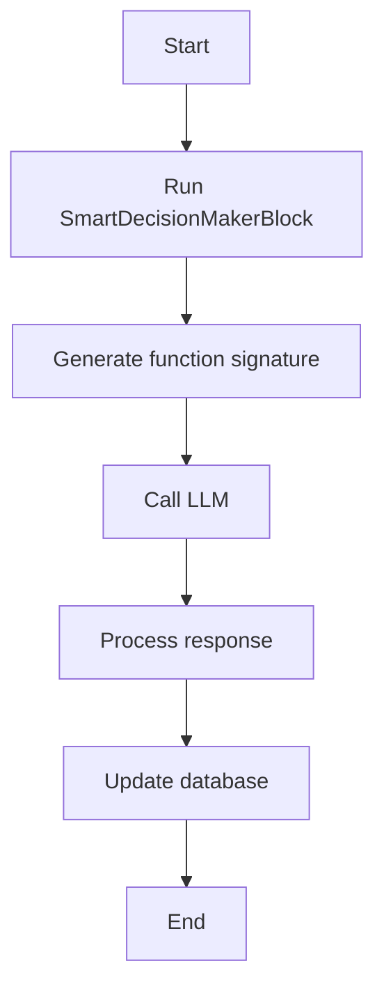
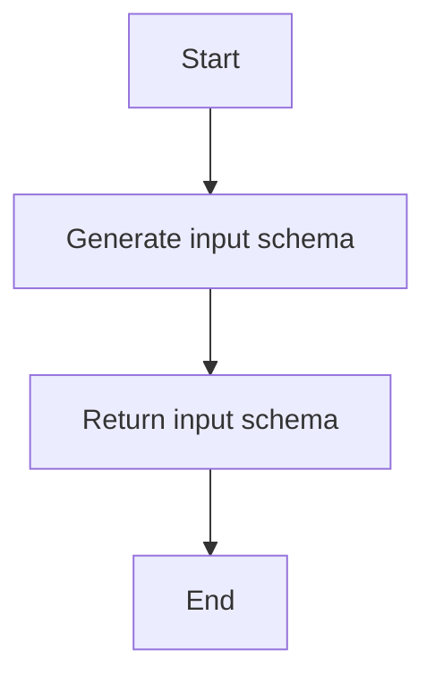
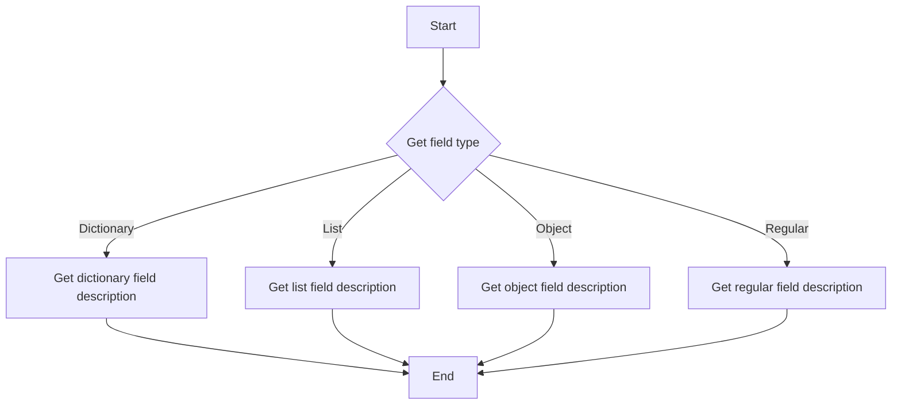
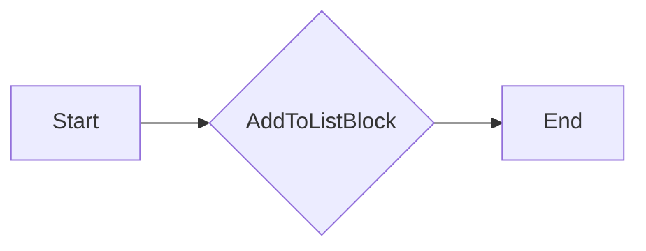
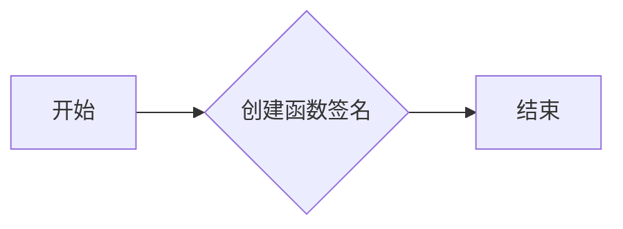
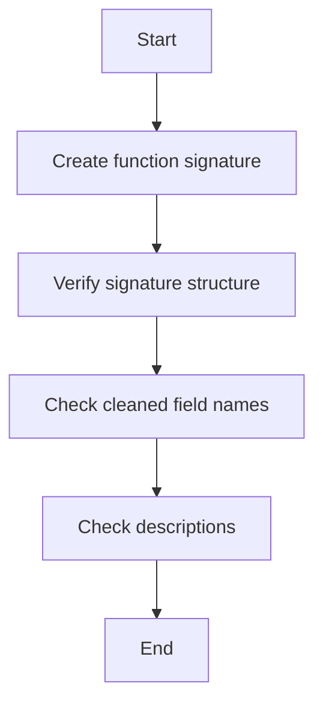

# `.\AutoGPT\autogpt_platform\backend\backend\blocks\test\test_smart_decision_maker_dynamic_fields.py` 详细设计文档

This file contains comprehensive tests for the SmartDecisionMakerBlock, focusing on dynamic field handling and function signature generation.

## 整体流程

```mermaid
graph TD
    A[Start] --> B[Get dynamic field description for 'values_#_name']
    B --> C[Assert description contains 'Dictionary field' and 'values['name']']
    B --> D[Get dynamic field description for 'items_$_0']
    D --> E[Assert description contains 'List item 0' and 'items[0]']
    D --> F[Get dynamic field description for 'user_@_email']
    F --> G[Assert description contains 'Object attribute' and 'user.email']
    F --> H[Get dynamic field description for 'regular_field']
    H --> I[Assert description is 'Value for regular_field']
    A --> J[Create block function signature with dict fields] --> K[Assert signature structure and field names] --> L[Assert descriptions mention dictionary fields]
    A --> M[Create block function signature with list fields] --> N[Assert signature structure and field names] --> O[Assert descriptions mention list items]
    A --> P[Create block function signature with object fields] --> Q[Assert signature structure and field names] --> R[Assert descriptions mention object attributes]
    A --> S[Create tool node signatures] --> T[Assert tool functions and dynamic field names] --> U[Assert tool functions contain the dynamic field names]
    A --> V[Output yielding with dynamic fields] --> W[Assert outputs use sink node ID in output keys] --> X[Assert outputs contain correct values]
    A --> Y[Handle mixed regular and dynamic fields] --> Z[Assert properties and descriptions] --> AA[Assert regular field has its original schema] --> AB[Assert dynamic fields have generated descriptions]
    A --> AC[Validation errors don't pollute conversation] --> AD[Assert final conversation does NOT contain validation error messages]
```

## 类结构

```
SmartDecisionMakerBlock (测试用例基类)
├── test_dynamic_field_description_generation (测试动态字段描述生成)
│   ├── get_dynamic_field_description (获取动态字段描述)
│   ├── assert (断言)
├── test_create_block_function_signature_with_dict_fields (测试创建带有字典字段的块函数签名)
│   ├── SmartDecisionMakerBlock (智能决策块)
│   ├── _create_block_function_signature (创建块函数签名)
│   ├── assert (断言)
├── test_create_block_function_signature_with_list_fields (测试创建带有列表字段的块函数签名)
│   ├── SmartDecisionMakerBlock (智能决策块)
│   ├── _create_block_function_signature (创建块函数签名)
│   ├── assert (断言)
├── test_create_block_function_signature_with_object_fields (测试创建带有对象字段的块函数签名)
│   ├── SmartDecisionMakerBlock (智能决策块)
│   ├── _create_block_function_signature (创建块函数签名)
│   ├── assert (断言)
├── test_create_tool_node_signatures (测试创建工具节点签名)
│   ├── SmartDecisionMakerBlock (智能决策块)
│   ├── _create_tool_node_signatures (创建工具节点签名)
│   ├── assert (断言)
├── test_output_yielding_with_dynamic_fields (测试带有动态字段的输出生成)
│   ├── SmartDecisionMakerBlock (智能决策块)
│   ├── run (运行)
│   ├── assert (断言)
├── test_mixed_regular_and_dynamic_fields (测试混合常规和动态字段)
│   ├── SmartDecisionMakerBlock (智能决策块)
│   ├── _create_block_function_signature (创建块函数签名)
│   ├── assert (断言)
├── test_validation_errors_dont_pollute_conversation (测试验证错误不会污染对话)
│   ├── SmartDecisionMakerBlock (智能决策块)
│   ├── run (运行)
│   ├── assert (断言)
```

## 全局变量及字段


### `SmartDecisionMakerBlock`
    
The main class for the SmartDecisionMakerBlock, responsible for handling dynamic fields and creating function signatures.

类型：`class`
    


### `AddToListBlock`
    
A class representing a block that adds items to a list.

类型：`class`
    


### `CreateDictionaryBlock`
    
A class representing a block that creates a dictionary.

类型：`class`
    


### `MatchTextPatternBlock`
    
A class representing a block that matches text patterns.

类型：`class`
    


### `SmartDecisionMakerBlock._create_block_function_signature`
    
A method to create a function signature for a block based on its links.

类型：`async def`
    


### `SmartDecisionMakerBlock._create_tool_node_signatures`
    
A method to create tool node signatures for a given node ID.

类型：`async def`
    


### `SmartDecisionMakerBlock.run`
    
A method to run the SmartDecisionMakerBlock with given input data.

类型：`async def`
    


### `SmartDecisionMakerBlock.input_schema`
    
A method to get the input schema for the SmartDecisionMakerBlock.

类型：`def`
    


### `SmartDecisionMakerBlock.get_dynamic_field_description`
    
A method to get the dynamic field description for a given field name.

类型：`def`
    


### `AddToListBlock.id`
    
The unique identifier for the AddToListBlock.

类型：`int`
    


### `CreateDictionaryBlock.id`
    
The unique identifier for the CreateDictionaryBlock.

类型：`int`
    


### `MatchTextPatternBlock.id`
    
The unique identifier for the MatchTextPatternBlock.

类型：`int`
    
    

## 全局函数及方法

### `test_dynamic_field_description_generation`

This function tests the generation of dynamic field descriptions for different types of fields such as dictionary, list, object, and regular fields.

参数：

- `desc`：`str`，The description of the dynamic field to be tested.

返回值：`None`，No return value.

#### 流程图



#### 带注释源码

```python
def test_dynamic_field_description_generation():
    """Test that dynamic field descriptions are generated correctly."""
    # Test dictionary field description
    desc = get_dynamic_field_description("values_#_name")
    assert "Dictionary field 'name' for base field 'values'" in desc
    assert "values['name']" in desc

    # Test list field description
    desc = get_dynamic_field_description("items_$_0")
    assert "List item 0 for base field 'items'" in desc
    assert "items[0]" in desc

    # Test object field description
    desc = get_dynamic_field_description("user_@_email")
    assert "Object attribute 'email' for base field 'user'" in desc
    assert "user.email" in desc

    # Test regular field fallback
    desc = get_dynamic_field_description("regular_field")
    assert desc == "Value for regular_field"
```


### SmartDecisionMakerBlock._create_block_function_signature

This method generates a function signature for a block based on its input links and metadata.

参数：

- `mock_node`：`Mock`，A mock object representing the block node.
- `mock_links`：`Mock` list，A list of mock objects representing the input links to the block.

返回值：`str`，The generated function signature as a string.

#### 流程图



#### 带注释源码

```python
async def _create_block_function_signature(self, mock_node, mock_links):
    # Generate function signature
    signature = await self._generate_function_signature(mock_node, mock_links)

    # Verify the signature structure
    assert signature["type"] == "function"
    assert "function" in signature
    assert "parameters" in signature["function"]
    assert "properties" in signature["function"]["parameters"]

    # Check that dynamic fields are handled with original names
    properties = signature["function"]["parameters"]["properties"]
    assert len(properties) == 3

    # Check cleaned field names (for Anthropic API compatibility)
    assert "values___name" in properties
    assert "values___age" in properties
    assert "values___email" in properties

    # Check descriptions mention they are dictionary fields
    assert "Dictionary field" in properties["values___name"]["description"]
    assert "values['name']" in properties["values___name"]["description"]

    assert "Dictionary field" in properties["values___age"]["description"]
    assert "values['age']" in properties["values___age"]["description"]

    assert "Dictionary field" in properties["values___email"]["description"]
    assert "values['email']" in properties["values___email"]["description"]
```


### SmartDecisionMakerBlock._create_tool_node_signatures

This method generates tool node signatures for dynamic fields in the SmartDecisionMakerBlock.

参数：

- `node_id`: `str`，The ID of the node for which to generate the signature.
- ...

返回值：`list`，A list of tool functions with their signatures.

#### 流程图



#### 带注释源码

```python
@pytest.mark.asyncio
async def test_create_tool_node_signatures():
    """Test that the mapping between sanitized and original field names is built correctly."""
    block = SmartDecisionMakerBlock()

    # Mock the database client and connected nodes
    with patch(
        "backend.blocks.smart_decision_maker.get_database_manager_async_client"
    ) as mock_db:
        mock_client = AsyncMock()
        mock_db.return_value = mock_client

        # Create mock nodes and links
        mock_dict_node = Mock()
        mock_dict_node.block = CreateDictionaryBlock()
        mock_dict_node.block_id = CreateDictionaryBlock().id
        mock_dict_node.input_default = {}
        mock_dict_node.metadata = {}

        mock_list_node = Mock()
        mock_list_node.block = AddToListBlock()
        mock_list_node.block_id = AddToListBlock().id
        mock_list_node.input_default = {}
        mock_list_node.metadata = {}

        # Mock links with dynamic fields
        dict_link1 = Mock(
            source_name="tools_^_create_dictionary_~_name",
            sink_name="values_#_name",
            sink_id="dict_node_id",
            source_id="test_node_id",
        )
        dict_link2 = Mock(
            source_name="tools_^_create_dictionary_~_age",
            sink_name="values_#_age",
            sink_id="dict_node_id",
            source_id="test_node_id",
        )
        list_link = Mock(
            source_name="tools_^_add_to_list_~_0",
            sink_name="entries_$_0",
            sink_id="list_node_id",
            source_id="test_node_id",
        )

        mock_client.get_connected_output_nodes.return_value = [
            (dict_link1, mock_dict_node),
            (dict_link2, mock_dict_node),
            (list_link, mock_list_node),
        ]

        # Call the method that builds signatures
        tool_functions = await block._create_tool_node_signatures("test_node_id")

        # Verify we got 2 tool functions (one for dict, one for list)
        assert len(tool_functions) == 2

        # Verify the tool functions contain the dynamic field names
        dict_tool = next(
            (
                tool
                for tool in tool_functions
                if tool["function"]["name"] == "createdictionaryblock"
            ),
            None,
        )
        assert dict_tool is not None
        dict_properties = dict_tool["function"]["parameters"]["properties"]
        assert "values___name" in dict_properties
        assert "values___age" in dict_properties

        list_tool = next(
            (
                tool
                for tool in tool_functions
                if tool["function"]["name"] == "addtolistblock"
            ),
            None,
        )
        assert list_tool is not None
        list_properties = list_tool["function"]["parameters"]["properties"]
        assert "entries___0" in list_properties
```


### SmartDecisionMakerBlock.run

This function runs the SmartDecisionMakerBlock, which is responsible for handling dynamic fields and generating function signatures for various blocks.

参数：

- `input_data`：`dict`，The input data for the block.
- `credentials`：`dict`，The credentials required for the block.
- `graph_id`：`str`，The ID of the graph the block is part of.
- `node_id`：`str`，The ID of the node in the graph.
- `graph_exec_id`：`str`，The ID of the execution of the graph.
- `node_exec_id`：`str`，The ID of the execution of the node.
- `user_id`：`str`，The ID of the user running the block.
- `graph_version`：`int`，The version of the graph.
- `execution_context`：`ExecutionContext`，The execution context of the block.
- `execution_processor`：`ExecutionProcessor`，The execution processor for the block.

返回值：`async for`，Yields output names and values from the block.

#### 流程图



#### 带注释源码

```python
@pytest.mark.asyncio
async def test_output_yielding_with_dynamic_fields():
    block = SmartDecisionMakerBlock()

    # Mock LLM response with tool calls
    mock_response = Mock()
    mock_response.tool_calls = [
        Mock(
            function=Mock(
                arguments=json.dumps(
                    {
                        "values___name": "Alice",
                        "values___age": 30,
                        "values___email": "alice@example.com",
                    }
                ),
            )
        )
    ]
    # Ensure function name is a real string, not a Mock name
    mock_response.tool_calls[0].function.name = "createdictionaryblock"
    mock_response.reasoning = "Creating a dictionary with user information"
    mock_response.raw_response = {"role": "assistant", "content": "test"}
    mock_response.prompt_tokens = 100
    mock_response.completion_tokens = 50

    # Mock the LLM call
    with patch(
        "backend.blocks.smart_decision_maker.llm.llm_call", new_callable=AsyncMock
    ) as mock_llm:
        mock_llm.return_value = mock_response

        # Mock the database manager to avoid HTTP calls during tool execution
        with patch(
            "backend.blocks.smart_decision_maker.get_database_manager_async_client"
        ) as mock_db_manager, patch.object(
            block, "_create_tool_node_signatures", new_callable=AsyncMock
        ) as mock_sig:
            # Set up the mock database manager
            mock_db_client = AsyncMock()
            mock_db_manager.return_value = mock_db_client

            # Mock the node retrieval
            mock_target_node = Mock()
            mock_target_node.id = "test-sink-node-id"
            mock_target_node.block_id = "CreateDictionaryBlock"
            mock_target_node.block = Mock()
            mock_target_node.block.name = "Create Dictionary"
            mock_db_client.get_node.return_value = mock_target_node

            # Mock the execution result creation
            mock_node_exec_result = Mock()
            mock_node_exec_result.node_exec_id = "mock-node-exec-id"
            mock_final_input_data = {
                "values_#_name": "Alice",
                "values_#_age": 30,
                "values_#_email": "alice@example.com",
            }
            mock_db_client.upsert_execution_input.return_value = (
                mock_node_exec_result,
                mock_final_input_data,
            )

            # Mock the output retrieval
            mock_outputs = {
                "values_#_name": "Alice",
                "values_#_age": 30,
                "values_#_email": "alice@example.com",
            }
            mock_db_client.get_execution_outputs_by_node_exec_id.return_value = (
                mock_outputs
            )

            mock_sig.return_value = [
                {
                    "type": "function",
                    "function": {
                        "name": "createdictionaryblock",
                        "parameters": {
                            "type": "object",
                            "properties": {
                                "values___name": {"type": "string"},
                                "values___age": {"type": "number"},
                                "values___email": {"type": "string"},
                            },
                        },
                        "_sink_node_id": "test-sink-node-id",
                    },
                }
            ]

            # Create input data
            from backend.blocks import llm

            input_data = block.input_schema(
                prompt="Create a user dictionary",
                credentials=llm.TEST_CREDENTIALS_INPUT,
                model=llm.DEFAULT_LLM_MODEL,
                agent_mode_max_iterations=0,  # Use traditional mode to test output yielding
            )

            # Run the block
            outputs = {}
            from backend.data.execution import ExecutionContext

            mock_execution_context = ExecutionContext(human_in_the_loop_safe_mode=False)
            mock_execution_processor = MagicMock()

            async for output_name, output_value in block.run(
                input_data,
                credentials=llm.TEST_CREDENTIALS,
                graph_id="test_graph",
                node_id="test_node",
                graph_exec_id="test_exec",
                node_exec_id="test_node_exec",
                user_id="test_user",
                graph_version=1,
                execution_context=mock_execution_context,
                execution_processor=mock_execution_processor,
            ):
                outputs[output_name] = output_value

            # Verify the outputs use sink node ID in output keys
            assert "tools_^_test-sink-node-id_~_values___name" in outputs
            assert outputs["tools_^_test-sink-node-id_~_values___name"] == "Alice"

            assert "tools_^_test-sink-node-id_~_values___age" in outputs
            assert outputs["tools_^_test-sink-node-id_~_values___age"] == 30

            assert "tools_^_test-sink-node-id_~_values___email" in outputs
            assert (
                outputs["tools_^_test-sink-node-id_~_values___email"]
                == "alice@example.com"
            )
``` 


### SmartDecisionMakerBlock.input_schema

This function generates input schema for the SmartDecisionMakerBlock based on the provided prompt, credentials, model, and other parameters.

参数：

- `prompt`：`string`，The prompt to generate the input schema for.
- `credentials`：`llm.TEST_CREDENTIALS_INPUT`，The credentials for the LLM.
- `model`：`llm.DEFAULT_LLM_MODEL`，The LLM model to use.
- `agent_mode_max_iterations`：`int`，The maximum number of iterations in agent mode.

返回值：`dict`，The input schema for the SmartDecisionMakerBlock.

#### 流程图



#### 带注释源码

```python
from backend.blocks import llm

async def input_schema(self, prompt, credentials, model, agent_mode_max_iterations=0):
    # Create input data
    input_data = {
        "prompt": prompt,
        "credentials": credentials,
        "model": model,
        "agent_mode_max_iterations": agent_mode_max_iterations,
    }
    return input_data
```


### SmartDecisionMakerBlock.get_dynamic_field_description

获取动态字段的描述。

参数：

- `field_name`：`string`，动态字段的名称。

返回值：`string`，动态字段的描述。

#### 流程图



#### 带注释源码

```python
def get_dynamic_field_description(field_name: str) -> str:
    # Get the field type
    field_type = get_field_type(field_name)

    # Get the field description based on the type
    if field_type == "dictionary":
        return get_dictionary_field_description(field_name)
    elif field_type == "list":
        return get_list_field_description(field_name)
    elif field_type == "object":
        return get_object_field_description(field_name)
    else:
        return get_regular_field_description(field_name)
``` 


### `AddToListBlock`

`AddToListBlock` 是一个用于将数据添加到列表中的数据操作块。

参数：

- `entries_$_0`：`{类型}`，表示列表中的第一个元素。
- `entries_$_1`：`{类型}`，表示列表中的第二个元素。
- `entries_$_2`：`{类型}`，表示列表中的第三个元素。

返回值：`{类型}`，表示添加到列表中的元素。

#### 流程图



#### 带注释源码

```python
# AddToListBlock.py
from backend.blocks.data_manipulation import DataManipulationBlock

class AddToListBlock(DataManipulationBlock):
    def __init__(self):
        super().__init__()
        self.id = "addtolistblock"

    def run(self, input_data):
        # 添加数据到列表
        entries = []
        for key, value in input_data.items():
            if key.startswith("entries_$_"):
                entries.append(value)
        return entries
```


### `CreateDictionaryBlock`

创建一个字典块，用于处理字典类型的动态字段。

参数：

- `mock_node`：`Mock`，模拟节点对象，包含节点信息和链接。
- `mock_links`：`Mock`列表，包含模拟链接对象，表示节点之间的连接。

返回值：`dict`，包含函数签名信息的字典。

#### 流程图



#### 带注释源码

```python
@pytest.mark.asyncio
async def test_create_block_function_signature_with_dict_fields():
    """Test that function signatures are created correctly for dictionary dynamic fields."""
    block = SmartDecisionMakerBlock()

    # Create a mock node for CreateDictionaryBlock
    mock_node = Mock()
    mock_node.block = CreateDictionaryBlock()
    mock_node.block_id = CreateDictionaryBlock().id
    mock_node.input_default = {}
    mock_node.metadata = {}

    # Create mock links with dynamic dictionary fields (source sanitized, sink original)
    mock_links = [
        Mock(
            source_name="tools_^_create_dict_~_values___name",  # Sanitized source
            sink_name="values_#_name",  # Original sink
            sink_id="dict_node_id",
            source_id="smart_decision_node_id",
        ),
        Mock(
            source_name="tools_^_create_dict_~_values___age",  # Sanitized source
            sink_name="values_#_age",  # Original sink
            sink_id="dict_node_id",
            source_id="smart_decision_node_id",
        ),
        Mock(
            source_name="tools_^_create_dict_~_values___email",  # Sanitized source
            sink_name="values_#_email",  # Original sink
            sink_id="dict_node_id",
            source_id="smart_decision_node_id",
        ),
    ]

    # Generate function signature
    signature = await block._create_block_function_signature(mock_node, mock_links)  # type: ignore

    # Verify the signature structure
    assert signature["type"] == "function"
    assert "function" in signature
    assert "parameters" in signature["function"]
    assert "properties" in signature["function"]["parameters"]

    # Check that dynamic fields are handled with original names
    properties = signature["function"]["parameters"]["properties"]
    assert len(properties) == 3

    # Check cleaned field names (for Anthropic API compatibility)
    assert "values___name" in properties
    assert "values___age" in properties
    assert "values___email" in properties

    # Check descriptions mention they are dictionary fields
    assert "Dictionary field" in properties["values___name"]["description"]
    assert "values['name']" in properties["values___name"]["description"]

    assert "Dictionary field" in properties["values___age"]["description"]
    assert "values['age']" in properties["values___age"]["description"]

    assert "Dictionary field" in properties["values___email"]["description"]
    assert "values['email']" in properties["values___email"]["description"]
```


### MatchTextPatternBlock._create_block_function_signature

This method generates a function signature for a MatchTextPatternBlock, which is used to match text patterns in a given input.

参数：

- `mock_node`：`Mock`，A mock object representing the node for which the function signature is being created.
- `mock_links`：`Mock` list，A list of mock objects representing the links connected to the node.

返回值：`signature`：`dict`，The generated function signature.

#### 流程图



#### 带注释源码

```python
@pytest.mark.asyncio
async def test_create_block_function_signature_with_object_fields():
    """Test that function signatures are created correctly for object dynamic fields."""
    block = SmartDecisionMakerBlock()

    # Create a mock node for MatchTextPatternBlock (simulating object fields)
    mock_node = Mock()
    mock_node.block = MatchTextPatternBlock()
    mock_node.block_id = MatchTextPatternBlock().id
    mock_node.input_default = {}
    mock_node.metadata = {}

    # Create mock links with dynamic object fields
    mock_links = [
        Mock(
            source_name="tools_^_extract_~_user_name",
            sink_name="data_@_user_name",  # Dynamic object field
            sink_id="extract_node_id",
            source_id="smart_decision_node_id",
        ),
        Mock(
            source_name="tools_^_extract_~_user_email",
            sink_name="data_@_user_email",  # Dynamic object field
            sink_id="extract_node_id",
            source_id="smart_decision_node_id",
        ),
    ]

    # Generate function signature
    signature = await block._create_block_function_signature(mock_node, mock_links)  # type: ignore

    # Verify the signature structure
    assert signature["type"] == "function"
    properties = signature["function"]["parameters"]["properties"]

    # Check cleaned field names (for Anthropic API compatibility)
    assert "data___user_name" in properties
    assert "data___user_email" in properties

    # Check descriptions mention they are object attributes
    assert "Object attribute" in properties["data___user_name"]["description"]
    assert "data.user_name" in properties["data___user_name"]["description"]

    assert "Object attribute" in properties["data___user_email"]["description"]
    assert "data.user_email" in properties["data___user_email"]["description"]
```


## 关键组件


### 张量索引与惰性加载

张量索引与惰性加载是代码中处理数据结构的核心组件，它允许在处理大型数据集时只加载所需的部分，从而提高效率和性能。

### 反量化支持

反量化支持是代码中用于处理量化数据的核心组件，它允许将量化数据转换回原始数据格式，以便进行进一步处理和分析。

### 量化策略

量化策略是代码中用于处理数据量化的核心组件，它定义了如何将数据转换为量化格式，以及如何从量化格式中恢复数据。

## 问题及建议


### 已知问题

-   **代码测试覆盖率不足**：代码中包含多个测试函数，但可能没有涵盖所有可能的场景和边界条件。这可能导致某些潜在的错误或问题未被检测到。
-   **全局变量和函数的使用**：代码中使用了全局变量和函数，这可能导致代码难以维护和理解。建议将全局变量和函数封装在类中，以提高代码的可读性和可维护性。
-   **异常处理**：代码中可能缺少对异常情况的处理，例如网络请求失败、数据库操作错误等。建议增加异常处理机制，以确保程序的健壮性。
-   **代码注释**：代码中缺少必要的注释，这可能导致其他开发者难以理解代码的功能和实现细节。建议添加详细的注释，以提高代码的可读性。

### 优化建议

-   **增加测试覆盖率**：通过编写更多的测试用例，覆盖所有可能的场景和边界条件，以提高代码的可靠性和稳定性。
-   **封装全局变量和函数**：将全局变量和函数封装在类中，以提高代码的可读性和可维护性。
-   **增加异常处理**：增加异常处理机制，以处理可能出现的错误情况，并确保程序的健壮性。
-   **添加代码注释**：添加详细的注释，以提高代码的可读性，并帮助其他开发者理解代码的功能和实现细节。
-   **代码重构**：对代码进行重构，以提高代码的模块化和可复用性。
-   **性能优化**：对代码进行性能优化，以提高程序的运行效率。


## 其它


### 设计目标与约束

- 设计目标：
  - 确保动态字段描述的生成正确无误。
  - 正确创建字典、列表和对象字段的函数签名。
  - 正确处理混合常规字段和动态字段的情况。
  - 验证错误不应污染对话内容。
- 约束：
  - 必须与 Anthropic API 兼容，使用清理后的字段名称。
  - 需要处理异步操作，确保代码的响应性和效率。

### 错误处理与异常设计

- 错误处理：
  - 使用断言来验证测试用例的预期结果。
  - 在测试中模拟异常情况，确保代码能够适当地处理它们。
- 异常设计：
  - 使用 `pytest` 的 `patch` 功能来模拟外部依赖和函数调用。
  - 使用 `unittest.mock` 模块来模拟对象和函数。

### 数据流与状态机

- 数据流：
  - 数据从输入节点流向处理节点，然后流向输出节点。
  - 动态字段通过链接与节点相关联，并映射到函数签名中。
- 状态机：
  - 状态机用于控制代码的执行流程，例如在测试中模拟 LLM 调用和数据库操作。

### 外部依赖与接口契约

- 外部依赖：
  - `pytest` 用于编写和运行测试。
  - `unittest.mock` 用于模拟对象和函数。
  - `json` 用于处理 JSON 数据。
  - `asyncio` 用于处理异步操作。
- 接口契约：
  - `SmartDecisionMakerBlock` 类定义了与外部模块交互的接口。
  - `get_dynamic_field_description` 函数用于获取动态字段的描述。
  - `_create_block_function_signature` 方法用于创建函数签名。

### 技术债务或优化空间

- 技术债务：
  - 代码中存在大量的模拟和补丁，可能影响代码的可读性和可维护性。
- 优化空间：
  - 可以考虑使用更高级的模拟技术，例如 `pytest-mock`。
  - 可以优化代码结构，使其更易于理解和维护。
  - 可以考虑使用更高效的异步编程模式，例如 `asyncio` 的 `run_in_executor` 方法。

### 其他项目

- 测试覆盖率：
  - 确保所有代码路径都经过测试。
- 性能分析：
  - 分析代码的性能瓶颈，并进行优化。
- 文档：
  - 完善代码注释和文档，提高代码的可读性和可维护性。
- 代码风格：
  - 遵循一致的代码风格指南，提高代码的可读性。


    