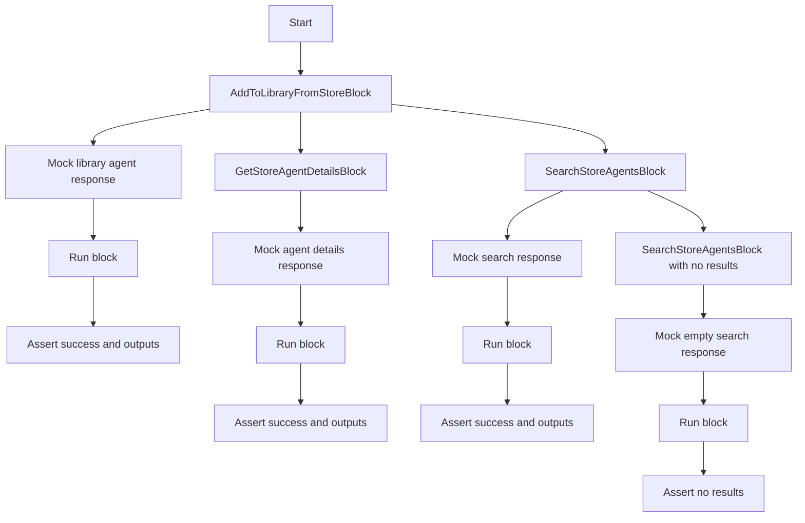
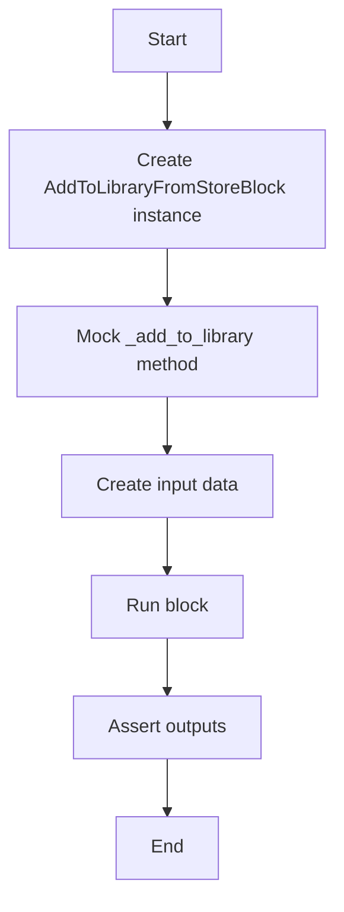
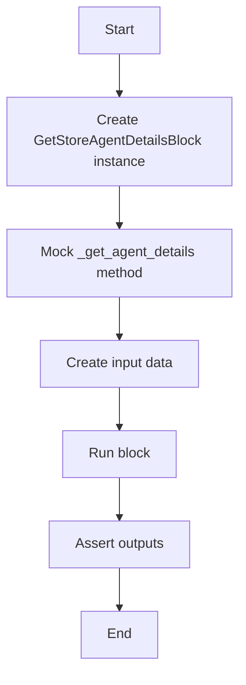
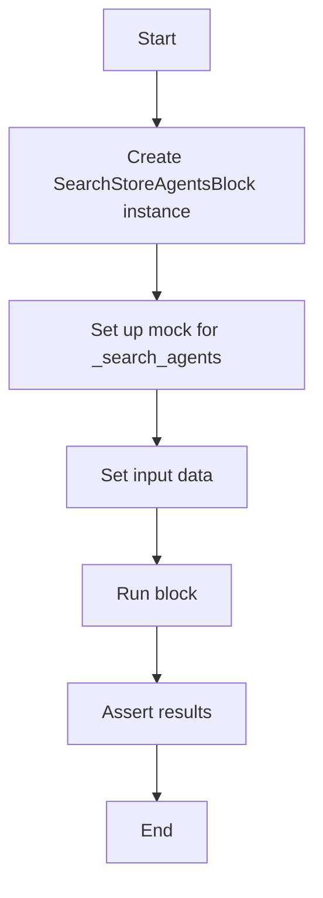
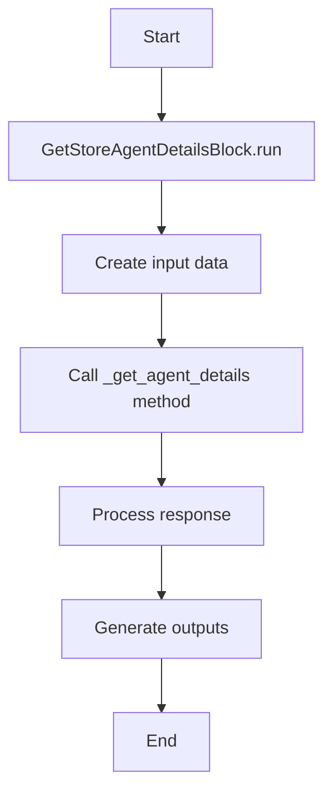
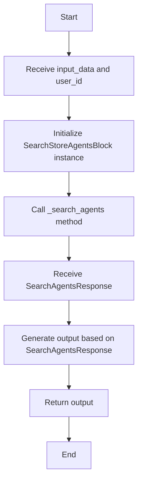

# `.\AutoGPT\autogpt_platform\backend\backend\blocks\test\test_store_operations.py` 详细设计文档

This code tests the functionality of various blocks in a backend system, including adding agents to a library, retrieving store agent details, and searching for store agents.

## 整体流程



## 类结构

```
AddToLibraryFromStoreBlock
GetStoreAgentDetailsBlock
SearchStoreAgentsBlock
```

## 全局变量及字段


### `block`
    
An instance of AddToLibraryFromStoreBlock used for testing.

类型：`AddToLibraryFromStoreBlock`
    


### `mock_library_agent`
    
A mock object representing a library agent.

类型：`MagicMock`
    


### `input_data`
    
Input data for the AddToLibraryFromStoreBlock.

类型：`AddToLibraryFromStoreBlock.Input`
    


### `outputs`
    
Dictionary containing the outputs of the block run.

类型：`dict`
    


### `mock_agent_details`
    
A mock object representing store agent details.

类型：`MagicMock`
    


### `mock_search_response`
    
A mock object representing a search response from the store.

类型：`MagicMock`
    


### `mock_empty_search_response`
    
A mock object representing an empty search response from the store.

类型：`MagicMock`
    


### `AddToLibraryFromStoreBlock._add_to_library`
    
A method to add an agent to the library.

类型：`function`
    


### `GetStoreAgentDetailsBlock._get_agent_details`
    
A method to get details of a store agent.

类型：`function`
    


### `SearchStoreAgentsBlock._search_agents`
    
A method to search for store agents.

类型：`function`
    
    

## 全局函数及方法


### test_add_to_library_from_store_block_success

This function tests the successful addition of an agent from the store to the library.

参数：

- `mocker`：`unittest.mock.Mock`，用于模拟对象和函数

返回值：无

#### 流程图



#### 带注释源码

```python
from unittest.mock import MagicMock

@pytest.mark.asyncio
async def test_add_to_library_from_store_block_success(mocker):
    """Test successful addition of agent from store to library."""
    block = AddToLibraryFromStoreBlock()

    # Mock the library agent response
    mock_library_agent = MagicMock()
    mock_library_agent.id = "lib-agent-123"
    mock_library_agent.graph_id = "graph-456"
    mock_library_agent.graph_version = 1
    mock_library_agent.name = "Test Agent"

    mocker.patch.object(
        block,
        "_add_to_library",
        return_value=LibraryAgent(
            library_agent_id="lib-agent-123",
            agent_id="graph-456",
            agent_version=1,
            agent_name="Test Agent",
        ),
    )

    input_data = block.Input(
        store_listing_version_id="store-listing-v1", agent_name="Custom Agent Name"
    )

    outputs = {}
    async for name, value in block.run(input_data, user_id="test-user"):
        outputs[name] = value

    assert outputs["success"] is True
    assert outputs["library_agent_id"] == "lib-agent-123"
    assert outputs["agent_id"] == "graph-456"
    assert outputs["agent_version"] == 1
    assert outputs["agent_name"] == "Test Agent"
    assert outputs["message"] == "Agent successfully added to library"
```


### test_get_store_agent_details_block_success

This function tests the successful retrieval of store agent details.

参数：

- `mocker`：`MagicMock`，用于模拟对象和函数

返回值：无

#### 流程图



#### 带注释源码

```python
@pytest.mark.asyncio
async def test_get_store_agent_details_block_success(mocker):
    """Test successful retrieval of store agent details."""
    block = GetStoreAgentDetailsBlock()

    # Mock the _get_agent_details method
    mocker.patch.object(
        block,
        "_get_agent_details",
        return_value=StoreAgentDetails(
            found=True,
            store_listing_version_id="version-123",
            agent_name="Test Agent",
            description="A test agent for testing",
            creator="Test Creator",
            categories=["productivity", "automation"],
            runs=100,
            rating=4.5,
        ),
    )

    # Create input data
    input_data = block.Input(creator="Test Creator", slug="test-slug")

    # Run block
    outputs = {}
    async for name, value in block.run(input_data):
        outputs[name] = value

    # Assert outputs
    assert outputs["found"] is True
    assert outputs["store_listing_version_id"] == "version-123"
    assert outputs["agent_name"] == "Test Agent"
    assert outputs["description"] == "A test agent for testing"
    assert outputs["creator"] == "Test Creator"
    assert outputs["categories"] == ["productivity", "automation"]
    assert outputs["runs"] == 100
    assert outputs["rating"] == 4.5
``` 


### test_search_store_agents_block

This function tests the search functionality for store agents, ensuring that the search returns the correct results based on the provided query, category, sort_by, and limit.

参数：

- `mocker`：`MagicMock`，用于模拟对象和函数的行为
- `query`：`str`，搜索查询字符串
- `category`：`str`，搜索类别
- `sort_by`：`str`，排序依据
- `limit`：`int`，结果限制数量

返回值：`None`，该函数不返回任何值

#### 流程图



#### 带注释源码

```python
@pytest.mark.asyncio
async def test_search_store_agents_block(mocker):
    """Test searching for store agents."""
    block = SearchStoreAgentsBlock()

    # Mock the _search_agents method to return a predefined SearchAgentsResponse
    mocker.patch.object(
        block,
        "_search_agents",
        return_value=SearchAgentsResponse(
            agents=[
                StoreAgentDict(
                    slug="creator1/agent1",
                    name="Agent One",
                    description="First test agent",
                    creator="Creator 1",
                    rating=4.8,
                    runs=500,
                ),
                StoreAgentDict(
                    slug="creator2/agent2",
                    name="Agent Two",
                    description="Second test agent",
                    creator="Creator 2",
                    rating=4.2,
                    runs=200,
                ),
            ],
            total_count=2,
        ),
    )

    # Set up input data for the test
    input_data = block.Input(
        query="test", category="productivity", sort_by="rating", limit=10
    )

    # Run the block and collect outputs
    outputs = {}
    async for name, value in block.run(input_data):
        outputs[name] = value

    # Assert the expected results
    assert len(outputs["agents"]) == 2
    assert outputs["total_count"] == 2
    assert outputs["agents"][0]["name"] == "Agent One"
    assert outputs["agents"][0]["rating"] == 4.8
``` 


### test_search_store_agents_block_empty_results

This function tests the scenario where searching for store agents returns no results.

参数：

- `mocker`：`MagicMock`，用于模拟对象和函数
- `block`：`SearchStoreAgentsBlock`，用于搜索商店代理的块

返回值：无

#### 流程图

```mermaid
graph TD
    A[Start] --> B[Create SearchStoreAgentsBlock instance]
    B --> C[Mock _search_agents to return SearchAgentsResponse with no agents]
    C --> D[Create Input with query "nonexistent" and limit 10]
    D --> E[Run block with input]
    E --> F[Assert agents list is empty]
    F --> G[Assert total_count is 0]
    G --> H[End]
```

#### 带注释源码

```python
@pytest.mark.asyncio
async def test_search_store_agents_block_empty_results(mocker):
    """Test searching with no results."""
    block = SearchStoreAgentsBlock()

    # Mock the _search_agents method to return a SearchAgentsResponse with no agents
    mocker.patch.object(
        block,
        "_search_agents",
        return_value=SearchAgentsResponse(agents=[], total_count=0),
    )

    # Create an input with the query "nonexistent" and limit 10
    input_data = block.Input(query="nonexistent", limit=10)

    # Run the block with the input
    outputs = {}
    async for name, value in block.run(input_data):
        outputs[name] = value

    # Assert that the agents list is empty
    assert outputs["agents"] == []

    # Assert that the total count is 0
    assert outputs["total_count"] == 0
``` 


### AddToLibraryFromStoreBlock.run

This function runs the `AddToLibraryFromStoreBlock` class, which is responsible for adding an agent from the store to the library.

参数：

- `input_data`：`AddToLibraryFromStoreBlock.Input`，The input data containing the store listing version ID and the name of the agent to be added.
- `user_id`：`str`，The ID of the user performing the operation.

返回值：`dict`，A dictionary containing the output of the operation.

#### 流程图

```mermaid
graph TD
    A[Start] --> B[Create AddToLibraryFromStoreBlock instance]
    B --> C[Mock _add_to_library method]
    C --> D[Create input data]
    D --> E[Run block.run()]
    E --> F[Assert outputs]
    F --> G[End]
```

#### 带注释源码

```python
from unittest.mock import MagicMock

import pytest

from backend.blocks.system.library_operations import (
    AddToLibraryFromStoreBlock,
    LibraryAgent,
)
from backend.blocks.system.store_operations import (
    GetStoreAgentDetailsBlock,
    SearchAgentsResponse,
    SearchStoreAgentsBlock,
    StoreAgentDetails,
    StoreAgentDict,
)

@pytest.mark.asyncio
async def test_add_to_library_from_store_block_success(mocker):
    """Test successful addition of agent from store to library."""
    block = AddToLibraryFromStoreBlock()

    # Mock the library agent response
    mock_library_agent = MagicMock()
    mock_library_agent.id = "lib-agent-123"
    mock_library_agent.graph_id = "graph-456"
    mock_library_agent.graph_version = 1
    mock_library_agent.name = "Test Agent"

    mocker.patch.object(
        block,
        "_add_to_library",
        return_value=LibraryAgent(
            library_agent_id="lib-agent-123",
            agent_id="graph-456",
            agent_version=1,
            agent_name="Test Agent",
        ),
    )

    input_data = block.Input(
        store_listing_version_id="store-listing-v1", agent_name="Custom Agent Name"
    )

    outputs = {}
    async for name, value in block.run(input_data, user_id="test-user"):
        outputs[name] = value

    assert outputs["success"] is True
    assert outputs["library_agent_id"] == "lib-agent-123"
    assert outputs["agent_id"] == "graph-456"
    assert outputs["agent_version"] == 1
    assert outputs["agent_name"] == "Test Agent"
    assert outputs["message"] == "Agent successfully added to library"
``` 


### GetStoreAgentDetailsBlock.run

This function retrieves the details of a store agent based on the provided creator and slug.

参数：

- `input_data`：`block.Input`，The input data containing the creator and slug of the store agent to retrieve.
- `user_id`：`str`，The ID of the user performing the operation.

返回值：`async generator`，A generator that yields key-value pairs of output results.

#### 流程图



#### 带注释源码

```python
@pytest.mark.asyncio
async def test_get_store_agent_details_block_success(mocker):
    """Test successful retrieval of store agent details."""
    block = GetStoreAgentDetailsBlock()

    # Mock the _get_agent_details method to return a StoreAgentDetails object
    mocker.patch.object(
        block,
        "_get_agent_details",
        return_value=StoreAgentDetails(
            found=True,
            store_listing_version_id="version-123",
            agent_name="Test Agent",
            description="A test agent for testing",
            creator="Test Creator",
            categories=["productivity", "automation"],
            runs=100,
            rating=4.5,
        ),
    )

    # Create input data with the creator and slug
    input_data = block.Input(creator="Test Creator", slug="test-slug")

    # Run the block and process the outputs
    outputs = {}
    async for name, value in block.run(input_data):
        outputs[name] = value

    # Assert the outputs
    assert outputs["found"] is True
    assert outputs["store_listing_version_id"] == "version-123"
    assert outputs["agent_name"] == "Test Agent"
    assert outputs["description"] == "A test agent for testing"
    assert outputs["creator"] == "Test Creator"
    assert outputs["categories"] == ["productivity", "automation"]
    assert outputs["runs"] == 100
    assert outputs["rating"] == 4.5
```


### SearchStoreAgentsBlock.run

This function is an asynchronous generator that runs the search for store agents based on the provided query, category, sort_by, and limit parameters.

参数：

- `input_data`：`block.Input`，The input data containing the query, category, sort_by, and limit parameters.
- `user_id`：`str`，The user ID for which the search is performed.

返回值：`async for name, value in ...`，An asynchronous generator that yields key-value pairs representing the search results.

#### 流程图



#### 带注释源码

```python
from backend.blocks.system.store_operations import SearchStoreAgentsBlock, SearchAgentsResponse

@pytest.mark.asyncio
async def test_search_store_agents_block(mocker):
    """Test searching for store agents."""
    block = SearchStoreAgentsBlock()

    # Mock the _search_agents method to return a predefined SearchAgentsResponse
    mocker.patch.object(
        block,
        "_search_agents",
        return_value=SearchAgentsResponse(
            agents=[
                StoreAgentDict(
                    slug="creator1/agent1",
                    name="Agent One",
                    description="First test agent",
                    creator="Creator 1",
                    rating=4.8,
                    runs=500,
                ),
                StoreAgentDict(
                    slug="creator2/agent2",
                    name="Agent Two",
                    description="Second test agent",
                    creator="Creator 2",
                    rating=4.2,
                    runs=200,
                ),
            ],
            total_count=2,
        ),
    )

    # Create input data for the search
    input_data = block.Input(
        query="test", category="productivity", sort_by="rating", limit=10
    )

    # Run the search and capture the outputs
    outputs = {}
    async for name, value in block.run(input_data):
        outputs[name] = value

    # Assertions to verify the outputs
    assert len(outputs["agents"]) == 2
    assert outputs["total_count"] == 2
    assert outputs["agents"][0]["name"] == "Agent One"
    assert outputs["agents"][0]["rating"] == 4.8
``` 


## 关键组件


### 张量索引与惰性加载

用于高效地索引和访问大型数据集，同时延迟加载数据以减少内存消耗。

### 反量化支持

提供对量化策略的反量化支持，允许在量化过程中进行逆操作。

### 量化策略

定义了量化过程中的具体策略，包括数据类型转换、精度调整等。


## 问题及建议


### 已知问题

-   **测试覆盖率不足**：代码中只包含了几个测试用例，可能没有覆盖所有可能的执行路径和边界条件。
-   **依赖注入**：测试中使用了大量的依赖注入（mocking），这可能导致代码难以理解，并且增加了维护成本。
-   **异常处理**：代码中没有显示的异常处理逻辑，如果底层模块抛出异常，可能会导致测试失败，但没有给出明确的错误信息。
-   **代码重复**：在多个测试函数中，有重复的代码片段，如对`mocker.patch.object`的使用，这可能导致维护困难。

### 优化建议

-   **增加测试用例**：为每个功能点编写更多的测试用例，确保代码的各个部分都经过充分的测试。
-   **重构依赖注入**：考虑使用依赖注入框架或模式，以更清晰和一致的方式管理依赖。
-   **添加异常处理**：在关键操作中添加异常处理逻辑，确保在出现错误时能够给出清晰的错误信息，并采取适当的恢复措施。
-   **减少代码重复**：通过提取公共代码到函数或类中，减少代码重复，提高代码的可维护性。
-   **代码审查**：定期进行代码审查，以发现潜在的问题和改进空间。
-   **文档化**：为代码和测试用例添加详细的文档，以便其他开发者能够更好地理解代码的工作原理。


## 其它


### 设计目标与约束

- 设计目标：
  - 确保代码的可扩展性和可维护性。
  - 提供模块化的代码结构，便于理解和测试。
  - 确保代码的健壮性，能够处理异常情况。
- 约束：
  - 代码必须遵循异步编程模式。
  - 代码应与现有的系统架构兼容。

### 错误处理与异常设计

- 错误处理：
  - 使用try-except块捕获和处理可能发生的异常。
  - 定义自定义异常类，以便更清晰地表示错误情况。
- 异常设计：
  - 异常应提供足够的信息，以便开发者能够快速定位问题。
  - 异常应遵循PEP 8编码规范。

### 数据流与状态机

- 数据流：
  - 输入数据通过函数参数传递，并在函数内部进行处理。
  - 处理后的数据通过输出参数返回。
- 状态机：
  - 代码中没有显式的状态机，但函数调用顺序和条件判断可以视为隐式的状态转换。

### 外部依赖与接口契约

- 外部依赖：
  - 代码依赖于`unittest.mock`和`pytest`库进行单元测试。
  - 代码依赖于`asyncio`库进行异步编程。
- 接口契约：
  - 函数和类的方法应遵循明确的接口契约，包括参数和返回值类型。
  - 接口契约应通过文档和代码注释进行说明。


    