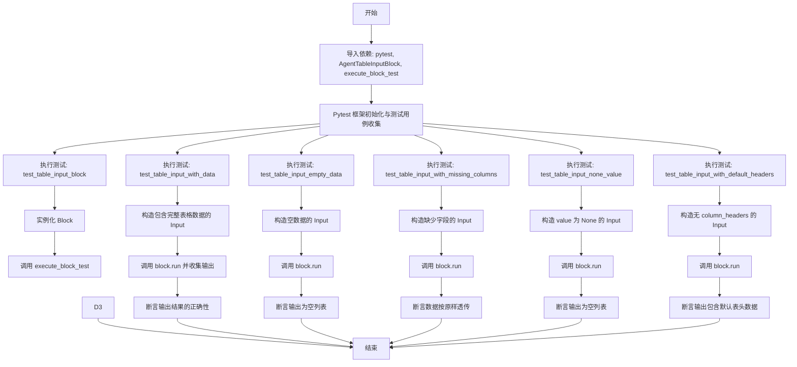
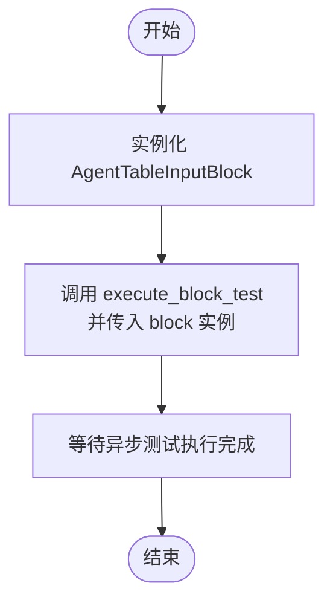
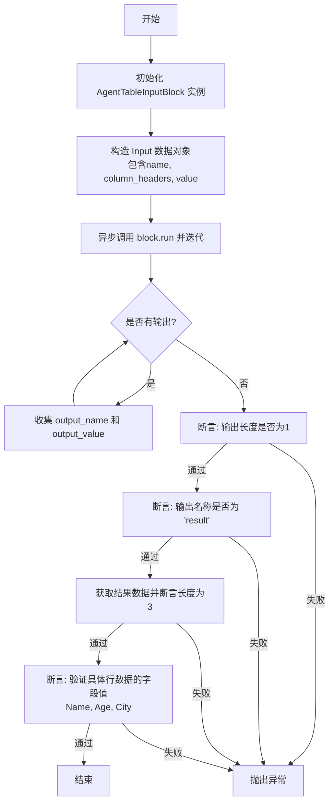
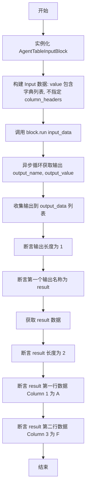

# `AutoGPT\autogpt_platform\backend\backend\blocks\test\test_table_input.py` 详细设计文档

该代码是一个基于 pytest 的异步测试文件，旨在全面验证 `AgentTableInputBlock` 组件的功能。测试覆盖了多种场景，包括基本输入输出、完整表格数据处理、空数据处理、缺失列的数据透传、None 值处理以及默认列标题的使用，以确保组件在不同数据条件下均能正确执行并返回预期的结果。

## 整体流程



## 类结构

```
AgentTableInputBlock (外部导入类)
└── Input (内部类)
```

## 全局变量及字段


### `Input.name`
    
表格输入的名称标识，用于在逻辑中引用该表格。

类型：`str`
    


### `Input.column_headers`
    
定义表格列名的字符串列表，描述数据的结构。

类型：`list[str]`
    


### `Input.value`
    
表格的实际行数据，由字典组成的列表，每个字典代表一行记录，可能为 None。

类型：`list[dict] | None`
    
    

## 全局函数及方法


### `test_table_input_block`

该函数是一个 pytest 异步测试用例，旨在验证 `AgentTableInputBlock` 的基本输入输出功能。它通过实例化该 Block 并调用通用的测试辅助函数 `execute_block_test` 来执行标准验证流程，无需手动构建特定的输入数据。

参数：
无

返回值：`None`，测试函数主要用于断言验证，无显式返回值。

#### 流程图



#### 带注释源码

```python
@pytest.mark.asyncio
async def test_table_input_block():
    """Test the AgentTableInputBlock with basic input/output."""
    # 实例化被测的 AgentTableInputBlock 组件
    block = AgentTableInputBlock()
    # 调用测试辅助工具，执行块的基本输入输出测试逻辑
    await execute_block_test(block)
```


### `test_table_input_with_data`

该函数用于测试 `AgentTableInputBlock` 在接收包含实际表格数据（包含列名和行数据字典列表）时的处理逻辑，验证该模块能否正确执行并返回预期的结果数据。

参数：

-   无

返回值：`None`，无返回值（该函数为异步测试函数，通过断言验证逻辑）。

#### 流程图



#### 带注释源码

```python
@pytest.mark.asyncio
async def test_table_input_with_data():
    """Test AgentTableInputBlock with actual table data."""
    # 1. 初始化被测试的 Block 实例
    block = AgentTableInputBlock()

    # 2. 准备输入数据
    # 定义了表头和具体的表格内容（字典列表），模拟真实的表格输入
    input_data = block.Input(
        name="test_table",
        column_headers=["Name", "Age", "City"],
        value=[
            {"Name": "John", "Age": "30", "City": "New York"},
            {"Name": "Jane", "Age": "25", "City": "London"},
            {"Name": "Bob", "Age": "35", "City": "Paris"},
        ],
    )

    # 3. 执行 Block 并收集输出
    # block.run 是异步生成器，遍历其产生的输出结果
    output_data = []
    async for output_name, output_value in block.run(input_data):
        output_data.append((output_name, output_value))

    # 4. 验证输出结果的基本结构
    # 确保只有一个输出项，且输出名称为 "result"
    assert len(output_data) == 1
    assert output_data[0][0] == "result"

    # 5. 验证输出结果的具体内容
    result = output_data[0][1]
    # 确保返回的数据行数正确
    assert len(result) == 3
    # 确保每一行的具体字段值与输入数据一致
    assert result[0]["Name"] == "John"
    assert result[1]["Age"] == "25"
    assert result[2]["City"] == "Paris"
```


### `test_table_input_empty_data`

该函数是一个异步测试用例，旨在验证 `AgentTableInputBlock` 在接收到空数据列表（value=[]）时的处理能力。它创建了一个空的输入数据实例，执行块的运行逻辑，并断言输出的结果中包含一个名为 "result" 的键，且对应的值为一个空列表。

参数：

-  无

返回值：`None`，无返回值（测试函数）

#### 流程图

```mermaid
flowchart TD
    A[开始: test_table_input_empty_data] --> B[实例化 AgentTableInputBlock]
    B --> C[构造输入数据 input_data<br/>name='empty_table', value=[]]
    C --> D[调用 block.run input_data 并异步迭代]
    D --> E[收集输出数据到 output_data 列表]
    E --> F{断言 output_data 长度是否为 1}
    F -- 否 --> G[测试失败]
    F -- 是 --> H{断言第一个输出名为 'result'}
    H -- 否 --> G
    H -- 是 --> I{断言第一个输出值为空列表 []}
    I -- 否 --> G
    I -- 是 --> J[测试通过]
```

#### 带注释源码

```python
@pytest.mark.asyncio
async def test_table_input_empty_data():
    """Test AgentTableInputBlock with empty data."""
    # 初始化被测试的块实例
    block = AgentTableInputBlock()

    # 准备输入数据，包含表头但值为空列表
    input_data = block.Input(
        name="empty_table", column_headers=["Col1", "Col2"], value=[]
    )

    # 初始化输出数据收集器
    output_data = []
    # 异步执行块的 run 方法，并遍历输出结果
    async for output_name, output_value in block.run(input_data):
        output_data.append((output_name, output_value))

    # 验证输出项数量为 1
    assert len(output_data) == 1
    # 验证输出名称为 "result"
    assert output_data[0][0] == "result"
    # 验证输出值为空列表
    assert output_data[0][1] == []
```


### `test_table_input_with_missing_columns`

测试 `AgentTableInputBlock` 在输入数据行中缺少列时，是否按原样传递数据而不进行填充或报错。

参数：

-   无参数

返回值：`None`，无返回值（该函数为测试用例，通过断言验证行为）。

#### 流程图

```mermaid
flowchart TD
    Start([开始]) --> InitBlock[实例化 AgentTableInputBlock]
    InitBlock --> CreateInput[创建 input_data: 包含列头定义但每行数据缺失不同列]
    CreateInput --> LoopStart[开始循环执行 block.run]
    LoopStart --> HasOutput{是否有输出?}
    HasOutput -->|是| AppendOutput[将 output_name 和 output_value 追加至 output_data]
    AppendOutput --> LoopStart
    HasOutput -->|否| GetResult[从 output_data 获取 result 结果]
    GetResult --> AssertLen[断言 result 长度为 3]
    AssertLen --> AssertRow1[断言第一行数据为 {"Name": "John", "Age": "30"}]
    AssertRow1 --> AssertRow2[断言第二行数据为 {"Name": "Jane", "City": "London"}]
    AssertRow2 --> AssertRow3[断言第三行数据为 {"Age": "35", "City": "Paris"}]
    AssertRow3 --> End([结束])
```

#### 带注释源码

```python
@pytest.mark.asyncio
async def test_table_input_with_missing_columns():
    """Test AgentTableInputBlock passes through data with missing columns as-is."""
    # 1. 初始化被测试的 Block 实例
    block = AgentTableInputBlock()

    # 2. 准备输入数据
    # 定义了列头 ["Name", "Age", "City"]，但在 value 的具体行中故意缺失某些列
    input_data = block.Input(
        name="partial_table",
        column_headers=["Name", "Age", "City"],
        value=[
            {"Name": "John", "Age": "30"},  # 缺失 City
            {"Name": "Jane", "City": "London"},  # 缺失 Age
            {"Age": "35", "City": "Paris"},  # 缺失 Name
        ],
    )

    # 3. 执行 Block 运行并收集输出
    output_data = []
    # block.run 是一个异步生成器，遍历获取输出
    async for output_name, output_value in block.run(input_data):
        output_data.append((output_name, output_value))

    # 4. 验证输出结果
    # 获取输出结果列表中的第一个元组的第二个元素（即 result）
    result = output_data[0][1]
    
    # 断言结果包含 3 行数据
    assert len(result) == 3

    # 检查数据是否按原样传递
    # 即使列头定义了完整的列，缺失的列不会被填充为 None 或空字符串，而是保持原样
    assert result[0] == {"Name": "John", "Age": "30"}
    assert result[1] == {"Name": "Jane", "City": "London"}
    assert result[2] == {"Age": "35", "City": "Paris"}
```


### `test_table_input_none_value`

该函数用于测试 `AgentTableInputBlock` 在输入值为 `None` 时的行为，验证其是否能正确处理并返回一个空列表。

参数：

无

返回值：`None`，该函数为异步测试函数，无返回值，通过断言验证逻辑正确性。

#### 流程图

```mermaid
flowchart TD
    A[开始测试] --> B[实例化 AgentTableInputBlock]
    B --> C[构造输入数据 input_data<br/>设置 value=None]
    C --> D[异步执行 block.run input_data]
    D --> E[收集输出到 output_data 列表]
    E --> F{断言 len output_data == 1}
    F -- 否 --> G[测试失败]
    F -- 是 --> H{断言 output_data[0][0] == 'result'}
    H -- 否 --> G
    H -- 是 --> I{断言 output_data[0][1] == []}
    I -- 否 --> G
    I -- 是 --> J[测试通过]
```

#### 带注释源码

```python
@pytest.mark.asyncio
async def test_table_input_none_value():
    """Test AgentTableInputBlock with None value returns empty list."""
    # 实例化被测试的 Block 组件
    block = AgentTableInputBlock()

    # 准备输入数据，定义了表名和列头，但将 value 显式设置为 None
    input_data = block.Input(
        name="none_table", column_headers=["Name", "Age"], value=None
    )

    # 初始化列表用于存储执行过程中的输出数据
    output_data = []
    
    # 异步运行 Block 并遍历输出结果，将 (名称, 值) 元组存入列表
    async for output_name, output_value in block.run(input_data):
        output_data.append((output_name, output_value))

    # 验证输出包含且仅包含一个结果项
    assert len(output_data) == 1
    # 验证输出的名称为 "result"
    assert output_data[0][0] == "result"
    # 验证当输入值为 None 时，Block 正确返回一个空列表 []
    assert output_data[0][1] == []
```


### `test_table_input_with_default_headers`

测试 `AgentTableInputBlock` 在未显式指定列头时的行为，验证其能否正确处理输入值并基于数据内容返回预期的结果。

参数：

-   无

返回值：`None`，该函数为测试函数，主要执行断言逻辑，无显式返回值。

#### 流程图



#### 带注释源码

```python
@pytest.mark.asyncio
async def test_table_input_with_default_headers():
    """Test AgentTableInputBlock with default column headers."""
    # 1. 初始化 Block 实例
    block = AgentTableInputBlock()

    # 2. 构造输入数据，注意未指定 column_headers 参数
    # 测试 Block 是否能处理默认列头的情况
    input_data = block.Input(
        name="default_headers_table",
        value=[
            {"Column 1": "A", "Column 2": "B", "Column 3": "C"},
            {"Column 1": "D", "Column 2": "E", "Column 3": "F"},
        ],
    )

    # 3. 初始化输出收集列表
    output_data = []
    # 4. 异步执行 Block 并收集输出
    async for output_name, output_value in block.run(input_data):
        output_data.append((output_name, output_value))

    # 5. 验证：检查输出数量是否为 1
    assert len(output_data) == 1
    # 6. 验证：检查输出的键名是否为 "result"
    assert output_data[0][0] == "result"

    # 7. 获取具体结果数据
    result = output_data[0][1]
    # 8. 验证：检查结果行数是否为 2
    assert len(result) == 2
    # 9. 验证：检查第一行数据的 "Column 1" 值
    assert result[0]["Column 1"] == "A"
    # 10. 验证：检查第二行数据的 "Column 3" 值
    assert result[1]["Column 3"] == "F"
```


### `AgentTableInputBlock.run`

该方法作为 `AgentTableInputBlock` 的核心执行逻辑，接收包含表头和表格数据的输入对象，经过处理后（如处理 `None` 值情况），异步输出包含结果名称和表格数据的元组。根据测试用例分析，它主要负责数据的透传和标准化输出。

参数：

- `input_data`：`Input`，输入数据对象，包含表格名称 (`name`)、列头 (`column_headers`) 和表格行数据 (`value`)。其中 `value` 可能为字典列表或 `None`。

返回值：`AsyncIterator[Tuple[str, List[Dict]]]`，异步生成器，产出包含输出名称（通常为 "result"）和表格数据列表的元组。如果输入 `value` 为 `None`，则输出空列表。

#### 流程图

```mermaid
graph TD
    A[开始: run 方法调用] --> B[接收 input_data 对象]
    B --> C{检查 input_data.value 是否为 None}
    C -- 是 --> D[将 data 设置为空列表 []]
    C -- 否 --> E[将 data 设置为 input_data.value]
    D --> F[异步生成元组]
    E --> F
    F --> G[输出]
    G --> H[结束]
```

#### 带注释源码

> **注意**：提供的代码片段为测试文件，不包含 `AgentTableInputBlock.run` 方法的实际源码。以下源码是根据测试用例（`test_table_input_block`, `test_table_input_with_data` 等）的行为逻辑**推断重构**的实现。

```python
async def run(self, input_data: Input) -> AsyncIterator[Tuple[str, Any]]:
    """
    执行表格输入块的逻辑。
    
    根据测试推断：
    1. 接收 Input 类型对象。
    2. 检查 value 字段，如果为 None 则返回空列表。
    3. 否则直接透传 value 数据。
    4. 输出固定的名称 'result' 和处理后的数据。
    """
    # 提取输入值，如果输入值为 None，则初始化为空列表
    # 对应测试: test_table_input_none_value
    data = input_data.value if input_data.value is not None else []

    # 异步生成输出结果
    # 对应测试逻辑: output_data[0][0] == "result"
    # 对应测试逻辑: result[0]["Name"] == "John" (透传逻辑)
    yield "result", data
```


## 关键组件


### AgentTableInputBlock
负责处理表格数据输入的核心业务组件，能够接收包含表名、列头和行数据的输入，并将其转换为标准化的输出格式，支持处理空数据、None值及缺失列等边界情况。

### Input Schema
定义了表格输入块的数据契约，包含 `name`（表名）、`column_headers`（可选的列标题列表）和 `value`（由字典组成的行数据列表）三个关键字段。

### Asynchronous Execution Method (`run`)
核心异步执行方法，接收 `Input Schema` 类型的参数，处理数据逻辑，并通过生成器异步产出执行结果，主要输出键名为 "result"。

### Test Framework (Pytest)
用于验证组件功能的测试基础设施，利用 `pytest.mark.asyncio` 支持对 `AgentTableInputBlock` 的异步逻辑进行单元测试和集成测试。


## 问题及建议


### 已知问题

-   **缺乏输入合法性校验的测试覆盖**：当前测试仅覆盖了正常数据和空/None值场景，未针对非法输入格式（如 `column_headers` 传入非列表类型、`value` 传入非字典列表结构等）进行异常捕获测试，无法验证模块在数据格式错误时的鲁棒性。
-   **数据类型语义模糊**：在 `test_table_input_with_data` 和其他测试中，数值类型的字段（如 "Age"）被显式定义为字符串（`"30"`）。如果下游业务依赖数值计算，这种透传机制表明缺乏数据类型清洗或校验，可能埋下数据质量隐患。
-   **测试代码的内存效率隐患**：测试代码中统一使用列表 `output_data` 收集异步生成器 `block.run` 的所有输出。虽然对于单元测试的数据量尚可，但这种模式在测试大规模数据时会消耗过多内存，无法模拟生产环境中可能存在的流式处理优势。

### 优化建议

-   **提取公共异步采集辅助函数**：针对重复出现的 `async for` 循环收集输出逻辑，应将其封装为公共工具函数（如 `collect_block_output`），以消除样板代码，提高测试用例的可读性和可维护性。
-   **引入参数化测试（Parameterized Tests）**：利用 `@pytest.mark.parametrize` 重构 `test_table_input_empty_data` 和 `test_table_input_none_value` 等逻辑相似的测试用例，通过参数驱动减少代码冗余，便于统一管理边界条件。
-   **采用基于属性的测试**：建议引入 `Hypothesis` 等库，通过生成随机化的表格结构和数据内容来进行模糊测试，以自动发现隐藏的边缘情况和潜在的断言错误，从而提升测试的覆盖率和可信度。
-   **增强数据契约验证**：在测试用例中明确断言输出数据的类型（例如验证数值是否转换为 int），确保 `AgentTableInputBlock` 的输入输出契约符合预期的数据规范。


## 其它


### 设计目标与约束

**设计目标：**
1.  **数据输入标准化**：为 Agent 工作流提供一个标准化的表格数据输入接口，支持结构化数据的接入。
2.  **鲁棒性与容错性**：模块设计应能处理非理想输入（如 `None` 值、缺失列的数据行），保证工作流不因输入数据的不完整而中断，倾向于返回空列表或原始数据而非抛出异常。
3.  **灵活配置**：允许用户自定义列头，同时支持在未指定列头时使用默认行为（如直接透传数据键值对）。

**约束：**
1.  **异步执行**：必须支持 Python 异步编程模型（`async/await`），以适应高并发或 I/O 密集型的 Agent 运行环境。
2.  **数据结构契约**：输入数据必须符合 `AgentTableInputBlock.Input` 定义的 schema，主要包含 `name`、`column_headers` 和 `value` 字段。
3.  **无状态处理**：块设计为无状态，不保留历史运行数据，每次 `run` 调用独立处理输入。

### 错误处理与异常设计

**错误处理策略：**
1.  **非阻断性处理**：代码测试表明，对于数据缺失（如某些行缺少列）的情况，策略是“透传”而非报错。这意味着系统信任输入数据的灵活性，不做强制性的列对齐校验。
2.  **空值标准化**：当 `value` 字段为 `None` 时，系统不抛出空指针异常，而是将其转换为空列表 `[]` 进行输出，确保下游逻辑能够处理一个确定的集合类型。
3.  **测试辅助工具**：依赖 `execute_block_test` 进行基础的 I/O 测试，这意味着异常处理也应符合该工具的预期，即不抛出未被捕获的异常。

**异常设计：**
*   目前设计倾向于通过数据清洗（如 `None` 转 `[]`）来避免运行时异常，对于不符合预期的数据格式，采取“最大努力交付”原则，尽可能返回现有数据，而不是强制校验并失败。

### 数据流与状态机

**数据流：**
1.  **输入阶段**：外部调用方构造 `AgentTableInputBlock.Input` 对象，传入表名、列头（可选）及值列表。
2.  **执行阶段**：调用 `block.run(input_data)`，这是一个异步生成器。
3.  **处理阶段**：Block 内部读取输入数据，若 `value` 为 `None` 则初始化为空列表；否则保留原始字典结构，不做复杂的类型转换或键值过滤。
4.  **输出阶段**：生成器产出 `(output_name, output_value)` 元组，其中 `output_name` 固定为字符串 `"result"`，`output_value` 为处理后的表格数据列表。

**状态机：**
*   本组件为**无状态**组件。
*   **状态转换**：初始化 -> 就绪 -> 运行中 -> 完成。
    *   每次调用 `run` 方法都是从“就绪”直接跳转到“运行中”并最终产出结果，不涉及内部状态的持久化或流转。

### 外部依赖与接口契约

**外部依赖：**
1.  **运行时依赖**：
    *   `backend.blocks.io.AgentTableInputBlock`：被测核心组件，提供表格输入处理能力。
2.  **测试依赖**：
    *   `pytest`：测试框架，提供 `@pytest.mark.asyncio` 装饰器以支持异步测试用例。
    *   `backend.util.test.execute_block_test`：测试辅助函数，用于执行通用的 Block 测试逻辑（可能包含基础的 Mock 或 Runner 初始化）。

**接口契约：**
1.  **AgentTableInputBlock.Input 类**：
    *   `name` (String): 表格的标识名称。
    *   `column_headers` (List[String], Optional): 表头定义。虽然测试中传入了此字段，但从“缺失列”的测试用例看，它主要用于声明或展示，不强制作为数据过滤的依据。
    *   `value` (List[Dictionary], Optional): 实际的表格数据，每个字典代表一行。必须允许为 `None`。
2.  **AgentTableInputBlock.run 方法**：
    *   **输入**：`input_data` (AgentTableInputBlock.Input 实例)。
    *   **输出**：`AsyncIterator[Tuple[String, Any]]`。
        *   约定：迭代产出一次。
        *   约定：产出的元组第一个元素为字符串 `"result"`，第二个元素为 `List[Dict]` 类型的表格数据。

    