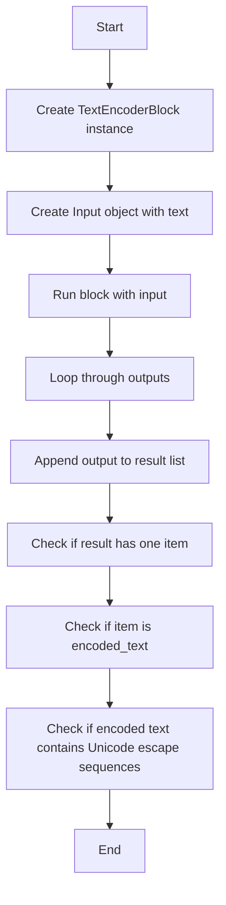
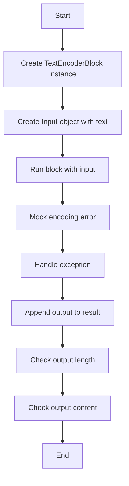
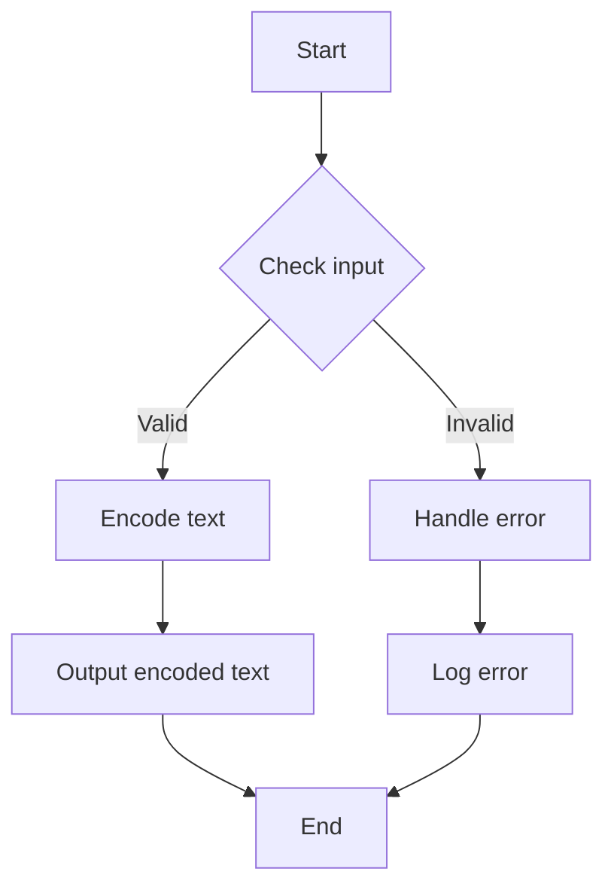

# `.\AutoGPT\autogpt_platform\backend\backend\blocks\test\test_text_encoder.py` 详细设计文档

This code defines a test suite for a TextEncoderBlock class, which is responsible for encoding text with special characters and handling unicode characters correctly.

## 整体流程

```mermaid
graph TD
    A[开始] --> B[创建 TextEncoderBlock 实例]
    B --> C[执行 block.run() 方法]
    C --> D{输出结果是否为 'encoded_text'?}
    D -- 是 --> E[验证输出内容]
    D -- 否 --> F[验证错误处理]
    E --> G[结束]
    F --> G[结束]
```

## 类结构

```
TextEncoderBlock (类)
├── Input (类)
```

## 全局变量及字段


### `TextEncoderBlock`
    
A class representing a text encoding block.

类型：`class`
    


### `Input`
    
A class representing an input object for the text encoding block.

类型：`class`
    


### `text`
    
The text to be encoded by the TextEncoderBlock class.

类型：`str`
    


### `TextEncoderBlock.TextEncoderBlock`
    
An instance of the TextEncoderBlock class.

类型：`TextEncoderBlock`
    


### `Input.Input`
    
The input text for the encoding process.

类型：`str`
    


### `TextEncoderBlock.encoded_text`
    
The encoded text output by the TextEncoderBlock class.

类型：`str`
    


### `TextEncoderBlock.error`
    
The error message if an encoding error occurs.

类型：`str`
    
    

## 全局函数及方法


### test_text_encoder_basic

This function tests the basic encoding of newlines and special characters using the TextEncoderBlock.

参数：

- `block`：`TextEncoderBlock`，The TextEncoderBlock instance to be tested.
- `TextEncoderBlock.Input(text="Hello\nWorld")`：`TextEncoderBlock.Input`，The input object containing the text to be encoded.

返回值：`None`，This function does not return a value.

#### 流程图

```mermaid
graph TD
    A[Start] --> B[Create TextEncoderBlock instance]
    B --> C[Create Input object with text "Hello\nWorld"]
    C --> D[Run block with input]
    D --> E[Loop through outputs]
    E --> F[Append output to result list]
    F --> G[Check if result length is 1]
    G --> H[Check if output[0] is "encoded_text"]
    H --> I[Check if output[1] is "Hello\\nWorld"]
    I --> J[End]
```

#### 带注释源码

```python
@pytest.mark.asyncio
async def test_text_encoder_basic():
    """Test basic encoding of newlines and special characters."""
    block = TextEncoderBlock()
    result = []
    async for output in block.run(TextEncoderBlock.Input(text="Hello\nWorld")):
        result.append(output)

    assert len(result) == 1
    assert result[0][0] == "encoded_text"
    assert result[0][1] == "Hello\\nWorld"
```


### test_text_encoder_multiple_escapes

This function tests the encoding of multiple escape sequences using the TextEncoderBlock.

参数：

- `block`：`TextEncoderBlock`，The TextEncoderBlock instance to be tested.
- `TextEncoderBlock.Input(text="Line1\nLine2\tTabbed\rCarriage")`：`TextEncoderBlock.Input`，The input object containing the text with multiple escape sequences to be encoded.

返回值：`None`，This function does not return a value.

#### 流程图

```mermaid
graph TD
    A[Start] --> B[Create TextEncoderBlock instance]
    B --> C[Create Input object with text "Line1\nLine2\tTabbed\rCarriage"]
    C --> D[Run block with input]
    D --> E[Loop through outputs]
    E --> F[Append output to result list]
    F --> G[Check if result length is 1]
    G --> H[Check if output[0] is "encoded_text"]
    H --> I[Check if "\\n" in output[1]]
    I --> J[Check if "\\t" in output[1]]
    J --> K[Check if "\\r" in output[1]]
    K --> L[End]
```

#### 带注释源码

```python
@pytest.mark.asyncio
async def test_text_encoder_multiple_escapes():
    """Test encoding of multiple escape sequences."""
    block = TextEncoderBlock()
    result = []
    async for output in block.run(
        TextEncoderBlock.Input(text="Line1\nLine2\tTabbed\rCarriage")
    ):
        result.append(output)

    assert len(result) == 1
    assert result[0][0] == "encoded_text"
    assert "\\n" in result[0][1]
    assert "\\t" in result[0][1]
    assert "\\r" in result[0][1]
```


### test_text_encoder_unicode

This function tests that unicode characters are handled correctly using the TextEncoderBlock.

参数：

- `block`：`TextEncoderBlock`，The TextEncoderBlock instance to be tested.
- `TextEncoderBlock.Input(text="Hello 世界\n")`：`TextEncoderBlock.Input`，The input object containing the text with unicode characters to be encoded.

返回值：`None`，This function does not return a value.

#### 流程图

```mermaid
graph TD
    A[Start] --> B[Create TextEncoderBlock instance]
    B --> C[Create Input object with text "Hello 世界\n"]
    C --> D[Run block with input]
    D --> E[Loop through outputs]
    E --> F[Append output to result list]
    F --> G[Check if result length is 1]
    G --> H[Check if output[0] is "encoded_text"]
    H --> I[Check if Unicode characters are escaped as \uXXXX sequences]
    I --> J[End]
```

#### 带注释源码

```python
@pytest.mark.asyncio
async def test_text_encoder_unicode():
    """Test that unicode characters are handled correctly."""
    block = TextEncoderBlock()
    result = []
    async for output in block.run(TextEncoderBlock.Input(text="Hello 世界\n")):
        result.append(output)

    assert len(result) == 1
    assert result[0][0] == "encoded_text"
    # Unicode characters should be escaped as \uXXXX sequences
    assert "\\n" in result[0][1]
```


### test_text_encoder_empty_string

This function tests the encoding of an empty string using the TextEncoderBlock.

参数：

- `block`：`TextEncoderBlock`，The TextEncoderBlock instance to be tested.
- `TextEncoderBlock.Input(text="")`：`TextEncoderBlock.Input`，The input object containing an empty string to be encoded.

返回值：`None`，This function does not return a value.

#### 流程图

```mermaid
graph TD
    A[Start] --> B[Create TextEncoderBlock instance]
    B --> C[Create Input object with empty text]
    C --> D[Run block with input]
    D --> E[Loop through outputs]
    E --> F[Append output to result list]
    F --> G[Check if result length is 1]
    G --> H[Check if output[0] is "encoded_text"]
    H --> I[Check if output[1] is ""]
    I --> J[End]
```

#### 带注释源码

```python
@pytest.mark.asyncio
async def test_text_encoder_empty_string():
    """Test encoding of an empty string."""
    block = TextEncoderBlock()
    result = []
    async for output in block.run(TextEncoderBlock.Input(text="")):
        result.append(output)

    assert len(result) == 1
    assert result[0][0] == "encoded_text"
    assert result[0][1] == ""
```


### test_text_encoder_error_handling

This function tests that encoding errors are handled gracefully using the TextEncoderBlock.

参数：

- `block`：`TextEncoderBlock`，The TextEncoderBlock instance to be tested.
- `TextEncoderBlock.Input(text="test")`：`TextEncoderBlock.Input`，The input object containing the text that should cause an encoding error.

返回值：`None`，This function does not return a value.

#### 流程图

```mermaid
graph TD
    A[Start] --> B[Create TextEncoderBlock instance]
    B --> C[Create Input object with text "test"]
    C --> D[Run block with input]
    D --> E[Loop through outputs]
    E --> F[Append output to result list]
    F --> G[Check if result length is 1]
    G --> H[Check if output[0] is "error"]
    H --> I[Check if "Mocked encoding error" in output[1]]
    I --> J[End]
```

#### 带注释源码

```python
@pytest.mark.asyncio
async def test_text_encoder_error_handling():
    """Test that encoding errors are handled gracefully."""
    from unittest.mock import patch

    block = TextEncoderBlock()
    result = []

    with patch("codecs.encode", side_effect=Exception("Mocked encoding error")):
        async for output in block.run(TextEncoderBlock.Input(text="test")):
            result.append(output)

    assert len(result) == 1
    assert result[0][0] == "error"
    assert "Mocked encoding error" in result[0][1]
```


### test_text_encoder_multiple_escapes

This function tests the encoding of multiple escape sequences in a text string.

参数：

- `block`：`TextEncoderBlock`，The TextEncoderBlock instance to be tested.
- `text`：`str`，The text string to be encoded, containing multiple escape sequences.

返回值：`None`，This function does not return a value.

#### 流程图

```mermaid
graph TD
    A[Start] --> B[Create TextEncoderBlock instance]
    B --> C[Create result list]
    C --> D[Run block.run with TextEncoderBlock.Input(text="Line1\nLine2\tTabbed\rCarriage")]
    D --> E[Loop through outputs]
    E --> F[Append output to result list]
    F --> G[Check if output[0] == "encoded_text"]
    G --> H[Check if output[1] contains "\\n", "\\t", "\\r"]
    H --> I[Assert length of result is 1]
    I --> J[Assert output[0] == "encoded_text"]
    J --> K[Assert output[1] contains "\\n", "\\t", "\\r"]
    K --> L[End]
```

#### 带注释源码

```python
@pytest.mark.asyncio
async def test_text_encoder_multiple_escapes():
    """Test encoding of multiple escape sequences."""
    block = TextEncoderBlock()  # A: Create TextEncoderBlock instance
    result = []  # C: Create result list
    async for output in block.run(  # D: Run block.run with TextEncoderBlock.Input(text="Line1\nLine2\tTabbed\rCarriage")
        TextEncoderBlock.Input(text="Line1\nLine2\tTabbed\rCarriage")
    ):
        result.append(output)  # F: Append output to result list

    assert len(result) == 1  # I: Assert length of result is 1
    assert result[0][0] == "encoded_text"  # J: Assert output[0] == "encoded_text"
    assert "\\n" in result[0][1]  # K: Assert output[1] contains "\\n", "\\t", "\\r"
    assert "\\t" in result[0][1]
    assert "\\r" in result[0][1]
``` 


### test_text_encoder_unicode

This function tests that Unicode characters are handled correctly by the TextEncoderBlock.

参数：

- `text`：`str`，The input text to be encoded. It should contain Unicode characters.

返回值：`None`，This function does not return any value. It asserts the correctness of the encoding.

#### 流程图



#### 带注释源码

```python
@pytest.mark.asyncio
async def test_text_encoder_unicode():
    """Test that unicode characters are handled correctly."""
    block = TextEncoderBlock()  # A[Create TextEncoderBlock instance]
    result = []  # Initialize an empty list to store the output
    async for output in block.run(TextEncoderBlock.Input(text="Hello 世界\n")):  # C[Create Input object with text]
        result.append(output)  # F[Append output to result list]

    assert len(result) == 1  # G[Check if result has one item]
    assert result[0][0] == "encoded_text"  # H[Check if item is encoded_text]
    # Unicode characters should be escaped as \uXXXX sequences
    assert "\\n" in result[0][1]  # I[Check if encoded text contains Unicode escape sequences]
    # J[End]
```


### test_text_encoder_empty_string

Test encoding of an empty string.

参数：

- text：`str`，The input text to be encoded.

返回值：`None`，This test does not return any value.

#### 流程图

```mermaid
graph TD
    A[Start] --> B[Create TextEncoderBlock instance]
    B --> C[Create result list]
    C --> D[Run TextEncoderBlock with empty string input]
    D --> E[Loop through outputs]
    E --> F[Append output to result list]
    F --> G[Check if result list has one item]
    G --> H[Check if item is "encoded_text"]
    H --> I[Check if item's value is an empty string]
    I --> J[End]
```

#### 带注释源码

```python
@pytest.mark.asyncio
async def test_text_encoder_empty_string():
    """Test encoding of an empty string."""
    block = TextEncoderBlock()  # A: Create TextEncoderBlock instance
    result = []  # C: Create result list
    async for output in block.run(TextEncoderBlock.Input(text="")):  # D: Run TextEncoderBlock with empty string input
        result.append(output)  # E: Loop through outputs, F: Append output to result list

    assert len(result) == 1  # G: Check if result list has one item
    assert result[0][0] == "encoded_text"  # H: Check if item is "encoded_text"
    assert result[0][1] == ""  # I: Check if item's value is an empty string
    # J: End
```


### test_text_encoder_error_handling

测试编码错误是否被优雅地处理。

参数：

- `text`：`str`，要编码的文本字符串

返回值：`None`，无返回值

#### 流程图



#### 带注释源码

```python
@pytest.mark.asyncio
async def test_text_encoder_error_handling():
    """Test that encoding errors are handled gracefully."""
    from unittest.mock import patch

    block = TextEncoderBlock()
    result = []

    with patch("codecs.encode", side_effect=Exception("Mocked encoding error")):
        async for output in block.run(TextEncoderBlock.Input(text="test")):
            result.append(output)

    assert len(result) == 1
    assert result[0][0] == "error"
    assert "Mocked encoding error" in result[0][1]
```


### TextEncoderBlock.run

This function is responsible for encoding a given text string and producing the encoded text as output.

参数：

- `input`：`TextEncoderBlock.Input`，The input object containing the text to be encoded.

返回值：`async iterable`，An asynchronous iterable that yields a tuple containing the key "encoded_text" and the encoded text.

#### 流程图



#### 带注释源码

```python
import pytest

from backend.blocks.encoder_block import TextEncoderBlock

@pytest.mark.asyncio
async def test_text_encoder_basic():
    """Test basic encoding of newlines and special characters."""
    block = TextEncoderBlock()
    result = []
    async for output in block.run(TextEncoderBlock.Input(text="Hello\nWorld")):
        result.append(output)

    assert len(result) == 1
    assert result[0][0] == "encoded_text"
    assert result[0][1] == "Hello\\nWorld"
```

Note: The actual implementation of the `run` method is not provided in the given code snippet, so the flowchart and source code are based on the test cases and the expected behavior of the method.


### TextEncoderBlock.Input.__init__

This method initializes an instance of the `Input` class used by the `TextEncoderBlock` class. It sets up the input text that needs to be encoded.

参数：

- `text`：`str`，The input text that needs to be encoded. This is the text that will be processed by the encoder.

返回值：无

#### 流程图

```mermaid
classDiagram
    Input <|-- TextEncoderBlock
    Input {
        +str text
        +__init__(text: str)
    }
```

#### 带注释源码

```python
class Input:
    def __init__(self, text: str):
        # Initialize the Input class with the provided text.
        self.text = text
```


## 关键组件


### 张量索引与惰性加载

用于高效地处理和索引张量数据，支持惰性加载，减少内存占用。

### 反量化支持

提供对反量化操作的支持，以优化模型性能。

### 量化策略

实现量化策略，用于降低模型复杂度和提高推理速度。


## 问题及建议


### 已知问题

-   {问题1}：代码中使用了`unittest.mock.patch`来模拟`codecs.encode`函数抛出异常，但异常处理仅检查了异常信息是否包含"Mocked encoding error"。这可能不足以处理所有可能的编码错误，因为异常类型和消息可能因环境或编码库的不同而变化。
-   {问题2}：`TextEncoderBlock`类的具体实现细节在代码中未给出，因此无法评估其性能和效率。如果编码操作涉及大量数据，可能存在性能瓶颈。
-   {问题3}：代码中未提供关于`TextEncoderBlock`类如何处理非ASCII字符的详细信息，这可能导致对某些字符的编码不准确。

### 优化建议

-   {建议1}：在异常处理中，除了检查异常消息外，还应考虑捕获和处理不同类型的异常，以确保代码的健壮性。
-   {建议2}：对`TextEncoderBlock`类进行性能分析，如果发现性能瓶颈，可以考虑优化算法或使用更高效的编码库。
-   {建议3}：提供关于`TextEncoderBlock`类如何处理非ASCII字符的详细信息，确保所有字符都能被正确编码。
-   {建议4}：考虑添加单元测试来覆盖更多的边界情况和异常情况，以确保代码的鲁棒性。
-   {建议5}：如果`TextEncoderBlock`类是可重用的，考虑将其设计为更通用的编码器，以便它可以处理不同的编码需求和字符集。


## 其它


### 设计目标与约束

- 设计目标：
  - 实现一个文本编码器，能够处理各种文本编码需求，包括特殊字符、换行符、制表符、回车符以及Unicode字符。
  - 确保编码器能够处理空字符串和错误情况，如编码错误。
- 约束：
  - 编码器应遵循Python标准编码规则。
  - 编码器应提供异步接口，以支持异步数据处理。

### 错误处理与异常设计

- 错误处理：
  - 当编码过程中发生错误时，编码器应捕获异常，并返回错误信息。
  - 错误信息应包含错误原因，以便于调试和用户理解。
- 异常设计：
  - 使用`try-except`块捕获编码过程中可能抛出的异常。
  - 使用`unittest.mock.patch`模拟编码过程中的异常情况，以便于测试。

### 数据流与状态机

- 数据流：
  - 输入：文本字符串。
  - 输出：编码后的文本字符串或错误信息。
- 状态机：
  - 编码器在处理文本时，会经历编码、错误处理和输出结果的状态。

### 外部依赖与接口契约

- 外部依赖：
  - `pytest`：用于编写和运行测试用例。
  - `unittest.mock`：用于模拟外部依赖和测试异常情况。
- 接口契约：
  - `TextEncoderBlock`类定义了编码器的接口，包括`run`方法用于处理文本编码。
  - `TextEncoderBlock.Input`类定义了输入数据的结构。


    