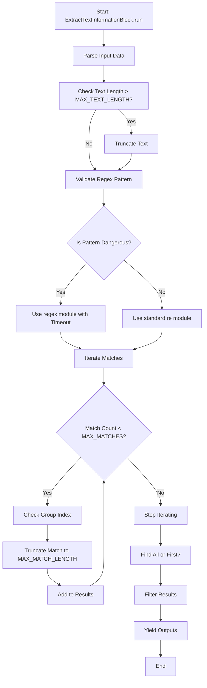
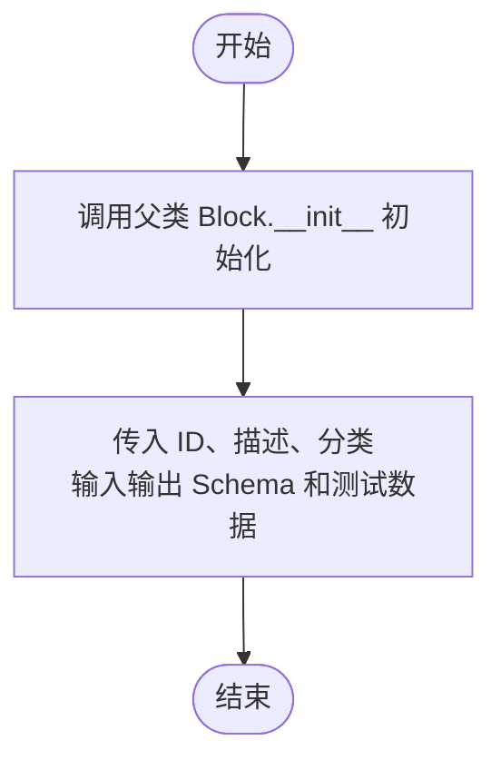
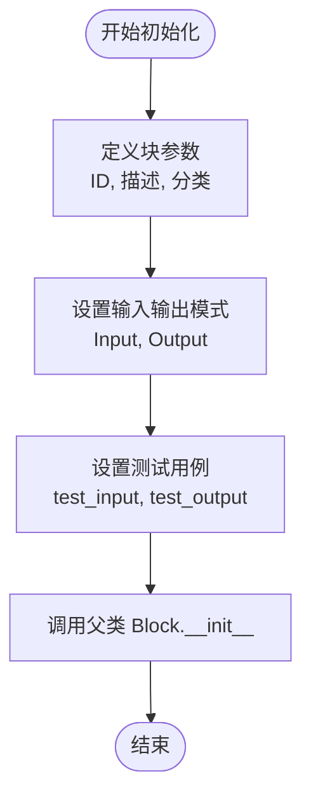
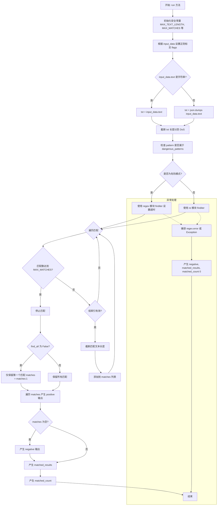
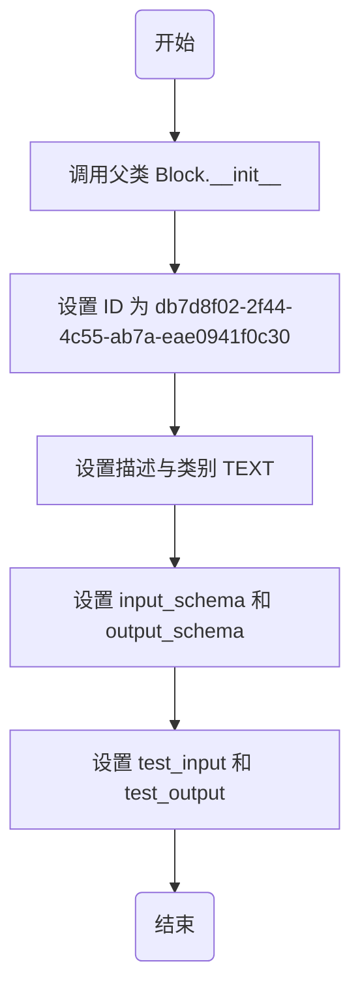
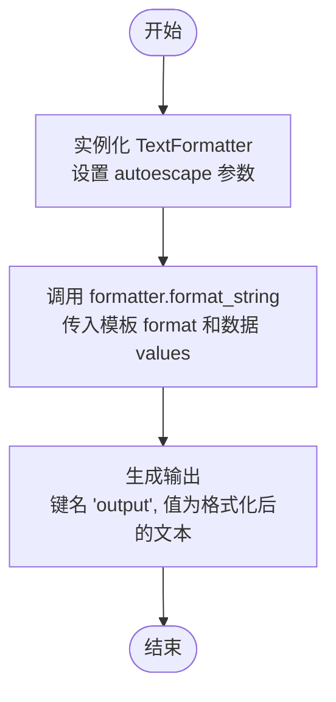
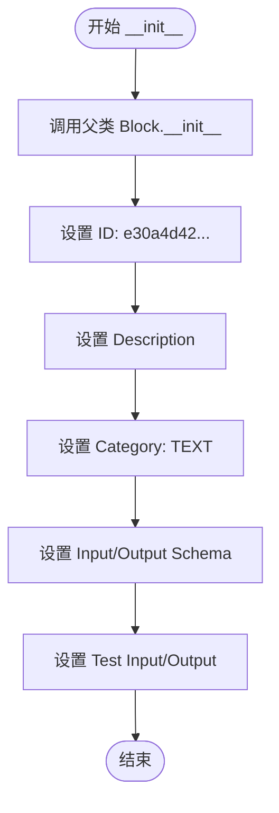
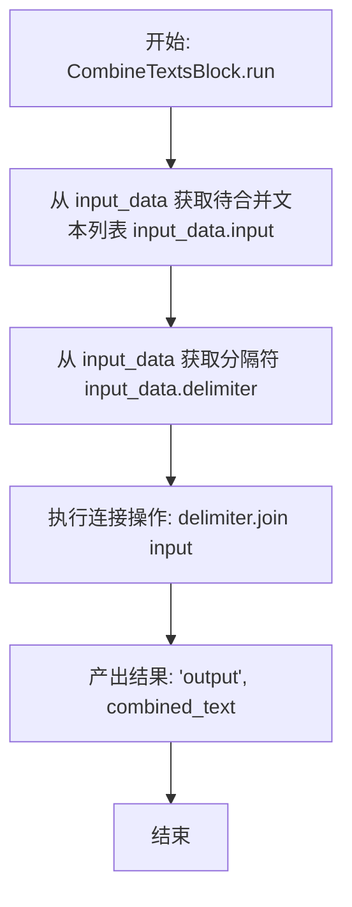
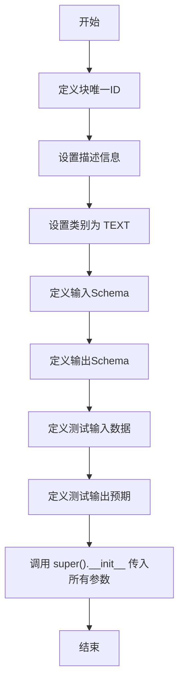
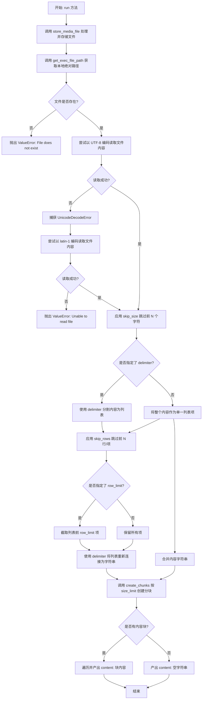

# `AutoGPT\autogpt_platform\backend\backend\blocks\text.py` 详细设计文档

This file defines a collection of text processing blocks for a workflow engine, including regex matching and extraction, Jinja2-based templating, text combination, splitting, replacement, and file reading with support for security constraints and data chunking.

## 整体流程



## 类结构

```
Block (backend.data.block)
├── MatchTextPatternBlock
├── ExtractTextInformationBlock
├── FillTextTemplateBlock
├── CombineTextsBlock
├── TextSplitBlock
├── TextReplaceBlock
└── FileReadBlock
```

## 全局变量及字段


### `formatter`
    
An instance of TextFormatter for text formatting operations.

类型：`TextFormatter`
    


### `MatchTextPatternBlock.text`
    
Text to match

类型：`Any`
    


### `MatchTextPatternBlock.match`
    
Pattern (Regex) to match

类型：`str`
    


### `MatchTextPatternBlock.data`
    
Data to be forwarded to output

类型：`Any`
    


### `MatchTextPatternBlock.case_sensitive`
    
Case sensitive match

类型：`bool`
    


### `MatchTextPatternBlock.dot_all`
    
Dot matches all

类型：`bool`
    


### `ExtractTextInformationBlock.text`
    
Text to parse

类型：`Any`
    


### `ExtractTextInformationBlock.pattern`
    
Pattern (Regex) to parse

类型：`str`
    


### `ExtractTextInformationBlock.group`
    
Group number to extract

类型：`int`
    


### `ExtractTextInformationBlock.case_sensitive`
    
Case sensitive match

类型：`bool`
    


### `ExtractTextInformationBlock.dot_all`
    
Dot matches all

类型：`bool`
    


### `ExtractTextInformationBlock.find_all`
    
Find all matches

类型：`bool`
    


### `FillTextTemplateBlock.values`
    
Values (dict) to be used in format. These values can be used by putting them in double curly braces in the format template. e.g. {{value_name}}.

类型：`dict[str, Any]`
    


### `FillTextTemplateBlock.format`
    
Template to format the text using `values`. Use Jinja2 syntax.

类型：`str`
    


### `FillTextTemplateBlock.escape_html`
    
Whether to escape special characters in the inserted values to be HTML-safe. Enable for HTML output, disable for plain text.

类型：`bool`
    


### `CombineTextsBlock.input`
    
text input to combine

类型：`list[str]`
    


### `CombineTextsBlock.delimiter`
    
Delimiter to combine texts

类型：`str`
    


### `TextSplitBlock.text`
    
The text to split.

类型：`str`
    


### `TextSplitBlock.delimiter`
    
The delimiter to split the text by.

类型：`str`
    


### `TextSplitBlock.strip`
    
Whether to strip the text.

类型：`bool`
    


### `TextReplaceBlock.text`
    
The text to replace.

类型：`str`
    


### `TextReplaceBlock.old`
    
The old text to replace.

类型：`str`
    


### `TextReplaceBlock.new`
    
The new text to replace with.

类型：`str`
    


### `FileReadBlock.file_input`
    
The file to read from (URL, data URI, or local path)

类型：`MediaFileType`
    


### `FileReadBlock.delimiter`
    
Delimiter to split the content into rows/chunks (e.g., '\n' for lines)

类型：`str`
    


### `FileReadBlock.size_limit`
    
Maximum size in bytes per chunk to yield (0 for no limit)

类型：`int`
    


### `FileReadBlock.row_limit`
    
Maximum number of rows to process (0 for no limit, requires delimiter)

类型：`int`
    


### `FileReadBlock.skip_size`
    
Number of characters to skip from the beginning of the file

类型：`int`
    


### `FileReadBlock.skip_rows`
    
Number of rows to skip from the beginning (requires delimiter)

类型：`int`
    
    

## 全局函数及方法


### `MatchTextPatternBlock.__init__`

该方法用于初始化 `MatchTextPatternBlock` 实例，配置其唯一标识、描述、分类、输入输出模式以及测试用例，以完成父类 `Block` 的初始化。

参数：

- `self`：`MatchTextPatternBlock`，表示当前类的实例。

返回值：`None`，表示该方法无返回值。

#### 流程图



#### 带注释源码

```python
def __init__(self):
    # 调用父类 Block 的初始化方法，配置块的基本属性
    super().__init__(
        # 块的唯一标识符
        id="3060088f-6ed9-4928-9ba7-9c92823a7ccd",
        # 块的功能描述
        description="Matches text against a regex pattern and forwards data to positive or negative output based on the match.",
        # 块所属的分类（文本处理类）
        categories={BlockCategory.TEXT},
        # 定义的输入数据结构 Schema
        input_schema=MatchTextPatternBlock.Input,
        # 定义的输出数据结构 Schema
        output_schema=MatchTextPatternBlock.Output,
        # 预定义的测试输入数据列表
        test_input=[
            {"text": "ABC", "match": "ab", "data": "X", "case_sensitive": False},
            {"text": "ABC", "match": "ab", "data": "Y", "case_sensitive": True},
            {"text": "Hello World!", "match": ".orld.+", "data": "Z"},
            {"text": "Hello World!", "match": "World![a-z]+", "data": "Z"},
        ],
        # 预定义的测试输出数据列表，与 test_input 对应
        test_output=[
            ("positive", "X"),
            ("negative", "Y"),
            ("positive", "Z"),
            ("negative", "Z"),
        ],
    )
```


### `MatchTextPatternBlock.run`

执行正则表达式匹配，根据文本是否匹配给定的模式，将输入数据转发到“positive”或“negative”输出端口。

参数：

-  `input_data`：`MatchTextPatternBlock.Input`，包含待匹配的文本、正则表达式模式、待转发的数据以及匹配配置（如是否区分大小写、DotAll 模式）。
-  `**kwargs`：`dict`，执行上下文或其他额外关键字参数。

返回值：`BlockOutput`，异步生成器，产生包含输出名称（"positive" 或 "negative"）和输出数据的元组。

#### 流程图

```mermaid
flowchart TD
    A([开始]) --> B[确定输出数据: 优先 input_data.data 否则 input_data.text]
    B --> C[初始化 flags = 0]
    C --> D{case_sensitive 是否为 False?}
    D -- 是 --> E[flags |= re.IGNORECASE]
    D -- 否 --> F{dot_all 是否为 True?}
    E --> F
    F -- 是 --> G[flags |= re.DOTALL]
    F -- 否 --> H{input_data.text 是否为字符串?}
    G --> H
    H -- 是 --> I[text = input_data.text]
    H -- 否 --> J[text = json.dumps input_data.text]
    I --> K[执行 re.search input_data.match text flags]
    J --> K
    K --> L{匹配是否成功?}
    L -- 是 --> M[yield positive output]
    L -- 否 --> N[yield negative output]
    M --> O([结束])
    N --> O
```

#### 带注释源码

```python
async def run(self, input_data: Input, **kwargs) -> BlockOutput:
    # 确定要输出的数据：如果提供了 data 字段则使用 data，否则使用原始 text
    output = input_data.data or input_data.text

    # 初始化正则表达式标志位
    flags = 0
    # 如果配置为不区分大小写，则添加 IGNORECASE 标志
    if not input_data.case_sensitive:
        flags = flags | re.IGNORECASE
    # 如果配置为 dot_all，则添加 DOTALL 标志，使 '.' 匹配包括换行符在内的所有字符
    if input_data.dot_all:
        flags = flags | re.DOTALL

    # 准备待匹配的文本对象
    if isinstance(input_data.text, str):
        text = input_data.text
    else:
        # 如果输入不是字符串（例如字典或列表），将其序列化为 JSON 字符串以便匹配
        text = json.dumps(input_data.text)

    # 执行正则表达式搜索
    if re.search(input_data.match, text, flags=flags):
        # 如果匹配成功，将数据输出到 'positive' 端口
        yield "positive", output
    else:
        # 如果匹配失败，将数据输出到 'negative' 端口
        yield "negative", output
```


### `ExtractTextInformationBlock.__init__`

初始化文本信息提取块实例，配置其唯一标识符、描述、分类、输入输出模式以及用于验证功能的测试输入输出用例。

参数：

- `self`：`ExtractTextInformationBlock`，类的实例本身

返回值：`None`，无返回值

#### 流程图



#### 带注释源码

```python
def __init__(self):
    # 调用父类 Block 的初始化方法，配置块的基本属性和行为
    super().__init__(
        # 块的唯一标识符 (UUID)
        id="3146e4fe-2cdd-4f29-bd12-0c9d5bb4deb0",
        # 块的功能描述
        description="This block extracts the text from the given text using the pattern (regex).",
        # 块所属的类别，此处归为 TEXT (文本处理)
        categories={BlockCategory.TEXT},
        # 定义输入数据的 Schema 结构，关联内部类 Input
        input_schema=ExtractTextInformationBlock.Input,
        # 定义输出数据的 Schema 结构，关联内部类 Output
        output_schema=ExtractTextInformationBlock.Output,
        # 定义测试输入数据列表，覆盖多种场景（分组、大小写敏感、查找全部等）
        test_input=[
            {"text": "Hello, World!", "pattern": "Hello, (.+)", "group": 1},
            {"text": "Hello, World!", "pattern": "Hello, (.+)", "group": 0},
            {"text": "Hello, World!", "pattern": "Hello, (.+)", "group": 2},
            {"text": "Hello, World!", "pattern": "hello,", "case_sensitive": False},
            {
                "text": "Hello, World!! Hello, Earth!!",
                "pattern": "Hello, (\\S+)",
                "group": 1,
                "find_all": False,
            },
            {
                "text": "Hello, World!! Hello, Earth!!",
                "pattern": "Hello, (\\S+)",
                "group": 1,
                "find_all": True,
            },
        ],
        # 定义预期的测试输出结果，与 test_input 顺序对应
        test_output=[
            # Test case 1: 提取第一个分组
            ("positive", "World!"),
            ("matched_results", ["World!"]),
            ("matched_count", 1),
            # Test case 2: 提取整个匹配项 (group 0)
            ("positive", "Hello, World!"),
            ("matched_results", ["Hello, World!"]),
            ("matched_count", 1),
            # Test case 3: 请求的分组不存在 (group 2)
            ("negative", "Hello, World!"),
            ("matched_results", []),
            ("matched_count", 0),
            # Test case 4: 大小写不敏感匹配
            ("positive", "Hello,"),
            ("matched_results", ["Hello,"]),
            ("matched_count", 1),
            # Test case 5: 仅查找第一个匹配项
            ("positive", "World!!"),
            ("matched_results", ["World!!"]),
            ("matched_count", 1),
            # Test case 6: 查找所有匹配项
            ("positive", "World!!"),
            ("positive", "Earth!!"),
            ("matched_results", ["World!!", "Earth!!"]),
            ("matched_count", 2),
        ],
    )
```


### `ExtractTextInformationBlock.run`

该方法是 `ExtractTextInformationBlock` 的核心执行逻辑，用于根据提供的正则表达式模式从输入文本中提取特定组的信息。它包含安全限制以防止 ReDoS（正则表达式拒绝服务）攻击和内存耗尽，支持大小写敏感度控制、Dot-all 模式以及查找所有匹配项的功能。

参数：

- `input_data`：`Input`，包含待解析的文本 (`text`)、正则表达式模式 (`pattern`)、要提取的组索引 (`group`) 以及匹配配置（如 `case_sensitive`, `dot_all`, `find_all`）的输入数据对象。
- `**kwargs`：`Any`，执行上下文或其他传递的关键字参数。

返回值：`BlockOutput`，一个生成器，产生包含提取结果 (`positive` 或 `negative`)、匹配结果列表 (`matched_results`) 和匹配数量 (`matched_count`) 的键值对。

#### 流程图



#### 带注释源码

```python
    async def run(self, input_data: Input, **kwargs) -> BlockOutput:
        # 定义安全限制常量，防止 ReDoS 攻击和内存耗尽
        MAX_TEXT_LENGTH = 1_000_000  # 限制最大文本长度为 1MB
        MAX_MATCHES = 1000  # 限制最大匹配数量
        MAX_MATCH_LENGTH = 10_000  # 限制单个匹配结果的长度

        flags = 0
        # 设置不区分大小写标志
        if not input_data.case_sensitive:
            flags = flags | re.IGNORECASE
        # 设置 Dot-all 标志，使 . 匹配包括换行符在内的所有字符
        if input_data.dot_all:
            flags = flags | re.DOTALL

        # 确保输入文本为字符串格式
        if isinstance(input_data.text, str):
            txt = input_data.text
        else:
            txt = json.dumps(input_data.text)

        # 截断过长的文本以防止 DoS
        if len(txt) > MAX_TEXT_LENGTH:
            txt = txt[:MAX_TEXT_LENGTH]

        # 定义潜在危险的 Regex 模式列表，用于检测可能导致灾难性回溯的模式
        dangerous_patterns = [
            r".*\+.*\+",  # 嵌套量词
            r".*\*.*\*",  # 嵌套量词
            r"(?=.*\+)",  # 带量词的正向预查
            r"(?=.*\*)",  # 带量词的正向预查
            r"\(.+\)\+",  # 带嵌套量词的分组
            r"\(.+\)\*",  # 带嵌套量词的分组
            r"\([^)]+\+\)\+",  # 嵌套量词如 (a+)+
            r"\([^)]+\*\)\*",  # 嵌套量词如 (a*)*
        ]

        # 检查输入的正则模式是否匹配任何危险模式
        is_dangerous = any(
            re.search(dangerous, input_data.pattern) for dangerous in dangerous_patterns
        )

        try:
            matches = []
            match_count = 0

            if is_dangerous:
                # 如果是危险模式，使用支持超时功能的 regex 模块 (第三方库)
                try:
                    for match in regex.finditer(
                        input_data.pattern, txt, flags=flags, timeout=5.0
                    ):
                        if match_count >= MAX_MATCHES:
                            break
                        # 检查请求的组索引是否存在
                        if input_data.group <= len(match.groups()):
                            match_text = match.group(input_data.group)
                            # 截断过长的匹配文本
                            if len(match_text) > MAX_MATCH_LENGTH:
                                match_text = match_text[:MAX_MATCH_LENGTH]
                            matches.append(match_text)
                            match_count += 1
                except regex.error as e:
                    # 捕获超时或其他正则错误
                    if "timeout" in str(e).lower():
                        # 超时 - 返回空结果
                        pass
                    else:
                        # 其他正则错误 - 重新抛出
                        raise
            else:
                # 如果是安全模式，使用标准 re 模块以保证兼容性和性能
                for match in re.finditer(input_data.pattern, txt, flags):
                    if match_count >= MAX_MATCHES:
                        break
                    if input_data.group <= len(match.groups()):
                        match_text = match.group(input_data.group)
                        # 截断过长的匹配文本
                        if len(match_text) > MAX_MATCH_LENGTH:
                            match_text = match_text[:MAX_MATCH_LENGTH]
                        matches.append(match_text)
                        match_count += 1

            # 如果不需要查找所有匹配，只保留第一个
            if not input_data.find_all:
                matches = matches[:1]

            # 产生每个匹配的 positive 输出
            for match in matches:
                yield "positive", match
            
            # 如果没有匹配项，产生 negative 输出
            if not matches:
                yield "negative", input_data.text

            # 产生匹配结果列表和数量
            yield "matched_results", matches
            yield "matched_count", len(matches)
        except Exception:
            # 发生任何异常时，回退到空结果状态
            yield "negative", input_data.text
            yield "matched_results", []
            yield "matched_count", 0
```


### `FillTextTemplateBlock.__init__`

初始化文本模板填充块，配置其唯一标识、描述、类别、输入输出模式以及测试用例。

参数：

-  `self`：`FillTextTemplateBlock`，类的实例

返回值：`None`，无返回值

#### 流程图



#### 带注释源码

```python
def __init__(self):
    # 调用父类 Block 的构造函数初始化基础配置
    super().__init__(
        # 定义该块的唯一标识符
        id="db7d8f02-2f44-4c55-ab7a-eae0941f0c30",
        # 定义该块的功能描述
        description="This block formats the given texts using the format template.",
        # 定义该块所属的分类（文本处理类）
        categories={BlockCategory.TEXT},
        # 定义输入数据的模式结构（嵌套类 Input）
        input_schema=FillTextTemplateBlock.Input,
        # 定义输出数据的模式结构（嵌套类 Output）
        output_schema=FillTextTemplateBlock.Output,
        # 定义用于测试的输入样本列表
        test_input=[
            {
                "values": {"name": "Alice", "hello": "Hello", "world": "World!"},
                "format": "{{hello}}, {{ world }} {{name}}",
            },
            {
                "values": {"list": ["Hello", " World!"]},
                "format": "{{ item }}",
            },
            {
                "values": {},
                "format": "Hello, World! {{ name }}",
            },
        ],
        # 定义对应测试输入的预期输出结果
        test_output=[
            ("output", "Hello, World! Alice"),
            ("output", "Hello World!"),
            ("output", "Hello, World! Alice"),
        ],
    )
```


### `FillTextTemplateBlock.run`

该方法负责根据提供的格式模板和键值对字典生成格式化后的文本，支持类似Jinja2的语法，并可选择是否对插入的值进行HTML转义。

参数：

-  `input_data`：`FillTextTemplateBlock.Input`，包含格式化所需的输入数据，具体包括格式模板字符串（`format`）、用于填充的键值对字典（`values`）以及是否转义HTML的标志位（`escape_html`）。
-  `**kwargs`：`dict`，扩展的关键字参数，通常用于传递执行上下文或其他元数据，本方法中未直接使用。

返回值：`BlockOutput`，一个异步生成器，产生包含格式化结果的元组，键为 "output"，值为处理后的字符串。

#### 流程图



#### 带注释源码

```python
    async def run(self, input_data: Input, **kwargs) -> BlockOutput:
        # 根据输入参数中的 escape_html 配置，初始化文本格式化器
        formatter = text.TextFormatter(autoescape=input_data.escape_html)
        # 使用格式化器将提供的 values 填充到 format 模板中，并产出结果
        yield "output", formatter.format_string(input_data.format, input_data.values)
```


### `CombineTextsBlock.__init__`

初始化 `CombineTextsBlock` 实例，配置块的元数据，包括其唯一标识符、功能描述、所属类别、输入输出架构以及用于验证功能的测试用例。

参数：

-  `self`：`CombineTextsBlock`，类的实例本身。

返回值：`None`，Python 构造函数不返回任何值。

#### 流程图



#### 带注释源码

```python
def __init__(self):
    # 调用父类 Block 的构造函数，初始化块的基本配置
    super().__init__(
        # 定义该块在系统中的唯一标识符
        id="e30a4d42-7b7d-4e6a-b36e-1f9b8e3b7d85",
        # 描述该块的核心功能：将多个输入文本合并为单个输出文本
        description="This block combines multiple input texts into a single output text.",
        # 将该块归类为 TEXT（文本）类别
        categories={BlockCategory.TEXT},
        # 指定输入数据的 Schema，期望包含 input (字符串列表) 和 delimiter (字符串)
        input_schema=CombineTextsBlock.Input,
        # 指定输出数据的 Schema，包含 output (合并后的字符串)
        output_schema=CombineTextsBlock.Output,
        # 定义测试输入数据，用于验证块的逻辑
        test_input=[
            {"input": ["Hello world I like ", "cake and to go for walks"]},
            {"input": ["This is a test", "Hi!"], "delimiter": "! "},
        ],
        # 定义与测试输入对应的预期输出
        test_output=[
            ("output", "Hello world I like cake and to go for walks"),
            ("output", "This is a test! Hi!"),
        ],
    )
```


### `CombineTextsBlock.run`

该方法的核心功能是将传入的字符串列表使用指定的分隔符连接成一个单一的字符串，并将结果输出。

参数：

- `input_data`：`CombineTextsBlock.Input`，包含待合并的文本列表（`input`）和用于连接的分隔符（`delimiter`）的输入数据对象。
- `**kwargs`：`Any`，其他关键字参数，用于传递额外的执行上下文或配置。

返回值：`BlockOutput`，异步生成器，产出包含合并后文本的键值对（`"output"`, `combined_text`）。

#### 流程图



#### 带注释源码

```python
    async def run(self, input_data: Input, **kwargs) -> BlockOutput:
        # 使用指定的分隔符将输入列表中的所有文本片段合并为一个字符串
        combined_text = input_data.delimiter.join(input_data.input)
        
        # 将合并后的文本通过 "output" 端口产出
        yield "output", combined_text
```


### `TextSplitBlock.__init__`

该方法用于初始化 `TextSplitBlock` 实例。它设置了块的唯一标识符、描述信息、所属类别、输入与输出的数据结构Schema，以及用于验证功能的测试输入输出样本，通过调用父类的构造函数完成注册。

参数：

-   `self`：`TextSplitBlock`，表示类实例本身。

返回值：`None`，该方法为构造函数，无返回值，主要用于初始化对象状态。

#### 流程图



#### 带注释源码

```python
def __init__(self):
    super().__init__(
        # 块的唯一标识符 (UUID)
        id="d5ea33c8-a575-477a-b42f-2fe3be5055ec",
        # 块的功能描述：将文本分割为字符串列表
        description="This block is used to split a text into a list of strings.",
        # 块所属的分类：文本处理
        categories={BlockCategory.TEXT},
        # 定义输入数据的Schema，包含 text, delimiter, strip 字段
        input_schema=TextSplitBlock.Input,
        # 定义输出数据的Schema，包含 texts 字段
        output_schema=TextSplitBlock.Output,
        # 定义测试用例输入，用于验证块的功能
        test_input=[
            {"text": "Hello, World!", "delimiter": ","},
            {"text": "Hello, World!", "delimiter": ",", "strip": False},
        ],
        # 定义测试用例的预期输出
        test_output=[
            ("texts", ["Hello", "World!"]),
            ("texts", ["Hello", " World!"]),
        ],
    )
```


### `TextSplitBlock.run`

该方法负责将输入的文本按照指定的分隔符拆分成字符串列表，并根据配置决定是否去除每个字符串两端的空白字符。

参数：

-  `input_data`：`TextSplitBlock.Input`，包含输入文本、分隔符以及是否去除空白的配置数据的对象。
-  `**kwargs`：`Any`，额外的关键字参数。

返回值：`BlockOutput`，异步生成器，产生包含键 "texts" 和拆分后的字符串列表的元组。

#### 流程图

```mermaid
flowchart TD
    Start([开始]) --> CheckEmpty{输入文本是否为空?}
    CheckEmpty -- 是 --> YieldEmpty[输出: texts = []]
    YieldEmpty --> End([结束])
    CheckEmpty -- 否 --> SplitText[使用分隔符拆分文本]
    SplitText --> CheckStrip{strip 是否为 True?}
    CheckStrip -- 是 --> StripWhitespace[去除列表中每个元素的空白字符]
    StripWhitespace --> YieldResult[输出: texts = 处理后的列表]
    CheckStrip -- 否 --> YieldResult
    YieldResult --> End
```

#### 带注释源码

```python
    async def run(self, input_data: Input, **kwargs) -> BlockOutput:
        # 检查输入文本长度是否为0，如果是，直接返回空列表
        if len(input_data.text) == 0:
            yield "texts", []
        else:
            # 使用指定的分隔符将文本拆分为列表
            texts = input_data.text.split(input_data.delimiter)
            
            # 如果配置了 strip 为 True，则移除每个字符串首尾的空白字符
            if input_data.strip:
                texts = [text.strip() for text in texts]
            
            # 输出最终处理好的字符串列表
            yield "texts", texts
```


### `TextReplaceBlock.__init__`

初始化文本替换块的配置，包括其唯一标识、描述、分类、输入输出模式定义以及测试用例。

参数：

- `self`：`TextReplaceBlock`，当前类的实例对象

返回值：`None`，无返回值，该方法主要用于设置块的元数据和调用父类的初始化逻辑

#### 流程图

```mermaid
flowchart TD
    A([Start __init__]) --> B[Call super().__init__]
    B --> C[Set ID to '7e7c87ab-3469-4bcc-9abe-67705091b713']
    B --> D[Set description and categories]
    B --> E[Set input_schema to TextReplaceBlock.Input]
    B --> F[Set output_schema to TextReplaceBlock.Output]
    B --> G[Define test_input and test_output]
    G --> H([End])
```

#### 带注释源码

```python
    def __init__(self):
        # 调用父类 Block 的初始化方法，配置块的基本属性
        super().__init__(
            # 块的唯一标识符
            id="7e7c87ab-3469-4bcc-9abe-67705091b713",
            # 块的功能描述
            description="This block is used to replace a text with a new text.",
            # 块所属的分类，此处为文本类
            categories={BlockCategory.TEXT},
            # 定义输入数据的结构模式
            input_schema=TextReplaceBlock.Input,
            # 定义输出数据的结构模式
            output_schema=TextReplaceBlock.Output,
            # 定义用于测试的输入样本
            test_input=[
                {"text": "Hello, World!", "old": "Hello", "new": "Hi"},
            ],
            # 定义对应测试输入的期望输出
            test_output=[
                ("output", "Hi, World!"),
            ],
        )
```


### `TextReplaceBlock.run`

该方法用于在给定文本中执行字符串替换操作。它接收包含原始文本、旧子串和新子串的输入数据，利用 Python 内置的字符串替换方法，将所有出现的旧子串替换为新子串，并输出处理后的结果。

参数：

- `input_data`：`TextReplaceBlock.Input`，包含输入数据的对象，其中 `text` 为待处理的原始文本，`old` 为需要被替换的旧子串，`new` 用于替换的新子串。
- `**kwargs`：`dict`，扩展的关键字参数，当前实现中未使用。

返回值：`BlockOutput`，一个异步生成器，产生包含输出键名（"output"）和替换后文本的元组。

#### 流程图

```mermaid
graph TD
    Start([开始]) --> Input[接收输入数据 input_data]
    Input --> Extract[提取 text, old, new 字段]
    Extract --> Replace[执行 text.replace(old, new)]
    Replace --> Yield[产生输出 output 和结果文本]
    Yield --> End([结束])
```

#### 带注释源码

```python
    async def run(self, input_data: Input, **kwargs) -> BlockOutput:
        # 使用 Python 内置的字符串替换方法
        # 将 input_data.text 中所有的 input_data.old 替换为 input_data.new
        yield "output", input_data.text.replace(input_data.old, input_data.new)
```


### `FileReadBlock.__init__`

初始化 FileReadBlock 实例，配置其唯一标识符、输入输出模式、描述文本、所属分类以及用于测试的输入输出样例。

参数：

-  `self`：`FileReadBlock`，表示类实例本身

返回值：`None`，该方法是构造函数，不返回任何值。

#### 流程图

```mermaid
graph TD
    A[开始: FileReadBlock.__init__] --> B[调用 super().__init__ 初始化父类]
    B --> C[设置 Block ID: 3735a31f-7e18-4aca-9e90-08a7120674bc]
    B --> D[设置 input_schema: FileReadBlock.Input]
    B --> E[设置 output_schema: FileReadBlock.Output]
    B --> F[设置 description: 读取文件内容...]
    B --> G[设置 categories: TEXT, DATA]
    B --> H[设置 test_input: Base64 编码的文件输入]
    B --> I[设置 test_output: Hello World]
    I --> J[结束: 实例化完成]
```

#### 带注释源码

```python
def __init__(self):
    # 调用父类 Block 的初始化方法，配置块的元数据和功能定义
    super().__init__(
        # 块的唯一标识符 (UUID)
        id="3735a31f-7e18-4aca-9e90-08a7120674bc",
        # 定义输入数据的 Schema 结构
        input_schema=FileReadBlock.Input,
        # 定义输出数据的 Schema 结构
        output_schema=FileReadBlock.Output,
        # 块的功能描述：读取文件并返回字符串，支持按分隔符和大小限制进行分块
        description="Reads a file and returns its content as a string, with optional chunking by delimiter and size limits",
        # 定义块所属的分类：文本处理 和 数据处理
        categories={BlockCategory.TEXT, BlockCategory.DATA},
        # 定义测试输入样例：包含一个 Base64 编码的纯文本文件 "Hello World"
        test_input={
            "file_input": "data:text/plain;base64,SGVsbG8gV29ybGQ=",
        },
        # 定义测试输出样例：期望解码后的内容为 "Hello World"
        test_output=[
            ("content", "Hello World"),
        ],
    )
```


### `FileReadBlock.run`

该方法负责读取指定文件（支持URL、Data URI或本地路径），处理文件编码（UTF-8/Latin-1），并根据输入参数跳过指定字符数或行数，限制输出行数或分块大小，最终将文件内容分割并逐块产出。

参数：

-  `input_data`：`FileReadBlock.Input`，包含文件输入（`file_input`）及处理逻辑的配置参数，如分隔符（`delimiter`）、大小限制（`size_limit`）、行数限制（`row_limit`）以及跳过设置（`skip_size`, `skip_rows`）。
-  `execution_context`：`ExecutionContext`，执行上下文对象，用于获取图形执行ID以解析文件的存储路径。
-  `**_kwargs`：`dict`，额外的关键字参数（本方法中未使用）。

返回值：`BlockOutput`，异步生成器，产出键值对 `"content"` 和对应的文件内容文本块。

#### 流程图



#### 带注释源码

```python
    async def run(
        self, input_data: Input, *, execution_context: ExecutionContext, **_kwargs
    ) -> BlockOutput:
        # 存储媒体文件（处理 URL、Data URI 等），返回用于本地处理的路径
        stored_file_path = await store_media_file(
            file=input_data.file_input,
            execution_context=execution_context,
            return_format="for_local_processing",
        )

        # 获取完整的文件路径（由上述 store_media_file 验证 graph_exec_id）
        if not execution_context.graph_exec_id:
            raise ValueError("execution_context.graph_exec_id is required")
        file_path = get_exec_file_path(
            execution_context.graph_exec_id, stored_file_path
        )

        # 检查文件是否存在
        if not Path(file_path).exists():
            raise ValueError(f"File does not exist: {file_path}")

        # 读取文件内容
        try:
            # 尝试使用 UTF-8 编码读取
            with open(file_path, "r", encoding="utf-8") as file:
                content = file.read()
        except UnicodeDecodeError:
            # 如果 UTF-8 解码失败，尝试使用 latin-1 编码
            try:
                with open(file_path, "r", encoding="latin-1") as file:
                    content = file.read()
            except Exception as e:
                raise ValueError(f"Unable to read file: {e}")

        # 应用 skip_size（字符级别的跳过）
        if input_data.skip_size > 0:
            content = content[input_data.skip_size :]

        # 分割内容（如果有分隔符则按分隔符分割，否则视为单个项目）
        items = (
            content.split(input_data.delimiter) if input_data.delimiter else 
        )

        # 应用 skip_rows（项目/行级别的跳过）
        if input_data.skip_rows > 0:
            items = items[input_data.skip_rows :]

        # 应用 row_limit（项目/行级别的限制）
        if input_data.row_limit > 0:
            items = items[: input_data.row_limit]

        # 定义内部函数：根据 size_limit 创建文本块
        def create_chunks(text, size_limit):
            """根据 size_limit 从文本创建块"""
            if size_limit <= 0:
                return [text] if text else []

            chunks = []
            # 循环切片
            for i in range(0, len(text), size_limit):
                chunk = text[i : i + size_limit]
                if chunk:  # 仅添加非空块
                    chunks.append(chunk)
            return chunks

        # 处理项目并产出内容块
        if items:
            # 如果之前有分隔符，则重新连接；否则直接连接
            full_content = (
                input_data.delimiter.join(items)
                if input_data.delimiter
                else "".join(items)
            )

            # 根据 size_limit 将完整内容分割成块
            content_chunks = create_chunks(full_content, input_data.size_limit)
            for chunk in content_chunks:
                yield "content", chunk
        else:
            # 如果没有内容，产出空字符串
            yield "content", ""
```


## 关键组件


### MatchTextPatternBlock
使用正则表达式匹配文本并根据结果将数据路由到正或负输出。

### ExtractTextInformationBlock
使用正则表达式从文本中提取特定分组信息，并包含防止 ReDoS 攻击的安全机制。

### FillTextTemplateBlock
使用 Jinja2 语法和提供的值字典格式化文本模板。

### CombineTextsBlock
使用指定的分隔符将多个文本字符串合并为一个字符串。

### TextSplitBlock
使用指定的分隔符将文本分割为字符串列表。

### TextReplaceBlock
将文本中的特定子串替换为新子串。

### FileReadBlock
从多种来源读取文件内容，并支持基于分隔符、大小和行号的切片处理。


## 问题及建议


### 已知问题
- `MatchTextPatternBlock` 缺乏安全限制：与 `ExtractTextInformationBlock` 不同，该块未实现正则超时机制、文本长度限制或匹配次数限制，容易受到正则表达式拒绝服务攻击或导致内存耗尽。
- `FileReadBlock` 存在内存溢出风险：该块首先使用 `file.read()` 将整个文件内容读入内存，然后再应用截断或行数限制。对于大文件，这会导致严重的内存消耗甚至 OOM 崩溃，而不管后续设置的 `row_limit` 或 `size_limit` 是多少。
- `ExtractTextInformationBlock` 的危险模式检测不精准：用于检测“危险正则”的模式列表（如 `.*\+.*\+`）过于宽泛且基于启发式规则，可能会错误地阻止合法的正则表达式，或者未能覆盖所有实际的 ReDoS 向量。
- `ExtractTextInformationBlock` 的异常处理不透明：该块捕获了通用的 `Exception` 并静默返回空结果，这会隐藏底层错误（如语法错误的正则），使得用户难以调试失败的原因。
- `FileReadBlock` 的编码回退可能产生乱码：当 UTF-8 解码失败时回退到 `latin-1` 可能会成功读取数据但产生不可读的字符（乱码），且未向用户明确警告编码变更。

### 优化建议
- 统一正则处理的安全策略：将 `ExtractTextInformationBlock` 中实现的超时、长度限制和最大匹配数逻辑提取为共享的工具函数或基类方法，并将其应用到 `MatchTextPatternBlock` 中，确保所有涉及正则处理的块具有一致的安全防护等级。
- 优化 `FileReadBlock` 为流式读取：重构 `FileReadBlock` 以流式方式读取文件（例如逐行或分块读取），并在读取过程中应用 `skip_rows` 和 `row_limit`，避免将大文件完全加载到内存中。
- 改进 `ExtractTextInformationBlock` 的安全检测机制：移除不准确的硬编码危险模式列表，改为统一使用 `regex` 模块对所有正则表达式执行超时限制，或者引入更成熟的正则复杂度分析工具，同时简化逻辑以避免误报。
- 增强错误信息的可见性：在 `ExtractTextInformationBlock` 等块中，不再静默捕获所有异常，而是记录具体的错误详情，并通过单独的输出端口（如 `error`）输出错误信息，以便用户了解处理失败的具体原因。
- 调整 `FillTextTemplateBlock` 的默认安全设置：考虑到 Web 环境下的安全性，建议将 `escape_html` 的默认值设为 `True`，或者在文档和界面上更加显著地提示 XSS 风险，防止用户在生成 HTML 时意外引入漏洞。


## 其它


### 设计目标与约束

**设计目标**：
1.  **模块化文本处理**：提供一系列独立的 Block（如匹配、提取、格式化、合并、分割、替换、文件读取），每个 Block 负责单一且明确的文本处理任务，支持通过可视化或低代码方式编排。
2.  **安全性优先**：针对 `ExtractTextInformationBlock` 等涉及正则表达式的组件，引入了严格的防御机制。通过限制输入文本长度、匹配结果数量、匹配长度，并识别危险的嵌套量词模式，防止 ReDoS（正则表达式拒绝服务）攻击和内存耗尽。
3.  **健壮性与容错性**：在处理用户输入（如任意文本、文件路径、正则模式）时，系统设计为能够优雅地处理异常情况。例如，文件读取支持多种编码回退，正则处理在超时或出错时返回安全的默认值而非崩溃。
4.  **灵活的数据流转**：支持多种数据类型（字符串、JSON对象、字典）的输入与自动转换，确保数据在不同 Block 间无缝传递。

**约束条件**：
1.  **资源限制**：
    *   `ExtractTextInformationBlock` 中设定了最大文本长度（1MB）、最大匹配数（1000）和单次匹配长度（10KB）。
    *   危险正则表达式强制使用 `regex` 模块的超时机制（5秒）。
2.  **接口契约**：所有 Block 必须继承自 `Block` 基类，并实现 `async run` 方法，严格遵守 `Input` 和 `Output` 定义的 Schema。
3.  **执行环境**：依赖 `ExecutionContext` 进行文件操作，特别是在 `FileReadBlock` 中，必须确保 `graph_exec_id` 有效才能构建安全的文件路径。

### 错误处理与异常设计

**通用策略**：
采用“输入验证 + 内部捕获 + 安全降级”的策略。对于可预见的错误（如正则超时、文件编码错误），在 Block 内部捕获并转化为特定的输出；对于系统级严重错误（如文件路径构建失败），抛出异常中断执行。

**具体设计**：
1.  **正则处理异常 (`ExtractTextInformationBlock`)**：
    *   **超时处理**：使用 `regex.finditer` 并设置 `timeout=5.0`。捕获 `regex.error`，如果错误信息包含 "timeout"，则静默处理并返回空结果，避免阻塞流程。
    *   **模式错误**：捕获正则编译或运行时错误，返回 `negative` 输出及空列表，确保流程继续。
    *   **索引越界**：在获取分组（`group`）时，检查 `input_data.group <= len(match.groups())`，防止 `IndexError`。
2.  **文件 I/O 异常 (`FileReadBlock`)**：
    *   **编码异常**：优先尝试 UTF-8 编码读取文件，若发生 `UnicodeDecodeError`，自动回退到 `latin-1` 编码。若两者均失败，抛出 `ValueError`。
    *   **文件不存在**：检查 `Path(file_path).exists()`，若文件不存在直接抛出 `ValueError` 终止 Block 运行。
    *   **上下文缺失**：若 `execution_context.graph_exec_id` 为空，抛出 `ValueError`。
3.  **数据转换异常**：
    *   在处理非字符串输入时（如 `MatchTextPatternBlock` 和 `ExtractTextInformationBlock`），使用 `json.dumps` 序列化对象，若序列化失败则由框架层异常处理机制接管。

### 数据流与状态机

**数据流**：
数据在整个系统中以“流”的形式通过 `BlockOutput`（生成器）传递，遵循 `Input Data -> Processing -> Output Data` 的单向路径。

1.  **输入阶段**：外部系统传入符合 `BlockSchemaInput` 的字典数据，被反序列化为具体的 `Input` 对象。
2.  **转换阶段**：
    *   **文本处理类 Block**：接收 `text` 或 `values`，经过清洗（strip）、正则匹配、模板渲染等逻辑，生成中间结果。
    *   **文件读取 Block**：接收 `MediaFileType` -> 调用 `store_media_file` 下载/存储 -> 获取本地路径 -> 读取并按分隔符/大小分块 -> 生成字符串片段。
3.  **输出阶段**：通过 `yield` 关键字将结果推送到下游。一个 Block 可能产生多次输出（如 `ExtractTextInformationBlock` 的 `find_all=True` 模式或 `FileReadBlock` 的分块读取）。

**状态机**：
本模块中的 Block 大多设计为**无状态**的纯函数式组件，内部不维护持久化状态机。每次 `run` 调用都是独立的。
*   **例外**：虽然代码本身无状态，但 `FileReadBlock` 依赖外部文件系统的状态（文件是否存在、内容是否变更），且依赖 `ExecutionContext` 中的 `graph_exec_id` 来确定资源隔离边界。

### 外部依赖与接口契约

**外部依赖**：
1.  **Python 标准库**：
    *   `re`：用于标准正则表达式匹配。
    *   `pathlib`：用于文件系统路径操作。
    *   `typing`：用于类型注解。
2.  **第三方库**：
    *   `regex`：提供超时支持的高级正则库，用于处理潜在的高风险正则模式。
3.  **内部框架依赖**：
    *   `backend.data.block`：定义核心基类 `Block`、输入输出 Schema (`BlockSchemaInput`, `BlockSchemaOutput`) 及相关类型 (`BlockCategory`, `BlockOutput`)。
    *   `backend.data.execution`：提供 `ExecutionContext`，用于携带执行过程中的上下文信息（如 Graph ID）。
    *   `backend.data.model`：提供 `SchemaField` 用于定义输入输出的元数据。
    *   `backend.util`：
        *   `json`：提供 JSON 序列化能力。
        *   `text`：提供 `TextFormatter` 用于模板渲染。
        *   `file`：提供 `store_media_file`（处理文件存储）和 `get_exec_file_path`（构建路径）。
        *   `type`：定义 `MediaFileType` 类型。

**接口契约**：
1.  **Block 基类契约**：
    *   子类必须定义 `Input` 和 `Output` 内部类，继承自对应的 Schema 类。
    *   子类必须实现 `async def run(self, input_data: Input, **kwargs) -> BlockOutput` 方法。
    *   `run` 方法必须是一个异步生成器，使用 `yield "output_name", value` 的形式返回数据。
2.  **文件操作契约 (`backend.util.file`)**：
    *   `store_media_file`：接收 `file` 和 `execution_context`，返回一个用于内部处理的相对路径字符串。约定它会自动处理 URL、Data URI 等格式。
    *   `get_exec_file_path`：接收 `graph_exec_id` 和 `relative_path`，返回绝对安全的文件系统路径。约定该路径包含隔离逻辑，防止路径遍历攻击。
3.  **文本格式化契约 (`backend.util.text.TextFormatter`)**：
    *   支持 Jinja2 语法的模板渲染。
    *   `autoescape` 参数控制是否进行 HTML 转义。

    