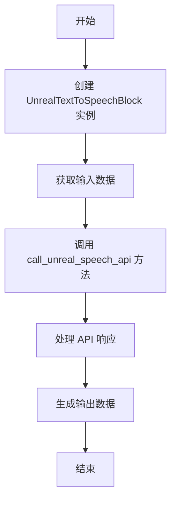
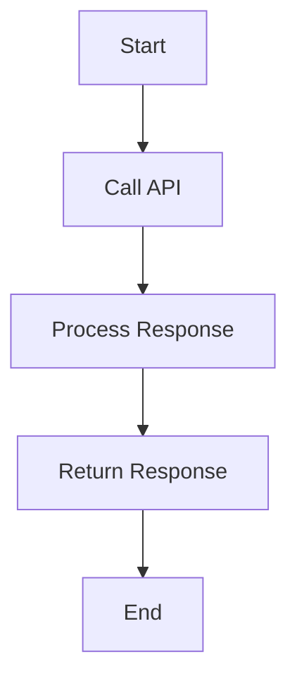
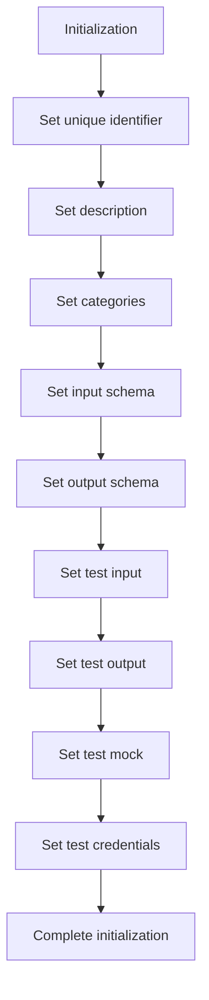
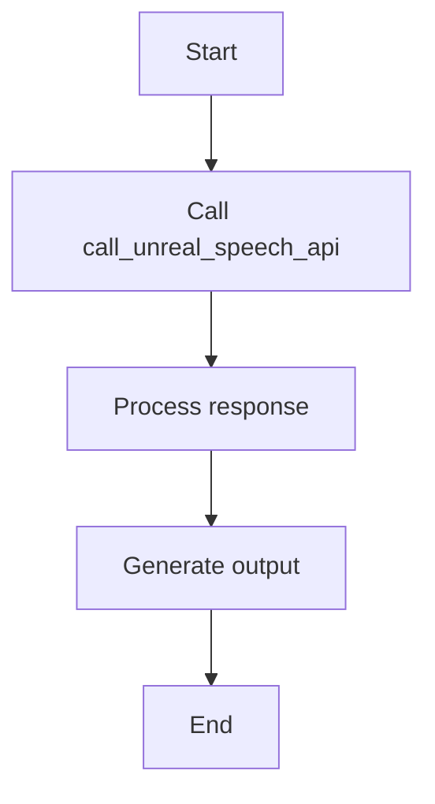

# `.\AutoGPT\autogpt_platform\backend\backend\blocks\text_to_speech_block.py` 详细设计文档

The code provides a text-to-speech conversion block using the Unreal Speech API, allowing users to convert text to MP3 files via an API key.

## 整体流程



## 类结构

```
UnrealTextToSpeechBlock (具体类)
├── Input (内部类)
│   ├── text (str)
│   ├── voice_id (str)
│   └── credentials (CredentialsMetaInput)
├── Output (内部类)
│   └── mp3_url (str)
└── call_unreal_speech_api (静态方法)
```

## 全局变量及字段


### `TEST_CREDENTIALS`
    
A set of credentials for the Unreal Speech API.

类型：`APIKeyCredentials`
    


### `TEST_CREDENTIALS_INPUT`
    
A dictionary containing input data for testing the Unreal Text To Speech Block.

类型：`dict`
    


### `UnrealTextToSpeechBlock.id`
    
The unique identifier for the Unreal Text To Speech Block.

类型：`str`
    


### `UnrealTextToSpeechBlock.description`
    
A description of the Unreal Text To Speech Block.

类型：`str`
    


### `UnrealTextToSpeechBlock.categories`
    
A set of categories that the Unreal Text To Speech Block belongs to.

类型：`set[BlockCategory]`
    


### `UnrealTextToSpeechBlock.input_schema`
    
The input schema for the Unreal Text To Speech Block.

类型：`Input`
    


### `UnrealTextToSpeechBlock.output_schema`
    
The output schema for the Unreal Text To Speech Block.

类型：`Output`
    


### `UnrealTextToSpeechBlock.test_input`
    
The test input data for the Unreal Text To Speech Block.

类型：`dict`
    


### `UnrealTextToSpeechBlock.test_output`
    
The test output data for the Unreal Text To Speech Block.

类型：`list[tuple]`
    


### `UnrealTextToSpeechBlock.test_mock`
    
The test mock data for the Unreal Text To Speech Block.

类型：`dict`
    


### `UnrealTextToSpeechBlock.test_credentials`
    
The test credentials for the Unreal Text To Speech Block.

类型：`APIKeyCredentials`
    


### `Input.text`
    
The text to be converted to speech.

类型：`str`
    


### `Input.voice_id`
    
The voice ID to use for text-to-speech conversion.

类型：`str`
    


### `Input.credentials`
    
The credentials for the Unreal Speech integration.

类型：`CredentialsMetaInput[Literal[ProviderName.UNREAL_SPEECH], Literal["api_key"]]`
    


### `Output.mp3_url`
    
The URL of the generated MP3 file.

类型：`str`
    
    

## 全局函数及方法


### `UnrealTextToSpeechBlock.call_unreal_speech_api`

Converts text to speech using the Unreal Speech API.

参数：

- `api_key`：`SecretStr`，The API key for the Unreal Speech API. This is used to authenticate the request.
- `text`：`str`，The text to be converted to speech. This is the input text that will be spoken.
- `voice_id`：`str`，The voice ID to use for text-to-speech conversion. This specifies which voice will be used to speak the text.

返回值：`dict[str, Any]`，A dictionary containing the response from the Unreal Speech API, including the URL of the generated MP3 file.

#### 流程图



#### 带注释源码

```python
@staticmethod
async def call_unreal_speech_api(
    api_key: SecretStr, text: str, voice_id: str
) -> dict[str, Any]:
    url = "https://api.v7.unrealspeech.com/speech"
    headers = {
        "Authorization": f"Bearer {api_key.get_secret_value()}",
        "Content-Type": "application/json",
    }
    data = {
        "Text": text,
        "VoiceId": voice_id,
        "Bitrate": "192k",
        "Speed": "0",
        "Pitch": "1",
        "TimestampType": "sentence",
    }

    response = await Requests().post(url, headers=headers, json=data)
    return response.json()
```


### UnrealTextToSpeechBlock.__init__

This method initializes the `UnrealTextToSpeechBlock` class, setting up its properties and configurations for the Unreal Speech API integration.

参数：

- `self`：`UnrealTextToSpeechBlock`，The instance of the class being initialized.
- `id`：`str`，The unique identifier for the block.
- `description`：`str`，A description of the block's functionality.
- `categories`：`set`，A set of categories that the block belongs to.
- `input_schema`：`Input`，The input schema for the block.
- `output_schema`：`Output`，The output schema for the block.
- `test_input`：`dict`，The test input data for the block.
- `test_output`：`list`，The test output data for the block.
- `test_mock`：`dict`，Mock data for testing the block.
- `test_credentials`：`APIKeyCredentials`，The test credentials for the block.

返回值：`None`，This method does not return any value.

#### 流程图



#### 带注释源码

```python
def __init__(self):
    super().__init__(
        id="4ff1ff6d-cc40-4caa-ae69-011daa20c378",
        description="Converts text to speech using the Unreal Speech API",
        categories={BlockCategory.AI, BlockCategory.TEXT, BlockCategory.MULTIMEDIA},
        input_schema=UnrealTextToSpeechBlock.Input,
        output_schema=UnrealTextToSpeechBlock.Output,
        test_input={
            "text": "This is a test of the text to speech API.",
            "voice_id": "Scarlett",
            "credentials": TEST_CREDENTIALS_INPUT,
        },
        test_output=[("mp3_url", "https://example.com/test.mp3")],
        test_mock={
            "call_unreal_speech_api": lambda *args, **kwargs: {
                "OutputUri": "https://example.com/test.mp3"
            }
        },
        test_credentials=TEST_CREDENTIALS,
    )
```


### UnrealTextToSpeechBlock.run

Converts text to speech using the Unreal Speech API and yields the URL of the generated MP3 file.

参数：

- `input_data`：`Input`，The input data for the block, containing the text to be converted to speech, the voice ID to use, and the credentials for the Unreal Speech API.
- `credentials`：`APIKeyCredentials`，The credentials for the Unreal Speech API, including the API key.
- `**kwargs`：`Any`，Additional keyword arguments that may be passed to the method.

返回值：`BlockOutput`，The output of the block, containing the URL of the generated MP3 file.

#### 流程图



#### 带注释源码

```python
async def run(self, input_data: Input, *, credentials: APIKeyCredentials, **kwargs) -> BlockOutput:
    api_response = await self.call_unreal_speech_api(
        credentials.api_key,
        input_data.text,
        input_data.voice_id,
    )
    yield "mp3_url", api_response["OutputUri"]
```


### UnrealTextToSpeechBlock.call_unreal_speech_api

Converts text to speech using the Unreal Speech API by making a POST request to the Unreal Speech API endpoint.

参数：

- `api_key`：`SecretStr`，The API key used to authenticate the request to the Unreal Speech API.
- `text`：`str`，The text to be converted to speech.
- `voice_id`：`str`，The voice ID to use for the text-to-speech conversion.

返回值：`dict[str, Any]`，A dictionary containing the response from the Unreal Speech API, including the URL of the generated MP3 file.

#### 流程图


#### 带注释源码

```python
@staticmethod
async def call_unreal_speech_api(
    api_key: SecretStr, text: str, voice_id: str
) -> dict[str, Any]:
    url = "https://api.v7.unrealspeech.com/speech"
    headers = {
        "Authorization": f"Bearer {api_key.get_secret_value()}",
        "Content-Type": "application/json",
    }
    data = {
        "Text": text,
        "VoiceId": voice_id,
        "Bitrate": "192k",
        "Speed": "0",
        "Pitch": "1",
        "TimestampType": "sentence",
    }

    response = await Requests().post(url, headers=headers, json=data)
    return response.json()
```


## 关键组件


### 张量索引与惰性加载

张量索引与惰性加载是用于高效处理大型数据集的技术，通过延迟计算和按需加载数据来减少内存消耗和提高性能。

### 反量化支持

反量化支持是指系统能够处理和转换不同量化的数据，以适应不同的硬件和优化需求。

### 量化策略

量化策略是用于优化模型性能和减少模型大小的方法，通过减少模型中使用的数值精度来实现。


## 问题及建议


### 已知问题

-   **API Key 安全性**：代码中使用的 API 密钥以明文形式存储在全局变量 `TEST_CREDENTIALS` 中，这可能导致安全风险。API 密钥应该通过环境变量或配置文件安全地管理。
-   **异步函数调用**：`call_unreal_speech_api` 方法是异步的，但 `run` 方法中并没有使用 `await` 关键字来等待异步操作完成。这可能导致阻塞行为或未处理的结果。
-   **错误处理**：代码中没有明确的错误处理机制。如果 API 调用失败或返回错误，应该有相应的错误处理逻辑来处理这些情况。
-   **代码重复**：`TEST_CREDENTIALS` 和 `TEST_CREDENTIALS_INPUT` 的定义在类外部和类内部重复，这可能导致维护困难。

### 优化建议

-   **使用环境变量或配置文件**：将 API 密钥存储在环境变量或配置文件中，而不是直接在代码中。
-   **改进异步调用**：确保 `run` 方法中的异步调用正确使用 `await` 关键字，以避免阻塞和确保异步操作完成。
-   **实现错误处理**：在 `call_unreal_speech_api` 和 `run` 方法中实现错误处理逻辑，以处理可能的异常和错误。
-   **减少代码重复**：将 `TEST_CREDENTIALS` 和 `TEST_CREDENTIALS_INPUT` 的定义移到类内部，以减少代码重复并提高可维护性。
-   **日志记录**：添加日志记录来跟踪 API 调用和错误，以便于调试和监控。
-   **单元测试**：编写单元测试来验证 `call_unreal_speech_api` 和 `run` 方法的功能，确保代码的正确性和稳定性。


## 其它


### 设计目标与约束

- 设计目标：
  - 实现一个模块，将文本转换为语音，使用Unreal Speech API。
  - 提供一个用户友好的接口，允许用户指定文本、语音ID和API密钥。
  - 确保API调用安全，使用密钥管理。
  - 支持单元测试和集成测试。
- 约束：
  - 必须使用Unreal Speech API进行语音合成。
  - 输入数据必须符合API的要求。
  - 输出结果必须是一个有效的MP3文件URL。

### 错误处理与异常设计

- 错误处理：
  - API调用失败时，捕获异常并返回错误信息。
  - 检查输入数据的有效性，并在无效时返回错误。
  - 使用日志记录错误信息，以便于调试和监控。
- 异常设计：
  - 定义自定义异常类，用于处理特定错误情况。
  - 异常类应包含错误信息和相关上下文。

### 数据流与状态机

- 数据流：
  - 用户输入文本、语音ID和API密钥。
  - 模块调用Unreal Speech API进行语音合成。
  - API返回MP3文件URL。
  - 模块返回MP3文件URL。
- 状态机：
  - 模块在执行过程中可能处于以下状态：等待输入、调用API、处理响应、返回结果。

### 外部依赖与接口契约

- 外部依赖：
  - Unreal Speech API。
  - Requests库用于HTTP请求。
  - Pydantic库用于数据验证。
- 接口契约：
  - Unreal Speech API的接口规范。
  - Requests库的HTTP请求规范。
  - Pydantic的数据模型规范。


    