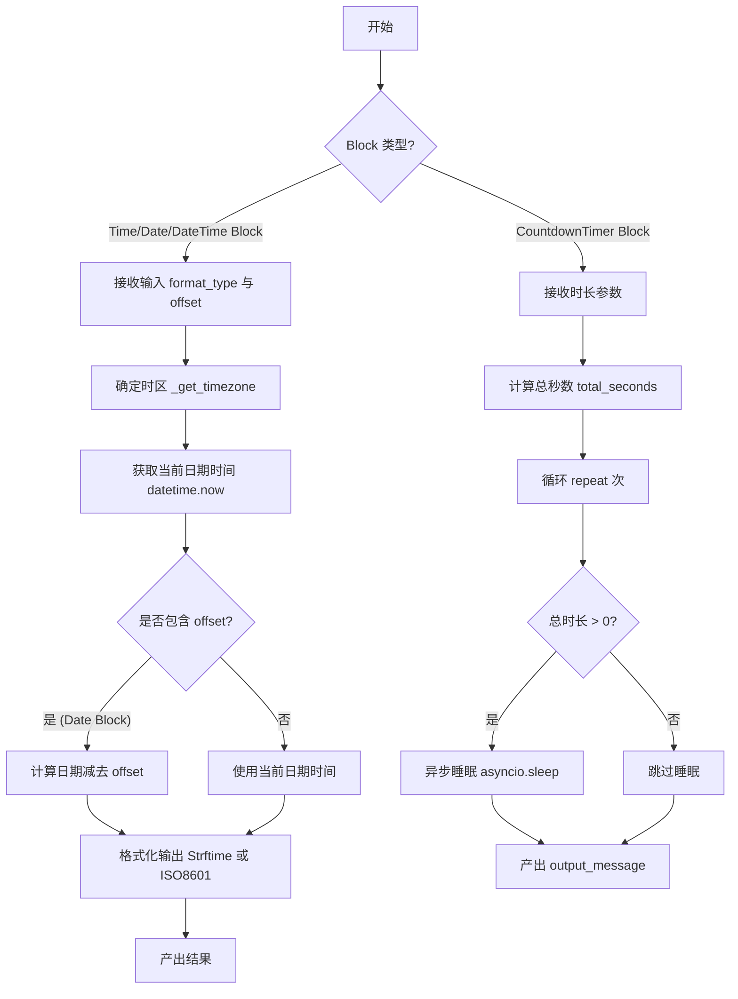
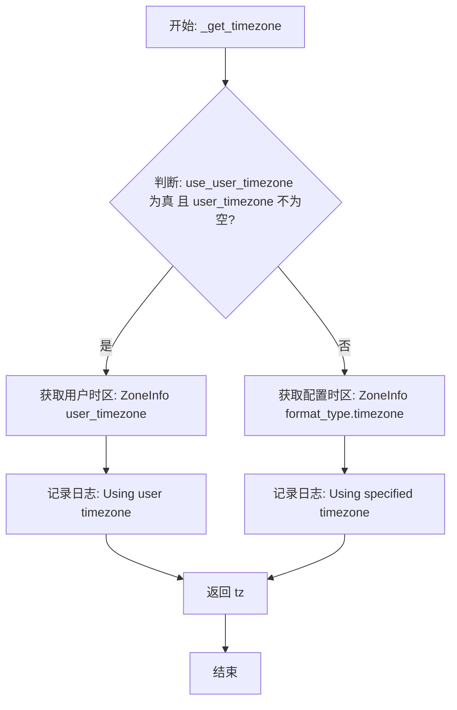
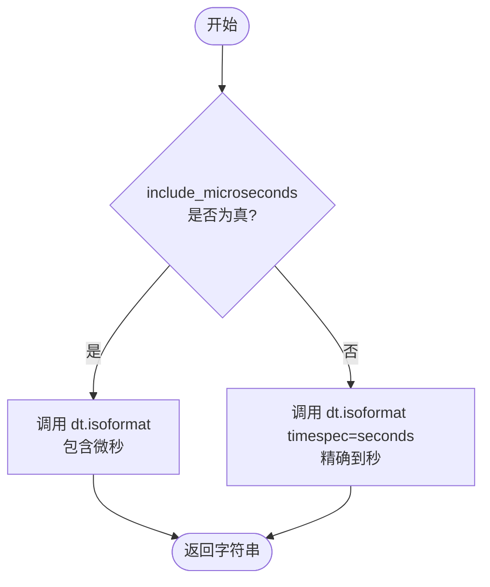
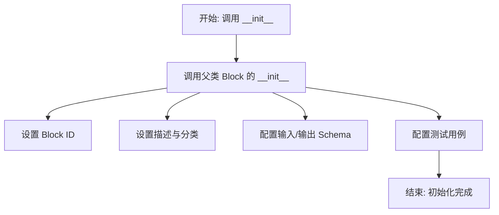
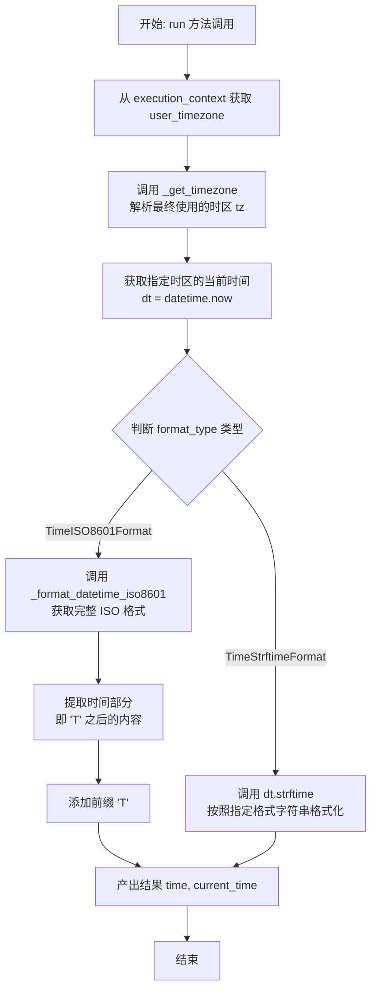
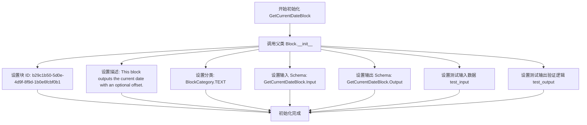
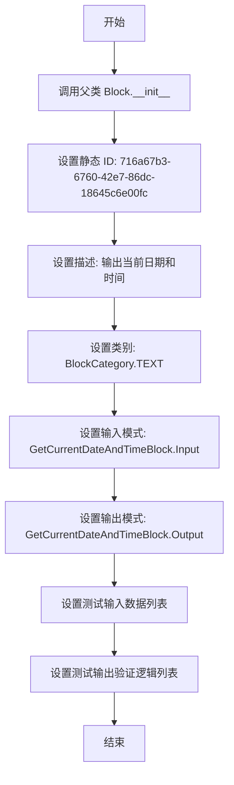
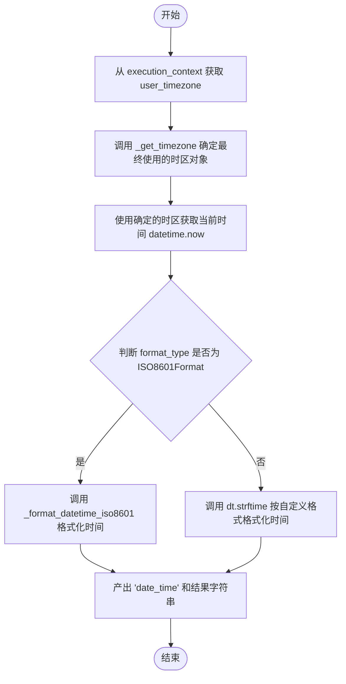
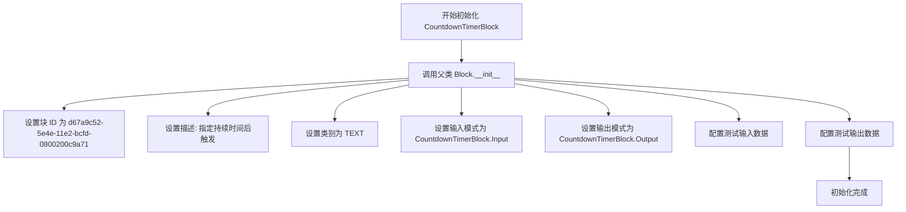
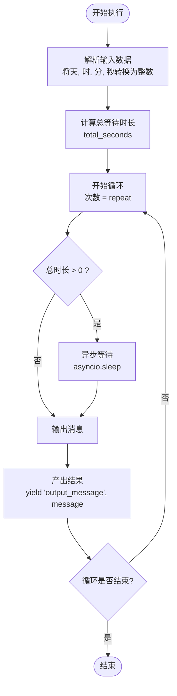

# `AutoGPT\autogpt_platform\backend\backend\blocks\time_blocks.py` 详细设计文档

该代码定义了一系列用于时间处理的自动化模块，包括获取当前时间、日期、日期时间（支持多时区和ISO8601/Strftime格式化），以及一个支持天、时、分、秒配置的倒计时定时器。

## 整体流程



## 类结构

```
TimeFormatModels (Pydantic Models)
├── TimeStrftimeFormat
├── TimeISO8601Format
├── DateStrftimeFormat
├── DateISO8601Format
├── StrftimeFormat
└── ISO8601Format
BlockDefinitions
├── GetCurrentTimeBlock
│   ├── Input
│   └── Output
├── GetCurrentDateBlock
│   ├── Input
│   └── Output
├── GetCurrentDateAndTimeBlock
│   ├── Input
│   └── Output
└── CountdownTimerBlock
    ├── Input
    └── Output
```

## 全局变量及字段


### `logger`
    
用于记录日志信息的标准日志记录器实例。

类型：`logging.Logger`
    


### `TimezoneLiteral`
    
定义了包含全球主要时区字符串的字面量类型，用于限制时区输入的有效范围。

类型：`typing.Literal`
    


### `TimeStrftimeFormat.discriminator`
    
用于标识格式类型为 'strftime' 的判别器字段。

类型：`Literal["strftime"]`
    


### `TimeStrftimeFormat.format`
    
定义时间输出格式的 strftime 格式字符串，默认为 "%H:%M:%S"。

类型：`str`
    


### `TimeStrftimeFormat.timezone`
    
指定输出时间所使用的时区，默认为 'UTC'。

类型：`TimezoneLiteral`
    


### `TimeStrftimeFormat.use_user_timezone`
    
标识是否覆盖指定时区而使用用户上下文中的时区，默认为 False。

类型：`bool`
    


### `TimeISO8601Format.discriminator`
    
用于标识格式类型为 'iso8601' 的判别器字段。

类型：`Literal["iso8601"]`
    


### `TimeISO8601Format.timezone`
    
指定输出时间所使用的时区，默认为 'UTC'。

类型：`TimezoneLiteral`
    


### `TimeISO8601Format.use_user_timezone`
    
标识是否覆盖指定时区而使用用户上下文中的时区，默认为 False。

类型：`bool`
    


### `TimeISO8601Format.include_microseconds`
    
标识 ISO8601 格式输出中是否包含微秒精度，默认为 False。

类型：`bool`
    


### `GetCurrentTimeBlock.Input.trigger`
    
用于触发块执行并输出当前时间的任意输入数据。

类型：`str`
    


### `GetCurrentTimeBlock.Input.format_type`
    
配置时间输出格式的对象，支持 strftime 自定义格式或 ISO8601 标准格式。

类型：`Union[TimeStrftimeFormat, TimeISO8601Format]`
    


### `GetCurrentTimeBlock.Output.time`
    
按指定格式格式化后的当前时间字符串。

类型：`str`
    


### `DateStrftimeFormat.discriminator`
    
用于标识格式类型为 'strftime' 的判别器字段。

类型：`Literal["strftime"]`
    


### `DateStrftimeFormat.format`
    
定义日期输出格式的 strftime 格式字符串，默认为 "%Y-%m-%d"。

类型：`str`
    


### `DateStrftimeFormat.timezone`
    
指定计算日期所使用的时区，默认为 'UTC'。

类型：`TimezoneLiteral`
    


### `DateStrftimeFormat.use_user_timezone`
    
标识是否覆盖指定时区而使用用户上下文中的时区，默认为 False。

类型：`bool`
    


### `DateISO8601Format.discriminator`
    
用于标识格式类型为 'iso8601' 的判别器字段。

类型：`Literal["iso8601"]`
    


### `DateISO8601Format.timezone`
    
指定计算日期所使用的时区，默认为 'UTC'。

类型：`TimezoneLiteral`
    


### `DateISO8601Format.use_user_timezone`
    
标识是否覆盖指定时区而使用用户上下文中的时区，默认为 False。

类型：`bool`
    


### `GetCurrentDateBlock.Input.trigger`
    
用于触发块执行并输出当前日期的任意输入数据。

类型：`str`
    


### `GetCurrentDateBlock.Input.offset`
    
距当前日期的天数偏移量，正数表示未来，负数表示过去。

类型：`Union[int, str]`
    


### `GetCurrentDateBlock.Input.format_type`
    
配置日期输出格式的对象，支持 strftime 自定义格式或 ISO8601 标准格式。

类型：`Union[DateStrftimeFormat, DateISO8601Format]`
    


### `GetCurrentDateBlock.Output.date`
    
按指定格式和偏移量计算后的日期字符串。

类型：`str`
    


### `StrftimeFormat.discriminator`
    
用于标识格式类型为 'strftime' 的判别器字段。

类型：`Literal["strftime"]`
    


### `StrftimeFormat.format`
    
定义日期时间输出格式的 strftime 格式字符串，默认为 "%Y-%m-%d %H:%M:%S"。

类型：`str`
    


### `StrftimeFormat.timezone`
    
指定输出日期时间所使用的时区，默认为 'UTC'。

类型：`TimezoneLiteral`
    


### `StrftimeFormat.use_user_timezone`
    
标识是否覆盖指定时区而使用用户上下文中的时区，默认为 False。

类型：`bool`
    


### `ISO8601Format.discriminator`
    
用于标识格式类型为 'iso8601' 的判别器字段。

类型：`Literal["iso8601"]`
    


### `ISO8601Format.timezone`
    
指定输出日期时间所使用的时区，默认为 'UTC'。

类型：`TimezoneLiteral`
    


### `ISO8601Format.use_user_timezone`
    
标识是否覆盖指定时区而使用用户上下文中的时区，默认为 False。

类型：`bool`
    


### `ISO8601Format.include_microseconds`
    
标识 ISO8601 格式输出中是否包含微秒精度，默认为 False。

类型：`bool`
    


### `GetCurrentDateAndTimeBlock.Input.trigger`
    
用于触发块执行并输出当前日期时间的任意输入数据。

类型：`str`
    


### `GetCurrentDateAndTimeBlock.Input.format_type`
    
配置日期时间输出格式的对象，支持 strftime 自定义格式或 ISO8601 标准格式。

类型：`Union[StrftimeFormat, ISO8601Format]`
    


### `GetCurrentDateAndTimeBlock.Output.date_time`
    
按指定格式格式化后的当前日期和时间字符串。

类型：`str`
    


### `CountdownTimerBlock.Input.input_message`
    
计时器结束后输出的消息内容。

类型：`Any`
    


### `CountdownTimerBlock.Input.seconds`
    
计时器持续时间的秒数部分。

类型：`Union[int, str]`
    


### `CountdownTimerBlock.Input.minutes`
    
计时器持续时间的分钟数部分。

类型：`Union[int, str]`
    


### `CountdownTimerBlock.Input.hours`
    
计时器持续时间的小时数部分。

类型：`Union[int, str]`
    


### `CountdownTimerBlock.Input.days`
    
计时器持续时间的天数部分。

类型：`Union[int, str]`
    


### `CountdownTimerBlock.Input.repeat`
    
计时器重复执行的次数。

类型：`int`
    


### `CountdownTimerBlock.Output.output_message`
    
计时器结束后返回的消息内容。

类型：`Any`
    
    

## 全局函数及方法


### `_get_timezone`

根据格式设置和用户上下文确定要使用的时区。

参数：

-  `format_type`：`Any`，包含时区设置（具有 `timezone` 和 `use_user_timezone` 属性）的格式配置对象。
-  `user_timezone`：`str | None`，来自用户上下文的时区字符串。

返回值：`ZoneInfo`，所确定时区的 ZoneInfo 对象。

#### 流程图



#### 带注释源码

```python
def _get_timezone(
    format_type: Any,  # Any format type with timezone and use_user_timezone attributes
    user_timezone: str | None,
) -> ZoneInfo:
    """
    Determine which timezone to use based on format settings and user context.

    Args:
        format_type: The format configuration containing timezone settings
        user_timezone: The user's timezone from context

    Returns:
        ZoneInfo object for the determined timezone
    """
    # 检查是否配置了使用用户时区，并且用户时区参数确实存在
    if format_type.use_user_timezone and user_timezone:
        # 如果条件满足，使用用户上下文提供的时区创建 ZoneInfo 对象
        tz = ZoneInfo(user_timezone)
        # 记录调试日志，表明使用了用户时区
        logger.debug(f"Using user timezone: {user_timezone}")
    else:
        # 否则，使用 format_type 配置对象中指定的默认时区创建 ZoneInfo 对象
        tz = ZoneInfo(format_type.timezone)
        # 记录调试日志，表明使用了配置指定的时区
        logger.debug(f"Using specified timezone: {format_type.timezone}")
    # 返回最终确定的 ZoneInfo 时区对象
    return tz
```


### `_format_datetime_iso8601`

将日期时间对象格式化为 ISO8601 标准字符串。

参数：

-  `dt`：`datetime`，待格式化的日期时间对象。
-  `include_microseconds`：`bool`，指示输出结果中是否包含微秒部分的标志位。

返回值：`str`，格式化后的 ISO8601 字符串。

#### 流程图



#### 带注释源码

```python
def _format_datetime_iso8601(dt: datetime, include_microseconds: bool = False) -> str:
    """
    Format a datetime object to ISO8601 string.

    Args:
        dt: The datetime object to format
        include_microseconds: Whether to include microseconds in the output

    Returns:
        ISO8601 formatted string
    """
    # 检查是否需要包含微秒
    if include_microseconds:
        # 返回默认的 ISO 格式，包含完整的时间信息（含微秒）
        return dt.isoformat()
    else:
        # 返回只精确到秒的 ISO 格式，忽略微秒部分
        return dt.isoformat(timespec="seconds")
```


### `GetCurrentTimeBlock.__init__`

`GetCurrentTimeBlock` 类的构造函数，负责初始化块的基本元数据，包括唯一标识符、描述、分类、输入输出架构以及用于验证的测试用例。

参数：

- `self`：`GetCurrentTimeBlock`，类实例自身

返回值：`None`，无返回值（初始化对象）

#### 流程图



#### 带注释源码

```python
def __init__(self):
    # 调用父类 Block 的构造函数来注册块的元数据和配置
    super().__init__(
        id="a892b8d9-3e4e-4e9c-9c1e-75f8efcf1bfa",  # 块的唯一标识符 (UUID)
        description="This block outputs the current time.",  # 块功能的文本描述
        categories={BlockCategory.TEXT},  # 块所属的逻辑分类
        input_schema=GetCurrentTimeBlock.Input,  # 定义输入数据结构的 Schema
        output_schema=GetCurrentTimeBlock.Output,  # 定义输出数据结构的 Schema
        test_input=[  # 定义用于测试的模拟输入数据列表
            {"trigger": "Hello"},
            {
                "trigger": "Hello",
                "format_type": {
                    "discriminator": "strftime",
                    "format": "%H:%M",
                },
            },
            {
                "trigger": "Hello",
                "format_type": {
                    "discriminator": "iso8601",
                    "timezone": "UTC",
                    "include_microseconds": False,
                },
            },
        ],
        test_output=[  # 定义用于验证输出的测试断言列表
            ("time", lambda _: time.strftime("%H:%M:%S")),
            ("time", lambda _: time.strftime("%H:%M")),
            (
                "time",
                lambda t: "T" in t and ("+" in t or "Z" in t),
            ),  # 检查 ISO 格式是否包含时区标识
        ],
    )
```


### `GetCurrentTimeBlock.run`

该方法用于获取并输出当前时间。它根据执行上下文中的用户时区配置或输入数据中指定的时区，支持通过 `strftime` 或 `ISO 8601` 两种格式对当前时间进行格式化输出。

参数：

-   `input_data`：`GetCurrentTimeBlock.Input`，包含触发数据和格式配置（strftime 或 ISO8601）的输入对象。
-   `execution_context`：`ExecutionContext`，执行上下文对象，用于获取用户级别的配置信息（如用户时区）。
-   `**kwargs`：`dict`，其他可选的关键字参数。

返回值：`BlockOutput`，一个异步生成器，产出包含键 "time" 和格式化后的当前时间字符串的元组。

#### 流程图



#### 带注释源码

```python
async def run(
    self, input_data: Input, *, execution_context: ExecutionContext, **kwargs
) -> BlockOutput:
    # 1. 从执行上下文中获取用户的有效时区配置
    effective_timezone = execution_context.user_timezone

    # 2. 根据输入数据中的格式配置和用户时区，确定最终使用的时区对象
    tz = _get_timezone(input_data.format_type, effective_timezone)
    
    # 3. 获取该时区下的当前时间
    dt = datetime.now(tz=tz)

    # 4. 根据 format_type 的具体类型进行不同的格式化处理
    if isinstance(input_data.format_type, TimeISO8601Format):
        # 4.1 如果是 ISO8601 格式
        # 获取完整的 ISO8601 日期时间字符串（包含或不包含微秒）
        full_iso = _format_datetime_iso8601(
            dt, input_data.format_type.include_microseconds
        )
        # 提取时间部分（即 'T' 之后的内容），如果 'T' 不存在则使用完整字符串
        current_time = full_iso.split("T")[1] if "T" in full_iso else full_iso
        # 添加 'T' 前缀以符合 ISO 8601 时间格式标准 (如 T14:30:00+00:00)
        current_time = f"T{current_time}" 
    else:  # TimeStrftimeFormat
        # 4.2 如果是 Strftime 格式，使用 Python 的 strftime 方法进行自定义格式化
        current_time = dt.strftime(input_data.format_type.format)

    # 5. 产出格式化后的时间字符串
    yield "time", current_time
```


### `GetCurrentDateBlock.__init__`

初始化 `GetCurrentDateBlock` 实例，配置其元数据、输入输出模式及测试用例。

参数：

- `self`：`GetCurrentDateBlock`，表示类实例本身。

返回值：`None`，无返回值，该方法用于初始化对象状态。

#### 流程图



#### 带注释源码

```python
def __init__(self):
    # 调用父类 Block 的构造函数，定义该块的基本属性和行为
    super().__init__(
        # 唯一标识符，用于在系统中注册和识别该块
        id="b29c1b50-5d0e-4d9f-8f9d-1b0e6fcbf0b1",
        # 块功能的自然语言描述
        description="This block outputs the current date with an optional offset.",
        # 所属的功能分类，此处归类为文本处理类
        categories={BlockCategory.TEXT},
        # 指定输入数据的验证模型，使用内部定义的 Input 类
        input_schema=GetCurrentDateBlock.Input,
        # 指定输出数据的验证模型，使用内部定义的 Output 类
        output_schema=GetCurrentDateBlock.Output,
        # 预定义的测试输入数据集，覆盖了不同偏移量和格式类型的场景
        test_input=[
            {"trigger": "Hello", "offset": "7"},
            {
                "trigger": "Hello",
                "offset": "7",
                "format_type": {
                    "discriminator": "strftime",
                    "format": "%m/%d/%Y",
                },
            },
            {
                "trigger": "Hello",
                "offset": "0",
                "format_type": {
                    "discriminator": "iso8601",
                    "timezone": "UTC",
                },
            },
        ],
        # 预定义的测试输出验证逻辑，使用 Lambda 函数检查输出是否符合预期
        test_output=[
            (
                "date",
                lambda t: abs(
                    datetime.now().date() - datetime.strptime(t, "%Y-%m-%d").date()
                )
                <= timedelta(days=8),  # 7 days difference + 1 day error margin.
            ),
            (
                "date",
                lambda t: abs(
                    datetime.now().date() - datetime.strptime(t, "%m/%d/%Y").date()
                )
                <= timedelta(days=8),
                # 7 days difference + 1 day error margin.
            ),
            (
                "date",
                lambda t: len(t) == 10
                and t[4] == "-"
                and t[7] == "-",  # ISO date format YYYY-MM-DD
            ),
        ],
    )
```


### `GetCurrentDateBlock.run`

该方法用于获取当前日期，支持根据用户指定的时区、天数偏移量以及不同的格式类型（ISO8601 或 Strftime）进行计算和格式化，并最终输出格式化后的日期字符串。

参数：

- `input_data`：`GetCurrentDateBlock.Input`，包含触发器、天数偏移量（offset）以及格式类型配置（format_type）的输入数据对象。
- `execution_context`：`ExecutionContext`，执行上下文对象，用于获取当前用户的时区信息。
- `**kwargs`：`Any`，其他扩展的关键字参数。

返回值：`BlockOutput`，一个异步生成器，产生包含键值对 `"date"` 和格式化日期字符串的元组。

#### 流程图

```mermaid
graph TD
    A[开始执行 run 方法] --> B[从 execution_context 获取 effective_timezone]
    B --> C{尝试将 input_data.offset 转为 int}
    C -->|成功| D[保存 offset 值]
    C -->|失败 ValueError| E[设置 offset 为默认值 0]
    D --> F[调用 _get_timezone 获取 ZoneInfo 对象 tz]
    E --> F
    F --> G[计算当前时间并减去 offset 天数 timedelta]
    G --> H{判断 format_type 类型}
    H -->|DateISO8601Format| I[调用 .date().isoformat() 格式化]
    H -->|DateStrftimeFormat| J[调用 .strftime() 格式化]
    I --> K[Yield 输出 'date' 和 date_str]
    J --> K
    K --> L[结束]
```

#### 带注释源码

```python
async def run(
    self, input_data: Input, *, execution_context: ExecutionContext, **kwargs
) -> BlockOutput:
    # 从执行上下文中获取用户的有效时区
    effective_timezone = execution_context.user_timezone

    try:
        # 尝试将偏移量转换为整数，支持正负天数偏移
        offset = int(input_data.offset)
    except ValueError:
        # 如果转换失败（例如输入了非数字字符串），默认偏移量设为 0
        offset = 0

    # 根据配置（format_type 中的 use_user_timezone 和 timezone）和用户上下文确定最终使用的时区对象
    tz = _get_timezone(input_data.format_type, effective_timezone)
    
    # 获取当前时间并减去指定的天数偏移量
    current_date = datetime.now(tz=tz) - timedelta(days=offset)

    # 根据不同的格式类型进行字符串格式化
    if isinstance(input_data.format_type, DateISO8601Format):
        # ISO 8601 日期格式 (YYYY-MM-DD)
        date_str = current_date.date().isoformat()
    else:  # DateStrftimeFormat
        # 使用自定义的 strftime 格式字符串
        date_str = current_date.strftime(input_data.format_type.format)

    # 产出结果，键为 "date"，值为格式化后的字符串
    yield "date", date_str
```


### `GetCurrentDateAndTimeBlock.__init__`

初始化 `GetCurrentDateAndTimeBlock` 类的实例，配置块的唯一标识符、描述、分类、输入输出模式以及用于验证功能的测试数据。

参数：

- `self`：`GetCurrentDateAndTimeBlock`，类的当前实例。

返回值：`None`，构造函数不返回任何值。

#### 流程图



#### 带注释源码

```python
def __init__(self):
    # 调用父类 Block 的初始化方法，传递块的元数据和配置信息
    super().__init__(
        # 指定该块在系统中的唯一标识符
        id="716a67b3-6760-42e7-86dc-18645c6e00fc",
        # 简要描述该块的功能
        description="This block outputs the current date and time.",
        # 定义该块所属的类别，此处为文本处理类
        categories={BlockCategory.TEXT},
        # 绑定输入数据的结构定义类，用于验证输入
        input_schema=GetCurrentDateAndTimeBlock.Input,
        # 绑定输出数据的结构定义类，用于定义输出格式
        output_schema=GetCurrentDateAndTimeBlock.Output,
        # 提供测试用例输入，用于示例或单元测试
        test_input=[
            {"trigger": "Hello"},
            {
                "trigger": "Hello",
                "format_type": {
                    "discriminator": "strftime",
                    "format": "%Y/%m/%d",
                },
            },
            {
                "trigger": "Hello",
                "format_type": {
                    "discriminator": "iso8601",
                    "timezone": "UTC",
                    "include_microseconds": False,
                },
            },
        ],
        # 提供测试用例输出验证逻辑，包含 lambda 函数以检查时间格式和精度
        test_output=[
            (
                "date_time",
                lambda t: abs(
                    datetime.now(tz=ZoneInfo("UTC"))
                    - datetime.strptime(t + "+00:00", "%Y-%m-%d %H:%M:%S%z")
                )
                < timedelta(seconds=10),  # 允许10秒的误差范围
            ),
            (
                "date_time",
                lambda t: abs(
                    datetime.now().date() - datetime.strptime(t, "%Y/%m/%d").date()
                )
                <= timedelta(days=1),  # 允许1天的误差范围（日期格式）
            ),
            (
                "date_time",
                lambda t: abs(
                    datetime.now(tz=ZoneInfo("UTC")) - datetime.fromisoformat(t)
                )
                < timedelta(seconds=10),  # ISO格式允许10秒误差
            ),
        ],
    )
```


### `GetCurrentDateAndTimeBlock.run`

该方法根据用户提供的格式类型（ISO 8601 或自定义 Strftime）和时区配置，获取当前的日期和时间，并将其格式化为字符串后输出。

参数：

- `input_data`：`GetCurrentDateAndTimeBlock.Input`，包含触发数据（trigger）和格式配置（format_type）的输入数据对象。
- `execution_context`：`ExecutionContext`，执行上下文对象，用于获取当前用户的时区设置。
- `**kwargs`：`Any`，其他可选的关键字参数。

返回值：`BlockOutput`，一个生成器，产出包含键 "date_time" 和格式化后的日期时间字符串的元组。

#### 流程图



#### 带注释源码

```python
async def run(
    self, input_data: Input, *, execution_context: ExecutionContext, **kwargs
) -> BlockOutput:
    # 从执行上下文中提取用户配置的时区
    effective_timezone = execution_context.user_timezone

    # 根据输入的格式配置（format_type）和用户时区，计算最终应该使用的时区对象
    # 优先级：如果 format_type.use_user_timezone 为 True 且存在 user_timezone，则使用用户时区；
    # 否则使用 format_type 中指定的默认时区。
    tz = _get_timezone(input_data.format_type, effective_timezone)
    
    # 获取指定时区下的当前日期和时间
    dt = datetime.now(tz=tz)

    # 检查格式配置是否为 ISO8601 格式类型
    if isinstance(input_data.format_type, ISO8601Format):
        # 使用 ISO8601 格式化日期时间，根据配置决定是否包含微秒
        current_date_time = _format_datetime_iso8601(
            dt, input_data.format_type.include_microseconds
        )
    else:  # 否则为 StrftimeFormat
        # 使用自定义的 strftime 格式字符串进行格式化
        current_date_time = dt.strftime(input_data.format_type.format)

    # 产出结果，键名为 "date_time"，值为格式化后的字符串
    yield "date_time", current_date_time
```


### `CountdownTimerBlock.__init__`

该方法用于初始化 `CountdownTimerBlock` 类实例。它通过调用父类 `Block` 的构造函数，配置该块的元数据（如 ID、描述）、所属类别、输入输出数据模型（Schema）以及用于功能验证的测试输入输出数据。

参数：

- `self`：`CountdownTimerBlock`，表示类实例本身。

返回值：`None`，初始化方法通常不返回任何值。

#### 流程图



#### 带注释源码

```python
    def __init__(self):
        super().__init__(
            # 设置块的唯一标识符
            id="d67a9c52-5e4e-11e2-bcfd-0800200c9a71",
            # 设置块的文本描述，用于说明其功能
            description="This block triggers after a specified duration.",
            # 将块归类到 TEXT 类别下
            categories={BlockCategory.TEXT},
            # 指定输入数据的验证模式，绑定内部类 Input
            input_schema=CountdownTimerBlock.Input,
            # 指定输出数据的验证模式，绑定内部类 Output
            output_schema=CountdownTimerBlock.Output,
            # 定义测试用例的输入数据，用于验证逻辑
            test_input=[
                {"seconds": 1},
                {"input_message": "Custom message"},
            ],
            # 定义测试用例的期望输出数据
            test_output=[
                ("output_message", "timer finished"),
                ("output_message", "Custom message"),
            ],
        )
```


### `CountdownTimerBlock.run`

该方法是 `CountdownTimerBlock` 类的核心执行逻辑，主要用于实现倒计时功能。它接收包含时长（天、时、分、秒）、重复次数和输出消息的输入数据，计算出总等待时长，并在异步等待后输出指定消息，支持按照设定的次数重复执行此流程。

参数：

-   `input_data`：`CountdownTimerBlock.Input`，包含倒计时配置信息的输入数据对象，具体字段包括秒、分、时、天、重复次数以及输出消息。
-   `**kwargs`：`Any`，执行上下文或其他传递给执行器的额外关键字参数。

返回值：`BlockOutput`（即 `AsyncGenerator[Tuple[str, Any], None]`），一个异步生成器，每次倒计时循环结束时产出包含键 `"output_message"` 和对应消息数据的元组。

#### 流程图



#### 带注释源码

```python
    async def run(self, input_data: Input, **kwargs) -> BlockOutput:
        # 从输入数据中提取并转换时间单位为整数
        seconds = int(input_data.seconds)
        minutes = int(input_data.minutes)
        hours = int(input_data.hours)
        days = int(input_data.days)

        # 将所有时间单位累加为总秒数
        total_seconds = seconds + minutes * 60 + hours * 3600 + days * 86400

        # 根据 repeat 参数指定的次数进行循环执行
        for _ in range(input_data.repeat):
            # 如果计算出的总等待时间大于0，则进行异步休眠
            if total_seconds > 0:
                await asyncio.sleep(total_seconds)
            
            # 产出执行结果，键名为 "output_message"，值为用户输入的消息
            yield "output_message", input_data.input_message
```


## 关键组件


### GetCurrentTimeBlock
负责获取当前系统时间的核心组件，支持根据用户上下文或配置指定的时区进行转换，并能将结果格式化为自定义字符串（strftime）或 ISO 8601 标准格式。

### GetCurrentDateBlock
负责获取当前日期并支持日期偏移计算的组件，允许用户通过天数参数获取过去或未来的日期，同时支持时区转换及多种日期格式输出。

### GetCurrentDateAndTimeBlock
负责获取当前完整日期和时间戳的组件，集成了时区处理逻辑，支持将时间戳输出为自定义格式或符合 ISO 8601/RFC 3339 标准的字符串。

### CountdownTimerBlock
异步计时器组件，基于秒、分、时、天计算总延迟时长，支持设置重复次数，并在异步等待结束后输出完成消息。

### Timezone & Formatting Strategy
时区管理与格式化策略组件，定义了全局支持的时区类型（`TimezoneLiteral`），封装了时区解析逻辑（`_get_timezone`）以及用于配置时间、日期和日期时间格式的多种 Pydantic 模型，实现了多时区环境下的统一格式化输出。


## 问题及建议


### 已知问题

-   **时区配置丢失问题**：根据代码注释及逻辑分析，当用户在 strftime 和 iso8601 两种格式类型之间切换时，由于 `timezone` 字段被定义在具体的格式类（如 `TimeStrftimeFormat`）内部而非块输入级别，时区设置无法在切换时保持，导致用户体验不一致（会意外重置为默认的 UTC）。
-   **计时器块输入缺乏容错机制**：`CountdownTimerBlock` 中的时间参数（`seconds`, `minutes` 等）虽然类型注解为 `Union[int, str]`，但在 `run` 方法中直接使用 `int()` 强制转换。相比 `GetCurrentDateBlock` 对 `offset` 字段进行了 `try-except` 处理，计时器块在传入非数字字符串（如 "abc"）时会直接抛出未捕获的异常。
-   **ISO 8601 时间格式输出前缀异常**：`GetCurrentTimeBlock` 在输出 ISO 8601 格式的时间时，逻辑中强制添加了 "T" 前缀（例如输出 `T14:30:00`）。这实际上返回的是日期时间的分隔符及时间部分，而非标准的 ISO 8601 时间字符串（通常为 `14:30:00+00:00`），可能无法直接用于需要标准时间格式的下游系统。

### 优化建议

-   **重构格式类模型以减少冗余**：目前存在多个高度相似的格式类（如 `TimeStrftimeFormat`, `DateStrftimeFormat` 等），它们共享相同的字段（`timezone`, `use_user_timezone`, `discriminator`）。建议引入基类（Base Model）通过继承来复用这些公共字段，提高代码的可维护性和整洁度。
-   **利用 Pydantic 验证器进行自动类型转换**：对于 `Union[int, str]` 类型的输入字段，建议使用 Pydantic 的 `field_validator` 在模型验证阶段自动将输入值转换为 `int`，并设置默认值。这样可以确保进入 `run` 方法的数据类型必定是 `int`，从而消除在业务逻辑中进行手动类型转换和异常处理的必要性。
-   **提取公共的日期时间处理逻辑**：三个获取时间的 Block（`GetCurrentTimeBlock`, `GetCurrentDateBlock`, `GetCurrentDateAndTimeBlock`）的 `run` 方法中包含大量重复代码（获取时区、计算当前时间、格式化分发）。建议将这些重复逻辑提取为工具函数或 Mixin 类，以遵循 DRY（Don't Repeat Yourself）原则。
-   **增强计时器块的健壮性**：在 `CountdownTimerBlock` 中添加对输入参数的错误处理（如无效字符串）。同时，考虑对 `repeat` 参数增加最大值限制，防止用户设置过大的循环次数导致资源耗尽或服务阻塞。此外，应确保在循环中正确处理异步取消信号。
-   **实施块级时区配置迁移**：为了根本解决时区配置在格式切换时丢失的问题，建议规划并实施向后兼容的迁移方案，将 `timezone` 和 `use_user_timezone` 配置提升到 Block 的输入层级。这将统一配置入口，改善用户体验并降低未来维护的复杂度。


## 其它


### 设计目标与约束

1.  **设计目标**：
    *   **多功能时间处理**：提供获取当前时间、日期及日期时间的通用功能，满足不同粒度的时间需求。
    *   **格式灵活性**：支持 Python 标准的 `strftime` 格式字符串以及国际通用的 ISO 8601 标准，并允许自定义微秒精度。
    *   **全球化支持**：内置全球主要时区支持（`TimezoneLiteral`），并允许根据执行上下文（`ExecutionContext`）中的用户配置动态切换时区，实现个性化输出。
    *   **异步兼容**：所有 Block 均设计为 `async` 协程，以适应异步事件循环，特别是在 `CountdownTimerBlock` 中使用非阻塞的延时。

2.  **设计约束**：
    *   **向后兼容性**：为了保持与旧版图的兼容，时区配置保留在 `format_type` 内部而非 Block 的顶层输入字段，尽管这在 UX 上存在一定局限性。
    *   **类型严格性**：利用 Pydantic 进行严格的输入验证，确保时区字符串必须在预定义的 `TimezoneLiteral` 范围内（除了用户上下文传入的时区外）。
    *   **环境依赖**：依赖 Python 3.9+ 的 `zoneinfo` 模块处理时区，这意味着运行环境必须具备 IANA 时区数据库支持。

### 错误处理与异常设计

1.  **输入异常处理**：
    *   **类型转换容错**：在 `GetCurrentDateBlock` 中，对于 `offset` 参数，如果传入的值无法转换为整数（如非数字字符串），代码捕获 `ValueError` 并将其默认为 `0`，防止程序崩溃。
    *   **数据验证**：依赖 Pydantic 模型自动处理大部分输入校验（如枚举值检查），如果 `format_type` 的 discriminator 不匹配或字段类型错误，将在 Block 执行前抛出 `ValidationError`。

2.  **运行时异常策略**：
    *   **时区解析**：`_get_timezone` 函数假设传入的 `user_timezone` 或配置的时区字符串是有效的。如果 `ZoneInfo` 接收到无效字符串，可能会抛出异常。代码当前假设 `ExecutionContext` 提供的是有效时区。
    *   **计时器精度**：`CountdownTimerBlock` 使用 `asyncio.sleep`，其精度受限于操作系统的事件循环，不保证硬实时的精确性。
    *   **默认降级**：当用户时区不可用或未启用 `use_user_timezone` 时，系统自动降级使用配置的静态时区（默认为 UTC）。

### 数据流与状态机

1.  **数据流**：
    *   **时间/日期块流**：
        1.  **输入阶段**：接收 `trigger` 数据和 `format_type` 配置对象。
        2.  **上下文注入**：`ExecutionContext` 被传入 `run` 方法，提取 `user_timezone`。
        3.  **计算阶段**：调用 `_get_timezone` 确定最终时区 -> 获取当前时刻 -> 应用偏移量（仅日期块）。
        4.  **格式化阶段**：根据 discriminator 判断使用 `strftime` 还是 ISO8601 逻辑生成字符串。
        5.  **输出阶段**：通过 `yield` 生成结果数据。
    *   **计时器块流**：
        1.  **参数解析**：读取 days, hours, minutes, seconds 并汇总为总秒数。
        2.  **循环等待**：进入 `for` 循环（根据 `repeat` 次数），执行 `await asyncio.sleep`。
        3.  **消息输出**：每次等待结束后，yield 输出消息。

2.  **状态机**：
    *   这些 Block 主要是**无状态**的，每次 `run` 调用都是独立的计算。
    *   `CountdownTimerBlock` 在单次执行生命周期内存在一个短暂的**循环状态**，由计数器控制重复次数，执行完毕后状态即终结，不持久化。

### 外部依赖与接口契约

1.  **外部库依赖**：
    *   **Pydantic**：用于定义数据模型（`BaseModel`）和输入输出 Schema，提供数据校验功能。
    *   **ZoneInfo (Python Standard Lib)**：用于时区信息的解析和转换。
    *   **Asyncio (Python Standard Lib)**：用于异步流程控制，特别是非阻塞睡眠。

2.  **内部模块依赖**：
    *   `backend.data.block`：依赖核心基类 `Block`、`BlockOutput`、`BlockSchemaInput` 等类型定义，所有 Block 必须继承自 `Block`。
    *   `backend.data.execution`：依赖 `ExecutionContext` 接口，该接口契约规定必须包含 `user_timezone` 属性（可选），用于实现用户级时区覆盖。

3.  **接口契约**：
    *   **Block 接口**：必须实现 `async def run(self, input_data: Input, *, execution_context: ExecutionContext, **kwargs) -> BlockOutput` 方法。
    *   **Schema 契约**：`Input` 和 `Output` 内部类必须定义具体的字段（使用 `SchemaField` 描述），以便框架自动生成 UI 和验证逻辑。

### 并发与线程模型

*   **异步 I/O 模型**：代码完全基于 Python 的 `asyncio` 协程机制。
*   **非阻塞行为**：`CountdownTimerBlock` 中的 `await asyncio.sleep()` 不会阻塞整个线程或事件循环，允许在同一事件循环中并发执行其他任务。
*   **线程安全**：由于使用了 asyncio 单线程模型（通常情况），且主要操作（获取时间、格式化）是 CPU 密集型但极短的，或者是调用 I/O，因此不需要显式的锁机制。`datetime.now(tz)` 和 `ZoneInfo` 的读取操作在 CPython 中通常是线程安全的。
*   **隔离性**：每个 Block 的执行在逻辑上是隔离的，通过上下文传递数据，不共享全局可变状态。

### 安全性考虑

1.  **输入验证**：
    *   使用 Pydantic 的 `Literal` 类型限制 `timezone` 字段的输入范围，防止任意字符串注入，尽管 `ZoneInfo` 本身对无效字符串有防御机制。
2.  **拒绝服务 防护**：
    *   `CountdownTimerBlock` 允许用户输入 `days`、`hours` 等。虽然使用了异步睡眠，但如果设置极大的数值，可能会导致该协程长时间占用资源。建议在调用方增加对输入参数值的最大限制检查。
3.  **日志记录**：
    *   使用 `logging` 模块记录时区切换的调试信息（`logger.debug`），便于审计和排查时区相关的逻辑问题，不泄露敏感用户数据。

    