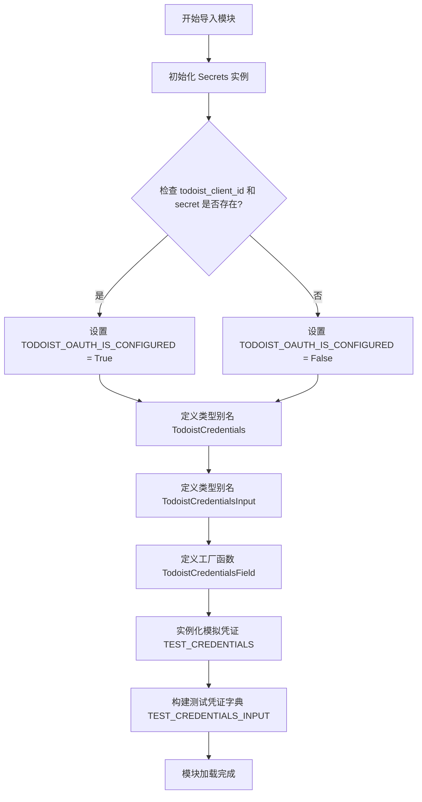

# `AutoGPT\autogpt_platform\backend\backend\blocks\todoist\_auth.py` 详细设计文档

该代码主要负责定义和配置Todoist集成的OAuth凭证相关的类型、常量和辅助函数。它初始化并检查Todoist的OAuth配置状态（通过检查密钥），定义了Todoist凭证及输入的类型别名，提供了一个用于生成Todoist凭证输入字段的工厂函数 `TodoistCredentialsField`，并创建了用于测试的模拟凭证对象 `TEST_CREDENTIALS`。

## 整体流程



## 类结构

```
(文件中未定义新的类结构，仅包含类型别名和函数)
```

## 全局变量及字段


### `secrets`
    
全局 Secrets 类实例，用于访问应用程序配置和机密信息。

类型：`Secrets`
    


### `TODOIST_OAUTH_IS_CONFIGURED`
    
指示是否已成功配置 Todoist OAuth2 客户端 ID 和密钥的布尔标志。

类型：`bool`
    


### `TodoistCredentials`
    
代表 Todoist OAuth2 凭证结构的类型别名。

类型：`OAuth2Credentials`
    


### `TodoistCredentialsInput`
    
为 Todoist OAuth2 提供商定义的凭证输入模式的类型别名。

类型：`CredentialsMetaInput`
    


### `TEST_CREDENTIALS`
    
包含模拟数据的全局 OAuth2Credentials 实例，用于测试。

类型：`OAuth2Credentials`
    


### `TEST_CREDENTIALS_INPUT`
    
从测试凭证对象派生的字典，用于测试输入数据表示。

类型：`dict`
    


    

## 全局函数及方法


### `TodoistCredentialsField`

该函数用于创建一个配置好的 Todoist 凭证输入字段，它会将 Todoist 默认的 OAuth2 作用域与传入的自定义作用域合并，并设置相应的认证描述。

参数：

-  `scopes`：`list[str]`，块正常运行所需的额外授权范围列表。

返回值：`TodoistCredentialsInput`，一个配置了 Todoist OAuth2 认证元数据的凭证输入对象。

#### 流程图

```mermaid
flowchart TD
    Start([开始]) --> InputScope[接收参数 scopes: list[str]]
    InputScope --> GetDefaults[获取 TodoistOAuthHandler.DEFAULT_SCOPES]
    GetDefaults --> MergeScopes[合并默认作用域与自定义作用域]
    MergeScopes --> CallFunc[调用 CredentialsField]
    CallFunc --> SetParams[设置 required_scopes 与 description]
    SetParams --> Return([返回 TodoistCredentialsInput])
```

#### 带注释源码

```python
def TodoistCredentialsField(scopes: list[str]) -> TodoistCredentialsInput:
    """
    Creates a Todoist credentials input on a block.

    Params:
        scopes: The authorization scopes needed for the block to work.
    """
    return CredentialsField(
        # 将 Todoist OAuth 处理器的默认作用域与传入的参数作用域合并，
        # 并转换为集合形式，作为该字段必需的权限范围。
        required_scopes=set(TodoistOAuthHandler.DEFAULT_SCOPES + scopes),
        # 设置该字段的描述信息，提示用户该集成需要 OAuth2 认证。
        description="The Todoist integration requires OAuth2 authentication.",
    )
```


## 关键组件


### TodoistCredentialsField

用于生成带有作用域验证的 Todoist OAuth2 凭证输入字段的工厂函数。

### TODOIST_OAUTH_IS_CONFIGURED

用于检查 Todoist 客户端 ID 和密钥是否已正确配置的全局布尔标志。

### TodoistCredentials

定义 Todoist 提供商凭证数据结构的类型别名。

### TEST_CREDENTIALS

用于开发和测试目的的模拟 Todoist OAuth2 凭证对象。


## 问题及建议


### 已知问题

-   **测试数据与生产代码耦合**：代码文件中直接定义了硬编码的测试凭证（`TEST_CREDENTIALS` 和 `TEST_CREDENTIALS_INPUT`）。这种做法污染了生产代码的命名空间，增加了不必要的内存占用，且存在误用测试数据进入生产环境的风险。
-   **模块级副作用**：在模块加载时立即实例化全局 `Secrets` 对象并计算配置状态（`secrets = Secrets()`），这种带有副作用的初始化方式降低了代码的可测试性，使得单元测试难以隔离环境配置，同时也限制了运行时动态更新配置的灵活性。

### 优化建议

-   **隔离测试数据**：将 `TEST_CREDENTIALS` 和 `TEST_CREDENTIALS_INPUT` 移动到专门的测试目录（如 `tests/integrations/oauth/todoist/test_fixtures.py`）或测试工具模块中，确保生产代码的纯净性。
-   **惰性加载配置**：移除全局的 `secrets` 实例，改为在函数内部或通过依赖注入的方式获取配置信息。例如，将配置检查逻辑封装到一个独立的配置服务类中，按需读取环境变量。
-   **消除魔法字符串**：在 `TodoistCredentialsInput` 类型定义中使用了字符串字面量 `Literal["oauth2"]`，建议从共享的常量模块或枚举中引用该值，以避免因拼写错误导致的问题，并便于统一维护认证类型。


## 其它


### 设计目标与约束

**设计目标：**
1.  **类型安全与标准化**：通过定义 `TodoistCredentials` 和 `TodoistCredentialsInput` 类型别名，确保在整个系统中对 Todoist 凭证的处理具有一致性，并利用 Python 类型提示和 Pydantic 模型提供编译期和运行时的类型检查。
2.  **配置集中化**：通过 `secrets` 对象和 `TODOIST_OAUTH_IS_CONFIGURED` 标志，集中管理 OAuth2 的配置状态，使得系统能够根据环境变量的存在与否动态判断集成是否可用。
3.  **便捷的凭证字段生成**：提供 `TodoistCredentialsField` 工厂函数，简化了在不同 Block 中定义凭证输入字段的过程，自动合并默认作用域（Scopes）与自定义作用域。
4.  **可测试性支持**：通过定义 `TEST_CREDENTIALS` 和 `TEST_CREDENTIALS_INPUT`，为开发者和测试框架提供标准的模拟凭证对象，便于进行单元测试和集成测试，而无需依赖真实的 Todoist OAuth2 流程。

**约束：**
1.  **Pydantic 模型依赖**：所有凭证结构必须严格遵循 `backend.data.model` 中定义的 `OAuth2Credentials` 和 `CredentialsMetaInput` 的结构。
2.  **环境依赖**：该集成模块的功能依赖于运行时环境中存在 `todoist_client_id` 和 `todoist_client_secret`。如果缺少这些环境变量，`TODOIST_OAUTH_IS_CONFIGURED` 将为 `False`，且相关的凭证功能应当被视为不可用。
3.  **作用域合并策略**：`TodoistCredentialsField` 强制合并 `TodoistOAuthHandler.DEFAULT_SCOPES`，这意味着特定的 Block 无法移除系统默认要求的基础权限，只能增加额外权限。

### 错误处理与异常设计

1.  **Pydantic 验证异常**：
    *   `TEST_CREDENTIALS` 在初始化时，Pydantic 会自动验证其字段。如果 `access_token` 不是字符串、`id` 不是有效的 UUID 格式或 `scopes` 列表包含无效值，程序启动时将抛出 `pydantic.ValidationError`。
2.  **配置缺失处理**：
    *   在计算 `TODOIST_OAUTH_IS_CONFIGURED` 时，代码采用了“静默降级”策略。如果 `secrets.todoist_client_id` 或 `secrets.client_secret` 为空，不会抛出异常，而是将布尔值设为 `False`。依赖此标志的代码应检查该值以决定是否启用相关功能。
3.  **凭证字段生成异常**：
    *   `TodoistCredentialsField` 函数本身不包含显式的 `try-except` 块。但如果传入的 `scopes` 参数不是字符串列表，或者 `CredentialsField` 内部逻辑失败，将抛出 Python 原生的 `TypeError` 或 Pydantic 相关的异常。
4.  **数据一致性契约**：
    *   `TEST_CREDENTIALS_INPUT` 必须与 `TEST_CREDENTIALS` 的序列化格式保持严格一致。如果 `TEST_CREDENTIALS` 的结构发生变更（例如新增必填字段），而 `TEST_CREDENTIALS_INPUT` 未同步更新，使用该常量的测试代码将面临序列化/反序列化失败的风险。

### 数据流与状态机

**数据流：**

1.  **初始化阶段**：
    *   流程：`Settings` 加载 -> `Secrets` 实例化 -> 检查环境变量 (`todoist_client_id`, `todoist_client_secret`) -> 计算 `TODOIST_OAUTH_IS_CONFIGURED` 布尔值。
    *   说明：这是模块加载时的静态数据流，决定了当前实例是否支持 Todoist 集成。
2.  **Block 定义阶段**：
    *   流程：开发者代码 -> 调用 `TodoistCredentialsField(scopes)` -> 合并 `DEFAULT_SCOPES` -> 调用 `CredentialsField` -> 返回 `TodoistCredentialsInput` 结构。
    *   说明：此阶段不涉及运行时用户数据，而是定义了 Block 的元数据结构，规定了后续用户输入必须遵循的格式。
3.  **测试/运行时阶段**：
    *   流程：使用 `TEST_CREDENTIALS` -> 注入到执行逻辑 -> 模拟 API 调用。
    *   说明：数据从静态定义的测试常量流向业务逻辑。

**状态机：**
该模块属于配置和辅助工具模块，本身不维护复杂的内部状态机。其核心状态体现在：
*   **配置就绪**：`TODOIST_OAUTH_IS_CONFIGURED = True`。此时系统具备处理真实 OAuth2 回调和凭证验证的能力。
*   **配置未就绪**：`TODOIST_OAUTH_IS_CONFIGURED = False`。此时系统应禁用相关的 Todoist 功能，防止因缺失密钥而导致的运行时错误。

### 外部依赖与接口契约

**外部依赖：**

1.  **`backend.util.settings.Secrets`**：
    *   **描述**：用于从系统环境变量或配置文件中加载敏感信息。
    *   **契约**：必须包含 `todoist_client_id` 和 `todoist_client_secret` 属性，且属性值应为非空字符串以激活集成。
2.  **`backend.data.model`**：
    *   **`OAuth2Credentials`**：定义了完整的 OAuth2 凭证数据结构，包含 `access_token`, `refresh_token`, `expires_at` 等字段。
    *   **`CredentialsField`**：工厂函数或类，用于生成 Pydantic 字段定义，负责处理凭证的验证逻辑。
    *   **`CredentialsMetaInput`**：泛型基础类，用于定义凭证的输入元数据（Provider, ID 等）。
    *   **`ProviderName`**：枚举类型，必须包含 `TODOIST` 成员。
3.  **`backend.integrations.oauth.todoist.TodoistOAuthHandler`**：
    *   **描述**：处理具体的 Todoist OAuth2 逻辑。
    *   **契约**：必须包含类属性 `DEFAULT_SCOPES`，该属性应为一个字符串列表，定义了集成所需的最小权限集合。

**接口契约：**

*   **`TodoistCredentialsField(scopes: list[str])`**：
    *   输入：字符串列表，表示请求的额外权限作用域。
    *   输出：符合 `CredentialsMetaInput` 约束的 Pydantic 字段对象。
    *   契约保证：生成的字段将强制要求用户提供的凭证包含 `DEFAULT_SCOPES` + `scopes` 的所有权限。
*   **`TEST_CREDENTIALS`**：
    *   类型：`OAuth2Credentials` 的实例。
    *   契约保证：该对象的属性结构必须与生产环境从 Todoist API 获取的真实凭证结构完全一致，以保证测试的有效性。

### 测试策略

1.  **Mock 数据隔离**：
    *   利用 `TEST_CREDENTIALS` 和 `TEST_CREDENTIALS_INPUT` 作为标准的 Mock 数据源，确保测试环境与生产环境的数据源解耦。测试用例应直接引用这些常量，避免在测试代码中硬编码凭证信息。
2.  **配置开关测试**：
    *   针对 `TODOIST_OAUTH_IS_CONFIGURED`，应编写测试用例模拟环境变量缺失（`secrets` 为空）和环境变量存在两种场景，验证模块在不同配置状态下的行为是否符合预期（例如，在配置缺失时是否阻止了功能初始化）。
3.  **Scope 验证测试**：
    *   针对 `TodoistCredentialsField` 函数，应测试传入自定义 scopes 时，返回的字段是否正确合并了 `DEFAULT_SCOPES`。可以通过检查生成的 `CredentialsField` 的 `required_scopes` 属性来验证。
4.  **类型安全测试**：
    *   利用 MyPy 或 Pyright 进行静态类型检查，确保 `TodoistCredentialsInput` 等类型别名的使用符合类型推导。同时，Pydantic 的 `parse_obj_as` 可用于在测试中验证 `TEST_CREDENTIALS_INPUT` 字典是否能正确反序列化为 `TodoistCredentials` 对象。

    