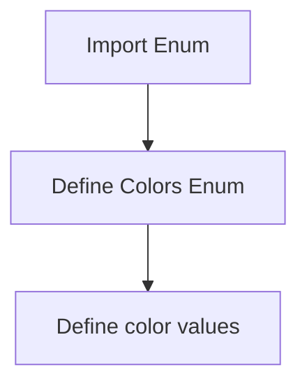

# `.\AutoGPT\autogpt_platform\backend\backend\blocks\todoist\_types.py` 详细设计文档

This code defines an Enum class named Colors, which contains a set of predefined color names and their corresponding string representations.

## 整体流程



## 类结构

```
Colors (Enum)
```

## 全局变量及字段


### `Colors.berry_red`
    
Represents the color 'berry_red'.

类型：`str`
    


### `Colors.red`
    
Represents the color 'red'.

类型：`str`
    


### `Colors.orange`
    
Represents the color 'orange'.

类型：`str`
    


### `Colors.yellow`
    
Represents the color 'yellow'.

类型：`str`
    


### `Colors.olive_green`
    
Represents the color 'olive_green'.

类型：`str`
    


### `Colors.lime_green`
    
Represents the color 'lime_green'.

类型：`str`
    


### `Colors.green`
    
Represents the color 'green'.

类型：`str`
    


### `Colors.mint_green`
    
Represents the color 'mint_green'.

类型：`str`
    


### `Colors.teal`
    
Represents the color 'teal'.

类型：`str`
    


### `Colors.sky_blue`
    
Represents the color 'sky_blue'.

类型：`str`
    


### `Colors.light_blue`
    
Represents the color 'light_blue'.

类型：`str`
    


### `Colors.blue`
    
Represents the color 'blue'.

类型：`str`
    


### `Colors.grape`
    
Represents the color 'grape'.

类型：`str`
    


### `Colors.violet`
    
Represents the color 'violet'.

类型：`str`
    


### `Colors.lavender`
    
Represents the color 'lavender'.

类型：`str`
    


### `Colors.magenta`
    
Represents the color 'magenta'.

类型：`str`
    


### `Colors.salmon`
    
Represents the color 'salmon'.

类型：`str`
    


### `Colors.charcoal`
    
Represents the color 'charcoal'.

类型：`str`
    


### `Colors.grey`
    
Represents the color 'grey'.

类型：`str`
    


### `Colors.taupe`
    
Represents the color 'taupe'.

类型：`str`
    
    

## 全局函数及方法


## 关键组件


### Colors Enum

A collection of predefined color names represented as an Enum for easy access and usage.


## 问题及建议


### 已知问题

-   **冗余的枚举值**: 枚举中包含了大量的颜色名称，这些名称与颜色值直接关联，但未提供颜色值，导致冗余。
-   **缺乏颜色值**: 枚举仅包含颜色名称，没有对应的颜色值，这限制了其在某些需要颜色值的应用场景中的使用。

### 优化建议

-   **添加颜色值**: 为每个枚举值添加对应的颜色值，例如RGB或十六进制代码，以便在需要颜色值的应用中使用。
-   **使用颜色代码**: 如果颜色名称已经足够描述颜色，可以考虑使用颜色代码代替颜色名称，减少冗余。
-   **考虑使用颜色库**: 如果应用需要频繁处理颜色，可以考虑使用现有的颜色库，如`colorama`或`termcolor`，这些库提供了丰富的颜色处理功能。
-   **模块化设计**: 如果颜色枚举在其他模块中频繁使用，可以考虑将其设计为一个独立的模块，以便于维护和重用。
-   **文档化**: 为枚举类添加详细的文档说明，包括每个颜色名称和颜色值的含义，以便其他开发者理解和使用。


## 其它


### 设计目标与约束

- 设计目标：定义一组颜色常量，以便在代码中方便地引用颜色名称而不是颜色值。
- 约束：颜色枚举值必须是唯一的，且不包含任何非颜色相关的数据。

### 错误处理与异常设计

- 错误处理：由于该代码段仅定义了一个枚举类，不涉及复杂逻辑，因此错误处理需求较低。
- 异常设计：无异常设计，因为枚举类本身不会抛出异常。

### 数据流与状态机

- 数据流：无数据流，枚举类仅用于存储颜色名称。
- 状态机：无状态机，枚举类不涉及状态转换。

### 外部依赖与接口契约

- 外部依赖：无外部依赖，代码独立运行。
- 接口契约：无接口契约，枚举类不提供外部接口。

### 测试与验证

- 测试策略：应编写单元测试以验证枚举值是否正确。
- 验证方法：通过断言检查每个枚举值是否与预期颜色名称匹配。

### 性能考量

- 性能考量：由于枚举类仅包含静态数据，对性能影响极小。

### 安全考量

- 安全考量：无安全风险，枚举类不涉及敏感数据。

### 维护与扩展性

- 维护：代码简单，易于维护。
- 扩展性：如果需要添加更多颜色，只需在枚举类中添加新的枚举值即可。

### 代码风格与规范

- 代码风格：遵循PEP 8编码规范。
- 规范：无特殊规范要求。


    