# `AutoGPT\autogpt_platform\backend\backend\blocks\todoist\comments.py` 详细设计文档

该 Python 文件定义了一组继承自 Block 的类，用于封装与 Todoist API 交互的逻辑，具体实现了对 Todoist 任务或项目评论的创建、查询（单个及列表）、更新和删除功能。

## 整体流程

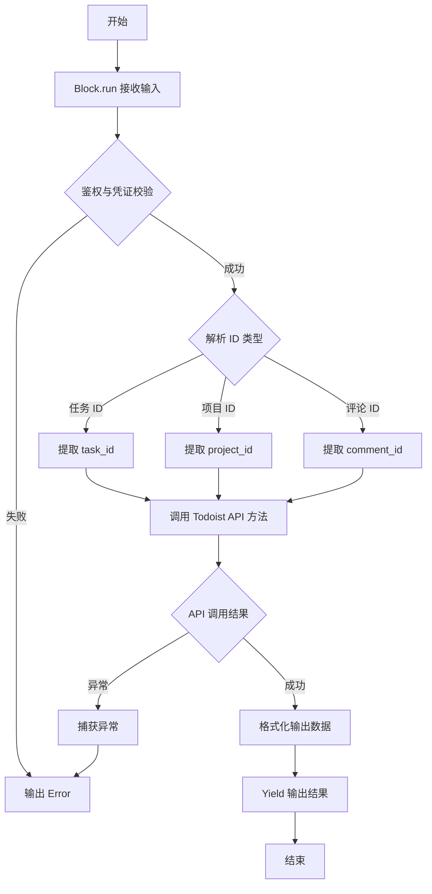

## 类结构

```
BaseModel (Pydantic)
├── TaskId
└── ProjectId

Block (backend.data.block)
├── TodoistCreateCommentBlock
│   ├── Input
│   └── Output
├── TodoistGetCommentsBlock
│   ├── Input
│   └── Output
├── TodoistGetCommentBlock
│   ├── Input
│   └── Output
├── TodoistUpdateCommentBlock
│   ├── Input
│   └── Output
└── TodoistDeleteCommentBlock
    ├── Input
    └── Output
```

## 全局变量及字段


### `TaskId.discriminator`
    
Discriminator field identifying the type as a task

类型：`Literal["task"]`
    


### `TaskId.task_id`
    
The unique identifier of the task

类型：`str`
    


### `ProjectId.discriminator`
    
Discriminator field identifying the type as a project

类型：`Literal["project"]`
    


### `ProjectId.project_id`
    
The unique identifier of the project

类型：`str`
    


### `TodoistCreateCommentBlock.Input.credentials`
    
Credentials for authenticating with the Todoist API

类型：`TodoistCredentialsInput`
    


### `TodoistCreateCommentBlock.Input.content`
    
The text content of the comment to create

类型：`str`
    


### `TodoistCreateCommentBlock.Input.id_type`
    
Specification of whether to comment on a task_id or project_id

类型：`Union[TaskId, ProjectId]`
    


### `TodoistCreateCommentBlock.Input.attachment`
    
Optional file attachment metadata for the comment

类型：`Optional[dict]`
    


### `TodoistCreateCommentBlock.Output.id`
    
The unique identifier of the created comment

类型：`str`
    


### `TodoistCreateCommentBlock.Output.content`
    
The content of the created comment

类型：`str`
    


### `TodoistCreateCommentBlock.Output.posted_at`
    
Timestamp indicating when the comment was posted

类型：`str`
    


### `TodoistCreateCommentBlock.Output.task_id`
    
The associated task ID if the comment is on a task

类型：`Optional[str]`
    


### `TodoistCreateCommentBlock.Output.project_id`
    
The associated project ID if the comment is on a project

类型：`Optional[str]`
    


### `TodoistGetCommentsBlock.Input.credentials`
    
Credentials for authenticating with the Todoist API

类型：`TodoistCredentialsInput`
    


### `TodoistGetCommentsBlock.Input.id_type`
    
Specification of whether to get comments for a task_id or project_id

类型：`Union[TaskId, ProjectId]`
    


### `TodoistGetCommentsBlock.Output.comments`
    
List of comments retrieved for the specified task or project

类型：`list`
    


### `TodoistGetCommentBlock.Input.credentials`
    
Credentials for authenticating with the Todoist API

类型：`TodoistCredentialsInput`
    


### `TodoistGetCommentBlock.Input.comment_id`
    
The unique identifier of the comment to retrieve

类型：`str`
    


### `TodoistGetCommentBlock.Output.content`
    
The text content of the retrieved comment

类型：`str`
    


### `TodoistGetCommentBlock.Output.id`
    
The unique identifier of the retrieved comment

类型：`str`
    


### `TodoistGetCommentBlock.Output.posted_at`
    
Timestamp indicating when the comment was posted

类型：`str`
    


### `TodoistGetCommentBlock.Output.project_id`
    
The associated project ID if the comment is on a project

类型：`Optional[str]`
    


### `TodoistGetCommentBlock.Output.task_id`
    
The associated task ID if the comment is on a task

类型：`Optional[str]`
    


### `TodoistGetCommentBlock.Output.attachment`
    
File attachment metadata if present

类型：`Optional[dict]`
    


### `TodoistUpdateCommentBlock.Input.credentials`
    
Credentials for authenticating with the Todoist API

类型：`TodoistCredentialsInput`
    


### `TodoistUpdateCommentBlock.Input.comment_id`
    
The unique identifier of the comment to update

类型：`str`
    


### `TodoistUpdateCommentBlock.Input.content`
    
The new content for the comment

类型：`str`
    


### `TodoistUpdateCommentBlock.Output.success`
    
Flag indicating whether the update operation was successful

类型：`bool`
    


### `TodoistDeleteCommentBlock.Input.credentials`
    
Credentials for authenticating with the Todoist API

类型：`TodoistCredentialsInput`
    


### `TodoistDeleteCommentBlock.Input.comment_id`
    
The unique identifier of the comment to delete

类型：`str`
    


### `TodoistDeleteCommentBlock.Output.success`
    
Flag indicating whether the deletion operation was successful

类型：`bool`
    
    

## 全局函数及方法


### `TodoistCreateCommentBlock.__init__`

初始化 TodoistCreateCommentBlock 实例，配置其唯一标识符、描述、输入输出模式、分类以及用于测试的模拟数据和凭据。

参数：

-  `无`

返回值：`None`，Python 构造函数默认返回 None

#### 流程图

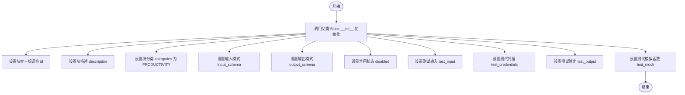

#### 带注释源码

```python
def __init__(self):
    # 调用父类 Block 的初始化方法，传递配置参数
    super().__init__(
        # 块的唯一标识符
        id="1bba7e54-2310-4a31-8e6f-54d5f9ab7459",
        # 块的功能描述
        description="Creates a new comment on a Todoist task or project",
        # 块所属的分类，此处设为生产力工具
        categories={BlockCategory.PRODUCTIVITY},
        # 定义块的输入数据结构模式
        input_schema=TodoistCreateCommentBlock.Input,
        # 定义块的输出数据结构模式
        output_schema=TodoistCreateCommentBlock.Output,
        # 根据 OAuth 配置状态决定是否禁用该块
        disabled=not TODOIST_OAUTH_IS_CONFIGURED,
        # 定义测试用例的输入数据，包含凭据、内容、ID类型等
        test_input={
            "credentials": TEST_CREDENTIALS_INPUT,
            "content": "Test comment",
            "id_type": {"discriminator": "task", "task_id": "2995104339"},
        },
        # 定义测试用例的凭据
        test_credentials=TEST_CREDENTIALS,
        # 定义测试用例的期望输出数据
        test_output=[
            ("id", "2992679862"),
            ("content", "Test comment"),
            ("posted_at", "2016-09-22T07:00:00.000000Z"),
            ("task_id", "2995104339"),
            ("project_id", None),
        ],
        # 定义模拟函数，用于测试时模拟 API 调用行为，避免真实请求
        test_mock={
            "create_comment": lambda content, credentials, task_id=None, project_id=None, attachment=None: {
                "id": "2992679862",
                "content": "Test comment",
                "posted_at", "2016-09-22T07:00:00.000000Z",
                "task_id": "2995104339",
                "project_id": None,
            }
        },
    )
```


### `TodoistCreateCommentBlock.create_comment`

通过调用 Todoist API 在指定任务或项目上创建新评论，并返回创建的评论详情。

参数：

- `credentials`：`TodoistCredentials`，包含访问 Todoist API 所需的认证令牌的凭据对象
- `content`：`str`，评论的文本内容
- `task_id`：`Optional[str]`，要添加评论的任务 ID（可选，与 project_id 二选一）
- `project_id`：`Optional[str]`，要添加评论的项目 ID（可选，与 task_id 二选一）
- `attachment`：`Optional[dict]`，可选的文件附件信息（可选）

返回值：`dict`，包含创建成功的评论对象属性的字典（如 id, content, posted_at 等）

#### 流程图

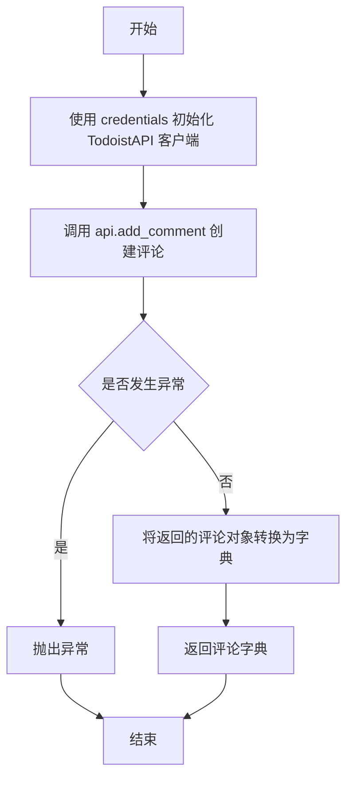

#### 带注释源码

```python
    @staticmethod
    def create_comment(
        credentials: TodoistCredentials,
        content: str,
        task_id: Optional[str] = None,
        project_id: Optional[str] = None,
        attachment: Optional[dict] = None,
    ):
        try:
            # 使用凭据中的访问令牌实例化 Todoist API 客户端
            api = TodoistAPI(credentials.access_token.get_secret_value())
            
            # 调用 API 的 add_comment 方法发送请求
            comment = api.add_comment(
                content=content,
                task_id=task_id,
                project_id=project_id,
                attachment=attachment,
            )
            
            # 将返回的 Comment 对象转换为字典格式以便返回
            return comment.__dict__

        except Exception as e:
            # 捕获并重新抛出在 API 调用过程中发生的任何异常
            raise e
```


### `TodoistCreateCommentBlock.run`

该方法负责执行在 Todoist 任务或项目上创建新评论的核心逻辑。它根据输入的 ID 类型（任务或项目）进行路由，调用 Todoist API 创建评论，并将返回的结构化数据逐个字段输出。

参数：

-  `input_data`：`TodoistCreateCommentBlock.Input`，包含认证信息、评论内容、目标对象ID（任务或项目）以及可选附件的输入数据对象。
-  `credentials`：`TodoistCredentials`，用于访问 Todoist API 的凭据对象。
-  `**kwargs`：`Any`，其他可选的关键字参数。

返回值：`BlockOutput`，一个异步生成器，用于按顺序产生评论的 ID、内容、时间戳或错误信息。

#### 流程图

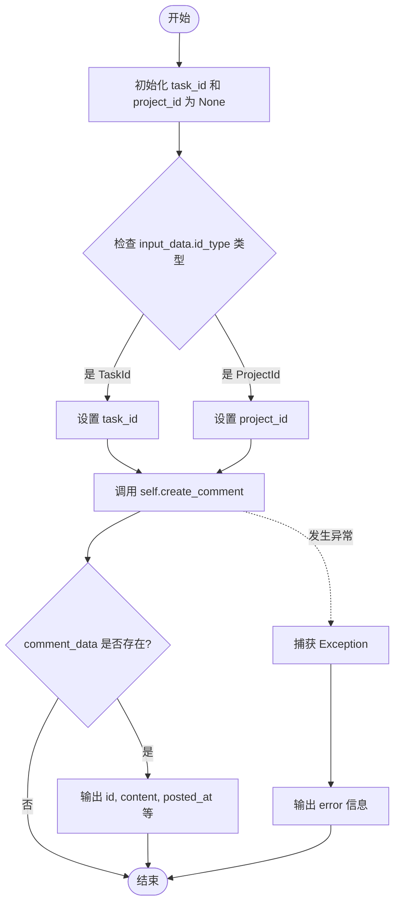

#### 带注释源码

```python
    async def run(
        self,
        input_data: Input,
        *,
        credentials: TodoistCredentials,
        **kwargs,
    ) -> BlockOutput:
        try:
            # 初始化目标 ID 变量
            task_id = None
            project_id = None

            # 根据 id_type 的具体类型（TaskId 或 ProjectId）提取对应的 ID
            if isinstance(input_data.id_type, TaskId):
                task_id = input_data.id_type.task_id
            else:
                project_id = input_data.id_type.project_id

            # 调用内部静态方法执行实际的 API 请求
            comment_data = self.create_comment(
                credentials,
                input_data.content,
                task_id=task_id,
                project_id=project_id,
                attachment=input_data.attachment,
            )

            # 如果成功获取到数据，按顺序逐个字段输出结果
            if comment_data:
                yield "id", comment_data["id"]
                yield "content", comment_data["content"]
                yield "posted_at", comment_data["posted_at"]
                yield "task_id", comment_data["task_id"]
                yield "project_id", comment_data["project_id"]

        except Exception as e:
            # 捕获任何异常并输出错误信息
            yield "error", str(e)
```


### `TodoistGetCommentsBlock.__init__`

该方法是 `TodoistGetCommentsBlock` 类的构造函数，负责初始化 Block 实例，设置其唯一标识、描述、类别、输入输出模式、测试数据及 Mock 配置等元数据。

参数：

-  `self`：`TodoistGetCommentsBlock`，表示类实例本身。

返回值：`None`，构造函数不返回任何值。

#### 流程图

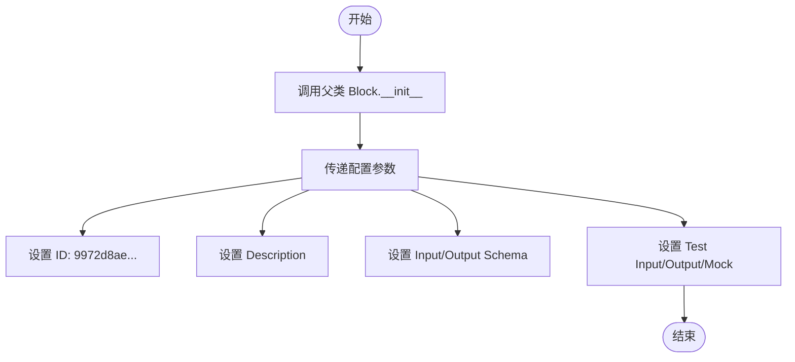

#### 带注释源码

```python
def __init__(self):
    # 调用父类 Block 的构造函数以初始化基础配置
    super().__init__(
        id="9972d8ae-ddf2-11ef-a9b8-32d3674e8b7e", # 块的唯一标识符
        description="Get all comments for a Todoist task or project", # 块的功能描述
        categories={BlockCategory.PRODUCTIVITY}, # 块所属的分类
        input_schema=TodoistGetCommentsBlock.Input, # 定义输入数据的 Schema
        output_schema=TodoistGetCommentsBlock.Output, # 定义输出数据的 Schema
        disabled=not TODOIST_OAUTH_IS_CONFIGURED, # 如果未配置 OAuth，则禁用该块
        test_input={ # 定义用于测试的输入数据
            "credentials": TEST_CREDENTIALS_INPUT,
            "id_type": {"discriminator": "task", "task_id": "2995104339"},
        },
        test_credentials=TEST_CREDENTIALS, # 定义测试用的凭证
        test_output=[ # 定义预期的测试输出结果
            (
                "comments",
                [
                    {
                        "id": "2992679862",
                        "content": "Test comment",
                        "posted_at": "2016-09-22T07:00:00.000000Z",
                        "task_id": "2995104339",
                        "project_id": None,
                        "attachment": None,
                    }
                ],
            )
        ],
        test_mock={ # 定义 Mock 函数，用于测试时替代真实的 API 调用
            "get_comments": lambda credentials, task_id=None, project_id=None: [
                {
                    "id": "2992679862",
                    "content": "Test comment",
                    "posted_at": "2016-09-22T07:00:00.000000Z",
                    "task_id": "2995104339",
                    "project_id": None,
                    "attachment": None,
                }
            ]
        },
    )
```


### `TodoistGetCommentsBlock.get_comments`

根据提供的凭证，从 Todoist API 获取指定任务或项目的评论列表，并将返回的评论对象转换为字典列表格式。

参数：

-  `credentials`：`TodoistCredentials`，包含用于身份验证的访问令牌的凭证对象。
-  `task_id`：`Optional[str]`，要获取评论的任务 ID（与 project_id 互斥）。
-  `project_id`：`Optional[str]`，要获取评论的项目 ID（与 task_id 互斥）。

返回值：`list`，包含评论详情的字典列表。

#### 流程图

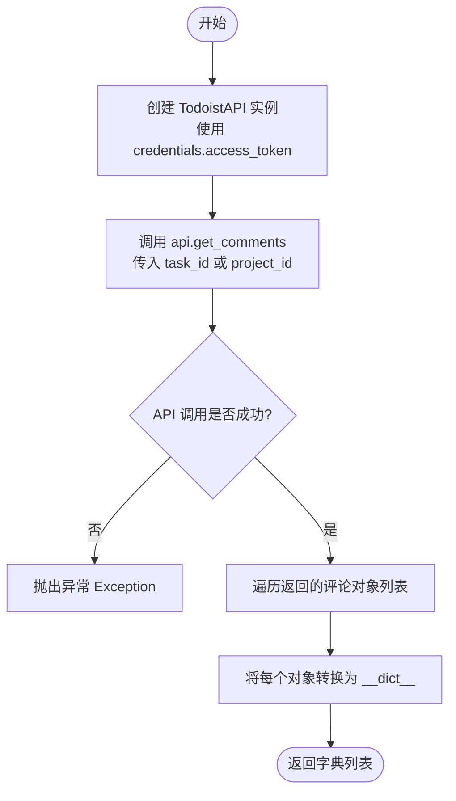

#### 带注释源码

```python
    @staticmethod
    def get_comments(
        credentials: TodoistCredentials,
        task_id: Optional[str] = None,
        project_id: Optional[str] = None,
    ):
        try:
            # 使用凭证中的访问令牌初始化 TodoistAPI 客户端
            api = TodoistAPI(credentials.access_token.get_secret_value())
            
            # 调用 API 获取评论，根据提供的 task_id 或 project_id 进行筛选
            comments = api.get_comments(task_id=task_id, project_id=project_id)
            
            # 将返回的评论对象列表转换为字典列表以便于序列化和处理
            return [comment.__dict__ for comment in comments]

        except Exception as e:
            # 捕获并重新抛出异常，由上层逻辑处理错误
            raise e
```


### `TodoistGetCommentsBlock.run`

该方法是 `TodoistGetCommentsBlock` 的核心执行逻辑，负责解析输入数据以确定目标对象（任务或项目），通过调用 Todoist API 获取相应的评论列表，并通过生成器返回结果或错误信息。

参数：

-  `input_data`：`TodoistGetCommentsBlock.Input`，包含认证凭据和指定目标对象类型（任务ID或项目ID）的输入数据。
-  `credentials`：`TodoistCredentials`，用于访问 Todoist API 的认证凭证。
-  `**kwargs`：`dict`，其他扩展参数。

返回值：`BlockOutput`，一个异步生成器，产出包含评论列表的键值对（`"comments"`），或在发生错误时产出错误信息（`"error"`）。

#### 流程图

```mermaid
flowchart TD
    A([开始]) --> B[初始化 task_id 和 project_id 为 None]
    B --> C{判断 id_type 实例类型}
    
    C -->|TaskId| D[设置 task_id = input_data.id_type.task_id]
    C -->|ProjectId| E[设置 project_id = input_data.id_type.project_id]
    
    D --> F[调用 self.get_comments 获取评论]
    E --> F
    
    F --> G{是否成功?}
    G -->|是| H[产出 comments 和评论列表]
    G -->|否 (异常)| I[捕获异常 Exception]
    
    I --> J[产出 error 和错误信息]
    H --> K([结束])
    J --> K
```

#### 带注释源码

```python
    async def run(
        self,
        input_data: Input,  # 输入数据，遵循 TodoistGetCommentsBlock.Input 架构
        *,
        credentials: TodoistCredentials,  # Todoist API 认证凭据
        **kwargs,
    ) -> BlockOutput:  # 返回类型为异步生成器 BlockOutput
        try:
            # 初始化任务ID和项目ID为None
            task_id = None
            project_id = None

            # 根据 id_type 的具体类型（TaskId 或 ProjectId）提取相应的 ID
            if isinstance(input_data.id_type, TaskId):
                task_id = input_data.id_type.task_id
            else:
                project_id = input_data.id_type.project_id

            # 调用静态方法 self.get_comments 从 Todoist API 获取评论数据
            comments = self.get_comments(
                credentials, task_id=task_id, project_id=project_id
            )

            # 产出 "comments" 键和获取到的评论列表
            yield "comments", comments

        except Exception as e:
            # 如果发生任何异常，捕获并产出 "error" 键和异常信息
            yield "error", str(e)
```


### `TodoistGetCommentBlock.__init__`

该方法用于初始化 `TodoistGetCommentBlock` 类的实例，配置块的基本元数据（如ID、描述、分类）、输入输出Schema以及用于测试的模拟数据和凭证。

参数：

-   `id`：`str`，块的唯一标识符。
-   `description`：`str`，块功能的描述文本。
-   `categories`：`set[BlockCategory]`，块所属的分类集合。
-   `input_schema`：`type[TodoistGetCommentBlock.Input]`，定义输入数据结构的 Pydantic 模型类。
-   `output_schema`：`type[TodoistGetCommentBlock.Output]`，定义输出数据结构的 Pydantic 模型类。
-   `disabled`：`bool`，指示块是否被禁用（基于 OAuth 是否配置）。
-   `test_input`：`dict`，用于测试的输入数据样本。
-   `test_credentials`：`TodoistCredentials`，用于测试的凭证对象。
-   `test_output`：`list[tuple]`，用于测试的预期输出键值对列表。
-   `test_mock`：`dict`，包含模拟 API 调用逻辑的 Lambda 函数字典。

返回值：`None`，无返回值。

#### 流程图

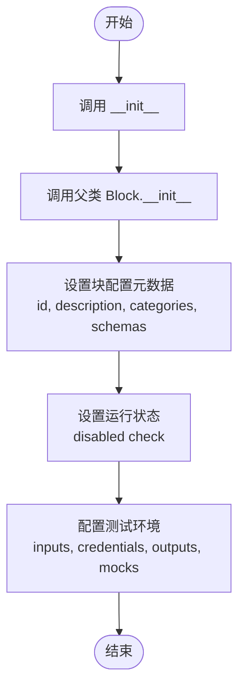

#### 带注释源码

```python
def __init__(self):
    # 调用父类 Block 的初始化方法，传递配置参数
    super().__init__(
        # 块的唯一标识符
        id="a809d264-ddf2-11ef-9764-32d3674e8b7e",
        # 块的简短描述
        description="Get a single comment from Todoist",
        # 块所属的分类（此处为生产力类别）
        categories={BlockCategory.PRODUCTIVITY},
        # 指定输入数据的 Schema 类
        input_schema=TodoistGetCommentBlock.Input,
        # 指定输出数据的 Schema 类
        output_schema=TodoistGetCommentBlock.Output,
        # 根据全局配置决定是否禁用该块（检查 OAuth 是否已配置）
        disabled=not TODOIST_OAUTH_IS_CONFIGURED,
        # 定义测试输入数据
        test_input={
            "credentials": TEST_CREDENTIALS_INPUT,
            "comment_id": "2992679862",
        },
        # 定义测试用的凭证
        test_credentials=TEST_CREDENTIALS,
        # 定义预期的测试输出结果
        test_output=[
            ("content", "Test comment"),
            ("id", "2992679862"),
            ("posted_at", "2016-09-22T07:00:00.000000Z"),
            ("project_id", None),
            ("task_id", "2995104339"),
            ("attachment", None),
        ],
        # 定义测试时的 Mock 函数，用于模拟真实的 API 调用行为
        # 这里模拟了 get_comment 方法，返回固定的字典数据
        test_mock={
            "get_comment": lambda credentials, comment_id: {
                "content": "Test comment",
                "id": "2992679862",
                "posted_at": "2016-09-22T07:00:00.000000Z",
                "project_id": None,
                "task_id": "2995104339",
                "attachment": None,
            }
        },
    )
```


### `TodoistGetCommentBlock.get_comment`

通过 Todoist API 获取指定 ID 的单个评论详情。

参数：

- `credentials`：`TodoistCredentials`，用于 Todoist API 认证的凭证对象，包含访问令牌。
- `comment_id`：`str`，需要检索的评论的唯一标识符。

返回值：`dict`，包含评论详细信息的字典（如 content, id, posted_at 等）。

#### 流程图

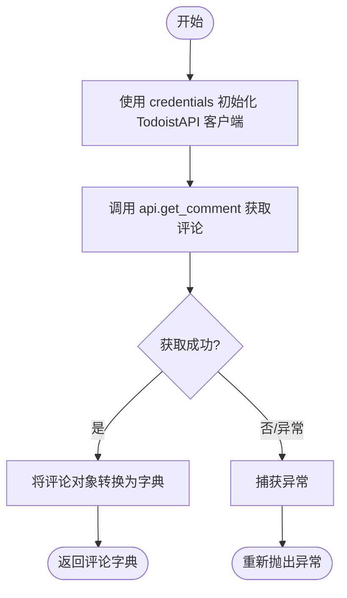

#### 带注释源码

```python
    @staticmethod
    def get_comment(credentials: TodoistCredentials, comment_id: str):
        try:
            # 使用凭证中的 access_token 初始化 TodoistAPI 实例
            api = TodoistAPI(credentials.access_token.get_secret_value())
            # 调用 Todoist API 获取指定 comment_id 的评论对象
            comment = api.get_comment(comment_id=comment_id)
            # 将评论对象转换为字典格式并返回
            return comment.__dict__

        except Exception as e:
            # 捕获运行时异常并向上抛出
            raise e
```


### `TodoistGetCommentBlock.run`

该方法是 `TodoistGetCommentBlock` 的核心执行逻辑，负责通过调用 Todoist API 根据评论 ID 获取单个评论的详细信息，并将结果以生成器的形式输出。

参数：

-   `input_data`：`TodoistGetCommentBlock.Input`，包含执行该块所需的输入数据，具体包含认证凭据和评论ID。
-   `credentials`：`TodoistCredentials`，经过验证的 Todoist 认证凭证对象，用于 API 访问。
-   `**kwargs`：`dict`，扩展的关键字参数，用于接收额外的上下文信息。

返回值：`BlockOutput`，一个异步生成器，逐步产生评论的各个属性（如内容、ID、时间戳等）或错误信息。

#### 流程图

```mermaid
flowchart TD
    A([开始: run 方法]) --> B[调用 self.get_comment<br/>获取评论数据]
    B --> C{发生异常?}
    C -- 是 --> D[生成 ('error', 错误信息)]
    C -- 否 --> E{comment_data 是否存在?}
    E -- 否 --> F([结束])
    E -- 是 --> G[生成 ('content', 内容)]
    G --> H[生成 ('id', 评论ID)]
    H --> I[生成 ('posted_at', 时间戳)]
    I --> J[生成 ('project_id', 项目ID)]
    J --> K[生成 ('task_id', 任务ID)]
    K --> L[生成 ('attachment', 附件)]
    L --> F
    D --> F
```

#### 带注释源码

```python
async def run(
    self,
    input_data: Input,
    *,
    credentials: TodoistCredentials,
    **kwargs,
) -> BlockOutput:
    try:
        # 调用静态方法 get_comment，传入凭证和输入中的 comment_id 以获取评论数据
        comment_data = self.get_comment(
            credentials, comment_id=input_data.comment_id
        )

        # 如果成功获取到评论数据
        if comment_data:
            # 逐个字段输出评论的详细信息
            yield "content", comment_data["content"]
            yield "id", comment_data["id"]
            yield "posted_at", comment_data["posted_at"]
            yield "project_id", comment_data["project_id"]
            yield "task_id", comment_data["task_id"]
            yield "attachment", comment_data["attachment"]

    except Exception as e:
        # 捕获运行过程中的任何异常，并输出错误信息
        yield "error", str(e)
```


### `TodoistUpdateCommentBlock.__init__`

初始化函数，用于配置该Block的基本元数据，包括唯一ID、描述、分类、输入输出模型Schema、测试配置以及根据OAuth配置状态决定是否禁用该Block。

参数：

- `self`：`TodoistUpdateCommentBlock`，类实例本身

返回值：`None`，无返回值

#### 流程图

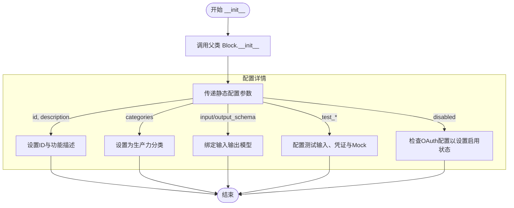

#### 带注释源码

```python
def __init__(self):
    # 调用父类 Block 的初始化方法，注册该 Block 的元数据和配置
    super().__init__(
        # 定义该 Block 的唯一标识符 (UUID)
        id="b773c520-ddf2-11ef-9f34-32d3674e8b7e",
        # 简短描述该 Block 的功能：更新 Todoist 评论
        description="Updates a Todoist comment",
        # 将该 Block 归类为生产力工具 (PRODUCTIVITY)
        categories={BlockCategory.PRODUCTIVITY},
        # 指定输入数据的 Schema 定义 (内部类 Input)
        input_schema=TodoistUpdateCommentBlock.Input,
        # 指定输出数据的 Schema 定义 (内部类 Output)
        output_schema=TodoistUpdateCommentBlock.Output,
        # 根据 Todoist OAuth 是否已配置来决定是否禁用该 Block
        disabled=not TODOIST_OAUTH_IS_CONFIGURED,
        # 定义用于测试的输入数据样本
        test_input={
            "credentials": TEST_CREDENTIALS_INPUT,
            "comment_id": "2992679862",
            "content": "Need one bottle of milk",
        },
        # 指定测试用的凭证对象
        test_credentials=TEST_CREDENTIALS,
        # 定义预期的测试输出结果
        test_output=[("success", True)],
        # 定义 Mock 函数，用于在测试环境中模拟 update_comment 方法的行为
        test_mock={"update_comment": lambda credentials, comment_id, content: True},
    )
```


### `TodoistUpdateCommentBlock.update_comment`

该方法是一个静态方法，负责通过 Todoist API 更新指定评论的内容。它使用提供的凭证初始化 API 客户端，执行更新操作，并根据操作结果返回布尔值。

参数：

-  `credentials`：`TodoistCredentials`，包含访问 Todoist API 所需的认证令牌的凭证对象。
-  `comment_id`：`str`，需要更新的目标评论的唯一标识符。
-  `content`：`str`，评论的新内容文本。

返回值：`bool`，如果评论更新成功则返回 True。

#### 流程图

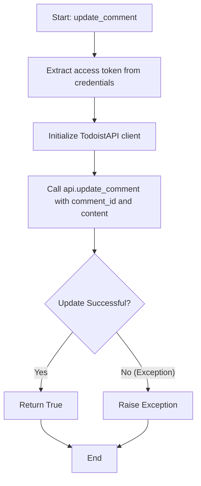

#### 带注释源码

```python
    @staticmethod
    def update_comment(credentials: TodoistCredentials, comment_id: str, content: str):
        try:
            # 从凭证对象中获取 access token 并实例化 Todoist API 客户端
            api = TodoistAPI(credentials.access_token.get_secret_value())
            # 调用 API 的 update_comment 方法，传入评论 ID 和新内容
            api.update_comment(comment_id=comment_id, content=content)
            # 如果没有抛出异常，返回 True 表示操作成功
            return True

        except Exception as e:
            # 捕获任何 API 调用过程中发生的异常并将其重新抛出，供上层处理
            raise e
```


### `TodoistUpdateCommentBlock.run`

执行 Todoist 评论的更新操作。该方法接收包含评论 ID 和新内容的输入数据，使用提供的凭证调用 Todoist API 更新指定评论，并输出操作结果或捕获到的错误信息。

参数：

-   `input_data`：`Input`，包含待更新评论的 ID（`comment_id`）和新内容（`content`）的输入数据对象。
-   `credentials`：`TodoistCredentials`，用于 Todoist API 身份验证的凭证对象。
-   `**kwargs`：`dict`，扩展关键字参数，用于接收未显式声明的额外输入。

返回值：`BlockOutput`（生成器），产生键值对形式的输出，成功时产生 `"success"` 状态，失败时产生 `"error"` 信息。

#### 流程图

```mermaid
flowchart TD
    Start([开始]) --> ExtractData[提取 input_data 中的 comment_id 和 content]
    ExtractData --> CallUpdate[调用 self.update_comment 更新评论]
    CallUpdate --> CheckSuccess{调用是否成功?}
    
    CheckSuccess -->|是| YieldSuccess[产生 success: True]
    CheckSuccess -->|否/异常| CatchException[捕获 Exception e]
    CatchException --> YieldError[产生 error: str(e)]
    
    YieldSuccess --> End([结束])
    YieldError --> End
```

#### 带注释源码

```python
    async def run(
        self,
        input_data: Input,
        *,
        credentials: TodoistCredentials,
        **kwargs,
    ) -> BlockOutput:
        try:
            # 调用内部静态方法 update_comment 执行实际的 API 请求
            # 传入凭证、评论ID和新的评论内容
            success = self.update_comment(
                credentials,
                comment_id=input_data.comment_id,
                content=input_data.content,
            )

            # 如果更新成功，产生 success 键和 True 值
            yield "success", success

        except Exception as e:
            # 如果发生异常，捕获异常并产生 error 键和错误消息字符串
            yield "error", str(e)
```


### `TodoistDeleteCommentBlock.__init__`

该方法用于初始化 `TodoistDeleteCommentBlock` 类的实例。它通过调用父类 `Block` 的构造函数，配置了块的元数据（如ID、描述、分类）、输入输出模式、测试用例以及模拟执行逻辑。此方法不执行实际的删除操作，而是负责注册块的配置信息。

参数：

-  `self`：`TodoistDeleteCommentBlock`，表示正在初始化的类实例本身。

返回值：`None`，构造函数不返回任何值。

#### 流程图

```mermaid
graph TD
    A[开始 __init__] --> B[调用 super().__init__]
    B --> C[设置 ID: bda4c020...]
    B --> D[设置描述和分类]
    B --> E[绑定输入输出 Schema]
    B --> F{检查 TODOIST_OAUTH_IS_CONFIGURED}
    F --> G[设置 disabled 状态]
    B --> H[配置测试输入与凭证]
    B --> I[配置测试输出与 Mock 函数]
    I --> J[结束 __init__]
```

#### 带注释源码

```python
    def __init__(self):
        super().__init__(
            # 块的唯一标识符 (UUID)
            id="bda4c020-ddf2-11ef-b114-32d3674e8b7e",
            # 块的功能描述
            description="Deletes a Todoist comment",
            # 块所属的分类，此处为生产力工具
            categories={BlockCategory.PRODUCTIVITY},
            # 定义输入数据的 Schema，包含凭证和 comment_id
            input_schema=TodoistDeleteCommentBlock.Input,
            # 定义输出数据的 Schema，包含 success 状态
            output_schema=TodoistDeleteCommentBlock.Output,
            # 如果 Todoist OAuth 未配置，则禁用该块
            disabled=not TODOIST_OAUTH_IS_CONFIGURED,
            # 定义用于测试的输入数据样本
            test_input={
                "credentials": TEST_CREDENTIALS_INPUT,
                "comment_id": "2992679862",
            },
            # 定义用于测试的凭证对象
            test_credentials=TEST_CREDENTIALS,
            # 定义预期的测试输出结果
            test_output=[("success", True)],
            # 定义测试时的模拟函数，避免实际调用 API
            test_mock={"delete_comment": lambda credentials, comment_id: True},
        )
```


### `TodoistDeleteCommentBlock.delete_comment`

该方法是一个静态方法，用于通过 Todoist API 删除指定 ID 的评论。它利用提供的凭据初始化 API 客户端，执行删除操作，并返回操作结果。

参数：

- `credentials`：`TodoistCredentials`，包含用于认证的访问令牌的凭据对象。
- `comment_id`：`str`，需要删除的评论的唯一标识符。

返回值：`Any`，删除操作的返回结果（通常为 `bool` 或 API 返回的空字典），表示操作是否成功。

#### 流程图

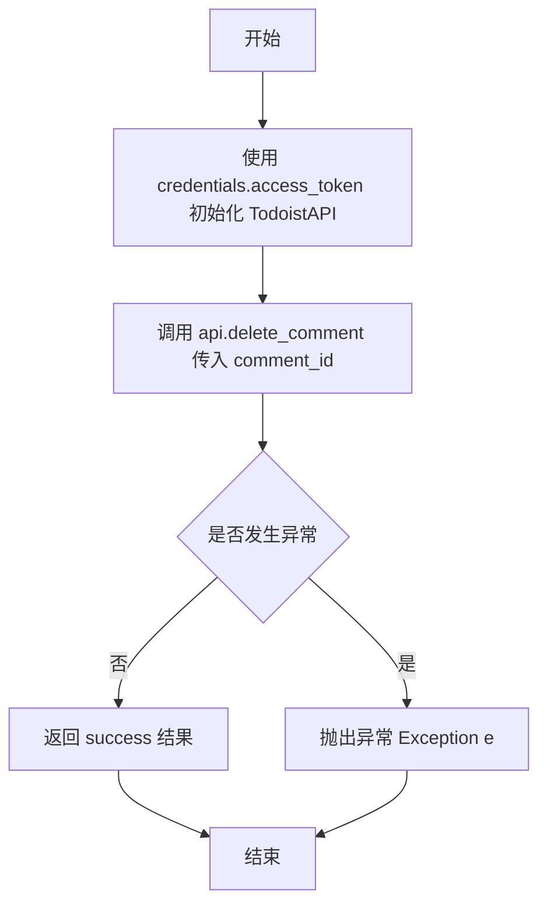

#### 带注释源码

```python
    @staticmethod
    def delete_comment(credentials: TodoistCredentials, comment_id: str):
        try:
            # 使用凭据中的访问令牌实例化 Todoist API 客户端
            api = TodoistAPI(credentials.access_token.get_secret_value())
            # 调用 API 的 delete_comment 方法执行删除操作
            success = api.delete_comment(comment_id=comment_id)
            # 返回操作结果
            return success

        except Exception as e:
            # 捕获任何执行过程中的异常并重新抛出
            raise e
```


### `TodoistDeleteCommentBlock.run`

执行删除 Todoist 评论的异步逻辑。它利用提供的凭证和评论 ID 删除指定评论，并返回操作结果或错误信息。

参数：

-   `input_data`：`TodoistDeleteCommentBlock.Input`，包含执行操作所需的输入数据，主要包括要删除的评论 ID。
-   `credentials`：`TodoistCredentials`，用于身份验证的 Todoist 凭证对象，包含 API 访问令牌。
-   `**kwargs`：`dict`，扩展的关键字参数，用于传递额外的上下文信息。

返回值：`BlockOutput`，一个异步生成器，生成包含操作结果的键值对。成功时生成 `("success", True)`，失败时生成 `("error", error_message)`。

#### 流程图

```mermaid
graph TD
    Start((开始)) --> ReceiveInput[接收 input_data 和 credentials]
    ReceiveInput --> TryBlock[进入 try 异常处理块]
    TryBlock --> CallDelete[调用 self.delete_comment]
    CallDelete --> CheckResult{操作成功?}
    CheckResult -- 是 --> YieldSuccess[生成 success, True]
    CheckResult -- 否/异常 --> CatchException[捕获 Exception e]
    CatchException --> YieldError[生成 error, str(e)]
    YieldSuccess --> End((结束))
    YieldError --> End
```

#### 带注释源码

```python
    async def run(
        self,
        input_data: Input,
        *,
        credentials: TodoistCredentials,
        **kwargs,
    ) -> BlockOutput:
        try:
            # 调用静态方法 delete_comment，传入凭证和从输入数据中获取的 comment_id
            success = self.delete_comment(credentials, comment_id=input_data.comment_id)

            # 如果 API 调用成功，生成 "success" 键和布尔结果
            yield "success", success

        except Exception as e:
            # 如果在删除过程中发生任何异常，生成 "error" 键和异常信息字符串
            yield "error", str(e)
```


## 关键组件


### TodoistCreateCommentBlock

A block component responsible for creating new comments on specified Todoist tasks or projects, handling credential authentication and optional file attachments.

### TodoistGetCommentsBlock

A block component designed to retrieve and return a list of all comments associated with a specific Todoist task or project ID.

### TodoistGetCommentBlock

A block component that fetches the details of a single specific comment from Todoist using its unique comment identifier.

### TodoistUpdateCommentBlock

A block component that enables the modification of existing Todoist comment content via the comment ID.

### TodoistDeleteCommentBlock

A block component that handles the permanent deletion of a specific Todoist comment using its ID.

### TaskId

A data model component used to define and validate task identifiers within the input schema, acting as a discriminator for task-related operations.

### ProjectId

A data model component used to define and validate project identifiers within the input schema, acting as a discriminator for project-related operations.


## 问题及建议


### 已知问题
- **异步阻塞**: `run` 方法是异步的，但调用的 `TodoistAPI` 方法（如 `add_comment`, `get_comments`）是同步阻塞的 HTTP 请求。这会阻塞事件循环，在高并发场景下会严重影响系统吞吐量和响应性能。
- **不安全的对象序列化**: 代码使用 `comment.__dict__` 将 API 返回的对象转换为字典。这种方式直接访问对象的内部属性，依赖于 `todoist_api_python` 库的具体实现细节。如果底层库升级或更改字段定义（例如使用了 Pydantic 的私有属性或别名），可能导致序列化错误或数据遗漏。
- **冗余的异常捕获**: 在静态方法（如 `create_comment`, `get_comments`）中使用了 `try...except Exception as e: raise e`。这种写法不仅没有提供额外的错误处理逻辑或上下文信息，还增加了不必要的代码复杂度。

### 优化建议
- **引入线程池执行同步调用**: 建议使用 `asyncio.to_thread` 或 `loop.run_in_executor` 将同步的 `TodoistAPI` 调用放入线程池中执行，避免阻塞主事件循环。
- **使用规范的序列化方法**: 将 `.__dict__` 替换为 `model_dump()` (Pydantic V2) 或 `.dict()` (Pydantic V1)，以确保序列化过程符合官方标准，正确处理数据转换和字段别名。
- **精简异常处理逻辑**: 移除静态方法中的 `try-except` 块，让异常自然传播到 `run` 方法进行统一捕获和处理；或者在静态方法中仅进行特定的业务异常转换，而不做简单的透传。
- **提取公共逻辑减少重复**: `TodoistCreateCommentBlock` 和 `TodoistGetCommentsBlock` 中存在相同的 ID 类型判别逻辑（判断是 `TaskId` 还是 `ProjectId`），建议将其提取为父类的辅助方法或独立函数，以提高代码的可维护性。
- **细化数据模型定义**: 对于 `attachment` 字段，目前类型为 `Optional[dict]`。建议定义具体的 Pydantic 模型来描述附件的合法结构，以便在输入阶段进行更严格的数据校验，防止运行时错误。


## 其它


### 设计目标与约束

**设计目标**：
1. **模块化封装**：将 Todoist API 中关于评论（Comment）的增删改查（CRUD）操作封装为独立的、可重用的代码块，便于在工作流中编排。
2. **类型安全与验证**：利用 Pydantic 模型对输入输出进行严格的类型定义和校验，确保传入的数据（如 Task ID 或 Project ID）符合 Todoist API 的要求，减少运行时错误。
3. **多态支持**：支持针对“任务”或“项目”两种不同类型的资源进行评论操作，通过判别式字段在运行时动态区分目标类型。
4. **统一异常处理**：对外部 API 调用可能产生的网络错误、认证错误或业务逻辑错误进行捕获，并将其转换为统一的 Block 输出格式，保证工作流的稳定性。

**设计约束**：
1. **环境依赖**：所有 Block 的启用状态依赖于 `TODOIST_OAUTH_IS_CONFIGURED` 环境变量，只有在 OAuth 配置完成时才可用。
2. **同步 API 封装**：尽管 `run` 方法是异步的，但底层的 `todoist_api_python` 调用是同步的，这在高并发场景下可能会阻塞事件循环（当前设计未在单独线程池中运行同步 I/O）。
3. **API 兼容性**：功能实现严格依赖于 `todoist_api_python` SDK 的版本特性，若上游 API 发生不兼容变更，可能导致功能失效。
4. **无状态执行**：每个 Block 的执行是无状态的，不保存上下文信息，依赖输入参数传递所有必要数据。

### 错误处理与异常设计

**处理策略**：
1. **分层捕获**：在静态方法（如 `create_comment`, `get_comments`）内部使用 `try-except` 块直接调用 `TodoistAPI`。若发生异常，直接抛出由上层处理。
2. **标准化输出**：在异步 `run` 方法中，再次使用 `try-except` 捕获静态方法抛出的异常。一旦捕获异常，不中断程序流程，而是通过生成器产生一个键为 `"error"` 的键值对，值为异常字符串信息。
3. **异常类型**：虽然代码中捕获了通用的 `Exception`，但实际可能包含的网络请求错误（如 ConnectionError）、认证失败（如 HTTP 401/403）、资源未找到（如 HTTP 404）或参数验证错误。

**设计考量**：
- 此设计允许工作流引擎根据输出中是否存在 `"error"` 字段来判断 Block 执行是否成功，从而决定是否执行后续步骤（例如终止流程或记录日志）。
- 缺点是将所有异常具体类型都吞没为字符串，使得上层代码难以根据错误类型进行精细化的重试或补偿逻辑。

### 数据流与状态机

**数据流**：
1. **输入验证**：外部调用者传入 `input_data` 和 `credentials`。Block 首先利用 Pydantic 模型对输入数据进行解析和验证（例如检查 `id_type` 是 Task 还是 Project）。
2. **参数解析**：`run` 方法根据 `discriminator` 字段判断输入的目标 ID 类型（`TaskId` 或 `ProjectId`），提取出具体的 `task_id` 或 `project_id`。
3. **API 交互**：将提取出的 ID 和凭证传递给静态辅助方法。辅助方法实例化 `TodoistAPI` 客户端，构造请求参数，发送 HTTP 请求至 Todoist 服务器。
4. **数据转换**：接收到 SDK 返回的对象（通常是 Pydantic 模型或对象实例）后，使用 `__dict__` 将其转换为标准的 Python 字典。
5. **输出生成**：遍历转换后的字典，通过 `yield` 机制逐个将字段名和值输出，供下游 Block 使用。

**状态机**：
- 本模块中的 Block 均为**无状态**组件，不存在复杂的状态机流转。
- 执行生命周期仅包含两个瞬态：**初始态**（等待输入） -> **执行态**（处理逻辑）。一旦执行完成或产生错误，即结束生命周期。
- 错误状态通过数据流中的 `"error"` 字段体现，而非组件内部状态的改变。

### 外部依赖与接口契约

**外部依赖**：
1. **`todoist_api_python.api.TodoistAPI`**：核心依赖，用于与 Todoist 云服务进行通信。
2. **`backend.data.block`**：基础框架依赖，提供了 `Block`, `BlockSchemaInput`, `BlockOutput` 等基类，定义了组件的基本行为。
3. **`backend.blocks.todoist._auth`**：认证模块依赖，提供了 `TodoistCredentials` 数据模型和相关的字段定义，确保凭证的安全存储和传递。
4. **`pydantic`**：数据验证库，用于定义输入输出的 Schema。

**接口契约**：
1. **`TodoistAPI` 契约**：
   - 需要有效的 Access Token 进行初始化。
   - `add_comment`: 接收 `content`, `task_id` (可选), `project_id` (可选), `attachment` (可选)，返回 Comment 对象。
   - `get_comments`: 接收 `task_id` (可选) 或 `project_id` (可选)，返回 Comment 对象列表。
   - `get_comment`: 接收 `comment_id`，返回单个 Comment 对象。
   - `update_comment`: 接收 `comment_id` 和 `content`，通常无返回值或返回状态码。
   - `delete_comment`: 接收 `comment_id`，返回布尔值表示成功与否。
2. **`Block` 基类契约**：
   - 子类必须实现 `run(self, input_data: Input, *, credentials: TodoistCredentials, **kwargs) -> BlockOutput` 方法。
   - `run` 方法必须是一个异步生成器。

    