# `AutoGPT\autogpt_platform\backend\backend\blocks\todoist\labels.py` 详细设计文档

该代码实现了一系列继承自 Block 的类，用于封装 Todoist API 中与标签相关的操作，包括个人标签的增删改查、列表获取，以及共享标签的获取、重命名和删除功能。

## 整体流程

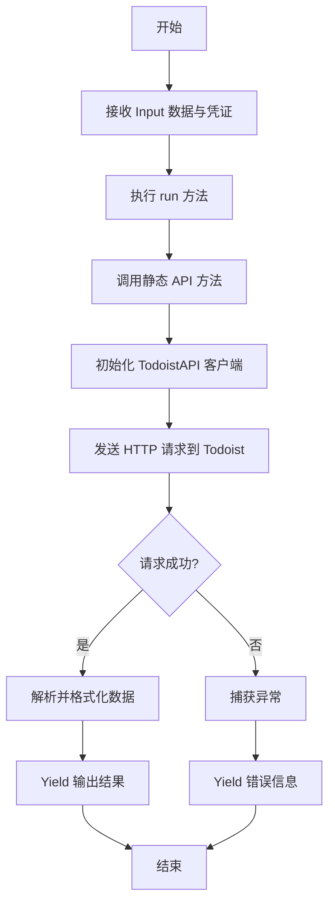

## 类结构

```
Block (外部导入的基类)
├── TodoistCreateLabelBlock
├── TodoistListLabelsBlock
├── TodoistGetLabelBlock
├── TodoistUpdateLabelBlock
├── TodoistDeleteLabelBlock
├── TodoistGetSharedLabelsBlock
├── TodoistRenameSharedLabelsBlock
└── TodoistRemoveSharedLabelsBlock
```

## 全局变量及字段


### `TodoistCreateLabelBlock.credentials`
    
用于身份验证的 Todoist 凭证

类型：`TodoistCredentialsInput`
    


### `TodoistCreateLabelBlock.name`
    
Name of the label

类型：`str`
    


### `TodoistCreateLabelBlock.order`
    
Label order

类型：`Optional[int]`
    


### `TodoistCreateLabelBlock.color`
    
The color of the label icon

类型：`Optional[Colors]`
    


### `TodoistCreateLabelBlock.is_favorite`
    
Whether the label is a favorite

类型：`bool`
    


### `TodoistCreateLabelBlock.id`
    
ID of the created label

类型：`str`
    


### `TodoistCreateLabelBlock.color`
    
Color of the label

类型：`str`
    


### `TodoistCreateLabelBlock.order`
    
Label order

类型：`int`
    


### `TodoistCreateLabelBlock.is_favorite`
    
Favorite status

类型：`bool`
    


### `TodoistListLabelsBlock.credentials`
    
用于身份验证的 Todoist 凭证

类型：`TodoistCredentialsInput`
    


### `TodoistListLabelsBlock.labels`
    
List of complete label data

类型：`list`
    


### `TodoistListLabelsBlock.label_ids`
    
List of label IDs

类型：`list`
    


### `TodoistListLabelsBlock.label_names`
    
List of label names

类型：`list`
    


### `TodoistGetLabelBlock.credentials`
    
用于身份验证的 Todoist 凭证

类型：`TodoistCredentialsInput`
    


### `TodoistGetLabelBlock.label_id`
    
ID of the label to retrieve

类型：`str`
    


### `TodoistGetLabelBlock.id`
    
ID of the label

类型：`str`
    


### `TodoistGetLabelBlock.name`
    
Name of the label

类型：`str`
    


### `TodoistGetLabelBlock.color`
    
Color of the label

类型：`str`
    


### `TodoistGetLabelBlock.order`
    
Label order

类型：`int`
    


### `TodoistGetLabelBlock.is_favorite`
    
Favorite status

类型：`bool`
    


### `TodoistUpdateLabelBlock.credentials`
    
用于身份验证的 Todoist 凭证

类型：`TodoistCredentialsInput`
    


### `TodoistUpdateLabelBlock.label_id`
    
ID of the label to update

类型：`str`
    


### `TodoistUpdateLabelBlock.name`
    
New name of the label

类型：`Optional[str]`
    


### `TodoistUpdateLabelBlock.order`
    
Label order

类型：`Optional[int]`
    


### `TodoistUpdateLabelBlock.color`
    
The color of the label icon

类型：`Optional[Colors]`
    


### `TodoistUpdateLabelBlock.is_favorite`
    
Whether the label is a favorite (true/false)

类型：`bool`
    


### `TodoistUpdateLabelBlock.success`
    
Whether the update was successful

类型：`bool`
    


### `TodoistDeleteLabelBlock.credentials`
    
用于身份验证的 Todoist 凭证

类型：`TodoistCredentialsInput`
    


### `TodoistDeleteLabelBlock.label_id`
    
ID of the label to delete

类型：`str`
    


### `TodoistDeleteLabelBlock.success`
    
Whether the deletion was successful

类型：`bool`
    


### `TodoistGetSharedLabelsBlock.credentials`
    
用于身份验证的 Todoist 凭证

类型：`TodoistCredentialsInput`
    


### `TodoistGetSharedLabelsBlock.labels`
    
List of shared label names

类型：`list`
    


### `TodoistRenameSharedLabelsBlock.credentials`
    
用于身份验证的 Todoist 凭证

类型：`TodoistCredentialsInput`
    


### `TodoistRenameSharedLabelsBlock.name`
    
The name of the existing label to rename

类型：`str`
    


### `TodoistRenameSharedLabelsBlock.new_name`
    
The new name for the label

类型：`str`
    


### `TodoistRenameSharedLabelsBlock.success`
    
Whether the rename was successful

类型：`bool`
    


### `TodoistRemoveSharedLabelsBlock.credentials`
    
用于身份验证的 Todoist 凭证

类型：`TodoistCredentialsInput`
    


### `TodoistRemoveSharedLabelsBlock.name`
    
The name of the label to remove

类型：`str`
    


### `TodoistRemoveSharedLabelsBlock.success`
    
Whether the removal was successful

类型：`bool`
    
    

## 全局函数及方法


### `TodoistCreateLabelBlock.__init__`

该方法是 `TodoistCreateLabelBlock` 类的构造函数，负责初始化创建 Todoist 标签块所需的元数据，包括唯一标识符、描述、输入输出模式、分类信息、禁用状态逻辑以及测试配置。

参数：

-  `self`：`TodoistCreateLabelBlock`，表示类的实例本身。

返回值：`None`，构造函数不返回任何值。

#### 流程图

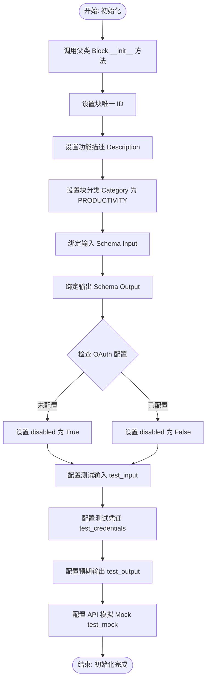

#### 带注释源码

```python
def __init__(self):
    # 调用父类 Block 的构造函数，传入块的详细配置信息
    super().__init__(
        id="7288a968-de14-11ef-8997-32d3674e8b7e",  # 块的唯一标识符 (UUID)
        description="Creates a new label in Todoist, It will not work if same name already exists", # 块的功能描述文本
        categories={BlockCategory.PRODUCTIVITY},  # 将块归类为生产力工具
        input_schema=TodoistCreateLabelBlock.Input,  # 定义输入参数的 Schema 类
        output_schema=TodoistCreateLabelBlock.Output,  # 定义输出结果的 Schema 类
        disabled=not TODOIST_OAUTH_IS_CONFIGURED,  # 根据 OAuth 是否配置来决定是否禁用该块
        test_input={  # 定义用于测试运行的输入数据样本
            "credentials": TEST_CREDENTIALS_INPUT,
            "name": "Test Label",
            "color": Colors.charcoal.value,
            "order": 1,
            "is_favorite": False,
        },
        test_credentials=TEST_CREDENTIALS,  # 定义用于测试的身份验证凭证
        test_output=[  # 定义测试运行预期的输出键值对
            ("id", "2156154810"),
            ("name", "Test Label"),
            ("color", "charcoal"),
            ("order", 1),
            ("is_favorite", False),
        ],
        test_mock={  # 定义测试时对外部 API 调用的模拟行为
            "create_label": lambda *args, **kwargs: {
                "id": "2156154810",
                "name": "Test Label",
                "color": "charcoal",
                "order": 1,
                "is_favorite": False,
            }
        },
    )
```


### `TodoistCreateLabelBlock.create_label`

该方法是一个静态辅助方法，用于通过 Todoist API 客户端创建一个新的标签。它接收认证凭据、标签名称以及其他可选属性（如颜色、排序等），初始化 API 客户端，执行创建操作，并将返回的标签对象转换为字典格式。

参数：

-  `credentials`：`TodoistCredentials`，包含访问 Todoist API 所需的认证令牌的凭据对象。
-  `name`：`str`，要创建的标签的名称。
-  `**kwargs`：`Any`，用于传递标签的其他可选属性（例如：order, color, is_favorite）。

返回值：`dict`，包含新创建标签的详细信息的字典（如 id, name, color, order 等）。

#### 流程图

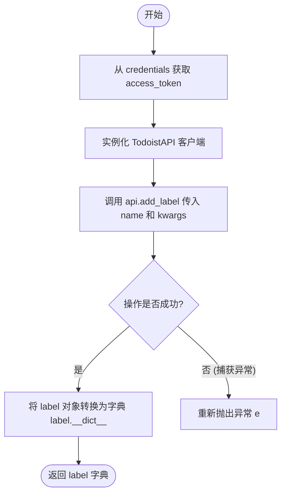

#### 带注释源码

```python
    @staticmethod
    def create_label(credentials: TodoistCredentials, name: str, **kwargs):
        try:
            # 使用凭据中的 access_token 初始化 Todoist API 客户端
            api = TodoistAPI(credentials.access_token.get_secret_value())
            # 调用 API 的 add_label 方法创建标签，传入 name 及其他关键字参数
            label = api.add_label(name=name, **kwargs)
            # 将返回的 Label 对象的属性转换为字典格式并返回
            return label.__dict__

        except Exception as e:
            # 捕获到异常时直接抛出，由上层逻辑处理
            raise e
```


### `TodoistCreateLabelBlock.run`

该方法负责执行在 Todoist 中创建新标签的核心逻辑。它接收包含标签属性（如名称、颜色、顺序等）的输入数据和认证凭证，通过调用静态方法与 Todoist API 进行交互，并将创建成功的标签数据以生成器形式逐步输出，或者捕获并输出异常信息。

参数：

-  `input_data`：`TodoistCreateLabelBlock.Input`，包含标签详细信息的输入数据模型，涵盖名称、顺序、颜色及收藏状态等字段。
-  `credentials`：`TodoistCredentials`，用于身份验证的凭证对象，包含访问 Todoist API 所需的令牌。
-  `kwargs`：`typing.Any`，扩展用的额外关键字参数。

返回值：`BlockOutput`，一个异步生成器，逐步产出包含新创建标签的 `id`、`name`、`color`、`order` 和 `is_favorite` 的键值对元组，若发生错误则产出 `error` 信息。

#### 流程图

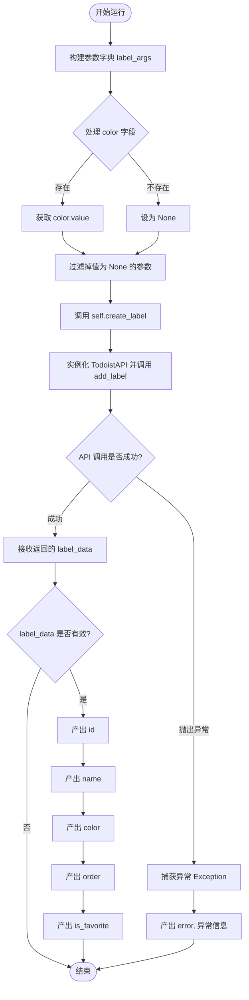

#### 带注释源码

```python
    async def run(
        self,
        input_data: Input,
        *,
        credentials: TodoistCredentials,
        **kwargs,
    ) -> BlockOutput:
        try:
            # 准备传递给 API 的参数字典
            label_args = {
                "order": input_data.order,
                # 如果颜色存在，则获取其枚举值，否则为 None
                "color": (
                    input_data.color.value if input_data.color is not None else None
                ),
                "is_favorite": input_data.is_favorite,
            }

            # 调用静态方法 create_label 与 Todoist API 交互
            # 使用字典推导式过滤掉值为 None 的参数，避免覆盖默认值
            label_data = self.create_label(
                credentials,
                input_data.name,
                **{k: v for k, v in label_args.items() if v is not None},
            )

            # 如果 API 返回了数据，则逐步产出结果
            if label_data:
                yield "id", label_data["id"]
                yield "name", label_data["name"]
                yield "color", label_data["color"]
                yield "order", label_data["order"]
                yield "is_favorite", label_data["is_favorite"]

        except Exception as e:
            # 捕获任何异常并产出错误信息
            yield "error", str(e)
```


### `TodoistListLabelsBlock.__init__`

初始化 `TodoistListLabelsBlock` 实例。该方法负责配置块的元数据，包括唯一标识符、描述、所属类别、输入输出模式，以及用于测试的模拟数据和凭证配置。它通过调用父类 `Block` 的构造函数完成注册。

参数：

-   `self`：`TodoistListLabelsBlock`，类的实例本身。

返回值：`None`，构造函数不返回任何值。

#### 流程图

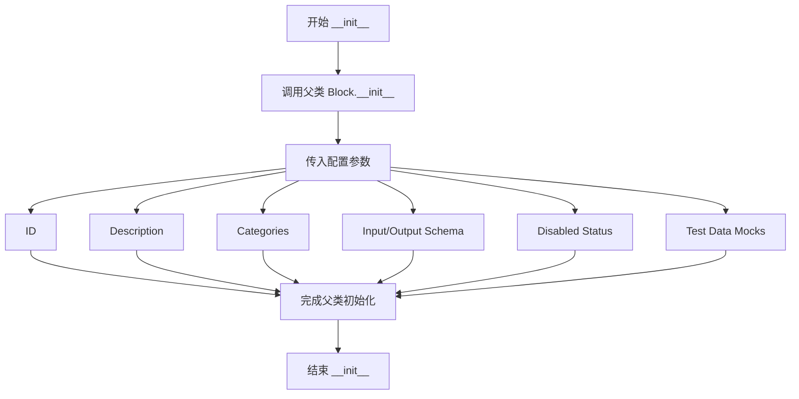

#### 带注释源码

```python
def __init__(self):
    # 调用父类 Block 的构造函数，初始化块的基本信息和配置
    super().__init__(
        id="776dd750-de14-11ef-b927-32d3674e8b7e",  # 块的唯一标识符
        description="Gets all personal labels from Todoist",  # 块的功能描述
        categories={BlockCategory.PRODUCTIVITY},  # 块所属的分类
        input_schema=TodoistListLabelsBlock.Input,  # 定义输入数据的结构
        output_schema=TodoistListLabelsBlock.Output,  # 定义输出数据的结构
        disabled=not TODOIST_OAUTH_IS_CONFIGURED,  # 如果 OAuth 未配置则禁用该块
        test_input={"credentials": TEST_CREDENTIALS_INPUT},  # 测试用的输入数据
        test_credentials=TEST_CREDENTIALS,  # 测试用的凭证
        test_output=[  # 预期的测试输出结果
            (
                "labels",
                [
                    {
                        "id": "2156154810",
                        "name": "Test Label",
                        "color": "charcoal",
                        "order": 1,
                        "is_favorite": False,
                    }
                ],
            ),
            ("label_ids", ["2156154810"]),
            ("label_names", ["Test Label"]),
        ],
        test_mock={  # 测试时用于模拟 API 调用的函数
            "get_labels": lambda *args, **kwargs: [
                {
                    "id": "2156154810",
                    "name": "Test Label",
                    "color": "charcoal",
                    "order": 1,
                    "is_favorite": False,
                }
            ]
        },
    )
```


### `TodoistListLabelsBlock.get_labels`

从 Todoist 获取用户的所有个人标签，并将标签对象转换为字典列表返回。

参数：

-  `credentials`：`TodoistCredentials`，用于认证和访问 Todoist API 的凭据对象

返回值：`list`，包含所有标签详细信息的字典列表，每个字典包含 id, name, color, order, is_favorite 等字段

#### 流程图

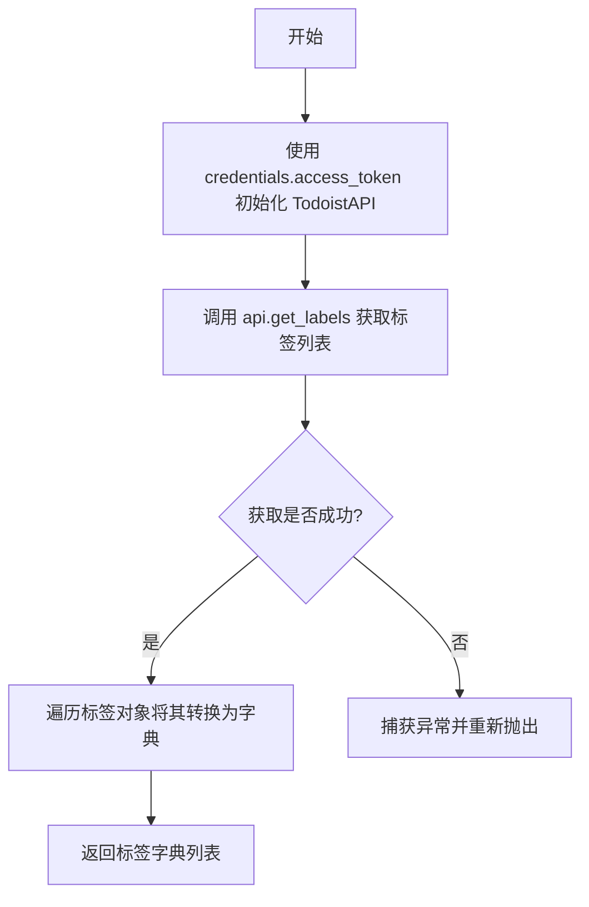

#### 带注释源码

```python
    @staticmethod
    def get_labels(credentials: TodoistCredentials):
        try:
            # 使用凭据中的访问令牌初始化 TodoistAPI 客户端
            api = TodoistAPI(credentials.access_token.get_secret_value())
            # 调用 API 获取所有标签
            labels = api.get_labels()
            # 将返回的标签对象列表转换为字典列表并返回
            return [label.__dict__ for label in labels]

        except Exception as e:
            # 捕获异常并向上抛出，以便上层处理
            raise e
```


### `TodoistListLabelsBlock.run`

执行从 Todoist 获取所有个人标签的主要逻辑，通过 API 获取数据并异步生成标签列表、ID 列表和名称列表。

参数：

-  `input_data`：`Input`，包含块输入数据的对象，在本例中主要包含凭证配置字段。
-  `credentials`：`TodoistCredentials`，用于身份验证的凭证对象，包含访问 Todoist API 所需的令牌。
-  `**kwargs`：`dict`，扩展关键字参数，用于传递额外的上下文信息。

返回值：`BlockOutput`，一个异步生成器，用于逐步产生处理结果或错误信息。

#### 流程图

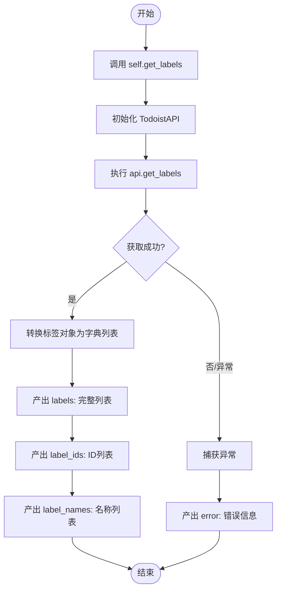

#### 带注释源码

```python
    async def run(
        self,
        input_data: Input,
        *,
        credentials: TodoistCredentials,
        **kwargs,
    ) -> BlockOutput:
        try:
            # 调用静态方法 get_labels 从 Todoist API 获取标签数据
            # 传入 credentials 以进行 API 认证
            labels = self.get_labels(credentials)

            # 产出完整的标签数据列表，包含所有属性
            yield "labels", labels

            # 产出仅包含标签 ID 的列表，使用列表推导式提取
            yield "label_ids", [label["id"] for label in labels]

            # 产出仅包含标签名称的列表，使用列表推导式提取
            yield "label_names", [label["name"] for label in labels]

        except Exception as e:
            # 如果在执行过程中发生任何异常，捕获并产出错误信息
            yield "error", str(e)
```


### `TodoistGetLabelBlock.__init__`

该方法是 `TodoistGetLabelBlock` 类的构造函数，负责初始化块的基本配置。它定义了块的唯一标识、描述、分类、输入输出 Schema，以及用于测试的模拟数据（Mock），并根据 Todoist OAuth 的配置状态决定是否禁用该块，最后调用父类 `Block` 的构造函数完成注册。

参数：

-  `self`：`TodoistGetLabelBlock`，类的实例本身

返回值：`None`，构造函数不返回任何值

#### 流程图

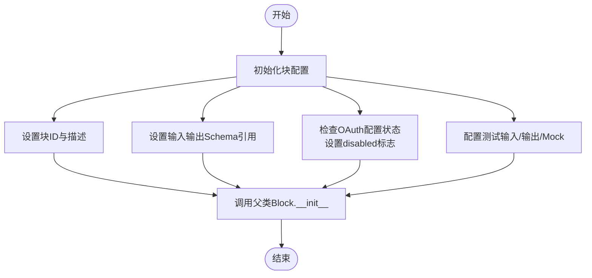

#### 带注释源码

```python
def __init__(self):
    # 调用父类 Block 的初始化方法，传递块的各种配置参数
    super().__init__(
        # 块的唯一标识符 (UUID)
        id="7f236514-de14-11ef-bd7a-32d3674e8b7e",
        # 块的功能描述文本
        description="Gets a personal label from Todoist by ID",
        # 块所属的分类，这里归类为生产力工具
        categories={BlockCategory.PRODUCTIVITY},
        # 定义块的输入数据结构，关联内部类 Input
        input_schema=TodoistGetLabelBlock.Input,
        # 定义块的输出数据结构，关联内部类 Output
        output_schema=TodoistGetLabelBlock.Output,
        # 根据全局配置检查 Todoist OAuth 是否已配置，未配置则禁用该块
        disabled=not TODOIST_OAUTH_IS_CONFIGURED,
        # 定义用于测试的输入数据样本
        test_input={
            "credentials": TEST_CREDENTIALS_INPUT,
            "label_id": "2156154810",
        },
        # 定义用于测试的凭证对象
        test_credentials=TEST_CREDENTIALS,
        # 定义预期的测试输出结果列表
        test_output=[
            ("id", "2156154810"),
            ("name", "Test Label"),
            ("color", "charcoal"),
            ("order", 1),
            ("is_favorite", False),
        ],
        # 定义测试时的模拟行为，拦截 API 调用并返回预设数据
        test_mock={
            "get_label": lambda *args, **kwargs: {
                "id": "2156154810",
                "name": "Test Label",
                "color": "charcoal",
                "order": 1,
                "is_favorite": False,
            }
        },
    )
```


### `TodoistGetLabelBlock.get_label`

该静态方法负责通过标签ID从Todoist获取个人标签的详细信息，它封装了API调用逻辑，处理了认证并将返回的对象转换为字典格式。

参数：

-  `credentials`：`TodoistCredentials`，用于认证的Todoist凭证对象，包含访问令牌
-  `label_id`：`str`，要获取的标签的唯一标识符

返回值：`dict`，包含标签详细信息的字典，键包括id、name、color、order、is_favorite等。

#### 流程图

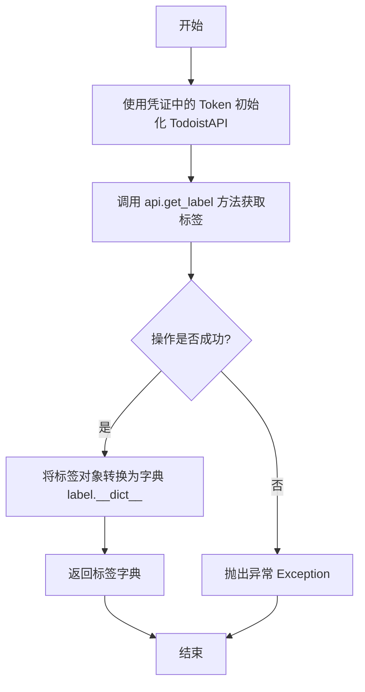

#### 带注释源码

```python
    @staticmethod
    def get_label(credentials: TodoistCredentials, label_id: str):
        try:
            # 使用传入的凭证中的访问令牌实例化 Todoist API 客户端
            api = TodoistAPI(credentials.access_token.get_secret_value())
            # 调用 API 的 get_label 方法，根据 label_id 获取特定标签对象
            label = api.get_label(label_id=label_id)
            # 将标签对象转换为字典格式返回
            return label.__dict__

        except Exception as e:
            # 如果发生任何错误，直接抛出异常
            raise e
```


### `TodoistGetLabelBlock.run`

此方法通过ID从Todoist获取个人标签数据，并将标签的ID、名称、颜色、排序和收藏状态作为输出产出。

参数：

-  `input_data`：`TodoistGetLabelBlock.Input`，输入数据结构，包含要检索的标签ID (`label_id`)。
-  `credentials`：`TodoistCredentials`，用于认证的Todoist凭据对象，包含访问令牌。
-  `**kwargs`：`dict`，扩展的关键字参数。

返回值：`BlockOutput`，异步生成器，产出包含标签详细字段（id, name, color, order, is_favorite）或错误信息的元组。

#### 流程图

```mermaid
flowchart TD
    Start(开始) --> TryBlock[Try 块]
    TryBlock --> GetLabel[调用 self.get_label 获取数据]
    GetLabel --> CheckData{label_data 是否存在?}
    CheckData -- 是 --> YieldId[产出 id]
    YieldId --> YieldName[产出 name]
    YieldName --> YieldColor[产出 color]
    YieldColor --> YieldOrder[产出 order]
    YieldOrder --> YieldFav[产出 is_favorite]
    YieldFav --> End(结束)
    CheckData -- 否 --> End
    TryBlock -.->|捕获异常| CatchException[捕获 Exception e]
    CatchException --> YieldError[产出 error, str(e)]
    YieldError --> End
```

#### 带注释源码

```python
    async def run(
        self,
        input_data: Input,
        *,
        credentials: TodoistCredentials,
        **kwargs,
    ) -> BlockOutput:
        try:
            # 调用静态方法 get_label，传入凭据和标签ID，从Todoist API获取标签数据
            label_data = self.get_label(credentials, input_data.label_id)

            # 如果获取到了数据，则逐个产出标签的字段信息
            if label_data:
                yield "id", label_data["id"]
                yield "name", label_data["name"]
                yield "color", label_data["color"]
                yield "order", label_data["order"]
                yield "is_favorite", label_data["is_favorite"]

        # 捕获运行过程中的异常，并产出错误信息
        except Exception as e:
            yield "error", str(e)
```


### `TodoistUpdateLabelBlock.__init__`

初始化用于更新 Todoist 个人标签的块，设置块的唯一标识符、描述、输入输出模式、分类以及测试相关配置。

参数：

- `self`：`TodoistUpdateLabelBlock`，类的实例引用。

返回值：`None`，构造函数不返回任何值。

#### 流程图

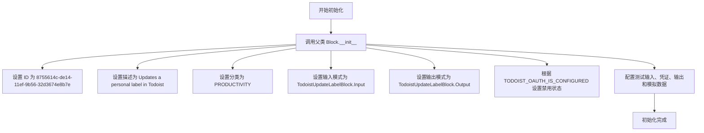

#### 带注释源码

```python
    def __init__(self):
        # 调用父类 Block 的初始化方法，配置块的基本元数据和运行时行为
        super().__init__(
            # 块的唯一标识符
            id="8755614c-de14-11ef-9b56-32d3674e8b7e",
            # 块的功能描述
            description="Updates a personal label in Todoist",
            # 块所属的分类，此处设为生产力工具
            categories={BlockCategory.PRODUCTIVITY},
            # 定义输入数据的结构模式，使用内部类 Input
            input_schema=TodoistUpdateLabelBlock.Input,
            # 定义输出数据的结构模式，使用内部类 Output
            output_schema=TodoistUpdateLabelBlock.Output,
            # 根据 OAuth 配置状态决定是否禁用该块
            disabled=not TODOIST_OAUTH_IS_CONFIGURED,
            # 定义用于测试的输入数据样本
            test_input={
                "credentials": TEST_CREDENTIALS_INPUT,
                "label_id": "2156154810",
                "name": "Updated Label",
                "color": Colors.charcoal.value,
                "order": 2,
                "is_favorite": True,
            },
            # 定义用于测试的凭证对象
            test_credentials=TEST_CREDENTIALS,
            # 定义预期的测试输出结果
            test_output=[("success", True)],
            # 定义模拟函数，用于在测试环境中替代真实的 API 调用
            test_mock={"update_label": lambda *args, **kwargs: True},
        )
```


### `TodoistUpdateLabelBlock.update_label`

该静态方法通过 Todoist API 更新指定 ID 的个人标签属性。它使用提供的凭证初始化 API 客户端，将更新请求转发给 Todoist 服务，并根据执行结果返回状态。

参数：

- `credentials`：`TodoistCredentials`，包含 Todoist 访问令牌的认证凭证对象。
- `label_id`：`str`，需要更新的标签的唯一标识符。
- `**kwargs`：`Any`，传递给 Todoist API 的可选标签属性参数（例如 name, order, color, is_favorite）。

返回值：`bool`，如果 API 调用执行未抛出异常，返回 True 表示更新尝试成功。

#### 流程图

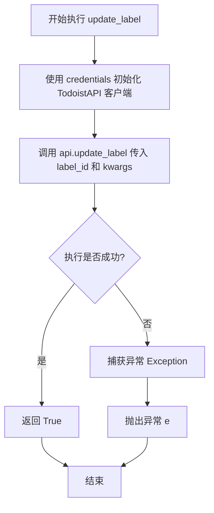

#### 带注释源码

```python
    @staticmethod
    def update_label(credentials: TodoistCredentials, label_id: str, **kwargs):
        try:
            # 1. 使用凭证中的 access_token 初始化 Todoist API 客户端
            api = TodoistAPI(credentials.access_token.get_secret_value())
            
            # 2. 调用 API 的 update_label 方法执行更新操作，传入标签 ID 和其他参数
            api.update_label(label_id=label_id, **kwargs)
            
            # 3. 如果没有异常抛出，返回 True 表示操作成功
            return True

        except Exception as e:
            # 4. 捕获执行过程中的任何异常并重新抛出，交由上层处理
            raise e
```


### `TodoistUpdateLabelBlock.run`

该方法用于执行 Todoist 标签更新的异步操作。它首先根据输入的数据构建更新参数，过滤掉空值，然后调用底层 API 接口执行更新，并返回操作结果或错误信息。

参数：

- `input_data`：`TodoistUpdateLabelBlock.Input`，包含标签更新所需的数据，如标签 ID、新名称、颜色、顺序和收藏状态。
- `credentials`：`TodoistCredentials`，用于 Todoist API 认证的凭证对象。
- `**kwargs`：`typing.Any`，额外的关键字参数。

返回值：`BlockOutput`，一个异步生成器，产出包含操作状态（"success"）或错误信息（"error"）的元组。

#### 流程图

```mermaid
flowchart TD
    A([开始]) --> B[初始化空字典 label_args]
    B --> C{input_data.name 是否为 None?}
    C -- 否 --> D[label_args 添加 name]
    C -- 是 --> E{input_data.order 是否为 None?}
    D --> E
    E -- 否 --> F[label_args 添加 order]
    E -- 是 --> G{input_data.color 是否为 None?}
    F --> G
    G -- 否 --> H[label_args 添加 color.value]
    G -- 是 --> I{input_data.is_favorite 是否为 None?}
    H --> I
    I -- 否 --> J[label_args 添加 is_favorite]
    I -- 是 --> K[调用 self.update_label<br>传入 credentials, label_id 和过滤后的参数]
    J --> K
    K --> L{调用是否成功?}
    L -- 是 --> M[yield "success", True]
    L -- 否/异常 --> N[yield "error", 异常信息]
    M --> O([结束])
    N --> O
```

#### 带注释源码

```python
async def run(
    self,
    input_data: Input,
    *,
    credentials: TodoistCredentials,
    **kwargs,
) -> BlockOutput:
    try:
        # 初始化用于存放更新参数的字典
        label_args = {}
        
        # 如果提供了 name，添加到参数中
        if input_data.name is not None:
            label_args["name"] = input_data.name
            
        # 如果提供了 order，添加到参数中
        if input_data.order is not None:
            label_args["order"] = input_data.order
            
        # 如果提供了 color，提取其 value 并添加到参数中
        if input_data.color is not None:
            label_args["color"] = input_data.color.value
            
        # 如果提供了 is_favorite（且不为 None，虽然 default 是 False），添加到参数中
        if input_data.is_favorite is not None:
            label_args["is_favorite"] = input_data.is_favorite

        # 调用静态方法 update_label 执行更新
        # 过滤掉值为 None 的键值对，仅传递有效参数
        success = self.update_label(
            credentials,
            input_data.label_id,
            **{k: v for k, v in label_args.items() if v is not None},
        )

        # 产出成功状态
        yield "success", success

    except Exception as e:
        # 捕获异常并产出错误信息
        yield "error", str(e)
```


### `TodoistDeleteLabelBlock.__init__`

该方法是 `TodoistDeleteLabelBlock` 类的构造函数，负责初始化 Block 实例。它配置了块的唯一标识符、描述、分类、输入输出 schema 以及用于测试的模拟数据和凭证。

参数：

- `self`：`TodoistDeleteLabelBlock`，指向类实例本身的引用。

返回值：`None`，构造函数不返回任何值。

#### 流程图

```mermaid
flowchart TD
    A([开始]) --> B[调用父类 Block 初始化方法 super().__init__]
    B --> C1[设置 ID: 901b8f86-de14-11ef-98b8-32d3674e8b7e]
    B --> C2[设置描述: Deletes a personal label in Todoist]
    B --> C3[设置分类: PRODUCTIVITY]
    B --> C4[设置输入 Schema: TodoistDeleteLabelBlock.Input]
    B --> C5[设置输出 Schema: TodoistDeleteLabelBlock.Output]
    B --> C6[设置禁用状态: 根据 TODOIST_OAUTH_IS_CONFIGURED]
    B --> C7[设置测试输入、凭证、输出和模拟数据]
    C7 --> D([结束])
```

#### 带注释源码

```python
def __init__(self):
    # 调用父类 Block 的初始化方法，注册块的元数据和配置
    super().__init__(
        # 块的唯一标识符 (UUID)
        id="901b8f86-de14-11ef-98b8-32d3674e8b7e",
        # 块的功能描述
        description="Deletes a personal label in Todoist",
        # 块所属的分类，此处为生产力工具
        categories={BlockCategory.PRODUCTIVITY},
        # 定义块的输入数据结构 schema，引用内部类 Input
        input_schema=TodoistDeleteLabelBlock.Input,
        # 定义块的输出数据结构 schema，引用内部类 Output
        output_schema=TodoistDeleteLabelBlock.Output,
        # 根据 OAuth 是否配置来决定是否禁用该块
        disabled=not TODOIST_OAUTH_IS_CONFIGURED,
        # 定义测试用的输入数据，包含凭证和模拟的 label_id
        test_input={
            "credentials": TEST_CREDENTIALS_INPUT,
            "label_id": "2156154810",
        },
        # 定义测试用的凭证对象
        test_credentials=TEST_CREDENTIALS,
        # 定义预期的测试输出结果
        test_output=[("success", True)],
        # 定义测试时的模拟行为，mock delete_label 方法返回 True
        test_mock={"delete_label": lambda *args, **kwargs: True},
    )
```


### `TodoistDeleteLabelBlock.delete_label`

该方法用于通过 Todoist API 删除指定的个人标签。它封装了认证和 API 调用逻辑，处理了异常捕获与重新抛出。

参数：

- `credentials`：`TodoistCredentials`，包含 Todoist API 访问令牌的认证凭据对象。
- `label_id`：`str`，需要删除的标签的唯一标识符。

返回值：`bool`，表示标签删除操作是否成功的布尔值（基于 `api.delete_label` 的返回结果）。

#### 流程图

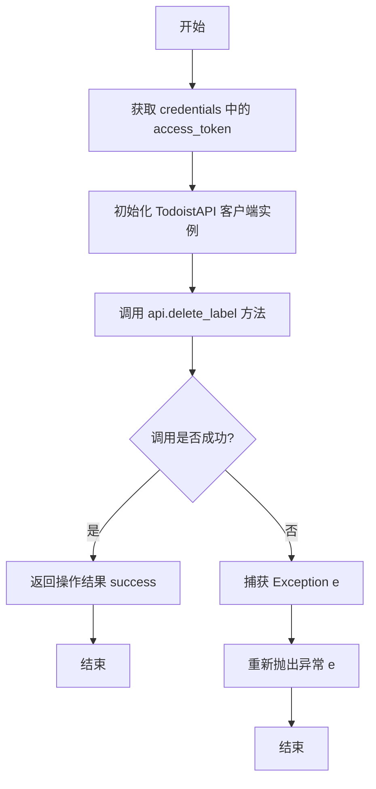

#### 带注释源码

```python
    @staticmethod
    def delete_label(credentials: TodoistCredentials, label_id: str):
        try:
            # 从凭据对象中获取 access_token 并初始化 Todoist API 客户端
            api = TodoistAPI(credentials.access_token.get_secret_value())
            
            # 调用 API 的 delete_label 接口执行删除操作，并传入标签 ID
            success = api.delete_label(label_id=label_id)
            
            # 返回 API 调用的结果，通常为布尔值表示成功与否
            return success

        except Exception as e:
            # 如果在 API 调用过程中发生任何异常，捕获并重新抛出，供上层处理
            raise e
```


### `TodoistDeleteLabelBlock.run`

负责执行删除 Todoist 个人标签的核心逻辑，处理异常并通过生成器返回操作结果或错误信息。

参数：

-  `self`：`TodoistDeleteLabelBlock`，类的实例引用。
-  `input_data`：`Input`，包含输入数据的对象，此处主要提取 `label_id` 用于指定要删除的标签。
-  `credentials`：`TodoistCredentials`，认证凭据对象，包含访问 Todoist API 所需的令牌。
-  `**kwargs`：`dict`，扩展用的关键字参数。

返回值：`BlockOutput`，异步生成器类型，用于产出执行结果。成功时产出 `("success", True)`，失败时产出 `("error", error_message)`。

#### 流程图

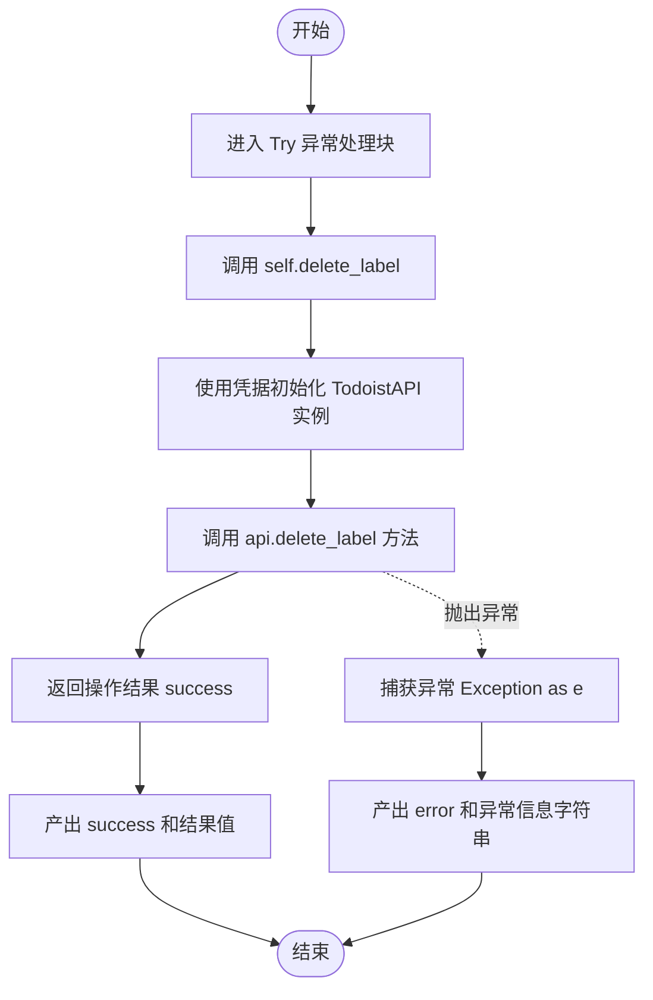

#### 带注释源码

```python
    async def run(
        self,
        input_data: Input,
        *,
        credentials: TodoistCredentials,
        **kwargs,
    ) -> BlockOutput:
        try:
            # 调用静态方法执行实际的删除操作
            # 传入认证凭据和从输入数据中获取的标签ID
            success = self.delete_label(credentials, input_data.label_id)
            
            # 如果操作成功，产出 "success" 键和布尔值 True
            yield "success", success

        except Exception as e:
            # 捕获处理过程中发生的任何异常
            # 产出 "error" 键和异常的字符串描述信息
            yield "error", str(e)
```


### `TodoistGetSharedLabelsBlock.__init__`

初始化 `TodoistGetSharedLabelsBlock` 实例，配置该块的唯一标识、描述、输入输出模式、分类信息以及用于测试的模拟数据和输入输出样例。

参数：

- `self`：`TodoistGetSharedLabelsBlock`，类的实例本身

返回值：`None`，该方法为构造函数，不返回任何值

#### 流程图

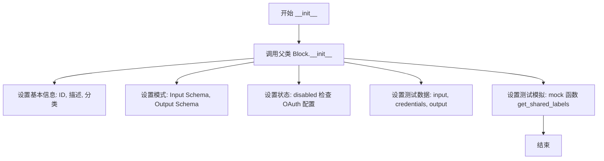

#### 带注释源码

```python
def __init__(self):
    # 调用父类 Block 的初始化方法，配置块的所有静态元数据和测试配置
    super().__init__(
        # 块的唯一标识符
        id="55fba510-de15-11ef-aed2-32d3674e8b7e",
        # 块的功能描述
        description="Gets all shared labels from Todoist",
        # 块所属的业务分类
        categories={BlockCategory.PRODUCTIVITY},
        # 定义的输入数据结构模式
        input_schema=TodoistGetSharedLabelsBlock.Input,
        # 定义的输出数据结构模式
        output_schema=TodoistGetSharedLabelsBlock.Output,
        # 根据 OAuth 是否配置来决定是否禁用该块
        disabled=not TODOIST_OAUTH_IS_CONFIGURED,
        # 单元测试用的输入数据
        test_input={"credentials": TEST_CREDENTIALS_INPUT},
        # 单元测试用的凭证对象
        test_credentials=TEST_CREDENTIALS,
        # 单元测试期望的输出结果
        test_output=[("labels", ["Label1", "Label2", "Label3"])],
        # 单元测试的 Mock 函数，模拟 API 调用返回的数据
        test_mock={
            "get_shared_labels": lambda *args, **kwargs: [
                "Label1",
                "Label2",
                "Label3",
            ]
        },
    )
```


### `TodoistGetSharedLabelsBlock.get_shared_labels`

获取 Todoist 中的所有共享标签。

参数：

-  `credentials`：`TodoistCredentials`，包含访问令牌的认证凭据对象，用于授权 API 请求。

返回值：`list`，包含共享标签名称的列表。

#### 流程图

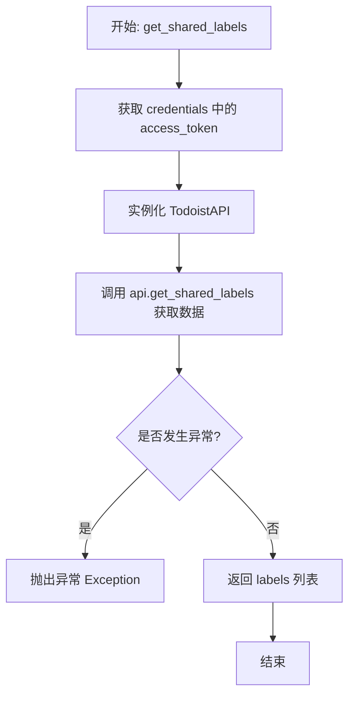

#### 带注释源码

```python
    @staticmethod
    def get_shared_labels(credentials: TodoistCredentials):
        try:
            # 使用凭据中的访问令牌初始化 TodoistAPI 客户端
            api = TodoistAPI(credentials.access_token.get_secret_value())
            # 调用 Todoist API 获取所有共享标签
            labels = api.get_shared_labels()
            # 返回获取到的标签列表
            return labels

        except Exception as e:
            # 捕获异常并重新抛出，以便上层处理
            raise e
```


### `TodoistGetSharedLabelsBlock.run`

该方法是 `TodoistGetSharedLabelsBlock` 类的核心执行逻辑，用于异步地从 Todoist 获取所有共享标签（Shared Labels），并将结果以生成器的形式输出，或在发生错误时输出错误信息。

参数：

- `input_data`：`TodoistGetSharedLabelsBlock.Input`，包含运行该块所需的输入数据（主要为凭证）。
- `credentials`：`TodoistCredentials`，经过验证的 Todoist API 凭证对象，包含访问令牌。
- `**kwargs`：`dict`，额外的关键字参数，通常由框架传递用于上下文处理。

返回值：`BlockOutput`，一个异步生成器，产生键值对。成功时产生 `"labels"` 和共享标签名称列表，失败时产生 `"error"` 和错误信息。

#### 流程图

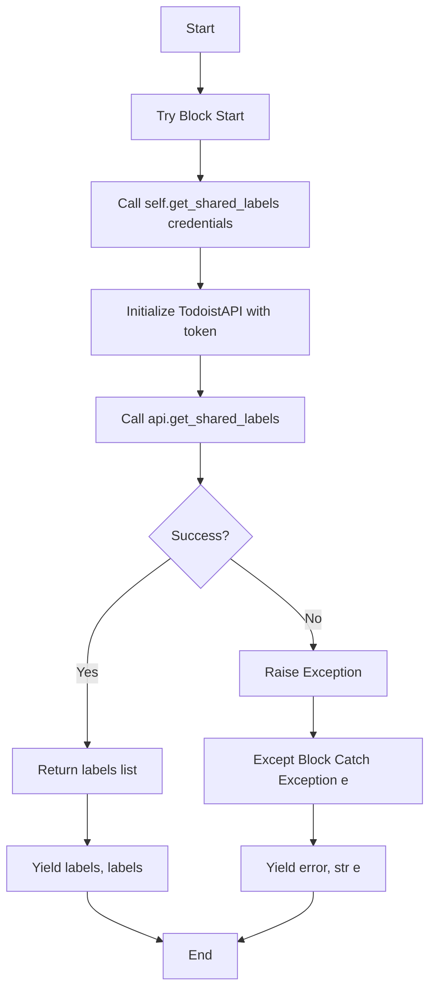

#### 带注释源码

```python
    async def run(
        self,
        input_data: Input,
        *,
        credentials: TodoistCredentials,
        **kwargs,
    ) -> BlockOutput:
        try:
            # 调用静态方法 get_shared_labels，传入凭证以获取共享标签列表
            labels = self.get_shared_labels(credentials)

            # 成功获取数据后，将 "labels" 作为键，标签列表作为值进行输出
            yield "labels", labels

        except Exception as e:
            # 如果在获取过程中发生任何异常，捕获并输出 "error" 键及错误信息字符串
            yield "error", str(e)
```


### `TodoistRenameSharedLabelsBlock.__init__`

初始化 `TodoistRenameSharedLabelsBlock` 实例，配置其唯一标识、描述、输入输出模式、测试数据及模拟行为，并调用父类 `Block` 的初始化方法。

参数：

-  `self`：`TodoistRenameSharedLabelsBlock`，类的实例本身。

返回值：`None`，该方法为构造函数，无显式返回值。

#### 流程图

```mermaid
graph TD
    A[Start: __init__] --> B[Set Block ID<br/>9d63ad9a-de14-11ef-ab3f-32d3674e8b7e]
    B --> C[Set Description & Categories<br/>Renames shared labels, Productivity]
    C --> D[Define Input & Output Schemas<br/>Input: name, new_name<br/>Output: success]
    D --> E[Set Disabled Status<br/>Check TODOIST_OAUTH_IS_CONFIGURED]
    E --> F[Configure Test Inputs & Credentials<br/>name: OldLabel, new_name: NewLabel]
    F --> G[Configure Test Output & Mocks<br/>Mock rename_shared_labels to return True]
    G --> H[Call super().__init__]
    H --> I[End]
```

#### 带注释源码

```python
    def __init__(self):
        # 调用父类 Block 的 __init__ 方法，配置块的元数据和行为
        super().__init__(
            # 块的唯一标识符
            id="9d63ad9a-de14-11ef-ab3f-32d3674e8b7e",
            # 块的功能描述
            description="Renames all instances of a shared label",
            # 块所属的分类
            categories={BlockCategory.PRODUCTIVITY},
            # 定义输入数据的 Schema，引用内部类 Input
            input_schema=TodoistRenameSharedLabelsBlock.Input,
            # 定义输出数据的 Schema，引用内部类 Output
            output_schema=TodoistRenameSharedLabelsBlock.Output,
            # 根据 OAuth 配置状态决定是否禁用该块
            disabled=not TODOIST_OAUTH_IS_CONFIGURED,
            # 定义测试用的输入数据
            test_input={
                "credentials": TEST_CREDENTIALS_INPUT,
                "name": "OldLabel",
                "new_name": "NewLabel",
            },
            # 定义测试用的凭证
            test_credentials=TEST_CREDENTIALS,
            # 定义预期的测试输出结果
            test_output=[("success", True)],
            # 定义测试时的 Mock 函数，模拟 API 调用返回成功
            test_mock={"rename_shared_labels": lambda *args, **kwargs: True},
        )
```


### `TodoistRenameSharedLabelsBlock.rename_shared_labels`

用于在 Todoist 中重命名所有共享标签实例的静态方法，通过调用 Todoist API 执行重命名操作。

参数：

- `credentials`：`TodoistCredentials`，包含访问令牌的 Todoist 凭证对象。
- `name`：`str`，需要重命名的现有标签名称。
- `new_name`：`str`，标签的新名称。

返回值：`bool`，表示重命名操作是否成功的状态。

#### 流程图

```mermaid
flowchart TD
    Start([开始]) --> InitAPI[初始化 TodoistAPI<br>使用 credentials.access_token]
    InitAPI --> CallAPI[调用 api.rename_shared_label<br>传入 name 和 new_name]
    CallAPI --> ReturnResult[返回操作结果 success]
    ReturnResult --> End([结束])
    
    CallAPI -.-> Exception[捕获到异常]
    Exception --> RaiseException[重新抛出异常]
```

#### 带注释源码

```python
    @staticmethod
    def rename_shared_labels(credentials: TodoistCredentials, name: str, new_name: str):
        try:
            # 使用凭证中的访问令牌初始化 TodoistAPI 客户端
            api = TodoistAPI(credentials.access_token.get_secret_value())
            # 调用 API 方法重命名共享标签，传入旧名称和新名称
            success = api.rename_shared_label(name=name, new_name=new_name)
            # 返回操作成功状态
            return success

        except Exception as e:
            # 捕获异常并重新抛出，由上层调用者处理
            raise e
```


### `TodoistRenameSharedLabelsBlock.run`

执行重命名 Todoist 共享标签的具体逻辑，处理输入数据并返回操作结果或错误信息。

参数：

- `self`：`TodoistRenameSharedLabelsBlock`，类的实例对象。
- `input_data`：`Input`，包含待重命名标签名称和新名称的输入数据结构。
- `credentials`：`TodoistCredentials`，用于认证的 Todoist 凭据对象。
- `**kwargs`：`dict`，额外的关键字参数（本方法中未显式使用）。

返回值：`BlockOutput`，一个异步生成器，产生包含操作结果（如成功状态）或错误信息的键值对。

#### 流程图

```mermaid
graph TD
    A([开始]) --> B{尝试执行重命名}
    B --> C[调用 rename_shared_labels<br/>传入 credentials, name, new_name]
    C --> D[获取执行结果 success]
    D --> E[生成输出: success, success]
    E --> F([结束])
    B -- 捕获到异常 Exception e --> G[生成输出: error, str(e)]
    G --> F
```

#### 带注释源码

```python
async def run(
    self,
    input_data: Input,
    *,
    credentials: TodoistCredentials,
    **kwargs,
) -> BlockOutput:
    try:
        # 调用静态方法执行具体的重命名操作
        # 将提取的旧名称和新名称传递给 API 调用方法
        success = self.rename_shared_labels(
            credentials, input_data.name, input_data.new_name
        )

        # 产生成功输出，包含键 "success" 和操作结果
        yield "success", success

    except Exception as e:
        # 捕获处理过程中发生的任何异常
        # 产生错误输出，包含键 "error" 和异常信息字符串
        yield "error", str(e)
```


### `TodoistRemoveSharedLabelsBlock.__init__`

初始化 `TodoistRemoveSharedLabelsBlock` 实例，配置其元数据、输入输出模式、测试数据及 OAuth 配置状态，用于定义从 Todoist 移除共享标签的模块行为。

参数：

-  `self`：`TodoistRemoveSharedLabelsBlock`，类实例本身

返回值：`None`，该方法无返回值

#### 流程图

```mermaid
graph TD
    Start[开始初始化] --> CallSuper[调用父类 Block.__init__]
    CallSuper --> SetId[设置 ID: a6c5cbde-de14-11ef-8863-32d3674e8b7e]
    CallSuper --> SetDesc[设置描述: Removes all instances of a shared label]
    CallSuper --> SetCategory[设置分类: PRODUCTIVITY]
    CallSuper --> SetSchemas[设置输入输出模式 Input/Output Schema]
    CallSuper --> SetDisabled[设置禁用状态: based on TODOIST_OAUTH_IS_CONFIGURED]
    CallSuper --> SetTestData[配置测试数据 input, credentials, output, mock]
    SetTestData --> End[结束]
```

#### 带注释源码

```python
def __init__(self):
    # 调用父类 Block 的初始化方法，配置模块的基本属性和行为
    super().__init__(
        # 定义模块的唯一标识符
        id="a6c5cbde-de14-11ef-8863-32d3674e8b7e",
        # 定义模块的描述文本
        description="Removes all instances of a shared label",
        # 定义模块所属的分类
        categories={BlockCategory.PRODUCTIVITY},
        # 定义输入数据的结构模式
        input_schema=TodoistRemoveSharedLabelsBlock.Input,
        # 定义输出数据的结构模式
        output_schema=TodoistRemoveSharedLabelsBlock.Output,
        # 根据环境变量 TODOIST_OAUTH_IS_CONFIGURED 设置模块是否禁用
        disabled=not TODOIST_OAUTH_IS_CONFIGURED,
        # 定义用于测试的输入参数
        test_input={"credentials": TEST_CREDENTIALS_INPUT, "name": "LabelToRemove"},
        # 定义用于测试的凭证对象
        test_credentials=TEST_CREDENTIALS,
        # 定义预期的测试输出结果
        test_output=[("success", True)],
        # 定义模拟的 API 调用行为，用于在测试环境中替代真实请求
        test_mock={"remove_shared_label": lambda *args, **kwargs: True},
    )
```


### `TodoistRemoveSharedLabelsBlock.remove_shared_label`

调用 Todoist API 以根据名称移除所有共享标签的实例。

参数：

- `credentials`：`TodoistCredentials`，包含访问令牌的凭据对象
- `name`：`str`，要移除的共享标签的名称

返回值：`bool`，指示移除操作是否成功

#### 流程图

```mermaid
flowchart TD
    Start([开始]) --> InitAPI[初始化 TodoistAPI<br/>使用 credentials.access_token]
    InitAPI --> CallMethod[调用 api.remove_shared_label<br/>参数: name]
    CallMethod --> AssignResult[将结果赋值给 success]
    AssignResult --> End([返回 success])
```

#### 带注释源码

```python
    @staticmethod
    def remove_shared_label(credentials: TodoistCredentials, name: str):
        try:
            # 使用从凭据对象中获取的访问令牌初始化 Todoist API 客户端
            api = TodoistAPI(credentials.access_token.get_secret_value())
            # 调用 Todoist API 的 remove_shared_label 方法移除指定名称的共享标签
            success = api.remove_shared_label(name=name)
            # 返回操作结果
            return success

        except Exception as e:
            # 捕获异常并重新抛出，由上层处理
            raise e
```


### `TodoistRemoveSharedLabelsBlock.run`

该方法的主要功能是执行从 Todoist 中移除指定名称的共享标签的操作。它利用提供的认证凭证调用 Todoist API，并返回操作的成功状态或捕获到的错误信息。

参数：

-  `input_data`：`TodoistRemoveSharedLabelsBlock.Input`，包含输入数据的对象，具体包含要移除的共享标签的名称。
-  `credentials`：`TodoistCredentials`，用于访问 Todoist API 的 OAuth 认证凭证，包含访问令牌等信息。
-  `**kwargs`：`dict`，扩展的关键字参数，通常由执行上下文传入，本方法中未直接使用。

返回值：`BlockOutput`，一个异步生成器，逐步产生执行结果。成功时产生包含布尔值的 "success" 键，失败时产生包含错误信息的 "error" 键。

#### 流程图

```mermaid
flowchart TD
    A([开始]) --> B[尝试移除共享标签]
    B --> C[调用 self.remove_shared_label]
    C --> D[初始化 TodoistAPI]
    D --> E[执行 api.remove_shared_label]
    E --> F{操作成功?}
    F -- 是 --> G[返回 success 状态]
    G --> H[输出 success: True]
    F -- 否/异常 --> I[捕获异常 Exception e]
    I --> J[输出 error: e.message]
    H --> K([结束])
    J --> K
```

#### 带注释源码

```python
    async def run(
        self,
        input_data: Input,
        *,
        credentials: TodoistCredentials,
        **kwargs,
    ) -> BlockOutput:
        try:
            # 调用辅助方法 remove_shared_label 执行实际的 API 请求
            # 传入凭证和标签名称
            success = self.remove_shared_label(credentials, input_data.name)

            # 如果 API 调用成功，输出 "success" 和结果状态
            yield "success", success

        except Exception as e:
            # 如果在调用过程中发生任何异常，捕获并输出 "error" 及异常信息
            yield "error", str(e)
```


## 关键组件


### Todoist API 客户端封装
封装 `TodoistAPI` 实例化，处理认证令牌的获取和针对个人及共享标签的具体 API 调用（如 `add_label`, `get_labels`）。

### 异步任务执行块
继承自 `Block` 的类，为特定的 Todoist 操作定义异步 `run` 方法、输入/输出模式和测试配置，作为工作流系统的原子组件。

### 认证与安全处理
通过 `TodoistCredentials` 管理 OAuth 令牌的存储和检索，确保在运行期间对 Todoist API 进行安全的 API 访问。

### 标签 CRUD 逻辑
个人和共享标签的具体业务逻辑，包括创建、读取、更新、删除、重命名和列出操作的实现。


## 问题及建议


### 已知问题

-   **异步阻塞问题**: `run` 方法被定义为 `async`，但内部调用的 `todoist_api_python` 库是同步阻塞的。在异步上下文中直接进行同步网络 I/O 操作（如 `api.add_label`）会阻塞整个事件循环，严重影响系统的并发处理能力。
-   **异常处理过于宽泛**: 所有静态辅助方法和 `run` 方法均使用了 `except Exception as e` 进行捕获。这种做法过于笼统，会掩盖具体的网络错误、认证失败或 API 限制等异常细节，使得错误排查和精细化日志记录变得困难。
-   **依赖库内部实现风险**: 代码中多处使用 `label.__dict__` 将 API 返回的对象转换为字典。这严重依赖 `todoist_api_python` 库的内部实现细节，如果该库将内部属性存储方式改为 `__slots__` 或属性描述符，此逻辑将直接失效。
-   **代码结构重复度高**: 每个类中的静态方法（如 `create_label`, `get_labels` 等）都重复执行了相同的 API 客户端初始化（`TodoistAPI(...)`）和异常捕获逻辑，违反了 DRY（Don't Repeat Yourself）原则。

### 优化建议

-   **引入异步适配**: 在 `run` 方法中调用同步 API 时，应使用 `asyncio.to_thread` 或 `loop.run_in_executor` 将阻塞调用移至线程池中执行，以释放事件循环资源，保持 `async/await` 模式的性能优势。
-   **抽象公共基类或 Mixin**: 创建一个 `TodoistBaseBlock` 基类，封装通用的 API 客户端初始化逻辑（如获取 token 和实例化 `TodoistAPI`），并提供统一的错误处理装饰器或方法，以减少子类中的样板代码。
-   **改进参数清洗逻辑**: 针对如 `TodoistUpdateLabelBlock` 中手动检查 `None` 并构建字典的冗余代码，建议引入通用工具函数（如 Pydantic 的 `model_dump(exclude_none=True)` 或自定义的 `filter_none` 函数），自动过滤空值参数，提升代码简洁性和可维护性。
-   **细化异常处理机制**: 捕获具体的异常类型（如 `HTTPError`, `Unauthorized`），并根据不同的错误类型返回不同的错误代码或消息。这有助于上层调用者根据错误类型进行重试或通知，而不仅仅是传递错误字符串。
-   **解除对 `__dict__` 的依赖**: 尽量使用 SDK 提供的官方字段访问方式，或者编写一个安全的转换函数（如使用 `vars()` 或 `dataclasses.asdict` 的变体），以应对第三方库内部实现可能的变化。


## 其它


### 设计目标与约束

该模块旨在提供一组与 Todoist API 交互的标准化构建块，用于管理个人标签和共享标签。设计目标包括封装底层的 HTTP 调用细节，提供类型安全的输入输出接口，以及支持异步执行环境。主要约束包括：
1. **配置依赖**：所有块的启用状态依赖于 `TODOIST_OAUTH_IS_CONFIGURED` 标志，只有在 OAuth 配置正确时才可用。
2. **API 兼容性**：功能严格受限于 `todoist_api_python` 库提供的接口能力。
3. **无状态性**：每个块的执行都是独立的，不维护跨请求的内部状态。
4. **输入验证**：依赖于 `BlockSchemaInput` 进行基础类型检查，但未实现复杂的业务逻辑验证（如标签名称唯一性检查依赖 API 返回错误）。

### 错误处理与异常设计

采用统一的错误捕获与输出机制，确保异常不会中断整个工作流的执行流。
1. **捕获策略**：在静态辅助方法（如 `create_label`, `get_labels`）中捕获所有 `Exception`，并在 `run` 方法中通过 `try-except` 块再次捕获。
2. **错误传播**：不直接向上抛出异常，而是通过 `yield "error", str(e)` 将错误信息作为特定的输出键值对返回。这使得下游块可以根据 `error` 键的存在来决定执行分支。
3. **异常类型**：处理范围包括网络连接错误、认证失败（无效 Token）、API 限制以及业务逻辑错误（如删除不存在的标签）。

### 数据流与状态机

1. **数据流向**：
   - **输入阶段**：外部调用者通过 `Input` Schema 注入凭证和业务参数。
   - **处理阶段**：`run` 方法提取凭证中的 Token，初始化 `TodoistAPI` 客户端，调用对应的 REST 接口。
   - **输出阶段**：API 返回的数据被转换为字典或列表，通过 `yield` 生成器按照 `Output` Schema 定义的键逐个输出。
2. **状态机**：
   - 所有块均表现为**无状态函数**。不存在内部状态的转换或持久化存储。
   - 生命周期仅限于单次 `run` 调用，执行完毕后即释放资源。

### 外部依赖与接口契约

1. **第三方库**：
   - `todoist_api_python.api.TodoistAPI`：核心依赖，负责实际的 HTTP 通信。
   - `typing_extensions.Optional`：用于类型注解。
2. **内部模块依赖**：
   - `backend.blocks.todoist._auth`：提供 `TodoistCredentials` 认证模型和配置常量。
   - `backend.data.block`：提供 `Block`, `BlockOutput`, `BlockSchemaInput` 等基础抽象类。
   - `backend.data.model`：提供 `SchemaField` 用于字段定义。
3. **接口契约**：
   - **认证契约**：期望输入包含有效的 `TodoistCredentials`，且其中的 `access_token` 必须能成功通过 Todoist API 的验证。
   - **契约遵守**：块必须实现 `Block` 基类规定的 `__init__` 和 `run` 方法，且 `run` 必须是异步生成器。

### 并发与性能考量

1. **异步与同步混合**：虽然 `run` 方法被定义为 `async`，但内部调用的 `todoist_api_python` 方法是同步阻塞的。在高并发场景下，这可能导致事件循环阻塞。
2. **客户端实例化**：每次执行块方法时都会重新实例化 `TodoistAPI` 对象（`api = TodoistAPI(...)`）。这在高频调用下会增加额外的开销，未来优化可考虑复用客户端实例（如果库支持）或使用连接池。
3. **资源清理**：代码中未显式管理 HTTP 连接的关闭，依赖 `todoist_api_python` 库自身的资源管理机制。

### 安全性设计

1. **敏感信息处理**：使用 `credentials.access_token.get_secret_value()` 获取 Token，确保 Secret 对象内的敏感字符串不会意外泄露。
2. **输入清洗**：依赖 `SchemaField` 定义输入类型，防止注入非预期格式的数据。然而，具体的业务参数（如标签名称）未进行额外的转义或清洗，信任下游 API 的安全处理能力。

    