# `AutoGPT\autogpt_platform\backend\backend\blocks\todoist\projects.py` 详细设计文档

该代码定义了一组与 Todoist API 交互的异步功能块，实现了列出、创建、获取、更新和删除项目以及列出项目协作者的功能。

## 整体流程

```mermaid
graph TD
    A[开始: Block.run 被调用] --> B[解析 Input 数据与 Credentials]
    B --> C[调用静态逻辑方法 (如 get_projects)]
    C --> D[初始化 TodoistAPI 客户端]
    D --> E[执行具体的 API 请求]
    E --> F{请求成功?}
    F -- 否 --> G[抛出异常]
    G --> H[捕获异常并 yield error]
    F -- 是 --> I[解析并处理返回数据]
    I --> J[yield 成功输出数据]
    J --> K[结束]
```

## 类结构

```
Block (外部基类)
├── TodoistListProjectsBlock
│   ├── Input
│   └── Output
├── TodoistCreateProjectBlock
│   ├── Input
│   └── Output
├── TodoistGetProjectBlock
│   ├── Input
│   └── Output
├── TodoistUpdateProjectBlock
│   ├── Input
│   └── Output
├── TodoistDeleteProjectBlock
│   ├── Input
│   └── Output
└── TodoistListCollaboratorsBlock
    ├── Input
    └── Output
```

## 全局变量及字段


### `TodoistListProjectsBlock.credentials`
    
Todoist API credentials

类型：`TodoistCredentialsInput`
    


### `TodoistCreateProjectBlock.credentials`
    
Todoist API credentials

类型：`TodoistCredentialsInput`
    


### `TodoistCreateProjectBlock.name`
    
Name of the project

类型：`str`
    


### `TodoistCreateProjectBlock.parent_id`
    
Parent project ID

类型：`Optional[str]`
    


### `TodoistCreateProjectBlock.color`
    
Color of the project icon

类型：`Optional[Colors]`
    


### `TodoistCreateProjectBlock.is_favorite`
    
Whether the project is a favorite

类型：`bool`
    


### `TodoistCreateProjectBlock.view_style`
    
Display style (list or board)

类型：`Optional[str]`
    


### `TodoistGetProjectBlock.credentials`
    
Todoist API credentials

类型：`TodoistCredentialsInput`
    


### `TodoistGetProjectBlock.project_id`
    
ID of the project to get details for

类型：`str`
    


### `TodoistUpdateProjectBlock.credentials`
    
Todoist API credentials

类型：`TodoistCredentialsInput`
    


### `TodoistUpdateProjectBlock.project_id`
    
ID of project to update

类型：`str`
    


### `TodoistUpdateProjectBlock.name`
    
New name for the project

类型：`Optional[str]`
    


### `TodoistUpdateProjectBlock.color`
    
New color for the project icon

类型：`Optional[Colors]`
    


### `TodoistUpdateProjectBlock.is_favorite`
    
Whether the project should be a favorite

类型：`Optional[bool]`
    


### `TodoistUpdateProjectBlock.view_style`
    
Display style (list or board)

类型：`Optional[str]`
    


### `TodoistDeleteProjectBlock.credentials`
    
Todoist API credentials

类型：`TodoistCredentialsInput`
    


### `TodoistDeleteProjectBlock.project_id`
    
ID of project to delete

类型：`str`
    


### `TodoistListCollaboratorsBlock.credentials`
    
Todoist API credentials

类型：`TodoistCredentialsInput`
    


### `TodoistListCollaboratorsBlock.project_id`
    
ID of the project to get collaborators for

类型：`str`
    
    

## 全局函数及方法


### `TodoistListProjectsBlock.__init__`

该方法用于初始化 `TodoistListProjectsBlock` 类。它通过设置块的唯一标识符、描述、分类、输入/输出数据模式以及测试相关配置（包括测试输入、凭证、预期输出和模拟函数）来配置该块。此外，它还会根据 OAuth 的配置状态决定是否禁用该块。

参数：

-  `self`：`TodoistListProjectsBlock`，类的实例本身。

返回值：`None`，构造函数不返回任何值。

#### 流程图

```mermaid
flowchart TD
    Start([开始]) --> DefineConfig[定义块配置参数]
    DefineConfig --> DefineMeta[设置元数据:<br/>ID, 描述, 分类, Schema]
    DefineMeta --> DefineTest[设置测试数据:<br/>输入, 凭证, 输出, 模拟函数]
    DefineTest --> CheckOAuth[根据 TODOIST_OAUTH_IS_CONFIGURED<br/>设置 disabled 状态]
    CheckOAuth --> CallSuper[调用 super().__init__ 传入配置]
    CallSuper --> End([结束])
```

#### 带注释源码

```python
def __init__(self):
    # 调用父类 Block 的构造函数，传入必要的配置参数以初始化块
    super().__init__(
        id="5f3e1d5b-6bc5-40e3-97ee-1318b3f38813",  # 块的唯一标识符
        description="Gets all projects and their details from Todoist",  # 块功能描述
        categories={BlockCategory.PRODUCTIVITY},  # 块所属分类（生产力工具）
        input_schema=TodoistListProjectsBlock.Input,  # 定义输入数据的 Schema
        output_schema=TodoistListProjectsBlock.Output,  # 定义输出数据的 Schema
        # 如果 Todoist OAuth 未配置，则禁用此块
        disabled=not TODOIST_OAUTH_IS_CONFIGURED,
        # 定义用于测试的输入数据
        test_input={
            "credentials": TEST_CREDENTIALS_INPUT,
        },
        # 定义用于测试的凭证对象
        test_credentials=TEST_CREDENTIALS,
        # 定义预期的测试输出结果
        test_output=[
            ("names_list", ["Inbox"]),
            ("ids_list", ["220474322"]),
            ("url_list", ["https://todoist.com/showProject?id=220474322"]),
            (
                "complete_data",
                [
                    {
                        "id": "220474322",
                        "name": "Inbox",
                        "url": "https://todoist.com/showProject?id=220474322",
                    }
                ],
            ),
        ],
        # 定义测试时的模拟函数，避免实际调用 API
        test_mock={
            "get_project_lists": lambda *args, **kwargs: (
                ["Inbox"],
                ["220474322"],
                ["https://todoist.com/showProject?id=220474322"],
                [
                    {
                        "id": "220474322",
                        "name": "Inbox",
                        "url": "https://todoist.com/showProject?id=220474322",
                    }
                ],
                None,
            )
        },
    )
```


### `TodoistListProjectsBlock.get_project_lists`

该函数通过 Todoist API 获取用户的所有项目，并解析返回数据以提取项目名称、ID、URL 及完整的对象字典。

参数：

- `credentials`：`TodoistCredentials`，包含访问令牌的认证凭据对象，用于授权对 Todoist API 的请求。

返回值：`tuple[list[str], list[str], list[str], list[dict], None]`，包含四个列表（项目名称、ID、URL、完整数据）和一个表示无错误的 None 值的元组。

#### 流程图

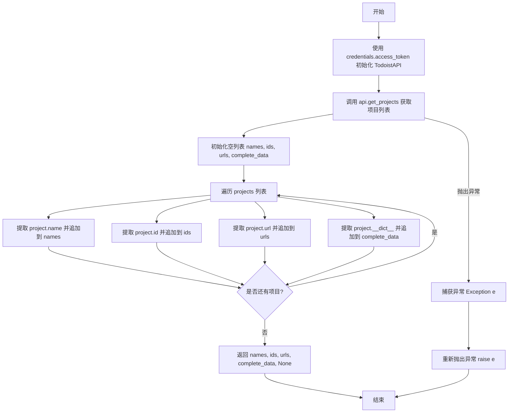

#### 带注释源码

```python
@staticmethod
def get_project_lists(credentials: TodoistCredentials):
    try:
        # 使用凭证中的访问令牌实例化 Todoist API 客户端
        api = TodoistAPI(credentials.access_token.get_secret_value())
        # 调用 API 获取当前用户的所有项目
        projects = api.get_projects()

        # 初始化用于存储不同维度的列表
        names = []
        ids = []
        urls = []
        complete_data = []

        # 遍历返回的项目对象，提取所需字段
        for project in projects:
            names.append(project.name)
            ids.append(project.id)
            urls.append(project.url)
            # 将项目对象的属性字典化，存储完整数据
            complete_data.append(project.__dict__)

        # 返回四个列表和一个 None（表示无错误），供上层 run 方法调用
        return names, ids, urls, complete_data, None

    except Exception as e:
        # 捕获执行过程中的任何异常并向上抛出
        raise e
```


### `TodoistListProjectsBlock.run`

执行获取Todoist项目列表的核心逻辑，调用辅助方法获取数据，并将项目名称、ID、URL和完整数据分步产出，同时处理可能出现的异常。

参数：

-  `input_data`：`TodoistListProjectsBlock.Input`，包含执行该块所需的输入数据（本例中主要由框架使用，具体逻辑依赖credentials参数）。
-  `credentials`：`TodoistCredentials`，用于访问Todoist API的认证凭据对象。
-  `**kwargs`：`dict`，额外的关键字参数，通常由执行框架传递。

返回值：`BlockOutput`，一个异步生成器，用于逐步产出处理结果或错误信息。

#### 流程图

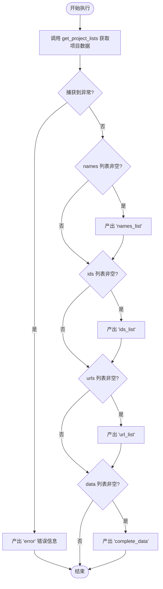

#### 带注释源码

```python
    async def run(
        self,
        input_data: Input,
        *,
        credentials: TodoistCredentials,
        **kwargs,
    ) -> BlockOutput:
        try:
            # 调用静态方法获取项目列表数据
            # 返回值包含：名称列表、ID列表、URL列表、完整数据列表、错误对象(正常执行时为None)
            names, ids, urls, data, error = self.get_project_lists(credentials)

            # 如果存在项目名称列表，则产出该数据
            if names:
                yield "names_list", names
            # 如果存在项目ID列表，则产出该数据
            if ids:
                yield "ids_list", ids
            # 如果存在项目URL列表，则产出该数据
            if urls:
                yield "url_list", urls
            # 如果存在完整数据列表，则产出该数据
            if data:
                yield "complete_data", data

        except Exception as e:
            # 如果在获取或产出过程中发生任何异常，捕获并产出错误信息
            yield "error", str(e)
```


### `TodoistCreateProjectBlock.__init__`

初始化 `TodoistCreateProjectBlock` 实例，配置其唯一标识符、输入输出 Schema、分类、测试用例及模拟行为，并将其注册到父类 Block 系统中。

参数：

-   `self`：`TodoistCreateProjectBlock`，类的实例本身。

返回值：`None`，该方法用于初始化对象，无返回值。

#### 流程图

```mermaid
graph TD
    A[开始] --> B[定义静态配置参数]
    B --> C[设置唯一ID ade60136...]
    C --> D[设置描述与分类 PRODUCTIVITY]
    D --> E[绑定 Input 与 Output Schema]
    E --> F[检查 OAuth 配置状态]
    F --> G[配置测试输入 test_input]
    G --> H[配置测试凭证 test_credentials]
    H --> I[配置测试输出与 Mock]
    I --> J[调用 super().__init__ 完成注册]
    J --> K[结束]
```

#### 带注释源码

```python
    def __init__(self):
        # 调用父类 Block 的初始化方法，传入配置参数以注册该 Block
        super().__init__(
            # Block 的唯一标识符
            id="ade60136-de14-11ef-b5e5-32d3674e8b7e",
            # Block 的功能描述文本
            description="Creates a new project in Todoist",
            # Block 所属的分类（此处为生产力类）
            categories={BlockCategory.PRODUCTIVITY},
            # 指定输入数据的 Schema 定义类
            input_schema=TodoistCreateProjectBlock.Input,
            # 指定输出数据的 Schema 定义类
            output_schema=TodoistCreateProjectBlock.Output,
            # 根据 OAuth 是否配置来决定是否禁用该 Block
            disabled=not TODOIST_OAUTH_IS_CONFIGURED,
            # 单元测试时使用的模拟输入数据
            test_input={"credentials": TEST_CREDENTIALS_INPUT, "name": "Test Project"},
            # 单元测试时使用的模拟凭证对象
            test_credentials=TEST_CREDENTIALS,
            # 单元测试时期望的输出结果
            test_output=[("success", True)],
            # 单元测试时用于模拟真实 API 调用的 Mock 函数
            test_mock={"create_project": lambda *args, **kwargs: (True)},
        )
```


### `TodoistCreateProjectBlock.create_project`

该静态方法负责在 Todoist 中创建一个新的项目。它利用提供的凭据初始化 API 客户端，根据输入参数构建请求载荷，并发起创建项目的请求。如果创建成功，该方法返回 True，否则抛出异常。

参数：

-   `credentials`：`TodoistCredentials`，包含用于认证 Todoist API 的访问令牌的凭据对象。
-   `name`：`str`，待创建项目的名称。
-   `parent_id`：`Optional[str]`，父项目的 ID，如果提供则将新项目创建为子项目。
-   `color`：`Optional[Colors]`，项目图标的颜色，使用 Colors 枚举类型。
-   `is_favorite`：`bool`，标志位，指示是否将项目标记为收藏。
-   `view_style`：`Optional[str]`，项目的显示风格（例如：列表或看板）。

返回值：`bool`，如果项目创建成功则返回 `True`。

#### 流程图

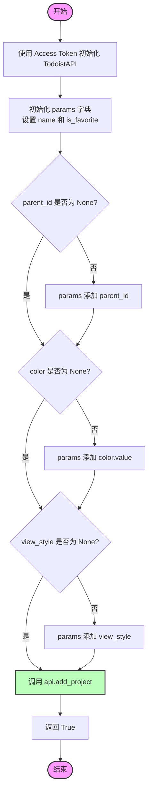

#### 带注释源码

```python
    @staticmethod
    def create_project(
        credentials: TodoistCredentials,
        name: str,
        parent_id: Optional[str],
        color: Optional[Colors],
        is_favorite: bool,
        view_style: Optional[str],
    ):
        try:
            # 使用凭据中的访问令牌实例化 Todoist API 客户端
            api = TodoistAPI(credentials.access_token.get_secret_value())
            
            # 准备基础参数，包括必填的 name 和 is_favorite
            params = {"name": name, "is_favorite": is_favorite}

            # 如果提供了 parent_id，则将其加入参数
            if parent_id is not None:
                params["parent_id"] = parent_id
            
            # 如果提供了 color，则获取其枚举值并加入参数
            if color is not None:
                params["color"] = color.value
            
            # 如果提供了 view_style，则加入参数
            if view_style is not None:
                params["view_style"] = view_style

            # 调用 Todoist API 的 add_project 方法执行创建操作
            api.add_project(**params)
            
            # 操作成功，返回 True
            return True

        except Exception as e:
            # 捕获任何异常并将其向上抛出
            raise e
```


### `TodoistCreateProjectBlock.run`

执行 Todoist 项目创建操作的异步方法。它使用用户输入和认证凭证与 Todoist API 交互，以创建具有指定属性（如名称、颜色、父级等）的新项目。

参数：

- `input_data`：`Input`，包含项目详情（名称、父 ID、颜色、是否收藏等）的输入数据对象。
- `credentials`：`TodoistCredentials`，用于身份验证的 Todoist 凭证对象。
- `**kwargs`：`dict`，其他额外的关键字参数。

返回值：`BlockOutput`，一个异步生成器，用于产出操作成功状态或捕获的错误信息。

#### 流程图

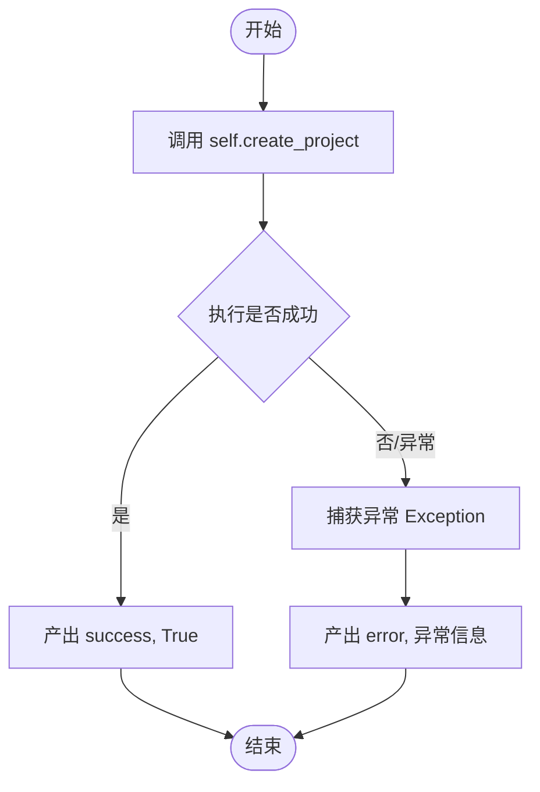

#### 带注释源码

```python
    async def run(
        self,
        input_data: Input,  # 接收输入数据对象，包含项目名称、颜色等配置
        *,
        credentials: TodoistCredentials,  # 接收认证凭证对象
        **kwargs,  # 接收其他关键字参数
    ) -> BlockOutput:  # 返回类型为 BlockOutput (Generator)
        try:
            # 调用静态方法 create_project 发起 API 请求创建项目
            success = self.create_project(
                credentials=credentials,
                name=input_data.name,
                parent_id=input_data.parent_id,
                color=input_data.color,
                is_favorite=input_data.is_favorite,
                view_style=input_data.view_style,
            )

            # 如果成功，产出 "success" 键和 True 值
            yield "success", success

        except Exception as e:
            # 如果在创建过程中发生任何异常，产出 "error" 键和异常信息
            yield "error", str(e)
```


### `TodoistGetProjectBlock.__init__`

该方法是 `TodoistGetProjectBlock` 类的构造函数，负责初始化用于获取特定 Todoist 项目详情的 Block。它通过调用父类的构造函数，配置了该块的唯一标识符、描述、输入输出 Schema、分类、测试数据以及模拟函数，确立了该块的运行时元数据和行为定义。

参数：

- `self`：`TodoistGetProjectBlock`，指向类实例本身的引用，用于在 Python 中初始化对象属性。

返回值：`None`，构造函数不返回任何值。

#### 流程图

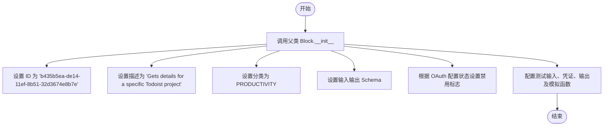

#### 带注释源码

```python
def __init__(self):
    # 调用父类 Block 的构造函数，传入定义该块行为和元数据的参数
    super().__init__(
        # 块的唯一标识符 (UUID)
        id="b435b5ea-de14-11ef-8b51-32d3674e8b7e",
        # 块的功能描述
        description="Gets details for a specific Todoist project",
        # 块所属的分类，此处为生产力工具
        categories={BlockCategory.PRODUCTIVITY},
        # 定义输入数据的 Schema 结构（内嵌类 Input）
        input_schema=TodoistGetProjectBlock.Input,
        # 定义输出数据的 Schema 结构（内嵌类 Output）
        output_schema=TodoistGetProjectBlock.Output,
        # 根据环境变量 TODOIST_OAUTH_IS_CONFIGURED 设置块是否禁用
        disabled=not TODOIST_OAUTH_IS_CONFIGURED,
        # 定义用于测试的输入数据，包含测试凭证和项目 ID
        test_input={
            "credentials": TEST_CREDENTIALS_INPUT,
            "project_id": "2203306141",
        },
        # 定义测试使用的凭证对象
        test_credentials=TEST_CREDENTIALS,
        # 定义预期的测试输出结果元组列表
        test_output=[
            ("project_id", "2203306141"),
            ("project_name", "Shopping List"),
            ("project_url", "https://todoist.com/showProject?id=2203306141"),
            (
                "complete_data",
                {
                    "id": "2203306141",
                    "name": "Shopping List",
                    "url": "https://todoist.com/showProject?id=2203306141",
                },
            ),
        ],
        # 定义测试时的模拟行为，避免实际调用 API
        test_mock={
            "get_project": lambda *args, **kwargs: (
                "2203306141",
                "Shopping List",
                "https://todoist.com/showProject?id=2203306141",
                {
                    "id": "2203306141",
                    "name": "Shopping List",
                    "url": "https://todoist.com/showProject?id=2203306141",
                },
            )
        },
    )
```


### `TodoistGetProjectBlock.get_project`

该方法通过项目ID从Todoist获取特定项目的详细信息，并返回项目的基本字段和完整数据字典。

参数：

- `credentials`：`TodoistCredentials`，包含访问令牌的认证凭证对象
- `project_id`：`str`，需要获取详情的项目ID

返回值：`tuple[str, str, str, dict]`，包含项目ID、项目名称、项目URL以及包含所有字段的项目完整数据字典的元组。

#### 流程图

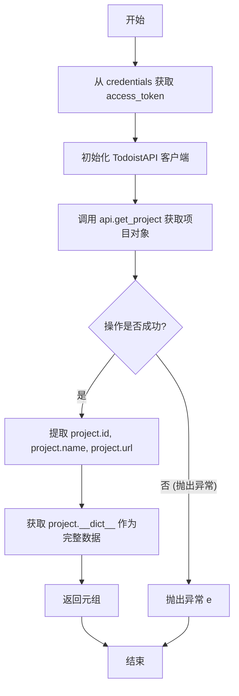

#### 带注释源码

```python
    @staticmethod
    def get_project(credentials: TodoistCredentials, project_id: str):
        try:
            # 使用凭证中的访问令牌初始化 TodoistAPI 客户端
            api = TodoistAPI(credentials.access_token.get_secret_value())
            # 调用 API 获取指定 ID 的项目对象
            project = api.get_project(project_id=project_id)

            # 返回项目的 ID、名称、URL 以及对象的字典表示（完整数据）
            return project.id, project.name, project.url, project.__dict__

        except Exception as e:
            # 捕获异常并重新抛出，由上层调用处理
            raise e
```


### `TodoistGetProjectBlock.run`

该方法负责执行获取特定 Todoist 项目详细信息的逻辑。它接收包含项目 ID 的输入数据和认证凭据，调用 Todoist API 获取项目详情，并将解析后的项目 ID、名称、URL 及完整数据生成器输出，同时处理可能发生的异常。

参数：

- `input_data`：`Input`，包含项目 ID 和认证凭据输入的架构化数据对象。
- `credentials`：`TodoistCredentials`，经过验证的 Todoist API 认证凭据对象，用于 API 访问。
- `**kwargs`：`dict`，额外的关键字参数，用于扩展或传递上下文信息。

返回值：`BlockOutput`，一个异步生成器，逐步产生项目数据的键值对（如 `project_id`, `project_name`, `project_url`, `complete_data`）或错误信息。

#### 流程图

```mermaid
flowchart TD
    Start([开始]) --> TryBlock[开始 try 块]
    TryBlock --> CallMethod[调用 self.get_project<br/>获取项目数据]
    CallMethod --> UnpackData[解包返回数据:<br/>project_id, project_name, project_url, data]
    
    UnpackData --> CheckID{project_id 存在?}
    CheckID -- 是 --> YieldID[输出 project_id]
    CheckID -- 否 --> CheckName
    
    YieldID --> CheckName{project_name 存在?}
    CheckName -- 是 --> YieldName[输出 project_name]
    CheckName -- 否 --> CheckURL
    
    YieldName --> CheckURL{project_url 存在?}
    CheckURL -- 是 --> YieldURL[输出 project_url]
    CheckURL -- 否 --> CheckData
    
    YieldURL --> CheckData{data 存在?}
    CheckData -- 是 --> YieldData[输出 complete_data]
    CheckData -- 否 --> EndTry
    
    YieldData --> EndTry([结束 try 块])
    
    TryBlock -.-> CatchException[捕获 Exception e]
    CatchException --> YieldError[输出 error: str(e)]
    YieldError --> End([结束])
    
    EndTry --> End
```

#### 带注释源码

```python
async def run(
    self,
    input_data: Input,
    *,
    credentials: TodoistCredentials,
    **kwargs,
) -> BlockOutput:
    try:
        # 调用静态辅助方法获取项目详细信息
        # 传入凭据和从 input_data 中提取的项目 ID
        project_id, project_name, project_url, data = self.get_project(
            credentials=credentials, project_id=input_data.project_id
        )

        # 如果获取到项目 ID，则输出 project_id 字段
        if project_id:
            yield "project_id", project_id
        
        # 如果获取到项目名称，则输出 project_name 字段
        if project_name:
            yield "project_name", project_name
        
        # 如果获取到项目 URL，则输出 project_url 字段
        if project_url:
            yield "project_url", project_url
        
        # 如果获取到完整数据字典，则输出 complete_data 字段
        if data:
            yield "complete_data", data

    # 捕获运行过程中出现的任何异常
    except Exception as e:
        # 将异常信息作为 "error" 字段输出
        yield "error", str(e)
```


### `TodoistUpdateProjectBlock.__init__`

该方法用于初始化 `TodoistUpdateProjectBlock` 类的实例，配置了块的ID、描述、分类、输入输出Schema以及用于单元测试的模拟数据和测试凭证。

参数：

-  `self`：`TodoistUpdateProjectBlock`，表示类实例本身。

返回值：`None`，Python 构造函数不返回任何值。

#### 流程图

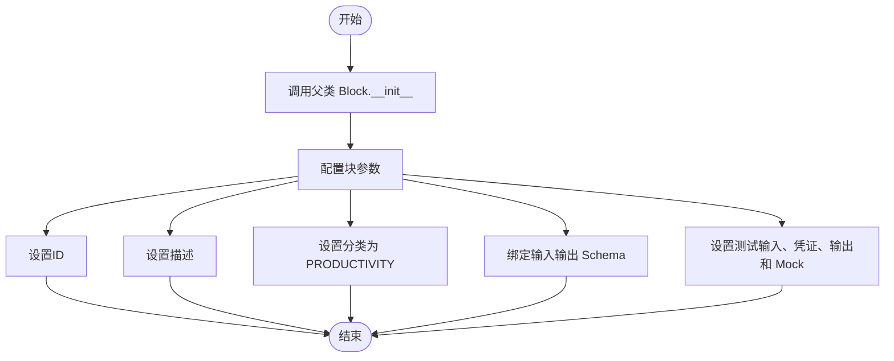

#### 带注释源码

```python
def __init__(self):
    # 调用父类 Block 的初始化方法，注册块的元数据和测试配置
    super().__init__(
        id="ba41a20a-de14-11ef-91d7-32d3674e8b7e",  # 块的唯一标识符
        description="Updates an existing project in Todoist",  # 块的功能描述
        categories={BlockCategory.PRODUCTIVITY},  # 块所属的分类
        input_schema=TodoistUpdateProjectBlock.Input,  # 定义的输入 Schema 类
        output_schema=TodoistUpdateProjectBlock.Output,  # 定义的输出 Schema 类
        disabled=not TODOIST_OAUTH_IS_CONFIGURED,  # 根据 OAuth 是否配置来决定是否禁用该块
        test_input={  # 定义用于测试的输入数据
            "credentials": TEST_CREDENTIALS_INPUT,
            "project_id": "2203306141",
            "name": "Things To Buy",
        },
        test_credentials=TEST_CREDENTIALS,  # 定义用于测试的凭证对象
        test_output=[("success", True)],  # 定义预期的测试输出结果
        test_mock={  # 定义测试时的模拟行为，替换实际的 API 调用
            "update_project": lambda *args, **kwargs: (True),
        },
    )
```


### `TodoistUpdateProjectBlock.update_project`

该静态方法负责通过 Todoist API 更新现有项目的属性。它接受认证信息、项目 ID 和一系列可选的更新参数（如名称、颜色等），构建参数字典后调用 API 执行更新操作。

参数：

-   `credentials`：`TodoistCredentials`，包含访问 Todoist API 所需的认证令牌信息。
-   `project_id`：`str`，需要更新的项目的唯一标识符。
-   `name`：`Optional[str]`，项目的新名称。如果为 None，则不更新此项。
-   `color`：`Optional[Colors]`，项目图标的新颜色枚举值。如果为 None，则不更新此项。
-   `is_favorite`：`Optional[bool]`，项目是否设为收藏状态。如果为 None，则不更新此项。
-   `view_style`：`Optional[str]`，项目的显示样式（如列表或看板）。如果为 None，则不更新此项。

返回值：`bool`，更新成功返回 True；如果过程中发生错误，抛出异常。

#### 流程图

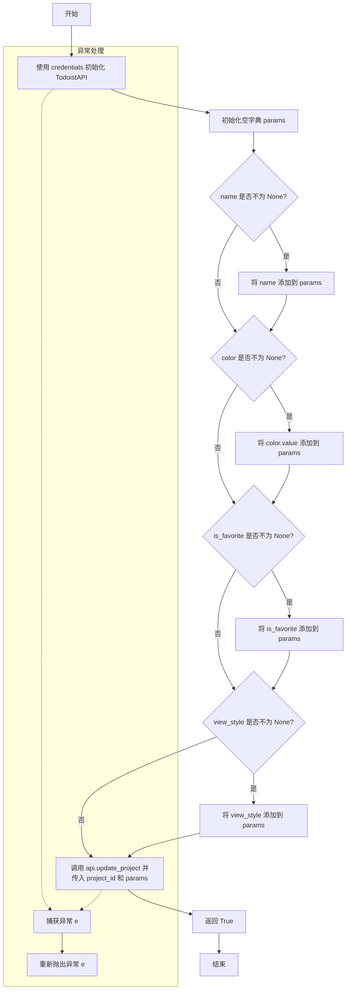

#### 带注释源码

```python
    @staticmethod
    def update_project(
        credentials: TodoistCredentials,
        project_id: str,
        name: Optional[str],
        color: Optional[Colors],
        is_favorite: Optional[bool],
        view_style: Optional[str],
    ):
        try:
            # 使用凭证中的访问令牌初始化 Todoist API 客户端
            api = TodoistAPI(credentials.access_token.get_secret_value())
            # 初始化参数字典，仅包含需要更新的字段
            params = {}

            # 如果提供了新名称，则加入参数
            if name is not None:
                params["name"] = name
            # 如果提供了新颜色，则提取其值并加入参数
            if color is not None:
                params["color"] = color.value
            # 如果提供了收藏状态，则加入参数
            if is_favorite is not None:
                params["is_favorite"] = is_favorite
            # 如果提供了视图风格，则加入参数
            if view_style is not None:
                params["view_style"] = view_style

            # 调用 API 的 update_project 方法执行更新
            api.update_project(project_id=project_id, **params)
            # 返回 True 表示操作成功完成
            return True

        except Exception as e:
            # 捕获任何异常并重新抛出，由上层处理错误信息
            raise e
```


### `TodoistUpdateProjectBlock.run`

协调更新 Todoist 项目的执行流程，负责处理输入数据、调用底层更新逻辑，并通过生成器返回操作结果或错误信息。

参数：

-  `self`：`TodoistUpdateProjectBlock`，类实例自身。
-  `input_data`：`Input`，包含项目更新所需的输入字段，如 `project_id`、`name`、`color` 等。
-  `credentials`：`TodoistCredentials`，用于 Todoist API 认证的凭据对象。
-  `**kwargs`：`dict`，扩展用的额外关键字参数。

返回值：`BlockOutput`，异步生成器，产出包含 `success` 状态或 `error` 信息的键值对。

#### 流程图

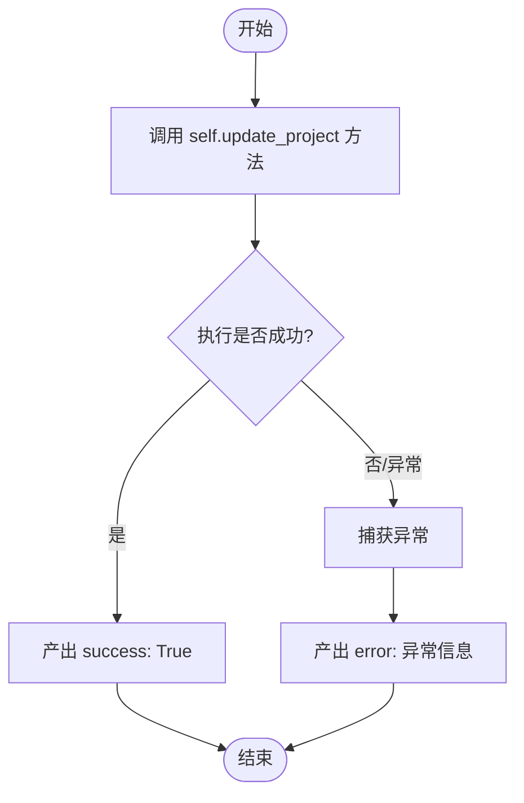

#### 带注释源码

```python
    async def run(
        self,
        input_data: Input,
        *,
        credentials: TodoistCredentials,
        **kwargs,
    ) -> BlockOutput:
        try:
            # 调用静态方法 update_project 执行实际的 API 更新操作
            # 传入凭据和从 input_data 中提取的各个字段
            success = self.update_project(
                credentials=credentials,
                project_id=input_data.project_id,
                name=input_data.name,
                color=input_data.color,
                is_favorite=input_data.is_favorite,
                view_style=input_data.view_style,
            )

            # 如果更新成功，产出 success 字段和结果 True
            yield "success", success

        except Exception as e:
            # 捕获执行过程中的任何异常，产出 error 字段和异常信息
            yield "error", str(e)
```


### `TodoistDeleteProjectBlock.__init__`

该方法是 `TodoistDeleteProjectBlock` 类的构造函数，负责初始化删除 Todoist 项目的 Block 实例。它配置了 Block 的元数据（如 ID、描述、分类），定义了输入输出 Schema，并根据 Todoist OAuth 配置状态设置是否禁用该 Block，同时预设了测试用的输入、输出和模拟函数。

参数：

- `self`：`TodoistDeleteProjectBlock`，指代类实例本身。

返回值：`None`，构造函数不返回任何值。

#### 流程图

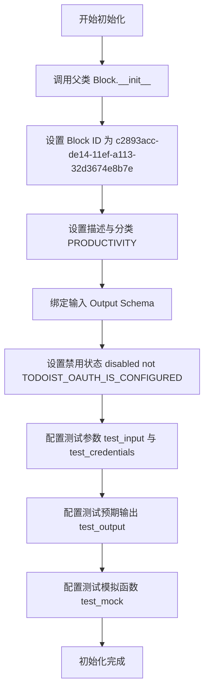

#### 带注释源码

```python
def __init__(self):
    super().__init__(
        id="c2893acc-de14-11ef-a113-32d3674e8b7e",  # 唯一标识符，用于区分该 Block
        description="Deletes a Todoist project and all its contents",  # Block 的功能描述
        categories={BlockCategory.PRODUCTIVITY},  # 归属于生产力类目
        input_schema=TodoistDeleteProjectBlock.Input,  # 定义输入数据的 Schema（包含凭证和项目 ID）
        output_schema=TodoistDeleteProjectBlock.Output,  # 定义输出数据的 Schema（包含成功状态）
        disabled=not TODOIST_OAUTH_IS_CONFIGURED,  # 如果 OAuth 未配置，则禁用此 Block
        test_input={  # 定义单元测试时的输入数据样本
            "credentials": TEST_CREDENTIALS_INPUT,
            "project_id": "2203306141",
        },
        test_credentials=TEST_CREDENTIALS,  # 定义单元测试时使用的凭证
        test_output=[("success", True)],  # 定义单元测试时的预期输出结果
        test_mock={  # 定义 Mock 函数，用于在测试时模拟真实 API 调用，避免实际删除项目
            "delete_project": lambda *args, **kwargs: (True)
        },
    )
```


### `TodoistDeleteProjectBlock.delete_project`

删除指定的 Todoist 项目及其所有内容。

参数：

-  `credentials`：`TodoistCredentials`，用于验证请求的凭证对象，包含访问令牌。
-  `project_id`：`str`，要删除的项目的唯一标识符。

返回值：`bool`，表示删除操作是否成功的状态。

#### 流程图

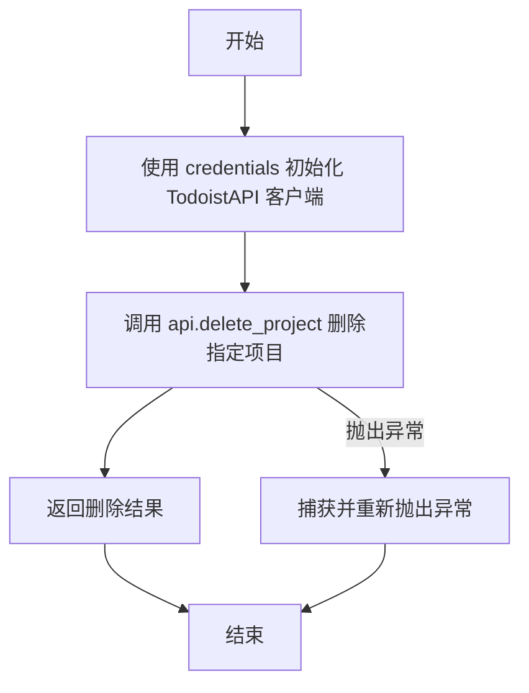

#### 带注释源码

```python
    @staticmethod
    def delete_project(credentials: TodoistCredentials, project_id: str):
        try:
            # 使用凭证中的访问令牌初始化 Todoist API 客户端实例
            api = TodoistAPI(credentials.access_token.get_secret_value())
            
            # 调用 API 的 delete_project 方法执行删除操作
            success = api.delete_project(project_id=project_id)
            
            # 返回操作结果
            return success

        except Exception as e:
            # 捕获执行过程中的任何异常并抛出
            raise e
```


### `TodoistDeleteProjectBlock.run`

该方法是 `TodoistDeleteProjectBlock` 的核心执行逻辑，负责使用提供的凭据和项目 ID 调用 Todoist API 删除指定的项目，并返回操作成功状态或捕获到的错误信息。

参数：

- `self`：`TodoistDeleteProjectBlock`，类的实例。
- `input_data`：`Input`，包含输入数据的对象，其中包含需要删除的项目 ID (`project_id`)。
- `credentials`：`TodoistCredentials`，用于认证的 Todoist 凭据对象。
- `**kwargs`：`dict`，扩展用的关键字参数。

返回值：`BlockOutput`，一个异步生成器，用于产出包含 "success" 键的成功标志或包含 "error" 键的错误信息字符串。

#### 流程图

```mermaid
flowchart TD
    A([开始]) --> B[调用 self.delete_project<br>传入 credentials 和 project_id]
    B --> C{是否发生异常?}
    C -- 是 --> D[捕获异常 Exception e]
    D --> E[输出 error, str(e)]
    C -- 否 --> F[获取返回结果 success]
    F --> G[输出 success, success]
    E --> H([结束])
    G --> H
```

#### 带注释源码

```python
async def run(
    self,
    input_data: Input,
    *,
    credentials: TodoistCredentials,
    **kwargs,
) -> BlockOutput:
    try:
        # 调用类的静态方法 delete_project 执行实际的删除操作
        success = self.delete_project(
            credentials=credentials, project_id=input_data.project_id
        )

        # 如果没有异常，输出 success 标志和结果
        yield "success", success

    except Exception as e:
        # 如果过程中发生任何异常，捕获并输出 error 信息
        yield "error", str(e)
```


### `TodoistListCollaboratorsBlock.__init__`

该方法用于初始化 `TodoistListCollaboratorsBlock` 类实例。它通过调用父类 `Block` 的构造函数，配置了该块的唯一标识符、描述、分类、输入/输出架构、测试数据以及基于 OAuth 配置状态的启用/禁用标志。

参数：

- `self`：`TodoistListCollaboratorsBlock`，指代类实例本身。

返回值：`None`，无返回值。

#### 流程图

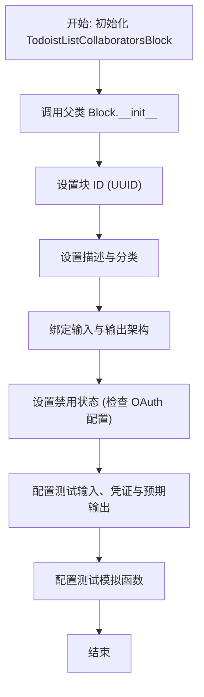

#### 带注释源码

```python
def __init__(self):
    # 调用父类 Block 的构造函数，传入必要的元数据和配置
    super().__init__(
        # 定义该块的唯一标识符
        id="c99c804e-de14-11ef-9f47-32d3674e8b7e",
        # 描述该块的功能：获取特定 Todoist 项目的所有协作者
        description="Gets all collaborators for a specific Todoist project",
        # 定义块所属的分类，此处为生产力类
        categories={BlockCategory.PRODUCTIVITY},
        # 指定输入数据的 Schema 定义
        input_schema=TodoistListCollaboratorsBlock.Input,
        # 指定输出数据的 Schema 定义
        output_schema=TodoistListCollaboratorsBlock.Output,
        # 根据 TODOIST_OAUTH_IS_CONFIGURED 全局变量决定是否禁用该块
        disabled=not TODOIST_OAUTH_IS_CONFIGURED,
        # 定义用于测试的输入参数
        test_input={
            "credentials": TEST_CREDENTIALS_INPUT,
            "project_id": "2203306141",
        },
        # 定义用于测试的凭证对象
        test_credentials=TEST_CREDENTIALS,
        # 定义执行测试后预期的输出结果
        test_output=[
            ("collaborator_ids", ["2671362", "2671366"]),
            ("collaborator_names", ["Alice", "Bob"]),
            ("collaborator_emails", ["alice@example.com", "bob@example.com"]),
            (
                "complete_data",
                [
                    {
                        "id": "2671362",
                        "name": "Alice",
                        "email": "alice@example.com",
                    },
                    {"id": "2671366", "name": "Bob", "email": "bob@example.com"},
                ],
            ),
        ],
        # 定义测试时用于模拟 get_collaborators 方法的 Lambda 函数
        test_mock={
            "get_collaborators": lambda *args, **kwargs: (
                ["2671362", "2671366"],
                ["Alice", "Bob"],
                ["alice@example.com", "bob@example.com"],
                [
                    {
                        "id": "2671362",
                        "name": "Alice",
                        "email": "alice@example.com",
                    },
                    {"id": "2671366", "name": "Bob", "email": "bob@example.com"},
                ],
            )
        },
    )
```


### `TodoistListCollaboratorsBlock.get_collaborators`

根据提供的凭据和项目ID，从Todoist API检索指定项目的所有协作者信息，并将提取的数据（ID、名称、邮箱）及其原始数据结构返回。

参数：

-  `credentials`：`TodoistCredentials`，用于身份验证的凭据对象，包含访问Todoist API所需的令牌。
-  `project_id`：`str`，需要获取协作者信息的Todoist项目的唯一标识符。

返回值：`tuple[list[str], list[str], list[str], list[dict]]`，返回一个包含四个元素的元组：分别是协作者ID列表、协作者名称列表、协作者邮箱列表以及包含完整字段数据的字典列表。

#### 流程图

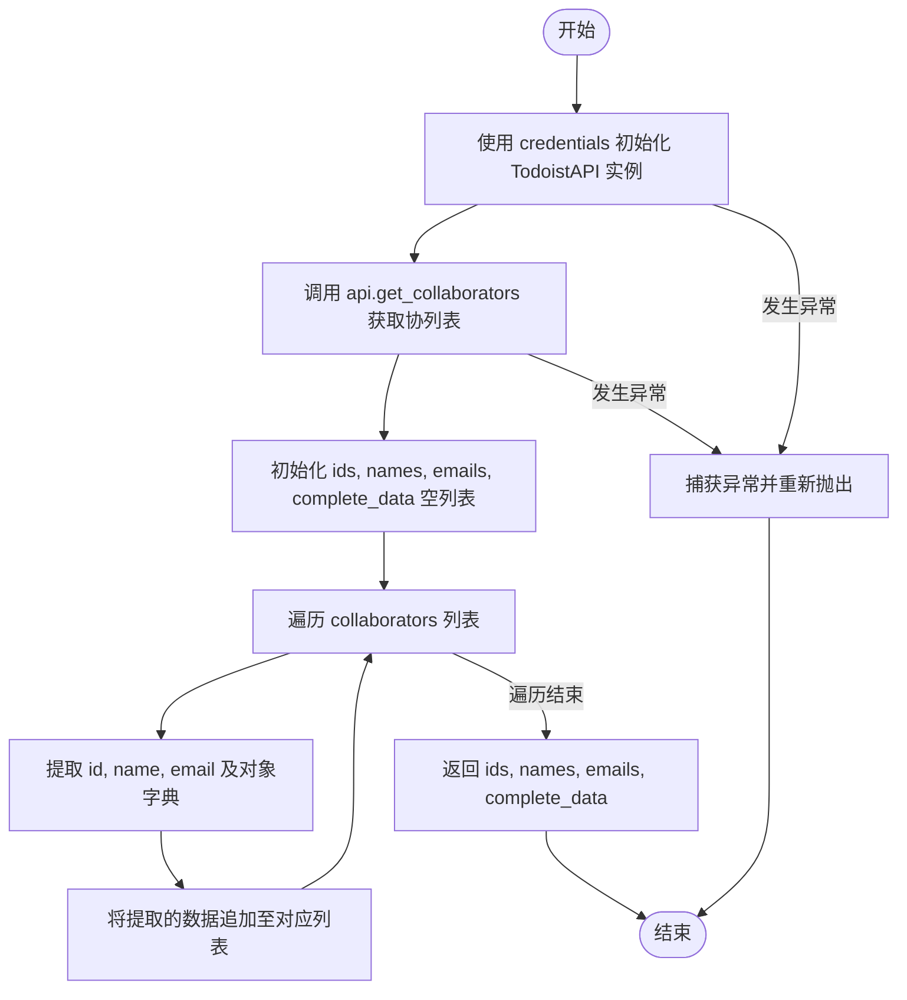

#### 带注释源码

```python
    @staticmethod
    def get_collaborators(credentials: TodoistCredentials, project_id: str):
        try:
            # 使用凭据中的访问令牌初始化 TodoistAPI 客户端
            api = TodoistAPI(credentials.access_token.get_secret_value())
            # 调用 API 获取指定项目的协作者列表
            collaborators = api.get_collaborators(project_id=project_id)

            # 初始化用于存储提取信息的列表
            ids = []
            names = []
            emails = []
            complete_data = []

            # 遍历返回的协作者对象
            for collaborator in collaborators:
                ids.append(collaborator.id)
                names.append(collaborator.name)
                emails.append(collaborator.email)
                # 将对象的属性字典存储在完整数据列表中
                complete_data.append(collaborator.__dict__)

            # 返回提取的四个列表
            return ids, names, emails, complete_data

        except Exception as e:
            # 捕获并重新抛出异常，由上层调用者处理
            raise e
```


### `TodoistListCollaboratorsBlock.run`

该方法是 `TodoistListCollaboratorsBlock` 的核心执行逻辑，负责根据提供的项目 ID 和认证凭据，获取指定 Todoist 项目的所有协作者信息，并将协作者的 ID、姓名、邮箱及完整数据结构依次产出，同时处理可能出现的异常情况。

参数：

- `input_data`：`Input`，包含 `project_id`（项目ID）的输入数据结构体。
- `credentials`：`TodoistCredentials`，用于访问 Todoist API 的认证凭据对象（通过关键字参数传入）。
- `**kwargs`：`dict`，接收其他额外的关键字参数。

返回值：`BlockOutput`，一个异步生成器，按顺序产出包含协作者列表数据（IDs, Names, Emails, Data）的键值对，或在发生错误时产出错误信息。

#### 流程图

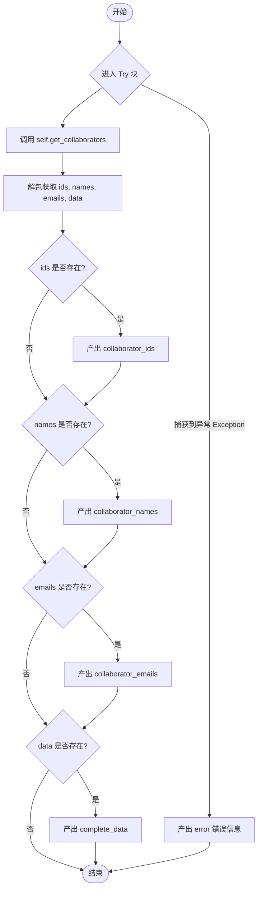

#### 带注释源码

```python
async def run(
    self,
    input_data: Input,
    *,
    credentials: TodoistCredentials,
    **kwargs,
) -> BlockOutput:
    try:
        # 调用静态方法 get_collaborators 获取协作者数据
        # 传入凭据和从 input_data 中提取的项目 ID
        ids, names, emails, data = self.get_collaborators(
            credentials=credentials, project_id=input_data.project_id
        )

        # 如果协作者 ID 列表不为空，则产出该列表
        if ids:
            yield "collaborator_ids", ids
        # 如果协作者姓名列表不为空，则产出该列表
        if names:
            yield "collaborator_names", names
        # 如果协作者邮箱列表不为空，则产出该列表
        if emails:
            yield "collaborator_emails", emails
        # 如果完整数据列表不为空，则产出该列表
        if data:
            yield "complete_data", data

    except Exception as e:
        # 如果执行过程中发生任何异常，捕获并产出错误信息
        yield "error", str(e)
```


## 关键组件


### Todoist 项目检索逻辑
实现了从 Todoist API 获取所有项目列表或指定项目详情的功能，负责解析 API 响应并输出项目名称、ID、URL 等关键信息。

### Todoist 项目管理逻辑
负责执行项目的创建、更新和删除操作，支持设置项目名称、颜色、父级 ID、收藏状态及视图样式等属性，以维护项目的生命周期。

### Todoist 协作者管理逻辑
提供获取特定项目协作者列表的功能，能够提取协作者的 ID、名称和电子邮件地址，并返回包含所有字段的完整数据对象。

### 认证与授权机制
封装了 Todoist API 的认证流程，通过处理凭证输入和访问令牌的获取，确保系统与 Todoist 服务的安全交互。


## 问题及建议


### 已知问题

-   **异步上下文中的阻塞 I/O 调用**：`Block` 类的 `run` 方法是异步的（`async def`），但在静态方法中调用的 `TodoistAPI` 是同步库。直接在 `async` 方法中调用同步网络请求会阻塞事件循环，降低高并发场景下的系统吞吐量。
-   **脆弱的对象序列化依赖**：在 `TodoistListProjectsBlock`、`TodoistGetProjectBlock` 等类的静态方法中，使用 `project.__dict__` 或 `collaborator.__dict__` 来生成 `complete_data`。这种实现方式强依赖于第三方 SDK 对象的内部结构，一旦 `todoist_api_python` 库更新其内部属性命名或结构，输出格式将立即损坏。
-   **无效的异常处理逻辑**：多个静态方法（如 `get_project_lists`）中使用了 `try...except Exception as e: raise e` 的模式。这种写法除了重新抛出异常外没有任何附加价值，反而增加了不必要的栈跟踪层级，且丢失了原始异常的部分上下文（取决于 Python 版本）。
-   **冗余的返回值解包**：在 `TodoistListProjectsBlock` 中，`get_project_lists` 返回一个包含 5 个元素的元组，其中第 5 个元素 `error` 总是 `None`（因为异常被直接抛出）。在 `run` 方法中对其解包但从未使用，属于遗留的死代码。
-   **缺乏具体的异常捕获**：代码统一捕获 `Exception`，这使得无法区分网络错误、认证错误或业务逻辑错误（如项目不存在）。框架层难以根据错误类型做出重试或熔断决策。

### 优化建议

-   **引入异步执行器处理阻塞调用**：建议使用 `asyncio.to_thread` 或在线程池执行器中运行同步的 `TodoistAPI` 调用，以避免阻塞事件循环，保持系统的异步响应能力。
-   **使用显式字典映射或 Pydantic 模型**：替换 `.__dict__` 调用，显式定义从 API 对象到输出字典的字段映射关系。这解耦了对 SDK 内部实现的依赖，提高了代码的健壮性和可维护性。
-   **封装 API 客户端初始化逻辑**：创建一个基类或辅助函数来统一处理 `TodoistAPI` 实例的创建（包括 Token 获取），消除在每个静态方法中重复编写 `api = TodoistAPI(...)` 的代码冗余。
-   **细化异常处理策略**：移除静态方法中无意义的 `try-except` 块，将异常向上传播至 `run` 方法。在 `run` 方法中根据捕获的具体异常类型（如 `HTTPError`, `UnauthorizedError`）输出不同的错误信息或状态码，便于上层逻辑处理。
-   **清理未使用的代码和变量**：移除 `get_project_lists` 返回元组中无用的 `error` 占位符，简化函数签名和返回逻辑。
-   **增加输入校验**：在调用 API 之前，对关键字段（如 `project_id`）进行非空或格式校验，快速失败以避免无效的网络请求。


## 其它


### 设计目标与约束

本模块旨在将 Todoist 的项目管理功能（增删改查及协作者管理）无缝集成到基于 Block 架构的自动化工作流平台中。设计遵循以下目标与约束：

1.  **模块化与继承约束**：所有功能块必须继承自 `backend.data.block.Block` 基类，并严格实现 `Input`、`Output` 嵌套类以及 `run` 方法，以符合平台的插件标准。
2.  **条件可用性**：Block 的启用状态依赖于 `TODOIST_OAUTH_IS_CONFIGURED` 标志，确保只有在 OAuth 配置正确时才暴露功能。
3.  **统一认证机制**：强制使用 `TodoistCredentialsInput` 和 `TodoistCredentials` 进行身份验证，隐藏底层 Token 的处理细节，通过 `access_token` 与外部 API 交互。
4.  **异步接口契约**：尽管外部依赖库 `todoist_api_python` 是同步的，但 `run` 方法必须设计为 `async`，以适应平台的异步事件循环调度机制。
5.  **数据适配**：将外部 API 返回的复杂对象（如 Project 对象）转换为平台通用的基础类型（如 `dict`, `list[str]`），以便于在不同 Block 间传递。

### 错误处理与异常设计

代码采用统一且防御性的错误处理策略，具体设计如下：

1.  **捕获与转换**：在每个 Block 的 `run` 方法入口处包裹 `try-except Exception as e` 块。这意味着无论是网络异常、认证失败还是数据处理错误，都会被捕获。
2.  **错误输出标准化**：捕获异常后，不直接抛出导致流程中断，而是通过 `yield "error", str(e)` 生成一个标准的错误输出项。这使得下游逻辑可以根据 "error" 键的存在判断执行状态。
3.  **静态方法传播**：辅助静态方法（如 `get_project_lists`, `create_project`）内部的异常通常不自行处理，而是直接 `raise` 或利用 Python 默认的异常传播机制，将控制权交还给 `run` 方法进行统一捕获和封装。

### 数据流与状态机

**数据流**：
数据流向是单向且无状态的，遵循严格的输入-处理-输出模型：
1.  **输入阶段**：平台注入 `input_data`（包含业务参数）和 `credentials`（认证信息）。
2.  **解析阶段**：`run` 方法提取 `credentials.access_token` 并实例化 `TodoistAPI`。
3.  **交互阶段**：调用 `TodoistAPI` 的同步方法（如 `get_projects`, `add_project`）与远程服务通信。
4.  **转换阶段**：遍历 API 返回的对象集合，提取特定字段（如 `id`, `name`）或调用 `__dict__` 序列化整个对象，构建输出列表或字典。
5.  **输出阶段**：使用 `yield` 关键字逐个生成结果键值对（如 `names_list`, `success`）。

**状态机**：
本模块中的 Block 是无状态的，没有内部状态转换。每次调用 `run` 都是独立的，不依赖于前一次调用的上下文。

### 外部依赖与接口契约

**外部库依赖**：
-   **`todoist_api_python.api.TodoistAPI`**：
    -   **契约**：提供构造函数接收 `token` 字符串。
    -   **契约**：提供一系列方法对应 Todoist REST API，如 `get_projects()`, `get_project(project_id)`, `add_project(**kwargs)`, `update_project(project_id, **kwargs)`, `delete_project(project_id)`, `get_collaborators(project_id)`。
    -   **假设**：这些方法在成功时返回数据对象或 `True`，失败时抛出异常。

**内部模块依赖**：
-   **`backend.data.block`**：定义了 `Block`, `BlockOutput`, `BlockSchemaInput`, `BlockSchemaOutput` 等基类和类型别名，是 Block 运行时的基础设施。
-   **`backend.blocks.todoist._auth`**：提供了认证字段的 UI 定义（`TodoistCredentialsField`）和凭证验证逻辑，确保输入的 Token 是有效的。

### 测试策略与模拟机制

本模块包含了详尽的测试支持设计，主要通过以下方式实现：

1.  **Mock 注入**：每个 Block 类在 `__init__` 中定义了 `test_mock` 字典。
2.  **静态方法替换**：`test_mock` 的键为静态方法名（如 `"create_project"`），值为 `lambda` 函数。在测试环境中，框架会将实际的静态方法替换为这些 lambda 函数。
3.  **隔离网络请求**：通过 Mocking，完全隔离了 `TodoistAPI` 的真实网络调用。Lambda 函数直接返回预定义的、符合 `Output` Schema 的测试数据（如特定的 ID 列表或布尔值）。
4.  **测试数据覆盖**：`test_input` 和 `test_output` 定义了典型的业务场景数据，配合 Mock 机制，验证 Block 在无需真实后端的情况下的逻辑正确性（包括字段映射和异常处理流程）。

### 潜在的技术债务与优化空间

尽管代码结构清晰，但仍存在以下可优化的技术债务：

1.  **同步 I/O 阻塞**：当前实现在 `async def run` 方法中直接调用了同步的 `TodoistAPI`。在高并发场景下，同步的网络请求会阻塞事件循环，降低平台的整体吞吐量。建议未来迁移到支持 `async/await` 的 HTTP 客户端（如 `httpx`）或使用 `run_in_executor` 将同步调用卸载到线程池中。
2.  **通用的异常捕获**：目前所有异常都被捕获并转为字符串输出。这可能导致底层具体的错误信息（如 HTTP 404 vs 403）丢失，不利于调试精确的权限或资源问题。建议细化异常捕获类型，并输出结构化的错误码。
3.  **硬编码的参数处理**：在 `TodoistCreateProjectBlock` 和 `TodoistUpdateProjectBlock` 中，参数字典 `params` 的构建是通过一系列 `if` 判断手动完成的。对于参数较多的 Block，这种方式显得冗长且易错，可以考虑引入 `pydantic` 的模型导出功能或构建通用的参数过滤工具函数。

    