# `.\AutoGPT\autogpt_platform\backend\backend\blocks\todoist\sections.py` 详细设计文档

This code provides a set of blocks for interacting with Todoist API, including listing sections, creating sections, and deleting sections.

## 整体流程

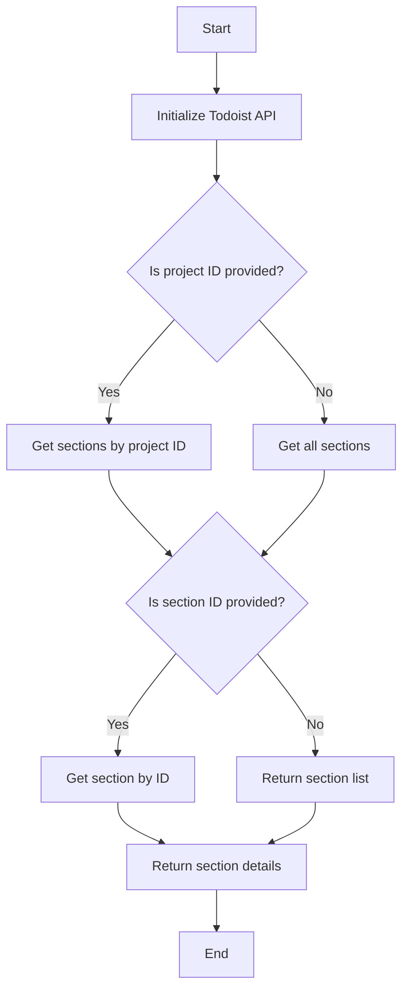

## 类结构

```
TodoistListSectionsBlock (Block)
├── Input (BlockSchemaInput)
│   ├── credentials (TodoistCredentialsInput)
│   └── project_id (Optional[str])
│       └── SchemaField
│           └── description
└── Output (BlockSchemaOutput)
    ├── names_list (list[str])
    ├── ids_list (list[str])
    └── complete_data (list[dict])
├── TodoistGetSectionBlock (Block)
│   ├── Input (BlockSchemaInput)
│   │   ├── credentials (TodoistCredentialsInput)
│   │   └── section_id (str)
│   │       └── SchemaField
│   │           └── description
│   └── Output (BlockSchemaOutput)
│    ├── id (str)
│    ├── project_id (str)
│    ├── order (int)
│    └── name (str)
└── TodoistDeleteSectionBlock (Block)
    ├── Input (BlockSchemaInput)
    │   ├── credentials (TodoistCredentialsInput)
    │   └── section_id (str)
    │       └── SchemaField
    │           └── description
    └── Output (BlockSchemaOutput)
    ├── success (bool)
    └── error (str)
```

## 全局变量及字段


### `TEST_CREDENTIALS`
    
Test credentials for Todoist API

类型：`TodoistCredentials`
    


### `TEST_CREDENTIALS_INPUT`
    
Test input for Todoist credentials

类型：`TodoistCredentialsInput`
    


### `TODOIST_OAUTH_IS_CONFIGURED`
    
Flag indicating if Todoist OAuth is configured

类型：`bool`
    


### `TodoistListSectionsBlock.id`
    
Unique identifier for the block

类型：`str`
    


### `TodoistListSectionsBlock.description`
    
Description of the block's functionality

类型：`str`
    


### `TodoistListSectionsBlock.categories`
    
Categories the block belongs to

类型：`set`
    


### `TodoistListSectionsBlock.input_schema`
    
Input schema for the block

类型：`BlockSchemaInput`
    


### `TodoistListSectionsBlock.output_schema`
    
Output schema for the block

类型：`BlockSchemaOutput`
    


### `TodoistListSectionsBlock.disabled`
    
Flag indicating if the block is disabled

类型：`bool`
    


### `TodoistListSectionsBlock.test_input`
    
Test input data for the block

类型：`dict`
    


### `TodoistListSectionsBlock.test_credentials`
    
Test credentials for the block

类型：`TodoistCredentials`
    


### `TodoistListSectionsBlock.test_output`
    
Test output data for the block

类型：`list`
    


### `TodoistListSectionsBlock.test_mock`
    
Test mock data for the block

类型：`dict`
    


### `TodoistGetSectionBlock.id`
    
Unique identifier for the block

类型：`str`
    


### `TodoistGetSectionBlock.description`
    
Description of the block's functionality

类型：`str`
    


### `TodoistGetSectionBlock.categories`
    
Categories the block belongs to

类型：`set`
    


### `TodoistGetSectionBlock.input_schema`
    
Input schema for the block

类型：`BlockSchemaInput`
    


### `TodoistGetSectionBlock.output_schema`
    
Output schema for the block

类型：`BlockSchemaOutput`
    


### `TodoistGetSectionBlock.disabled`
    
Flag indicating if the block is disabled

类型：`bool`
    


### `TodoistGetSectionBlock.test_input`
    
Test input data for the block

类型：`dict`
    


### `TodoistGetSectionBlock.test_credentials`
    
Test credentials for the block

类型：`TodoistCredentials`
    


### `TodoistGetSectionBlock.test_output`
    
Test output data for the block

类型：`list`
    


### `TodoistGetSectionBlock.test_mock`
    
Test mock data for the block

类型：`dict`
    


### `TodoistDeleteSectionBlock.id`
    
Unique identifier for the block

类型：`str`
    


### `TodoistDeleteSectionBlock.description`
    
Description of the block's functionality

类型：`str`
    


### `TodoistDeleteSectionBlock.categories`
    
Categories the block belongs to

类型：`set`
    


### `TodoistDeleteSectionBlock.input_schema`
    
Input schema for the block

类型：`BlockSchemaInput`
    


### `TodoistDeleteSectionBlock.output_schema`
    
Output schema for the block

类型：`BlockSchemaOutput`
    


### `TodoistDeleteSectionBlock.disabled`
    
Flag indicating if the block is disabled

类型：`bool`
    


### `TodoistDeleteSectionBlock.test_input`
    
Test input data for the block

类型：`dict`
    


### `TodoistDeleteSectionBlock.test_credentials`
    
Test credentials for the block

类型：`TodoistCredentials`
    


### `TodoistDeleteSectionBlock.test_output`
    
Test output data for the block

类型：`list`
    


### `TodoistDeleteSectionBlock.test_mock`
    
Test mock data for the block

类型：`dict`
    
    

## 全局函数及方法


### `TodoistListSectionsBlock.get_section_lists`

This method retrieves all sections and their details from a Todoist project.

参数：

- `credentials`：`TodoistCredentials`，The credentials object containing the access token for the Todoist API.
- `project_id`：`Optional[str]`，Optional project ID to filter sections.

返回值：`Tuple[list[str], list[str], list[dict]]`，A tuple containing three lists: names_list, ids_list, and complete_data.

#### 流程图

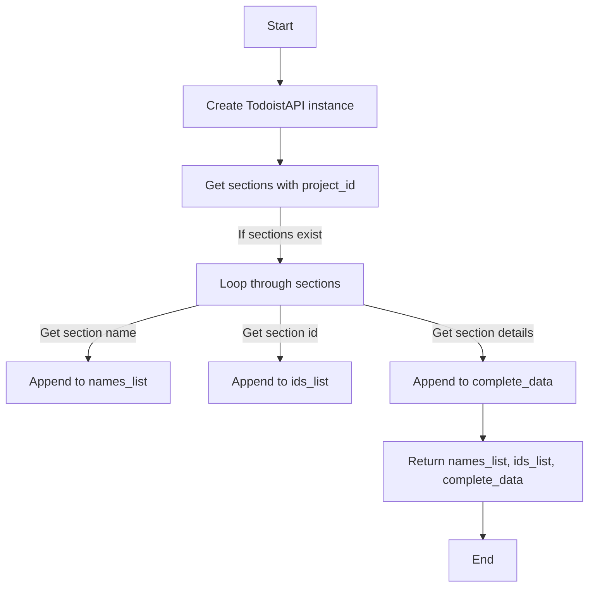

#### 带注释源码

```python
@staticmethod
def get_section_lists(credentials: TodoistCredentials, project_id: Optional[str] = None):
    try:
        api = TodoistAPI(credentials.access_token.get_secret_value())
        sections = api.get_sections(project_id=project_id)

        names = []
        ids = []
        complete_data = []

        for section in sections:
            names.append(section.name)
            ids.append(section.id)
            complete_data.append(section.__dict__)

        return names, ids, complete_data

    except Exception as e:
        raise e
```


### `TodoistGetSectionBlock.get_section`

This method retrieves a single section from Todoist by its ID.

参数：

- `credentials`：`TodoistCredentials`，The credentials used to authenticate with the Todoist API.
- `section_id`：`str`，The ID of the section to fetch.

返回值：`dict`，A dictionary containing the section's details.

#### 流程图

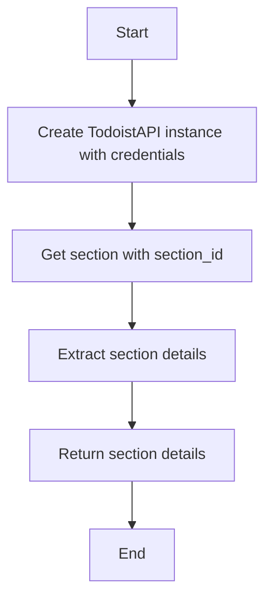

#### 带注释源码

```python
@staticmethod
    def get_section(credentials: TodoistCredentials, section_id: str):
        try:
            api = TodoistAPI(credentials.access_token.get_secret_value())
            section = api.get_section(section_id=section_id)
            return section.__dict__
        except Exception as e:
            raise e
```


### `TodoistDeleteSectionBlock.delete_section`

Deletes a section and all its tasks from Todoist.

参数：

- `credentials`：`TodoistCredentials`，The credentials object containing the access token for the Todoist API.
- `section_id`：`str`，The ID of the section to delete.

返回值：`bool`，Whether the section was successfully deleted.

#### 流程图

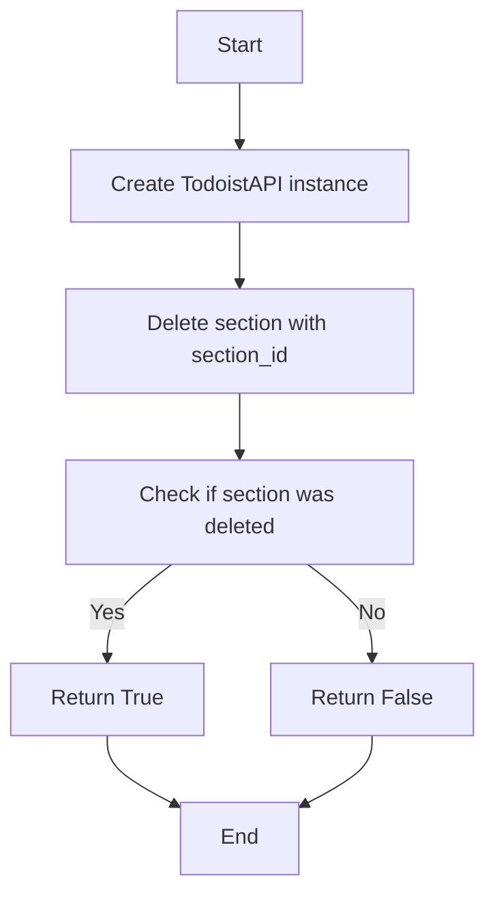

#### 带注释源码

```python
@staticmethod
    def delete_section(credentials: TodoistCredentials, section_id: str):
        try:
            api = TodoistAPI(credentials.access_token.get_secret_value())
            success = api.delete_section(section_id=section_id)
            return success

        except Exception as e:
            raise e
```


### `TodoistListSectionsBlock.__init__`

Initializes the `TodoistListSectionsBlock` class with necessary configurations and settings.

参数：

- `id`: `str`，Unique identifier for the block.
- `description`: `str`，Description of the block's functionality.
- `categories`: `set`，Categories to which the block belongs.
- `input_schema`: `TodoistListSectionsBlock.Input`，Input schema for the block.
- `output_schema`: `TodoistListSectionsBlock.Output`，Output schema for the block.
- `disabled`: `bool`，Whether the block is disabled or not.
- `test_input`: `dict`，Test input data for the block.
- `test_credentials`: `TodoistCredentials`，Test credentials for the block.
- `test_output`: `list`，Test output data for the block.
- `test_mock`: `dict`，Mock data for testing the block.

返回值：无

#### 流程图

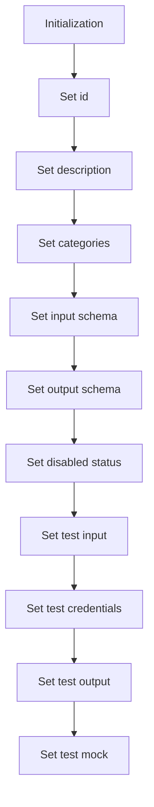

#### 带注释源码

```python
def __init__(self):
    super().__init__(
        id="d6a116d8-de14-11ef-a94c-32d3674e8b7e",
        description="Gets all sections and their details from Todoist",
        categories={BlockCategory.PRODUCTIVITY},
        input_schema=TodoistListSectionsBlock.Input,
        output_schema=TodoistListSectionsBlock.Output,
        disabled=not TODOIST_OAUTH_IS_CONFIGURED,
        test_input={
            "credentials": TEST_CREDENTIALS_INPUT,
            "project_id": "2203306141",
        },
        test_credentials=TEST_CREDENTIALS,
        test_output=[
            ("names_list", ["Groceries"]),
            ("ids_list", ["7025"]),
            (
                "complete_data",
                [
                    {
                        "id": "7025",
                        "project_id": "2203306141",
                        "order": 1,
                        "name": "Groceries",
                    }
                ],
            ),
        ],
        test_mock={
            "get_section_lists": lambda *args, **kwargs: (
                ["Groceries"],
                ["7025"],
                [
                    {
                        "id": "7025",
                        "project_id": "2203306141",
                        "order": 1,
                        "name": "Groceries",
                    }
                ],
            )
        },
    )
```


### `TodoistListSectionsBlock.get_section_lists`

This method retrieves all sections and their details from a Todoist project.

参数：

- `credentials`：`TodoistCredentials`，The credentials object containing the access token for the Todoist API.
- `project_id`：`Optional[str]`，Optional project ID to filter sections.

返回值：`Tuple[list[str], list[str], list[dict]]`，A tuple containing three lists: names_list, ids_list, and complete_data.

#### 流程图

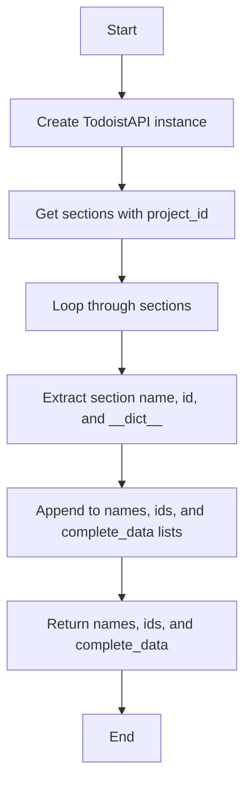

#### 带注释源码

```python
@staticmethod
def get_section_lists(credentials: TodoistCredentials, project_id: Optional[str] = None):
    try:
        api = TodoistAPI(credentials.access_token.get_secret_value())
        sections = api.get_sections(project_id=project_id)

        names = []
        ids = []
        complete_data = []

        for section in sections:
            names.append(section.name)
            ids.append(section.id)
            complete_data.append(section.__dict__)

        return names, ids, complete_data

    except Exception as e:
        raise e
```


### `TodoistListSectionsBlock.run`

This method retrieves all sections and their details from a Todoist project.

参数：

- `input_data`：`Input`，The input data for the block, which includes credentials and an optional project ID.
- `credentials`：`TodoistCredentials`，The credentials used to authenticate with the Todoist API.

返回值：`BlockOutput`，The output of the block, which includes the names, IDs, and complete data of the sections.

#### 流程图

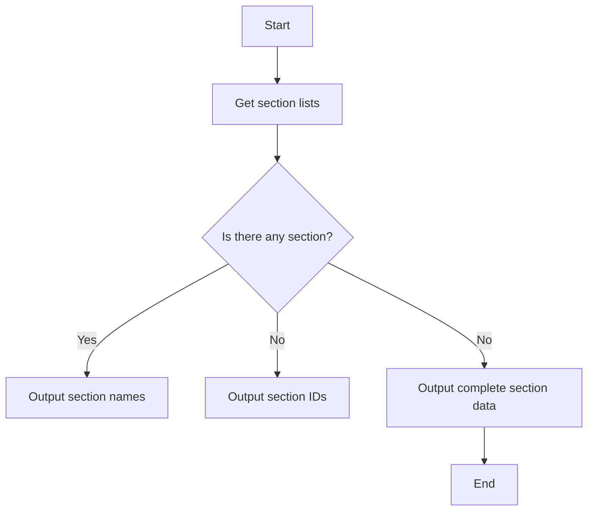

#### 带注释源码

```python
async def run(
    self,
    input_data: Input,
    *,
    credentials: TodoistCredentials,
    **kwargs,
) -> BlockOutput:
    try:
        names, ids, data = self.get_section_lists(
            credentials, input_data.project_id
        )

        if names:
            yield "names_list", names
        if ids:
            yield "ids_list", ids
        if data:
            yield "complete_data", data

    except Exception as e:
        yield "error", str(e)
```


### `TodoistGetSectionBlock.__init__`

Initializes the TodoistGetSectionBlock class, setting up its properties and configurations.

参数：

- `self`：`TodoistGetSectionBlock`，The instance of the class being initialized.
- `id`：`str`，The unique identifier for the block.
- `description`：`str`，A description of the block's functionality.
- `categories`：`set`，A set of categories that the block belongs to.
- `input_schema`：`BlockSchemaInput`，The input schema for the block.
- `output_schema`：`BlockSchemaOutput`，The output schema for the block.
- `disabled`：`bool`，A flag indicating whether the block is disabled.
- `test_input`：`dict`，The test input data for the block.
- `test_credentials`：`TodoistCredentials`，The test credentials for the block.
- `test_output`：`list`，The expected test output data for the block.
- `test_mock`：`dict`，Mock data for testing the block.

返回值：`None`，No return value as it's an initializer.

#### 流程图

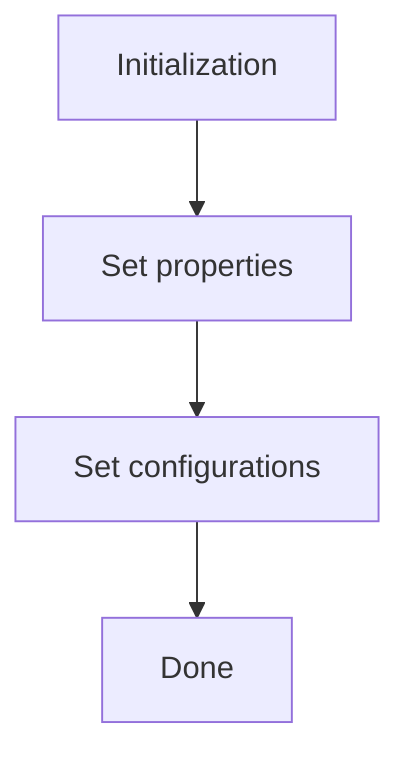

#### 带注释源码

```python
def __init__(self):
    super().__init__(
        id="ea5580e2-de14-11ef-a5d3-32d3674e8b7e",
        description="Gets a single section by ID from Todoist",
        categories={BlockCategory.PRODUCTIVITY},
        input_schema=TodoistGetSectionBlock.Input,
        output_schema=TodoistGetSectionBlock.Output,
        disabled=not TODOIST_OAUTH_IS_CONFIGURED,
        test_input={"credentials": TEST_CREDENTIALS_INPUT, "section_id": "7025"},
        test_credentials=TEST_CREDENTIALS,
        test_output=[
            ("id", "7025"),
            ("project_id", "2203306141"),
            ("order", 1),
            ("name", "Groceries"),
        ],
        test_mock={
            "get_section": lambda *args, **kwargs: {
                "id": "7025",
                "project_id": "2203306141",
                "order": 1,
                "name": "Groceries",
            }
        },
    )
```


### TodoistGetSectionBlock.get_section

This function retrieves a single section from Todoist by its ID.

参数：

- `credentials`：`TodoistCredentials`，The credentials object containing the access token for the Todoist API.
- `section_id`：`str`，The ID of the section to fetch.

返回值：`dict`，A dictionary containing the section's details.

#### 流程图

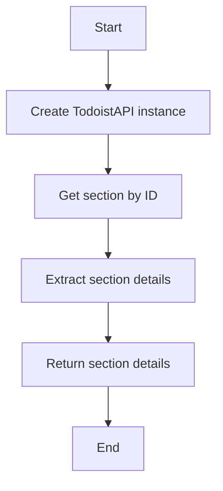

#### 带注释源码

```python
@staticmethod
def get_section(credentials: TodoistCredentials, section_id: str):
    try:
        api = TodoistAPI(credentials.access_token.get_secret_value())
        section = api.get_section(section_id=section_id)
        return section.__dict__
    except Exception as e:
        raise e
```


### TodoistGetSectionBlock.run

This method retrieves a single section from Todoist by its ID.

参数：

- `input_data`：`Input`，The input data for the block, which includes the credentials and section ID.
- `credentials`：`TodoistCredentials`，The credentials object containing the access token for the Todoist API.

返回值：`BlockOutput`，The output of the block, which includes the section data or an error message.

#### 流程图

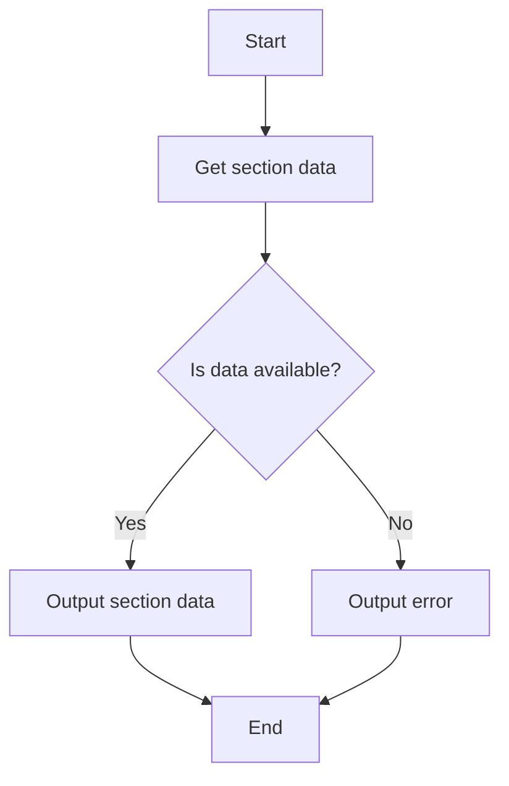

#### 带注释源码

```python
async def run(
    self,
    input_data: Input,
    *,
    credentials: TodoistCredentials,
    **kwargs,
) -> BlockOutput:
    try:
        section_data = self.get_section(credentials, input_data.section_id)

        if section_data:
            yield "id", section_data["id"]
            yield "project_id", section_data["project_id"]
            yield "order", section_data["order"]
            yield "name", section_data["name"]

    except Exception as e:
        yield "error", str(e)
```


### `TodoistDeleteSectionBlock.__init__`

Initializes the `TodoistDeleteSectionBlock` class.

参数：

- `self`：`TodoistDeleteSectionBlock` 类的实例
- `id`：`str`，块的唯一标识符
- `description`：`str`，块的描述
- `categories`：`set`，块的类别
- `input_schema`：`BlockSchemaInput`，块的输入模式
- `output_schema`：`BlockSchemaOutput`，块的输出模式
- `disabled`：`bool`，是否禁用块
- `test_input`：`dict`，测试输入数据
- `test_credentials`：`TodoistCredentials`，测试时使用的凭据
- `test_output`：`list`，测试输出数据
- `test_mock`：`dict`，测试模拟数据

返回值：无

#### 流程图

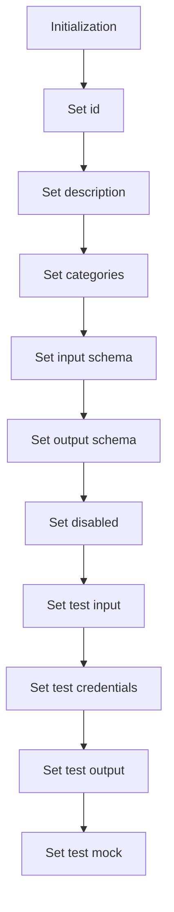

#### 带注释源码

```python
def __init__(self):
    super().__init__(
        id="f0e52eee-de14-11ef-9b12-32d3674e8b7e",
        description="Deletes a section and all its tasks from Todoist",
        categories={BlockCategory.PRODUCTIVITY},
        input_schema=TodoistDeleteSectionBlock.Input,
        output_schema=TodoistDeleteSectionBlock.Output,
        disabled=not TODOIST_OAUTH_IS_CONFIGURED,
        test_input={
            "credentials": TEST_CREDENTIALS_INPUT,
            "section_id": "7025",
        },
        test_credentials=TEST_CREDENTIALS,
        test_output=[("success", True)],
        test_mock={
            "delete_section": lambda *args, **kwargs: (True),
        },
    )
```


### TodoistDeleteSectionBlock.delete_section

Deletes a section and all its tasks from Todoist.

参数：

- `credentials`：`TodoistCredentials`，Todoist API credentials
- `section_id`：`str`，ID of the section to delete

返回值：`bool`，Whether the section was successfully deleted

#### 流程图

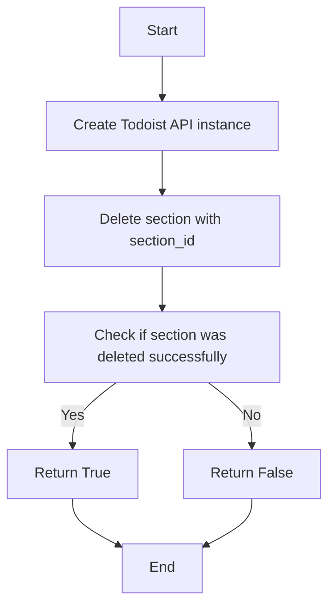

#### 带注释源码

```python
@staticmethod
    def delete_section(credentials: TodoistCredentials, section_id: str):
        try:
            api = TodoistAPI(credentials.access_token.get_secret_value())
            success = api.delete_section(section_id=section_id)
            return success

        except Exception as e:
            raise e
```


### TodoistDeleteSectionBlock.run

Deletes a section and all its tasks from Todoist.

参数：

- `input_data`：`Input`，The input data for the block.
- `credentials`：`TodoistCredentials`，The credentials used to authenticate with Todoist.

返回值：`BlockOutput`，The output of the block.

#### 流程图

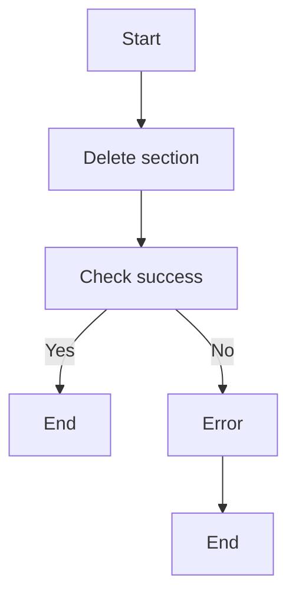

#### 带注释源码

```python
async def run(
    self,
    input_data: Input,
    *,
    credentials: TodoistCredentials,
    **kwargs,
) -> BlockOutput:
    try:
        success = self.delete_section(credentials, input_data.section_id)
        yield "success", success

    except Exception as e:
        yield "error", str(e)
```


## 关键组件


### 张量索引与惰性加载

张量索引与惰性加载是处理大规模数据集时常用的技术，它允许在需要时才计算或加载数据，从而提高效率并减少内存消耗。

### 反量化支持

反量化支持是指系统对量化操作的反向操作的支持，允许在量化过程中添加的量化信息被移除，以便进行后续的精确计算。

### 量化策略

量化策略是指将浮点数数据转换为低精度表示（如整数）的策略，以减少模型大小和加速计算，同时尽量保持精度。


## 问题及建议


### 已知问题

-   **代码重复**: `TodoistListSectionsBlock`, `TodoistGetSectionBlock`, 和 `TodoistDeleteSectionBlock` 类中都有类似的代码用于与 Todoist API 交互。这可能导致维护成本增加，并且如果 API 发生变化，需要修改多个地方。
-   **异常处理**: 异常处理在 `get_section_lists`, `get_section`, 和 `delete_section` 方法中是相同的，但可能需要根据不同的操作提供更具体的错误信息。
-   **全局变量**: 使用全局变量 `TODOIST_OAUTH_IS_CONFIGURED` 来控制块的启用状态，这可能导致代码难以测试和部署。
-   **测试代码**: 测试代码中使用了 `test_mock` 来模拟 API 调用，这可能导致测试与实际代码的耦合度较高。

### 优化建议

-   **提取公共代码**: 将与 Todoist API 交互的公共代码提取到一个单独的模块或类中，以减少代码重复并提高可维护性。
-   **改进异常处理**: 根据不同的异常类型提供更具体的错误信息，以便于调试和用户理解。
-   **使用配置文件**: 使用配置文件来管理 OAuth 配置和 API 密钥，而不是使用全局变量，以便于测试和部署。
-   **重构测试代码**: 将测试代码与实际代码分离，使用模拟对象来模拟 API 调用，以减少测试代码与实际代码的耦合度。


## 其它


### 设计目标与约束

- 设计目标：
  - 提供一个模块化的Todoist API接口，用于管理Todoist项目中的任务和部分。
  - 确保接口易于使用，并能够处理常见的Todoist API错误。
  - 提供单元测试和示例用法，以便快速集成和使用。

- 约束：
  - 必须使用Todoist API进行操作。
  - 需要有效的认证凭据才能访问Todoist API。
  - 代码应遵循Python 3.x的语法和最佳实践。

### 错误处理与异常设计

- 错误处理：
  - 所有API调用都应捕获可能的异常，并返回错误信息。
  - 使用自定义异常类来处理特定于Todoist API的错误。

- 异常设计：
  - 定义自定义异常类，如`TodoistAPIError`，用于封装Todoist API相关的错误。
  - 异常类应包含错误代码和错误消息。

### 数据流与状态机

- 数据流：
  - 用户输入通过输入参数传递给块。
  - 块执行Todoist API调用，并将结果返回给用户。

- 状态机：
  - 每个块在执行过程中可能处于不同的状态，如`RUNNING`、`SUCCESS`或`ERROR`。
  - 状态机用于跟踪块的当前状态并相应地处理输入和输出。

### 外部依赖与接口契约

- 外部依赖：
  - 依赖于Todoist API和Python的`requests`库。
  - 依赖于`todoist_api_python`库来与Todoist API交互。

- 接口契约：
  - 每个块都定义了输入和输出契约，包括字段类型和描述。
  - 输入契约定义了用户必须提供的参数。
  - 输出契约定义了块将返回的数据结构。


    