# `AutoGPT\autogpt_platform\backend\backend\blocks\todoist\tasks.py` 详细设计文档

该代码定义了一系列用于集成 Todoist API 的 Block 类，实现了任务的创建、查询（单个及列表）、更新、关闭、重新打开和删除功能，通过封装 TodoistAPI 客户端和认证逻辑，提供了标准化的异步任务管理接口。

## 整体流程

```mermaid
graph TD
    A[开始: Block.run] --> B[接收输入数据与凭据]
    B --> C[格式化参数 (处理日期等)]
    C --> D[构建 API 请求参数字典]
    D --> E[调用静态辅助方法 (如 create_task)]
    E --> F[初始化 TodoistAPI 客户端]
    F --> G[执行 Todoist API 远程调用]
    G --> H{调用成功?}
    H -- 是 --> I[解析返回数据 (如转为字典)]
    H -- 否 --> J[捕获异常]
    I --> K[Yield 标准输出字段]
    J --> L[Yield error 字段]
```

## 类结构

```
Block (基类)
├── TodoistCreateTaskBlock
├── TodoistGetTasksBlock
├── TodoistGetTaskBlock
├── TodoistUpdateTaskBlock
├── TodoistCloseTaskBlock
├── TodoistReopenTaskBlock
└── TodoistDeleteTaskBlock
```

## 全局变量及字段


### `TodoistCreateTaskBlock.Input.credentials`
    
Todoist API credentials

类型：`TodoistCredentialsInput`
    


### `TodoistCreateTaskBlock.Input.content`
    
Task content

类型：`str`
    


### `TodoistCreateTaskBlock.Input.description`
    
Task description

类型：`Optional[str]`
    


### `TodoistCreateTaskBlock.Input.project_id`
    
Project ID this task should belong to

类型：`Optional[str]`
    


### `TodoistCreateTaskBlock.Input.section_id`
    
Section ID this task should belong to

类型：`Optional[str]`
    


### `TodoistCreateTaskBlock.Input.parent_id`
    
Parent task ID

类型：`Optional[str]`
    


### `TodoistCreateTaskBlock.Input.order`
    
Optional order among other tasks,[Non-zero integer value used by clients to sort tasks under the same parent]

类型：`Optional[int]`
    


### `TodoistCreateTaskBlock.Input.labels`
    
Task labels

类型：`Optional[list[str]]`
    


### `TodoistCreateTaskBlock.Input.priority`
    
Task priority from 1 (normal) to 4 (urgent)

类型：`Optional[int]`
    


### `TodoistCreateTaskBlock.Input.due_date`
    
Due date in YYYY-MM-DD format

类型：`Optional[datetime]`
    


### `TodoistCreateTaskBlock.Input.deadline_date`
    
Specific date in YYYY-MM-DD format relative to user's timezone

类型：`Optional[datetime]`
    


### `TodoistCreateTaskBlock.Input.assignee_id`
    
Responsible user ID

类型：`Optional[str]`
    


### `TodoistCreateTaskBlock.Input.duration_unit`
    
Task duration unit (minute/day)

类型：`Optional[str]`
    


### `TodoistCreateTaskBlock.Input.duration`
    
Task duration amount, You need to selecct the duration unit first

类型：`Optional[int]`
    


### `TodoistCreateTaskBlock.Output.id`
    
Task ID

类型：`str`
    


### `TodoistCreateTaskBlock.Output.url`
    
Task URL

类型：`str`
    


### `TodoistCreateTaskBlock.Output.complete_data`
    
Complete task data as dictionary

类型：`dict`
    


### `TodoistGetTasksBlock.Input.credentials`
    
Todoist API credentials

类型：`TodoistCredentialsInput`
    


### `TodoistGetTasksBlock.Input.project_id`
    
Filter tasks by project ID

类型：`Optional[str]`
    


### `TodoistGetTasksBlock.Input.section_id`
    
Filter tasks by section ID

类型：`Optional[str]`
    


### `TodoistGetTasksBlock.Input.label`
    
Filter tasks by label name

类型：`Optional[str]`
    


### `TodoistGetTasksBlock.Input.filter`
    
Filter by any supported filter, You can see How to use filters or create one of your one here - https://todoist.com/help/articles/introduction-to-filters-V98wIH

类型：`Optional[str]`
    


### `TodoistGetTasksBlock.Input.lang`
    
IETF language tag for filter language

类型：`Optional[str]`
    


### `TodoistGetTasksBlock.Input.ids`
    
List of task IDs to retrieve

类型：`Optional[list[str]]`
    


### `TodoistGetTasksBlock.Output.ids`
    
Task IDs

类型：`list[str]`
    


### `TodoistGetTasksBlock.Output.urls`
    
Task URLs

类型：`list[str]`
    


### `TodoistGetTasksBlock.Output.complete_data`
    
Complete task data as dictionary

类型：`list[dict]`
    


### `TodoistGetTaskBlock.Input.credentials`
    
Todoist API credentials

类型：`TodoistCredentialsInput`
    


### `TodoistGetTaskBlock.Input.task_id`
    
Task ID to retrieve

类型：`str`
    


### `TodoistGetTaskBlock.Output.project_id`
    
Project ID containing the task

类型：`str`
    


### `TodoistGetTaskBlock.Output.url`
    
Task URL

类型：`str`
    


### `TodoistGetTaskBlock.Output.complete_data`
    
Complete task data as dictionary

类型：`dict`
    


### `TodoistUpdateTaskBlock.Input.credentials`
    
Todoist API credentials

类型：`TodoistCredentialsInput`
    


### `TodoistUpdateTaskBlock.Input.task_id`
    
Task ID to update

类型：`str`
    


### `TodoistUpdateTaskBlock.Input.content`
    
Task content

类型：`str`
    


### `TodoistUpdateTaskBlock.Input.description`
    
Task description

类型：`Optional[str]`
    


### `TodoistUpdateTaskBlock.Input.project_id`
    
Project ID this task should belong to

类型：`Optional[str]`
    


### `TodoistUpdateTaskBlock.Input.section_id`
    
Section ID this task should belong to

类型：`Optional[str]`
    


### `TodoistUpdateTaskBlock.Input.parent_id`
    
Parent task ID

类型：`Optional[str]`
    


### `TodoistUpdateTaskBlock.Input.order`
    
Optional order among other tasks,[Non-zero integer value used by clients to sort tasks under the same parent]

类型：`Optional[int]`
    


### `TodoistUpdateTaskBlock.Input.labels`
    
Task labels

类型：`Optional[list[str]]`
    


### `TodoistUpdateTaskBlock.Input.priority`
    
Task priority from 1 (normal) to 4 (urgent)

类型：`Optional[int]`
    


### `TodoistUpdateTaskBlock.Input.due_date`
    
Due date in YYYY-MM-DD format

类型：`Optional[datetime]`
    


### `TodoistUpdateTaskBlock.Input.deadline_date`
    
Specific date in YYYY-MM-DD format relative to user's timezone

类型：`Optional[datetime]`
    


### `TodoistUpdateTaskBlock.Input.assignee_id`
    
Responsible user ID

类型：`Optional[str]`
    


### `TodoistUpdateTaskBlock.Input.duration_unit`
    
Task duration unit (minute/day)

类型：`Optional[str]`
    


### `TodoistUpdateTaskBlock.Input.duration`
    
Task duration amount, You need to selecct the duration unit first

类型：`Optional[int]`
    


### `TodoistUpdateTaskBlock.Output.success`
    
Whether the update was successful

类型：`bool`
    


### `TodoistCloseTaskBlock.Input.credentials`
    
Todoist API credentials

类型：`TodoistCredentialsInput`
    


### `TodoistCloseTaskBlock.Input.task_id`
    
Task ID to close

类型：`str`
    


### `TodoistCloseTaskBlock.Output.success`
    
Whether the task was successfully closed

类型：`bool`
    


### `TodoistReopenTaskBlock.Input.credentials`
    
Todoist API credentials

类型：`TodoistCredentialsInput`
    


### `TodoistReopenTaskBlock.Input.task_id`
    
Task ID to reopen

类型：`str`
    


### `TodoistReopenTaskBlock.Output.success`
    
Whether the task was successfully reopened

类型：`bool`
    


### `TodoistDeleteTaskBlock.Input.credentials`
    
Todoist API credentials

类型：`TodoistCredentialsInput`
    


### `TodoistDeleteTaskBlock.Input.task_id`
    
Task ID to delete

类型：`str`
    


### `TodoistDeleteTaskBlock.Output.success`
    
Whether the task was successfully deleted

类型：`bool`
    
    

## 全局函数及方法


### `TodoistCreateTaskBlock.__init__`

该方法用于初始化 `TodoistCreateTaskBlock` 类的实例，配置块的元数据、输入输出模式、测试数据以及模拟逻辑。

参数：

-  `self`：`TodoistCreateTaskBlock`，类的实例引用。

返回值：`None`，该方法无显式返回值，主要用于初始化父类 `Block` 的配置。

#### 流程图

```mermaid
graph TD
    A[Start: __init__] --> B[Call super().__init__]
    B --> C[Set Block ID and Description]
    C --> D[Set Category to Productivity]
    D --> E[Define Input and Output Schemas]
    E --> F[Set Disabled Status based on OAuth Config]
    F --> G[Configure Test Input Data]
    G --> H[Configure Test Credentials]
    H --> I[Define Expected Test Output]
    I --> J[Define Test Mock Functions]
    J --> K[End: Initialization Complete]
```

#### 带注释源码

```python
def __init__(self):
    # 调用父类 Block 的初始化方法，传入块的配置信息
    super().__init__(
        # 块的唯一标识符
        id="fde4f458-de14-11ef-bf0c-32d3674e8b7e",
        # 块的功能描述
        description="Creates a new task in a Todoist project",
        # 块所属的分类
        categories={BlockCategory.PRODUCTIVITY},
        # 定义输入数据的 Schema，引用类内定义的 Input 类
        input_schema=TodoistCreateTaskBlock.Input,
        # 定义输出数据的 Schema，引用类内定义的 Output 类
        output_schema=TodoistCreateTaskBlock.Output,
        # 根据 OAuth 配置状态决定是否禁用该块
        disabled=not TODOIST_OAUTH_IS_CONFIGURED,
        # 定义用于测试的输入数据
        test_input={
            "credentials": TEST_CREDENTIALS_INPUT,
            "content": "Buy groceries",
            "project_id": "2203306141",
            "priority": 4,
        },
        # 定义用于测试的凭证
        test_credentials=TEST_CREDENTIALS,
        # 定义测试期间预期的输出结果
        test_output=[
            ("id", "2995104339"),
            ("url", "https://todoist.com/showTask?id=2995104339"),
            (
                "complete_data",
                {
                    "id": "2995104339",
                    "project_id": "2203306141",
                    "url": "https://todoist.com/showTask?id=2995104339",
                },
            ),
        ],
        # 定义测试时的模拟行为，避免实际调用 API
        test_mock={
            "create_task": lambda *args, **kwargs: (
                "2995104339",
                "https://todoist.com/showTask?id=2995104339",
                {
                    "id": "2995104339",
                    "project_id": "2203306141",
                    "url": "https://todoist.com/showTask?id=2995104339",
                },
            )
        },
    )
```


### `TodoistCreateTaskBlock.create_task`

该方法是 `TodoistCreateTaskBlock` 的核心静态方法，负责利用提供的 Todoist 凭证和任务内容，通过 Todoist API 创建新任务，并返回任务的 ID、URL 以及完整的数据字典。

参数：

-  `credentials`：`TodoistCredentials`，用于身份验证的 Todoist API 凭证对象。
-  `content`：`str`，待创建任务的核心内容文本。
-  `**kwargs`：`Any`，其他可选的任务属性参数（如项目ID、描述、优先级等），将直接传递给 API。

返回值：`tuple[str, str, dict]`，包含三个元素的元组，分别是任务 ID (str)、任务 URL (str) 和包含完整任务信息的字典 (dict)。

#### 流程图

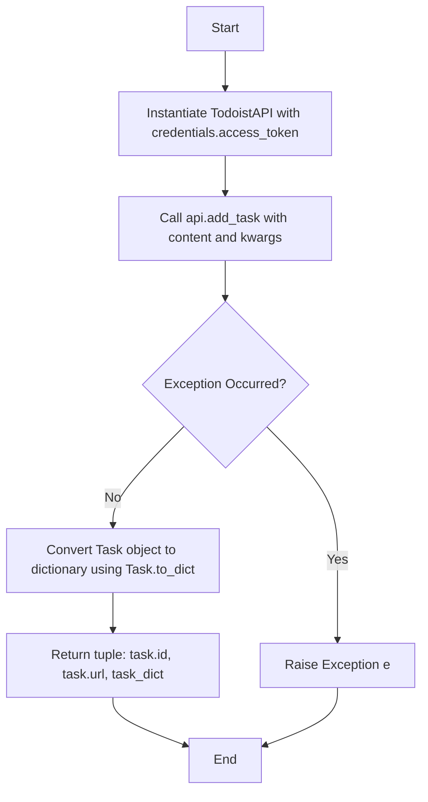

#### 带注释源码

```python
    @staticmethod
    def create_task(credentials: TodoistCredentials, content: str, **kwargs):
        try:
            # 使用凭证中的访问令牌初始化 TodoistAPI 客户端
            api = TodoistAPI(credentials.access_token.get_secret_value())
            
            # 调用 API 的 add_task 方法创建任务，传入任务内容及其他关键字参数
            task = api.add_task(content=content, **kwargs)
            
            # 将返回的 Task 对象转换为字典格式
            task_dict = Task.to_dict(task)
            
            # 返回任务的 ID、URL 和完整的任务数据字典
            return task.id, task.url, task_dict
        except Exception as e:
            # 捕获并重新抛出任何发生的异常
            raise e
```


### `TodoistCreateTaskBlock.run`

该方法是 `TodoistCreateTaskBlock` 的核心执行逻辑，负责处理创建 Todoist 任务的异步流程。它接收输入数据和凭证，处理日期格式化，构建任务参数字典，调用 API 创建任务，并将生成的任务 ID、URL 和完整数据作为输出流返回，同时包含异常处理机制。

参数：

-  `input_data`：`Input`，包含任务详情的输入数据对象，如内容、描述、项目 ID、日期等。
-  `credentials`：`TodoistCredentials`，用于认证 Todoist API 访问权限的凭证对象。
-  `**kwargs`：`dict`，额外的关键字参数。

返回值：`BlockOutput`，一个异步生成器，生成包含任务创建结果的元组，包括任务 ID、URL 和完整数据字典，或在发生错误时生成错误信息。

#### 流程图

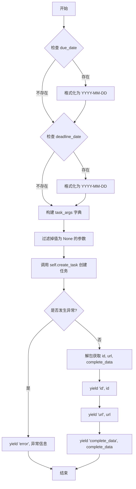

#### 带注释源码

```python
    async def run(
        self,
        input_data: Input,
        *,
        credentials: TodoistCredentials,
        **kwargs,
    ) -> BlockOutput:
        try:
            # 如果存在 due_date，将其格式化为 "YYYY-MM-DD" 字符串
            due_date = (
                input_data.due_date.strftime("%Y-%m-%d")
                if input_data.due_date
                else None
            )
            # 如果存在 deadline_date，将其格式化为 "YYYY-MM-DD" 字符串
            deadline_date = (
                input_data.deadline_date.strftime("%Y-%m-%d")
                if input_data.deadline_date
                else None
            )

            # 构建任务参数字典，收集所有可选任务属性
            task_args = {
                "description": input_data.description,
                "project_id": input_data.project_id,
                "section_id": input_data.section_id,
                "parent_id": input_data.parent_id,
                "order": input_data.order,
                "labels": input_data.labels,
                "priority": input_data.priority,
                "due_date": due_date,
                "deadline_date": deadline_date,
                "assignee_id": input_data.assignee_id,
                "duration": input_data.duration,
                "duration_unit": input_data.duration_unit,
            }

            # 调用辅助方法创建任务，仅传递非 None 的参数
            id, url, complete_data = self.create_task(
                credentials,
                input_data.content,
                **{k: v for k, v in task_args.items() if v is not None},
            )

            # 依次产出任务的 ID、URL 和完整数据
            yield "id", id
            yield "url", url
            yield "complete_data", complete_data

        except Exception as e:
            # 捕获异常并产出错误信息
            yield "error", str(e)
```


### `TodoistGetTasksBlock.__init__`

该方法用于初始化 `TodoistGetTasksBlock` 类实例。它通过调用父类 `Block` 的构造函数，配置该块的唯一标识符、描述、分类、输入输出模式以及用于单元测试的模拟数据和凭证。这是将具体的业务逻辑块注册到系统框架中的关键步骤。

参数：

-   `self`：`TodoistGetTasksBlock`，类实例本身。

返回值：`None`，无返回值，仅执行初始化逻辑。

#### 流程图

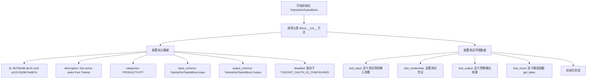

#### 带注释源码

```python
def __init__(self):
    # 调用父类 Block 的构造函数，注册块的元数据和测试配置
    super().__init__(
        # �的唯一标识符
        id="0b706e86-de15-11ef-a113-32d3674e8b7e",
        # 块的功能描述
        description="Get active tasks from Todoist",
        # 块所属的分类，此处为生产力工具
        categories={BlockCategory.PRODUCTIVITY},
        # 绑定输入模式类，定义输入参数结构
        input_schema=TodoistGetTasksBlock.Input,
        # 绑定输出模式类，定义输出数据结构
        output_schema=TodoistGetTasksBlock.Output,
        # 根据环境变量决定是否禁用该块，如果 OAuth 未配置则禁用
        disabled=not TODOIST_OAUTH_IS_CONFIGURED,
        # 定义单元测试使用的输入数据
        test_input={
            "credentials": TEST_CREDENTIALS_INPUT,
            "project_id": "2203306141",
        },
        # 定义单元测试使用的凭证对象
        test_credentials=TEST_CREDENTIALS,
        # 定义单元测试预期的输出结果
        test_output=[
            ("ids", ["2995104339"]),
            ("urls", ["https://todoist.com/showTask?id=2995104339"]),
            (
                "complete_data",
                [
                    {
                        "id": "2995104339",
                        "project_id": "2203306141",
                        "url": "https://todoist.com/showTask?id=2995104339",
                        "is_completed": False,
                    }
                ],
            ),
        ],
        # 定义单元测试的 Mock 函数，模拟 get_tasks 方法的行为，避免真实 API 调用
        test_mock={
            "get_tasks": lambda *args, **kwargs: [
                {
                    "id": "2995104339",
                    "project_id": "2203306141",
                    "url": "https://todoist.com/showTask?id=2995104339",
                    "is_completed": False,
                }
            ]
        },
    )
```


### `TodoistGetTasksBlock.get_tasks`

根据提供的凭据和可选过滤参数，通过 Todoist API 获取任务列表，并将任务对象转换为字典格式返回。

参数：

-  `credentials`：`TodoistCredentials`，包含访问令牌的 Todoist 认证凭据
-  `**kwargs`：`Any`，用于过滤任务的可选参数（例如 project_id, label, filter 等）

返回值：`list[dict]`，包含任务详细信息的字典列表

#### 流程图

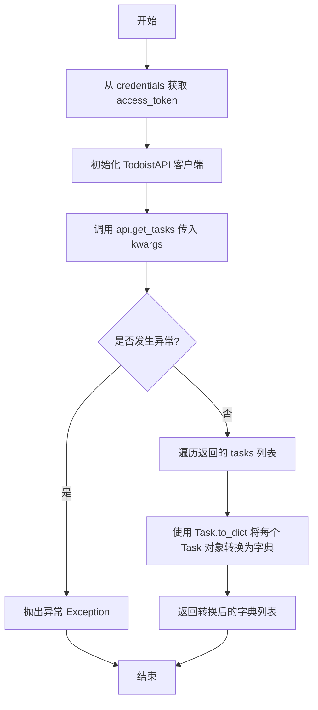

#### 带注释源码

```python
    @staticmethod
    def get_tasks(credentials: TodoistCredentials, **kwargs):
        try:
            # 使用凭据中的访问令牌初始化 Todoist API 客户端
            api = TodoistAPI(credentials.access_token.get_secret_value())
            # 调用 API 获取任务，传入过滤参数 kwargs
            tasks = api.get_tasks(**kwargs)
            # 将返回的 Task 对象列表转换为字典列表以便于序列化和处理
            return [Task.to_dict(task) for task in tasks]
        except Exception as e:
            # 捕获异常并重新抛出，由上层处理错误逻辑
            raise e
```


### `TodoistGetTasksBlock.run`

该方法是 `TodoistGetTasksBlock` 的核心执行逻辑，负责根据输入的筛选条件从 Todoist API 获取活动任务，并将结果（ID、URL 和完整数据）或错误信息异步产出。

参数：

- `input_data`：`TodoistGetTasksBlock.Input`，包含任务筛选条件的输入数据，例如项目ID、标签、过滤字符串等。
- `credentials`：`TodoistCredentials`，用于身份验证的 Todoist API 凭证对象。
- `**kwargs`：`typing.Any`，额外的关键字参数（通常由框架传递）。

返回值：`BlockOutput`，一个异步生成器，产出包含任务ID列表、任务URL列表、完整任务数据字典列表或错误信息的键值对。

#### 流程图

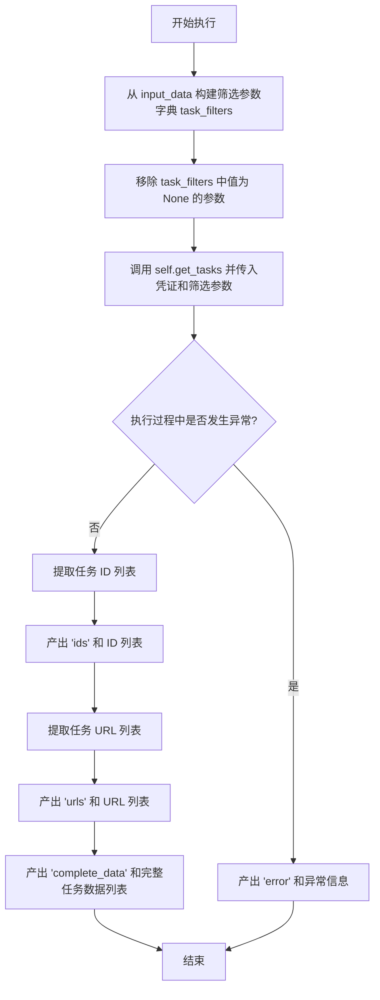

#### 带注释源码

```python
    async def run(
        self,
        input_data: Input,
        *,
        credentials: TodoistCredentials,
        **kwargs,
    ) -> BlockOutput:
        try:
            # 构建API请求的筛选参数字典
            task_filters = {
                "project_id": input_data.project_id,
                "section_id": input_data.section_id,
                "label": input_data.label,
                "filter": input_data.filter,
                "lang": input_data.lang,
                "ids": input_data.ids,
            }

            # 调用静态方法获取任务，过滤掉值为 None 的参数以避免API调用错误
            tasks = self.get_tasks(
                credentials, **{k: v for k, v in task_filters.items() if v is not None}
            )

            # 产出任务 ID 列表
            yield "ids", [task["id"] for task in tasks]
            # 产出任务 URL 列表
            yield "urls", [task["url"] for task in tasks]
            # 产出完整的任务数据列表
            yield "complete_data", tasks

        except Exception as e:
            # 捕获异常并产出错误信息
            yield "error", str(e)
```


### `TodoistGetTaskBlock.__init__`

初始化Todoist获取任务块，配置其唯一标识符、描述、分类、输入输出模式、认证状态以及测试相关的模拟数据和输入输出。

参数：

-  `self`：`TodoistGetTaskBlock`，类实例本身

返回值：`None`，初始化方法无返回值

#### 流程图

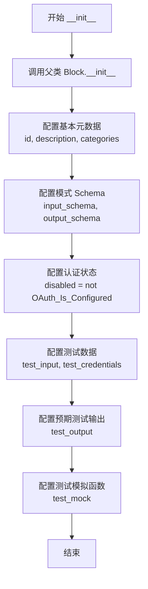

#### 带注释源码

```python
def __init__(self):
    super().__init__(
        id="16d7dc8c-de15-11ef-8ace-32d3674e8b7e",  # 定义块的唯一标识符
        description="Get an active task from Todoist",  # 块的功能描述
        categories={BlockCategory.PRODUCTIVITY},  # 将块归类为生产力工具
        input_schema=TodoistGetTaskBlock.Input,  # 指定输入数据结构的Schema类
        output_schema=TodoistGetTaskBlock.Output,  # 指定输出数据结构的Schema类
        disabled=not TODOIST_OAUTH_IS_CONFIGURED,  # 如果未配置OAuth则禁用该块
        test_input={  # 定义用于测试的输入数据
            "credentials": TEST_CREDENTIALS_INPUT,
            "task_id": "2995104339"
        },
        test_credentials=TEST_CREDENTIALS,  # 定义用于测试的认证凭据
        test_output=[  # 定义预期的测试输出结果
            ("project_id", "2203306141"),
            ("url", "https://todoist.com/showTask?id=2995104339"),
            (
                "complete_data",
                {
                    "id": "2995104339",
                    "project_id": "2203306141",
                    "url": "https://todoist.com/showTask?id=2995104339",
                },
            ),
        ],
        test_mock={  # 定义测试时的模拟行为，避免真实API调用
            "get_task": lambda *args, **kwargs: {
                "project_id": "2203306141",
                "id": "2995104339",
                "url": "https://todoist.com/showTask?id=2995104339",
            }
        },
    )
```


### `TodoistGetTaskBlock.get_task`

通过 Todoist API 获取指定 ID 的单个任务详情，并将其转换为字典格式返回。

参数：

- `credentials`：`TodoistCredentials`，用于访问 Todoist API 的认证凭据对象
- `task_id`：`str`，需要获取的任务 ID

返回值：`dict`，包含完整任务信息的字典

#### 流程图

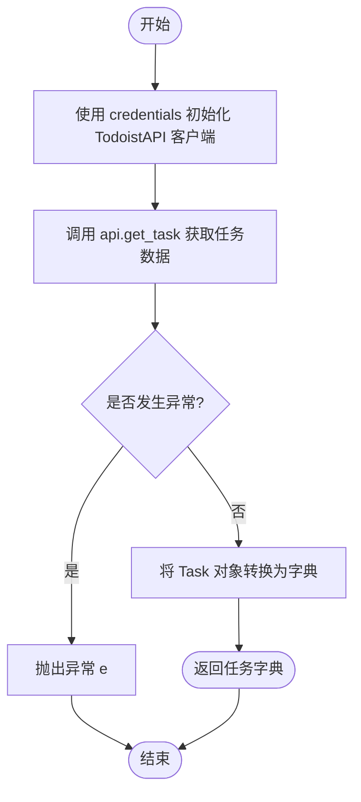

#### 带注释源码

```python
    @staticmethod
    def get_task(credentials: TodoistCredentials, task_id: str):
        try:
            # 使用凭据中的访问令牌初始化 TodoistAPI 客户端
            api = TodoistAPI(credentials.access_token.get_secret_value())
            # 调用 API 获取指定 task_id 的任务对象
            task = api.get_task(task_id=task_id)
            # 将任务对象转换为字典格式以便后续处理
            return Task.to_dict(task)
        except Exception as e:
            # 捕获并重新抛出在获取任务过程中发生的任何异常
            raise e
```


### `TodoistGetTaskBlock.run`

该方法是 `TodoistGetTaskBlock` 的核心执行逻辑，用于根据输入的任务ID，利用提供的凭证从Todoist异步获取特定活跃任务的详细信息，并将结果格式化输出。

参数：

- `self`：`TodoistGetTaskBlock`，类的实例本身。
- `input_data`：`Input`，包含输入参数的模式对象，具体包含 `task_id` 等字段。
- `credentials`：`TodoistCredentials`，用于身份验证的Todoist凭证对象，包含访问令牌。
- `kwargs`：`dict`，额外的关键字参数，用于扩展性或传递上下文信息。

返回值：`BlockOutput`，一个异步生成器，逐步产生包含任务信息（如项目ID、URL、完整数据）或错误信息的键值元组。

#### 流程图

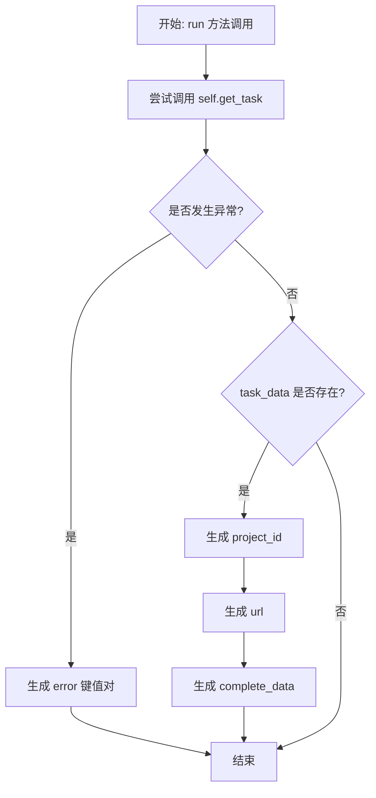

#### 带注释源码

```python
    async def run(
        self,
        input_data: Input,
        *,
        credentials: TodoistCredentials,
        **kwargs,
    ) -> BlockOutput:
        try:
            # 使用静态方法 get_task 通过凭证和输入中的 task_id 获取任务数据
            # 该方法内部调用 TodoistAPI 并将 Task 对象转换为字典
            task_data = self.get_task(credentials, input_data.task_id)

            # 如果成功获取到任务数据，则按顺序生成输出字段
            if task_data:
                yield "project_id", task_data["project_id"]
                yield "url", task_data["url"]
                yield "complete_data", task_data

        except Exception as e:
            # 捕获执行过程中的任何异常，并生成包含错误信息的输出
            yield "error", str(e)
```


### `TodoistUpdateTaskBlock.__init__`

初始化 TodoistUpdateTaskBlock 实例，配置块的元数据、输入输出架构以及测试相关的参数。

参数：

- `self`：`TodoistUpdateTaskBlock`，类的实例本身。

返回值：`None`，无返回值。

#### 流程图

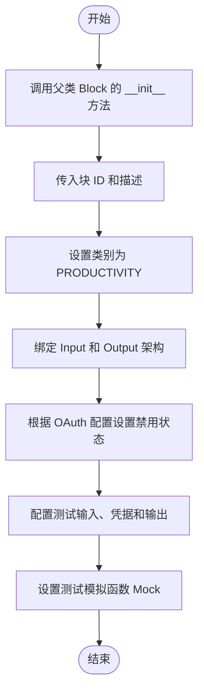

#### 带注释源码

```python
def __init__(self):
    # 调用父类 Block 的初始化方法，配置块的各项元数据和运行时行为
    super().__init__(
        # 块的唯一标识符
        id="1eee6d32-de15-11ef-a2ff-32d3674e8b7e",
        # 块的功能描述
        description="Updates an existing task in Todoist",
        # 块的分类，这里归属于生产力类别
        categories={BlockCategory.PRODUCTIVITY},
        # 定义输入数据的 Schema，验证传入参数结构
        input_schema=TodoistUpdateTaskBlock.Input,
        # 定义输出数据的 Schema，验证返回数据结构
        output_schema=TodoistUpdateTaskBlock.Output,
        # 如果 OAuth 未配置，则禁用该块
        disabled=not TODOIST_OAUTH_IS_CONFIGURED,
        # 定义用于测试的模拟输入数据
        test_input={
            "credentials": TEST_CREDENTIALS_INPUT,
            "task_id": "2995104339",
            "content": "Buy Coffee",
        },
        # 定义测试用的凭据对象
        test_credentials=TEST_CREDENTIALS,
        # 定义预期的测试输出结果
        test_output=[("success", True)],
        # 定义测试模拟函数，避免真实 API 调用，直接返回成功状态
        test_mock={"update_task": lambda *args, **kwargs: True},
    )
```


### `TodoistUpdateTaskBlock.update_task`

该方法是一个静态方法，负责通过 Todoist API 更新指定 ID 的现有任务。它使用提供的认证凭证初始化 API 客户端，并将任务 ID 及其他更新参数传递给 Todoist 服务以执行更新操作。

参数：

- `credentials`：`TodoistCredentials`，包含访问 Todoist API 所需的认证令牌的凭证对象。
- `task_id`：`str`，需要更新的任务的唯一标识符。
- `**kwargs`：`Any`，包含任务更新字段的可变关键字参数（如 content, description, priority 等），这些参数将被直接传递给 Todoist API。

返回值：`bool`，表示任务更新是否成功的布尔值（依据上下文推断及变量命名 `is_success`）。

#### 流程图

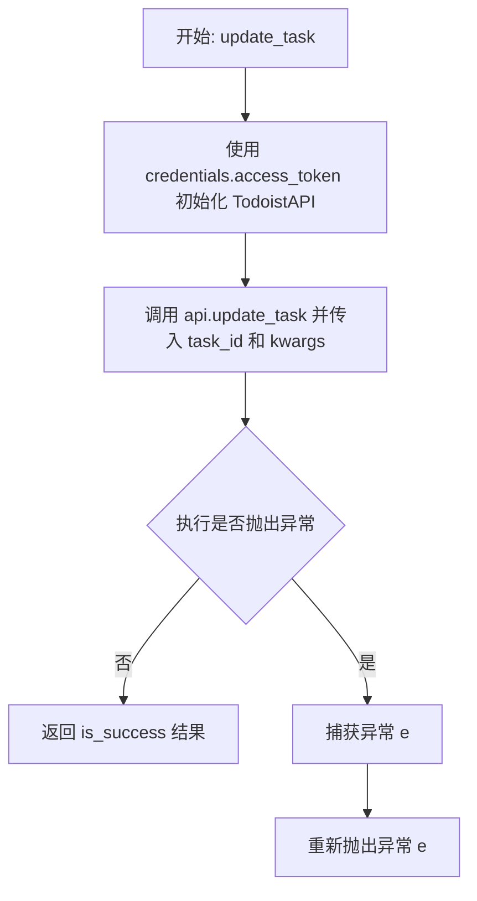

#### 带注释源码

```python
    @staticmethod
    def update_task(credentials: TodoistCredentials, task_id: str, **kwargs):
        try:
            # 使用凭证中的访问令牌初始化 Todoist API 客户端
            api = TodoistAPI(credentials.access_token.get_secret_value())
            # 调用 API 的 update_task 方法更新任务，并接收返回结果
            is_success = api.update_task(task_id=task_id, **kwargs)
            # 返回操作结果
            return is_success
        except Exception as e:
            # 捕获并重新抛出任何发生的异常
            raise e
```


### `TodoistUpdateTaskBlock.run`

该方法是 `TodoistUpdateTaskBlock` 的核心执行逻辑，负责处理更新 Todoist 任务的业务流程。它接收包含任务更新信息的输入数据和认证凭据，对日期格式进行转换，过滤无效参数，调用 API 更新任务，并最终返回操作成功状态或错误信息。

参数：

-  `self`：`TodoistUpdateTaskBlock`，类的实例本身。
-  `input_data`：`Input`，包含任务更新所需的输入数据，如任务ID、内容、描述、项目ID、日期等。
-  `credentials`：`TodoistCredentials`，用于验证和授权 Todoist API 访问的凭据对象。
-  `**kwargs`：`dict`，额外的关键字参数，通常由框架传递。

返回值：`BlockOutput`，一个异步生成器，产生包含操作结果（如 `"success"` 或 `"error"`）的键值对元组。

#### 流程图

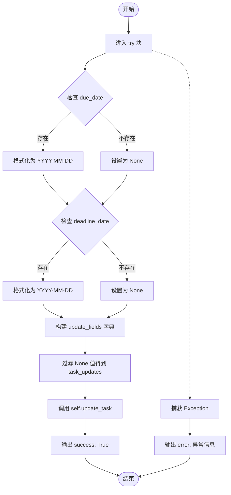

#### 带注释源码

```python
    async def run(
        self,
        input_data: Input,
        *,
        credentials: TodoistCredentials,
        **kwargs,
    ) -> BlockOutput:
        try:
            # 如果输入了截止日期，将其格式化为 "YYYY-MM-DD" 字符串，否则设为 None
            due_date = (
                input_data.due_date.strftime("%Y-%m-%d")
                if input_data.due_date
                else None
            )
            # 如果输入了最后期限日期，将其格式化为 "YYYY-MM-DD" 字符串，否则设为 None
            deadline_date = (
                input_data.deadline_date.strftime("%Y-%m-%d")
                if input_data.deadline_date
                else None
            )

            # 准备所有可能的更新字段，包括格式化后的日期
            task_updates = {}
            update_fields = {
                "content": input_data.content,
                "description": input_data.description,
                "project_id": input_data.project_id,
                "section_id": input_data.section_id,
                "parent_id": input_data.parent_id,
                "order": input_data.order,
                "labels": input_data.labels,
                "priority": input_data.priority,
                "due_date": due_date,
                "deadline_date": deadline_date,
                "assignee_id": input_data.assignee_id,
                "duration": input_data.duration,
                "duration_unit": input_data.duration_unit,
            }

            # 过滤掉值为 None 的字段，仅传递有实际更新的参数给 API
            task_updates = {k: v for k, v in update_fields.items() if v is not None}

            # 调用静态方法 update_task 执行实际的 API 更新操作
            self.update_task(
                credentials,
                input_data.task_id,
                **{k: v for k, v in task_updates.items() if v is not None},
            )

            # 输出成功状态
            yield "success", True

        except Exception as e:
            # 捕获异常并输出错误信息
            yield "error", str(e)
```


### `TodoistCloseTaskBlock.__init__`

初始化 TodoistCloseTaskBlock 实例，配置其元数据、输入输出模式以及测试相关的配置，并调用父类 Block 的初始化方法。

参数：

- `self`：`TodoistCloseTaskBlock`，类的实例本身。

返回值：`None`，Python 构造函数默认不返回任何值。

#### 流程图

```mermaid
graph TD
    A[Start __init__] --> B[Call super().__init__]
    B --> C[Pass Arguments]
    C --> D1[id: '29fac798-de15-11ef-b839-32d3674e8b7e']
    C --> D2[description: 'Closes a task in Todoist']
    C --> D3[categories: BlockCategory.PRODUCTIVITY]
    C --> D4[input_schema: TodoistCloseTaskBlock.Input]
    C --> D5[output_schema: TodoistCloseTaskBlock.Output]
    C --> D6[disabled: not TODOIST_OAUTH_IS_CONFIGURED]
    C --> D7[test_input: {...}]
    C --> D8[test_credentials: TEST_CREDENTIALS]
    C --> D9[test_output: [('success', True)]]
    C --> D10[test_mock: {'close_task': lambda...}]
    D10 --> E[End __init__]
```

#### 带注释源码

```python
def __init__(self):
    # 调用父类 Block 的初始化方法，传递块定义所需的各项参数
    super().__init__(
        id="29fac798-de15-11ef-b839-32d3674e8b7e",  # 块的唯一标识符
        description="Closes a task in Todoist",     # 块的功能描述文本
        categories={BlockCategory.PRODUCTIVITY},    # 块所属的分类，此处为生产力类
        input_schema=TodoistCloseTaskBlock.Input,   # 指定输入数据结构模式类
        output_schema=TodoistCloseTaskBlock.Output,# 指定输出数据结构模式类
        disabled=not TODOIST_OAUTH_IS_CONFIGURED,   # 如果 OAuth 未配置，则禁用该块
        test_input={                                # 定义用于测试的输入数据样本
            "credentials": TEST_CREDENTIALS_INPUT,
            "task_id": "2995104339",
        },
        test_credentials=TEST_CREDENTIALS,           # 定义用于测试的凭证对象
        test_output=[("success", True)],           # 定义测试预期的输出结果
        test_mock={                                 # 定义测试时用于模拟 API 调用的函数
            "close_task": lambda *args, **kwargs: True,
        },
    )
```


### `TodoistCloseTaskBlock.close_task`

该方法负责通过 Todoist API 关闭指定的任务。它使用提供的凭证初始化 API 客户端，并调用相应的方法来完成关闭操作。

参数：

-  `credentials`：`TodoistCredentials`，包含访问 Todoist API 所需的凭证信息（如访问令牌）
-  `task_id`：`str`，需要关闭的任务的唯一标识符

返回值：`bool`，表示任务是否成功关闭（通常返回 True）或抛出异常。

#### 流程图

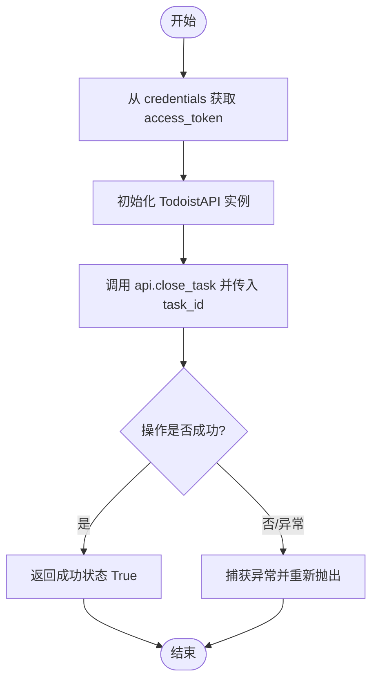

#### 带注释源码

```python
    @staticmethod
    def close_task(credentials: TodoistCredentials, task_id: str):
        try:
            # 使用凭证中的访问令牌初始化 TodoistAPI 客户端
            api = TodoistAPI(credentials.access_token.get_secret_value())
            # 调用 API 的 close_task 方法关闭指定 ID 的任务
            is_success = api.close_task(task_id=task_id)
            # 返回操作结果
            return is_success
        except Exception as e:
            # 捕获异常并重新抛出，以便上层处理
            raise e
```


### `TodoistCloseTaskBlock.run`

该方法是 `TodoistCloseTaskBlock` 类的核心执行逻辑，用于异步关闭 Todoist 中的指定任务。它接收包含认证信息和任务 ID 的输入数据，调用 Todoist API 执行关闭操作，并根据执行结果生成相应的输出。

参数：

- `input_data`：`TodoistCloseTaskBlock.Input`，包含执行该操作所需的输入数据，具体包括认证凭据和待关闭的任务 ID。
- `credentials`：`TodoistCredentials`，经过验证的 Todoist API 认证凭据对象。
- `**kwargs`：`dict`，扩展用的额外关键字参数。

返回值：`BlockOutput`，一个异步生成器，产生包含操作状态或错误信息的键值对。

#### 流程图

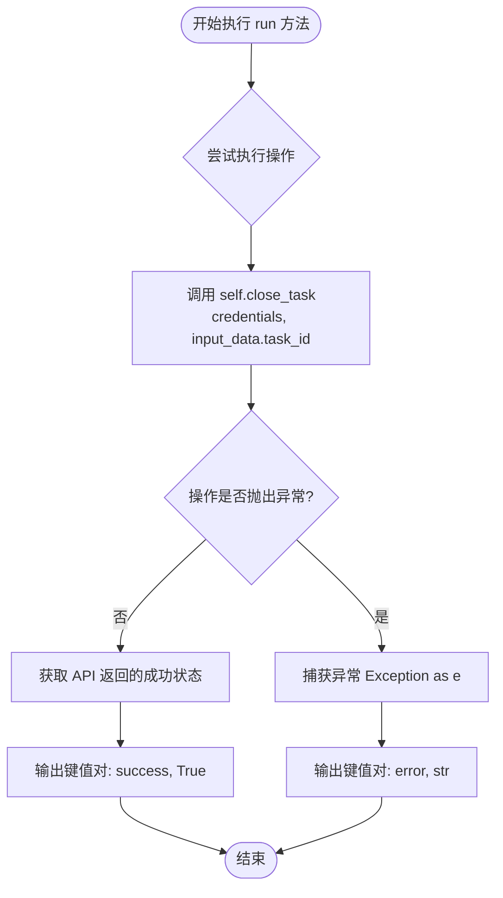

#### 带注释源码

```python
    async def run(
        self,
        input_data: Input,
        *,
        credentials: TodoistCredentials,
        **kwargs,
    ) -> BlockOutput:
        try:
            # 调用静态方法 close_task，传入凭证和任务ID，执行关闭操作
            # 该方法内部初始化 TodoistAPI 并调用 close_task 接口
            is_success = self.close_task(credentials, input_data.task_id)
            
            # 如果成功，生成包含 "success" 键和布尔值的输出
            yield "success", is_success

        except Exception as e:
            # 如果在尝试关闭任务过程中发生任何异常，捕获该异常
            # 并生成包含 "error" 键和错误信息字符串的输出
            yield "error", str(e)
```


### `TodoistReopenTaskBlock.__init__`

该方法是 `TodoistReopenTaskBlock` 类的构造函数，用于初始化块的各种属性，包括唯一标识符、描述、输入输出模式、测试配置以及基于 OAuth 配置状态的启用/禁用状态。

参数：

- `self`：`TodoistReopenTaskBlock`，类的实例本身。

返回值：`None`，Python 构造函数默认不返回任何值。

#### 流程图

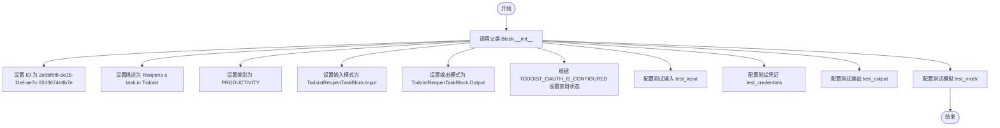

#### 带注释源码

```python
def __init__(self):
    # 调用父类 Block 的初始化方法，配置块的基本元数据和测试数据
    super().__init__(
        # 块的唯一标识符
        id="2e6bf6f8-de15-11ef-ae7c-32d3674e8b7e",
        # 块的功能描述
        description="Reopens a task in Todoist",
        # 块所属的分类（生产力类）
        categories={BlockCategory.PRODUCTIVITY},
        # 指定输入数据的 Schema 类
        input_schema=TodoistReopenTaskBlock.Input,
        # 指定输出数据的 Schema 类
        output_schema=TodoistReopenTaskBlock.Output,
        # 如果 OAuth 未配置，则禁用该块
        disabled=not TODOIST_OAUTH_IS_CONFIGURED,
        # 定义用于测试的输入数据
        test_input={"credentials": TEST_CREDENTIALS_INPUT, "task_id": "2995104339"},
        # 定义用于测试的凭证对象
        test_credentials=TEST_CREDENTIALS,
        # 定义预期的测试输出结果
        test_output=[("success", True)],
        # 定义模拟函数，用于在测试环境中替代真实的 API 调用
        test_mock={"reopen_task": lambda *args, **kwargs: (True)},
    )
```


### `TodoistReopenTaskBlock.reopen_task`

该静态方法通过调用 Todoist API 重新开启一个已关闭的任务，并返回操作是否成功。

参数：

-  `credentials`：`TodoistCredentials`，包含用于访问 Todoist API 的访问令牌的认证对象
-  `task_id`：`str`，需要重新打开的任务的唯一标识符

返回值：`bool`，表示任务是否成功重新打开的布尔状态

#### 流程图

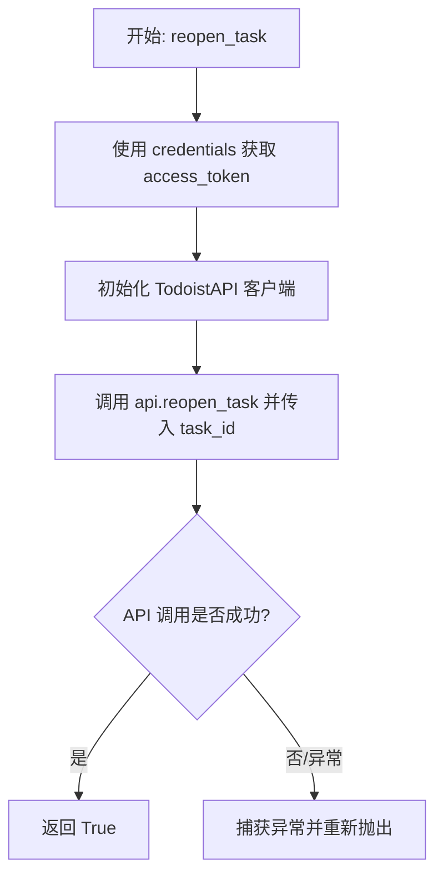

#### 带注释源码

```python
@staticmethod
def reopen_task(credentials: TodoistCredentials, task_id: str):
    # 使用 try-except 块捕获并处理 API 调用中可能出现的异常
    try:
        # 从凭证对象中获取访问令牌，并初始化 TodoistAPI 客户端实例
        api = TodoistAPI(credentials.access_token.get_secret_value())
        # 调用 Todoist API 的 reopen_task 方法来重新打开指定 ID 的任务
        is_success = api.reopen_task(task_id=task_id)
        # 返回 API 调用结果，通常为 True 表示成功
        return is_success
    except Exception as e:
        # 如果发生错误，抛出异常以便上层逻辑处理
        raise e
```


### `TodoistReopenTaskBlock.run`

该方法负责执行重新打开Todoist任务的业务逻辑。它接收包含任务ID的输入数据和认证凭据，通过调用静态方法与Todoist API交互，并将操作的成功状态或捕获的错误信息作为生成器的输出。

参数：

- `self`：`TodoistReopenTaskBlock`，类实例本身。
- `input_data`：`Input`，符合类输入Schema的数据结构，包含需要重新打开的任务ID等信息。
- `credentials`：`TodoistCredentials`，用于鉴权的Todoist凭据对象。
- `**kwargs`：`dict`，其他扩展关键字参数。

返回值：`BlockOutput`，异步生成器，逐步产出包含结果名称（如"success"或"error"）和对应值的元组。

#### 流程图

```mermaid
flowchart TD
    Start([开始]) --> ReceiveInput[接收 input_data 和 credentials]
    ReceiveInput --> CallMethod[调用 self.reopen_task<br>credentials, input_data.task_id]
    CallMethod --> CheckSuccess{执行是否成功?}
    CheckSuccess -- 成功 --> YieldSuccess[产出 success: True]
    CheckSuccess -- 抛出异常 --> CatchException[捕获 Exception e]
    CatchException --> YieldError[产出 error: str(e)]
    YieldSuccess --> End([结束])
    YieldError --> End
```

#### 带注释源码

```python
    async def run(
        self,
        input_data: Input,
        *,
        credentials: TodoistCredentials,
        **kwargs,
    ) -> BlockOutput:
        try:
            # 调用静态方法 reopen_task，传入凭据和任务ID以执行API请求
            is_success = self.reopen_task(credentials, input_data.task_id)
            
            # 产出执行结果，包含success键和布尔值
            yield "success", is_success

        except Exception as e:
            # 捕获执行过程中可能出现的任何异常
            # 产出错误信息，包含error键和异常字符串描述
            yield "error", str(e)
```


### `TodoistDeleteTaskBlock.__init__`

该方法用于初始化 `TodoistDeleteTaskBlock` 类的实例。它配置了块的唯一标识符、描述、类别、输入输出架构，并根据 OAuth 配置状态设置块的可用性。此外，它还定义了用于单元测试的输入、输出、凭据和模拟函数。

参数：

- `self`：`TodoistDeleteTaskBlock`，表示类实例本身。

返回值：`None`，无返回值。

#### 流程图

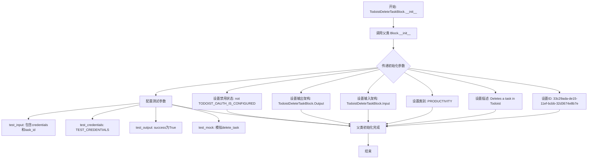

#### 带注释源码

```python
def __init__(self):
    # 调用父类 Block 的构造函数以初始化块的基本属性
    super().__init__(
        # 定义块的唯一标识符 UUID
        id="33c29ada-de15-11ef-bcbb-32d3674e8b7e",
        # 设置块的描述，表明其功能是删除 Todoist 中的任务
        description="Deletes a task in Todoist",
        # 将块归类到 PRODUCTIVITY（生产力）类别
        categories={BlockCategory.PRODUCTIVITY},
        # 指定输入数据结构为内部定义的 Input 类
        input_schema=TodoistDeleteTaskBlock.Input,
        # 指定输出数据结构为内部定义的 Output 类
        output_schema=TodoistDeleteTaskBlock.Output,
        # 如果 Todoist OAuth 未配置，则禁用该块
        disabled=not TODOIST_OAUTH_IS_CONFIGURED,
        # 定义测试用的输入数据，包含测试凭据和测试任务ID
        test_input={"credentials": TEST_CREDENTIALS_INPUT, "task_id": "2995104339"},
        # 定义测试用的凭据对象
        test_credentials=TEST_CREDENTIALS,
        # 定义预期的测试输出结果，期望操作成功
        test_output=[
            ("success", True),
        ],
        # 定义测试模拟函数，拦截 delete_task 调用并返回预定义的成功结果
        test_mock={"delete_task": lambda *args, **kwargs: (True)},
    )
```


### `TodoistDeleteTaskBlock.delete_task`

该方法用于通过 Todoist API 删除指定 ID 的任务。它使用提供的凭证初始化 API 客户端，执行删除操作，并返回操作结果。

参数：

- `credentials`：`TodoistCredentials`，包含 Todoist API 访问令牌的认证凭证对象。
- `task_id`：`str`，需要删除的任务的唯一标识符。

返回值：`bool`，表示任务删除操作是否成功。如果 API 调用抛出异常，则该异常会被重新抛出。

#### 流程图

```mermaid
flowchart TD
    Start([开始]) --> InitAPI[从 credentials 获取 access_token 并初始化 TodoistAPI]
    InitAPI --> DeleteTask[调用 api.delete_task 传入 task_id]
    DeleteTask --> CheckSuccess{检查执行结果}
    CheckSuccess -->|成功| ReturnSuccess[返回 True]
    CheckSuccess -->|发生异常| CatchError[捕获异常]
    CatchError --> RaiseError[重新抛出异常]
    ReturnSuccess --> End([结束])
    RaiseError --> End
```

#### 带注释源码

```python
    @staticmethod
    def delete_task(credentials: TodoistCredentials, task_id: str):
        try:
            # 使用凭证中的访问令牌初始化 TodoistAPI 客户端
            api = TodoistAPI(credentials.access_token.get_secret_value())
            # 调用 API 客户端的 delete_task 方法删除指定 ID 的任务
            is_success = api.delete_task(task_id=task_id)
            # 返回操作是否成功的布尔值
            return is_success
        except Exception as e:
            # 捕获执行过程中的任何异常并将其抛出，由上层调用者处理
            raise e
```


### `TodoistDeleteTaskBlock.run`

该方法是 `TodoistDeleteTaskBlock` 的核心执行逻辑，负责异步运行任务删除流程。它接收输入数据和认证凭据，调用 API 执行删除操作，并产出执行结果或捕获异常。

参数：

- `input_data`：`TodoistDeleteTaskBlock.Input`，包含块运行所需的输入数据，具体包含待删除任务的 ID。
- `credentials`：`TodoistCredentials`，用于认证和访问 Todoist API 的凭据对象。
- `**kwargs`：`dict`，额外的关键字参数（由框架传递，本方法中未直接使用）。

返回值：`BlockOutput`，一个异步生成器，产出包含执行状态（成功或错误信息）的键值对。

#### 流程图

```mermaid
flowchart TD
    A([开始 run]) --> B[调用 self.delete_task]
    B --> C{是否抛出异常?}
    C -- 否 --> D[产出 success 和 is_success]
    C -- 是 --> E[产出 error 和 异常信息]
    D --> F([结束])
    E --> F
```

#### 带注释源码

```python
    async def run(
        self,
        input_data: Input,
        *,
        credentials: TodoistCredentials,
        **kwargs,
    ) -> BlockOutput:
        try:
            # 调用静态方法 delete_task，传入凭据和从 input_data 中获取的任务 ID
            is_success = self.delete_task(credentials, input_data.task_id)
            # 如果成功，产出 success 字段和结果状态
            yield "success", is_success

        except Exception as e:
            # 如果发生任何异常，产出 error 字段和异常信息字符串
            yield "error", str(e)
```


## 关键组件


### TodoistCreateTaskBlock
封装了在 Todoist 项目中创建新任务的功能，支持设置内容、描述、截止日期、优先级等多种属性。

### TodoistGetTasksBlock
负责从 Todoist 获取活跃任务列表，并支持根据项目 ID、标签、自定义过滤器等条件进行筛选。

### TodoistGetTaskBlock
用于通过任务 ID 从 Todoist 检索单个特定任务的详细数据。

### TodoistUpdateTaskBlock
提供更新 Todoist 现有任务信息的功能，允许修改任务内容、归属项目、截止时间及执行者等字段。

### TodoistCloseTaskBlock
处理将指定任务标记为已完成（关闭）的操作。

### TodoistReopenTaskBlock
处理将已关闭的任务重新激活（重新打开）的操作。

### TodoistDeleteTaskBlock
负责从 Todoist 中永久删除指定的任务。


## 问题及建议


### 已知问题

-   **日期时间精度丢失**：在 `TodoistCreateTaskBlock` 和 `TodoistUpdateTaskBlock` 中，`due_date` 和 `deadline_date` 字段通过 `strftime("%Y-%m-%d")` 进行格式化。如果输入的 `datetime` 对象包含具体的时间信息（时、分、秒），这部分信息会被截断，仅保留日期部分，可能导致任务创建或更新时间不准确。
-   **冗余的异常捕获**：在静态方法（如 `create_task`, `get_tasks` 等）中，使用了 `try-except Exception as e: raise e` 的结构。这种写法没有对异常进行任何处理或日志记录，直接重新抛出，属于冗余代码，增加了不必要的嵌套层级。
-   **缺乏本地输入验证**：代码直接将输入参数传递给 Todoist API，依赖远程服务进行验证（例如 `priority` 是否在 1-4 之间）。这意味着无效请求也会消耗网络资源并增加延迟。

### 优化建议

-   **提取公共逻辑以消除代码重复**：各个 Block 的 `run` 方法中存在大量重复逻辑，例如将 `datetime` 转换为字符串的代码、过滤 `None` 值构建参数字典的代码。建议将这些逻辑提取到父类 `Block` 或独立的辅助函数/工具类中，以提高代码的可维护性。
-   **细化错误处理与日志记录**：目前的错误处理仅将异常转换为字符串输出。建议区分不同类型的异常（如网络错误、认证错误、参数校验错误），并返回结构化的错误信息（包含错误码和详细信息），或者在捕获异常时增加日志记录以便于排查问题。
-   **常量提取与配置化**：日期格式字符串 `"%Y-%m-%d"` 在代码中多次硬编码出现。建议将其定义为模块级常量或配置项，以便统一管理和修改。
-   **优化 API 客户端管理**：每个静态方法调用时都会实例化一个新的 `TodoistAPI` 对象。如果 API 库内部支持，可以考虑通过依赖注入或单例模式复用客户端实例，或者利用连接池来优化高频调用下的性能。


## 其它


### 设计目标与约束

**设计目标**：
1.  **功能封装**：提供一套标准化的模块（Block），用于封装 Todoist API 的核心功能，包括任务的创建、查询、更新、关闭、重新打开和删除。
2.  **集成性**：作为后端自动化系统的一部分，无缝集成到基于 Block 的工作流中，支持通过 OAuth 进行身份验证。
3.  **易用性**：通过定义明确的输入/输出 Schema，简化用户与 Todoist API 交互的复杂度，处理如日期格式化等底层细节。

**约束条件**：
1.  **环境依赖**：模块的启用依赖于全局配置 `TODOIST_OAUTH_IS_CONFIGURED`，只有在 OAuth 配置正确时 Block 才可用。
2.  **接口规范**：必须继承自基类 `Block`，并严格遵循 `BlockSchemaInput` 和 `BlockSchemaOutput` 的定义。
3.  **执行模式**：主要执行逻辑在异步方法 `run` 中，虽然底层 API 调用是同步的，但整体需适配异步框架。
4.  **数据格式**：API 要求特定的日期格式（YYYY-MM-DD），代码必须处理 Python `datetime` 对象到字符串的转换。

### 错误处理与异常设计

**处理策略**：
采用集中捕获并转化为输出流的策略，防止因 API 调用失败导致整个工作流中断，同时向下游传递错误信息。

**具体机制**：
1.  **捕获范围**：在 `run` 方法中，所有涉及 I/O 和外部 API 调用的代码块均被 `try...except Exception` 包裹。
2.  **异常转换**：捕获到任何异常后，不直接抛出堆栈信息，而是生成一个特定的错误输出元组 `("error", str(e))`。这使得工作流引擎能够检测到失败并据此进行分支处理。
3.  **静态方法层**：静态辅助方法（如 `create_task`、`get_tasks`）负责直接调用 `TodoistAPI`，它们将异常直接抛出给调用者（即 `run` 方法），不进行吞没或转换，保持了底层错误的原始性。

### 数据流与状态机

**数据流**：
1.  **输入验证与注入**：`run` 方法接收 `input_data`（包含业务参数）和 `credentials`（包含认证令牌）。
2.  **数据清洗与转换**：
    *   **日期格式化**：检查 `due_date` 和 `deadline_date`，若存在则转换为 "YYYY-MM-DD" 格式的字符串。
    *   **空值过滤**：构建 API 请求参数字典时，自动过滤掉值为 `None` 的字段，避免覆盖 API 端的默认行为。
3.  **外部交互**：使用清洗后的参数实例化 `TodoistAPI` 并执行相应操作。
4.  **结果映射与输出**：将 API 返回的对象（如 `Task` 对象或布尔值）转换为字典或基本类型，并通过 `yield` 语句按照 `Output` Schema 定义的键名逐个输出。

**状态机**：
代码本身作为无状态执行器，不维护内部状态，但其操作驱动了 Todoist 任务的**生命周期状态转换**：
*   **初始态**：通过 `TodoistCreateTaskBlock` 创建任务，任务进入“活跃”状态。
*   **更新态**：通过 `TodoistUpdateTaskBlock` 修改任务属性，不改变生命周期状态。
*   **完成态**：通过 `TodoistCloseTaskBlock` 将任务标记为完成。
*   **重开态**：通过 `TodoistReopenTaskBlock` 将已完成的任务恢复为“活跃”状态。
*   **终结态**：通过 `TodoistDeleteTaskBlock` 物理删除任务，任务不再存在于系统中。

### 外部依赖与接口契约

**外部依赖**：
1.  **第三方库**：`todoist_api_python` (Todoist 官方 Python SDK)，用于处理网络请求和模型序列化。
2.  **内部模块**：
    *   `backend.data.block`：提供 `Block` 基类、`BlockOutput` 类型别名及枚举。
    *   `backend.data.model`：提供 `SchemaField` 用于定义输入输出结构。
    *   `backend.blocks.todoist._auth`：提供 `TodoistCredentials` 及相关认证逻辑。

**接口契约**：
1.  **认证契约**：调用方必须提供实现了 `TodoistCredentials` 接口的对象，其中 `access_token` 必须包含有效的 Todoist API 令牌。
2.  **输入契约**：
    *   必填字段（如 `content` 或 `task_id`）若缺失将导致 API 调用失败。
    *   `datetime` 类型输入必须可转换为有效的日期字符串。
3.  **输出契约**：
    *   成功时：产生特定的键值对（如 `id`, `url`, `success`），值的类型必须与 `Output` 类中定义的类型一致。
    *   失败时：必然产生键为 `"error"` 且值为字符串描述的元组。

### 安全性与隐私

**凭证安全**：
1.  **令牌获取**：使用 `credentials.access_token.get_secret_value()` 获取令牌字符串。该方法通常用于处理敏感信息（如 `pydantic.SecretStr`），防止在日志打印或调试信息中意外泄露明文令牌。
2.  **最小化权限**：模块仅请求执行操作所需的令牌权限，没有额外的权限请求逻辑。

**数据隐私**：
1.  **参数过滤**：在发送给 API 之前，显式过滤掉 `None` 值参数。这不仅符合 API 语义，也避免了发送不必要或模糊的数据。
2.  **错误信息脱敏**：虽然 `str(e)` 可能包含 API 返回的详细信息，但代码层没有额外注入用户敏感数据到错误信息中，依赖底层 SDK 的安全处理。

### 并发与性能考虑

**并发模型**：
*   每个 Block 的 `run` 方法定义为 `async`，表明其设计用于在异步事件循环（如 asyncio）中运行。这允许在等待 I/O（Todoist API 响应）时释放执行权，提高工作流引擎的并发吞吐量。

**性能影响**：
*   **API 限制**：由于直接调用 Todoist REST API，模块的执行性能受限于网络延迟和 Todoist API 的速率限制。代码层未实现重试或速率限制控制，依赖于上层调用者的策略。
*   **内存效率**：使用 `yield` 生成输出流，而不是一次性返回所有数据，这对于处理大量任务列表（如 `TodoistGetTasksBlock`）时有助于降低内存峰值。

    