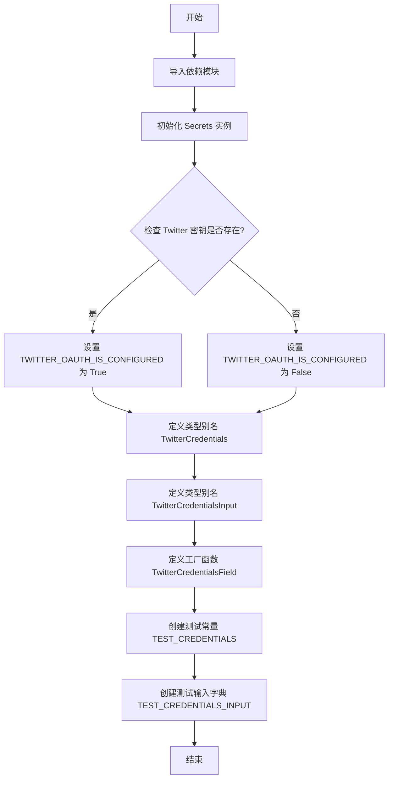
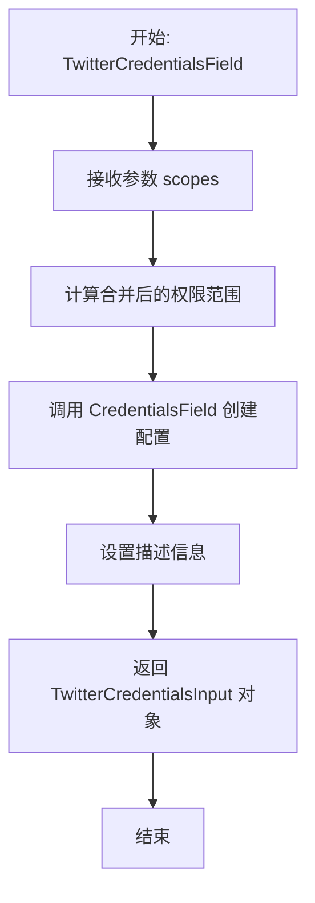

# `AutoGPT\autogpt_platform\backend\backend\blocks\twitter\_auth.py` 详细设计文档

该 Python 模块主要负责配置 Twitter OAuth2 集成所需的凭证类型、检查相关环境密钥是否已配置、提供生成凭证输入字段的工厂函数，以及定义用于测试的模拟凭证数据。

## 整体流程



## 类结构

```
Module (twitter_credentials.py)
├── Global Constants (全局常量)
│   ├── secrets
│   ├── TWITTER_OAUTH_IS_CONFIGURED
│   ├── TEST_CREDENTIALS
│   └── TEST_CREDENTIALS_INPUT
├── Type Aliases (类型别名)
│   ├── TwitterCredentials
│   └── TwitterCredentialsInput
└── Global Functions (全局函数)
    └── TwitterCredentialsField
```

## 全局变量及字段


### `secrets`
    
An instance of the Secrets class used to access application configuration and environment variables, specifically for loading Twitter API keys.

类型：`Secrets`
    


### `TWITTER_OAUTH_IS_CONFIGURED`
    
A boolean flag indicating whether both the Twitter client ID and client secret are present in the configuration.

类型：`bool`
    


### `TwitterCredentials`
    
Type alias representing the structure for Twitter OAuth2 credentials data.

类型：`Type[OAuth2Credentials]`
    


### `TwitterCredentialsInput`
    
Type alias representing the input schema for Twitter credentials, restricted to the 'twitter' provider and 'oauth2' type.

类型：`Type[CredentialsMetaInput]`
    


### `TEST_CREDENTIALS`
    
A mock instance of OAuth2Credentials containing dummy data (tokens, IDs, scopes) used for testing purposes.

类型：`OAuth2Credentials`
    


### `TEST_CREDENTIALS_INPUT`
    
A dictionary containing the metadata (provider, id, type, title) of the test credentials, formatted as input data.

类型：`dict`
    


    

## 全局函数及方法


### `TwitterCredentialsField`

用于在区块上创建 Twitter 凭证输入的工厂函数，它会将 Twitter 的默认 OAuth 权限范围与用户指定的权限范围合并，并返回配置好的凭证输入字段。

参数：

- `scopes`：`list[str]`，区块运行所需的授权范围列表。

返回值：`TwitterCredentialsInput`，配置好的 Twitter OAuth2 凭证输入字段对象。

#### 流程图



#### 带注释源码

```python
def TwitterCredentialsField(scopes: list[str]) -> TwitterCredentialsInput:
    """
    Creates a Twitter credentials input on a block.

    Params:
        scopes: The authorization scopes needed for the block to work.
    """
    return CredentialsField(
        # 将 Twitter OAuth 处理器的默认范围与传入的范围合并
        # 确保包含基础的默认权限以及业务代码请求的特定权限
        required_scopes=set(TwitterOAuthHandler.DEFAULT_SCOPES + scopes),
        # 设置字段的描述信息，提示需要 OAuth2 认证
        description="The Twitter integration requires OAuth2 authentication.",
    )
```


## 关键组件


### Twitter OAuth 配置状态

检查系统设置中是否存在 Twitter 客户端 ID 和密钥，以判断 Twitter OAuth 集成是否已启用。

### Twitter 凭证类型定义

基于通用 OAuth2 凭证模型定义的 Twitter 特定类型别名，用于规范凭证的数据结构。

### Twitter 凭证字段生成器

一个工厂函数，用于创建包含特定权限范围的 Twitter 凭证输入字段，自动合并默认权限与请求权限。

### 测试凭证数据

预定义的模拟 Twitter OAuth2 凭证对象及其输入字典，用于测试和开发目的。


## 问题及建议


### 已知问题

-   **生产代码中包含测试数据**：代码中定义了 `TEST_CREDENTIALS` 和 `TEST_CREDENTIALS_INPUT`，硬编码的 Mock 数据通常不应存在于业务逻辑代码库中，这增加了维护负担，且可能被误用或被静态分析工具误报为敏感信息泄露。
-   **模块导入时的副作用**：在全局作用域直接实例化 `Secrets()` 并计算 `TWITTER_OAUTH_IS_CONFIGURED`，会导致模块被导入时立即执行 I/O 操作或环境变量读取。这不仅增加了模块导入的开销，也使得无法在运行时动态更改配置（例如在测试中无法轻松模拟不同的配置状态）。
-   **硬编码的敏感字符串字面量**：尽管标记为 "mock-"，但在代码中直接写入 "mock-twitter-access-token" 等字符串，不符合安全编码最佳实践，容易触发安全扫描报警。
-   **注释与代码实现存在歧义**：注释提到 "We are getting all the permission... In future... use these requested_scopes"，暗示当前可能未使用传入的 `scopes` 参数或仅使用了默认值，但实际代码逻辑是将 `DEFAULT_SCOPES` 与传入的 `scopes` 进行了合并。这种不一致会导致开发者对函数行为的误解。

### 优化建议

-   **移除 Mock 数据至测试目录**：将 `TEST_CREDENTIALS` 相关的代码移动到 `tests/` 目录下的 `conftest.py` 或专用的 fixtures 文件中，保持生产代码的整洁。
-   **实现配置的懒加载或依赖注入**：将 `secrets` 的实例化和配置检查封装在函数内部（如 `is_twitter_oauth_configured()` 函数），或者通过依赖注入的方式传入配置对象，避免模块导入时的副作用，提高代码的可测试性和灵活性。
-   **使用动态生成或环境变量管理测试数据**：对于测试所需的 ID 和 Token，建议使用 `uuid4()` 或 Faker 等库动态生成，或者通过环境变量注入，避免源码中出现固定的伪凭据字符串。
-   **澄清 Scope 合并策略**：更新 `TwitterCredentialsField` 函数的文档字符串（Docstring），明确说明参数 `scopes` 是会覆盖默认 Scope，还是会与默认 Scope 进行合并（当前代码为合并），消除歧义。


## 其它


### 设计目标与约束

本模块旨在为 Twitter (X) 平台集成提供标准化的凭证定义、配置检查及测试数据支持。设计目标包括：

1.  **类型安全与标准化**：利用 Pydantic 的 `BaseModel` 和 Python 的 `Literal` 类型，强制约束凭证提供者必须为 `twitter`，认证类型必须为 `oauth2`，确保在编译期和运行期的类型安全。
2.  **统一的凭证字段生成**：通过 `TwitterCredentialsField` 函数封装底层 `CredentialsField` 的复杂性，自动处理默认权限与自定义权限的合并逻辑，简化集成块的配置流程。
3.  **环境适配性**：通过检查环境变量（`twitter_client_id` 和 `twitter_client_secret`）动态判断 OAuth 是否配置完成，允许系统在未配置时优雅降级或跳过相关功能，而非直接崩溃。
4.  **测试隔离**：提供 Mock 数据结构，确保在无真实 Twitter 凭证或网络环境的情况下，单元测试和集成测试仍能正常进行。

**约束条件**：
*   必须依赖 `backend.data.model` 中定义的基础凭证模型。
*   当前权限获取策略为“预授权全量权限”，暂不支持运行时的增量授权逻辑。
*   测试凭证数据硬编码在代码中，仅供测试环境使用，严禁用于生产环境。

### 错误处理与异常设计

本模块主要侧重于定义和检查，不包含复杂的业务逻辑异常抛出，其错误处理机制主要依赖于以下层面：

1.  **配置验证**：通过 `TWITTER_OAUTH_IS_CONFIGURED` 变量对环境配置进行显式检查。该变量是一个布尔值，调用方需在执行 OAuth 流程前检查该标志，若为 `False`，调用方应决定是否抛出“配置缺失”错误或禁用相关功能。
2.  **数据验证**：利用 Pydantic 模型的自动验证机制。当构建 `OAuth2Credentials` 或 `TwitterCredentialsInput` 实例时，如果缺少必要字段（如 `id`, `provider`, `access_token`）或类型不匹配，Pydantic 将自动抛出 `ValidationError` 异常，阻断非法数据的流入。
3.  **类型约束**：使用 `Literal[ProviderName.TWITTER]` 和 `Literal["oauth2"]` 在类型层面防止了错误的提供者名称或认证类型的注入，属于静态防御。

### 数据流与状态机

本模块涉及的数据流主要包括配置初始化流和凭证字段生成流：

1.  **配置初始化流**：
    *   **输入**：系统环境变量（包含 `twitter_client_id` 和 `twitter_client_secret`）。
    *   **处理**：`Secrets()` 单例加载环境变量 -> 逻辑判断检查 ID 和 Secret 是否均存在 -> 赋值给全局变量 `TWITTER_OAUTH_IS_CONFIGURED`。
    *   **输出**：全局布尔状态 `TWITTER_OAUTH_IS_CONFIGURED`。

2.  **凭证字段定义流**：
    *   **输入**：开发者在 Block 中指定的特定权限列表 `scopes`。
    *   **处理**：调用 `TwitterCredentialsField(scopes)` -> 读取 `TwitterOAuthHandler.DEFAULT_SCOPES` (基础权限) -> 将基础权限与输入权限取并集 (`set(...) + scopes`) -> 传递给底层 `CredentialsField`。
    *   **输出**：配置好的 Pydantic Field 对象，用于 UI 渲染和数据验证。

3.  **测试数据流**：
    *   **状态**：静态定义的 `TEST_CREDENTIALS` 对象模拟了一个已授权、未过期的 OAuth 会话状态。

### 外部依赖与接口契约

本模块依赖以下外部组件，并遵循相应的接口契约：

1.  **`backend.util.settings.Secrets`**
    *   **契约**：该类必须是一个单例或可配置实例，需公开 `twitter_client_id` 和 `twitter_client_secret` 属性。这些属性应能安全地处理缺失情况（返回 `None` 或空字符串）。
2.  **`backend.data.model`**
    *   **`CredentialsField`**：一个工厂函数，必须接受 `required_scopes` (set[str]) 和 `description` (str) 参数，并返回一个 Pydantic Field 实例。
    *   **`CredentialsMetaInput`**：一个泛型类型，用于定义输入凭证的元数据结构。
    *   **`OAuth2Credentials`**：一个 Pydantic 模型，必须包含 `id`, `provider`, `access_token`, `refresh_token`, `scopes` 等字段，用于存储完整的 OAuth2 凭证信息。
    *   **`ProviderName`**：枚举类型，必须包含 `TWITTER` 成员。
3.  **`backend.integrations.oauth.twitter.TwitterOAuthHandler`**
    *   **契约**：必须定义类级别的常量 `DEFAULT_SCOPES` (list[str])，表示初始化 Twitter OAuth 连接时默认需要的最低权限集合。
4.  **`pydantic.SecretStr`**
    *   **契约**：用于敏感字符串的包装，确保在日志或 repr 输出中自动掩盖真实值。

    