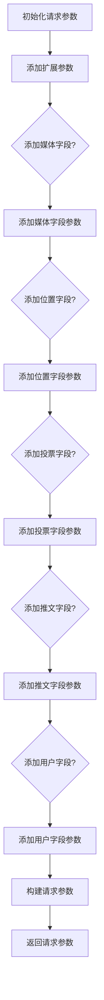
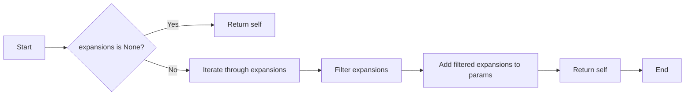
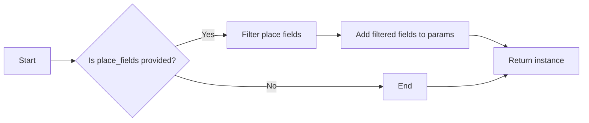
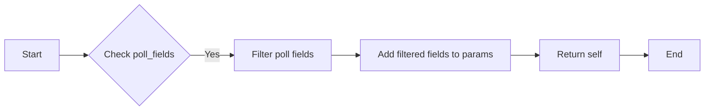
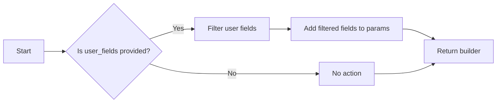
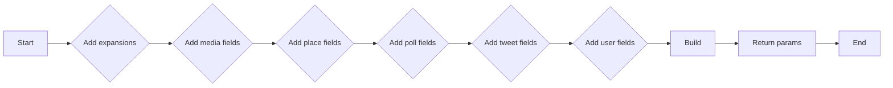
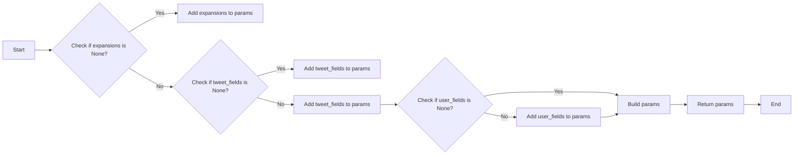
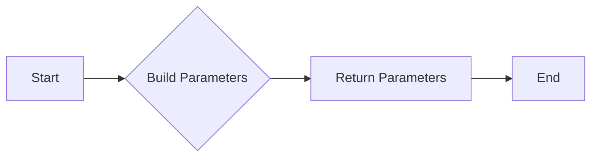
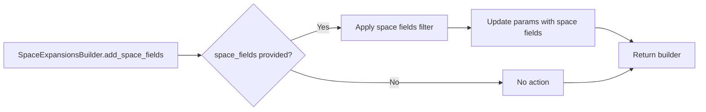
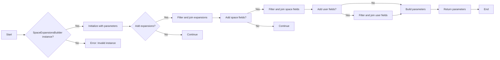

# `.\AutoGPT\autogpt_platform\backend\backend\blocks\twitter\_builders.py` 详细设计文档

This file contains a set of builders for constructing different types of Twitter API requests, including tweet expansions, user expansions, list expansions, space expansions, and tweet search and post operations.

## 整体流程



## 类结构

```
TweetExpansionsBuilder
├── UserExpansionsBuilder
│   ├── ListExpansionsBuilder
│   ├── SpaceExpansionsBuilder
│   └── DMExpansionsBuilder
├── TweetDurationBuilder
├── TweetSearchBuilder
└── TweetPostBuilder
```

## 全局变量及字段


### `params`
    
Holds the parameters for building the expansions for a tweet.

类型：`Dict[str, Any]`
    


### `TweetExpansionsBuilder.params`
    
Holds the parameters for building the expansions for a tweet.

类型：`Dict[str, Any]`
    
    

## 全局函数及方法


### TweetExpansionsBuilder.add_expansions

This method adds expansions to the parameters of a Twitter API request.

参数：

- `expansions`：`ExpansionFilter | None`，A filter object that specifies the expansions to include in the request.

返回值：`self`，The instance of the `TweetExpansionsBuilder` class with the expansions added.

#### 流程图



#### 带注释源码

```python
def add_expansions(self, expansions: ExpansionFilter | None):
    if expansions:
        filtered_expansions = [
            name for name, value in expansions.dict().items() if value is True
        ]

        if filtered_expansions:
            self.params["expansions"] = ",".join(
                [get_backend_expansion(exp) for exp in filtered_expansions]
            )

    return self
```


### TweetExpansionsBuilder.add_media_fields

This method adds media fields to the parameters of a Twitter API request.

参数：

- `media_fields`：`TweetMediaFieldsFilter | None`，A filter object that specifies which media fields to include in the request.

返回值：`self`，The instance of the `TweetExpansionsBuilder` class with the media fields added.

#### 流程图

```mermaid
graph LR
A[Start] --> B{Check if media_fields is None?}
B -- Yes --> C[End]
B -- No --> D{Iterate over media_fields}
D --> E{Is value True?}
E -- Yes --> F{Get backend media field}
F --> G[Add to self.params["media.fields"]]
G --> H[Return self]
E -- No --> I[Continue iteration]
I --> D
```

#### 带注释源码

```python
def add_media_fields(self, media_fields: TweetMediaFieldsFilter | None):
    if media_fields:
        filtered_fields = [
            name for name, value in media_fields.dict().items() if value is True
        ]
        if filtered_fields:
            self.params["media.fields"] = ",".join(
                [get_backend_media_field(field) for field in filtered_fields]
            )
    return self
```


### TweetExpansionsBuilder.add_place_fields

This method adds place fields to the parameters of a TweetExpansionsBuilder instance.

参数：

- `place_fields`：`TweetPlaceFieldsFilter | None`，A filter object that specifies the fields to be included for the place.

返回值：`TweetExpansionsBuilder`，The instance itself with the added place fields.

#### 流程图



#### 带注释源码

```python
def add_place_fields(self, place_fields: TweetPlaceFieldsFilter | None):
    if place_fields:
        filtered_fields = [
            name for name, value in place_fields.dict().items() if value is True
        ]
        if filtered_fields:
            self.params["place.fields"] = ",".join(
                [get_backend_place_field(field) for field in filtered_fields]
            )
    return self
```


### TweetExpansionsBuilder.add_poll_fields

This method adds poll fields to the parameters of a Twitter API request.

参数：

- `poll_fields`：`TweetPollFieldsFilter | None`，A filter object that specifies which fields to include in the poll response.

返回值：`self`，The instance of the `TweetExpansionsBuilder` class with the poll fields added.

#### 流程图



#### 带注释源码

```python
def add_poll_fields(self, poll_fields: TweetPollFieldsFilter | None):
    if poll_fields:
        filtered_fields = [
            name for name, value in poll_fields.dict().items() if value is True
        ]
        if filtered_fields:
            self.params["poll.fields"] = ",".join(
                [get_backend_poll_field(field) for field in filtered_fields]
            )
    return self
```


### TweetExpansionsBuilder.add_tweet_fields

This method adds tweet fields to the parameters of the TweetExpansionsBuilder object.

参数：

- `tweet_fields`：`TweetFieldsFilter | None`，A filter object that specifies the fields to be included in the tweet.

返回值：`self`，The updated TweetExpansionsBuilder object.

#### 流程图

```mermaid
graph LR
A[Start] --> B{tweet_fields is None?}
B -- Yes --> C[End]
B -- No --> D[Iterate over tweet_fields]
D --> E[Filter fields where value is True]
E --> F[Join filtered field names]
F --> G[Set "tweet.fields" parameter]
G --> H[Return self]
```

#### 带注释源码

```python
def add_tweet_fields(self, tweet_fields: TweetFieldsFilter | None):
    if tweet_fields:
        filtered_fields = [
            name for name, value in tweet_fields.dict().items() if value is True
        ]
        if filtered_fields:
            self.params["tweet.fields"] = ",".join(
                [get_backend_field(field) for field in filtered_fields]
            )
    return self
```


### TweetExpansionsBuilder.add_user_fields

This method adds user fields to the parameters of a Twitter API request.

参数：

- `user_fields`：`TweetUserFieldsFilter | None`，A filter object that specifies which user fields to include in the API request.

返回值：`TweetExpansionsBuilder`，The builder object with the user fields added.

#### 流程图



#### 带注释源码

```python
def add_user_fields(self, user_fields: TweetUserFieldsFilter | None):
    if user_fields:
        filtered_fields = [
            name for name, value in user_fields.dict().items() if value is True
        ]
        if filtered_fields:
            self.params["user.fields"] = ",".join(
                [get_backend_user_field(field) for field in filtered_fields]
            )
    return self
```


### TweetExpansionsBuilder.build

This method builds a dictionary of parameters for a Twitter API request to fetch tweet expansions.

参数：

- `self`：`TweetExpansionsBuilder`对象，表示当前构建器实例

返回值：`Dict[str, Any]`，包含构建的参数字典

#### 流程图



#### 带注释源码

```python
def build(self):
    # Return the built parameters
    return self.params
```


### UserExpansionsBuilder.add_expansions

This method adds expansions to the parameters of a user request.

参数：

- `expansions`：`UserExpansionsFilter | None`，A filter object that specifies the expansions to include in the request.

返回值：`self`，The instance of the UserExpansionsBuilder with the expansions added.

#### 流程图

```mermaid
graph LR
A[Start] --> B{expansions is None?}
B -- Yes --> C[Return self]
B -- No --> D[Create filtered_expansions]
D --> E[Is filtered_expansions empty?]
E -- Yes --> C
E -- No --> F[Set params["expansions"]]
F --> C
C --> G[End]
```

#### 带注释源码

```python
def add_expansions(self, expansions: UserExpansionsFilter | None):
    if expansions:
        filtered_expansions = [
            name for name, value in expansions.dict().items() if value is True
        ]
        if filtered_expansions:
            self.params["expansions"] = ",".join(filtered_expansions)
    return self
```


### UserExpansionsBuilder.add_tweet_fields

This method adds tweet fields to the parameters of the UserExpansionsBuilder object.

参数：

- `tweet_fields`：`TweetFieldsFilter | None`，A filter object that specifies the fields to be included in the tweet.

返回值：`UserExpansionsBuilder`，The updated UserExpansionsBuilder object.

#### 流程图

```mermaid
graph LR
A[Start] --> B{tweet_fields is None?}
B -- Yes --> C[Return UserExpansionsBuilder]
B -- No --> D[Create filtered_fields]
D --> E[Is filtered_fields empty?]
E -- Yes --> C
E -- No --> F[Join filtered_fields into a string]
F --> G[Add string to params["tweet.fields"]]
G --> C
```

#### 带注释源码

```python
def add_tweet_fields(self, tweet_fields: TweetFieldsFilter | None):
    if tweet_fields:
        filtered_fields = [
            name for name, value in tweet_fields.dict().items() if value is True
        ]
        if filtered_fields:
            self.params["tweet.fields"] = ",".join(
                [get_backend_field(field) for field in filtered_fields]
            )
    return self
```


### UserExpansionsBuilder.add_user_fields

This method adds user fields to the parameters of a Twitter API request.

参数：

- `user_fields`：`TweetUserFieldsFilter | None`，A filter object that specifies which user fields to include in the API request.

返回值：`UserExpansionsBuilder`，The builder object with the user fields added.

#### 流程图


#### 带注释源码

```python
def add_user_fields(self, user_fields: TweetUserFieldsFilter | None):
    if user_fields:
        filtered_fields = [
            name for name, value in user_fields.dict().items() if value is True
        ]
        if filtered_fields:
            self.params["user.fields"] = ",".join(
                [get_backend_user_field(field) for field in filtered_fields]
            )
    return self
```


### UserExpansionsBuilder.build

This method builds a dictionary of parameters for querying user-related information from the Twitter API.

参数：

- `expansions`：`UserExpansionsFilter | None`，A filter object that specifies the expansions to include in the user request.
- `tweet_fields`：`TweetFieldsFilter | None`，A filter object that specifies the fields to include in the user's tweets.
- `user_fields`：`TweetUserFieldsFilter | None`，A filter object that specifies the fields to include in the user object.

返回值：`Dict[str, Any]`，A dictionary of parameters to be used in the user request.

#### 流程图



#### 带注释源码

```python
def build(self):
    # Add expansions if provided
    if self.expansions:
        filtered_expansions = [
            name for name, value in self.expansions.dict().items() if value is True
        ]
        if filtered_expansions:
            self.params["expansions"] = ",".join(filtered_expansions)

    # Add tweet fields if provided
    if self.tweet_fields:
        filtered_fields = [
            name for name, value in self.tweet_fields.dict().items() if value is True
        ]
        if filtered_fields:
            self.params["tweet.fields"] = ",".join(
                [get_backend_field(field) for field in filtered_fields]
            )

    # Add user fields if provided
    if self.user_fields:
        filtered_fields = [
            name for name, value in self.user_fields.dict().items() if value is True
        ]
        if filtered_fields:
            self.params["user.fields"] = ",".join(
                [get_backend_user_field(field) for field in filtered_fields]
            )

    return self.params
```


### ListExpansionsBuilder.add_expansions

This method adds expansions to the parameters of a Twitter API request for a list.

参数：

- `expansions`：`ListExpansionsFilter | None`，A filter object that specifies the expansions to include in the request.

返回值：`self`，The instance of the ListExpansionsBuilder with the expansions added.

#### 流程图

```mermaid
graph LR
A[Start] --> B{expansions is None?}
B -- Yes --> C[Return self]
B -- No --> D[Iterate through expansions]
D --> E[Filter expansions]
E --> F[Join filtered expansions]
F --> G[Set "expansions" in params]
G --> H[Return self]
H --> I[End]
```

#### 带注释源码

```python
def add_expansions(self, expansions: ListExpansionsFilter | None):
    if expansions:
        filtered_expansions = [
            name for name, value in expansions.dict().items() if value is True
        ]
        if filtered_expansions:
            self.params["expansions"] = ",".join(
                [get_backend_list_expansion(exp) for exp in filtered_expansions]
            )
    return self
```


### ListExpansionsBuilder.add_list_fields

This method adds list fields to the parameters of the ListExpansionsBuilder object.

参数：

- `list_fields`：`ListFieldsFilter | None`，A filter object that specifies the fields to be included in the list.

返回值：`ListExpansionsBuilder`，The updated ListExpansionsBuilder object.

#### 流程图

```mermaid
graph LR
A[Start] --> B{Is list_fields None?}
B -- Yes --> C[End]
B -- No --> D[Create filtered_fields list]
D --> E{Is filtered_fields empty?}
E -- Yes --> F[End]
E -- No --> G[Join filtered_fields into a string]
G --> H[Set params["list.fields"] to the string]
H --> I[Return self]
```

#### 带注释源码

```python
def add_list_fields(self, list_fields: ListFieldsFilter | None):
    if list_fields:
        filtered_fields = [
            name for name, value in list_fields.dict().items() if value is True
        ]
        if filtered_fields:
            self.params["list.fields"] = ",".join(
                [get_backend_list_field(field) for field in filtered_fields]
            )
    return self
```


### ListExpansionsBuilder.add_user_fields

This method adds user fields to the parameters of a list expansion request.

参数：

- `user_fields`：`TweetUserFieldsFilter | None`，A filter object that specifies the user fields to include in the request.

返回值：`ListExpansionsBuilder`，The builder object with the user fields added.

#### 流程图


#### 带注释源码

```python
def add_user_fields(self, user_fields: TweetUserFieldsFilter | None):
    if user_fields:
        filtered_fields = [
            name for name, value in user_fields.dict().items() if value is True
        ]
        if filtered_fields:
            self.params["user.fields"] = ",".join(
                [get_backend_user_field(field) for field in filtered_fields]
            )
    return self
```


### ListExpansionsBuilder.build

This method builds a dictionary of parameters for a Twitter API request to fetch list expansions.

参数：

- 无

返回值：`Dict[str, Any]`，A dictionary containing the parameters for the Twitter API request.

#### 流程图



#### 带注释源码

```python
def build(self):
    # Return the built parameters dictionary
    return self.params
```


### SpaceExpansionsBuilder.add_expansions

This method adds expansions to the parameters of a SpaceExpansionsBuilder object. It filters the provided expansions and appends the corresponding backend expansion names to the "expansions" parameter of the object.

参数：

- `expansions`：`SpaceExpansionsFilter | None`，The filter object containing the expansions to be added. If None, no expansions are added.

返回值：`SpaceExpansionsBuilder`，The updated SpaceExpansionsBuilder object with the expansions added.

#### 流程图

```mermaid
graph LR
A[SpaceExpansionsBuilder.add_expansions] --> B{expansions is None?}
B -- Yes --> C[Return updated SpaceExpansionsBuilder]
B -- No --> D[Filter expansions]
D --> E[Join filtered expansions]
E --> F[Set "expansions" parameter]
F --> C
```

#### 带注释源码

```python
def add_expansions(self, expansions: SpaceExpansionsFilter | None):
    if expansions:
        filtered_expansions = [
            name for name, value in expansions.dict().items() if value is True
        ]
        if filtered_expansions:
            self.params["expansions"] = ",".join(
                [get_backend_space_expansion(exp) for exp in filtered_expansions]
            )
    return self
``` 


### SpaceExpansionsBuilder.add_space_fields

This method adds space fields to the parameters of a space expansion request.

参数：

- `space_fields`：`SpaceFieldsFilter | None`，A filter object that specifies the fields to be included in the space expansion request.

返回值：`SpaceExpansionsBuilder`，The builder object itself, allowing for further configuration.

#### 流程图



#### 带注释源码

```python
def add_space_fields(self, space_fields: SpaceFieldsFilter | None):
    if space_fields:
        filtered_fields = [
            name for name, value in space_fields.dict().items() if value is True
        ]
        if filtered_fields:
            self.params["space.fields"] = ",".join(
                [get_backend_space_field(field) for field in filtered_fields]
            )
    return self
```


### SpaceExpansionsBuilder.add_user_fields

This method adds user fields to the parameters of a SpaceExpansionsBuilder object.

参数：

- `user_fields`：`TweetUserFieldsFilter | None`，A filter object that specifies which user fields to include in the request.

返回值：`SpaceExpansionsBuilder`，The updated SpaceExpansionsBuilder object with the user fields added.

#### 流程图

```mermaid
graph LR
A[SpaceExpansionsBuilder.add_user_fields] --> B{user_fields is None?}
B -- Yes --> C[Return updated SpaceExpansionsBuilder]
B -- No --> D[Iterate over user_fields]
D --> E[Filter fields where value is True]
E --> F[Join filtered field names into a string]
F --> G[Add string to "user.fields" parameter]
G --> C
```

#### 带注释源码

```python
def add_user_fields(self, user_fields: TweetUserFieldsFilter | None):
    if user_fields:
        filtered_fields = [
            name for name, value in user_fields.dict().items() if value is True
        ]
        if filtered_fields:
            self.params["user.fields"] = ",".join(
                [get_backend_user_field(field) for field in filtered_fields]
            )
    return self
```


### SpaceExpansionsBuilder.build

This method builds a dictionary of parameters for a space expansion request in the Twitter API.

参数：

- 无

返回值：`Dict[str, Any]`，A dictionary containing the parameters for the space expansion request.

#### 流程图



#### 带注释源码

```python
class SpaceExpansionsBuilder:
    # ... (other methods)

    def build(self):
        # Build the parameters dictionary
        return self.params
```


### DMExpansionsBuilder.add_expansions

This method adds expansions to the parameters of a DM (Direct Message) API request.

参数：

- `expansions`：`DMEventExpansionFilter`，A filter object that specifies the expansions to include in the request.

返回值：`DMExpansionsBuilder`，The builder object itself, allowing for further configuration.

#### 流程图

```mermaid
graph LR
A[Start] --> B{expansions is None?}
B -- Yes --> C[Return builder]
B -- No --> D[Iterate through expansions]
D --> E[Is value True?]
E -- Yes --> F[Add expansion to params]
E -- No --> D
F --> G[Return builder]
```

#### 带注释源码

```python
def add_expansions(self, expansions: DMEventExpansionFilter):
    if expansions:
        filtered_expansions = [
            name for name, value in expansions.dict().items() if value is True
        ]
        if filtered_expansions:
            self.params["expansions"] = ",".join(filtered_expansions)
    return self
```


### DMExpansionsBuilder.add_event_types

This method adds event types to the parameters of a DM (Direct Message) expansions builder.

参数：

- `event_types`：`DMEventTypeFilter`，A filter object that specifies the event types to include in the DM expansions.

返回值：`DMExpansionsBuilder`，The builder object with the event types added.

#### 流程图

```mermaid
graph LR
A[DMExpansionsBuilder.add_event_types] --> B{event_types provided?}
B -- Yes --> C[Add event types to params]
B -- No --> D[Return builder]
C --> E[Return builder]
```

#### 带注释源码

```python
def add_event_types(self, event_types: DMEventTypeFilter):
    if event_types:
        filtered_types = [
            name for name, value in event_types.dict().items() if value is True
        ]
        if filtered_types:
            self.params["event_types"] = ",".join(filtered_types)
    return self
```


### DMExpansionsBuilder.add_media_fields

This method adds media fields to the parameters of a DM (Direct Message) expansion request.

参数：

- `media_fields`：`DMMediaFieldFilter`，A filter object that specifies which media fields to include in the request.

返回值：`DMExpansionsBuilder`，The builder object itself, allowing for further configuration.

#### 流程图

```mermaid
graph LR
A[Start] --> B{Check if media_fields is None?}
B -- Yes --> C[End]
B -- No --> D{Iterate over media_fields}
D --> E{Is value True?}
E -- Yes --> F{Get backend media field}
F --> G[Add to params["media.fields"]]
G --> H[Return self]
E -- No --> H
```

#### 带注释源码

```python
def add_media_fields(self, media_fields: DMMediaFieldFilter | None):
    if media_fields:
        filtered_fields = [
            name for name, value in media_fields.dict().items() if value is True
        ]
        if filtered_fields:
            self.params["media.fields"] = ",".join(
                [get_backend_media_field(field) for field in filtered_fields]
            )
    return self
```


### DMExpansionsBuilder.add_tweet_fields

This method adds tweet fields to the parameters of a DMExpansionsBuilder instance.

参数：

- `tweet_fields`：`DMTweetFieldFilter`，A filter object that specifies the fields to be included in the tweet data.

返回值：`DMExpansionsBuilder`，The instance itself with the tweet fields added.

#### 流程图

```mermaid
graph LR
A[Start] --> B{tweet_fields is None?}
B -- Yes --> C[End]
B -- No --> D[Iterate over tweet_fields]
D --> E[Is value True?]
E -- Yes --> F[Get backend field for field name]
F --> G[Add field to params]
G --> H[End iteration]
H --> C
```

#### 带注释源码

```python
def add_tweet_fields(self, tweet_fields: DMTweetFieldFilter | None):
    if tweet_fields:
        filtered_fields = [
            name for name, value in tweet_fields.dict().items() if value is True
        ]
        if filtered_fields:
            self.params["tweet.fields"] = ",".join(
                [get_backend_field(field) for field in filtered_fields]
            )
    return self
```


### DMExpansionsBuilder.add_user_fields

This method adds user fields to the parameters of a DM (Direct Message) expansions request.

参数：

- `user_fields`：`TweetUserFieldsFilter`，A filter object that specifies which user fields to include in the request.

返回值：`DMExpansionsBuilder`，The builder object itself, allowing for further configuration.

#### 流程图

```mermaid
graph LR
A[Start] --> B{Check user_fields}
B -- Yes --> C[Filter user fields]
C --> D[Add filtered fields to params]
D --> E[Return builder]
E --> F[End]
```

#### 带注释源码

```python
def add_user_fields(self, user_fields: TweetUserFieldsFilter | None):
    if user_fields:
        filtered_fields = [
            name for name, value in user_fields.dict().items() if value is True
        ]
        if filtered_fields:
            self.params["user.fields"] = ",".join(
                [get_backend_user_field(field) for field in filtered_fields]
            )
    return self
```


### DMExpansionsBuilder.build

This method builds a dictionary of parameters for a Direct Message (DM) expansions request in the Twitter API.

参数：

- 无

返回值：`Dict[str, Any]`，A dictionary containing the parameters for the DM expansions request.

#### 流程图

```mermaid
graph LR
A[Start] --> B{Add Expansions?}
B -- Yes --> C[Add Event Types?]
B -- No --> D[Add Media Fields?]
C -- Yes --> E[Add Tweet Fields?]
C -- No --> F[Add User Fields?]
D -- Yes --> G[Add Tweet Fields?]
D -- No --> H[Add User Fields?]
E -- Yes --> I[Build]
E -- No --> I
F -- Yes --> I
F -- No --> I
G -- Yes --> I
G -- No --> I
H -- Yes --> I
H -- No --> I
I --> J[End]
```

#### 带注释源码

```python
def build(self):
    # Add Expansions
    if self.expansions:
        filtered_expansions = [
            name for name, value in self.expansions.dict().items() if value is True
        ]
        if filtered_expansions:
            self.params["expansions"] = ",".join(filtered_expansions)

    # Add Event Types
    if self.event_types:
        filtered_types = [
            name for name, value in self.event_types.dict().items() if value is True
        ]
        if filtered_types:
            self.params["event_types"] = ",".join(filtered_types)

    # Add Media Fields
    if self.media_fields:
        filtered_fields = [
            name for name, value in self.media_fields.dict().items() if value is True
        ]
        if filtered_fields:
            self.params["media.fields"] = ",".join(filtered_fields)

    # Add Tweet Fields
    if self.tweet_fields:
        filtered_fields = [
            name for name, value in self.tweet_fields.dict().items() if value is True
        ]
        if filtered_fields:
            self.params["tweet.fields"] = ",".join(filtered_fields)

    # Add User Fields
    if self.user_fields:
        filtered_fields = [
            name for name, value in self.user_fields.dict().items() if value is True
        ]
        if filtered_fields:
            self.params["user.fields"] = ",".join(filtered_fields)

    return self.params
```


### TweetDurationBuilder.add_start_time

This method adds the start time to the parameters of a TweetDurationBuilder object. It ensures that the start time is not more than 10 seconds before the current time.

参数：

- `start_time`：`datetime | None`，The start time for the tweet duration. If `None`, no start time is added.

返回值：`TweetDurationBuilder`，The updated TweetDurationBuilder object with the start time added.

#### 流程图

```mermaid
graph TD
    A[Start] --> B{Is start_time None?}
    B -- Yes --> C[Return updated builder]
    B -- No --> D{Is start_time more than 10 seconds before now?}
    D -- Yes --> E[Set start_time to 10 seconds before now]
    D -- No --> F[Set start_time to provided value]
    E --> G[Return updated builder]
    F --> G
```

#### 带注释源码

```python
def add_start_time(self, start_time: datetime | None):
    if start_time:
        # Twitter API requires start_time to be at least 10 seconds before now
        max_start_time = datetime.now(timezone.utc) - timedelta(seconds=10)
        if start_time.tzinfo is None:
            start_time = start_time.replace(tzinfo=timezone.utc)
        if start_time > max_start_time:
            start_time = max_start_time
        self.params["start_time"] = start_time
    return self
``` 


### TweetDurationBuilder.add_end_time

This method adds the end time to the parameters of a TweetDurationBuilder instance.

参数：

- `end_time`：`datetime` 或 `None`，The end time for the tweet duration. If provided, it will be used as the end time for the query.

返回值：`TweetDurationBuilder`，The instance of TweetDurationBuilder with the end time added.

#### 流程图

```mermaid
graph LR
A[Start] --> B{Is end_time None?}
B -- Yes --> C[Return TweetDurationBuilder instance]
B -- No --> D[Set params["end_time"] to end_time]
D --> E[Return TweetDurationBuilder instance]
E --> F[End]
```

#### 带注释源码

```python
def add_end_time(self, end_time: datetime | None):
    if end_time:
        self.params["end_time"] = end_time
    return self
```


### TweetDurationBuilder.add_since_id

This method adds a `since_id` parameter to the parameters of the TweetDurationBuilder object, which is used to specify the starting point for fetching tweets.

参数：

- `since_id`：`str | None`，The ID of the tweet from which to start fetching tweets. If not provided, no `since_id` will be added.

返回值：`TweetDurationBuilder`，The updated TweetDurationBuilder object with the `since_id` parameter added.

#### 流程图

```mermaid
graph LR
A[Start] --> B{Check if since_id is None?}
B -- Yes --> C[Add since_id to params]
B -- No --> C
C --> D[Return TweetDurationBuilder]
D --> E[End]
```

#### 带注释源码

```python
def add_since_id(self, since_id: str | None):
    if since_id:
        self.params["since_id"] = since_id
    return self
```


### TweetDurationBuilder.add_until_id

This method adds the `until_id` parameter to the parameters of the TweetDurationBuilder object, which is used to specify the ID of the last tweet to be included in the search.

参数：

- `until_id`：`str`，The ID of the last tweet to be included in the search.

返回值：`TweetDurationBuilder`，The updated TweetDurationBuilder object with the `until_id` parameter added.

#### 流程图

```mermaid
graph LR
A[Start] --> B{Check if until_id is None}
B -- Yes --> C[Add until_id to params]
B -- No --> C
C --> D[Return TweetDurationBuilder]
D --> E[End]
```

#### 带注释源码

```python
def add_until_id(self, until_id: str | None):
    if until_id:
        self.params["until_id"] = until_id
    return self
```


### TweetDurationBuilder.add_sort_order

This method adds a sort order to the parameters of a TweetDurationBuilder object, which is used to specify the order in which tweets should be returned from the Twitter API.

参数：

- `sort_order`：`str`，The sort order to be applied to the tweets. It can be either "asc" for ascending order or "desc" for descending order.

返回值：`TweetDurationBuilder`，The updated TweetDurationBuilder object with the sort order added.

#### 流程图

```mermaid
graph LR
A[Start] --> B{Is sort_order provided?}
B -- Yes --> C[Add sort_order to params]
B -- No --> D[Return current builder]
C --> E[Return updated builder]
D --> E
E --> F[End]
```

#### 带注释源码

```python
def add_sort_order(self, sort_order: str | None):
    if sort_order:
        self.params["sort_order"] = sort_order
    return self
```


### TweetDurationBuilder.build

This method builds a dictionary of parameters for a Twitter API request to fetch tweets within a specified duration.

参数：

- `None`：`None`，No parameters are passed directly to this method. The method builds the parameters based on the methods called on the `TweetDurationBuilder` instance.

返回值：`Dict[str, Any]`，A dictionary containing the parameters for the Twitter API request.

#### 流程图

```mermaid
graph LR
A[Start] --> B{Add start time?}
B -- Yes --> C[Add start time]
B -- No --> D{Add end time?}
D -- Yes --> E[Add end time]
D -- No --> F{Add since_id?}
F -- Yes --> G[Add since_id]
F -- No --> H{Add until_id?}
H -- Yes --> I[Add until_id]
H -- No --> J{Add sort order?}
J -- Yes --> K[Add sort order]
J -- No --> L[Build]
C --> L
E --> L
G --> L
I --> L
K --> L
L --> M[Return params]
M --> N[End]
```

#### 带注释源码

```python
def build(self):
    # Return the built parameters
    return self.params
```


### TweetSearchBuilder.add_query

This method adds a query string to the parameters of a Tweet search request.

参数：

- `query`：`str`，The query string to search for in tweets.

返回值：`TweetSearchBuilder`，The builder object with the query added.

#### 流程图

```mermaid
graph LR
A[Start] --> B{Add Query}
B --> C[Build]
C --> D[End]
```

#### 带注释源码

```python
def add_query(self, query: str):
    if query:
        self.params["query"] = query
    return self
```


### TweetSearchBuilder.add_pagination

This method adds pagination parameters to the tweet search request.

参数：

- `max_results`：`int`，The maximum number of results to return per page.
- `pagination`：`str`，The pagination token to use for the next page of results.

返回值：`TweetSearchBuilder`，The builder object with pagination parameters added.

#### 流程图

```mermaid
graph LR
A[Start] --> B{Check max_results}
B -->|Yes| C[Set max_results]
B -->|No| D[Skip]
C --> E[Check pagination]
E -->|Yes| F[Set pagination_token]
E -->|No| G[Skip]
F --> H[Return builder]
D --> H
```

#### 带注释源码

```python
def add_pagination(self, max_results: int, pagination: str | None):
    if max_results:
        self.params["max_results"] = max_results
    if pagination:
        self.params["pagination_token"] = pagination
    return self
```


### TweetSearchBuilder.build

This method builds the parameters for a Twitter search query.

参数：

- `None`：`None`，No parameters are explicitly passed to the method, as it builds the parameters based on the methods called on the `TweetSearchBuilder` instance.

返回值：`Dict[str, Any]`，A dictionary containing the parameters for the Twitter search query.

#### 流程图

```mermaid
graph LR
A[Start] --> B{Add Query?}
B -- Yes --> C[Add Query]
B -- No --> D{Add Pagination?}
D -- Yes --> E[Add Pagination]
D -- No --> F[Build Parameters]
C & E & F --> G[End]
```

#### 带注释源码

```python
class TweetSearchBuilder:
    # ... (Other methods)

    def build(self):
        # Return the built parameters
        return self.params
```


### TweetPostBuilder.add_text

This method adds text to a tweet post.

参数：

- `text`：`str`，The text content of the tweet. If `None`, the text will not be added.

返回值：`TweetPostBuilder`，The instance of `TweetPostBuilder` with the text added.

#### 流程图

```mermaid
graph LR
A[Start] --> B{Is text None?}
B -- Yes --> C[End]
B -- No --> D[Add text to params]
D --> E[Return instance]
E --> F[End]
```

#### 带注释源码

```python
def add_text(self, text: str | None):
    if text:
        self.params["text"] = text
    return self
```


### TweetPostBuilder.add_media

This method adds media information to a tweet post, including media IDs and tagged user IDs.

参数：

- `media_ids`：`list`，A list of media IDs to be associated with the tweet.
- `tagged_user_ids`：`list`，A list of user IDs to be tagged in the media.

返回值：`TweetPostBuilder`，The builder instance with the added media information.

#### 流程图

```mermaid
graph LR
A[Start] --> B{Check media_ids}
B -->|Yes| C[Set params["media_ids"]]
B -->|No| C
C --> D{Check tagged_user_ids}
D -->|Yes| E[Set params["media_tagged_user_ids"]]
D -->|No| E
E --> F[Return builder instance]
F --> G[End]
```

#### 带注释源码

```python
def add_media(self, media_ids: list, tagged_user_ids: list):
    if media_ids:
        self.params["media_ids"] = media_ids
    if tagged_user_ids:
        self.params["media_tagged_user_ids"] = tagged_user_ids
    return self
```


### TweetPostBuilder.add_deep_link

This method adds a deep link to the tweet post parameters.

参数：

- `link`：`str`，The deep link to be added to the tweet post.

返回值：`TweetPostBuilder`，The instance of the builder with the deep link added.

#### 流程图

```mermaid
graph LR
A[Start] --> B{Add deep link}
B --> C[End]
```

#### 带注释源码

```python
def add_deep_link(self, link: str):
    if link:
        self.params["direct_message_deep_link"] = link
    return self
```


### TweetPostBuilder.add_super_followers

This method adds a flag to the tweet post parameters to indicate whether the tweet should be visible only to super followers.

参数：

- `for_super_followers`：`bool`，Indicates whether the tweet should be visible only to super followers.

返回值：`self`，The instance of the TweetPostBuilder with the added parameter.

#### 流程图

```mermaid
graph LR
A[Start] --> B{Is for_super_followers True?}
B -- Yes --> C[Set for_super_followers_only to True]
B -- No --> C
C --> D[Return self]
D --> E[End]
```

#### 带注释源码

```python
def add_super_followers(self, for_super_followers: bool):
    if for_super_followers:
        self.params["for_super_followers_only"] = for_super_followers
    return self
```


### TweetPostBuilder.add_place

This method adds a place ID to the parameters of a tweet post, which is used to specify the location associated with the tweet.

参数：

- `place_id`：`str`，The ID of the place to be associated with the tweet.

返回值：`TweetPostBuilder`，The instance of the `TweetPostBuilder` with the place ID added.

#### 流程图

```mermaid
graph LR
A[Start] --> B{Check place_id}
B -- Yes --> C[Add place_id to params]
C --> D[Return TweetPostBuilder instance]
D --> E[End]
```

#### 带注释源码

```python
def add_place(self, place_id: str):
    if place_id:
        self.params["place_id"] = place_id
    return self
```


### TweetPostBuilder.add_poll_options

This method adds poll options to a tweet post.

参数：

- `poll_options`：`list`，A list of poll options to be added to the tweet post.

返回值：`self`，The updated TweetPostBuilder instance.

#### 流程图

```mermaid
graph LR
A[Start] --> B{Check poll_options}
B -- Yes --> C[Add poll_options to params]
C --> D[Return self]
D --> E[End]
```

#### 带注释源码

```python
def add_poll_options(self, poll_options: list):
    if poll_options:
        self.params["poll_options"] = poll_options
    return self
```


### TweetPostBuilder.add_poll_duration

This method adds the duration of a poll to the parameters of a tweet post.

参数：

- `poll_duration_minutes`：`int`，The duration of the poll in minutes.

返回值：`self`，The instance of the `TweetPostBuilder` with the poll duration added.

#### 流程图

```mermaid
graph LR
A[Start] --> B{Check poll_duration_minutes}
B -- Yes --> C[Add poll_duration_minutes to params]
C --> D[Return self]
D --> E[End]
```

#### 带注释源码

```python
def add_poll_duration(self, poll_duration_minutes: int):
    if poll_duration_minutes:
        self.params["poll_duration_minutes"] = poll_duration_minutes
    return self
```


### TweetPostBuilder.add_quote

This method adds a quote tweet ID to the parameters of a tweet post, which is used to quote another tweet in a new tweet.

参数：

- `quote_id`：`str`，The ID of the tweet to be quoted.

返回值：`TweetPostBuilder`，The instance of the TweetPostBuilder with the quote tweet ID added.

#### 流程图

```mermaid
graph LR
A[Start] --> B{Add quote_id}
B --> C[Build parameters]
C --> D[Return TweetPostBuilder instance]
D --> E[End]
```

#### 带注释源码

```python
def add_quote(self, quote_id: str):
    if quote_id:
        self.params["quote_tweet_id"] = quote_id
    return self
```


### TweetPostBuilder.add_reply_settings

This method adds reply settings to a tweet post, including excluding specific user IDs, specifying a reply-to tweet ID, and setting the reply settings filter.

参数：

- `exclude_user_ids`：`list`，A list of user IDs to exclude from replies.
- `reply_to_id`：`str`，The ID of the tweet to reply to.
- `settings`：`TweetReplySettingsFilter`，The reply settings filter to apply.

返回值：`TweetPostBuilder`，The instance of the TweetPostBuilder with the reply settings added.

#### 流程图

```mermaid
graph LR
A[Start] --> B{Check exclude_user_ids}
B -->|Yes| C[Add exclude_user_ids to params]
B -->|No| D[Check reply_to_id]
D -->|Yes| E[Add reply_to_id to params]
D -->|No| F[Check settings]
F -->|All_Users| G[Set reply_settings to None]
F -->|Following_Users_Only| H[Set reply_settings to "following"]
F -->|Mentioned_Users_Only| I[Set reply_settings to "mentionedUsers"]
G --> J[End]
H --> J
I --> J
```

#### 带注释源码

```python
def add_reply_settings(
    self,
    exclude_user_ids: list,
    reply_to_id: str,
    settings: TweetReplySettingsFilter,
):
    if exclude_user_ids:
        self.params["exclude_reply_user_ids"] = exclude_user_ids
    if reply_to_id:
        self.params["in_reply_to_tweet_id"] = reply_to_id
    if settings.All_Users:
        self.params["reply_settings"] = None
    elif settings.Following_Users_Only:
        self.params["reply_settings"] = "following"
    elif settings.Mentioned_Users_Only:
        self.params["reply_settings"] = "mentionedUsers"
    return self
```


### TweetPostBuilder.build

This method builds a dictionary of parameters for a tweet post request on the Twitter API.

参数：

- `None`：`None`，No parameters are passed directly to this method. The method builds the parameters based on the methods called on the TweetPostBuilder instance.

返回值：`Dict[str, Any]`，A dictionary containing the parameters for the tweet post request.

#### 流程图

```mermaid
graph LR
A[Start] --> B{Add Text?}
B -- Yes --> C[Add Media?]
C -- Yes --> D[Add Deep Link?]
D -- Yes --> E[Add Super Followers?]
E -- Yes --> F[Add Place?]
F -- Yes --> G[Add Poll Options?]
G -- Yes --> H[Add Poll Duration?]
H -- Yes --> I[Add Quote?]
I -- Yes --> J[Add Reply Settings?]
J -- Yes --> K[Build Parameters]
K --> L[End]
```

#### 带注释源码

```python
class TweetPostBuilder:
    # ... (Other methods)

    def build(self):
        # Return the built parameters dictionary
        return self.params
```


## 关键组件


### 张量索引与惰性加载

张量索引与惰性加载是代码中用于高效处理大量数据的关键组件。它允许在需要时才加载数据，从而减少内存消耗和提高性能。

### 反量化支持

反量化支持是代码中用于处理量化数据的关键组件。它能够将量化数据转换为原始数据，以便进行进一步处理和分析。

### 量化策略

量化策略是代码中用于优化数据量化和处理的关键组件。它通过选择合适的量化方法和参数，以减少数据大小并提高处理速度。


## 问题及建议


### 已知问题

-   **代码重复**：多个Builder类（如TweetExpansionsBuilder, UserExpansionsBuilder等）具有相似的`add_expansions`和`add_fields`方法，这可能导致维护困难。
-   **缺乏错误处理**：代码中没有明显的错误处理机制，例如在参数验证或API调用失败时。
-   **全局函数依赖**：代码中使用了多个全局函数（如`get_backend_expansion`），这可能导致代码难以测试和重用。
-   **类型注解缺失**：某些方法参数和返回值没有提供类型注解，这可能导致类型错误。

### 优化建议

-   **重构代码以减少重复**：将重复的方法提取到单独的类或模块中，以减少代码重复并提高可维护性。
-   **添加错误处理**：在关键操作（如API调用）中添加错误处理，以确保在出现问题时能够优雅地处理。
-   **减少全局函数依赖**：将全局函数封装到类或模块中，以提高代码的可测试性和重用性。
-   **添加类型注解**：为所有方法参数和返回值添加类型注解，以提高代码的可读性和可维护性。
-   **使用工厂模式**：对于不同的Builder类，可以使用工厂模式来创建实例，这样可以减少直接实例化的需要，并提高代码的灵活性。
-   **考虑使用配置文件**：对于一些可配置的参数（如API密钥），可以考虑使用配置文件来管理，而不是硬编码在代码中。
-   **单元测试**：编写单元测试来确保每个Builder类的方法按预期工作，这有助于在代码更改时保持代码质量。


## 其它


### 设计目标与约束

- 设计目标：
  - 提供一个灵活且可扩展的构建器模式，用于构建Twitter API请求参数。
  - 确保构建器模式易于使用，且能够生成符合Twitter API规范的请求参数。
  - 支持多种Twitter API请求类型，如搜索、发布、获取等。
- 约束：
  - 构建器模式必须遵循单一职责原则，每个构建器只负责构建特定类型的请求参数。
  - 构建器必须能够处理Twitter API的各种字段和参数。
  - 构建器必须能够处理日期和时间格式，以符合Twitter API的要求。

### 错误处理与异常设计

- 错误处理：
  - 构建器在构建请求参数时，如果遇到无效的参数或不符合API规范的参数，应抛出异常。
  - 异常应提供清晰的错误信息，以便调用者能够了解错误原因。
- 异常设计：
  - 定义自定义异常类，如`InvalidParameterException`和`ApiRequestException`，以处理不同的错误情况。

### 数据流与状态机

- 数据流：
  - 构建器模式中的数据流是从构建器实例的初始化到调用`build`方法的过程。
  - 在此过程中，用户可以逐步添加参数，直到构建完整的请求参数。
- 状态机：
  - 构建器模式可以看作是一个有限状态机，其状态包括初始化、添加参数、构建请求参数等。

### 外部依赖与接口契约

- 外部依赖：
  - 构建器依赖于Twitter API的规范和字段。
  - 构建器依赖于`datetime`和`timedelta`模块来处理日期和时间。
- 接口契约：
  - 构建器接口应明确定义每个方法的作用和参数。
  - 构建器应提供清晰的文档，说明如何使用每个构建器。


    