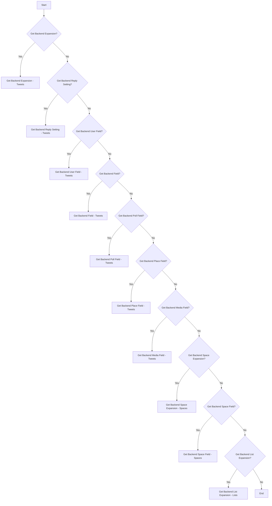
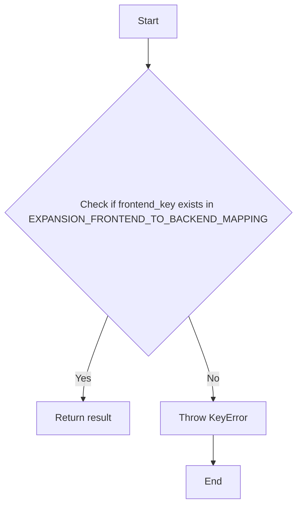
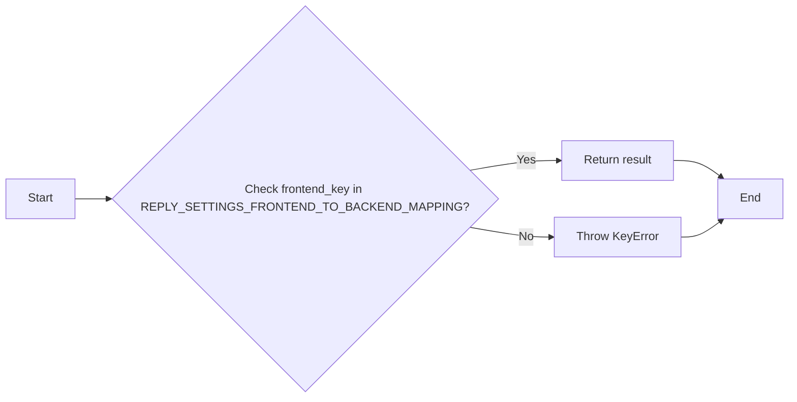
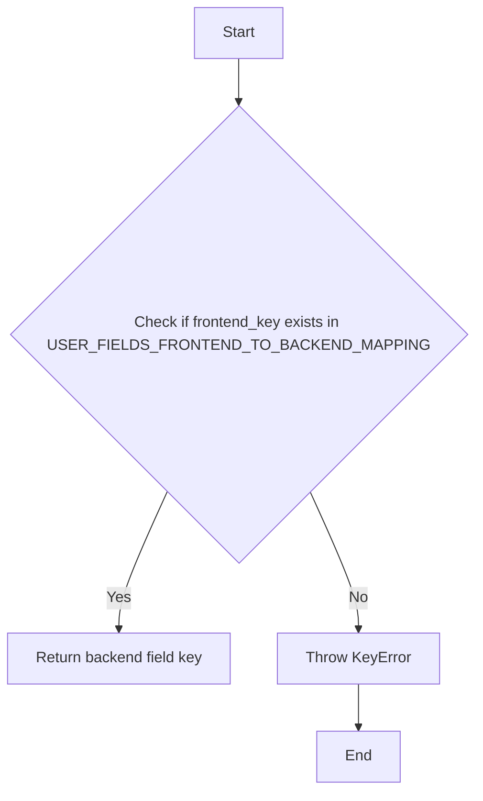
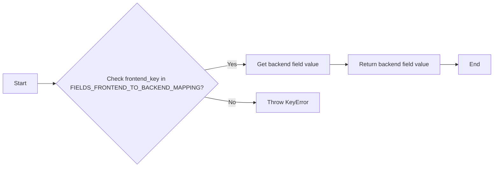
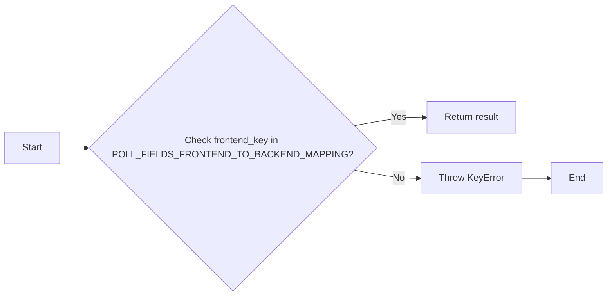
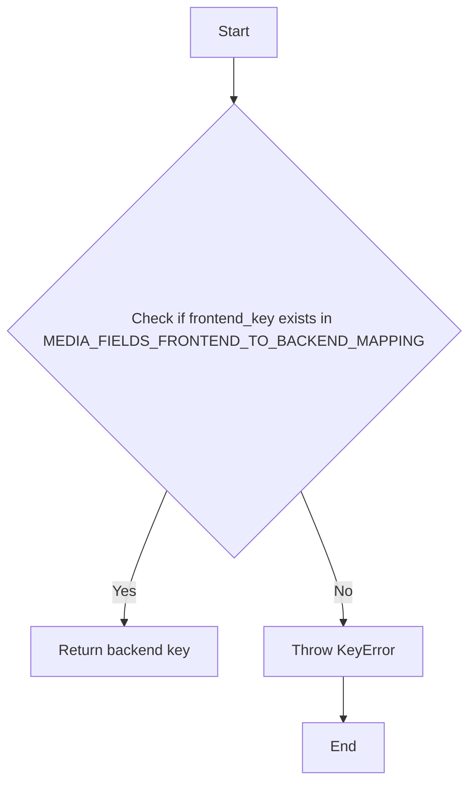
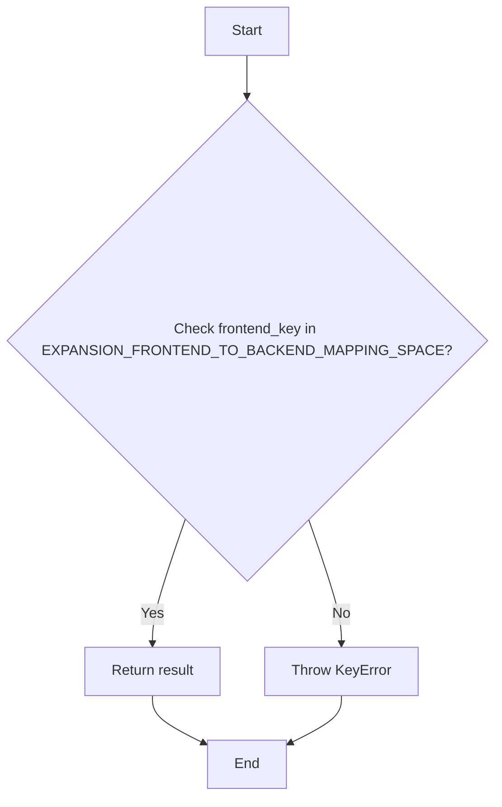
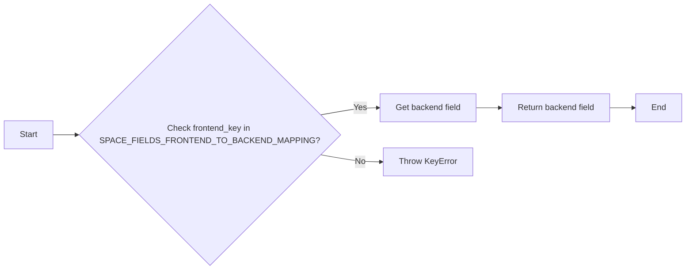
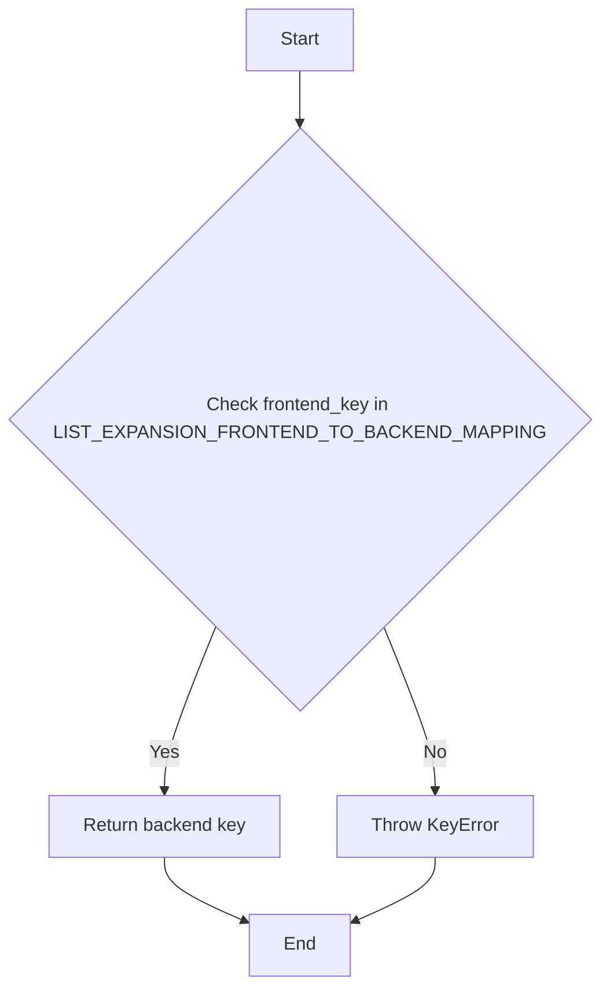

# `.\AutoGPT\autogpt_platform\backend\backend\blocks\twitter\_mappers.py` 详细设计文档

This code provides mappings between frontend keys and backend keys for various Twitter data fields, such as tweets, users, spaces, and lists. It includes utility functions to retrieve backend keys based on frontend keys.

## 整体流程



## 类结构

```
TweetExpansions
├── get_backend_expansion
│   ├── EXPANSION_FRONTEND_TO_BACKEND_MAPPING
│   └── KeyError
├── TweetReplySettings
│   ├── get_backend_reply_setting
│   └── KeyError
│   ├── REPLY_SETTINGS_FRONTEND_TO_BACKEND_MAPPING
├── TweetUserFields
│   ├── get_backend_user_field
│   └── KeyError
│   ├── USER_FIELDS_FRONTEND_TO_BACKEND_MAPPING
├── TweetFields
│   ├── get_backend_field
│   └── KeyError
│   ├── FIELDS_FRONTEND_TO_BACKEND_MAPPING
├── TweetPollFields
│   ├── get_backend_poll_field
│   └── KeyError
│   ├── POLL_FIELDS_FRONTEND_TO_BACKEND_MAPPING
├── PlaceFields
│   ├── get_backend_place_field
│   └── KeyError
│   ├── PLACE_FIELDS_FRONTEND_TO_BACKEND_MAPPING
├── TweetMediaFields
│   ├── get_backend_media_field
│   └── KeyError
│   ├── MEDIA_FIELDS_FRONTEND_TO_BACKEND_MAPPING
├── SpaceExpansions
│   ├── get_backend_space_expansion
│   └── KeyError
│   ├── EXPANSION_FRONTEND_TO_BACKEND_MAPPING_SPACE
├── SpaceFields
│   ├── get_backend_space_field
│   └── KeyError
│   ├── SPACE_FIELDS_FRONTEND_TO_BACKEND_MAPPING
└── ListExpansions
    ├── get_backend_list_expansion
    └── KeyError
    ├── LIST_EXPANSION_FRONTEND_TO_BACKEND_MAPPING
    └── LIST_FIELDS_FRONTEND_TO_BACKEND_MAPPING
```

## 全局变量及字段


### `EXPANSION_FRONTEND_TO_BACKEND_MAPPING`
    
Mapping of frontend expansion keys to backend keys for Tweets.

类型：`dict`
    


### `REPLY_SETTINGS_FRONTEND_TO_BACKEND_MAPPING`
    
Mapping of frontend reply setting keys to backend keys for Tweets.

类型：`dict`
    


### `USER_FIELDS_FRONTEND_TO_BACKEND_MAPPING`
    
Mapping of frontend user field keys to backend keys for Tweets.

类型：`dict`
    


### `FIELDS_FRONTEND_TO_BACKEND_MAPPING`
    
Mapping of frontend field keys to backend keys for Tweets.

类型：`dict`
    


### `POLL_FIELDS_FRONTEND_TO_BACKEND_MAPPING`
    
Mapping of frontend poll field keys to backend keys for Tweets.

类型：`dict`
    


### `PLACE_FIELDS_FRONTEND_TO_BACKEND_MAPPING`
    
Mapping of frontend place field keys to backend keys for Tweets.

类型：`dict`
    


### `MEDIA_FIELDS_FRONTEND_TO_BACKEND_MAPPING`
    
Mapping of frontend media field keys to backend keys for Tweets.

类型：`dict`
    


### `EXPANSION_FRONTEND_TO_BACKEND_MAPPING_SPACE`
    
Mapping of frontend expansion keys to backend keys for Spaces.

类型：`dict`
    


### `SPACE_FIELDS_FRONTEND_TO_BACKEND_MAPPING`
    
Mapping of frontend space field keys to backend keys for Spaces.

类型：`dict`
    


### `LIST_EXPANSION_FRONTEND_TO_BACKEND_MAPPING`
    
Mapping of frontend list expansion keys to backend keys for Lists.

类型：`dict`
    


### `LIST_FIELDS_FRONTEND_TO_BACKEND_MAPPING`
    
Mapping of frontend list field keys to backend keys for Lists.

类型：`dict`
    


    

## 全局函数及方法


### get_backend_expansion

Converts a frontend expansion key to its corresponding backend key.

参数：

- `frontend_key`：`str`，The key used in the frontend to represent an expansion.

返回值：`str`，The corresponding backend key.

#### 流程图



#### 带注释源码

```python
def get_backend_expansion(frontend_key: str) -> str:
    # Retrieve the backend key from the mapping
    result = EXPANSION_FRONTEND_TO_BACKEND_MAPPING.get(frontend_key)
    
    # If the frontend_key is not found, raise a KeyError
    if result is None:
        raise KeyError(f"Invalid expansion key: {frontend_key}")
    
    # Return the backend key
    return result
```


### get_backend_reply_setting

获取前端键对应的后端键。

参数：

- `frontend_key`：`str`，前端键，用于映射到后端键。

返回值：`str`，后端键，映射自前端键。

#### 流程图



#### 带注释源码

```python
def get_backend_reply_setting(frontend_key: str) -> str:
    # 查找前端键对应的后端键
    result = REPLY_SETTINGS_FRONTEND_TO_BACKEND_MAPPING.get(frontend_key)
    
    # 如果前端键不存在，抛出 KeyError
    if result is None:
        raise KeyError(f"Invalid reply setting key: {frontend_key}")
    
    # 返回后端键
    return result
```


### get_backend_user_field

This function maps a frontend user field key to its corresponding backend field key.

参数：

- `frontend_key`：`str`，The key of the frontend user field to be mapped to the backend.

返回值：`str`，The backend field key corresponding to the frontend key.

#### 流程图



#### 带注释源码

```python
def get_backend_user_field(frontend_key: str) -> str:
    # Retrieve the backend field key from the mapping
    result = USER_FIELDS_FRONTEND_TO_BACKEND_MAPPING.get(frontend_key)
    
    # If the frontend_key does not exist in the mapping, raise a KeyError
    if result is None:
        raise KeyError(f"Invalid user field key: {frontend_key}")
    
    # Return the backend field key
    return result
```


### get_backend_field

获取前端字段与后端字段映射的值。

参数：

- `frontend_key`：`str`，前端字段键，用于查找对应的后端字段。

返回值：`str`，后端字段值，对应前端字段键的映射。

#### 流程图



#### 带注释源码

```python
def get_backend_field(frontend_key: str) -> str:
    result = FIELDS_FRONTEND_TO_BACKEND_MAPPING.get(frontend_key)
    if result is None:
        raise KeyError(f"Invalid field key: {frontend_key}")
    return result
```


### get_backend_poll_field

获取前端字段与后端字段映射的函数。

参数：

- `frontend_key`：`str`，前端字段键，用于查找对应的后端字段。

返回值：`str`，后端字段键，对应前端字段键的映射。

#### 流程图



#### 带注释源码

```python
def get_backend_poll_field(frontend_key: str) -> str:
    # 查找前端字段键在映射中的后端字段键
    result = POLL_FIELDS_FRONTEND_TO_BACKEND_MAPPING.get(frontend_key)
    
    # 如果没有找到，抛出KeyError异常
    if result is None:
        raise KeyError(f"Invalid poll field key: {frontend_key}")
    
    # 返回后端字段键
    return result
```


### get_backend_place_field

获取前端字段名称与后端字段名称的映射。

参数：

- `frontend_key`：`str`，前端字段名称

返回值：`str`，后端字段名称

#### 流程图


#### 带注释源码

```python
def get_backend_place_field(frontend_key: str) -> str:
    # 获取前端字段名称与后端字段名称的映射
    result = PLACE_FIELDS_FRONTEND_TO_BACKEND_MAPPING.get(frontend_key)
    if result is None:
        # 如果前端字段名称不在映射中，抛出KeyError
        raise KeyError(f"Invalid place field key: {frontend_key}")
    # 返回后端字段名称
    return result
``` 


### get_backend_media_field

Converts a frontend media field key to its corresponding backend key.

参数：

- `frontend_key`：`str`，The key of the media field in the frontend.

返回值：`str`，The corresponding backend key for the media field.

#### 流程图



#### 带注释源码

```python
def get_backend_media_field(frontend_key: str) -> str:
    # Retrieve the backend key from the mapping
    result = MEDIA_FIELDS_FRONTEND_TO_BACKEND_MAPPING.get(frontend_key)
    
    # If the frontend_key is not found, raise a KeyError
    if result is None:
        raise KeyError(f"Invalid media field key: {frontend_key}")
    
    # Return the backend key
    return result
```


### get_backend_space_expansion

This function maps a frontend key to its corresponding backend key for space expansions.

参数：

- `frontend_key`：`str`，The key representing the frontend expansion to be mapped to the backend.

返回值：`str`，The corresponding backend key for the given frontend key.

#### 流程图



#### 带注释源码

```python
def get_backend_space_expansion(frontend_key: str) -> str:
    # Retrieve the backend key from the mapping
    result = EXPANSION_FRONTEND_TO_BACKEND_MAPPING_SPACE.get(frontend_key)
    
    # If the frontend_key is not found, raise a KeyError
    if result is None:
        raise KeyError(f"Invalid expansion key: {frontend_key}")
    
    # Return the backend key
    return result
``` 


### get_backend_space_field

获取空间字段的后端映射。

参数：

- `frontend_key`：`str`，前端字段键，用于查找对应的后端字段。

返回值：`str`，后端字段映射。

#### 流程图



#### 带注释源码

```python
def get_backend_space_field(frontend_key: str) -> str:
    # 查找前端字段键对应的后端字段映射
    result = SPACE_FIELDS_FRONTEND_TO_BACKEND_MAPPING.get(frontend_key)
    # 如果没有找到，抛出 KeyError
    if result is None:
        raise KeyError(f"Invalid space field key: {frontend_key}")
    # 返回后端字段映射
    return result
``` 


### get_backend_list_expansion

This function maps a frontend key to its corresponding backend key for list expansions.

参数：

- `frontend_key`：`str`，The key representing the frontend field or expansion to be mapped to the backend.

返回值：`str`，The corresponding backend key for the given frontend key.

#### 流程图



#### 带注释源码

```python
def get_backend_list_expansion(frontend_key: str) -> str:
    # Retrieve the backend key from the mapping
    result = LIST_EXPANSION_FRONTEND_TO_BACKEND_MAPPING.get(frontend_key)
    
    # If the frontend_key is not found, raise a KeyError
    if result is None:
        raise KeyError(f"Invalid list expansion key: {frontend_key}")
    
    # Return the backend key
    return result
``` 


## 关键组件


### 张量索引与惰性加载

张量索引与惰性加载是处理大规模数据集时常用的技术，用于提高数据访问效率和减少内存消耗。

### 反量化支持

反量化支持是指系统能够处理和转换不同量化的数据，以适应不同的硬件和软件环境。

### 量化策略

量化策略是指对数据或模型进行量化处理的方法，以减少计算资源消耗和提高运行速度。


## 问题及建议


### 已知问题

-   **代码重复性高**：代码中存在多个映射字典和对应的获取后端字段的方法，这些方法的结构和功能非常相似，只是映射的字典不同。这种重复性可能导致维护成本增加，并且当需要添加新的映射时，需要复制和修改大量代码。
-   **异常处理简单**：代码中使用了简单的`KeyError`来处理无效的键，这可能不足以处理所有可能的错误情况，例如，可能需要更详细的错误信息或者自定义异常。
-   **缺乏注释**：代码中缺少必要的注释，这会使得理解代码的功能和结构变得更加困难，尤其是在代码量较大时。

### 优化建议

-   **使用工厂模式或策略模式**：为了减少代码重复，可以考虑使用工厂模式或策略模式来创建不同的映射和获取方法，这样可以在不修改现有代码的情况下添加新的映射。
-   **改进异常处理**：可以定义自定义异常类来处理不同的错误情况，并提供更详细的错误信息，这样可以帮助调用者更好地理解错误原因。
-   **添加注释**：在代码中添加必要的注释，解释每个类、方法和变量的作用，以及它们之间的关系，这将有助于其他开发者理解代码。
-   **考虑使用配置文件**：如果映射字典的内容可能会变化，可以考虑将它们存储在配置文件中，这样可以在不修改代码的情况下更新映射。
-   **代码重构**：对代码进行重构，提取公共的代码片段，创建更通用的函数或类，以减少代码冗余。


## 其它


### 设计目标与约束

- 设计目标：
  - 提供一个映射前端字段到后端字段的工具，以便于数据转换和集成。
  - 确保前端和后端之间的数据一致性。
  - 提供错误处理机制，以便于在无效字段键时抛出异常。

- 约束：
  - 字段映射必须保持一致，避免数据转换错误。
  - 错误处理机制应简洁明了，易于理解和维护。

### 错误处理与异常设计

- 错误处理：
  - 当请求的映射键不存在时，抛出 `KeyError` 异常。

- 异常设计：
  - `KeyError` 异常包含无效的字段键信息，以便于调试和错误追踪。

### 数据流与状态机

- 数据流：
  - 用户请求前端字段到后端字段的映射。
  - 系统根据请求的字段键查找映射关系。
  - 如果找到映射，返回对应的后端字段。
  - 如果未找到映射，抛出异常。

- 状态机：
  - 无状态设计，每个函数处理一个简单的映射查找或异常抛出。

### 外部依赖与接口契约

- 外部依赖：
  - 无外部依赖，所有功能都封装在代码内部。

- 接口契约：
  - 所有函数都遵循相同的接口契约，即接收一个前端字段键并返回一个后端字段键。
  - 函数 `get_backend_expansion`、`get_backend_reply_setting`、`get_backend_user_field`、`get_backend_field`、`get_backend_poll_field`、`get_backend_place_field`、`get_backend_media_field`、`get_backend_space_expansion` 和 `get_backend_space_field` 都遵循此契约。
  - 函数 `get_backend_list_expansion` 和 `get_backend_list_field` 也遵循此契约。

    