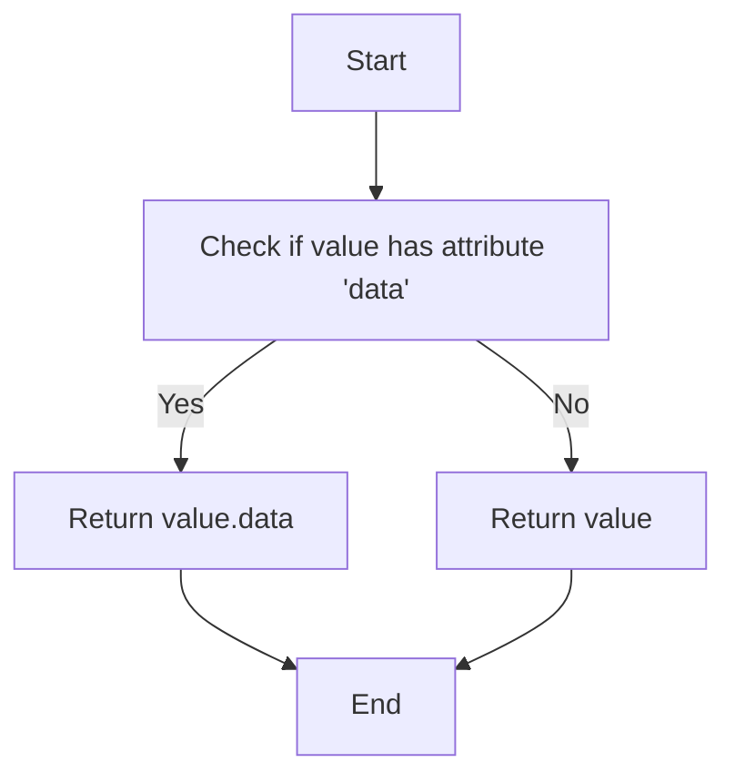
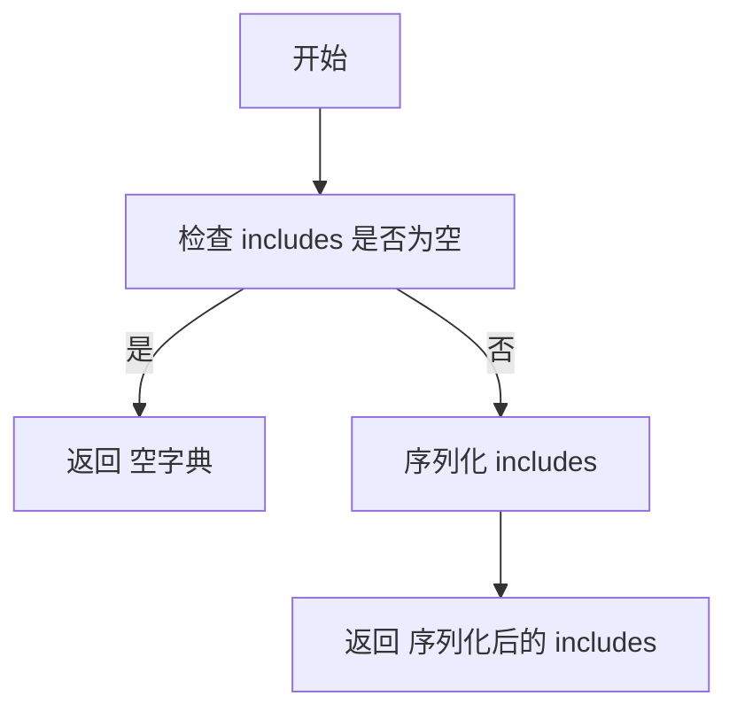
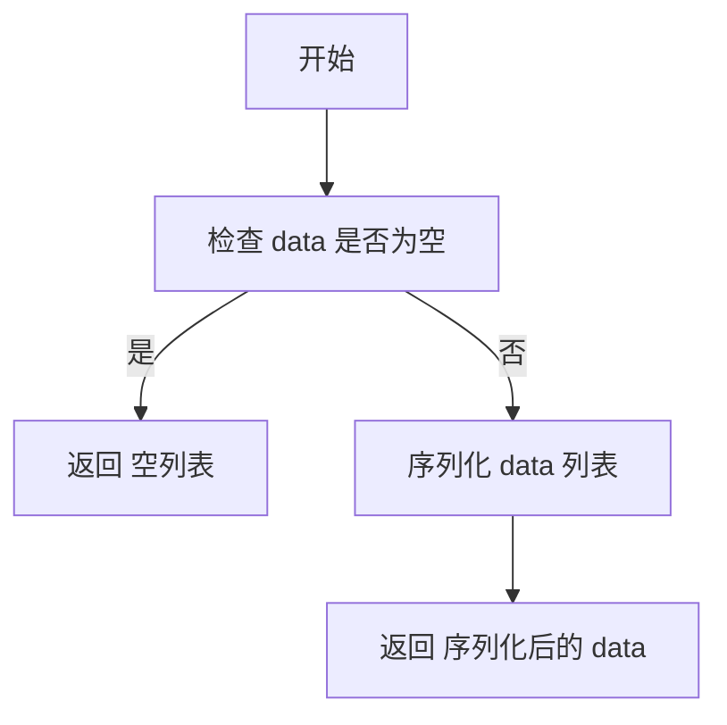

# `.\AutoGPT\autogpt_platform\backend\backend\blocks\twitter\_serializer.py` 详细设计文档

The code provides a serialization framework for converting complex data structures into a standardized dictionary format suitable for API responses.

## 整体流程

```mermaid
graph TD
    A[开始] --> B[检查 response.data 是否存在]
    B -- 是 --> C[检查 response.data 是否为列表]
    C -- 是 --> D[序列化 response.data 列表]
    C -- 否 --> E[序列化 response.data 字典]
    D --> F[更新 result['data']]
    E --> F[更新 result['data']]
    G[检查 response.includes 是否存在]
    G -- 是 --> H[序列化 includes]
    H --> I[更新 result['included']]
    I --> J[返回 result]
    B -- 否 --> J
```

## 类结构

```
BaseSerializer (抽象基类)
├── IncludesSerializer (继承自 BaseSerializer)
│   ├── serialize (类方法)
├── ResponseDataSerializer (继承自 BaseSerializer)
│   ├── serialize_dict (类方法)
│   └── serialize_list (类方法)
└── ResponseSerializer
    └── serialize (类方法)
```

## 全局变量及字段


### `BaseSerializer.BaseSerializer`
    
Base class for serialization with static method for serializing individual values.

类型：`class`
    


### `IncludesSerializer.IncludesSerializer`
    
Class for serializing includes dictionary.

类型：`class`
    


### `ResponseDataSerializer.ResponseDataSerializer`
    
Class for serializing individual dictionary items and lists of dictionary items.

类型：`class`
    


### `ResponseSerializer.ResponseSerializer`
    
Class for serializing the main response object containing data and includes.

类型：`class`
    
    

## 全局函数及方法


### BaseSerializer._serialize_value

Helper method to serialize individual values

参数：

- `value`：`Any`，The value to be serialized. This can be any type of value that needs to be serialized.

返回值：`Any`，The serialized value.

#### 流程图



#### 带注释源码

```python
from typing import Any

class BaseSerializer:
    @staticmethod
    def _serialize_value(value: Any) -> Any:
        """Helper method to serialize individual values"""
        if hasattr(value, "data"):
            return value.data
        return value
```


### IncludesSerializer.serialize

Serializes the includes dictionary

参数：

- `includes`：`Dict[str, Any]`，The dictionary to be serialized. It contains key-value pairs where the key is a string and the value can be of any type.

返回值：`Dict[str, Any]`，The serialized dictionary. It contains the same key-value pairs as the input dictionary, but the values are serialized if they are of type list.

#### 流程图



#### 带注释源码

```
def serialize(self, includes: Dict[str, Any]) -> Dict[str, Any]:
    if not includes:
        return {}

    serialized_includes = {}
    for key, value in includes.items():
        if isinstance(value, list):
            serialized_includes[key] = [self._serialize_value(item) for item in value]
        else:
            serialized_includes[key] = self._serialize_value(value)

    return serialized_includes
```


### ResponseDataSerializer.serialize_dict

Serializes a single dictionary item

参数：

- `item`：`Dict[str, Any]`，The dictionary item to serialize

返回值：`Dict[str, Any]`，The serialized dictionary item

#### 流程图

```mermaid
graph TD
    A[开始] --> B[检查 item 是否有 __dict__ 属性]
    B -- 是 --> C[序列化 item.__dict__.items()]
    B -- 否 --> D[序列化 item.items()]
    C --> E[序列化 items]
    D --> E[序列化 items]
    E --> F[返回 序列化后的 item]
```

#### 带注释源码

```
def serialize_dict(self, item: Dict[str, Any]) -> Dict[str, Any]:
    serialized_item = {}

    if hasattr(item, "__dict__"):
        items = item.__dict__.items()
    else:
        items = item.items()

    for key, value in items:
        if isinstance(value, list):
            serialized_item[key] = [self._serialize_value(sub_item) for sub_item in value]
        else:
            serialized_item[key] = self._serialize_value(value)

    return serialized_item
```


### ResponseDataSerializer.serialize_list

Serializes a list of dictionary items

参数：

- `data`：`List[Dict[str, Any] | None]`，The list of dictionary items to serialize

返回值：`List[Dict[str, Any]]`，The serialized list of dictionary items

#### 流程图



#### 带注释源码

```
def serialize_list(self, data: List[Dict[str, Any]] | None) -> List[Dict[str, Any]]:
    if not data:
        return []
    return [self.serialize_dict(item) for item in data]
```


### ResponseSerializer.serialize

This method is the main serializer that handles both data and includes in a response object.

参数：

- `response`：`Any`，The response object that contains data and includes to be serialized.

返回值：`Dict[str, Any]`，A dictionary containing serialized data and includes.

#### 流程图

```mermaid
graph TD
    A[开始] --> B[检查 response.data 是否存在]
    B -- 是 --> C[检查 response.data 是否为列表]
    C -- 是 --> D[序列化 response.data 列表]
    C -- 否 --> E[序列化 response.data 字典]
    D --> F[更新 result['data']]
    E --> F[更新 result['data']]
    G[检查 response.includes 是否存在]
    G -- 是 --> H[序列化 includes]
    H --> I[更新 result['included']]
    I --> J[返回 result]
    B -- 否 --> J
```

#### 带注释源码

```
def serialize(self, response) -> Dict[str, Any]:
    result = {"data": None, "included": {}}

    # Handle response.data
    if response.data:
        if isinstance(response.data, list):
            result["data"] = ResponseDataSerializer.serialize_list(response.data)
        else:
            result["data"] = ResponseDataSerializer.serialize_dict(response.data)

    # Handle includes
    if hasattr(response, "includes") and response.includes:
        result["included"] = IncludesSerializer.serialize(response.includes)

    return result
```


## 关键组件


### 张量索引与惰性加载

支持对张量进行索引操作，并在需要时才加载数据，以优化内存使用。

### 反量化支持

提供对反量化操作的支持，允许在量化过程中进行逆量化处理。

### 量化策略

实现多种量化策略，以适应不同的量化需求。


## 问题及建议


### 已知问题

-   **重复代码**：`_serialize_value` 方法在 `IncludesSerializer` 和 `ResponseDataSerializer` 中被重复调用，可以考虑将其提升为全局函数以减少代码重复。
-   **类型检查**：代码中缺少对输入数据的类型检查，这可能导致运行时错误。
-   **异常处理**：代码中没有异常处理机制，如果序列化过程中出现错误，可能会导致程序崩溃。
-   **性能问题**：对于大型数据集，递归调用 `serialize_dict` 和 `serialize_list` 可能会导致性能问题。

### 优化建议

-   **提取全局函数**：将 `_serialize_value` 方法提取为全局函数，减少重复代码。
-   **增加类型检查**：在序列化之前增加类型检查，确保输入数据符合预期格式。
-   **添加异常处理**：在序列化过程中添加异常处理，捕获并处理可能出现的错误。
-   **优化性能**：考虑使用迭代而非递归来处理大型数据集，以减少内存消耗和提高性能。


## 其它


### 设计目标与约束

- 设计目标：实现一个灵活且可扩展的序列化器，用于将复杂的数据结构转换为JSON格式。
- 约束：保持序列化过程高效，同时确保序列化结果符合JSON格式规范。

### 错误处理与异常设计

- 错误处理：在序列化过程中，如果遇到无法序列化的数据类型，将抛出异常。
- 异常设计：定义自定义异常类，如`SerializationError`，以提供更具体的错误信息。

### 数据流与状态机

- 数据流：数据从原始对象流向序列化结果，经过多个处理步骤，包括检查数据类型、递归序列化等。
- 状态机：没有明确的状态机，但序列化过程可以视为一系列状态转换，如从原始数据到序列化字典。

### 外部依赖与接口契约

- 外部依赖：依赖于`typing`模块进行类型注解。
- 接口契约：序列化器类提供公共接口，包括`serialize`方法，用于处理不同类型的输入数据。

### 测试用例

- 测试用例：编写单元测试以验证序列化器的正确性和健壮性，包括不同数据类型的序列化。

### 性能考量

- 性能考量：优化序列化过程，减少不必要的内存分配和递归调用，以提高性能。

### 安全考量

- 安全考量：确保序列化过程不会引入安全漏洞，如注入攻击。

### 维护与扩展

- 维护与扩展：设计易于维护和扩展的代码结构，以便在未来添加新的序列化功能或处理新的数据类型。


    