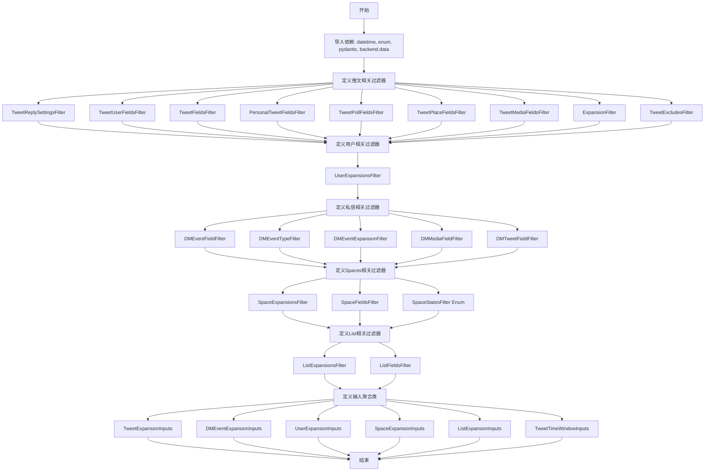

# `AutoGPT\autogpt_platform\backend\backend\blocks\twitter\_types.py` 详细设计文档

该代码定义了一系列基于Pydantic的数据模型，用于构建和验证Twitter API的请求参数。它涵盖了推文、用户、私信、Spaces和列表等多种资源的字段过滤器、扩展过滤器以及输入配置，旨在提供精细化的数据查询控制和参数结构化管理。

## 整体流程



## 类结构

```
BaseModel (Pydantic)
├── Tweet Filters (推文过滤器)
│   ├── TweetReplySettingsFilter
│   ├── TweetUserFieldsFilter
│   ├── TweetFieldsFilter
│   ├── PersonalTweetFieldsFilter
│   ├── TweetPollFieldsFilter
│   ├── TweetPlaceFieldsFilter
│   ├── TweetMediaFieldsFilter
│   ├── ExpansionFilter
│   └── TweetExcludesFilter
├── User Filters (用户过滤器)
│   └── UserExpansionsFilter
├── DM Filters (私信过滤器)
│   ├── DMEventFieldFilter
│   ├── DMEventTypeFilter
│   ├── DMEventExpansionFilter
│   ├── DMMediaFieldFilter
│   └── DMTweetFieldFilter
├── Space Filters (空间过滤器)
│   ├── SpaceExpansionsFilter
│   └── SpaceFieldsFilter
├── List Filters (列表过滤器)
│   ├── ListExpansionsFilter
│   └── ListFieldsFilter
├── Enum (枚举)
│   └── SpaceStatesFilter
└── BlockSchemaInput (输入配置基类)
    ├── TweetExpansionInputs
    ├── DMEventExpansionInputs
    ├── UserExpansionInputs
    ├── SpaceExpansionInputs
    ├── ListExpansionInputs
    └── TweetTimeWindowInputs
```

## 全局变量及字段


### `TweetReplySettingsFilter.Mentioned_Users_Only`
    
Filter setting indicating whether replies are limited to mentioned users only.

类型：`bool`
    


### `TweetReplySettingsFilter.Following_Users_Only`
    
Filter setting indicating whether replies are limited to users the author follows only.

类型：`bool`
    


### `TweetReplySettingsFilter.All_Users`
    
Filter setting indicating whether all users can reply to the tweet.

类型：`bool`
    


### `TweetUserFieldsFilter.Account_Creation_Date`
    
Indicates whether to include the account creation date timestamp in the user object.

类型：`bool`
    


### `TweetUserFieldsFilter.User_Bio`
    
Indicates whether to include the user's bio text in the user object.

类型：`bool`
    


### `TweetUserFieldsFilter.User_Entities`
    
Indicates whether to include entities like URLs and mentions in the user object.

类型：`bool`
    


### `TweetUserFieldsFilter.User_ID`
    
Indicates whether to include the unique user ID in the user object.

类型：`bool`
    


### `TweetUserFieldsFilter.User_Location`
    
Indicates whether to include the user-defined location in the user object.

类型：`bool`
    


### `TweetUserFieldsFilter.Latest_Tweet_ID`
    
Indicates whether to include the ID of the user's most recent tweet in the user object.

类型：`bool`
    


### `TweetUserFieldsFilter.Display_Name`
    
Indicates whether to include the user's display name in the user object.

类型：`bool`
    


### `TweetUserFieldsFilter.Pinned_Tweet_ID`
    
Indicates whether to include the ID of the user's pinned tweet in the user object.

类型：`bool`
    


### `TweetUserFieldsFilter.Profile_Picture_URL`
    
Indicates whether to include the URL of the user's profile picture in the user object.

类型：`bool`
    


### `TweetUserFieldsFilter.Is_Protected_Account`
    
Indicates whether to include the protection status of the user account in the user object.

类型：`bool`
    


### `TweetUserFieldsFilter.Account_Statistics`
    
Indicates whether to include public account metrics like followers count in the user object.

类型：`bool`
    


### `TweetUserFieldsFilter.Profile_URL`
    
Indicates whether to include the URL of the user's profile page in the user object.

类型：`bool`
    


### `TweetUserFieldsFilter.Username`
    
Indicates whether to include the user's handle (screen name) in the user object.

类型：`bool`
    


### `TweetUserFieldsFilter.Is_Verified`
    
Indicates whether to include the verification status of the user in the user object.

类型：`bool`
    


### `TweetUserFieldsFilter.Verification_Type`
    
Indicates whether to include the type of verification (e.g., Business, Government) in the user object.

类型：`bool`
    


### `TweetUserFieldsFilter.Content_Withholding_Info`
    
Indicates whether to include information about withheld content in the user object.

类型：`bool`
    


### `TweetFieldsFilter.Tweet_Attachments`
    
Indicates whether to include media attachments associated with the tweet.

类型：`bool`
    


### `TweetFieldsFilter.Author_ID`
    
Indicates whether to include the User ID of the tweet author.

类型：`bool`
    


### `TweetFieldsFilter.Context_Annotations`
    
Indicates whether to include context annotations describing the tweet content.

类型：`bool`
    


### `TweetFieldsFilter.Conversation_ID`
    
Indicates whether to include the ID of the conversation the tweet belongs to.

类型：`bool`
    


### `TweetFieldsFilter.Creation_Time`
    
Indicates whether to include the UTC timestamp when the tweet was created.

类型：`bool`
    


### `TweetFieldsFilter.Edit_Controls`
    
Indicates whether to include information about editability of the tweet.

类型：`bool`
    


### `TweetFieldsFilter.Tweet_Entities`
    
Indicates whether to include entities such as hashtags, URLs, and user mentions.

类型：`bool`
    


### `TweetFieldsFilter.Geographic_Location`
    
Indicates whether to include location data (Point, Polygon, etc.) for the tweet.

类型：`bool`
    


### `TweetFieldsFilter.Tweet_ID`
    
Indicates whether to include the unique identifier of the tweet.

类型：`bool`
    


### `TweetFieldsFilter.Reply_To_User_ID`
    
Indicates whether to include the User ID of the user being replied to.

类型：`bool`
    


### `TweetFieldsFilter.Language`
    
Indicates whether to include the language code (e.g., 'en') of the tweet text.

类型：`bool`
    


### `TweetFieldsFilter.Public_Metrics`
    
Indicates whether to include public engagement metrics (like retweet count, like count).

类型：`bool`
    


### `TweetFieldsFilter.Sensitive_Content_Flag`
    
Indicates whether to include the flag marking the tweet as potentially sensitive.

类型：`bool`
    


### `TweetFieldsFilter.Referenced_Tweets`
    
Indicates whether to include a list of tweets referenced (quoted, retweeted) by this tweet.

类型：`bool`
    


### `TweetFieldsFilter.Reply_Settings`
    
Indicates whether to include settings indicating who can reply to the tweet.

类型：`bool`
    


### `TweetFieldsFilter.Tweet_Source`
    
Indicates whether to include the name of the app used to post the tweet.

类型：`bool`
    


### `TweetFieldsFilter.Tweet_Text`
    
Indicates whether to include the actual text content of the tweet.

类型：`bool`
    


### `TweetFieldsFilter.Withheld_Content`
    
Indicates whether to include data regarding copyright or location-based content withholding.

类型：`bool`
    


### `PersonalTweetFieldsFilter.attachments`
    
Indicates whether to include media attachments in the personal tweet data.

类型：`bool`
    


### `PersonalTweetFieldsFilter.author_id`
    
Indicates whether to include the author ID in the personal tweet data.

类型：`bool`
    


### `PersonalTweetFieldsFilter.context_annotations`
    
Indicates whether to include context annotations in the personal tweet data.

类型：`bool`
    


### `PersonalTweetFieldsFilter.conversation_id`
    
Indicates whether to include the conversation ID in the personal tweet data.

类型：`bool`
    


### `PersonalTweetFieldsFilter.created_at`
    
Indicates whether to include the creation timestamp in the personal tweet data.

类型：`bool`
    


### `PersonalTweetFieldsFilter.edit_controls`
    
Indicates whether to include edit controls in the personal tweet data.

类型：`bool`
    


### `PersonalTweetFieldsFilter.entities`
    
Indicates whether to include entities (hashtags, urls, mentions) in the personal tweet data.

类型：`bool`
    


### `PersonalTweetFieldsFilter.geo`
    
Indicates whether to include geographic location data in the personal tweet data.

类型：`bool`
    


### `PersonalTweetFieldsFilter.id`
    
Indicates whether to include the tweet ID in the personal tweet data.

类型：`bool`
    


### `PersonalTweetFieldsFilter.in_reply_to_user_id`
    
Indicates whether to include the ID of the user being replied to in the personal tweet data.

类型：`bool`
    


### `PersonalTweetFieldsFilter.lang`
    
Indicates whether to include the language code in the personal tweet data.

类型：`bool`
    


### `PersonalTweetFieldsFilter.non_public_metrics`
    
Indicates whether to include non-public metrics (impressions, etc.) in the personal tweet data.

类型：`bool`
    


### `PersonalTweetFieldsFilter.public_metrics`
    
Indicates whether to include public metrics (likes, retweets) in the personal tweet data.

类型：`bool`
    


### `PersonalTweetFieldsFilter.organic_metrics`
    
Indicates whether to include organic metrics in the personal tweet data.

类型：`bool`
    


### `PersonalTweetFieldsFilter.promoted_metrics`
    
Indicates whether to include promoted metrics in the personal tweet data.

类型：`bool`
    


### `PersonalTweetFieldsFilter.possibly_sensitive`
    
Indicates whether to include the sensitive content flag in the personal tweet data.

类型：`bool`
    


### `PersonalTweetFieldsFilter.referenced_tweets`
    
Indicates whether to include referenced tweets (retweets, quotes) in the personal tweet data.

类型：`bool`
    


### `PersonalTweetFieldsFilter.reply_settings`
    
Indicates whether to include reply settings in the personal tweet data.

类型：`bool`
    


### `PersonalTweetFieldsFilter.source`
    
Indicates whether to include the source app name in the personal tweet data.

类型：`bool`
    


### `PersonalTweetFieldsFilter.text`
    
Indicates whether to include the tweet text in the personal tweet data.

类型：`bool`
    


### `PersonalTweetFieldsFilter.withheld`
    
Indicates whether to include content withholding details in the personal tweet data.

类型：`bool`
    


### `TweetPollFieldsFilter.Duration_Minutes`
    
Indicates whether to include the duration of the poll in minutes.

类型：`bool`
    


### `TweetPollFieldsFilter.End_DateTime`
    
Indicates whether to include the end date and time of the poll.

类型：`bool`
    


### `TweetPollFieldsFilter.Poll_ID`
    
Indicates whether to include the unique identifier of the poll.

类型：`bool`
    


### `TweetPollFieldsFilter.Poll_Options`
    
Indicates whether to include the options available in the poll.

类型：`bool`
    


### `TweetPollFieldsFilter.Voting_Status`
    
Indicates whether to include the voting status of the poll (e.g., open, closed).

类型：`bool`
    


### `TweetPlaceFieldsFilter.Contained_Within_Places`
    
Indicates whether to include places contained within this place.

类型：`bool`
    


### `TweetPlaceFieldsFilter.Country`
    
Indicates whether to include the country name of the place.

类型：`bool`
    


### `TweetPlaceFieldsFilter.Country_Code`
    
Indicates whether to include the ISO country code of the place.

类型：`bool`
    


### `TweetPlaceFieldsFilter.Full_Location_Name`
    
Indicates whether to include the full name of the location.

类型：`bool`
    


### `TweetPlaceFieldsFilter.Geographic_Coordinates`
    
Indicates whether to include the geographic coordinates (lat/long) of the place.

类型：`bool`
    


### `TweetPlaceFieldsFilter.Place_ID`
    
Indicates whether to include the unique ID of the place.

类型：`bool`
    


### `TweetPlaceFieldsFilter.Place_Name`
    
Indicates whether to include the short name of the place.

类型：`bool`
    


### `TweetPlaceFieldsFilter.Place_Type`
    
Indicates whether to include the type of the place (e.g., city, neighborhood).

类型：`bool`
    


### `TweetMediaFieldsFilter.Duration_in_Milliseconds`
    
Indicates whether to include the duration of the media in milliseconds.

类型：`bool`
    


### `TweetMediaFieldsFilter.Height`
    
Indicates whether to include the height of the media in pixels.

类型：`bool`
    


### `TweetMediaFieldsFilter.Media_Key`
    
Indicates whether to include the unique key identifying the media.

类型：`bool`
    


### `TweetMediaFieldsFilter.Preview_Image_URL`
    
Indicates whether to include the URL of a preview image for the media.

类型：`bool`
    


### `TweetMediaFieldsFilter.Media_Type`
    
Indicates whether to include the type of the media (e.g., photo, video).

类型：`bool`
    


### `TweetMediaFieldsFilter.Media_URL`
    
Indicates whether to include the direct URL to the media file.

类型：`bool`
    


### `TweetMediaFieldsFilter.Width`
    
Indicates whether to include the width of the media in pixels.

类型：`bool`
    


### `TweetMediaFieldsFilter.Public_Metrics`
    
Indicates whether to include public metrics (e.g., view count) for the media.

类型：`bool`
    


### `TweetMediaFieldsFilter.Non_Public_Metrics`
    
Indicates whether to include non-public metrics for the media.

类型：`bool`
    


### `TweetMediaFieldsFilter.Organic_Metrics`
    
Indicates whether to include organic metrics for the media.

类型：`bool`
    


### `TweetMediaFieldsFilter.Promoted_Metrics`
    
Indicates whether to include promoted metrics for the media.

类型：`bool`
    


### `TweetMediaFieldsFilter.Alternative_Text`
    
Indicates whether to include the alt text description of the media.

类型：`bool`
    


### `TweetMediaFieldsFilter.Media_Variants`
    
Indicates whether to include available variants (bitrates, formats) of the media.

类型：`bool`
    


### `ExpansionFilter.Poll_IDs`
    
Expansion to include poll objects attached to tweets.

类型：`bool`
    


### `ExpansionFilter.Media_Keys`
    
Expansion to include media objects attached to tweets.

类型：`bool`
    


### `ExpansionFilter.Author_User_ID`
    
Expansion to include user objects for tweet authors.

类型：`bool`
    


### `ExpansionFilter.Edit_History_Tweet_IDs`
    
Expansion to include IDs of tweets in the edit history.

类型：`bool`
    


### `ExpansionFilter.Mentioned_Usernames`
    
Expansion to include user objects for mentioned users.

类型：`bool`
    


### `ExpansionFilter.Place_ID`
    
Expansion to include place objects tagged in tweets.

类型：`bool`
    


### `ExpansionFilter.Reply_To_User_ID`
    
Expansion to include user objects for users being replied to.

类型：`bool`
    


### `ExpansionFilter.Referenced_Tweet_ID`
    
Expansion to include referenced tweet objects.

类型：`bool`
    


### `ExpansionFilter.Referenced_Tweet_Author_ID`
    
Expansion to include user objects for authors of referenced tweets.

类型：`bool`
    


### `TweetExcludesFilter.retweets`
    
Exclude retweets from the response.

类型：`bool`
    


### `TweetExcludesFilter.replies`
    
Exclude replies from the response.

类型：`bool`
    


### `UserExpansionsFilter.pinned_tweet_id`
    
Expansion to include the pinned tweet object.

类型：`bool`
    


### `DMEventFieldFilter.id`
    
Indicates whether to include the unique ID of the Direct Message event.

类型：`bool`
    


### `DMEventFieldFilter.text`
    
Indicates whether to include the text content of the Direct Message.

类型：`bool`
    


### `DMEventFieldFilter.event_type`
    
Indicates whether to include the type of the Direct Message event.

类型：`bool`
    


### `DMEventFieldFilter.created_at`
    
Indicates whether to include the creation timestamp of the Direct Message event.

类型：`bool`
    


### `DMEventFieldFilter.dm_conversation_id`
    
Indicates whether to include the ID of the Direct Message conversation.

类型：`bool`
    


### `DMEventFieldFilter.sender_id`
    
Indicates whether to include the User ID of the message sender.

类型：`bool`
    


### `DMEventFieldFilter.participant_ids`
    
Indicates whether to include the User IDs of participants in the conversation.

类型：`bool`
    


### `DMEventFieldFilter.referenced_tweets`
    
Indicates whether to include referenced tweets in the Direct Message event.

类型：`bool`
    


### `DMEventFieldFilter.attachments`
    
Indicates whether to include attachments (media) in the Direct Message event.

类型：`bool`
    


### `DMEventTypeFilter.MessageCreate`
    
Filter for Direct Message events of type 'MessageCreate'.

类型：`bool`
    


### `DMEventTypeFilter.ParticipantsJoin`
    
Filter for Direct Message events of type 'ParticipantsJoin'.

类型：`bool`
    


### `DMEventTypeFilter.ParticipantsLeave`
    
Filter for Direct Message events of type 'ParticipantsLeave'.

类型：`bool`
    


### `DMEventExpansionFilter.attachments_media_keys`
    
Expansion to include media objects attached to Direct Message events.

类型：`bool`
    


### `DMEventExpansionFilter.referenced_tweets_id`
    
Expansion to include tweet objects referenced in Direct Message events.

类型：`bool`
    


### `DMEventExpansionFilter.sender_id`
    
Expansion to include user objects for the sender of the Direct Message.

类型：`bool`
    


### `DMEventExpansionFilter.participant_ids`
    
Expansion to include user objects for participants in the Direct Message conversation.

类型：`bool`
    


### `DMMediaFieldFilter.duration_ms`
    
Indicates whether to include the duration of the media in milliseconds.

类型：`bool`
    


### `DMMediaFieldFilter.height`
    
Indicates whether to include the height of the media in pixels.

类型：`bool`
    


### `DMMediaFieldFilter.media_key`
    
Indicates whether to include the unique key for the media.

类型：`bool`
    


### `DMMediaFieldFilter.preview_image_url`
    
Indicates whether to include the URL of the media preview image.

类型：`bool`
    


### `DMMediaFieldFilter.type`
    
Indicates whether to include the type of the media.

类型：`bool`
    


### `DMMediaFieldFilter.url`
    
Indicates whether to include the URL of the media file.

类型：`bool`
    


### `DMMediaFieldFilter.width`
    
Indicates whether to include the width of the media in pixels.

类型：`bool`
    


### `DMMediaFieldFilter.public_metrics`
    
Indicates whether to include public metrics for the media.

类型：`bool`
    


### `DMMediaFieldFilter.alt_text`
    
Indicates whether to include the alt text description of the media.

类型：`bool`
    


### `DMMediaFieldFilter.variants`
    
Indicates whether to include variants (e.g., different bitrates) of the media.

类型：`bool`
    


### `DMTweetFieldFilter.attachments`
    
Indicates whether to include attachments in the Direct Message tweet.

类型：`bool`
    


### `DMTweetFieldFilter.author_id`
    
Indicates whether to include the author ID of the Direct Message tweet.

类型：`bool`
    


### `DMTweetFieldFilter.context_annotations`
    
Indicates whether to include context annotations in the Direct Message tweet.

类型：`bool`
    


### `DMTweetFieldFilter.conversation_id`
    
Indicates whether to include the conversation ID of the Direct Message tweet.

类型：`bool`
    


### `DMTweetFieldFilter.created_at`
    
Indicates whether to include the creation timestamp of the Direct Message tweet.

类型：`bool`
    


### `DMTweetFieldFilter.edit_controls`
    
Indicates whether to include edit controls for the Direct Message tweet.

类型：`bool`
    


### `DMTweetFieldFilter.entities`
    
Indicates whether to include entities in the Direct Message tweet.

类型：`bool`
    


### `DMTweetFieldFilter.geo`
    
Indicates whether to include geo information in the Direct Message tweet.

类型：`bool`
    


### `DMTweetFieldFilter.id`
    
Indicates whether to include the ID of the Direct Message tweet.

类型：`bool`
    


### `DMTweetFieldFilter.in_reply_to_user_id`
    
Indicates whether to include the ID of the user being replied to in the Direct Message tweet.

类型：`bool`
    


### `DMTweetFieldFilter.lang`
    
Indicates whether to include the language of the Direct Message tweet.

类型：`bool`
    


### `DMTweetFieldFilter.public_metrics`
    
Indicates whether to include public metrics of the Direct Message tweet.

类型：`bool`
    


### `DMTweetFieldFilter.possibly_sensitive`
    
Indicates whether to include the sensitive content flag of the Direct Message tweet.

类型：`bool`
    


### `DMTweetFieldFilter.referenced_tweets`
    
Indicates whether to include referenced tweets in the Direct Message tweet.

类型：`bool`
    


### `DMTweetFieldFilter.reply_settings`
    
Indicates whether to include reply settings of the Direct Message tweet.

类型：`bool`
    


### `DMTweetFieldFilter.source`
    
Indicates whether to include the source of the Direct Message tweet.

类型：`bool`
    


### `DMTweetFieldFilter.text`
    
Indicates whether to include the text of the Direct Message tweet.

类型：`bool`
    


### `DMTweetFieldFilter.withheld`
    
Indicates whether to include content withholding details of the Direct Message tweet.

类型：`bool`
    


### `SpaceExpansionsFilter.Invited_Users`
    
Expansion to include details about invited users in the Space.

类型：`bool`
    


### `SpaceExpansionsFilter.Speakers`
    
Expansion to include details about speakers in the Space.

类型：`bool`
    


### `SpaceExpansionsFilter.Creator`
    
Expansion to include details about the creator of the Space.

类型：`bool`
    


### `SpaceExpansionsFilter.Hosts`
    
Expansion to include details about hosts of the Space.

类型：`bool`
    


### `SpaceExpansionsFilter.Topics`
    
Expansion to include details about topics discussed in the Space.

类型：`bool`
    


### `SpaceFieldsFilter.Space_ID`
    
Indicates whether to include the unique ID of the Twitter Space.

类型：`bool`
    


### `SpaceFieldsFilter.Space_State`
    
Indicates whether to include the state of the Space (e.g., live, scheduled).

类型：`bool`
    


### `SpaceFieldsFilter.Creation_Time`
    
Indicates whether to include the creation timestamp of the Space.

类型：`bool`
    


### `SpaceFieldsFilter.End_Time`
    
Indicates whether to include the end time of the Space.

类型：`bool`
    


### `SpaceFieldsFilter.Host_User_IDs`
    
Indicates whether to include the User IDs of the Space hosts.

类型：`bool`
    


### `SpaceFieldsFilter.Language`
    
Indicates whether to include the language of the Space.

类型：`bool`
    


### `SpaceFieldsFilter.Is_Ticketed`
    
Indicates whether to include a flag if the Space is ticketed.

类型：`bool`
    


### `SpaceFieldsFilter.Invited_User_IDs`
    
Indicates whether to include the User IDs of invited users.

类型：`bool`
    


### `SpaceFieldsFilter.Participant_Count`
    
Indicates whether to include the count of participants in the Space.

类型：`bool`
    


### `SpaceFieldsFilter.Subscriber_Count`
    
Indicates whether to include the count of subscribers to the Space.

类型：`bool`
    


### `SpaceFieldsFilter.Scheduled_Start_Time`
    
Indicates whether to include the scheduled start time of the Space.

类型：`bool`
    


### `SpaceFieldsFilter.Speaker_User_IDs`
    
Indicates whether to include the User IDs of the speakers in the Space.

类型：`bool`
    


### `SpaceFieldsFilter.Start_Time`
    
Indicates whether to include the actual start time of the Space.

类型：`bool`
    


### `SpaceFieldsFilter.Space_Title`
    
Indicates whether to include the title of the Space.

类型：`bool`
    


### `SpaceFieldsFilter.Topic_IDs`
    
Indicates whether to include the IDs of topics associated with the Space.

类型：`bool`
    


### `SpaceFieldsFilter.Last_Updated_Time`
    
Indicates whether to include the last time the Space was updated.

类型：`bool`
    


### `ListExpansionsFilter.List_Owner_ID`
    
Expansion to include details about the owner of the Twitter List.

类型：`bool`
    


### `ListFieldsFilter.List_ID`
    
Indicates whether to include the unique ID of the Twitter List.

类型：`bool`
    


### `ListFieldsFilter.List_Name`
    
Indicates whether to include the name of the Twitter List.

类型：`bool`
    


### `ListFieldsFilter.Creation_Date`
    
Indicates whether to include the creation date of the Twitter List.

类型：`bool`
    


### `ListFieldsFilter.Description`
    
Indicates whether to include the description of the Twitter List.

类型：`bool`
    


### `ListFieldsFilter.Follower_Count`
    
Indicates whether to include the number of followers of the Twitter List.

类型：`bool`
    


### `ListFieldsFilter.Member_Count`
    
Indicates whether to include the number of members in the Twitter List.

类型：`bool`
    


### `ListFieldsFilter.Is_Private`
    
Indicates whether to include the privacy status of the Twitter List.

类型：`bool`
    


### `ListFieldsFilter.Owner_ID`
    
Indicates whether to include the User ID of the Twitter List owner.

类型：`bool`
    


### `TweetExpansionInputs.expansions`
    
Choose what extra information you want to get with your tweets. For example: - Select 'Media_Keys' to get media details - Select 'Author_User_ID' to get user information - Select 'Place_ID' to get location details

类型：`ExpansionFilter | None`
    


### `TweetExpansionInputs.media_fields`
    
Select what media information you want to see (images, videos, etc). To use this, you must first select 'Media_Keys' in the expansions above.

类型：`TweetMediaFieldsFilter | None`
    


### `TweetExpansionInputs.place_fields`
    
Select what location information you want to see (country, coordinates, etc). To use this, you must first select 'Place_ID' in the expansions above.

类型：`TweetPlaceFieldsFilter | None`
    


### `TweetExpansionInputs.poll_fields`
    
Select what poll information you want to see (options, voting status, etc). To use this, you must first select 'Poll_IDs' in the expansions above.

类型：`TweetPollFieldsFilter | None`
    


### `TweetExpansionInputs.tweet_fields`
    
Select what tweet information you want to see. For referenced tweets (like retweets), select 'Referenced_Tweet_ID' in the expansions above.

类型：`TweetFieldsFilter | None`
    


### `TweetExpansionInputs.user_fields`
    
Select what user information you want to see. To use this, you must first select one of these in expansions above: - 'Author_User_ID' for tweet authors - 'Mentioned_Usernames' for mentioned users - 'Reply_To_User_ID' for users being replied to - 'Referenced_Tweet_Author_ID' for authors of referenced tweets

类型：`TweetUserFieldsFilter | None`
    


### `DMEventExpansionInputs.expansions`
    
Select expansions to include related data objects in the 'includes' section.

类型：`DMEventExpansionFilter | None`
    


### `DMEventExpansionInputs.event_types`
    
Select DM event types to include in the response.

类型：`DMEventTypeFilter | None`
    


### `DMEventExpansionInputs.media_fields`
    
Select media fields to include in the response (requires expansions=attachments.media_keys).

类型：`DMMediaFieldFilter | None`
    


### `DMEventExpansionInputs.tweet_fields`
    
Select tweet fields to include in the response (requires expansions=referenced_tweets.id).

类型：`DMTweetFieldFilter | None`
    


### `DMEventExpansionInputs.user_fields`
    
Select user fields to include in the response (requires expansions=sender_id or participant_ids).

类型：`TweetUserFieldsFilter | None`
    


### `UserExpansionInputs.expansions`
    
Choose what extra information you want to get with user data. Currently only 'pinned_tweet_id' is available to see a user's pinned tweet.

类型：`UserExpansionsFilter | None`
    


### `UserExpansionInputs.tweet_fields`
    
Select what tweet information you want to see in pinned tweets. This only works if you select 'pinned_tweet_id' in expansions above.

类型：`TweetFieldsFilter | None`
    


### `UserExpansionInputs.user_fields`
    
Select what user information you want to see, like username, bio, profile picture, etc.

类型：`TweetUserFieldsFilter | None`
    


### `SpaceExpansionInputs.expansions`
    
Choose additional information you want to get with your Twitter Spaces: - Select 'Invited_Users' to see who was invited - Select 'Speakers' to see who can speak - Select 'Creator' to get details about who made the Space - Select 'Hosts' to see who's hosting - Select 'Topics' to see Space topics

类型：`SpaceExpansionsFilter | None`
    


### `SpaceExpansionInputs.space_fields`
    
Choose what Space details you want to see, such as: - Title - Start/End times - Number of participants - Language - State (live/scheduled) - And more

类型：`SpaceFieldsFilter | None`
    


### `SpaceExpansionInputs.user_fields`
    
Choose what user information you want to see. This works when you select any of these in expansions above: - 'Creator' for Space creator details - 'Hosts' for host information - 'Speakers' for speaker details - 'Invited_Users' for invited user information

类型：`TweetUserFieldsFilter | None`
    


### `ListExpansionInputs.expansions`
    
Choose what extra information you want to get with your Twitter Lists: - Select 'List_Owner_ID' to get details about who owns the list. This will let you see more details about the list owner when you also select user fields below.

类型：`ListExpansionsFilter | None`
    


### `ListExpansionInputs.user_fields`
    
Choose what information you want to see about list owners. This only works when you select 'List_Owner_ID' in expansions above. You can see things like: - Their username - Profile picture - Account details - And more

类型：`TweetUserFieldsFilter | None`
    


### `ListExpansionInputs.list_fields`
    
Choose what information you want to see about the Twitter Lists themselves, such as: - List name - Description - Number of followers - Number of members - Whether it's private - Creation date - And more

类型：`ListFieldsFilter | None`
    


### `TweetTimeWindowInputs.start_time`
    
Start time in YYYY-MM-DDTHH:mm:ssZ format. If set to a time less than 10 seconds ago, it will be automatically adjusted to 10 seconds ago (Twitter API requirement).

类型：`datetime | None`
    


### `TweetTimeWindowInputs.end_time`
    
End time in YYYY-MM-DDTHH:mm:ssZ format

类型：`datetime | None`
    


### `TweetTimeWindowInputs.since_id`
    
Returns results with Tweet ID greater than this (more recent than), we give priority to since_id over start_time

类型：`str | None`
    


### `TweetTimeWindowInputs.until_id`
    
Returns results with Tweet ID less than this (that is, older than), and used with since_id

类型：`str | None`
    


### `TweetTimeWindowInputs.sort_order`
    
Order of returned tweets (recency or relevancy)

类型：`str | None`
    
    

## 全局函数及方法


## 关键组件


### Tweet Field Models
数据模型集合，定义了推文、媒体、地理位置、投票及用户相关字段的过滤规则，用于精细化控制 API 返回的推文数据结构。

### Direct Message & User Models
数据模型集合，包含私信事件、媒体、事件类型及用户扩展的过滤器，用于规范用户和私信数据的查询参数。

### Spaces & List Models
数据模型集合，定义了 Twitter Space（音频空间）和 Twitter List（列表）的状态、属性及扩展信息的字段过滤器。

### Aggregated Input Schemas
复合输入模型，基于 BlockSchemaInput 将上述字段过滤器组合为特定的输入块，为 Tweets、DMs、Users、Spaces 和 Lists 提供统一的参数入口。

### Time Window Constraints
时间窗口约束模型，定义了用于限定推文查询时间范围、ID 边界及排序方式的参数集合。


## 问题及建议


### 已知问题

-   **命名风格不统一**：代码中混用了 PascalCase（如 `TweetFieldsFilter` 中的 `Tweet_Attachments`）和 snake_case（如 `PersonalTweetFieldsFilter` 中的 `attachments`）。这种不一致性增加了代码的认知负担，且容易在引用时产生错误。
-   **数据模型高度冗余**：`TweetFieldsFilter`、`PersonalTweetFieldsFilter` 和 `DMTweetFieldFilter` 等多个类中存在大量含义相同的字段（如 `id`, `text`, `created_at` 等），仅命名方式不同。这种重复导致维护成本极高，一旦 API 字段变更，需在多处同步修改。
-   **类型约束缺失**：`TweetTimeWindowInputs` 类中的 `sort_order` 字段被定义为 `str`，但没有限制具体的取值范围（如 `relevancy` 或 `recency`），这可能导致运行时因传入无效值而引发 API 错误。
-   **字段语义混淆**：`TweetUserFieldsFilter` 被广泛用于 DM、Space 和 Tweet 等不同模块的输入中，但其内部字段命名（`User_ID` vs `Username` 等）与特定的上下文可能不完全匹配，且缺乏针对性的子类区分。

### 优化建议

-   **统一命名规范与使用 Pydantic 别名**：建议在代码内部统一使用 Python 风格的 `snake_case` 定义字段，利用 Pydantic 的 `Field(alias="...")` 功能将其映射到外部 API 所需的具体格式（如 Twitter API 的 `camelCase` 或特定格式）。这样可以保持代码风格的一致性，同时兼容外部接口。
-   **抽象公共基类以消除重复**：提取通用的字段定义作为基类或 Mixin（例如 `BaseTweetFields`），针对不同 API 端点（如 Tweet vs Personal Tweet）的特殊需求，通过继承或配置别名进行扩展。遵循 DRY（Don't Repeat Yourself）原则，减少样板代码。
-   **引入枚举类型增强参数校验**：将 `sort_order`、`SpaceStatesFilter` 等有限集合的参数定义为 `Enum` 类型。利用 Pydantic 的自动校验机制，在数据传入阶段就拦截非法值，提高系统的健壮性。
-   **优化默认值配置策略**：部分 Input 类（如 `SpaceExpansionInputs` 和 `ListExpansionInputs`）在类定义中硬编码了非空的默认值（例如 `SpaceFieldsFilter(Space_Title=True)`）。建议将默认值设为 `None` 或更为精简的配置，避免在用户未明确指定时自动请求大量非必要数据，从而节省 API 配额并提高响应速度。
-   **增强文档与字段的关联性**：目前的 `SchemaField` 描述较为冗长且硬编码。建议考虑建立字段与元数据的映射关系，动态生成部分描述文档，或者将常量文案提取为统一管理的常量文件，便于国际化或统一修改。


## 其它


### 设计目标与约束

**设计目标：**
该代码旨在定义一套高度模块化、类型安全且可复用的数据模型，用于构建 Twitter API 请求参数。通过细粒度的布尔标志控制，允许调用者精确筛选 Tweets、Users、Direct Messages、Spaces 和 Lists 的返回字段及扩展信息。同时，结合 `SchemaField` 提供友好的 UI 描述，支持低代码/无代码平台的可视化配置。

**设计约束：**
1. **类型系统约束：** 所有模型必须继承自 Pydantic 的 `BaseModel` 或 `BlockSchemaInput`，以确保数据在运行时和静态类型检查时的有效性。
2. **API 契约约束：** 字段命名和结构需隐式遵循 Twitter API v2 的规范。尽管模型内部使用帕斯卡命名法（如 `Tweet_Attachments`）或蛇形命名法（如 `created_at`），但在序列化为 API 请求时通常需映射为 Twitter API 要求的特定格式（通常为蛇形命名法，如 `tweet.attachments`）。
3. **默认行为约束：** 大部分过滤字段的默认值为 `False`，表示默认不返回该字段，遵循“默认最小化数据集”的原则；输入模型（Input Classes）中的高级选项默认值为 `None`，表示用户未配置。
4. **依赖约束：** 必须依赖项目内部定义的 `BlockSchemaInput` 和 `SchemaField`，以确保能被平台的执行引擎正确识别和渲染。

### 错误处理与异常设计

**错误处理策略：**
本模块作为数据定义层，不包含显式的业务逻辑错误处理代码（如 `try-except` 块）。错误处理主要依赖于 Pydantic 库的内置验证机制。

**异常类型：**
1. **ValidationError (pydantic.ValidationError)：** 当传入的数据类型与模型定义不匹配时抛出。例如，如果尝试将字符串 `"True"` 赋值给类型为 `bool` 的字段，Pydantic 将尝试转换或报错；若传入未定义的额外字段且未配置 `Extra.ignore`，也会抛出此异常。
2. **类型错误：** 在开发阶段，静态类型检查器（如 mypy）可能会捕获类型不匹配的错误。

**校验逻辑：**
Pydantic 会在模型实例化时自动执行以下校验：
- 基础类型校验（布尔值、字符串、日期时间等）。
- 必填字段校验（尽管本代码中大部分字段为可选）。

### 数据流与状态机

**数据流：**
1. **配置阶段：** 用户在 UI 界面根据 `SchemaField` 的描述勾选选项（如勾选 "Public Metrics"）。
2. **序列化阶段：** 前端将用户的选择序列化为 JSON 对象。
3. **验证与反序列化阶段：** 后端接收 JSON，通过 Pydantic 模型进行实例化。此时系统会校验数据类型，生成对应的 Python 对象（如 `TweetExpansionInputs` 实例）。
4. **执行阶段：** 这些模型实例被传递给实际的 Twitter API 客户端。客户端读取模型中的 `True` 字段，将其拼接为 Twitter API 接受的查询参数（例如将 `TweetFieldsFilter.public_metrics=True` 转换为 URL 参数 `tweet.fields=public_metrics`）。

**状态机：**
本模块中的类是**无状态**的。它们作为数据传输对象存在，不维护任何可变状态或生命周期转换。因此，不存在内部状态机逻辑。系统的状态完全由这些对象的当前属性值决定，且对象一旦创建，其属性即被视为不可变或仅通过替换对象来改变。

### 外部依赖与接口契约

**外部依赖库：**
1. **pydantic：** 核心依赖，用于提供 `BaseModel` 基类、数据解析、校验和序列化功能。
2. **datetime & enum：** Python 标准库，分别用于处理时间类型（`TweetTimeWindowInputs`）和枚举类型（`SpaceStatesFilter`）。

**内部依赖接口：**
1. **`backend.data.block.BlockSchemaInput`：** 所有输入配置类的基类。该类可能包含平台特定的元数据处理逻辑，要求子类必须遵循特定的初始化协议。
2. **`backend.data.model.SchemaField`：** 用于在 Pydantic 模型字段中嵌入 UI 元数据（如 `description`, `placeholder`, `advanced` 标志）。这是代码与前端渲染层之间的关键契约。

**隐式外部接口契约 (Twitter API v2)：**
虽然代码中没有显式调用 Twitter API，但模型结构严格受限于 Twitter API v2 的契约：
- **字段映射契约：** 模型字段名（如 `author_id`, `media_keys`）必须与 Twitter API 文档中定义的参数名精确对应，否则 API 请求将无效或被忽略。
- **依赖关系契约：** 某些字段的生效依赖于其他字段的选择，这在 `description` 中有明确说明（例如：`media_fields` 的生效依赖于 `expansions` 中选择了 `Media_Keys`）。这种逻辑虽然未在代码中强制校验，但在业务逻辑层必须遵守此契约。


    