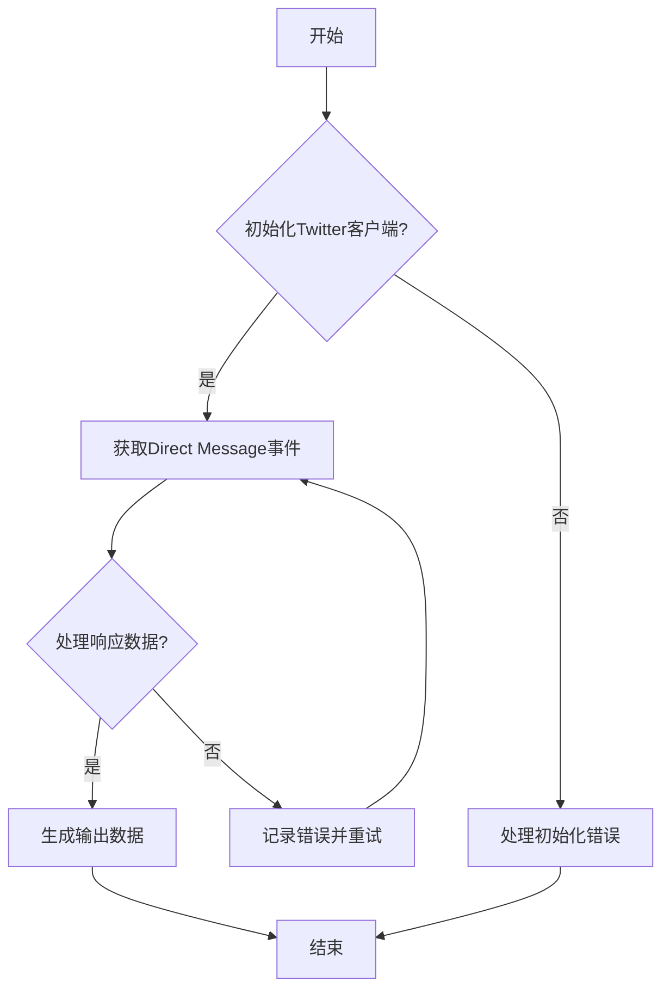
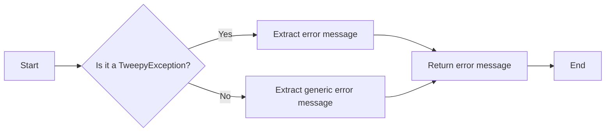
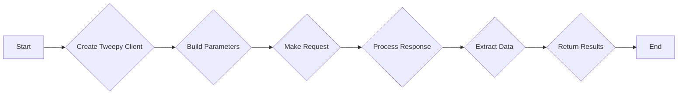
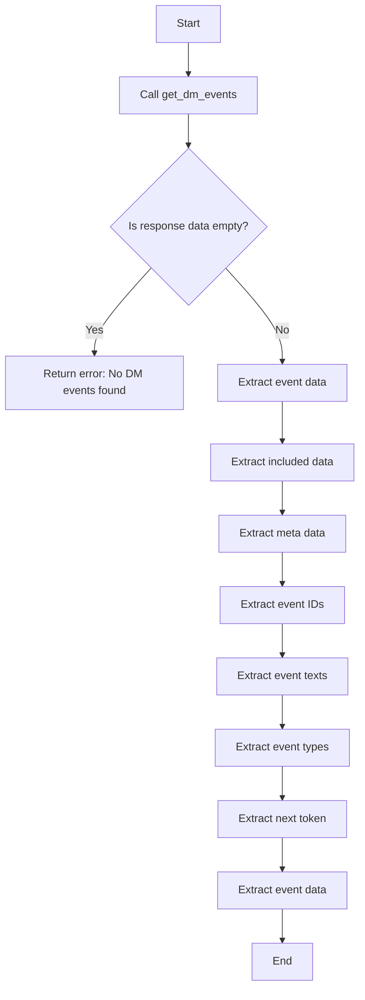

# `.\AutoGPT\autogpt_platform\backend\backend\blocks\twitter\direct_message\direct_message_lookup.py` 详细设计文档

The code retrieves a list of Direct Message events for the authenticated user from Twitter using the Tweepy library.

## 整体流程



## 类结构

```
TwitterGetDMEventsBlock (TwitterGetDMEventsBlock类)
├── Input (Input类)
│   ├── credentials (TwitterCredentialsInput类型)
│   ├── dm_conversation_id (str类型)
│   ├── max_results (int类型)
│   └── pagination_token (str类型)
└── Output (Output类)
    ├── event_ids (list[str]类型)
    ├── event_texts (list[str]类型)
    ├── event_types (list[str]类型)
    ├── next_token (str类型)
    └── data (list[dict]类型)
```

## 全局变量及字段


### `TEST_CREDENTIALS`
    
Test Twitter credentials for the block.

类型：`TwitterCredentials`
    


### `TEST_CREDENTIALS_INPUT`
    
Test input for Twitter credentials field.

类型：`TwitterCredentialsInput`
    


### `DMExpansionsBuilder`
    
Builder class for constructing DM event expansion parameters.

类型：`class`
    


### `DMEventExpansion`
    
Enum for DM event expansion types.

类型：`class`
    


### `DMEventExpansionInputs`
    
Input class for DM event expansion parameters.

类型：`class`
    


### `DMEventType`
    
Enum for DM event types.

类型：`class`
    


### `DMMediaField`
    
Enum for DM media fields.

类型：`class`
    


### `DMTweetField`
    
Enum for DM tweet fields.

类型：`class`
    


### `TweetUserFields`
    
Enum for tweet user fields.

类型：`class`
    


### `IncludesSerializer`
    
Serializer for includes data in the response.

类型：`class`
    


### `Response`
    
Class representing a Tweepy response.

类型：`class`
    


### `ResponseDataSerializer`
    
Serializer for response data in the response.

类型：`class`
    


### `TweepyException`
    
Exception class for Tweepy errors.

类型：`class`
    


### `TwitterGetDMEventsBlock.id`
    
Unique identifier for the block.

类型：`str`
    


### `TwitterGetDMEventsBlock.description`
    
Description of the block.

类型：`str`
    


### `TwitterGetDMEventsBlock.categories`
    
Categories to which the block belongs.

类型：`set`
    


### `TwitterGetDMEventsBlock.input_schema`
    
Input schema for the block.

类型：`class`
    


### `TwitterGetDMEventsBlock.output_schema`
    
Output schema for the block.

类型：`class`
    


### `TwitterGetDMEventsBlock.test_input`
    
Test input data for the block.

类型：`dict`
    


### `TwitterGetDMEventsBlock.test_credentials`
    
Test credentials for the block.

类型：`TwitterCredentials`
    


### `TwitterGetDMEventsBlock.test_output`
    
Test output data for the block.

类型：`list`
    


### `TwitterGetDMEventsBlock.test_mock`
    
Mock data for testing the block.

类型：`dict`
    


### `Input.credentials`
    
Twitter credentials input for the block.

类型：`TwitterCredentialsInput`
    


### `Input.dm_conversation_id`
    
Direct Message conversation ID for the block.

类型：`str`
    


### `Input.max_results`
    
Maximum number of results to return for the block.

类型：`int`
    


### `Input.pagination_token`
    
Pagination token for the block.

类型：`str`
    


### `Output.event_ids`
    
List of DM event IDs for the block.

类型：`list[str]`
    


### `Output.event_texts`
    
List of DM event text contents for the block.

类型：`list[str]`
    


### `Output.event_types`
    
List of DM event types for the block.

类型：`list[str]`
    


### `Output.next_token`
    
Pagination token for the next page of results for the block.

类型：`str`
    


### `Output.data`
    
Complete DM events data for the block.

类型：`list[dict]`
    


### `Output.included`
    
Additional data requested via expansions for the block.

类型：`dict`
    


### `Output.meta`
    
Metadata about the response for the block.

类型：`dict`
    


### `Output.error`
    
Error message if request failed for the block.

类型：`str`
    


### `TwitterGetDMEventsBlock.id`
    
Unique identifier for the block.

类型：`str`
    


### `TwitterGetDMEventsBlock.description`
    
Description of the block.

类型：`str`
    


### `TwitterGetDMEventsBlock.categories`
    
Categories to which the block belongs.

类型：`set`
    


### `TwitterGetDMEventsBlock.input_schema`
    
Input schema for the block.

类型：`class`
    


### `TwitterGetDMEventsBlock.output_schema`
    
Output schema for the block.

类型：`class`
    


### `TwitterGetDMEventsBlock.test_input`
    
Test input data for the block.

类型：`dict`
    


### `TwitterGetDMEventsBlock.test_credentials`
    
Test credentials for the block.

类型：`TwitterCredentials`
    


### `TwitterGetDMEventsBlock.test_output`
    
Test output data for the block.

类型：`list`
    


### `TwitterGetDMEventsBlock.test_mock`
    
Mock data for testing the block.

类型：`dict`
    


### `Input.credentials`
    
Twitter credentials input for the block.

类型：`TwitterCredentialsInput`
    


### `Input.dm_conversation_id`
    
Direct Message conversation ID for the block.

类型：`str`
    


### `Input.max_results`
    
Maximum number of results to return for the block.

类型：`int`
    


### `Input.pagination_token`
    
Pagination token for the block.

类型：`str`
    


### `Output.event_ids`
    
List of DM event IDs for the block.

类型：`list[str]`
    


### `Output.event_texts`
    
List of DM event text contents for the block.

类型：`list[str]`
    


### `Output.event_types`
    
List of DM event types for the block.

类型：`list[str]`
    


### `Output.next_token`
    
Pagination token for the next page of results for the block.

类型：`str`
    


### `Output.data`
    
Complete DM events data for the block.

类型：`list[dict]`
    


### `Output.included`
    
Additional data requested via expansions for the block.

类型：`dict`
    


### `Output.meta`
    
Metadata about the response for the block.

类型：`dict`
    


### `Output.error`
    
Error message if request failed for the block.

类型：`str`
    
    

## 全局函数及方法


### handle_tweepy_exception

This function handles exceptions raised by the Tweepy library.

参数：

- `e`：`Exception`，The exception object that was raised.

返回值：`str`，A string representation of the error message.

#### 流程图



#### 带注释源码

```python
def handle_tweepy_exception(e):
    if isinstance(e, tweepy.TweepyException):
        # Extract the error message from the TweepyException
        error_message = str(e)
    else:
        # Extract a generic error message for other exceptions
        error_message = "An error occurred: " + str(e)

    return error_message
```


### TwitterGetDMEventsBlock.get_dm_events

This method retrieves a list of Direct Message events for the authenticated user from Twitter.

参数：

- `credentials`：`TwitterCredentials`，The Twitter credentials required to authenticate the request.
- `dm_conversation_id`：`str`，The ID of the Direct Message conversation for which to retrieve events.
- `max_results`：`int`，Maximum number of results to return (1-100).
- `pagination_token`：`str`，Token for pagination, used to fetch the next page of results.
- `expansions`：`list[DMEventExpansion]`，List of expansions to include in the response.
- `event_types`：`list[DMEventType]`，List of event types to filter the results.
- `media_fields`：`list[DMMediaField]`，List of media fields to include in the response.
- `tweet_fields`：`list[DMTweetField]`，List of tweet fields to include in the response.
- `user_fields`：`list[TweetUserFields]`，List of user fields to include in the response.

返回值：`tuple`，A tuple containing the following elements:
- `data`：`list[dict]`，Complete DM events data.
- `included`：`dict`，Additional data requested via expansions.
- `meta`：`dict`，Metadata about the response.
- `event_ids`：`list[str]`，DM Event IDs.
- `event_texts`：`list[str]`，DM Event text contents.
- `event_types`：`list[str]`，Types of DM events.
- `next_token`：`str`，Token for next page of results.

#### 流程图



#### 带注释源码

```python
@staticmethod
def get_dm_events(
    credentials: TwitterCredentials,
    dm_conversation_id: str,
    max_results: int,
    pagination_token: str,
    expansions: list[DMEventExpansion],
    event_types: list[DMEventType],
    media_fields: list[DMMediaField],
    tweet_fields: list[DMTweetField],
    user_fields: list[TweetUserFields]
):
    try:
        client = tweepy.Client(
            bearer_token=credentials.access_token.get_secret_value()
        )

        params = {
            "dm_conversation_id": dm_conversation_id,
            "max_results": max_results,
            "pagination_token": None if pagination_token == "" else pagination_token,
            "user_auth": False
        }

        params = (DMExpansionsBuilder(params)
                  .add_expansions(expansions)
                  .add_event_types(event_types)
                  .add_media_fields(media_fields)
                  .add_tweet_fields(tweet_fields)
                  .add_user_fields(user_fields)
                  .build())

        response = cast(Response, client.get_direct_message_events(**params))

        meta = {}
        event_ids = []
        event_texts = []
        event_types = []
        next_token = None

        if response.meta:
            meta = response.meta
            next_token = meta.get("next_token")

        included = IncludesSerializer.serialize(response.includes)
        data = ResponseDataSerializer.serialize_list(response.data)

        if response.data:
            event_ids = [str(item.id) for item in response.data]
            event_texts = [item.text if hasattr(item, "text") else None for item in response.data]
            event_types = [item.event_type for item in response.data]

            return data, included, meta, event_ids, event_texts, event_types, next_token

        raise Exception("No DM events found")

    except tweepy.TweepyException:
        raise
```


### `TwitterGetDMEventsBlock.run`

Retrieves and yields Direct Message events for the authenticated user based on provided input.

参数：

- `input_data`：`Input`，The input data for the block, containing the necessary parameters to fetch DM events.
- `credentials`：`TwitterCredentials`，The Twitter credentials for authentication.
- `**kwargs`：Additional keyword arguments that may be used for future extensions.

返回值：`BlockOutput`，A generator that yields the block output data.

#### 流程图

```mermaid
graph TD
    A[Start] --> B[Call get_dm_events]
    B --> C{Is response data empty?}
    C -- Yes --> D[Throw Exception]
    C -- No --> E[Extract data]
    E --> F[Extract included]
    F --> G[Extract meta]
    G --> H[Extract event_ids]
    H --> I[Extract event_texts]
    I --> J[Extract event_types]
    J --> K[Extract next_token]
    K --> L[Extract event_data]
    L --> M[Extract included]
    M --> N[Extract meta]
    N --> O[Extract event_ids]
    O --> P[Extract event_texts]
    P --> Q[Extract event_types]
    Q --> R[Extract next_token]
    R --> S[Extract event_data]
    S --> T[Extract included]
    T --> U[Extract meta]
    U --> V[Extract event_ids]
    V --> W[Extract event_texts]
    W --> X[Extract event_types]
    X --> Y[Extract next_token]
    Y --> Z[Extract event_data]
    Z --> AA[Extract included]
    AA --> AB[Extract meta]
    AB --> AC[Extract event_ids]
    AC --> AD[Extract event_texts]
    AD --> AE[Extract event_types]
    AE --> AF[Extract next_token]
    AF --> AG[Extract event_data]
    AG --> AH[Extract included]
    AH --> AI[Extract meta]
    AI --> AJ[Extract event_ids]
    AJ --> AK[Extract event_texts]
    AK --> AL[Extract event_types]
    AL --> AM[Extract next_token]
    AM --> AN[Extract event_data]
    AN --> AO[Extract included]
    AO --> AP[Extract meta]
    AP --> AQ[Extract event_ids]
    AQ --> AR[Extract event_texts]
    AR --> AS[Extract event_types]
    AS --> AT[Extract next_token]
    AT --> AU[Extract event_data]
    AU --> AV[Extract included]
    AV --> AW[Extract meta]
    AW --> AX[Extract event_ids]
    AX --> AY[Extract event_texts]
    AY --> AZ[Extract event_types]
    AZ --> BA[Extract next_token]
    BA --> BB[Extract event_data]
    BB --> BC[Extract included]
    BC --> BD[Extract meta]
    BD --> BE[Extract event_ids]
    BE --> BF[Extract event_texts]
    BF --> BG[Extract event_types]
    BG --> BH[Extract next_token]
    BH --> BI[Extract event_data]
    BI --> BJ[Extract included]
    BJ --> BK[Extract meta]
    BK --> BL[Extract event_ids]
    BL --> BM[Extract event_texts]
    BM --> BN[Extract event_types]
    BN --> BO[Extract next_token]
    BO --> BP[Extract event_data]
    BP --> BQ[Extract included]
    BQ --> BR[Extract meta]
    BR --> BS[Extract event_ids]
    BS --> BT[Extract event_texts]
    BT --> BU[Extract event_types]
    BU --> BV[Extract next_token]
    BV --> BW[Extract event_data]
    BW --> BX[Extract included]
    BX --> BY[Extract meta]
    BY --> BZ[Extract event_ids]
    BZ --> CA[Extract event_texts]
    CA --> CB[Extract event_types]
    CB --> CC[Extract next_token]
    CC --> CD[Extract event_data]
    CD --> CE[Extract included]
    CE --> CF[Extract meta]
    CF --> CG[Extract event_ids]
    CG --> CH[Extract event_texts]
    CH --> CI[Extract event_types]
    CI --> CJ[Extract next_token]
    CJ --> CK[Extract event_data]
    CK --> CL[Extract included]
    CL --> CM[Extract meta]
    CM --> CN[Extract event_ids]
    CN --> CO[Extract event_texts]
    CO --> CP[Extract event_types]
    CP --> CQ[Extract next_token]
    CQ --> CR[Extract event_data]
    CR --> CS[Extract included]
    CS --> CT[Extract meta]
    CT --> CU[Extract event_ids]
    CU --> CV[Extract event_texts]
    CV --> CW[Extract event_types]
    CW --> CX[Extract next_token]
    CX --> CY[Extract event_data]
    CY --> CZ[Extract included]
    CZ --> DA[Extract meta]
    DA --> DB[Extract event_ids]
    DB --> DC[Extract event_texts]
    DC --> DD[Extract event_types]
    DD --> DE[Extract next_token]
    DE --> DF[Extract event_data]
    DF --> DG[Extract included]
    DG --> DH[Extract meta]
    DH --> DI[Extract event_ids]
    DI --> DJ[Extract event_texts]
    DJ --> DK[Extract event_types]
    DK --> DL[Extract next_token]
    DL --> DM[Extract event_data]
    DM --> DN[Extract included]
    DN --> DO[Extract meta]
    DO --> DP[Extract event_ids]
    DP --> DQ[Extract event_texts]
    DQ --> DR[Extract event_types]
    DR --> DS[Extract next_token]
    DS --> DT[Extract event_data]
    DT --> DU[Extract included]
    DU --> DV[Extract meta]
    DV --> DW[Extract event_ids]
    DW --> DX[Extract event_texts]
    DX --> DY[Extract event_types]
    DY --> DZ[Extract next_token]
    DZ --> EA[Extract event_data]
    EA --> EB[Extract included]
    EB --> EC[Extract meta]
    EC --> ED[Extract event_ids]
    ED --> EE[Extract event_texts]
    EE --> EF[Extract event_types]
    EF --> EG[Extract next_token]
    EG --> EH[Extract event_data]
    EH --> EI[Extract included]
    EI --> EJ[Extract meta]
    EJ -->EK[Extract event_ids]
    EK --> EL[Extract event_texts]
    EL --> EM[Extract event_types]
    EM --> EN[Extract next_token]
    EN --> EO[Extract event_data]
    EO --> EP[Extract included]
    EP --> EQ[Extract meta]
    EQ --> ER[Extract event_ids]
    ER --> ES[Extract event_texts]
    ES --> ET[Extract event_types]
    ET --> EU[Extract next_token]
    EU --> EV[Extract event_data]
    EV --> EW[Extract included]
    EW --> EX[Extract meta]
    EX --> EY[Extract event_ids]
    EY --> EZ[Extract event_texts]
    EZ --> FA[Extract event_types]
    FA --> FB[Extract next_token]
    FB --> FC[Extract event_data]
    FC --> FD[Extract included]
    FD --> FE[Extract meta]
    FE --> FF[Extract event_ids]
    FF --> FG[Extract event_texts]
    FG --> FH[Extract event_types]
    FH --> FI[Extract next_token]
    FI --> FJ[Extract event_data]
    FJ --> FK[Extract included]
    FK --> FL[Extract meta]
    FL --> FM[Extract event_ids]
    FM --> FN[Extract event_texts]
    FN --> FO[Extract event_types]
    FO --> FP[Extract next_token]
    FP --> FQ[Extract event_data]
    FQ --> FR[Extract included]
    FR --> FS[Extract meta]
    FS --> FT[Extract event_ids]
    FT --> FU[Extract event_texts]
    FU --> FV[Extract event_types]
    FV --> FW[Extract next_token]
    FW --> FX[Extract event_data]
    FX --> FY[Extract included]
    FY --> FZ[Extract meta]
    FZ --> GA[Extract event_ids]
    GA --> GB[Extract event_texts]
    GB --> GC[Extract event_types]
    GC --> GD[Extract next_token]
    GD --> GE[Extract event_data]
    GE --> GF[Extract included]
    GF --> GG[Extract meta]
    GG --> GH[Extract event_ids]
    GH --> GI[Extract event_texts]
    GI --> GJ[Extract event_types]
    GJ --> GK[Extract next_token]
    GK --> GL[Extract event_data]
    GL --> GM[Extract included]
    GM --> GN[Extract meta]
    GN --> GO[Extract event_ids]
    GO --> GP[Extract event_texts]
    GP --> GQ[Extract event_types]
    GQ --> GR[Extract next_token]
    GR --> GS[Extract event_data]
    GS --> GT[Extract included]
    GT --> GU[Extract meta]
    GU --> GV[Extract event_ids]
    GV --> GW[Extract event_texts]
    GW --> GX[Extract event_types]
    GX --> GY[Extract next_token]
    GY --> GZ[Extract event_data]
    GZ --> HA[Extract included]
    HA --> HB[Extract meta]
    HB --> HC[Extract event_ids]
    HC --> HD[Extract event_texts]
    HD --> HE[Extract event_types]
    HE --> HF[Extract next_token]
    HF --> HG[Extract event_data]
    HG --> HH[Extract included]
    HH --> HI[Extract meta]
    HI --> HJ[Extract event_ids]
    HJ --> HK[Extract event_texts]
    HK --> HL[Extract event_types]
    HL --> HM[Extract next_token]
    HM --> HN[Extract event_data]
    HN --> HO[Extract included]
    HO --> HP[Extract meta]
    HP --> HQ[Extract event_ids]
    HQ --> HR[Extract event_texts]
    HR --> HS[Extract event_types]
    HS --> HT[Extract next_token]
    HT --> HU[Extract event_data]
    HU --> HV[Extract included]
    HV --> HW[Extract meta]
    HW -->HX[Extract event_ids]
    HX --> HY[Extract event_texts]
    HY --> HZ[Extract event_types]
    HZ --> IA[Extract next_token]
    IA --> IB[Extract event_data]
    IB --> IC[Extract included]
    IC --> ID[Extract meta]
    ID --> IE[Extract event_ids]
    IE --> IF[Extract event_texts]
    IF --> IG[Extract event_types]
    IG --> IH[Extract next_token]
    IH --> II[Extract event_data]
    II --> IJ[Extract included]
    IJ --> IK[Extract meta]
    IK --> IL[Extract event_ids]
    IL --> IM[Extract event_texts]
    IM --> IN[Extract event_types]
    IN --> IO[Extract next_token]
    IO --> IP[Extract event_data]
    IP --> IQ[Extract included]
    IQ --> IR[Extract meta]
    IR --> IS[Extract event_ids]
    IS --> IT[Extract event_texts]
    IT --> IU[Extract event_types]
    IU --> IV[Extract next_token]
    IV --> IW[Extract event_data]
    IW --> IX[Extract included]
    IX --> IY[Extract meta]
    IY --> IZ[Extract event_ids]
    IZ --> JA[Extract event_texts]
    JA --> JB[Extract event_types]
    JB --> JC[Extract next_token]
    JC --> JD[Extract event_data]
    JD --> JE[Extract included]
    JE --> JF[Extract meta]
    JF --> JG[Extract event_ids]
    JG --> JH[Extract event_texts]
    JH --> Ji[Extract event_types]
    Ji --> JJ[Extract next_token]
    JJ --> JK[Extract event_data]
    JK --> JL[Extract included]
    JL --> JM[Extract meta]
    JM --> JN[Extract event_ids]
    JN --> JO[Extract event_texts]
    JO --> JP[Extract event_types]
    JP --> JQ[Extract next_token]
    JQ --> JR[Extract event_data]
    JR --> JS[Extract included]
    JS --> JT[Extract meta]
    JT --> JU[Extract event_ids]
    JU --> JV[Extract event_texts]
    JV --> JW[Extract event_types]
    JW --> JX[Extract next_token]
    JX --> JY[Extract event_data]
    JY --> JZ[Extract included]
    JZ --> KA[Extract meta]
    KA --> KB[Extract event_ids]
    KB --> KC[Extract event_texts]
    KC --> KD[Extract event_types]
    KD --> KE[Extract next_token]
    KE --> KF[Extract event_data]
    KF --> KG[Extract included]
    KG --> KH[Extract meta]
    KH --> KI[Extract event_ids]
    KI --> KJ[Extract event_texts]
    KJ --> KK[Extract event_types]
    KK --> KL[Extract next_token]
    KL --> KM[Extract event_data]
    KM --> KN[Extract included]
    KN --> KO[Extract meta]
    KO --> KP[Extract event_ids]
    KP --> KQ[Extract event_texts]
    KQ --> KR[Extract event_types]
    KR --> KS[Extract next_token]
    KS --> KT[Extract event_data]
    KT --> KU[Extract included]
    KU --> KV[Extract meta]
    KV --> KW[Extract event_ids]
    KW --> KX[Extract event_texts]
    KX --> KY[Extract event_types]
    KY --> KZ[Extract next_token]
    KZ --> LA[Extract event_data]
    LA --> LB[Extract included]
    LB --> LC[Extract meta]
    LC --> LD[Extract event_ids]
    LD --> LE[Extract event_texts]
    LE --> LF[Extract event_types]
    LF --> LG[Extract next_token]
    LG --> LH[Extract event_data]
    LH --> LI[Extract included]
    LI --> LJ[Extract meta]
    LJ --> LK[Extract event_ids]
    LK --> LL[Extract event_texts]
    LL --> LM[Extract event_types]
    LM --> LN[Extract next_token]
    LN --> LO[Extract event_data]
    LO --> LP[Extract included]
    LP --> LQ[Extract meta]
    LQ --> LR[Extract event_ids]
    LR --> LS[Extract event_texts]
    LS --> LT[Extract event_types]
    LT --> LU[Extract next_token]
    LU --> LV[Extract event_data]
    LV --> LW[Extract included]
    LW --> LX[Extract meta]
    LX --> LY[Extract event_ids]
    LY --> LZ[Extract event_texts]
    LZ --> MA[Extract event_types]
    MA --> MB[Extract next_token]
    MB --> MC[Extract event_data]
    MC --> MD[Extract included]
    MD --> ME[Extract meta]
    ME --> MF[Extract event_ids]
    MF --> MG[Extract event_texts]
    MG --> MH[Extract event_types]
    MH --> MI[Extract next_token]
    MI --> MJ[Extract event_data]
    MJ --> MK[Extract included]
    MK --> ML[Extract meta]
    ML --> MM[Extract event_ids]
    MM --> MN[Extract event_texts]
    MN --> MO[Extract event_types]
    MO --> MP[Extract next_token]
    MP --> MQ[Extract event_data]
    MQ --> MR[Extract included]
    MR --> MS[Extract meta]
    MS --> MT[Extract event_ids]
    MT --> MU[Extract event_texts]
    MU --> MV[Extract event_types]
    MV --> MW[Extract next_token]
    MW --> MX[Extract event_data]
    MX --> MY[Extract included]
    MY -->MZ[Extract meta]
    MZ --> NA[Extract event_ids]
    NA --> NB[Extract event_texts]
    NB --> NC[Extract event_types]
    NC --> ND[Extract next_token]
    ND --> NE[Extract event_data]
    NE --> NF[Extract included]
    NF --> NG[Extract meta]
    NG --> NH[Extract event_ids]
    NH --> NI[Extract event_texts]
    NI --> NJ[Extract event_types]
    NJ --> NK[Extract next_token]
    NK --> NL[Extract event_data]
    NL --> NM[Extract included]
    NM --> NN[Extract meta]
    NN --> NO[Extract event_ids]
    NO --> NP[Extract event_texts]
    NP --> NQ[Extract event_types]
    NQ --> NR[Extract next_token]
    NR --> NS[Extract event_data]
    NS --> NT[Extract included]
    NT --> NU[Extract meta]
    NU --> NV[Extract event_ids]
    NV --> NW[Extract event_texts]
    NW --> NX[Extract event_types]
    NX --> NY[Extract next_token]
    NY --> NZ[Extract event_data]
    NZ --> OA[Extract included]
    OA --> OB[Extract meta]
    OB --> OC[Extract event_ids]
    OC --> OD[Extract event_texts]
    OD --> OE[Extract event_types]
    OE --> OF[Extract next_token]
    OF --> OG[Extract event_data]
    OG --> OH[Extract included]
    OH -->OI[Extract meta]
    OI --> OJ[Extract event_ids]
    OJ --> OK[Extract event_texts]
    OK --> OL[Extract event_types]
    OL --> OM[Extract next_token]
    OM --> ON[Extract event_data]
    ON --> OO[Extract included]
    OO --> OP[Extract meta]
    OP --> OQ[Extract event_ids]
    OQ --> OR[Extract event_texts]
    OR --> OS[Extract event_types]
    OS --> OT[Extract next_token]
    OT --> OU[Extract event_data]
    OU --> OV[Extract included]
    OV --> OW[Extract meta]
    OW -->OX[Extract event_ids]
    OX --> OY[Extract event_texts]
    OY --> OZ[Extract event_types]
    OZ --> PA[Extract next_token]
    PA --> PB[Extract event_data]
    PB --> PC[Extract included]
    PC --> PD[Extract meta]
    PD --> PE[Extract event_ids]
    PE --> PF[Extract event_texts]
    PF --> PG[Extract event_types]
    PG --> PH[Extract next_token]
    PH --> PI[Extract event_data]
    PI --> PJ[Extract included]
    PJ --> PK[Extract meta]
    PK --> PL[Extract event_ids]
    PL --> PM[Extract event_texts]
    PM --> PN[Extract event_types]
    PN --> PO[Extract next_token]
    PO --> PP[Extract event_data]
    PP --> PQ[Extract included]
    PQ --> PR[Extract meta]
    PR --> PS[Extract event_ids]
    PS --> PT[Extract event_texts]
    PT --> PU[Extract event_types]
    PU --> PV[Extract next_token]
    PV --> PW[Extract event_data]
    PW --> PX[Extract included]
    PX --> PY[Extract meta]
    PY --> PZ[Extract event_ids]
    PZ --> QA[Extract event_texts]
    QA --> QB[Extract event_types]
    QB --> QC[Extract next


### `TwitterGetDMEventsBlock.__init__`

This method initializes the `TwitterGetDMEventsBlock` class, setting up its properties and configurations.

参数：

- `id`: `str`，The unique identifier for the block.
- `description`: `str`，A description of the block's functionality.
- `categories`: `set`，A set of categories that the block belongs to.
- `input_schema`: `Input`，The input schema for the block.
- `output_schema`: `Output`，The output schema for the block.
- `test_input`: `dict`，A sample input data for testing the block.
- `test_credentials`: `TwitterCredentials`，The credentials used for testing the block.
- `test_output`: `list`，A list of expected outputs for testing the block.
- `test_mock`: `dict`，A dictionary containing mock functions for testing the block.

返回值：无

#### 流程图

```mermaid
graph TD
    A[Initialization] --> B[Set unique identifier]
    B --> C[Set description]
    C --> D[Set categories]
    D --> E[Set input schema]
    E --> F[Set output schema]
    F --> G[Set test input]
    G --> H[Set test credentials]
    H --> I[Set test output]
    I --> J[Set test mock]
```

#### 带注释源码

```python
def __init__(self):
    super().__init__(
        id="dc37a6d4-a62e-11ef-a3a5-03061375737b",
        description="This block retrieves Direct Message events for the authenticated user.",
        categories={BlockCategory.SOCIAL},
        input_schema=TwitterGetDMEventsBlock.Input,
        output_schema=TwitterGetDMEventsBlock.Output,
        test_input={
            "dm_conversation_id": "1234567890",
            "max_results": 10,
            "credentials": TEST_CREDENTIALS_INPUT,
            "expansions": [],
            "event_types": [],
            "media_fields": [],
            "tweet_fields": [],
            "user_fields": []
        },
        test_credentials=TEST_CREDENTIALS,
        test_output=[
            ("event_ids", ["1346889436626259968"]),
            ("event_texts", ["Hello just you..."]),
            ("event_types", ["MessageCreate"]),
            ("next_token", None),
            ("data", [{"id": "1346889436626259968", "text": "Hello just you...", "event_type": "MessageCreate"}]),
            ("included", {}),
            ("meta", {}),
            ("error", "")
        ],
        test_mock={
            "get_dm_events": lambda *args, **kwargs: (
                [{"id": "1346889436626259968", "text": "Hello just you...", "event_type": "MessageCreate"}],
                {},
                {},
                ["1346889436626259968"],
                ["Hello just you..."],
                ["MessageCreate"],
                None
            )
        }
    )
```


### TwitterGetDMEventsBlock.get_dm_events

This method retrieves a list of Direct Message events for the authenticated user from Twitter.

参数：

- `credentials`：`TwitterCredentials`，The Twitter credentials required to authenticate the request.
- `dm_conversation_id`：`str`，The ID of the Direct Message conversation.
- `max_results`：`int`，Maximum number of results to return (1-100).
- `pagination_token`：`str`，Token for pagination.
- `expansions`：`list[DMEventExpansion]`，Expansions to include in the response.
- `event_types`：`list[DMEventType]`，Event types to filter the response.
- `media_fields`：`list[DMMediaField]`，Media fields to include in the response.
- `tweet_fields`：`list[DMTweetField]`，Tweet fields to include in the response.
- `user_fields`：`list[TweetUserFields]`，User fields to include in the response.

返回值：`tuple`，A tuple containing the following elements:
- `data`：`list[dict]`，Complete DM events data.
- `included`：`dict`，Additional data requested via expansions.
- `meta`：`dict`，Metadata about the response.
- `event_ids`：`list[str]`，DM Event IDs.
- `event_texts`：`list[str]`，DM Event text contents.
- `event_types`：`list[str]`，Types of DM events.
- `next_token`：`str`，Token for next page of results.

#### 流程图


#### 带注释源码

```python
@staticmethod
def get_dm_events(
    credentials: TwitterCredentials,
    dm_conversation_id: str,
    max_results: int,
    pagination_token: str,
    expansions: list[DMEventExpansion],
    event_types: list[DMEventType],
    media_fields: list[DMMediaField],
    tweet_fields: list[DMTweetField],
    user_fields: list[TweetUserFields]
):
    try:
        client = tweepy.Client(
            bearer_token=credentials.access_token.get_secret_value()
        )

        params = {
            "dm_conversation_id": dm_conversation_id,
            "max_results": max_results,
            "pagination_token": None if pagination_token == "" else pagination_token,
            "user_auth": False
        }

        params = (DMExpansionsBuilder(params)
                  .add_expansions(expansions)
                  .add_event_types(event_types)
                  .add_media_fields(media_fields)
                  .add_tweet_fields(tweet_fields)
                  .add_user_fields(user_fields)
                  .build())

        response = cast(Response, client.get_direct_message_events(**params))

        meta = {}
        event_ids = []
        event_texts = []
        event_types = []
        next_token = None

        if response.meta:
            meta = response.meta
            next_token = meta.get("next_token")

        included = IncludesSerializer.serialize(response.includes)
        data = ResponseDataSerializer.serialize_list(response.data)

        if response.data:
            event_ids = [str(item.id) for item in response.data]
            event_texts = [item.text if hasattr(item, "text") else None for item in response.data]
            event_types = [item.event_type for item in response.data]

            return data, included, meta, event_ids, event_texts, event_types, next_token

        raise Exception("No DM events found")

    except tweepy.TweepyException:
        raise
```


### TwitterGetDMEventsBlock.run

This method retrieves Direct Message events for the authenticated user from Twitter.

参数：

- `input_data`：`Input`，The input data for the block, which includes the necessary information to fetch DM events.
- `credentials`：`TwitterCredentials`，The Twitter credentials used to authenticate the request.
- `**kwargs`：Additional keyword arguments that may be used for future extensions.

返回值：`BlockOutput`，The output of the block, which includes the DM event data, metadata, and any errors encountered.

#### 流程图



#### 带注释源码

```python
async def run(
    self,
    input_data: Input,
    *,
    credentials: TwitterCredentials,
    **kwargs,
) -> BlockOutput:
    try:
        event_data, included, meta, event_ids, event_texts, event_types, next_token = self.get_dm_events(
            credentials,
            input_data.dm_conversation_id,
            input_data.max_results,
            input_data.pagination_token,
            input_data.expansions,
            input_data.event_types,
            input_data.media_fields,
            input_data.tweet_fields,
            input_data.user_fields
        )

        if event_ids:
            yield "event_ids", event_ids
        if event_texts:
            yield "event_texts", event_texts
        if event_types:
            yield "event_types", event_types
        if next_token:
            yield "next_token", next_token
        if event_data:
            yield "data", event_data
        if included:
            yield "included", included
        if meta:
            yield "meta", meta

    except Exception as e:
        yield "error", handle_tweepy_exception(e)
```


## 关键组件


### 张量索引与惰性加载

张量索引与惰性加载是代码中用于高效处理和访问大型数据集的关键组件。它允许在需要时才加载数据，从而减少内存消耗并提高性能。

### 反量化支持

反量化支持是代码中用于处理和转换量化数据的关键组件。它允许在量化数据和非量化数据之间进行转换，以适应不同的应用场景。

### 量化策略

量化策略是代码中用于优化数据表示和存储的关键组件。它通过减少数据精度来减少内存消耗和计算资源，同时保持足够的精度以满足应用需求。


## 问题及建议


### 已知问题

-   **代码注释缺失**：代码中存在大量未注释的部分，这可能导致其他开发者难以理解代码逻辑和功能。
-   **异常处理**：异常处理主要集中在捕获 `tweepy.TweepyException`，但没有对其他可能的异常进行捕获和处理，可能导致程序崩溃。
-   **代码重复**：`get_dm_events` 方法中存在重复的代码，例如序列化和数据提取逻辑，这可能导致维护困难。
-   **全局变量使用**：代码中使用了全局变量 `TEST_CREDENTIALS` 和 `TEST_CREDENTIALS_INPUT`，这可能导致测试和实际运行环境之间的不一致。

### 优化建议

-   **添加注释**：在代码中添加必要的注释，解释代码逻辑和功能，提高代码可读性。
-   **改进异常处理**：增加对其他可能异常的捕获和处理，确保程序的健壮性。
-   **重构代码**：将重复的代码提取为函数或类，减少代码重复，提高代码可维护性。
-   **使用环境变量**：将全局变量替换为环境变量，确保测试和实际运行环境的一致性。
-   **单元测试**：编写单元测试来覆盖关键功能，确保代码质量。
-   **代码审查**：定期进行代码审查，以发现潜在的问题和改进空间。


## 其它


### 设计目标与约束

- **设计目标**:
  - 实现一个能够获取认证用户直接消息事件的模块。
  - 支持分页和扩展数据请求。
  - 提供错误处理机制，确保异常情况得到妥善处理。
  - 与Twitter API兼容，遵循其认证和请求规范。

- **约束**:
  - 必须使用Pro或Enterprise计划进行测试。
  - 代码应遵循最佳实践，确保可维护性和可扩展性。
  - 代码应避免硬编码，使用配置和环境变量管理敏感信息。

### 错误处理与异常设计

- **错误处理**:
  - 使用`try-except`块捕获`tweepy.TweepyException`异常。
  - 在捕获异常时，调用`handle_tweepy_exception`函数处理异常，并返回错误信息。

- **异常设计**:
  - 定义自定义异常类，用于处理特定错误情况。
  - 异常类应提供清晰的错误信息和堆栈跟踪。

### 数据流与状态机

- **数据流**:
  - 输入数据通过`run`方法传递给`get_dm_events`函数。
  - `get_dm_events`函数处理请求并返回结果。
  - 结果通过生成器`yield`返回，支持分页和扩展数据请求。

- **状态机**:
  - 无需状态机，因为数据流是线性的，没有复杂的决策路径。

### 外部依赖与接口契约

- **外部依赖**:
  - `tweepy`: 用于与Twitter API交互。
  - `backend.blocks.twitter._serializer`: 用于序列化和反序列化数据。
  - `backend.data.model`: 用于定义数据模型。

- **接口契约**:
  - `TwitterGetDMEventsBlock`类应遵循`Block`接口，确保与其他块兼容。
  - `get_dm_events`函数应遵循Twitter API的请求规范。


    