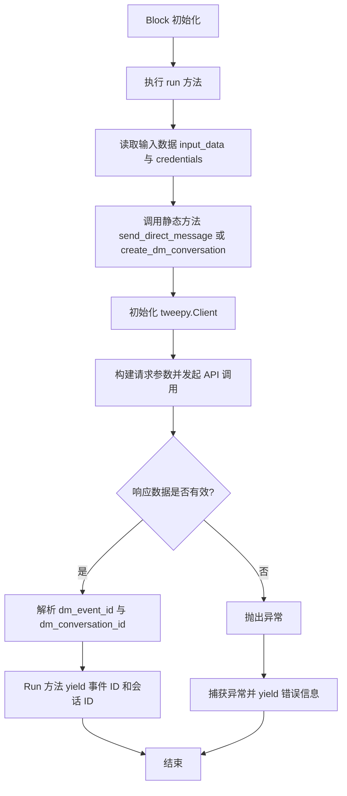
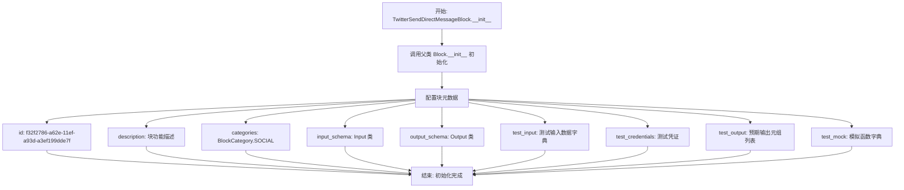
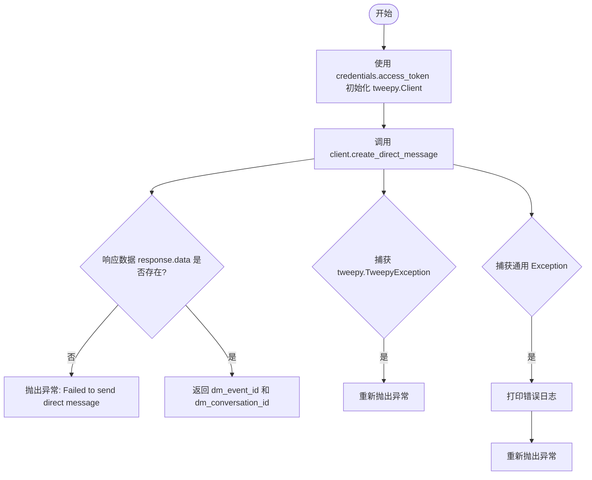
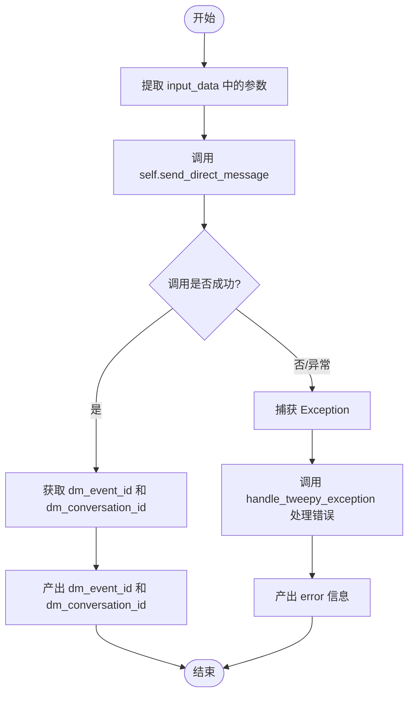
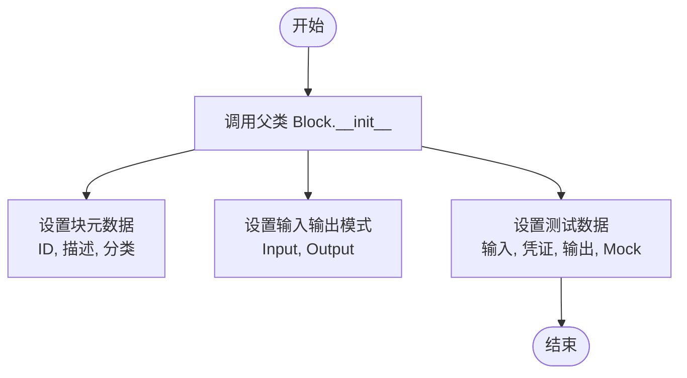
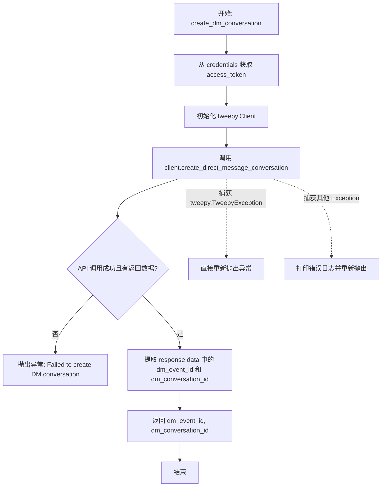
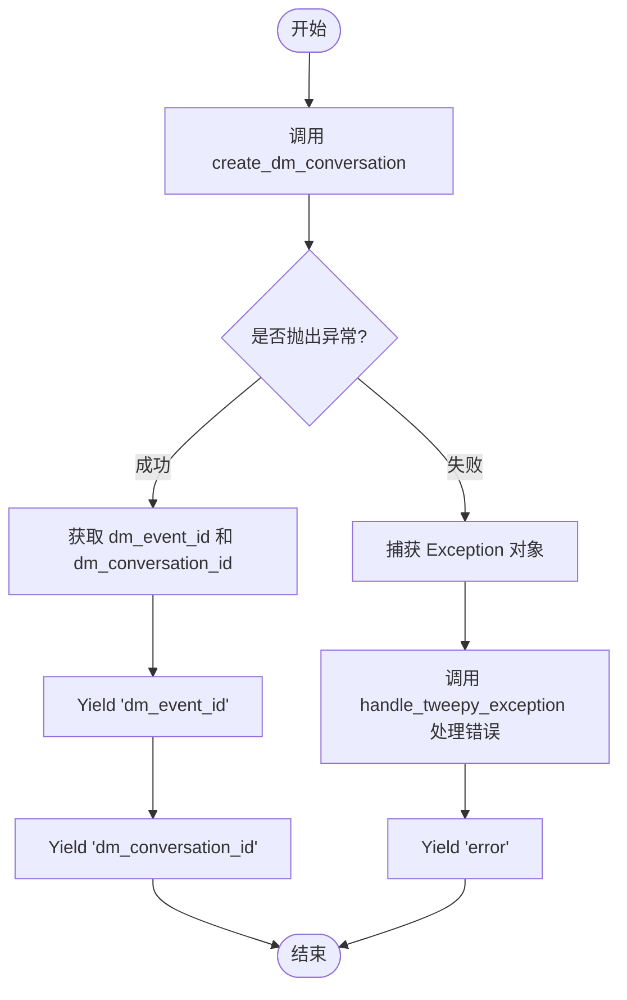

# `AutoGPT\autogpt_platform\backend\backend\blocks\twitter\direct_message\manage_direct_message.py` 详细设计文档

该代码定义了两个用于 Twitter (X) API 集成的 Block 类，分别用于发送私信（Direct Message）和创建群组私信会话。代码通过 `tweepy` 库封装了具体的 API 调用逻辑，遵循统一的 Block 架构，包含输入输出 Schema 定义、初始化配置、凭证处理、异常捕获及测试用例模拟。

## 整体流程



## 类结构

```
Block (外部基类)
├── TwitterSendDirectMessageBlock
│   ├── Input (Schema 定义)
│   ├── Output (Schema 定义)
│   ├── __init__
│   ├── send_direct_message (static)
│   └── run (async)
└── TwitterCreateDMConversationBlock
    ├── Input (Schema 定义)
    ├── Output (Schema 定义)
    ├── __init__
    ├── create_dm_conversation (static)
    └── run (async)
```

## 全局变量及字段


### `TwitterSendDirectMessageBlock.credentials`
    
Credentials for Twitter API authentication with required scopes.

类型：`TwitterCredentialsInput`
    


### `TwitterSendDirectMessageBlock.participant_id`
    
The User ID of the account to send DM to

类型：`str`
    


### `TwitterSendDirectMessageBlock.dm_conversation_id`
    
The conversation ID to send message to

类型：`str`
    


### `TwitterSendDirectMessageBlock.text`
    
Text of the Direct Message (up to 10,000 characters)

类型：`str`
    


### `TwitterSendDirectMessageBlock.media_id`
    
Media ID to attach to the message

类型：`str`
    


### `TwitterSendDirectMessageBlock.dm_event_id`
    
ID of the sent direct message

类型：`str`
    


### `TwitterSendDirectMessageBlock.dm_conversation_id_`
    
ID of the conversation

类型：`str`
    


### `TwitterSendDirectMessageBlock.error`
    
Error message if sending failed

类型：`str`
    


### `TwitterCreateDMConversationBlock.credentials`
    
Credentials for Twitter API authentication with required scopes.

类型：`TwitterCredentialsInput`
    


### `TwitterCreateDMConversationBlock.participant_ids`
    
Array of User IDs to create conversation with (max 50)

类型：`list[str]`
    


### `TwitterCreateDMConversationBlock.text`
    
Text of the Direct Message (up to 10,000 characters)

类型：`str`
    


### `TwitterCreateDMConversationBlock.media_id`
    
Media ID to attach to the message

类型：`str`
    


### `TwitterCreateDMConversationBlock.dm_event_id`
    
ID of the sent direct message

类型：`str`
    


### `TwitterCreateDMConversationBlock.dm_conversation_id`
    
ID of the conversation

类型：`str`
    


### `TwitterCreateDMConversationBlock.error`
    
Error message if sending failed

类型：`str`
    
    

## 全局函数及方法


### `TwitterSendDirectMessageBlock.__init__`

`TwitterSendDirectMessageBlock` 类的初始化方法，负责设置块的元数据，包括唯一标识符、描述、分类、输入输出模式，以及用于测试的输入、输出数据和模拟行为。

参数：

- `self`：`TwitterSendDirectMessageBlock`，类的实例本身。

返回值：`None`，无返回值，仅完成对象的初始化。

#### 流程图



#### 带注释源码

```python
def __init__(self):
    # 调用父类 Block 的构造函数，传入配置参数以初始化块的基本信息
    super().__init__(
        # 块的唯一标识符 (UUID)
        id="f32f2786-a62e-11ef-a93d-a3ef199dde7f",
        # 块的功能描述文本
        description="This block sends a direct message to a specified Twitter user.",
        # 块所属的分类，此处为社交媒体类别
        categories={BlockCategory.SOCIAL},
        # 指定输入数据的结构模式，使用内部类 Input 定义
        input_schema=TwitterSendDirectMessageBlock.Input,
        # 指定输出数据的结构模式，使用内部类 Output 定义
        output_schema=TwitterSendDirectMessageBlock.Output,
        # 定义用于单元测试或集成测试的模拟输入数据
        test_input={
            "participant_id": "783214",
            "dm_conversation_id": "",
            "text": "Hello from Twitter API",
            "media_id": "",
            "credentials": TEST_CREDENTIALS_INPUT
        },
        # 定义测试时使用的凭证对象
        test_credentials=TEST_CREDENTIALS,
        # 定义预期的测试输出结果，用于验证逻辑
        test_output=[
            ("dm_event_id", "0987654321"),
            ("dm_conversation_id_", "1234567890"),
            ("error", "")
        ],
        # 定义模拟行为，当测试环境运行时，使用此 lambda 函数替代真实的 send_direct_message 方法
        test_mock={
            "send_direct_message": lambda *args, **kwargs: (
                "0987654321",
                "1234567890"
            )
        },
    )
```


### `TwitterSendDirectMessageBlock.send_direct_message`

该方法通过 Twitter API 向指定用户发送直接消息（Direct Message），支持指定接收者ID、会话ID、文本内容及媒体附件。

参数：

-  `credentials`：`TwitterCredentials`，包含访问令牌的 Twitter 凭证对象，用于 API 认证。
-  `participant_id`：`str`，接收消息的用户 ID。
-  `dm_conversation_id`：`str`，发送消息到的对话 ID。
-  `text`：`str`，直接消息的文本内容。
-  `media_id`：`str`，附加到消息的媒体 ID。

返回值：`tuple[str, str]`，包含发送成功的消息事件 ID（dm_event_id）和对话 ID（dm_conversation_id）的元组。

#### 流程图



#### 带注释源码

```python
@staticmethod
def send_direct_message(
    credentials: TwitterCredentials,
    participant_id: str,
    dm_conversation_id: str,
    text: str,
    media_id: str
):
    try:
        # 使用凭证中的 Bearer Token 初始化 Tweepy 客户端
        client = tweepy.Client(
            bearer_token=credentials.access_token.get_secret_value()
        )

        # 调用 Twitter API 创建并发送直接消息
        # 若参数为空字符串，则将其转换为 None
        response = cast(
            Response,
            client.create_direct_message(
                participant_id=None if participant_id == "" else participant_id,
                dm_conversation_id=None if dm_conversation_id == "" else dm_conversation_id,
                text=None if text == "" else text,
                media_id=None if media_id == "" else media_id,
                user_auth=False
            )
        )

        # 验证响应中是否包含数据
        if not response.data:
            raise Exception("Failed to send direct message")

        # 返回消息事件 ID 和对话 ID
        return response.data["dm_event_id"], response.data["dm_conversation_id"]

    except tweepy.TweepyException:
        # 捕获 Tweepy 库特有的异常并直接向上抛出
        raise
    except Exception as e:
        # 捕获其他未预期的异常，打印错误信息后抛出
        print(f"Unexpected error: {str(e)}")
        raise
```


### `TwitterSendDirectMessageBlock.run`

执行发送 Twitter 私信的主要异步逻辑，负责从输入数据中提取参数，调用内部静态方法与 Twitter API 交互，并根据执行结果产出消息 ID 或错误信息。

参数：

-  `self`：`TwitterSendDirectMessageBlock`，类实例本身。
-  `input_data`：`TwitterSendDirectMessageBlock.Input`，包含发送私信所需的输入数据模型，如参与者 ID、会话 ID、文本内容和媒体 ID。
-  `credentials`：`TwitterCredentials`，用于认证的 Twitter OAuth 凭证对象。
-  `**kwargs`：`dict`，接收其他可选的关键字参数。

返回值：`BlockOutput`，一个异步生成器，按顺序产出 `dm_event_id`、`dm_conversation_id` 或 `error`。

#### 流程图



#### 带注释源码

```python
    async def run(
        self,
        input_data: Input,
        *,
        credentials: TwitterCredentials,
        **kwargs,
    ) -> BlockOutput:
        try:
            # 调用静态方法 send_direct_message 执行实际的 API 请求
            # 传入凭证、接收者ID、会话ID、文本内容以及媒体ID
            dm_event_id, dm_conversation_id = self.send_direct_message(
                credentials,
                input_data.participant_id,
                input_data.dm_conversation_id,
                input_data.text,
                input_data.media_id
            )
            # 成功发送后，产出私信事件 ID
            yield "dm_event_id", dm_event_id
            # 成功发送后，产出会话 ID
            yield "dm_conversation_id", dm_conversation_id

        except Exception as e:
            # 捕获处理过程中发生的任何异常
            # 调用 handle_tweepy_exception 将异常转换为用户可读的错误字符串
            # 并产出 error 信息
            yield "error", handle_tweepy_exception(e)
```


### `TwitterCreateDMConversationBlock.__init__`

初始化 `TwitterCreateDMConversationBlock` 类的实例，通过调用父类构造函数配置该块的唯一标识符、描述信息、分类、输入输出模式以及用于测试的各种数据（如测试输入、凭证、预期输出和模拟函数）。

参数：

- `self`：`TwitterCreateDMConversationBlock`，类的实例本身。

返回值：`None`，无返回值。

#### 流程图



#### 带注释源码

```python
def __init__(self):
    # 调用父类 Block 的构造函数，初始化块的基本配置
    super().__init__(
        # 设置块的唯一标识符 (UUID)
        id="ec11cabc-a62e-11ef-8c0e-3fe37ba2ec92",
        # 设置块的描述文本，说明其功能是创建群组私信会话
        description="This block creates a new group DM conversation with specified Twitter users.",
        # 设置块的归属类别为社交 (SOCIAL)
        categories={BlockCategory.SOCIAL},
        # 绑定输入模式定义，指定需要的输入字段结构
        input_schema=TwitterCreateDMConversationBlock.Input,
        # 绑定输出模式定义，指定返回的字段结构
        output_schema=TwitterCreateDMConversationBlock.Output,
        # 定义用于测试的输入数据样本
        test_input={
            "participant_ids": ["783214", "2244994945"],
            "text": "Hello from Twitter API",
            "media_id": "",
            "credentials": TEST_CREDENTIALS_INPUT
        },
        # 定义用于测试的认证凭证
        test_credentials=TEST_CREDENTIALS,
        # 定义预期的测试输出结果样本
        test_output=[
            ("dm_event_id", "0987654321"),
            ("dm_conversation_id", "1234567890"),
            ("error", "")
        ],
        # 定义模拟函数，用于在单元测试中模拟真实的 API 调用行为
        test_mock={
            "create_dm_conversation": lambda *args, **kwargs: (
                "0987654321",
                "1234567890"
            )
        },
    )
```


### `TwitterCreateDMConversationBlock.create_dm_conversation`

这是一个静态方法，用于通过 Twitter API 创建新的群组私信（DM）会话。它接收认证凭证、参与者ID列表、消息文本和媒体ID作为输入，初始化 Tweepy 客户端并调用 API 创建会话，最后返回创建的消息事件ID和会话ID。

参数：

-  `credentials`：`TwitterCredentials`，Twitter API 的认证凭证对象，包含访问令牌等信息。
-  `participant_ids`：`list[str]`，参与群组私信的用户 ID 列表。
-  `text`：`str`，要发送的私信文本内容。
-  `media_id`：`str`，可选参数，要附加到消息中的媒体 ID。

返回值：`tuple[str, str]`，包含两个元素的元组，第一个元素是发送的私信事件 ID (`dm_event_id`)，第二个元素是创建的私信会话 ID (`dm_conversation_id`)。

#### 流程图



#### 带注释源码

```python
    @staticmethod
    def create_dm_conversation(
        credentials: TwitterCredentials,
        participant_ids: list[str],
        text: str,
        media_id: str
    ):
        try:
            # 使用传入的凭证中的 bearer_token 初始化 Tweepy 客户端
            client = tweepy.Client(
                bearer_token=credentials.access_token.get_secret_value()
            )

            # 调用 Twitter API 创建私信会话
            # 如果 text 或 media_id 为空字符串，则传入 None
            response = cast(
                Response,
                client.create_direct_message_conversation(
                    participant_ids=participant_ids,
                    text=None if text == "" else text,
                    media_id=None if media_id == "" else media_id,
                    user_auth=False
                )
            )

            # 检查响应数据是否存在，如果不存在则视为失败
            if not response.data:
                raise Exception("Failed to create DM conversation")

            # 返回私信事件 ID 和会话 ID
            return response.data["dm_event_id"], response.data["dm_conversation_id"]

        # 捕获 Tweepy 特定的异常并直接抛出，交由上层处理
        except tweepy.TweepyException:
            raise
        # 捕获其他未预期的异常，打印错误信息后重新抛出
        except Exception as e:
            print(f"Unexpected error: {str(e)}")
            raise
```


### `TwitterCreateDMConversationBlock.run`

该方法是TwitterCreateDMConversationBlock的核心执行入口，负责协调整个创建Twitter群组私信会话的流程，包括调用底层API接口、处理返回结果以及捕获并封装异常信息。

参数：

- `input_data`：`TwitterCreateDMConversationBlock.Input`，包含创建私信会话所需的输入数据，如参与者ID列表、消息文本及媒体ID。
- `credentials`：`TwitterCredentials`，Twitter的认证凭据对象，用于API访问授权。
- `**kwargs`：`dict`，额外的关键字参数，用于扩展或传递未显式定义的配置项。

返回值：`BlockOutput`，一个异步生成器，按顺序产生键值对（元组），包含私信事件ID、会话ID或错误信息。

#### 流程图



#### 带注释源码

```python
async def run(
    self,
    input_data: Input,
    *,
    credentials: TwitterCredentials,
    **kwargs,
) -> BlockOutput:
    try:
        # 调用静态方法 create_dm_conversation 执行实际的 API 请求
        # 传入凭证、参与者ID列表、文本内容和媒体ID
        dm_event_id, dm_conversation_id = self.create_dm_conversation(
            credentials,
            input_data.participant_ids,
            input_data.text,
            input_data.media_id
        )
        
        # 成功时，产出私信事件 ID (dm_event_id)
        yield "dm_event_id", dm_event_id
        
        # 成功时，产出会话 ID (dm_conversation_id)
        yield "dm_conversation_id", dm_conversation_id

    except Exception as e:
        # 捕获处理过程中发生的任何异常
        # 使用 handle_tweepy_exception 将异常转换为用户友好的错误消息
        # 产出错误信息 (error)
        yield "error", handle_tweepy_exception(e)
```


## 关键组件


### TwitterSendDirectMessageBlock
该类是一个封装了向特定Twitter用户或现有会话发送直接消息功能的Block，负责输入参数校验、API调用及异常处理。

### TwitterCreateDMConversationBlock
该类是一个封装了创建新的群组直接消息会话功能的Block，处理参与者列表、消息文本及媒体附件的初始化发送。

### TwitterCredentials
包含Twitter API认证所需的令牌和密钥的数据结构，用于确保操作的安全性和授权验证。

### tweepy.Client
用于与Twitter API v2进行交互的第三方客户端对象，负责执行底层的网络请求和数据传输。


## 问题及建议


### 已知问题
-   代码当前被完全注释，导致功能不可用。
-   在 `async def run` 方法中使用了同步的 `tweepy.Client` 执行网络请求，这会阻塞事件循环，影响系统的并发处理能力。
-   使用 `print()` 进行错误输出，不符合生产环境日志管理的最佳实践。
-   文件头部 TODO 提到的“增加新类型支持”以及“检查 OAuth 是否配置”的逻辑尚未实现。
-   缺乏显式的输入参数校验（例如文本长度限制），依赖后端 API 抛出错误，增加了不必要的网络请求。

### 优化建议
-   将 `tweepy.Client` 替换为 `tweepy.asynchronous.Client`，以匹配 `async def run` 的异步架构，避免阻塞主线程。
-   使用标准库 `logging` 替换 `print` 语句，实现结构化的日志记录和错误追踪。
-   取消代码注释，并完善初始化逻辑，增加对 OAuth 配置状态的检查，在配置缺失时禁用 Block。
-   增加输入参数的预校验逻辑，在发送请求前检查文本长度和 ID 格式，提升用户体验。
-   重构客户端实例化逻辑，如果架构允许，尝试复用 Client 实例而非每次调用都新建，以降低资源开销。


## 其它


### 设计目标与约束

该模块旨在通过封装 Twitter API v2 (使用 Tweepy 库)，为工作流系统提供发送私信和创建群组对话的标准化功能块。
主要设计目标包括：
1.  **功能封装**：将复杂的 API 调用参数（如凭据、参与者 ID、文本等）封装为统一的输入输出 Schema。
2.  **权限控制**：明确区分不同功能所需的 OAuth 2.0 权限范围，确保最小权限原则。

主要约束包括：
1.  **API 限制**：受限于 Twitter API 的速率限制和调用配额。
2.  **字符限制**：私信文本长度限制为 10,000 个字符。
3.  **数量限制**：群组对话的参与者数量上限为 50 人。
4.  **平台分级**：根据代码注释，部分功能可能仅适用于 Twitter Pro 或 Enterprise 计划，需配置特定的 OAuth 凭据才能启用。

### 外部依赖与接口契约

该模块依赖以下外部组件和接口：

1.  **Tweepy 库**:
    *   **组件**: `tweepy.Client`
    *   **契约**: 使用 Bearer Token 进行身份验证 (`user_auth=False`)。调用 `create_direct_message` 和 `create_direct_message_conversation` 接口。
    *   **返回契约**: 期望返回一个 `tweepy.client.Response` 对象，其中 `data` 字段必须包含 `dm_event_id` 和 `dm_conversation_id`。如果 `response.data` 为空，则视为业务失败。

2.  **内部认证模块** (`backend.blocks.twitter._auth`):
    *   **组件**: `TwitterCredentials`, `TwitterCredentialsInput`
    *   **契约**: 必须提供有效的 `access_token` (SecretValue)，并包含特定的权限 scopes (如 `offline.access`, `direct_messages.write` 等)。

3.  **异常处理模块** (`backend.blocks.twitter.tweepy_exceptions`):
    *   **组件**: `handle_tweepy_exception`
    *   **契约**: 接收捕获到的异常对象，返回格式化后的用户可读错误字符串。

### 错误处理与异常设计

系统采用两层错误捕获与处理机制：

1.  **静态方法层**:
    *   在 `send_direct_message` 和 `create_dm_conversation` 中，主要捕获 `tweepy.TweepyException`。
    *   **处理策略**: 捕获后直接重新抛出，交由上层处理。
    *   **兜底策略**: 捕获通用 `Exception`，打印日志后重新抛出。
    *   **数据校验**: 如果 API 返回的 `response.data` 为空，抛出 `Exception("Failed to send...")`。

2.  **运行层**:
    *   在异步 `run` 方法中，捕获所有 `Exception`。
    *   **输出策略**: 不向系统抛出异常，而是通过 `yield "error", ...` 将错误信息作为输出流的一部分返回。这遵循了 Block 架构的 "Result over Exception" 设计模式，允许工作流在发生错误时继续执行或进行分支处理。
    *   **格式化**: 调用 `handle_tweepy_exception(e)` 将原始异常转换为标准化的错误消息。

### 安全性与认证机制

安全性设计遵循凭据隔离和权限最小化原则：

1.  **认证方式**: 使用 OAuth 2.0 Bearer Token (App-only 或 User Context 依赖 Token 类型)，通过 `user_auth=False` 参数配置 Tweepy 客户端。
2.  **凭据管理**: 凭据不硬编码在代码中，而是通过 `TwitterCredentials` 对象在运行时动态注入。
3.  **敏感信息保护**: 访问 Token 时使用 `credentials.access_token.get_secret_value()`，表明底层使用了安全存储机制（如 Secrets Manager），避免日志泄露。
4.  **Scope 验证**: 每个 Block 在初始化时通过 `TwitterCredentialsField` 声明了其运行所需的特定权限列表（例如 `["offline.access", "direct_messages.write"]`），系统应在执行前校验凭据是否具备这些 Scope。

### 数据流与状态转换

该模块属于无状态组件，没有复杂的内部状态机，数据流向为单向流：

1.  **输入阶段**: 外部调用者提供 `Input` 数据（包含 `credentials`, `participant_id`, `text` 等）。
2.  **转换阶段**:
    *   `run` 方法接收输入。
    *   调用静态辅助方法（如 `send_direct_message`）。
    *   辅助方法初始化 `tweepy.Client`，将输入参数映射为 API 请求参数。
    *   处理空字符串参数，将其转换为 `None` 以符合 API 调用习惯。
3.  **外部交互阶段**: 请求发送至 Twitter API 并等待响应。
4.  **输出阶段**:
    *   **成功路径**: 解析 `response.data`，提取 `dm_event_id` 和 `dm_conversation_id`，通过生成器 分两次返回结果。
    *   **失败路径**: 进入异常捕获块，生成器产出 ("error", error_message)。

状态始终由外部工作流引擎维护，Block 本身在不同调用之间不保存任何上下文信息。

    