# `.\AutoGPT\autogpt_platform\backend\backend\blocks\twitter\lists\list_follows.py` 详细设计文档

This file contains classes for interacting with Twitter APIs, including unfollowing and following lists, and retrieving followers and followed lists.

## 整体流程

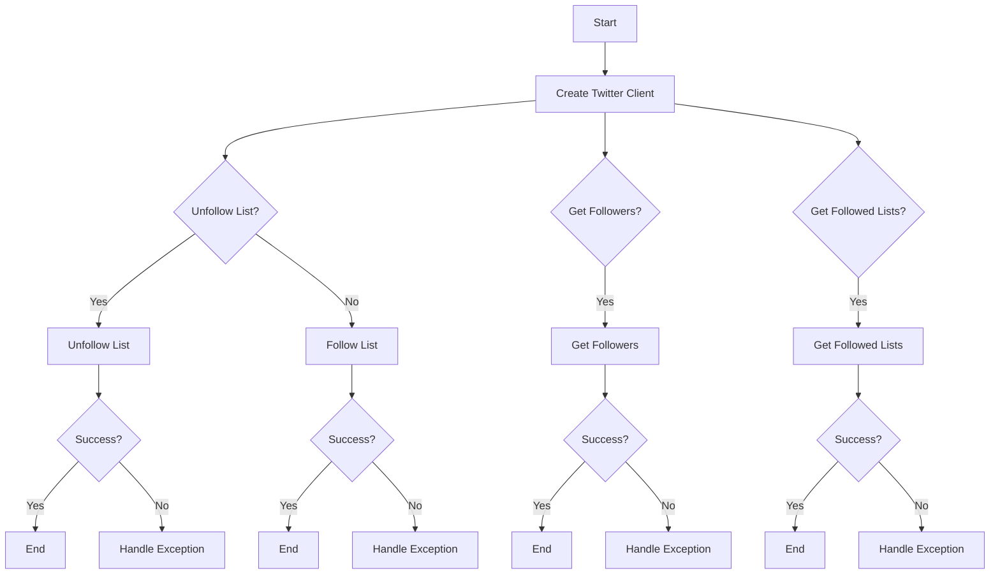

## 类结构

```
TwitterUnfollowListBlock (Concrete Block)
├── TwitterFollowListBlock (Concrete Block)
├── TwitterListGetFollowersBlock (Concrete Block)
└── TwitterGetFollowedListsBlock (Concrete Block)
```

## 全局变量及字段


### `TEST_CREDENTIALS`
    
Test credentials for Twitter API access

类型：`TwitterCredentials`
    


### `TEST_CREDENTIALS_INPUT`
    
Test input for Twitter credentials

类型：`TwitterCredentialsInput`
    


### `TWITTER_OAUTH_IS_CONFIGURED`
    
Flag indicating if Twitter OAuth is configured

类型：`bool`
    


### `TwitterUnfollowListBlock.id`
    
Unique identifier for the block

类型：`str`
    


### `TwitterUnfollowListBlock.description`
    
Description of the block's functionality

类型：`str`
    


### `TwitterUnfollowListBlock.categories`
    
Categories to which the block belongs

类型：`set[BlockCategory]`
    


### `TwitterUnfollowListBlock.input_schema`
    
Schema for the block's input data

类型：`Input`
    


### `TwitterUnfollowListBlock.output_schema`
    
Schema for the block's output data

类型：`Output`
    


### `TwitterUnfollowListBlock.disabled`
    
Flag indicating if the block is disabled

类型：`bool`
    


### `TwitterUnfollowListBlock.test_input`
    
Test input data for the block

类型：`dict`
    


### `TwitterUnfollowListBlock.test_credentials`
    
Test credentials for the block

类型：`TwitterCredentials`
    


### `TwitterUnfollowListBlock.test_output`
    
Test output data for the block

类型：`list[tuple]`
    


### `TwitterUnfollowListBlock.test_mock`
    
Test mock data for the block

类型：`dict`
    


### `TwitterFollowListBlock.id`
    
Unique identifier for the block

类型：`str`
    


### `TwitterFollowListBlock.description`
    
Description of the block's functionality

类型：`str`
    


### `TwitterFollowListBlock.categories`
    
Categories to which the block belongs

类型：`set[BlockCategory]`
    


### `TwitterFollowListBlock.input_schema`
    
Schema for the block's input data

类型：`Input`
    


### `TwitterFollowListBlock.output_schema`
    
Schema for the block's output data

类型：`Output`
    


### `TwitterFollowListBlock.disabled`
    
Flag indicating if the block is disabled

类型：`bool`
    


### `TwitterFollowListBlock.test_input`
    
Test input data for the block

类型：`dict`
    


### `TwitterFollowListBlock.test_credentials`
    
Test credentials for the block

类型：`TwitterCredentials`
    


### `TwitterFollowListBlock.test_output`
    
Test output data for the block

类型：`list[tuple]`
    


### `TwitterFollowListBlock.test_mock`
    
Test mock data for the block

类型：`dict`
    


### `TwitterListGetFollowersBlock.id`
    
Unique identifier for the block

类型：`str`
    


### `TwitterListGetFollowersBlock.description`
    
Description of the block's functionality

类型：`str`
    


### `TwitterListGetFollowersBlock.categories`
    
Categories to which the block belongs

类型：`set[BlockCategory]`
    


### `TwitterListGetFollowersBlock.input_schema`
    
Schema for the block's input data

类型：`Input`
    


### `TwitterListGetFollowersBlock.output_schema`
    
Schema for the block's output data

类型：`Output`
    


### `TwitterListGetFollowersBlock.test_input`
    
Test input data for the block

类型：`dict`
    


### `TwitterListGetFollowersBlock.test_credentials`
    
Test credentials for the block

类型：`TwitterCredentials`
    


### `TwitterListGetFollowersBlock.test_output`
    
Test output data for the block

类型：`list[tuple]`
    


### `TwitterListGetFollowersBlock.test_mock`
    
Test mock data for the block

类型：`dict`
    


### `TwitterGetFollowedListsBlock.id`
    
Unique identifier for the block

类型：`str`
    


### `TwitterGetFollowedListsBlock.description`
    
Description of the block's functionality

类型：`str`
    


### `TwitterGetFollowedListsBlock.categories`
    
Categories to which the block belongs

类型：`set[BlockCategory]`
    


### `TwitterGetFollowedListsBlock.input_schema`
    
Schema for the block's input data

类型：`Input`
    


### `TwitterGetFollowedListsBlock.output_schema`
    
Schema for the block's output data

类型：`Output`
    


### `TwitterGetFollowedListsBlock.test_input`
    
Test input data for the block

类型：`dict`
    


### `TwitterGetFollowedListsBlock.test_credentials`
    
Test credentials for the block

类型：`TwitterCredentials`
    


### `TwitterGetFollowedListsBlock.test_output`
    
Test output data for the block

类型：`list[tuple]`
    


### `TwitterGetFollowedListsBlock.test_mock`
    
Test mock data for the block

类型：`dict`
    
    

## 全局函数及方法


### `handle_tweepy_exception`

This function handles exceptions raised by the Tweepy library, which is used for interacting with the Twitter API.

参数：

- `e`：`Exception`，The exception object that was raised by the Tweepy library.

返回值：`str`，A string describing the error that occurred.

#### 流程图

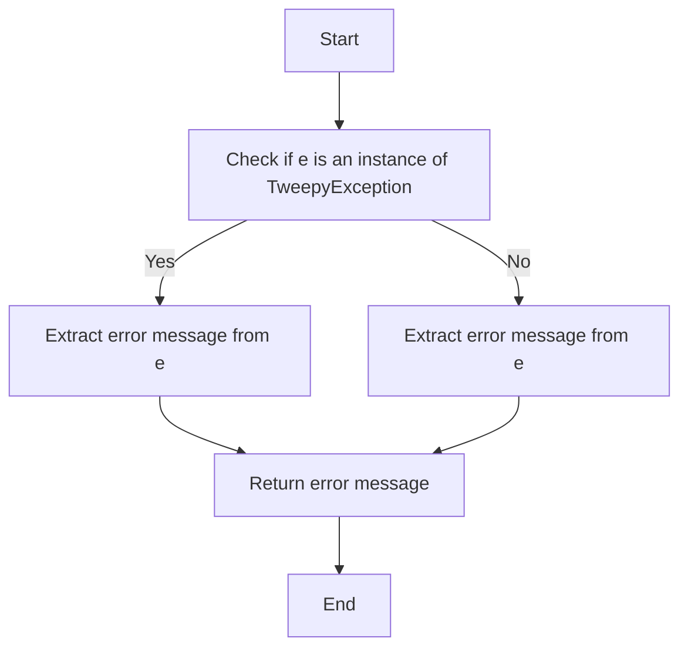

#### 带注释源码

```python
def handle_tweepy_exception(e: Exception) -> str:
    """
    Handles exceptions raised by the Tweepy library.

    :param e: The exception object that was raised by the Tweepy library.
    :return: A string describing the error that occurred.
    """
    if isinstance(e, tweepy.TweepyException):
        return str(e)
    else:
        return str(e)
``` 


### `TwitterUnfollowListBlock.__init__`

This method initializes the `TwitterUnfollowListBlock` class, setting up its properties and configurations.

参数：

- `self`：`TwitterUnfollowListBlock`，The instance of the class being initialized.
- `id`：`str`，The unique identifier for the block.
- `description`：`str`，A description of the block's functionality.
- `categories`：`set`，A set of categories that the block belongs to.
- `input_schema`：`BlockSchemaInput`，The schema for the input data of the block.
- `output_schema`：`BlockSchemaOutput`，The schema for the output data of the block.
- `disabled`：`bool`，Whether the block is disabled or not.
- `test_input`：`dict`，The test input data for the block.
- `test_credentials`：`TwitterCredentials`，The test credentials for the block.
- `test_output`：`list`，The expected test output data for the block.
- `test_mock`：`dict`，Mock functions for testing the block.

返回值：`None`，This method does not return any value.

#### 流程图

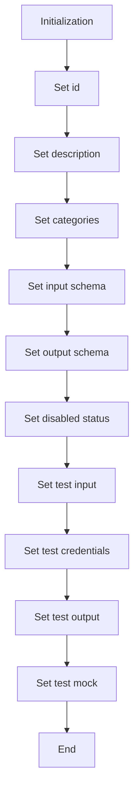

#### 带注释源码

```python
def __init__(self):
    super().__init__(
        id="1f43310a-a62f-11ef-8276-2b06a1bbae1a",
        description="This block unfollows a specified Twitter list for the authenticated user.",
        categories={BlockCategory.SOCIAL},
        input_schema=TwitterUnfollowListBlock.Input,
        output_schema=TwitterUnfollowListBlock.Output,
        disabled=not TWITTER_OAUTH_IS_CONFIGURED,
        test_input={"list_id": "123456789", "credentials": TEST_CREDENTIALS_INPUT},
        test_credentials=TEST_CREDENTIALS,
        test_output=[
            ("success", True),
        ],
        test_mock={"unfollow_list": lambda *args, **kwargs: True},
    )
```


### TwitterUnfollowListBlock.unfollow_list

Unfollows a Twitter list for the authenticated user.

参数：

- `credentials`：`TwitterCredentials`，The Twitter credentials required to authenticate the request.
- `list_id`：`str`，The ID of the List to unfollow.

返回值：`bool`，Whether the unfollow was successful.

#### 流程图

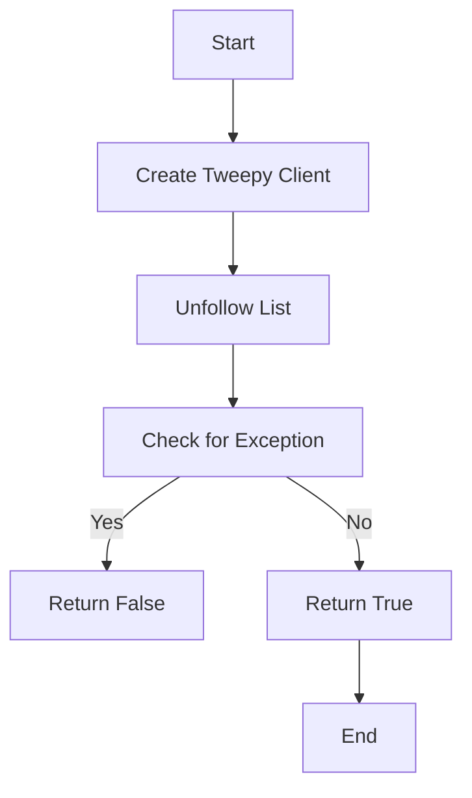

#### 带注释源码

```python
@staticmethod
def unfollow_list(credentials: TwitterCredentials, list_id: str):
    try:
        client = tweepy.Client(
            bearer_token=credentials.access_token.get_secret_value()
        )

        client.unfollow_list(list_id=list_id, user_auth=False)

        return True

    except tweepy.TweepyException:
        raise
```


### `TwitterUnfollowListBlock.run`

Unfollows a Twitter list for the authenticated user.

参数：

- `input_data`：`Input`，The input data for the block, containing the list ID and credentials.
- `credentials`：`TwitterCredentials`，The credentials used to authenticate with Twitter.

返回值：`BlockOutput`，The output of the block, indicating whether the unfollow was successful.

#### 流程图

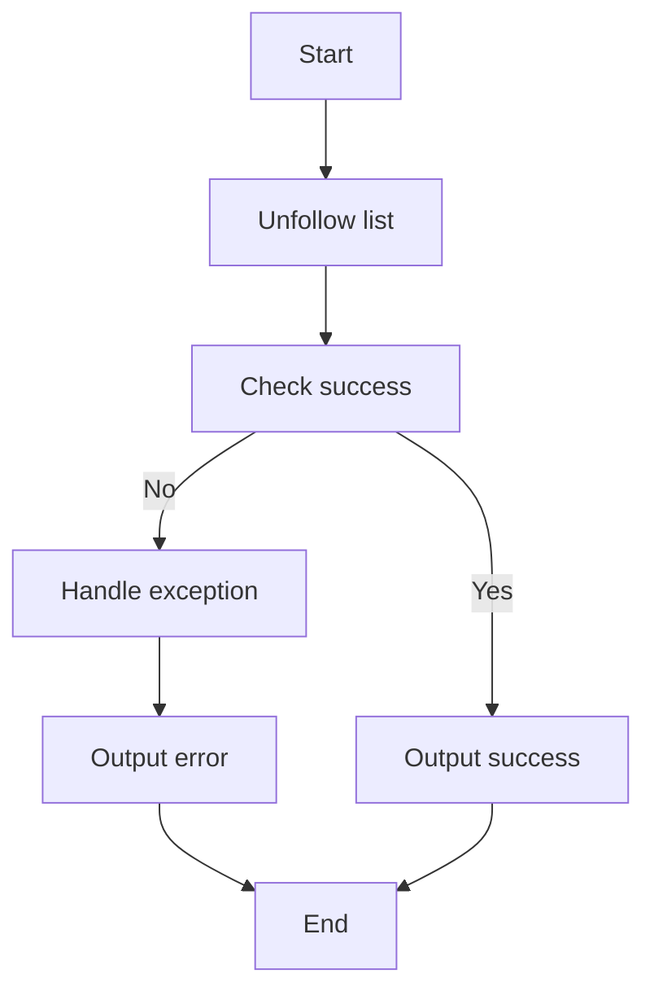

#### 带注释源码

```python
async def run(
    self,
    input_data: Input,
    *,
    credentials: TwitterCredentials,
    **kwargs,
) -> BlockOutput:
    try:
        success = self.unfollow_list(credentials, input_data.list_id)
        yield "success", success
    except Exception as e:
        yield "error", handle_tweepy_exception(e)
```


### TwitterFollowListBlock.__init__

This method initializes the `TwitterFollowListBlock` class, setting up its properties and configurations.

参数：

- `self`：`TwitterFollowListBlock` 类的实例，用于访问类的属性和方法。

返回值：无

#### 流程图

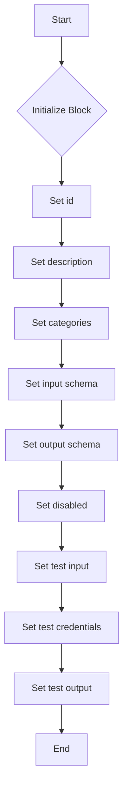

#### 带注释源码

```python
def __init__(self):
    super().__init__(
        id="03d8acf6-a62f-11ef-b17f-b72b04a09e79",
        description="This block follows a specified Twitter list for the authenticated user.",
        categories={BlockCategory.SOCIAL},
        input_schema=TwitterFollowListBlock.Input,
        output_schema=TwitterFollowListBlock.Output,
        disabled=not TWITTER_OAUTH_IS_CONFIGURED,
        test_input={"list_id": "123456789", "credentials": TEST_CREDENTIALS_INPUT},
        test_credentials=TEST_CREDENTIALS,
        test_output=[
            ("success", True),
        ],
        test_mock={"follow_list": lambda *args, **kwargs: True},
    )
```


### TwitterFollowListBlock.follow_list

This method follows a specified Twitter list for the authenticated user.

参数：

- `credentials`：`TwitterCredentials`，The Twitter credentials required to authenticate the request.
- `list_id`：`str`，The ID of the List to follow.

返回值：`bool`，Whether the follow was successful.

#### 流程图

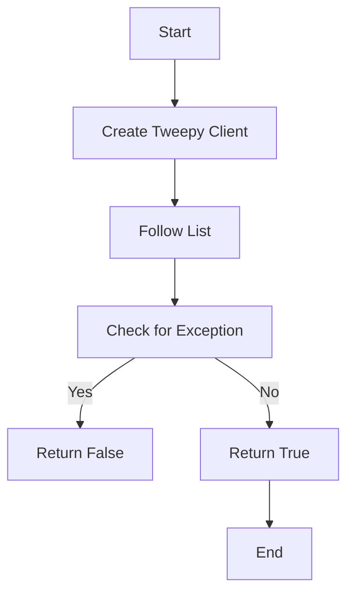

#### 带注释源码

```python
@staticmethod
def follow_list(credentials: TwitterCredentials, list_id: str):
    try:
        client = tweepy.Client(
            bearer_token=credentials.access_token.get_secret_value()
        )

        client.follow_list(list_id=list_id, user_auth=False)

        return True

    except tweepy.TweepyException:
        raise
```


### TwitterFollowListBlock.run

This method runs the TwitterFollowListBlock, which follows a specified Twitter list for the authenticated user.

参数：

- `input_data`：`Input`，The input data for the block, containing the list ID and credentials.
- `credentials`：`TwitterCredentials`，The credentials used to authenticate with Twitter.

返回值：`BlockOutput`，The output of the block, indicating whether the follow operation was successful.

#### 流程图

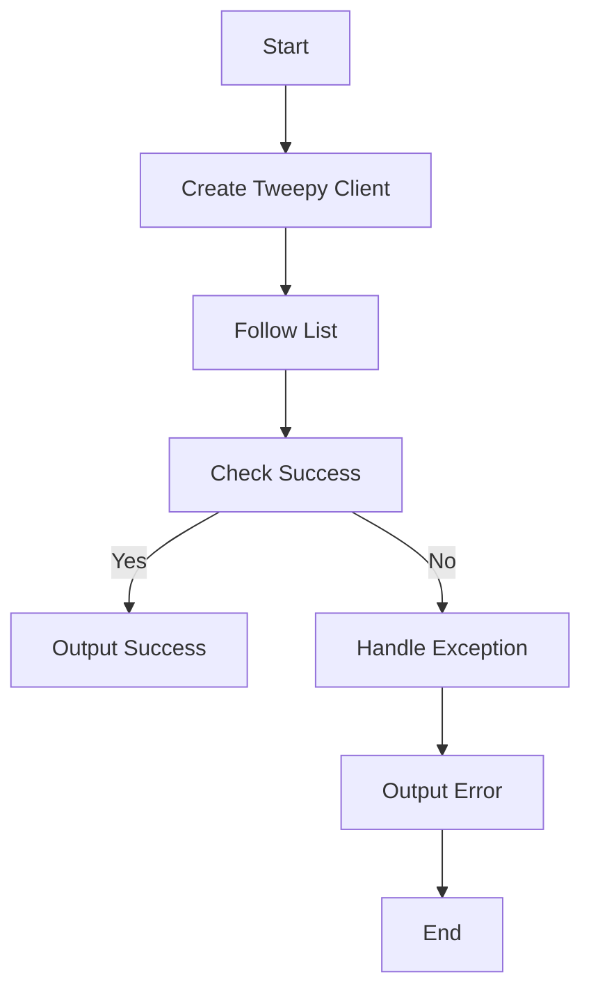

#### 带注释源码

```python
async def run(
    self,
    input_data: Input,
    *,
    credentials: TwitterCredentials,
    **kwargs,
) -> BlockOutput:
    try:
        success = self.follow_list(credentials, input_data.list_id)
        yield "success", success
    except Exception as e:
        yield "error", handle_tweepy_exception(e)
```


### TwitterListGetFollowersBlock.__init__

This method initializes the `TwitterListGetFollowersBlock` class, setting up its properties and configurations.

参数：

- 无

返回值：无

#### 流程图

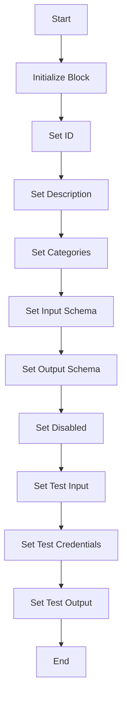

#### 带注释源码

```python
class TwitterListGetFollowersBlock(Block):
    """
    Gets followers of a specified Twitter list
    """

    class Input(UserExpansionInputs):
        credentials: TwitterCredentialsInput = TwitterCredentialsField(
            ["tweet.read","users.read", "list.read", "offline.access"]
        )

        list_id: str = SchemaField(
            description="The ID of the List to get followers for",
            placeholder="Enter list ID",
            required=True
        )

        max_results: int = SchemaField(
            description="Max number of results per page (1-100)",
            placeholder="Enter max results",
            default=10,
            advanced=True,
        )

        pagination_token: str = SchemaField(
            description="Token for pagination",
            placeholder="Enter pagination token",
            default="",
            advanced=True,
        )

    class Output(BlockSchemaOutput):
        user_ids: list[str] = SchemaField(description="List of user IDs of followers")
        usernames: list[str] = SchemaField(description="List of usernames of followers")
        next_token: str = SchemaField(description="Token for next page of results")
        data: list[dict] = SchemaField(description="Complete follower data")
        included: dict = SchemaField(description="Additional data requested via expansions")
        meta: dict = SchemaField(description="Metadata about the response")
        error: str = SchemaField(description="Error message if the request failed")

    def __init__(self):
        super().__init__(
            id="16b289b4-a62f-11ef-95d4-bb29b849eb99",
            description="This block retrieves followers of a specified Twitter list.",
            categories={BlockCategory.SOCIAL},
            input_schema=TwitterListGetFollowersBlock.Input,
            output_schema=TwitterListGetFollowersBlock.Output,
            disabled=not TWITTER_OAUTH_IS_CONFIGURED,
            test_input={
                "list_id": "123456789",
                "max_results": 10,
                "pagination_token": None,
                "credentials": TEST_CREDENTIALS_INPUT,
                "expansions": [],
                "tweet_fields": [],
                "user_fields": []
            },
            test_credentials=TEST_CREDENTIALS,
            test_output=[
                ("user_ids", ["2244994945"]),
                ("usernames", ["testuser"]),
                ("next_token", None),
                ("data", {"followers": [{"id": "2244994945", "username": "testuser"}]}),
                ("included", {}),
                ("meta", {}),
                ("error", "")
            ],
            test_mock={
                "get_list_followers": lambda *args, **kwargs: ({
                    "followers": [{"id": "2244994945", "username": "testuser"}]
                }, {}, {}, ["2244994945"], ["testuser"], None)
            }
        )
```


### TwitterListGetFollowersBlock.get_list_followers

Retrieves followers of a specified Twitter list.

参数：

- `credentials`：`TwitterCredentials`，Twitter credentials object containing access token.
- `list_id`：`str`，The ID of the List to get followers for.
- `max_results`：`int`，Max number of results per page (1-100).
- `pagination_token`：`str`，Token for pagination.
- `expansions`：`list[UserExpansions]`，List of expansions to include in the response.
- `tweet_fields`：`list[TweetFields]`，List of fields to include in tweets.
- `user_fields`：`list[TweetUserFields]`，List of fields to include in users.

返回值：`list[dict]`，List of dictionaries containing user data.

#### 流程图

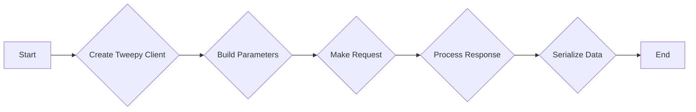

#### 带注释源码

```python
def get_list_followers(
    credentials: TwitterCredentials,
    list_id: str,
    max_results: int,
    pagination_token: str,
    expansions: list[UserExpansions],
    tweet_fields: list[TweetFields],
    user_fields: list[TweetUserFields]
):
    try:
        client = tweepy.Client(
            bearer_token=credentials.access_token.get_secret_value(),
        )

        params = {
            "id": list_id,
            "max_results": max_results,
            "pagination_token": None if pagination_token == "" else pagination_token,
            "user_auth": False
        }

        params = (UserExpansionsBuilder(params)
                  .add_expansions(expansions)
                  .add_tweet_fields(tweet_fields)
                  .add_user_fields(user_fields)
                  .build())

        response = cast(
            Response,
            client.get_list_followers(**params)
        )

        meta = {}
        user_ids = []
        usernames = []
        next_token = None

        if response.meta:
            meta = response.meta
            next_token = meta.get("next_token")

        included = IncludesSerializer.serialize(response.includes)
        data = ResponseDataSerializer.serialize_list(response.data)

        if response.data:
            user_ids = [str(item.id) for item in response.data]
            usernames = [item.username for item in response.data]

            return data, included, meta, user_ids, usernames, next_token

        raise Exception("No followers found")

    except tweepy.TweepyException:
        raise
```


### TwitterListGetFollowersBlock.run

Retrieves followers of a specified Twitter list.

参数：

- `input_data`：`Input`，The input data for the block, containing the list ID and other parameters.
- `credentials`：`TwitterCredentials`，The credentials used to authenticate with Twitter API.
- `**kwargs`：`Any`，Additional keyword arguments that may be passed to the method.

返回值：`BlockOutput`，The output of the block, containing the user IDs, usernames, next token, data, included, meta, and error message if the request failed.

#### 流程图

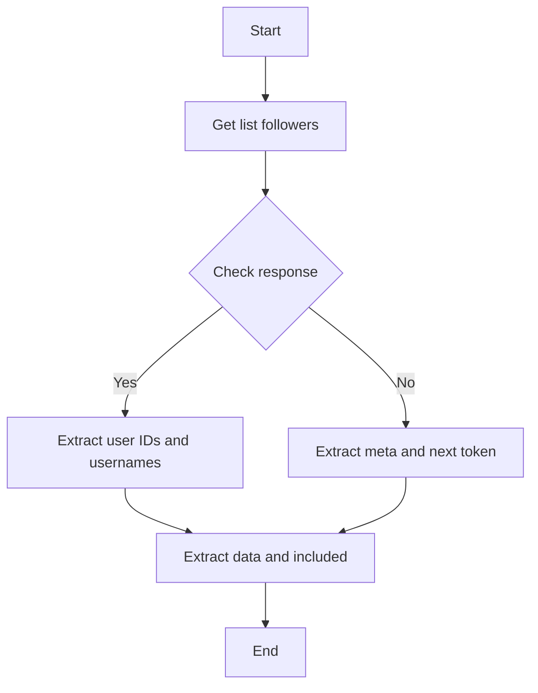

#### 带注释源码

```python
async def run(
    self,
    input_data: Input,
    *,
    credentials: TwitterCredentials,
    **kwargs,
) -> BlockOutput:
    try:
        followers_data, included, meta, user_ids, usernames, next_token = self.get_list_followers(
            credentials,
            input_data.list_id,
            input_data.max_results,
            input_data.pagination_token,
            input_data.expansions,
            input_data.tweet_fields,
            input_data.user_fields
        )

        if user_ids:
            yield "user_ids", user_ids
        if usernames:
            yield "usernames", usernames
        if next_token:
            yield "next_token", next_token
        if followers_data:
            yield "data", followers_data
        if included:
            yield "included", included
        if meta:
            yield "meta", meta

    except Exception as e:
        yield "error", handle_tweepy_exception(e)
```


### TwitterGetFollowedListsBlock.__init__

This method initializes the `TwitterGetFollowedListsBlock` class, setting up its properties and configurations.

参数：

- 无

返回值：无

#### 流程图


#### 带注释源码

```python
class TwitterGetFollowedListsBlock(Block):
    """
    Gets lists followed by a specified Twitter user
    """

    class Input(UserExpansionInputs):
        credentials: TwitterCredentialsInput = TwitterCredentialsField(
            ["follows.read", "users.read", "list.read", "offline.access"]
        )

        user_id: str = SchemaField(
            description="The user ID whose followed Lists to retrieve",
            placeholder="Enter user ID",
            required=True
        )

        max_results: int = SchemaField(
            description="Max number of results per page (1-100)",
            placeholder="Enter max results",
            default=10,
            advanced=True,
        )

        pagination_token: str = SchemaField(
            description="Token for pagination",
            placeholder="Enter pagination token",
            default="",
            advanced=True,
        )

    class Output(BlockSchemaOutput):
        list_ids: list[str] = SchemaField(description="List of list IDs")
        list_names: list[str] = SchemaField(description="List of list names")
        data: list[dict] = SchemaField(description="Complete list data")
        includes: dict = SchemaField(description="Additional data requested via expansions")
        meta: dict = SchemaField(description="Metadata about the response")
        next_token: str = SchemaField(description="Token for next page of results")
        error: str = SchemaField(description="Error message if the request failed")

    def __init__(self):
        super().__init__(
            id="0e18bbfc-a62f-11ef-94fa-1f1e174b809e",
            description="This block retrieves all Lists a specified user follows.",
            categories={BlockCategory.SOCIAL},
            input_schema=TwitterGetFollowedListsBlock.Input,
            output_schema=TwitterGetFollowedListsBlock.Output,
            disabled=not TWITTER_OAUTH_IS_CONFIGURED,
            test_input={
                "user_id": "123456789",
                "max_results": 10,
                "pagination_token": None,
                "credentials": TEST_CREDENTIALS_INPUT,
                "expansions": [],
                "tweet_fields": [],
                "user_fields": []
            },
            test_credentials=TEST_CREDENTIALS,
            test_output=[
                ("list_ids", ["12345"]),
                ("list_names", ["Test List"]),
                ("data", {"followed_lists": [{"id": "12345", "name": "Test List"}]}),
                ("includes", {}),
                ("meta", {}),
                ("next_token", None),
                ("error", "")
            ],
            test_mock={
                "get_followed_lists": lambda *args, **kwargs: ({
                    "followed_lists": [{"id": "12345", "name": "Test List"}]
                }, {}, {}, ["12345"], ["Test List"], None)
            }
        )
```


### TwitterGetFollowedListsBlock.get_followed_lists

Retrieves all lists followed by a specified Twitter user.

参数：

- `credentials`：`TwitterCredentials`，Twitter credentials object containing access token and secret.
- `user_id`：`str`，The user ID whose followed lists to retrieve.
- `max_results`：`int`，Max number of results per page (1-100).
- `pagination_token`：`str`，Token for pagination.
- `expansions`：`list[UserExpansions]`，List of expansions to include in the response.
- `tweet_fields`：`list[TweetFields]`，List of fields to include in tweets.
- `user_fields`：`list[TweetUserFields]`，List of fields to include in users.

返回值：`list[dict]`，Complete list data including list IDs, names, and additional information.

#### 流程图

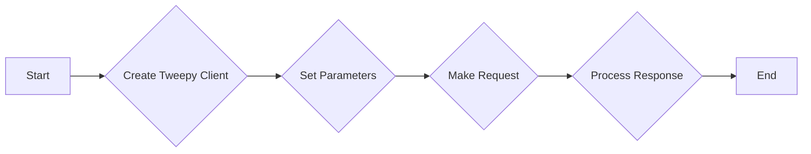

#### 带注释源码

```python
def get_followed_lists(
    credentials: TwitterCredentials,
    user_id: str,
    max_results: int,
    pagination_token: str,
    expansions: list[UserExpansions],
    tweet_fields: list[TweetFields],
    user_fields: list[TweetUserFields]
):
    try:
        client = tweepy.Client(
            bearer_token=credentials.access_token.get_secret_value(),
        )

        params = {
            "id": user_id,
            "max_results": max_results,
            "pagination_token": None if pagination_token == "" else pagination_token,
            "user_auth": False
        }

        params = (UserExpansionsBuilder(params)
                .add_expansions(expansions)
                .add_tweet_fields(tweet_fields)
                .add_user_fields(user_fields)
                .build())

        response = cast(
            Response,
            client.get_followed_lists(**params)
        )

        meta = {}
        list_ids = []
        list_names = []
        next_token = None

        if response.meta:
            meta = response.meta
            next_token = meta.get("next_token")

        included = IncludesSerializer.serialize(response.includes)
        data = ResponseDataSerializer.serialize_list(response.data)

        if response.data:
            list_ids = [str(item.id) for item in response.data]
            list_names = [item.name for item in response.data]

            return data, included, meta, list_ids, list_names, next_token

        raise Exception("No followed lists found")

    except tweepy.TweepyException:
        raise
```


### TwitterGetFollowedListsBlock.run

Retrieves all lists followed by a specified Twitter user.

参数：

- `input_data`：`Input`，The input data for the block, containing the user ID and other parameters.
- `credentials`：`TwitterCredentials`，The credentials used to authenticate with Twitter API.
- `**kwargs`：`Any`，Additional keyword arguments that may be passed to the method.

返回值：`BlockOutput`，The output of the block, containing the list IDs, list names, and other metadata.

#### 流程图

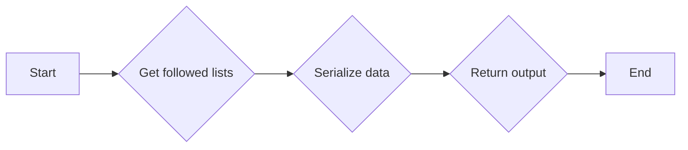

#### 带注释源码

```python
async def run(
    self,
    input_data: Input,
    *,
    credentials: TwitterCredentials,
    **kwargs,
) -> BlockOutput:
    try:
        lists_data, included, meta, list_ids, list_names, next_token = self.get_followed_lists(
            credentials,
            input_data.user_id,
            input_data.max_results,
            input_data.pagination_token,
            input_data.expansions,
            input_data.tweet_fields,
            input_data.user_fields
        )

        if list_ids:
            yield "list_ids", list_ids
        if list_names:
            yield "list_names", list_names
        if next_token:
            yield "next_token", next_token
        if lists_data:
            yield "data", lists_data
        if included:
            yield "includes", included
        if meta:
            yield "meta", meta

    except Exception as e:
        yield "error", handle_tweepy_exception(e)
```


## 关键组件


### 张量索引与惰性加载

张量索引与惰性加载是代码中处理数据的一种方式，它允许在需要时才加载和索引数据，从而提高性能和资源利用率。

### 反量化支持

反量化支持是代码中实现的一种功能，它允许对量化后的模型进行反量化处理，以便在需要时恢复原始的浮点数值。

### 量化策略

量化策略是代码中用于模型压缩和加速的一种技术，它通过将模型的权重和激活值从浮点数转换为低精度整数来减少模型的存储和计算需求。


## 问题及建议


### 已知问题

-   **代码重复性**：`TwitterUnfollowListBlock` 和 `TwitterFollowListBlock` 类具有高度相似的功能，但代码几乎完全相同。这可能导致维护成本增加，并且在未来需要修改功能时需要修改两处代码。
-   **异常处理**：`unfollow_list` 和 `follow_list` 方法中使用了 `try-except` 块来捕获 `tweepy.TweepyException`。这可能隐藏了其他类型的异常，导致调试困难。
-   **全局变量**：代码中使用了多个全局变量，如 `TWITTER_OAUTH_IS_CONFIGURED`，这可能导致代码难以理解和维护。
-   **未使用的代码**：代码中包含一些未使用的类和函数，如 `TwitterListGetFollowersBlock` 和 `TwitterGetFollowedListsBlock`，这些代码可能需要删除或重构。

### 优化建议

-   **重构代码**：将 `TwitterUnfollowListBlock` 和 `TwitterFollowListBlock` 的代码合并到一个类中，并使用参数来区分功能。
-   **改进异常处理**：在 `unfollow_list` 和 `follow_list` 方法中捕获更具体的异常，以便更好地诊断问题。
-   **减少全局变量**：将全局变量移至类或模块级别，以减少全局状态的使用。
-   **清理未使用的代码**：删除或重构未使用的类和函数，以减少代码复杂性。
-   **代码注释**：为代码添加更多注释，以提高代码的可读性和可维护性。
-   **单元测试**：为代码编写单元测试，以确保代码的正确性和稳定性。
-   **文档**：为代码编写详细的文档，包括类和方法的功能、参数和返回值。


## 其它


### 设计目标与约束

- 设计目标：
  - 实现Twitter列表的跟随和取消关注功能。
  - 提供一个用户友好的接口，允许用户通过简单的输入来操作Twitter列表。
  - 确保所有操作都通过OAuth进行认证，以保护用户的安全。
  - 提供测试用例和模拟数据，以便于开发和测试。

- 约束：
  - 必须使用Tweepy库进行Twitter API的交互。
  - 所有操作必须通过OAuth进行认证。
  - 输入数据必须经过验证，以确保其正确性和安全性。
  - 代码必须具有良好的可读性和可维护性。

### 错误处理与异常设计

- 错误处理：
  - 使用try-except块捕获TweepyException，并使用handle_tweepy_exception函数处理异常。
  - 对于其他类型的异常，记录错误信息并返回给用户。

- 异常设计：
  - 定义自定义异常类，以处理特定的错误情况。
  - 异常类应包含错误信息和可能的解决方案。

### 数据流与状态机

- 数据流：
  - 用户输入列表ID和认证信息。
  - 系统验证输入数据并调用相应的Tweepy API。
  - 系统处理API响应并返回结果。

- 状态机：
  - 系统状态包括：空闲、正在处理、完成、错误。
  - 状态转换由用户输入和API响应触发。

### 外部依赖与接口契约

- 外部依赖：
  - Tweepy库：用于与Twitter API交互。
  - tweepy_exceptions模块：用于处理Tweepy异常。

- 接口契约：
  - Twitter API：定义了与Twitter API交互的接口。
  - Block类：定义了数据块的标准接口。
  - TwitterCredentials类：定义了Twitter认证信息的接口。
  - TwitterCredentialsInput类：定义了Twitter认证信息输入的接口。

    