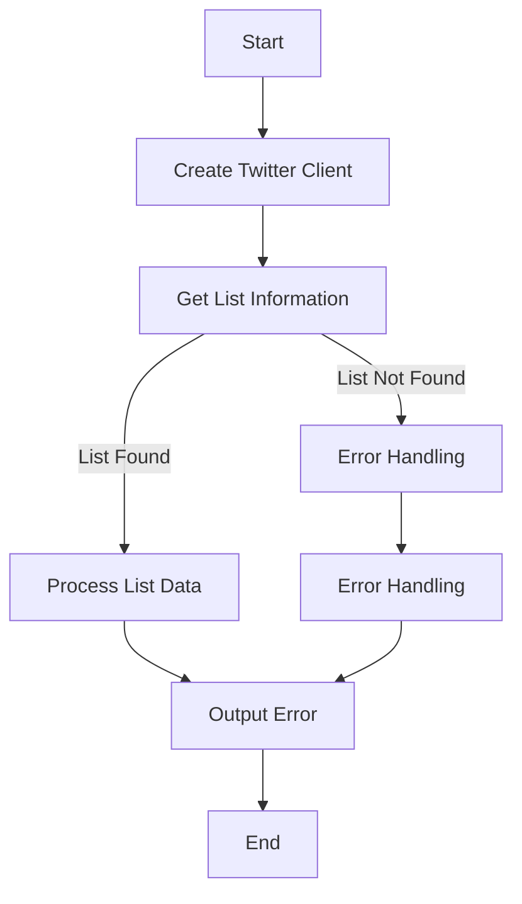
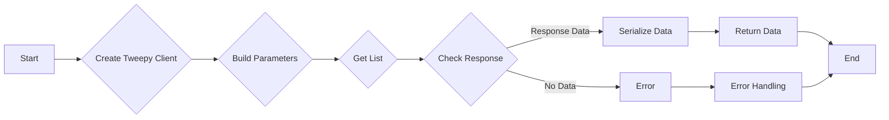
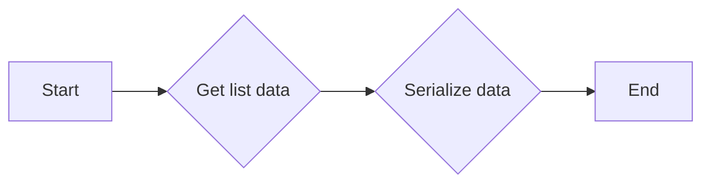
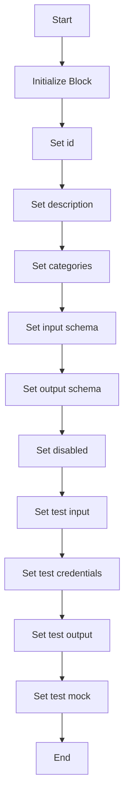
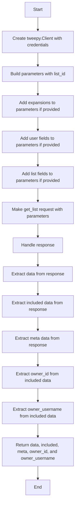
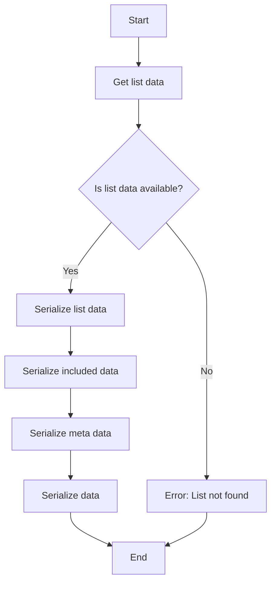

# `.\AutoGPT\autogpt_platform\backend\backend\blocks\twitter\lists\list_lookup.py` 详细设计文档

This code provides functionality to retrieve information about Twitter Lists and owned Lists using the Twitter API.

## 整体流程



## 类结构

```
TwitterGetListBlock (Concrete Block)
├── Input (Nested Class)
│   ├── credentials (TwitterCredentialsInput)
│   └── list_id (str)
└── Output (Nested Class)
    ├── id (str)
    ├── name (str)
    ├── owner_id (str)
    ├── owner_username (str)
    ├── data (dict)
    ├── included (dict)
    └── meta (dict)
```

## 全局变量及字段


### `TEST_CREDENTIALS`
    
Test credentials for Twitter API access.

类型：`TwitterCredentials`
    


### `TEST_CREDENTIALS_INPUT`
    
Test input for Twitter credentials.

类型：`TwitterCredentialsInput`
    


### `TWITTER_OAUTH_IS_CONFIGURED`
    
Flag indicating if Twitter OAuth is configured.

类型：`bool`
    


### `TwitterCredentials`
    
Class representing Twitter credentials.

类型：`class`
    


### `TwitterCredentialsField`
    
Class representing a field in Twitter credentials.

类型：`class`
    


### `TwitterCredentialsInput`
    
Class representing input for Twitter credentials.

类型：`class`
    


### `ListExpansionsBuilder`
    
Class for building list expansions parameters.

类型：`class`
    


### `IncludesSerializer`
    
Class for serializing includes in Twitter API responses.

类型：`class`
    


### `ResponseDataSerializer`
    
Class for serializing response data in Twitter API responses.

类型：`class`
    


### `ListExpansionInputs`
    
Class representing inputs for list expansions.

类型：`class`
    


### `ListExpansionsFilter`
    
Class representing filter for list expansions.

类型：`class`
    


### `ListFieldsFilter`
    
Class representing filter for list fields.

类型：`class`
    


### `TweetUserFieldsFilter`
    
Class representing filter for tweet user fields.

类型：`class`
    


### `handle_tweepy_exception`
    
Function to handle Tweepy exceptions.

类型：`function`
    


### `Block`
    
Base class for blocks.

类型：`class`
    


### `BlockCategory`
    
Class representing block categories.

类型：`class`
    


### `BlockOutput`
    
Class representing block output.

类型：`class`
    


### `BlockSchemaOutput`
    
Class representing block schema output.

类型：`class`
    


### `SchemaField`
    
Class representing schema field.

类型：`class`
    


### `{'name': 'TwitterGetListBlock', 'fields': ['id', 'description', 'categories', 'input_schema', 'output_schema', 'disabled', 'test_input', 'test_credentials', 'test_output', 'test_mock'], 'methods': ['__init__', 'get_list', 'run']}.id`
    
ID of the TwitterGetListBlock class.

类型：`str`
    


### `{'name': 'TwitterGetListBlock', 'fields': ['id', 'description', 'categories', 'input_schema', 'output_schema', 'disabled', 'test_input', 'test_credentials', 'test_output', 'test_mock'], 'methods': ['__init__', 'get_list', 'run']}.description`
    
Description of the TwitterGetListBlock class.

类型：`str`
    


### `{'name': 'TwitterGetListBlock', 'fields': ['id', 'description', 'categories', 'input_schema', 'output_schema', 'disabled', 'test_input', 'test_credentials', 'test_output', 'test_mock'], 'methods': ['__init__', 'get_list', 'run']}.categories`
    
Categories of the TwitterGetListBlock class.

类型：`set`
    


### `{'name': 'TwitterGetListBlock', 'fields': ['id', 'description', 'categories', 'input_schema', 'output_schema', 'disabled', 'test_input', 'test_credentials', 'test_output', 'test_mock'], 'methods': ['__init__', 'get_list', 'run']}.input_schema`
    
Input schema of the TwitterGetListBlock class.

类型：`class`
    


### `{'name': 'TwitterGetListBlock', 'fields': ['id', 'description', 'categories', 'input_schema', 'output_schema', 'disabled', 'test_input', 'test_credentials', 'test_output', 'test_mock'], 'methods': ['__init__', 'get_list', 'run']}.output_schema`
    
Output schema of the TwitterGetListBlock class.

类型：`class`
    


### `{'name': 'TwitterGetListBlock', 'fields': ['id', 'description', 'categories', 'input_schema', 'output_schema', 'disabled', 'test_input', 'test_credentials', 'test_output', 'test_mock'], 'methods': ['__init__', 'get_list', 'run']}.disabled`
    
Flag indicating if the TwitterGetListBlock is disabled.

类型：`bool`
    


### `{'name': 'TwitterGetListBlock', 'fields': ['id', 'description', 'categories', 'input_schema', 'output_schema', 'disabled', 'test_input', 'test_credentials', 'test_output', 'test_mock'], 'methods': ['__init__', 'get_list', 'run']}.test_input`
    
Test input for the TwitterGetListBlock class.

类型：`dict`
    


### `{'name': 'TwitterGetListBlock', 'fields': ['id', 'description', 'categories', 'input_schema', 'output_schema', 'disabled', 'test_input', 'test_credentials', 'test_output', 'test_mock'], 'methods': ['__init__', 'get_list', 'run']}.test_credentials`
    
Test credentials for the TwitterGetListBlock class.

类型：`TwitterCredentials`
    


### `{'name': 'TwitterGetListBlock', 'fields': ['id', 'description', 'categories', 'input_schema', 'output_schema', 'disabled', 'test_input', 'test_credentials', 'test_output', 'test_mock'], 'methods': ['__init__', 'get_list', 'run']}.test_output`
    
Test output for the TwitterGetListBlock class.

类型：`list`
    


### `{'name': 'TwitterGetListBlock', 'fields': ['id', 'description', 'categories', 'input_schema', 'output_schema', 'disabled', 'test_input', 'test_credentials', 'test_output', 'test_mock'], 'methods': ['__init__', 'get_list', 'run']}.test_mock`
    
Test mock for the TwitterGetListBlock class.

类型：`dict`
    


### `{'name': 'TwitterGetListBlock.Input', 'fields': ['credentials', 'list_id'], 'methods': []}.credentials`
    
Credentials input for the TwitterGetListBlock class.

类型：`TwitterCredentialsInput`
    


### `{'name': 'TwitterGetListBlock.Input', 'fields': ['credentials', 'list_id'], 'methods': []}.list_id`
    
List ID input for the TwitterGetListBlock class.

类型：`str`
    


### `{'name': 'TwitterGetListBlock.Output', 'fields': ['id', 'name', 'owner_id', 'owner_username', 'data', 'included', 'meta'], 'methods': []}.id`
    
ID output for the TwitterGetListBlock class.

类型：`str`
    


### `{'name': 'TwitterGetListBlock.Output', 'fields': ['id', 'name', 'owner_id', 'owner_username', 'data', 'included', 'meta'], 'methods': []}.name`
    
Name output for the TwitterGetListBlock class.

类型：`str`
    


### `{'name': 'TwitterGetListBlock.Output', 'fields': ['id', 'name', 'owner_id', 'owner_username', 'data', 'included', 'meta'], 'methods': []}.owner_id`
    
Owner ID output for the TwitterGetListBlock class.

类型：`str`
    


### `{'name': 'TwitterGetListBlock.Output', 'fields': ['id', 'name', 'owner_id', 'owner_username', 'data', 'included', 'meta'], 'methods': []}.owner_username`
    
Owner username output for the TwitterGetListBlock class.

类型：`str`
    


### `{'name': 'TwitterGetListBlock.Output', 'fields': ['id', 'name', 'owner_id', 'owner_username', 'data', 'included', 'meta'], 'methods': []}.data`
    
Data output for the TwitterGetListBlock class.

类型：`dict`
    


### `{'name': 'TwitterGetListBlock.Output', 'fields': ['id', 'name', 'owner_id', 'owner_username', 'data', 'included', 'meta'], 'methods': []}.included`
    
Included output for the TwitterGetListBlock class.

类型：`dict`
    


### `{'name': 'TwitterGetListBlock.Output', 'fields': ['id', 'name', 'owner_id', 'owner_username', 'data', 'included', 'meta'], 'methods': []}.meta`
    
Meta output for the TwitterGetListBlock class.

类型：`dict`
    


### `TwitterGetListBlock.id`
    
Unique identifier for the block.

类型：`str`
    


### `TwitterGetListBlock.description`
    
Description of the block.

类型：`str`
    


### `TwitterGetListBlock.categories`
    
Categories to which the block belongs.

类型：`set`
    


### `TwitterGetListBlock.input_schema`
    
Input schema for the block.

类型：`class`
    


### `TwitterGetListBlock.output_schema`
    
Output schema for the block.

类型：`class`
    


### `TwitterGetListBlock.disabled`
    
Flag indicating if the block is disabled.

类型：`bool`
    


### `TwitterGetListBlock.test_input`
    
Test input for the block.

类型：`dict`
    


### `TwitterGetListBlock.test_credentials`
    
Test credentials for the block.

类型：`TwitterCredentials`
    


### `TwitterGetListBlock.test_output`
    
Test output for the block.

类型：`list`
    


### `TwitterGetListBlock.test_mock`
    
Test mock for the block.

类型：`dict`
    


### `TwitterGetListBlock.Input.credentials`
    
Twitter credentials input.

类型：`TwitterCredentialsInput`
    


### `TwitterGetListBlock.Input.list_id`
    
Twitter list ID input.

类型：`str`
    


### `TwitterGetListBlock.Output.id`
    
ID of the Twitter list.

类型：`str`
    


### `TwitterGetListBlock.Output.name`
    
Name of the Twitter list.

类型：`str`
    


### `TwitterGetListBlock.Output.owner_id`
    
ID of the owner of the Twitter list.

类型：`str`
    


### `TwitterGetListBlock.Output.owner_username`
    
Username of the owner of the Twitter list.

类型：`str`
    


### `TwitterGetListBlock.Output.data`
    
Complete data of the Twitter list.

类型：`dict`
    


### `TwitterGetListBlock.Output.included`
    
Additional data included in the response.

类型：`dict`
    


### `TwitterGetListBlock.Output.meta`
    
Metadata about the response.

类型：`dict`
    
    

## 全局函数及方法


### `TwitterGetListBlock.get_list`

Retrieves information about a Twitter List specified by ID.

参数：

- `credentials`：`TwitterCredentials`，Twitter credentials object containing access token.
- `list_id`：`str`，The ID of the List to lookup.
- `expansions`：`ListExpansionsFilter | None`，Optional filter for expanding the list data.
- `user_fields`：`TweetUserFieldsFilter | None`，Optional filter for user fields.
- `list_fields`：`ListFieldsFilter | None`，Optional filter for list fields.

返回值：`dict`，Complete list data including id, name, owner_id, owner_username, data, included, and meta.

#### 流程图



#### 带注释源码

```python
@staticmethod
def get_list(
    credentials: TwitterCredentials,
    list_id: str,
    expansions: ListExpansionsFilter | None,
    user_fields: TweetUserFieldsFilter | None,
    list_fields: ListFieldsFilter | None,
):
    try:
        client = tweepy.Client(
            bearer_token=credentials.access_token.get_secret_value()
        )

        params = {"id": list_id, "user_auth": False}

        params = (
            ListExpansionsBuilder(params)
            .add_expansions(expansions)
            .add_user_fields(user_fields)
            .add_list_fields(list_fields)
            .build()
        )

        response = cast(Response, client.get_list(**params))

        meta = {}
        owner_id = ""
        owner_username = ""
        included = {}

        if response.includes:
            included = IncludesSerializer.serialize(response.includes)

        if "users" in included:
            owner_id = str(included["users"][0]["id"])
            owner_username = included["users"][0]["username"]

        if response.meta:
            meta = response.meta

        if response.data:
            data_dict = ResponseDataSerializer.serialize_dict(response.data)
            return data_dict, included, meta, owner_id, owner_username

        raise Exception("List not found")

    except tweepy.TweepyException:
        raise
```


### `TwitterGetListBlock.run`

Retrieves information about a specified Twitter List.

参数：

- `input_data`：`Input`，The input data for the block.
- `credentials`：`TwitterCredentials`，The Twitter credentials to use for the request.

返回值：`BlockOutput`，The output data from the block.

#### 流程图



#### 带注释源码

```python
async def run(
    self,
    input_data: Input,
    *,
    credentials: TwitterCredentials,
    **kwargs,
) -> BlockOutput:
    try:
        list_data, included, meta, owner_id, owner_username = self.get_list(
            credentials,
            input_data.list_id,
            input_data.expansions,
            input_data.user_fields,
            input_data.list_fields,
        )

        yield "id", str(list_data["id"])
        yield "name", list_data["name"]
        if owner_id:
            yield "owner_id", owner_id
        if owner_username:
            yield "owner_username", owner_username
        yield "data", {"id": list_data["id"], "name": list_data["name"]}
        if included:
            yield "included", included
        if meta:
            yield "meta", meta

    except Exception as e:
        yield "error", handle_tweepy_exception(e)
```


### `TwitterGetListBlock.__init__`

This method initializes the `TwitterGetListBlock` class, setting up its properties and configurations.

参数：

- `id`: `str`，The unique identifier for the block.
- `description`: `str`，A description of the block's functionality.
- `categories`: `set`，A set of categories that the block belongs to.
- `input_schema`: `Input`，The input schema for the block.
- `output_schema`: `Output`，The output schema for the block.
- `disabled`: `bool`，Whether the block is disabled or not.
- `test_input`: `dict`，The test input data for the block.
- `test_credentials`: `TwitterCredentials`，The test credentials for the block.
- `test_output`: `list`，The expected test output data for the block.
- `test_mock`: `dict`，Mock data for testing the block.

返回值：`None`，This method does not return any value.

#### 流程图



#### 带注释源码

```python
def __init__(self):
    super().__init__(
        id="34ebc80a-a62f-11ef-9c2a-3fcab6c07079",
        description="This block retrieves information about a specified Twitter List.",
        categories={BlockCategory.SOCIAL},
        input_schema=TwitterGetListBlock.Input,
        output_schema=TwitterGetListBlock.Output,
        disabled=not TWITTER_OAUTH_IS_CONFIGURED,
        test_input={
            "list_id": "84839422",
            "credentials": TEST_CREDENTIALS_INPUT,
            "expansions": None,
            "list_fields": None,
            "user_fields": None,
        },
        test_credentials=TEST_CREDENTIALS,
        test_output=[
            ("id", "84839422"),
            ("name", "Official Twitter Accounts"),
            ("owner_id", "2244994945"),
            ("owner_username", "TwitterAPI"),
            ("data", {"id": "84839422", "name": "Official Twitter Accounts"}),
        ],
        test_mock={
            "get_list": lambda *args, **kwargs: (
                {"id": "84839422", "name": "Official Twitter Accounts"},
                {},
                {},
                "2244994945",
                "TwitterAPI",
            )
        },
    )
```


### TwitterGetListBlock.get_list

Retrieves information about a Twitter List specified by ID.

参数：

- `credentials`：`TwitterCredentials`，Twitter credentials object containing access token.
- `list_id`：`str`，The ID of the List to lookup.
- `expansions`：`ListExpansionsFilter | None`，Optional filter for expanding the list data.
- `user_fields`：`TweetUserFieldsFilter | None`，Optional filter for user fields to include in the response.
- `list_fields`：`ListFieldsFilter | None`，Optional filter for list fields to include in the response.

返回值：`dict`，Complete list data including id, name, owner_id, owner_username, data, included, and meta.

#### 流程图



#### 带注释源码

```python
@staticmethod
    def get_list(
        credentials: TwitterCredentials,
        list_id: str,
        expansions: ListExpansionsFilter | None,
        user_fields: TweetUserFieldsFilter | None,
        list_fields: ListFieldsFilter | None,
    ):
        try:
            client = tweepy.Client(
                bearer_token=credentials.access_token.get_secret_value()
            )

            params = {"id": list_id, "user_auth": False}

            params = (
                ListExpansionsBuilder(params)
                .add_expansions(expansions)
                .add_user_fields(user_fields)
                .add_list_fields(list_fields)
                .build()
            )

            response = cast(Response, client.get_list(**params))

            meta = {}
            owner_id = ""
            owner_username = ""
            included = {}

            if response.includes:
                included = IncludesSerializer.serialize(response.includes)

            if "users" in included:
                owner_id = str(included["users"][0]["id"])
                owner_username = included["users"][0]["username"]

            if response.meta:
                meta = response.meta

            if response.data:
                data_dict = ResponseDataSerializer.serialize_dict(response.data)
                return data_dict, included, meta, owner_id, owner_username

            raise Exception("List not found")

        except tweepy.TweepyException:
            raise
``` 


### TwitterGetListBlock.run

Retrieves information about a specified Twitter List.

参数：

- `input_data`：`Input`，The input data for the block.
- `credentials`：`TwitterCredentials`，The Twitter credentials to use for the request.

返回值：`BlockOutput`，The output data of the block.

#### 流程图



#### 带注释源码

```python
async def run(
    self,
    input_data: Input,
    *,
    credentials: TwitterCredentials,
    **kwargs,
) -> BlockOutput:
    try:
        list_data, included, meta, owner_id, owner_username = self.get_list(
            credentials,
            input_data.list_id,
            input_data.expansions,
            input_data.user_fields,
            input_data.list_fields,
        )

        yield "id", str(list_data["id"])
        yield "name", list_data["name"]
        if owner_id:
            yield "owner_id", owner_id
        if owner_username:
            yield "owner_username", owner_username
        yield "data", {"id": list_data["id"], "name": list_data["name"]}
        if included:
            yield "included", included
        if meta:
            yield "meta", meta

    except Exception as e:
        yield "error", handle_tweepy_exception(e)
```


## 关键组件


### 张量索引与惰性加载

张量索引与惰性加载是代码中用于高效处理和访问大型数据集的关键组件。它允许在需要时才加载数据，从而减少内存消耗并提高性能。

### 反量化支持

反量化支持是代码中用于处理和转换量化数据的关键组件。它允许在量化与去量化之间进行转换，确保数据在不同量化策略下的正确处理。

### 量化策略

量化策略是代码中用于优化数据表示和存储的关键组件。它通过减少数据精度来减少内存和计算需求，同时保持足够的精度以满足应用需求。


## 问题及建议


### 已知问题

-   **全局变量和函数依赖性**：代码中存在多个全局变量和函数，如 `TWITTER_OAUTH_IS_CONFIGURED`、`handle_tweepy_exception` 等，这些全局变量和函数的修改可能会影响到多个类和方法，增加了代码维护的复杂性。
-   **异常处理**：代码中的异常处理主要依赖于 `handle_tweepy_exception` 函数，但该函数的实现细节未在代码中展示，可能存在异常处理不全面或错误处理逻辑不清晰的问题。
-   **代码重复**：在 `TwitterGetListBlock` 和 `TwitterGetOwnedListsBlock` 类中，存在一些相似的代码片段，如初始化方法和测试数据，可以考虑提取公共代码以减少重复。

### 优化建议

-   **重构全局变量和函数**：将全局变量和函数封装到合适的类或模块中，减少它们对其他部分的依赖，提高代码的可维护性。
-   **完善异常处理**：详细实现 `handle_tweepy_exception` 函数，确保能够处理所有可能的异常情况，并提供清晰的错误信息。
-   **提取公共代码**：将 `TwitterGetListBlock` 和 `TwitterGetOwnedListsBlock` 类中重复的代码提取出来，创建一个通用的基类或工具类，减少代码重复。
-   **异步处理**：考虑将 `run` 方法中的同步调用改为异步调用，以提高代码的执行效率，尤其是在处理大量数据时。
-   **代码注释**：增加必要的代码注释，特别是对于复杂的逻辑和算法，以提高代码的可读性。
-   **单元测试**：编写单元测试来验证代码的正确性和稳定性，确保在修改代码时不会引入新的错误。


## 其它


### 设计目标与约束

- 设计目标：
  - 实现Twitter列表信息的获取和用户拥有的列表信息的获取。
  - 提供一个用户友好的接口，方便用户查询Twitter列表信息。
  - 确保代码的可维护性和可扩展性。
- 约束：
  - 必须使用Twitter API进行数据获取。
  - 需要处理Twitter API可能抛出的异常。
  - 输出格式需符合既定的数据结构。

### 错误处理与异常设计

- 错误处理：
  - 使用try-except语句捕获和处理可能发生的异常。
  - 对于Twitter API抛出的异常，使用自定义的异常处理函数`handle_tweepy_exception`进行处理。
- 异常设计：
  - 定义自定义异常类，用于处理特定的错误情况。
  - 异常类应包含错误信息和错误代码。

### 数据流与状态机

- 数据流：
  - 用户输入列表ID或用户ID，触发相应的查询操作。
  - 查询结果通过异步生成器返回给用户。
- 状态机：
  - 无需状态机，因为操作是线性的，没有复杂的状态转换。

### 外部依赖与接口契约

- 外部依赖：
  - `tweepy`库：用于与Twitter API进行交互。
  - `backend`模块：提供数据模型和序列化功能。
- 接口契约：
  - `TwitterGetListBlock`和`TwitterGetOwnedListsBlock`类定义了输入和输出接口。
  - 输入接口包含必要的参数，输出接口定义了返回的数据结构。


    