# `.\AutoGPT\autogpt_platform\backend\backend\blocks\twitter\lists\list_members.py` 详细设计文档

This file contains classes for managing Twitter lists, including adding and removing members, and retrieving list members and memberships.

## 整体流程

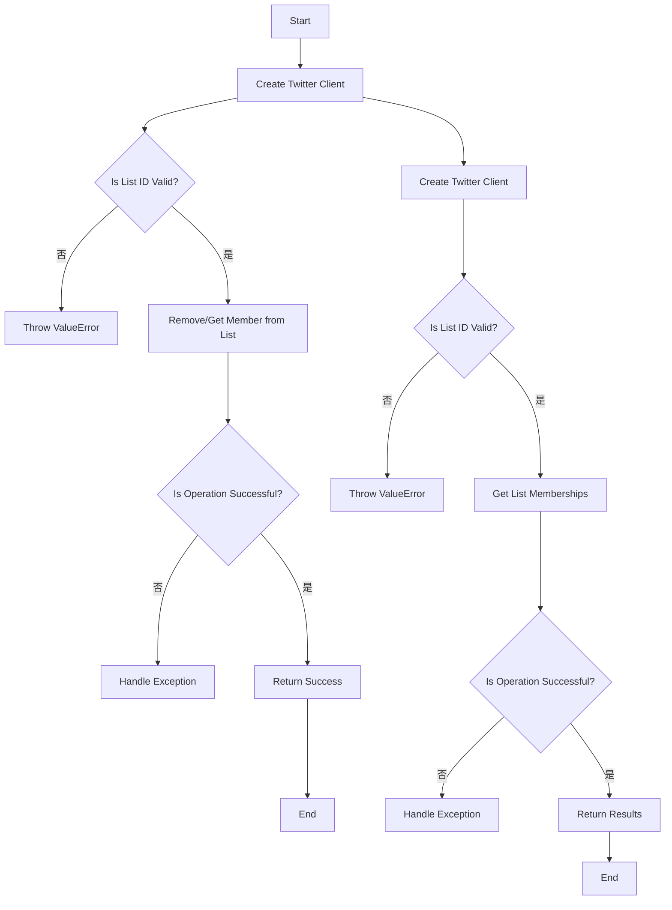

## 类结构

```
TwitterRemoveListMemberBlock (Concrete Block)
├── Input
│   ├── credentials
│   ├── list_id
│   └── user_id
└── Output
    └── success
TwitterAddListMemberBlock (Concrete Block)
├── Input
│   ├── credentials
│   ├── list_id
│   └── user_id
└── Output
    └── success
TwitterGetListMembersBlock (Concrete Block)
├── Input
│   ├── credentials
│   ├── list_id
│   ├── max_results
│   ├── pagination_token
│   └── expansions
└── Output
    └── ids
TwitterGetListMembershipsBlock (Concrete Block)
├── Input
│   ├── credentials
│   ├── user_id
│   ├── max_results
│   ├── pagination_token
│   └── expansions
└── Output
    └── list_ids
```

## 全局变量及字段


### `TEST_CREDENTIALS`
    
Test Twitter credentials used for testing purposes.

类型：`TwitterCredentials`
    


### `TEST_CREDENTIALS_INPUT`
    
Test input for Twitter credentials used for testing purposes.

类型：`TwitterCredentialsInput`
    


### `TWITTER_OAUTH_IS_CONFIGURED`
    
Flag indicating whether Twitter OAuth is configured for the application.

类型：`bool`
    


### `TwitterRemoveListMemberBlock.id`
    
Unique identifier for the block.

类型：`str`
    


### `TwitterRemoveListMemberBlock.description`
    
Description of the block's functionality.

类型：`str`
    


### `TwitterRemoveListMemberBlock.categories`
    
Categories to which the block belongs.

类型：`set[BlockCategory]`
    


### `TwitterRemoveListMemberBlock.input_schema`
    
Schema for the block's input data.

类型：`Input`
    


### `TwitterRemoveListMemberBlock.output_schema`
    
Schema for the block's output data.

类型：`Output`
    


### `TwitterRemoveListMemberBlock.disabled`
    
Flag indicating whether the block is disabled due to missing configuration.

类型：`bool`
    


### `TwitterRemoveListMemberBlock.test_input`
    
Test input data for the block.

类型：`dict`
    


### `TwitterRemoveListMemberBlock.test_credentials`
    
Test credentials used for testing the block.

类型：`TwitterCredentials`
    


### `TwitterRemoveListMemberBlock.test_output`
    
Test expected output data for the block.

类型：`list[tuple]`
    


### `TwitterRemoveListMemberBlock.test_mock`
    
Mock data used for testing the block.

类型：`dict`
    


### `TwitterAddListMemberBlock.id`
    
Unique identifier for the block.

类型：`str`
    


### `TwitterAddListMemberBlock.description`
    
Description of the block's functionality.

类型：`str`
    


### `TwitterAddListMemberBlock.categories`
    
Categories to which the block belongs.

类型：`set[BlockCategory]`
    


### `TwitterAddListMemberBlock.input_schema`
    
Schema for the block's input data.

类型：`Input`
    


### `TwitterAddListMemberBlock.output_schema`
    
Schema for the block's output data.

类型：`Output`
    


### `TwitterAddListMemberBlock.disabled`
    
Flag indicating whether the block is disabled due to missing configuration.

类型：`bool`
    


### `TwitterAddListMemberBlock.test_input`
    
Test input data for the block.

类型：`dict`
    


### `TwitterAddListMemberBlock.test_credentials`
    
Test credentials used for testing the block.

类型：`TwitterCredentials`
    


### `TwitterAddListMemberBlock.test_output`
    
Test expected output data for the block.

类型：`list[tuple]`
    


### `TwitterAddListMemberBlock.test_mock`
    
Mock data used for testing the block.

类型：`dict`
    


### `TwitterGetListMembersBlock.id`
    
Unique identifier for the block.

类型：`str`
    


### `TwitterGetListMembersBlock.description`
    
Description of the block's functionality.

类型：`str`
    


### `TwitterGetListMembersBlock.categories`
    
Categories to which the block belongs.

类型：`set[BlockCategory]`
    


### `TwitterGetListMembersBlock.input_schema`
    
Schema for the block's input data.

类型：`Input`
    


### `TwitterGetListMembersBlock.output_schema`
    
Schema for the block's output data.

类型：`Output`
    


### `TwitterGetListMembersBlock.disabled`
    
Flag indicating whether the block is disabled due to missing configuration.

类型：`bool`
    


### `TwitterGetListMembersBlock.test_input`
    
Test input data for the block.

类型：`dict`
    


### `TwitterGetListMembersBlock.test_credentials`
    
Test credentials used for testing the block.

类型：`TwitterCredentials`
    


### `TwitterGetListMembersBlock.test_output`
    
Test expected output data for the block.

类型：`list[tuple]`
    


### `TwitterGetListMembersBlock.test_mock`
    
Mock data used for testing the block.

类型：`dict`
    


### `TwitterGetListMembershipsBlock.id`
    
Unique identifier for the block.

类型：`str`
    


### `TwitterGetListMembershipsBlock.description`
    
Description of the block's functionality.

类型：`str`
    


### `TwitterGetListMembershipsBlock.categories`
    
Categories to which the block belongs.

类型：`set[BlockCategory]`
    


### `TwitterGetListMembershipsBlock.input_schema`
    
Schema for the block's input data.

类型：`Input`
    


### `TwitterGetListMembershipsBlock.output_schema`
    
Schema for the block's output data.

类型：`Output`
    


### `TwitterGetListMembershipsBlock.disabled`
    
Flag indicating whether the block is disabled due to missing configuration.

类型：`bool`
    


### `TwitterGetListMembershipsBlock.test_input`
    
Test input data for the block.

类型：`dict`
    


### `TwitterGetListMembershipsBlock.test_credentials`
    
Test credentials used for testing the block.

类型：`TwitterCredentials`
    


### `TwitterGetListMembershipsBlock.test_output`
    
Test expected output data for the block.

类型：`list[tuple]`
    


### `TwitterGetListMembershipsBlock.test_mock`
    
Mock data used for testing the block.

类型：`dict`
    
    

## 全局函数及方法


### `handle_tweepy_exception`

This function handles exceptions raised by the Tweepy library and returns a formatted error message.

参数：

- `e`：`Exception`，The exception object that was raised.

返回值：`str`，A formatted error message describing the exception.

#### 流程图

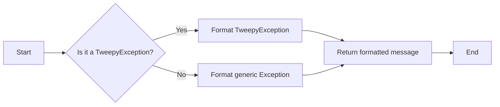

#### 带注释源码

```python
def handle_tweepy_exception(e: Exception) -> str:
    if isinstance(e, tweepy.TweepyException):
        return f"An error occurred with Tweepy: {e}"
    else:
        return f"An unexpected error occurred: {e}"
```


### `TwitterGetListMembershipsBlock.get_list_memberships`

Retrieves all Lists that a specified user is a member of.

参数：

- `credentials`：`TwitterCredentials`，Twitter credentials for authentication.
- `user_id`：`str`，The ID of the user whose List memberships to retrieve.
- `max_results`：`int | None`，Maximum number of results per page (1-100).
- `pagination_token`：`str | None`，Token for pagination of results.
- `expansions`：`ListExpansionsFilter | None`，Expansions to include in the response.
- `user_fields`：`TweetUserFieldsFilter | None`，User fields to include in the response.
- `list_fields`：`ListFieldsFilter | None`，List fields to include in the response.

返回值：`list[dict]`，List membership data.

#### 流程图

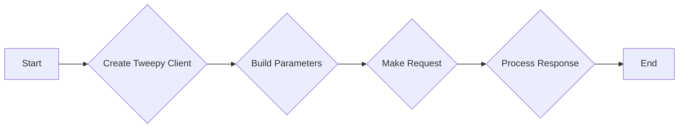

#### 带注释源码

```python
    @staticmethod
    def get_list_memberships(
        credentials: TwitterCredentials,
        user_id: str,
        max_results: int | None,
        pagination_token: str | None,
        expansions: ListExpansionsFilter | None,
        user_fields: TweetUserFieldsFilter | None,
        list_fields: ListFieldsFilter | None,
    ):
        try:
            client = tweepy.Client(
                bearer_token=credentials.access_token.get_secret_value()
            )

            params = {
                "id": user_id,
                "max_results": max_results,
                "pagination_token": (
                    None if pagination_token == "" else pagination_token
                ),
                "user_auth": False,
            }

            params = (
                ListExpansionsBuilder(params)
                .add_expansions(expansions)
                .add_user_fields(user_fields)
                .add_list_fields(list_fields)
                .build()
            )

            response = cast(Response, client.get_list_memberships(**params))

            meta = {}
            included = {}
            next_token = None
            list_ids = []

            if response.meta:
                meta = response.meta
                next_token = meta.get("next_token")

            if response.includes:
                included = IncludesSerializer.serialize(response.includes)

            if response.data:
                data = ResponseDataSerializer.serialize_list(response.data)
                list_ids = [str(lst.id) for lst in response.data]
                return data, included, meta, list_ids, next_token

            raise Exception("List memberships not found")

        except tweepy.TweepyException:
            raise
        except Exception:
            raise
```


### UserExpansionsBuilder

This class is used to build parameters for Twitter API requests that involve user expansions.

参数：

- `params`: `dict`，The initial parameters for the API request.
- `expansions`: `UserExpansionsFilter | None`，The user expansions to include in the request.
- `tweet_fields`: `TweetFieldsFilter | None`，The tweet fields to include in the request.
- `user_fields`: `TweetUserFieldsFilter | None`，The user fields to include in the request.

返回值：`dict`，The built parameters for the API request.

#### 流程图

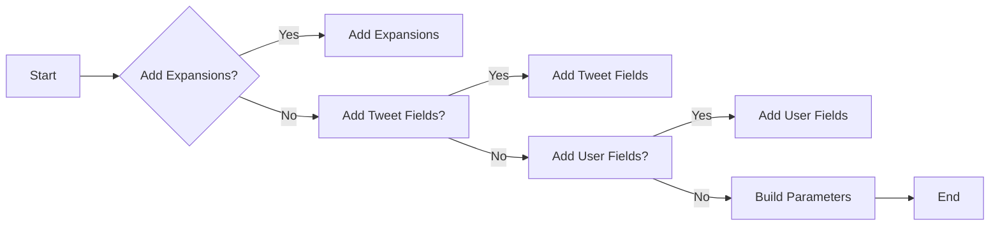

#### 带注释源码

```python
class UserExpansionsBuilder:
    def __init__(self, params: dict):
        self.params = params

    def add_expansions(self, expansions: UserExpansionsFilter | None) -> 'UserExpansionsBuilder':
        if expansions:
            self.params['expansions'] = expansions
        return self

    def add_tweet_fields(self, tweet_fields: TweetFieldsFilter | None) -> 'UserExpansionsBuilder':
        if tweet_fields:
            self.params['tweet_fields'] = tweet_fields
        return self

    def add_user_fields(self, user_fields: TweetUserFieldsFilter | None) -> 'UserExpansionsBuilder':
        if user_fields:
            self.params['user_fields'] = user_fields
        return self

    def build(self) -> dict:
        return self.params
```


### `IncludesSerializer.serialize`

将Tweepy响应中的`includes`字段序列化为字典。

参数：

- `includes`: `dict`，Tweepy响应中的`includes`字段。

返回值：`dict`，序列化后的字典。

#### 流程图

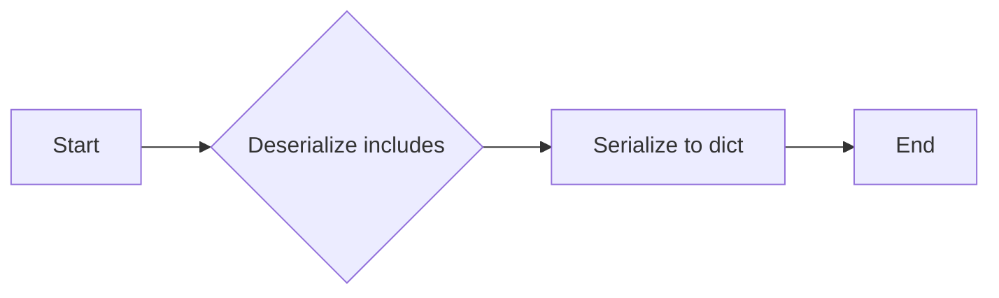

#### 带注释源码

```python
class IncludesSerializer:
    @staticmethod
    def serialize(includes: dict):
        """
        Serialize the 'includes' field from a Tweepy response to a dictionary.

        :param includes: dict, the 'includes' field from a Tweepy response.
        :return: dict, the serialized dictionary.
        """
        serialized_dict = {}
        for key, value in includes.items():
            if isinstance(value, dict):
                serialized_dict[key] = IncludesSerializer.serialize(value)
            else:
                serialized_dict[key] = value
        return serialized_dict
```


### `TwitterGetListMembersBlock.get_list_members`

This method retrieves the members of a specified Twitter List.

参数：

- `credentials`：`TwitterCredentials`，Twitter credentials object containing access token and secret.
- `list_id`：`str`，The ID of the List to get members from.
- `max_results`：`int | None`，Maximum number of results per page (1-100).
- `pagination_token`：`str | None`，Token for pagination of results.
- `expansions`：`UserExpansionsFilter | None`，Expansions to include in the response.
- `tweet_fields`：`TweetFieldsFilter | None`，Fields to include in the response for tweets.
- `user_fields`：`TweetUserFieldsFilter | None`，Fields to include in the response for users.

返回值：`tuple`，A tuple containing the following elements:
- `user_ids`：`list[str]`，List of member user IDs.
- `usernames`：`list[str]`，List of member usernames.
- `data`：`list[dict]`，Complete user data for list members.
- `included`：`dict`，Additional data requested via expansions.
- `meta`：`dict`，Metadata including pagination info.
- `next_token`：`str | None`，Next token for pagination.

#### 流程图

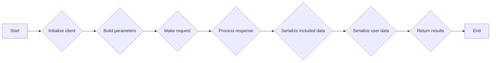

#### 带注释源码

```python
    @staticmethod
    def get_list_members(
        credentials: TwitterCredentials,
        list_id: str,
        max_results: int | None,
        pagination_token: str | None,
        expansions: UserExpansionsFilter | None,
        tweet_fields: TweetFieldsFilter | None,
        user_fields: TweetUserFieldsFilter | None,
    ):
        try:
            client = tweepy.Client(
                bearer_token=credentials.access_token.get_secret_value()
            )

            params = {
                "id": list_id,
                "max_results": max_results,
                "pagination_token": (
                    None if pagination_token == "" else pagination_token
                ),
                "user_auth": False,
            }

            params = (
                UserExpansionsBuilder(params)
                .add_expansions(expansions)
                .add_tweet_fields(tweet_fields)
                .add_user_fields(user_fields)
                .build()
            )

            response = cast(Response, client.get_list_members(**params))

            meta = {}
            included = {}
            next_token = None
            user_ids = []
            usernames = []

            if response.meta:
                meta = response.meta
                next_token = meta.get("next_token")

            if response.includes:
                included = IncludesSerializer.serialize(response.includes)

            if response.data:
                data = ResponseDataSerializer.serialize_list(response.data)
                user_ids = [str(user.id) for user in response.data]
                usernames = [user.username for user in response.data]
                return user_ids, usernames, data, included, meta, next_token

            raise Exception("List members not found")

        except tweepy.TweepyException:
            raise
```


### `TwitterRemoveListMemberBlock.__init__`

This method initializes the `TwitterRemoveListMemberBlock` class, setting up its properties and configurations.

参数：

- `id`: `str`，The unique identifier for the block.
- `description`: `str`，A description of the block's functionality.
- `categories`: `set`，A set of categories that the block belongs to.
- `input_schema`: `BlockSchemaInput`，The schema for the input data of the block.
- `output_schema`: `BlockSchemaOutput`，The schema for the output data of the block.
- `disabled`: `bool`，Whether the block is disabled or not.
- `test_input`: `dict`，The test input data for the block.
- `test_credentials`: `TwitterCredentials`，The test credentials for the block.
- `test_output`: `list`，The expected test output data for the block.
- `test_mock`: `dict`，Mock functions for testing.

返回值：`None`，This method does not return any value.

#### 流程图

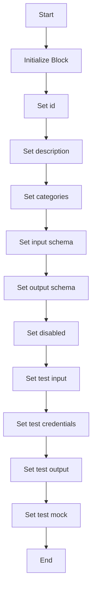

#### 带注释源码

```python
def __init__(self):
    super().__init__(
        id="5a3d1320-a62f-11ef-b7ce-a79e7656bcb0",
        description="This block removes a specified user from a Twitter List owned by the authenticated user.",
        categories={BlockCategory.SOCIAL},
        input_schema=TwitterRemoveListMemberBlock.Input,
        output_schema=TwitterRemoveListMemberBlock.Output,
        disabled=not TWITTER_OAUTH_IS_CONFIGURED,
        test_input={
            "list_id": "123456789",
            "user_id": "987654321",
            "credentials": TEST_CREDENTIALS_INPUT,
        },
        test_credentials=TEST_CREDENTIALS,
        test_output=[("success", True)],
        test_mock={"remove_list_member": lambda *args, **kwargs: True},
    )
```


### TwitterRemoveListMemberBlock.remove_list_member

Removes a member from a Twitter List that the authenticated user owns.

参数：

- `credentials`：`TwitterCredentials`，The Twitter credentials used to authenticate the request.
- `list_id`：`str`，The ID of the List to remove the member from.
- `user_id`：`str`，The ID of the user to remove from the List.

返回值：`bool`，Whether the member was successfully removed.

#### 流程图

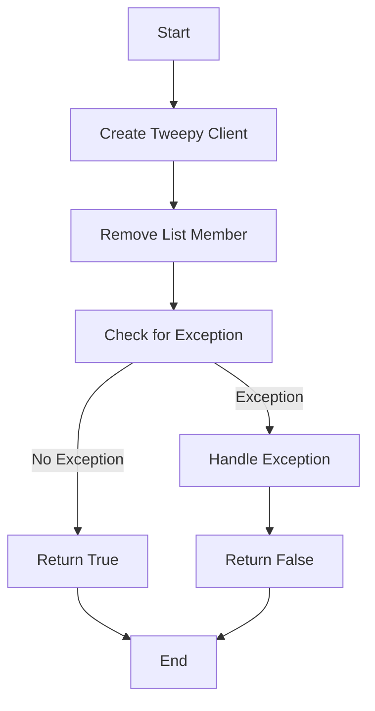

#### 带注释源码

```python
@staticmethod
def remove_list_member(credentials: TwitterCredentials, list_id: str, user_id: str):
    try:
        client = tweepy.Client(
            bearer_token=credentials.access_token.get_secret_value()
        )
        client.remove_list_member(id=list_id, user_id=user_id, user_auth=False)
        return True
    except tweepy.TweepyException:
        raise
    except Exception:
        raise
```


### `TwitterRemoveListMemberBlock.run`

Removes a specified user from a Twitter List owned by the authenticated user.

参数：

- `input_data`：`Input`，The input data for the block, containing the list ID and user ID to remove.
- `credentials`：`TwitterCredentials`，The credentials used to authenticate with Twitter API.

返回值：`BlockOutput`，The output of the block, indicating whether the member was successfully removed.

#### 流程图

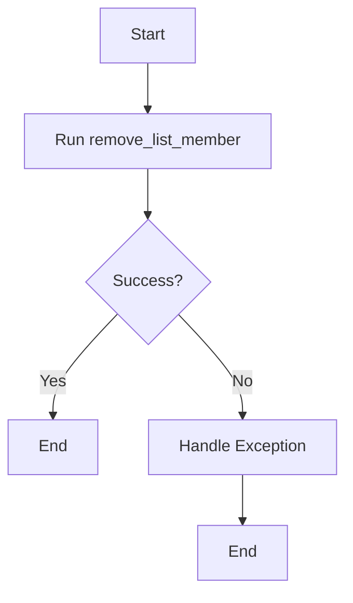

#### 带注释源码

```python
async def run(
    self,
    input_data: Input,
    *,
    credentials: TwitterCredentials,
    **kwargs,
) -> BlockOutput:
    try:
        success = self.remove_list_member(
            credentials, input_data.list_id, input_data.user_id
        )
        yield "success", success

    except Exception as e:
        yield "error", handle_tweepy_exception(e)
```


### TwitterAddListMemberBlock.__init__

This method initializes the `TwitterAddListMemberBlock` class, setting up its properties and configurations.

参数：

- `self`：`None`，The instance of the class being initialized.
- `id`：`str`，The unique identifier for the block.
- `description`：`str`，A description of the block's functionality.
- `categories`：`set`，A set of categories that the block belongs to.
- `input_schema`：`BlockSchemaInput`，The schema for the input data of the block.
- `output_schema`：`BlockSchemaOutput`，The schema for the output data of the block.
- `disabled`：`bool`，A flag indicating whether the block is disabled.
- `test_input`：`dict`，The test input data for the block.
- `test_credentials`：`TwitterCredentials`，The test credentials for the block.
- `test_output`：`list`，The expected test output data for the block.
- `test_mock`：`dict`，Mock functions for testing the block.

返回值：`None`，No return value.

#### 流程图

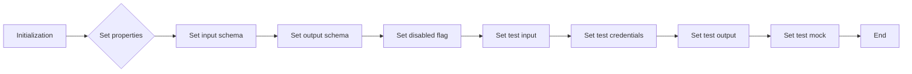

#### 带注释源码

```python
def __init__(self):
    super().__init__(
        id="3ee8284e-a62f-11ef-84e4-8f6e2cbf0ddb",
        description="This block adds a specified user to a Twitter List owned by the authenticated user.",
        categories={BlockCategory.SOCIAL},
        input_schema=TwitterAddListMemberBlock.Input,
        output_schema=TwitterAddListMemberBlock.Output,
        disabled=not TWITTER_OAUTH_IS_CONFIGURED,
        test_input={
            "list_id": "123456789",
            "user_id": "987654321",
            "credentials": TEST_CREDENTIALS_INPUT,
        },
        test_credentials=TEST_CREDENTIALS,
        test_output=[("success", True)],
        test_mock={"add_list_member": lambda *args, **kwargs: True},
    )
```


### TwitterAddListMemberBlock.add_list_member

This method adds a specified user to a Twitter List owned by the authenticated user.

参数：

- `credentials`：`TwitterCredentials`，The Twitter credentials required to authenticate the request.
- `list_id`：`str`，The ID of the List to add the member to.
- `user_id`：`str`，The ID of the user to add to the List.

返回值：`bool`，Whether the member was successfully added.

#### 流程图

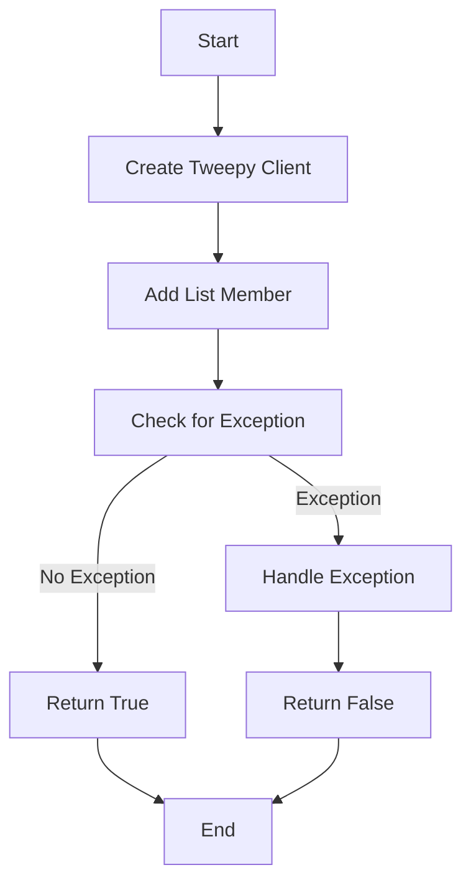

#### 带注释源码

```python
@staticmethod
def add_list_member(credentials: TwitterCredentials, list_id: str, user_id: str):
    try:
        client = tweepy.Client(
            bearer_token=credentials.access_token.get_secret_value()
        )
        client.add_list_member(id=list_id, user_id=user_id, user_auth=False)
        return True
    except tweepy.TweepyException:
        raise
    except Exception:
        raise
```


### TwitterAddListMemberBlock.run

This method adds a specified user to a Twitter List owned by the authenticated user.

参数：

- `input_data`：`Input`，The input data for the block, containing the list ID and user ID to add to the list.
- `credentials`：`TwitterCredentials`，The credentials used to authenticate with Twitter API.
- `**kwargs`：Any additional keyword arguments.

返回值：`BlockOutput`，The output of the block, indicating whether the member was successfully added.

#### 流程图

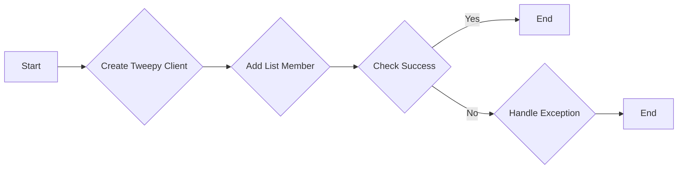

#### 带注释源码

```python
async def run(
    self,
    input_data: Input,
    *,
    credentials: TwitterCredentials,
    **kwargs,
) -> BlockOutput:
    try:
        success = self.add_list_member(
            credentials, input_data.list_id, input_data.user_id
        )
        yield "success", success

    except Exception as e:
        yield "error", handle_tweepy_exception(e)
```


### TwitterGetListMembersBlock.__init__

This method initializes the `TwitterGetListMembersBlock` class, setting up its properties and configurations.

参数：

- `id`: `str`，The unique identifier for the block.
- `description`: `str`，A description of the block's functionality.
- `categories`: `set`，A set of categories that the block belongs to.
- `input_schema`: `BlockSchemaInput`，The schema for the input data of the block.
- `output_schema`: `BlockSchemaOutput`，The schema for the output data of the block.
- `disabled`: `bool`，Whether the block is disabled or not.
- `test_input`: `dict`，The test input data for the block.
- `test_credentials`: `TwitterCredentials`，The test credentials for the block.
- `test_output`: `list`，The expected test output data for the block.
- `test_mock`: `dict`，Mock functions for testing the block.

返回值：无

#### 流程图

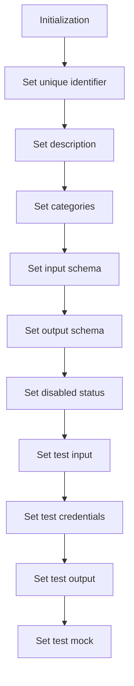

#### 带注释源码

```python
def __init__(self):
    super().__init__(
        id="4dba046e-a62f-11ef-b69a-87240c84b4c7",
        description="This block retrieves the members of a specified Twitter List.",
        categories={BlockCategory.SOCIAL},
        input_schema=TwitterGetListMembersBlock.Input,
        output_schema=TwitterGetListMembersBlock.Output,
        disabled=not TWITTER_OAUTH_IS_CONFIGURED,
        test_input={
            "list_id": "123456789",
            "max_results": 2,
            "pagination_token": None,
            "credentials": TEST_CREDENTIALS_INPUT,
            "expansions": None,
            "tweet_fields": None,
            "user_fields": None,
        },
        test_credentials=TEST_CREDENTIALS,
        test_output=[
            ("ids", ["12345", "67890"]),
            ("usernames", ["testuser1", "testuser2"]),
            (
                "data",
                [
                    {"id": "12345", "username": "testuser1"},
                    {"id": "67890", "username": "testuser2"},
                ],
            ),
        ],
        test_mock={
            "get_list_members": lambda *args, **kwargs: (
                ["12345", "67890"],
                ["testuser1", "testuser2"],
                [
                    {"id": "12345", "username": "testuser1"},
                    {"id": "67890", "username": "testuser2"},
                ],
                {},
                {},
                None,
            )
        },
    )
```


### TwitterGetListMembersBlock.get_list_members

Retrieves the members of a specified Twitter List.

参数：

- `credentials`：`TwitterCredentials`，Twitter credentials object containing access token.
- `list_id`：`str`，The ID of the List to get members from.
- `max_results`：`int | None`，Maximum number of results per page (1-100).
- `pagination_token`：`str | None`，Token for pagination of results.
- `expansions`：`UserExpansionsFilter | None`，Expansions to include in the response.
- `tweet_fields`：`TweetFieldsFilter | None`，Fields to include in the tweet data.
- `user_fields`：`TweetUserFieldsFilter | None`，Fields to include in the user data.

返回值：`tuple`，A tuple containing the following elements:
- `user_ids`：`list[str]`，List of member user IDs.
- `usernames`：`list[str]`，List of member usernames.
- `data`：`list[dict]`，Complete user data for list members.
- `included`：`dict`，Additional data requested via expansions.
- `meta`：`dict`，Metadata including pagination info.
- `next_token`：`str`，Next token for pagination.

#### 流程图

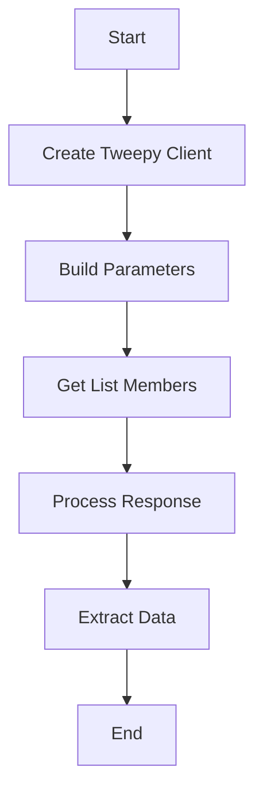

#### 带注释源码

```python
    @staticmethod
    def get_list_members(
        credentials: TwitterCredentials,
        list_id: str,
        max_results: int | None,
        pagination_token: str | None,
        expansions: UserExpansionsFilter | None,
        tweet_fields: TweetFieldsFilter | None,
        user_fields: TweetUserFieldsFilter | None,
    ):
        try:
            client = tweepy.Client(
                bearer_token=credentials.access_token.get_secret_value()
            )

            params = {
                "id": list_id,
                "max_results": max_results,
                "pagination_token": (
                    None if pagination_token == "" else pagination_token
                ),
                "user_auth": False,
            }

            params = (
                UserExpansionsBuilder(params)
                .add_expansions(expansions)
                .add_tweet_fields(tweet_fields)
                .add_user_fields(user_fields)
                .build()
            )

            response = cast(Response, client.get_list_members(**params))

            meta = {}
            included = {}
            next_token = None
            user_ids = []
            usernames = []

            if response.meta:
                meta = response.meta
                next_token = meta.get("next_token")

            if response.includes:
                included = IncludesSerializer.serialize(response.includes)

            if response.data:
                data = ResponseDataSerializer.serialize_list(response.data)
                user_ids = [str(user.id) for user in response.data]
                usernames = [user.username for user in response.data]
                return user_ids, usernames, data, included, meta, next_token

            raise Exception("List members not found")

        except tweepy.TweepyException:
            raise
```


### TwitterGetListMembersBlock.run

Retrieves the members of a specified Twitter List.

参数：

- `input_data`：`Input`，The input data for the block.
- `credentials`：`TwitterCredentials`，The credentials for accessing the Twitter API.
- `**kwargs`：`Any`，Additional keyword arguments.

返回值：`BlockOutput`，The output of the block containing the member user IDs, usernames, next token for pagination, complete user data, additional data requested via expansions, and metadata including pagination info.

#### 流程图

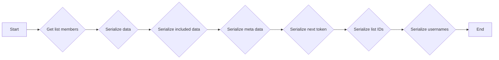

#### 带注释源码

```python
async def run(
    self,
    input_data: Input,
    *,
    credentials: TwitterCredentials,
    **kwargs,
) -> BlockOutput:
    try:
        ids, usernames, data, included, meta, next_token = self.get_list_members(
            credentials,
            input_data.list_id,
            input_data.max_results,
            input_data.pagination_token,
            input_data.expansions,
            input_data.tweet_fields,
            input_data.user_fields,
        )

        if ids:
            yield "ids", ids
        if usernames:
            yield "usernames", usernames
        if next_token:
            yield "next_token", next_token
        if data:
            yield "data", data
        if included:
            yield "included", included
        if meta:
            yield "meta", meta

    except Exception as e:
        yield "error", handle_tweepy_exception(e)
```


### TwitterGetListMembershipsBlock.__init__

This method initializes the `TwitterGetListMembershipsBlock` class, setting up its properties and configurations.

参数：

- `self`：`None`，The instance of the class being initialized.
- `id`：`str`，The unique identifier for the block.
- `description`：`str`，A description of the block's functionality.
- `categories`：`set`，A set of categories that the block belongs to.
- `input_schema`：`BlockSchemaInput`，The schema for the input data of the block.
- `output_schema`：`BlockSchemaOutput`，The schema for the output data of the block.
- `disabled`：`bool`，A flag indicating whether the block is disabled.
- `test_input`：`dict`，The test input data for the block.
- `test_credentials`：`TwitterCredentials`，The test credentials for the block.
- `test_output`：`list`，The expected test output data for the block.
- `test_mock`：`dict`，Mock functions for testing the block.

返回值：`None`，No return value.

#### 流程图

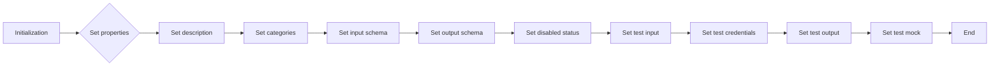

#### 带注释源码

```python
def __init__(self):
    super().__init__(
        id="46e6429c-a62f-11ef-81c0-2b55bc7823ba",
        description="This block retrieves all Lists that a specified user is a member of.",
        categories={BlockCategory.SOCIAL},
        input_schema=TwitterGetListMembershipsBlock.Input,
        output_schema=TwitterGetListMembershipsBlock.Output,
        disabled=not TWITTER_OAUTH_IS_CONFIGURED,
        test_input={
            "user_id": "123456789",
            "max_results": 1,
            "pagination_token": None,
            "credentials": TEST_CREDENTIALS_INPUT,
            "expansions": None,
            "list_fields": None,
            "user_fields": None,
        },
        test_credentials=TEST_CREDENTIALS,
        test_output=[
            ("list_ids", ["84839422"]),
            ("data", [{"id": "84839422"}]),
        ],
        test_mock={
            "get_list_memberships": lambda *args, **kwargs: (
                [{"id": "84839422"}],
                {},
                {},
                ["84839422"],
                None,
            )
        },
    )
```


### TwitterGetListMembershipsBlock.get_list_memberships

This method retrieves all Lists that a specified user is a member of using the Twitter API.

参数：

- `credentials`：`TwitterCredentials`，Twitter credentials object containing access token and secret.
- `user_id`：`str`，The ID of the user whose List memberships to retrieve.
- `max_results`：`int | None`，Maximum number of results per page (1-100).
- `pagination_token`：`str | None`，Token for pagination of results.
- `expansions`：`ListExpansionsFilter | None`，Expansions to include in the response.
- `user_fields`：`TweetUserFieldsFilter | None`，User fields to include in the response.
- `list_fields`：`ListFieldsFilter | None`，List fields to include in the response.

返回值：`list[dict]`，List membership data.

#### 流程图

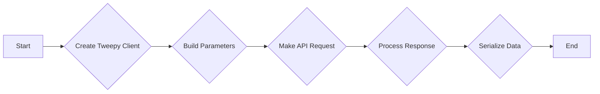

#### 带注释源码

```python
@staticmethod
def get_list_memberships(
    credentials: TwitterCredentials,
    user_id: str,
    max_results: int | None,
    pagination_token: str | None,
    expansions: ListExpansionsFilter | None,
    user_fields: TweetUserFieldsFilter | None,
    list_fields: ListFieldsFilter | None,
):
    try:
        client = tweepy.Client(
            bearer_token=credentials.access_token.get_secret_value()
        )

        params = {
            "id": user_id,
            "max_results": max_results,
            "pagination_token": (
                None if pagination_token == "" else pagination_token
            ),
            "user_auth": False,
        }

        params = (
            ListExpansionsBuilder(params)
            .add_expansions(expansions)
            .add_user_fields(user_fields)
            .add_list_fields(list_fields)
            .build()
        )

        response = cast(Response, client.get_list_memberships(**params))

        meta = {}
        included = {}
        next_token = None
        list_ids = []

        if response.meta:
            meta = response.meta
            next_token = meta.get("next_token")

        if response.includes:
            included = IncludesSerializer.serialize(response.includes)

        if response.data:
            data = ResponseDataSerializer.serialize_list(response.data)
            list_ids = [str(lst.id) for lst in response.data]
            return data, included, meta, list_ids, next_token

        raise Exception("List memberships not found")

    except tweepy.TweepyException:
        raise
    except Exception:
        raise
```


### TwitterGetListMembershipsBlock.run

Retrieves all Lists that a specified user is a member of.

参数：

- `input_data`：`Input`，The input data for the block.
- `credentials`：`TwitterCredentials`，The Twitter credentials for authentication.
- `**kwargs`：`Any`，Additional keyword arguments.

返回值：`BlockOutput`，The output of the block containing the list IDs, next token, data, included, and meta information.

#### 流程图

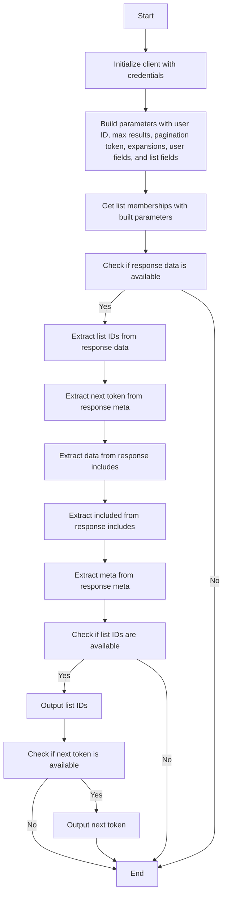

#### 带注释源码

```python
async def run(
    self,
    input_data: Input,
    *,
    credentials: TwitterCredentials,
    **kwargs,
) -> BlockOutput:
    try:
        data, included, meta, list_ids, next_token = self.get_list_memberships(
            credentials,
            input_data.user_id,
            input_data.max_results,
            input_data.pagination_token,
            input_data.expansions,
            input_data.user_fields,
            input_data.list_fields,
        )

        if list_ids:
            yield "list_ids", list_ids
        if next_token:
            yield "next_token", next_token
        if data:
            yield "data", data
        if included:
            yield "included", included
        if meta:
            yield "meta", meta

    except Exception as e:
        yield "error", handle_tweepy_exception(e)
``` 


## 关键组件


### 张量索引与惰性加载

张量索引与惰性加载是代码中处理数据结构的核心组件，它允许对大型数据集进行高效访问，同时减少内存消耗。

### 反量化支持

反量化支持是代码中用于处理量化数据的核心组件，它允许在量化过程中进行逆量化操作，以恢复原始数据。

### 量化策略

量化策略是代码中用于优化数据表示和处理的组件，它通过减少数据精度来降低内存和计算需求。


## 问题及建议


### 已知问题

-   **全局变量和函数依赖性**：代码中存在多个全局变量和函数，如 `TWITTER_OAUTH_IS_CONFIGURED`、`handle_tweepy_exception` 等，这些变量和函数的详细实现和依赖关系没有在代码中明确说明，可能导致维护和理解上的困难。
-   **异常处理**：代码中的异常处理主要依赖于 `handle_tweepy_exception` 函数，但没有提供该函数的具体实现，可能存在异常处理不全面或错误处理逻辑不清晰的问题。
-   **代码复用**：多个类中存在相似的代码结构，如 `Input` 和 `Output` 类，可以考虑使用继承或组合来减少代码重复。
-   **异步代码**：代码中使用了异步函数 `run`，但没有明确说明异步操作的具体实现和依赖，可能存在异步操作和同步操作混合使用的问题。

### 优化建议

-   **明确全局变量和函数的实现**：在代码中添加对全局变量和函数的详细说明，包括其功能和依赖关系，以便于维护和理解。
-   **优化异常处理**：提供 `handle_tweepy_exception` 函数的具体实现，确保异常处理全面且逻辑清晰。
-   **减少代码重复**：通过继承或组合减少代码重复，提高代码的可维护性和可读性。
-   **明确异步操作**：在代码中明确说明异步操作的具体实现和依赖，确保异步操作的正确性和效率。
-   **代码格式化**：对代码进行格式化，提高代码的可读性和一致性。
-   **单元测试**：增加单元测试，确保代码的正确性和稳定性。
-   **文档注释**：为代码添加必要的文档注释，提高代码的可读性和可维护性。


## 其它


### 设计目标与约束

- 设计目标：
  - 实现Twitter列表成员管理功能，包括添加、移除和获取成员。
  - 提供异步执行接口，以支持高并发处理。
  - 确保代码的可维护性和可扩展性。
  - 遵循Twitter API的使用规范和限制。

- 约束条件：
  - 必须使用Twitter API进行操作。
  - 需要用户授权和认证。
  - 限制每页返回的结果数量。
  - 需要处理分页数据。

### 错误处理与异常设计

- 错误处理：
  - 使用try-except语句捕获和处理异常。
  - 自定义异常处理函数`handle_tweepy_exception`处理Twitter API异常。
  - 将异常信息转换为用户友好的错误消息。

- 异常设计：
  - `TweepyException`：处理Twitter API异常。
  - `Exception`：处理其他未预料的异常。

### 数据流与状态机

- 数据流：
  - 输入数据通过`run`方法传递给相应的处理函数。
  - 处理函数执行Twitter API调用并返回结果。
  - 结果通过`yield`语句返回给调用者。

- 状态机：
  - 每个处理函数根据输入数据和API响应状态执行相应的操作。
  - 状态包括成功、错误和分页。

### 外部依赖与接口契约

- 外部依赖：
  - `tweepy`：用于与Twitter API交互。
  - `typing`：用于类型注解。

- 接口契约：
  - `TwitterCredentials`：用户认证信息。
  - `Block`：数据处理块基类。
  - `Input`和`Output`：输入和输出数据结构。


    